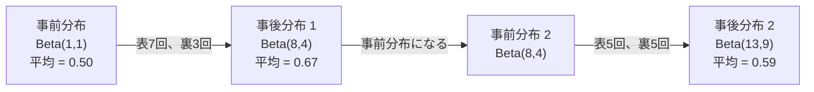

# ベイズの定理

> 確率は、あなたが何を予想するかを扱います。ベイズの定理は、あなたが何を学ぶかを扱います。

**種別:** 構築
**言語:** Python
**前提条件:** Phase 1、Lesson 06（確率の基礎）
**所要時間:** 約75分

## 学習目標

- 事前確率、尤度、証拠からベイズの定理を使って事後確率を計算する
- ラプラス平滑化とlog空間での計算を使い、ナイーブベイズのテキスト分類器をスクラッチで構築する
- MLEとMAP推定を比較し、MAPがL2正則化に対応する理由を説明する
- A/Bテストのために、Beta-Binomialの共役事前分布を使った逐次ベイズ更新を実装する

## 問題

ある医療検査は99%正確です。検査で陽性になりました。実際にその病気である確率はどれくらいでしょうか？

多くの人は99%と答えます。本当の答えは、その病気がどれほど珍しいかに依存します。もし1万人に1人しかその病気にかからないなら、陽性結果が出ても、実際に病気である確率は約1%にすぎません。陽性結果の残り99%は、健康な人から出た誤警報です。

これはひっかけ問題ではありません。ベイズの定理です。あらゆるスパムフィルター、あらゆる医療診断、不確実性を定量化するあらゆる機械学習モデルが、まさにこの推論を使っています。信念から始める。証拠を見る。更新する。

これを理解せずにMLシステムを作ると、モデル出力を誤解し、悪いしきい値を設定し、自信過剰な予測を出荷してしまいます。

## 概念

### 同時確率からベイズへ

Lesson 06で、条件付き確率は次のように書けると学びました。

```
P(A|B) = P(A and B) / P(B)
```

対称的に、次も成り立ちます。

```
P(B|A) = P(A and B) / P(A)
```

どちらの式も同じ分子 P(A and B) を共有しています。これらを等しいものとして置き、並べ替えます。

```
P(A and B) = P(A|B) * P(B) = P(B|A) * P(A)

よって:

P(A|B) = P(B|A) * P(A) / P(B)
```

これがベイズの定理です。4つの量、1つの方程式です。

### 4つの構成要素

| 要素 | 名前 | 意味 |
|------|------|------|
| P(A\|B) | 事後確率 | 証拠Bを見た後の、Aに関する更新後の信念 |
| P(B\|A) | 尤度 | Aが真であるとき、証拠Bがどれだけ起こりやすいか |
| P(A) | 事前確率 | 証拠を見る前の、Aに関する信念 |
| P(B) | 証拠 | すべての可能性のもとでBを見る全確率 |

証拠項 P(B) は正規化係数として働きます。全確率の法則を使って展開できます。

```
P(B) = P(B|A) * P(A) + P(B|not A) * P(not A)
```

### 医療検査の例

ある病気は1万人に1人に影響します。検査は99%正確です（病気の人を99%検出し、1%の確率で偽陽性を出します）。

```
P(sick)          = 0.0001     (事前確率: 病気はまれ)
P(positive|sick) = 0.99       (尤度: 検査が検出する)
P(positive|healthy) = 0.01    (偽陽性率)

P(positive) = P(positive|sick) * P(sick) + P(positive|healthy) * P(healthy)
            = 0.99 * 0.0001 + 0.01 * 0.9999
            = 0.000099 + 0.009999
            = 0.010098

P(sick|positive) = P(positive|sick) * P(sick) / P(positive)
                 = 0.99 * 0.0001 / 0.010098
                 = 0.0098
                 = 0.98%
```

1%未満です。事前確率が支配的です。状態がまれな場合、正確な検査であっても、陽性の大半は偽陽性になります。これが、医師が確認検査を依頼する理由です。

### スパムフィルターの例

「lottery」という単語を含むメールを受け取りました。これはスパムでしょうか？

```
P(spam)                = 0.3      (30% of email is spam)
P("lottery"|spam)      = 0.05     (5% of spam emails contain "lottery")
P("lottery"|not spam)  = 0.001    (0.1% of legitimate emails contain "lottery")

P("lottery") = 0.05 * 0.3 + 0.001 * 0.7
             = 0.015 + 0.0007
             = 0.0157

P(spam|"lottery") = 0.05 * 0.3 / 0.0157
                  = 0.955
                  = 95.5%
```

1つの単語だけで、確率は30%から95.5%へ動きます。実際のスパムフィルターは、数百個の単語に対して同時にベイズを適用します。

### ナイーブベイズ: 独立性の仮定

ナイーブベイズは、クラスが与えられたとき、すべての特徴量が条件付き独立であると仮定して、これを複数特徴量へ拡張します。

```
P(class | feature_1, feature_2, ..., feature_n)
  = P(class) * P(feature_1|class) * P(feature_2|class) * ... * P(feature_n|class)
    / P(feature_1, feature_2, ..., feature_n)
```

「ナイーブ」な部分は、この独立性の仮定です。テキストでは、単語の出現は独立ではありません（「New」と「York」は相関しています）。それでも実務では驚くほどよく機能します。なぜなら、この分類器に必要なのはクラスを順位付けすることであり、較正された確率を出すことではないからです。

分母はすべてのクラスで同じなので、省略して分子だけを比較できます。

```
score(class) = P(class) * product of P(feature_i | class)
```

最も高いスコアのクラスを選びます。

### 最尤推定（MLE）

訓練データから P(feature|class) をどう得るのでしょうか？数えます。

```
P("free"|spam) = (number of spam emails containing "free") / (total spam emails)
```

これがMLEです。観測データが最も起こりやすくなるパラメータ値を選びます。尤度関数を最大化しており、離散的なカウントでは相対頻度に帰着します。

問題: 訓練中にある単語がスパムに一度も現れなかった場合、MLEはその単語の確率をゼロにします。未知の単語が1つあるだけで、積全体がゼロになります。これをラプラス平滑化で修正します。

```
P(word|class) = (count(word, class) + 1) / (total_words_in_class + vocabulary_size)
```

すべてのカウントに1を足すことで、確率がゼロになることを防ぎます。

### 最大事後確率推定（MAP）

MLEが問うのは、どのパラメータが P(data|parameters) を最大化するか、です。

MAPが問うのは、どのパラメータが P(parameters|data) を最大化するか、です。

ベイズの定理により、次が成り立ちます。

```
P(parameters|data) proportional to P(data|parameters) * P(parameters)
```

MAPはパラメータ自身に事前分布を追加します。パラメータは小さいはずだと信じるなら、大きな値にペナルティを与える事前分布としてそれを符号化します。これはMLにおけるL2正則化と同じです。リッジ回帰の「ridge」ペナルティは、文字どおり重みに対するガウス事前分布です。

| 推定 | 最適化するもの | MLでの対応物 |
|------|----------------|--------------|
| MLE | P(data\|params) | 正則化なしの訓練 |
| MAP | P(data\|params) * P(params) | L2 / L1正則化 |

### ベイズ主義と頻度主義: 実務上の違い

頻度主義者は、パラメータを固定された未知の値として扱います。「この実験を何度も繰り返したら、何が起こるか？」と問います。

ベイズ主義者は、パラメータを分布として扱います。「観測したものを前提に、パラメータについて何を信じるか？」と問います。

MLシステムを作るうえでの実務上の違いは次のとおりです。

| 観点 | 頻度主義 | ベイズ主義 |
|------|----------|------------|
| 出力 | 点推定 | 値に対する分布 |
| 不確実性 | 信頼区間（手続きに関するもの） | 信用区間（パラメータに関するもの） |
| 少量データ | 過学習しやすい | 事前分布が正則化として働く |
| 計算 | 通常は速い | 多くの場合、サンプリング（MCMC）が必要 |

本番MLの多くは頻度主義的です（SGD、点推定）。ベイズ手法が力を発揮するのは、較正された不確実性が必要な場合（医療判断、安全クリティカルなシステム）や、データが少ない場合（few-shot学習、コールドスタート）です。

### MLでベイズ的思考が重要な理由

このつながりは単なる比喩より深いものです。

**事前分布は正則化です。** 重みに対するガウス事前分布はL2正則化です。ラプラス事前分布はL1です。正則化項を追加するたびに、期待するパラメータ値についてベイズ的な主張をしていることになります。

**事後分布は不確実性です。** 単一の予測確率だけでは、モデルがその推定にどれほど自信を持っているかはわかりません。ベイズ手法は分布を与えます。「P(spam) は0.8から0.95の間だと思う」という形です。

**ベイズ更新はオンライン学習です。** 今日の事後分布が明日の事前分布になります。モデルが新しいデータを見ると、最初から再訓練するのではなく、信念を逐次的に更新します。

**モデル比較はベイズ的です。** ベイズ情報量規準（BIC）、周辺尤度、ベイズファクターはいずれも、過学習せずにモデルを選ぶためにベイズ推論を使います。

## 作ってみる

### ステップ 1: ベイズの定理の関数

```python
def bayes(prior, likelihood, false_positive_rate):
    evidence = likelihood * prior + false_positive_rate * (1 - prior)
    posterior = likelihood * prior / evidence
    return posterior

result = bayes(prior=0.0001, likelihood=0.99, false_positive_rate=0.01)
print(f"P(sick|positive) = {result:.4f}")
```

### ステップ 2: ナイーブベイズ分類器

```python
import math
from collections import defaultdict

class NaiveBayes:
    def __init__(self, smoothing=1.0):
        self.smoothing = smoothing
        self.class_counts = defaultdict(int)
        self.word_counts = defaultdict(lambda: defaultdict(int))
        self.class_word_totals = defaultdict(int)
        self.vocab = set()

    def train(self, documents, labels):
        for doc, label in zip(documents, labels):
            self.class_counts[label] += 1
            words = doc.lower().split()
            for word in words:
                self.word_counts[label][word] += 1
                self.class_word_totals[label] += 1
                self.vocab.add(word)

    def predict(self, document):
        words = document.lower().split()
        total_docs = sum(self.class_counts.values())
        vocab_size = len(self.vocab)
        best_class = None
        best_score = float("-inf")
        for cls in self.class_counts:
            score = math.log(self.class_counts[cls] / total_docs)
            for word in words:
                count = self.word_counts[cls].get(word, 0)
                total = self.class_word_totals[cls]
                score += math.log((count + self.smoothing) / (total + self.smoothing * vocab_size))
            if score > best_score:
                best_score = score
                best_class = cls
        return best_class
```

log確率はアンダーフローを防ぎます。小さな確率を大量に掛け合わせると、浮動小数点で表せないほど小さな数になります。log確率を足し合わせることは、数値的に安定で、数学的にも同等です。

### ステップ 3: スパムデータで訓練する

```python
train_docs = [
    "win free money now",
    "free lottery ticket winner",
    "claim your prize today free",
    "urgent offer free cash",
    "congratulations you won free",
    "meeting tomorrow at noon",
    "project update attached",
    "can we schedule a call",
    "quarterly report review",
    "lunch on thursday sounds good",
    "team standup notes attached",
    "please review the pull request",
]

train_labels = [
    "spam", "spam", "spam", "spam", "spam",
    "ham", "ham", "ham", "ham", "ham", "ham", "ham",
]

classifier = NaiveBayes()
classifier.train(train_docs, train_labels)

test_messages = [
    "free money waiting for you",
    "meeting rescheduled to friday",
    "you won a free prize",
    "please review the attached report",
]

for msg in test_messages:
    print(f"  '{msg}' -> {classifier.predict(msg)}")
```

### ステップ 4: 学習された確率を調べる

```python
def show_top_words(classifier, cls, n=5):
    vocab_size = len(classifier.vocab)
    total = classifier.class_word_totals[cls]
    probs = {}
    for word in classifier.vocab:
        count = classifier.word_counts[cls].get(word, 0)
        probs[word] = (count + classifier.smoothing) / (total + classifier.smoothing * vocab_size)
    sorted_words = sorted(probs.items(), key=lambda x: x[1], reverse=True)
    for word, prob in sorted_words[:n]:
        print(f"    {word}: {prob:.4f}")

print("\nTop spam words:")
show_top_words(classifier, "spam")
print("\nTop ham words:")
show_top_words(classifier, "ham")
```

## 使ってみる

Scikit-learnには、本番で使えるナイーブベイズ実装が含まれています。

```python
from sklearn.feature_extraction.text import CountVectorizer
from sklearn.naive_bayes import MultinomialNB
from sklearn.metrics import classification_report

vectorizer = CountVectorizer()
X_train = vectorizer.fit_transform(train_docs)
clf = MultinomialNB()
clf.fit(X_train, train_labels)

X_test = vectorizer.transform(test_messages)
predictions = clf.predict(X_test)
for msg, pred in zip(test_messages, predictions):
    print(f"  '{msg}' -> {pred}")
```

同じアルゴリズムです。CountVectorizerはトークン化と語彙構築を扱います。MultinomialNBは平滑化とlog確率を内部で扱います。あなたのスクラッチ実装も、40行で同じことをしています。

## 出荷する

ここで構築したNaiveBayesクラスは、トークン化、ラプラス平滑化による確率推定、log空間での予測という完全なパイプラインを示します。`code/bayes.py` のコードは、Python標準ライブラリ以外の依存なしでエンドツーエンドに実行できます。

### 共役事前分布

事前分布と事後分布が同じ分布族に属するとき、その事前分布を「共役」と呼びます。これによりベイズ更新は代数的にきれいになります。数値積分なしで閉形式の事後分布が得られます。

| 尤度 | 共役事前分布 | 事後分布 | 例 |
|------|--------------|----------|----|
| Bernoulli | Beta(a, b) | Beta(a + successes, b + failures) | コインの表が出る偏りの推定 |
| Normal（分散既知） | Normal(mu_0, sigma_0) | Normal(weighted mean, smaller variance) | センサー較正 |
| Poisson | Gamma(a, b) | Gamma(a + sum of counts, b + n) | 到着率のモデリング |
| Multinomial | Dirichlet(alpha) | Dirichlet(alpha + counts) | トピックモデリング、言語モデル |

これが重要な理由: 共役事前分布がなければ、事後分布を近似するためにMonte Carloサンプリングや変分推論が必要です。共役事前分布があれば、2つの数を更新するだけで済みます。

Beta分布は実務で最もよく使われる共役事前分布です。Beta(a, b) は確率パラメータに関する信念を表します。平均は a/(a+b) です。a+b が大きいほど、分布はより集中します（自信が強い）。

Beta事前分布の特別な場合:
- Beta(1, 1) = 一様分布。パラメータについて特に意見がない。
- Beta(10, 10) = 0.5付近で鋭い。パラメータが0.5に近いと強く信じている。
- Beta(1, 10) = 0に偏っている。パラメータは小さいと信じている。

更新規則は非常に単純です。

```
事前分布: Beta(a, b)
データ:   成功 s 回、失敗 f 回
事後分布: Beta(a + s, b + f)
```

積分なし。サンプリングなし。足し算だけです。

### 逐次ベイズ更新

ベイズ推論は自然に逐次的です。今日の事後分布が明日の事前分布になります。これは、実システムが過去データをすべて再処理せずに逐次学習する方法です。

具体例: コインが公平かどうかを推定する。

**1日目: まだデータがない。**
Beta(1, 1) という一様事前分布から始めます。特に意見はありません。
- 事前平均: 0.5
- 事前分布は [0, 1] 全体で平坦

**2日目: 表7回、裏3回を観測。**
事後分布 = Beta(1 + 7, 1 + 3) = Beta(8, 4)
- 事後平均: 8/12 = 0.667
- 証拠は、コインが表に偏っていることを示唆している

**3日目: さらに表5回、裏5回を観測。**
昨日の事後分布を今日の事前分布として使います。
事後分布 = Beta(8 + 5, 4 + 5) = Beta(13, 9)
- 事後平均: 13/22 = 0.591
- 新しいバランスしたデータが、推定値を0.5へ引き戻した



観測の順序は関係ありません。Beta(1,1) を表12回・裏8回の全データで一度に更新しても、Beta(13, 9) になります。同じ結果です。逐次更新とバッチ更新は数学的に同等です。ただし逐次更新なら、生データを保存せずに各ステップで意思決定できます。

これは本番MLシステムにおけるオンライン学習の基礎です。バンディットのThompson sampling、逐次的な推薦システム、ストリーミング異常検知器はいずれもこのパターンを使います。

### A/Bテストとのつながり

A/Bテストは、見方を変えればベイズ推論です。

設定: 2つのボタン色をテストしています。Variant A（blue）とvariant B（green）です。どちらがより多くクリックされるかを知りたいとします。

ベイズA/Bテスト:

1. **事前分布。** 両方のvariantについて Beta(1, 1) から始めます。事前の好みはありません。
2. **データ。** Variant A: 1000 views中50 clicks。Variant B: 1000 views中65 clicks。
3. **事後分布。**
   - A: Beta(1 + 50, 1 + 950) = Beta(51, 951)。平均 = 0.051
   - B: Beta(1 + 65, 1 + 935) = Beta(66, 936)。平均 = 0.066
4. **意思決定。** P(B > A)、つまりBの真のコンバージョン率がAより高い確率を計算します。

P(B > A) を解析的に計算するのは困難です。しかしMonte Carloを使えば簡単です。

```
1. Beta(51, 951) から100,000個のサンプルを引く -> samples_A
2. Beta(66, 936) から100,000個のサンプルを引く -> samples_B
3. P(B > A) = B > A となるサンプルの割合
```

P(B > A) > 0.95 ならvariant Bを出荷します。0.05から0.95の間ならデータ収集を続けます。P(B > A) < 0.05 ならvariant Aを出荷します。

頻度主義的なA/Bテストに対する利点:
- 「Bの方がよい確率は97%である」という直接的な確率文が得られる
- p値の混乱がない。「帰無仮説を棄却できない」といった曖昧な表現がない
- 偽陽性率を膨らませず、いつでも結果を確認できる（「peeking problem」がない）
- 事前知識を取り込める（例: 過去のテストからコンバージョン率は通常3-8%だとわかっている）

| 観点 | 頻度主義A/B | ベイズA/B |
|------|-------------|-----------|
| 出力 | p値 | P(B > A) |
| 解釈 | 「A=Bなら、このデータはどれほど意外か？」 | 「BがAよりよい可能性はどれくらいか？」 |
| 早期停止 | 偽陽性を増やす | 任意の時点で安全（適切に選んだ事前分布と正しく指定したモデルが前提） |
| 事前知識 | 使わない | Beta事前分布として符号化する |
| 意思決定規則 | p < 0.05 | P(B > A) > threshold |

## 演習

1. **複数の検査。** 患者が独立した検査で2回陽性になりました（どちらも99%正確、病気の有病率は1万人に1人）。2回の検査後の P(sick) はいくらですか？1回目の検査から得た事後確率を2回目の事前確率として使ってください。

2. **平滑化の影響。** smoothing値 0.01、0.1、1.0、10.0 でスパム分類器を実行してください。上位単語の確率はどう変わりますか？smoothing=0 で、hamにだけ出現する単語があると何が起こりますか？

3. **特徴量を追加する。** NaiveBayesクラスを拡張し、単語カウントに加えてメッセージ長（short/long）も特徴量として使ってください。訓練データから P(short|spam) と P(short|ham) を推定し、予測スコアに組み込んでください。

4. **MAPを手計算する。** 観測データ（10回のコイン投げで表7回）が与えられたとき、Beta(2,2) 事前分布を使って偏りのMAP推定値を計算してください。MLE推定値（7/10）と比較してください。

## 重要用語

| 用語 | よく言われる表現 | 実際の意味 |
|------|------------------|------------|
| Prior | 「最初の推測」 | 証拠を観測する前の P(hypothesis)。MLでは正則化項。 |
| Likelihood | 「データがどれだけ合っているか」 | P(evidence\|hypothesis)。特定の仮説のもとで観測データがどれだけ起こりやすいか。 |
| Posterior | 「更新後の信念」 | P(hypothesis\|evidence)。事前確率に尤度を掛け、正規化したもの。 |
| Evidence | 「正規化定数」 | すべての仮説にまたがる P(data)。事後確率の和を1にする。 |
| Naive Bayes | 「あの単純なテキスト分類器」 | クラスが与えられたとき特徴量が独立だと仮定する分類器。誤った仮定にもかかわらずよく機能する。 |
| Laplace smoothing | 「add-one smoothing」 | 未観測データによるゼロ確率を防ぐため、すべての特徴量に小さなカウントを加えること。 |
| MLE | 「頻度をそのまま使う」 | P(data\|parameters) を最大化するパラメータを選ぶ。事前分布はない。少量データでは過学習しやすい。 |
| MAP | 「事前分布つきのMLE」 | P(data\|parameters) * P(parameters) を最大化するパラメータを選ぶ。正則化されたMLEと等価。 |
| Log-probability | 「log空間で計算する」 | 多くの小さな数を掛けるときの浮動小数点アンダーフローを避けるため、Pではなくlog(P)を使うこと。 |
| False positive | 「誤警報」 | 検査は陽性と言うが、真の状態は陰性であること。ベースレート無視を引き起こす。 |

## 参考資料

- [3Blue1Brown: Bayes' theorem](https://www.youtube.com/watch?v=HZGCoVF3YvM) - 医療検査の例を使った視覚的な説明
- [Stanford CS229: Generative Learning Algorithms](https://cs229.stanford.edu/notes2022fall/cs229-notes2.pdf) - ナイーブベイズと識別モデルとのつながり
- [Think Bayes](https://greenteapress.com/wp/think-bayes/) - 無料書籍。Pythonコードで学ぶベイズ統計
- [scikit-learn Naive Bayes](https://scikit-learn.org/stable/modules/naive_bayes.html) - 本番実装と各variantの使いどころ
