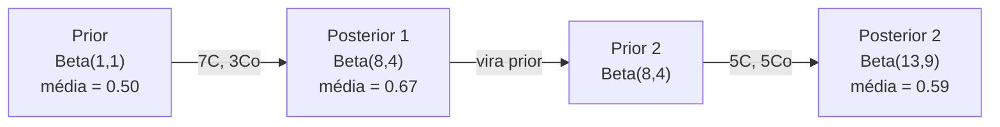

# Teorema de Bayes

> Probabilidade é sobre o que você espera. O teorema de Bayes é sobre o que você aprende.

**Tipo:** Construir
**Linguagem:** Python
**Pré-requisitos:** Fase 1, Aula 06 (Fundamentos de Probabilidade)
**Tempo:** ~75 minutos

## Objetivos de Aprendizado

- Aplicar o teorema de Bayes para computar probabilidades posteriores a partir de priors, verossimilhanças e evidência
- Construir um classificador Naive Bayes de texto do zero com suavização de Laplace e cálculo em espaço log
- Comparar estimação MLE e MAP e explicar como MAP corresponde a regularização L2
- Implementar atualização bayesiana sequencial usando priors conjugados Beta-Binomial para testes A/B

## O Problemo

Um teste médico é 99% preciso. Você testa positivo. Quais são as chances de você realmente ter a doença?

A maioria das pessoas diz 99%. A resposta real depende de quão rara é a doença. Se 1 em 10.000 pessoas tem, um resultado positivo só dá cerca de 1% de chance de estar doente. Os outros 99% dos resultados positivos são alarmes falsos de pessoas saudáveis.

Isso não é pergunta de prova. É o teorema de Bayes. Todo filtro de spam, todo diagnóstico médico, todo modelo de machine learning que quantifica incerteza usa esse raciocínio exato. Você começa com uma crença. Você vê evidência. Você atualiza.

Se você constrói sistemas de ML sem entender isso, você vai interpretar mal saídas de modelos, definir limiares ruins e publicar previsões super-confiantes.

## O Conceito

### Da probabilidade conjunta a Bayes

Você já sabe da Aula 06 que probabilidade condicional é:

```
P(A|B) = P(A e B) / P(B)
```

E simetricamente:

```
P(B|A) = P(A e B) / P(A)
```

Ambas as expressões compartilham o mesmo numerador: P(A e B). Igualando e reorganizando:

```
P(A e B) = P(A|B) * P(B) = P(B|A) * P(A)

Portanto:
P(A|B) = P(B|A) * P(A) / P(B)
```

Esse é o teorema de Bayes. Quatro quantidades, uma equação.

### As quatro partes

| Parte | Nome | O que significa |
|------|------|---------------|
| P(A\|B) | Posterior | Sua crença atualizada sobre A depois de ver evidência B |
| P(B\|A) | Verossimilhança | Quão provável a evidência B é se A for verdade |
| P(A) | Prior | Sua crença sobre A antes de ver qualquer evidência |
| P(B) | Evidência | Probabilidade total de ver B sob todas possibilidades |

O termo evidência P(B) funciona como normalizador. Você pode expandi-lo usando a lei da probabilidade total:

```
P(B) = P(B|A) * P(A) + P(não A) * P(não A)
```

### Exemplo de teste médico

Uma doença afeta 1 em 10.000 pessoas. O teste é 99% preciso (pega 99% das pessoas doentes, dá falsos positivos 1% do tempo).

```
P(doente)          = 0.0001     (prior: doença é rara)
P(positivo|doente) = 0.99       (verossimilhança: teste pega)
P(positivo|saudável) = 0.01    (taxa de falso positivo)

P(positivo) = P(positivo|doente) * P(doente) + P(positivo|saudável) * P(saudável)
            = 0.99 * 0.0001 + 0.01 * 0.9999
            = 0.000099 + 0.009999
            = 0.010098

P(doente|positivo) = P(positivo|doente) * P(doente) / P(positivo)
                    = 0.99 * 0.0001 / 0.010098
                    = 0.0098
                    = 0.98%
```

Menos de 1%. O prior domina. Quando uma condição é rara, até testes precisos produzem maioritariamente falsos positivos. É por isso que médicos pedem testes de confirmação.

### Exemplo de filtro de spam

Você recebe um email contendo a palavra "lottery". É spam?

```
P(spam)                = 0.3      (30% do email é spam)
P("lottery"|spam)      = 0.05     (5% dos spams contêm "lottery")
P("lottery"|não spam)  = 0.001    (0,1% dos emails legítimos contêm "lottery")

P("lottery") = 0.05 * 0.3 + 0.001 * 0.7
             = 0.015 + 0.0007
             = 0.0157

P(spam|"lottery") = 0.05 * 0.3 / 0.0157
                  = 0.955
                  = 95.5%
```

Uma palavra muda a probabilidade de 30% pra 95.5%. Um filtro de spam real aplica Bayes simultaneamente em centenas de palavras.

### Naive Bayes: suposição de independência

Naive Bayes estende isso pra múltiplas features assumindo que todas são condicionalmente independentes dada a classe:

```
P(classe | feature_1, feature_2, ..., feature_n)
  = P(classe) * P(feature_1|classe) * P(feature_2|classe) * ... * P(feature_n|classe)
    / P(feature_1, feature_2, ..., feature_n)
```

A parte "naive" é a suposição de independência. Em texto, ocorrências de palavras não são independentes ("New" e "York" são correlacionadas). Mas a suposição funciona surpreendentemente bem na prática porque o classificador só precisa ranquear classes, não produzir probabilidades calibradas.

Já que o denominador é o mesmo pra todas classes, você pode pulá-lo e só comparar numeradores:

```
pontuação(classe) = P(classe) * produto de P(feature_i | classe)
```

Escolha a classe com maior pontuação.

### Estimação de máxima verossimilhança (MLE)

Como você obtém P(feature|classe) dos dados de treino? Conta.

```
P("free"|spam) = (número de spams contendo "free") / (total de spams)
```

Isso é MLE: escolha os valores de parâmetro que tornam os dados observados mais prováveis. Você está maximizando a função de verossimilhança, que pra contagens discretas se reduz a frequência relativa.

Problema: se uma palavra nunca aparece em spam durante o treino, MLE dá probabilidade zero. Uma palavra não vista mata o produto inteiro. Corrija com suavização de Laplace:

```
P(palavra|classe) = (contagem(palavra, classe) + 1) / (total_palavras_na_classe + tamanho_vocabulario)
```

Adicionar 1 a toda contagem garante que nenhuma probabilidade seja zero.

### Máxima a posteriori (MLE)

MLE pergunta: quais parâmetros maximizam P(dados|parâmetros)?

MAP pergunta: quais parâmetros maximizam P(parâmetros|dados)?

Pelo teorema de Bayes:

```
P(parâmetros|dados) é proporcional a P(dados|parâmetros) * P(parâmetros)
```

MAP adiciona um prior sobre os próprios parâmetros. Se você acredita que parâmetros devem ser pequenos, codifica isso como um prior que penaliza valores grandes. Isso é idêntico à regularização L2 no ML. A penalidade "ridge" na regressão ridge é literalmente um prior gaussiano nos pesos.

| Estimação | Otimiza | Equivalente no ML |
|------------|-----------|---------------|
| MLE | P(dados\|parâmetros) | Treino sem regularização |
| MAP | P(dados\|parâmetros) * P(parâmetros) | Regularização L2 / L1 |

### Bayesiano vs frequentista: a diferença prática

Frequentistas tratam parâmetros como incórtos fixos. Eles perguntam: "Se eu repetisse esse experimento muitas vezes, o que aconteceria?"

Bayesianos tratam parâmetros como distribuições. Eles perguntam: "Dado o que observei, o que acredito sobre os parâmetros?"

| Aespecificaçãoto | Frequentista | Bayesiano |
|--------|-------------|----------|
| Saída | Estimativa pontual | Distribuição sobre valores |
| Incerteza | Intervalos de confiança (sobre o procedimento) | Intervalos críveis (sobre o parâmetro) |
| Dados pequenos | Pode fazer overajuste | Prior funciona como regularização |
| Computação | Geralmente mais rápido | Frequentemente requer amostragem (MCMC) |

A maioria do ML em produção é frequentista (SGD, estimativas pontuais). Métodos bayesianos brilham quando você precisa de incerteza calibrada (decisões médicas, sistemas de segurança crítica) ou quando dados são escassos (aprendizado few-shot, cold start).

### Por que o pensamento bayesiano importa pro ML

A conexão é mais profunda que analogia:

**Priors são regularização.** Um prior gaussiano nos pesos é regularização L2. Um prior de Laplace é L1. Toda vez que você adiciona um termo de regularização, está fazendo uma afirmação bayesiana sobre que valores de parâmetro você espera.

**Posteriores são incerteza.** Uma única probabilidade prevista não diz nada sobre quão confiante o modelo está nessa estimativa. Métodos bayesianos dão uma distribuição: "Acho que P(spam) está entre 0.8 e 0.95."

**Atualizações bayesianas são aprendizado online.** O posterior de hoje vira o prior de amanhã. Quando seu modelo vê novos dados, atualiza suas crenças incrementalmente em vez de retrabalhar do zero.

**Comparação de modelos é bayesiana.** Critério de informação bayesiano (BIC), verossimilhança marginal e fatores de Bayes usam raciocínio bayesiano pra escolher entre modelos sem overajuste.

## Construa

### Passo 1: Função do teorema de Bayes

```python
def bayes(prior, verossimilhanca, taxa_falso_positivo):
    evidencia = verossimilhanca * prior + taxa_falso_positivo * (1 - prior)
    posterior = verossimilhanca * prior / evidencia
    return posterior

resultado = bayes(prior=0.0001, verossimilhanca=0.99, taxa_falso_positivo=0.01)
print(f"P(doente|positivo) = {resultado:.4f}")
```

### Passo 2: Classificador Naive Bayes

```python
import math
from collections import defaultdict

class NaiveBayes:
    def __init__(self, smoothing=1.0):
        self.smoothing = smoothing
        self.class_counts = defaultdict(int)
        self.word_counts = defaultdict(lambda: defaultdict(int))
        self.class_word_totals = defaultdict(int)
        self.vocab = set()

    def train(self, documents, rótulos):
        for doc, label in zip(documents, rótulos):
            self.class_counts[label] += 1
            words = doc.lower().split()
            for word in words:
                self.word_counts[label][word] += 1
                self.class_word_totals[label] += 1
                self.vocab.add(word)

    def predict(self, document):
        words = document.lower().split()
        total_docs = sum(self.class_counts.values())
        vocab_size = len(self.vocab)
        best_class = None
        best_score = float("-inf")
        for cls in self.class_counts:
            score = math.log(self.class_counts[cls] / total_docs)
            for word in words:
                count = self.word_counts[cls].get(word, 0)
                total = self.class_word_totals[cls]
                score += math.log((count + self.smoothing) / (total + self.smoothing * vocab_size))
            if score > best_score:
                best_score = score
                best_class = cls
        return best_class
```

Log probabilidades previnem underflow. Multiplicar muitas probabilidades pequenas produz números pequenos demais pra ponto flutuante. Somar log probabilidades é numericamente estável e matematicamente equivalente.

### Passo 3: Treine com dados de spam

```python
train_docs = [
    "win free money now",
    "free lottery ticket winner",
    "claim your prize today free",
    "urgent offer free cash",
    "congratulations you won free",
    "meeting tomorrow at noon",
    "project update attached",
    "can we schedule a call",
    "quarterly report review",
    "lunch on thursday sounds good",
    "team standup notes attached",
    "please review the pull request",
]

train_rótulos = [
    "spam", "spam", "spam", "spam", "spam",
    "ham", "ham", "ham", "ham", "ham", "ham", "ham",
]

classifier = NaiveBayes()
classifier.train(train_docs, train_rótulos)

test_messages = [
    "free money waiting for you",
    "meeting rescheduled to friday",
    "you won a free prize",
    "please review the attached report",
]

for msg in test_messages:
    print(f"  '{msg}' -> {classifier.predict(msg)}")
```

### Passo 4: Inespecificaçãoione as probabilidades aprendidas

```python
def show_top_words(classifier, cls, n=5):
    vocab_size = len(classifier.vocab)
    total = classifier.class_word_totals[cls]
    probs = {}
    for word in classifier.vocab:
        count = classifier.word_counts[cls].get(word, 0)
        probs[word] = (count + classifier.smoothing) / (total + classifier.smoothing * vocab_size)
    sorted_words = sorted(probs.items(), key=lambda x: x[1], reverse=True)
    for word, prob in sorted_words[:n]:
        print(f"    {word}: {prob:.4f}")

print("\nTop palavras de spam:")
show_top_words(classifier, "spam")
print("\nTop palavras de ham:")
show_top_words(classifier, "ham")
```

## Use

Scikit-learn tem implementações de naive Bayes prontas pra produção:

```python
from sklearn.feature_extraction.text import CountVectorizer
from sklearn.naive_bayes import MultinomialNB

vectorizer = CountVectorizer()
X_train = vectorizer.fit_transform(train_docs)
clf = MultinomialNB()
clf.fit(X_train, train_rótulos)

X_test = vectorizer.transform(test_messages)
predictions = clf.predict(X_test)
for msg, pred in zip(test_messages, predictions):
    print(f"  '{msg}' -> {pred}")
```

Mesmo algoritmo. CountVectorizer lida com tokenização e construção de vocabulário. MultinomialNB lida com suavização e log probabilidades internamente. Sua versão do zero faz a mesma coisa em 40 linhas.

## Entregue

A classe NaiveBayes construída aqui demonstra o pipeline completo: tokenização, estimação de probabilidade com suavização de Laplace, predição em espaço log. O código em `code/bayes.py` roda de ponta a ponta sem dependências além da biblioteca padrão do Python.

### Priors Conjugados

Quando o prior e o posterior pertencem à mesma família de distribuições, o prior é chamado "conjugado". Isso torna a atualização bayesiana algebraicamente limpa — você ganha um posterior de forma fechada sem integração numérica.

| Verossimilhança | Prior Conjugado | Posterior | Exemplo |
|-----------|----------------|-----------|---------|
| Bernoulli | Beta(a, b) | Beta(a + sucessos, b + falhas) | Estimação de viés de moeda |
| Normal (variância conhecida) | Normal(mu_0, sigma_0) | Normal(média ponderada, variância menor) | Calibração de sensor |
| Poisson | Gamma(a, b) | Gamma(a + soma de contagens, b + n) | Modelagem de taxas de chegada |
| Multinomial | Dirichlet(alpha) | Dirichlet(alpha + contagens) | Modelagem de tópicos, modelos de linguagem |

Por que isso importa: sem priors conjugados, você precisa de amostragem Monte Carlo ou inferência variacional pra aproximar o posterior. Com priors conjugados, você só atualiza dois números.

A distribuição Beta é o prior conjugado mais comum na prática. Beta(a, b) representa sua crença sobre um parâmetro de probabilidade. A média é a/(a+b). Quanto maior a+b, mais concentrada (confiante) a distribuição.

Casos eespecificaçãoiais do prior Beta:
- Beta(1, 1) = uniforme. Você não tem opinião sobre o parâmetro.
- Beta(10, 10) = picada em 0.5. Você acredita firmemente que o parâerto está perto de 0.5.
- Beta(1, 10) = enviesada pra 0. Você acredita que o parâmetro é pequeno.

A regra de atualização é super simples:

```
Prior:     Beta(a, b)
Dados:     s sucessos, f falhas
Posterior: Beta(a + s, b + f)
```

Sem integrais. Sem amostragem. Só adição.

### Atualização Bayesiana Sequencial

Inferência bayesiana é naturalmente sequencial. O posterior de hoje vira o prior de amanhã. É assim que sistemas reais aprendem incrementalmente sem reprocesar todos os dados históricos.

Exemplo concreto: estimando se uma moeda é justa.

**Dia 1: Sem dados ainda.**
Comece com Beta(1, 1) — um prior uniforme. Você não tem opinião.
- Média do prior: 0.5
- Prior é plano em [0, 1]

**Dia 2: Observe 7 caras, 3 coroas.**
Posterior = Beta(1 + 7, 1 + 3) = Beta(8, 4)
- Média do posterior: 8/12 = 0.667
- A evidência sugere que a moeda é enviesada pra cara

**Dia 3: Observe 5 caras a mais, 5 coroas a mais.**
Use o posterior de ontem como prior de hoje.
Posterior = Beta(8 + 5, 4 + 5) = Beta(13, 9)
- Média do posterior: 13/22 = 0.591
- O novo dado equilibrado puxou a estimativa de volta pra 0.5



A ordem das observações não importa. Beta(1,1) atualizado com todos os 12 caras e 8 coroas de uma vez dá Beta(13, 9) — o mesmo resultado. Atualização sequencial e em lote são matematicamente equivalentes. Mas atualização sequencial permite tomar decisões a cada etapa sem armazenar dados brutos.

Essa é a base do aprendizado online em sistemas de ML em produção. Amostragem de Thompson para bandits, sistemas de recomendação incrementais e detectores de anomalias em streaming usam esse padrão.

### Conexão com Testes A/B

Testes A/B são inferência bayesiana disfarçada.

Setup: você está testando duas cores de botão. Variante A (azul) e variante B (verde). Você quer saber qual recebe mais cliques.

O teste A/B bayesiano:

1. **Prior.** Comece com Beta(1, 1) pra ambas variantes. Sem preferência prévia.
2. **Dados.** Variante A: 50 cliques em 1.000 views. Variante B: 65 cliques em 1.000 views.
3. **Posteriores.**
   - A: Beta(1 + 50, 1 + 950) = Beta(51, 951). Média = 0.051
   - B: Beta(1 + 65, 1 + 935) = Beta(66, 936). Média = 0.066
4. **Decisão.** Compute P(B > A) — a probabilidade da taxa real de conversão de B ser maior que a de A.

Computar P(B > A) analiticamente é difícil. Mas Monte Carlo torna trivial:

```
1. Tire 100.000 amostras de Beta(51, 951)  -> samples_A
2. Tire 100.000 amostras de Beta(66, 936)  -> samples_B
3. P(B > A) = fração de amostras onde B > A
```

Se P(B > A) > 0.95, você publica a variante B. Se está entre 0.05 e 0.95, continue coletando dados. Se P(B > A) < 0.05, você publica a variante A.

Vantagens sobre teste A/B frequentista:
- Você ganha uma afirmação direta de probabilidade: "há 97% de chance de B ser melhor"
- Sem confusão de p-value. Sem "falhou em rejeitar a hipótese nula".
- Você pode checar resultados a qualquer momento sem inflar taxas de falso positivo (sem "problema de olhar")
- Você pode incorporar conhecimento prévio (ex: testes anteriores sugerem que taxas de conversão são normalmente 3-8%)

| Aespecificaçãoto | A/B Frequentista | A/B Bayesiano |
|--------|----------------|--------------|
| Saída | p-value | P(B > A) |
| Interpretação | "Quão surpreendente são esses dados se A=B?" | "Quão provável é que B seja melhor que A?" |
| Parada antecipada | Infla falsos positivos | Seguro em qualquer ponto (dado um prior bem escolhido e modelo corretamente eespecificaçãoificado) |
| Conhecimento prévio | Não usado | Codificado como prior Beta |
| Regra de decisão | p < 0.05 | P(B > A) > limiar |

## Exercícios

1. **Múltiplos testes.** Um paciente testa positivo duas vezes em testes independentes (ambos 99% precisos, prevalência da doença 1 em 10.000). Qual é P(doente) depois dos dois testes? Use o posterior do primeiro teste como prior pro segundo.

2. **Impacto da suavização.** Rode o classificador de spam com valores de suavização de 0.01, 0.1, 1.0 e 10.0. Como as probabilidades das top palavras mudam? O que acontece com suavização=0 e uma palavra que aparece só em ham?

3. **Adicione features.** Estenda a classe NaiveBayes para usar também o tamanho da mensagem (curta/longa) como funcionalidade ao lado de contagens de palavras. Estime P(curta|spam) e P(curta|ham) dos dados de treino e inclua na pontuação de predição.

4. **MAP à mão.** Dados observados (7 caras em 10 lançamentos), compute a estimativa MAP do viés usando um prior Beta(2,2). Compare com a estimativa MLE (7/10).

## Termos Chave

| Termo | O que dizem | O que realmente significa |
|------|----------------|----------------------|
| Prior | "Minha suposição inicial" | P(hipótese) antes de observar evidência. No ML: o termo de regularização. |
| Verossimilhança | "Quão bem os dados se encaixam" | P(evidência\|hipótese). Quão provável são os dados observados sob uma hipótese eespecificaçãoífica. |
| Posterior | "Minha crença atualizada" | P(hipótese\|evidência). O prior multiplicado pela verossimilhança, depois normalizado. |
| Evidência | "A constante normalizadora" | P(dados) sobre todas hipóteses. Garante que o posterior soma 1. |
| Naive Bayes | "Aquele classificador simples de texto" | Um classificador que assume que as features são independentes dada a classe. Funciona bem apesar da suposição falsa. |
| Suavização de Laplace | "Suavização de adicionar-um" | Adicionar uma pequena contagem a cada funcionalidade pra evitar probabilidades zero de dados não vistos. |
| MLE | "Só usar as frequências" | Escolher parâmetros que maximizam P(dados\|parâmetros). Sem prior. Pode fazer overajuste com dados pequenos. |
| MAP | "MLE com prior" | Escolher parâmetros que maximizam P(dados\|parâmetros) * P(parâmetros). Equivalente a MLE regularizado. |
| Log probabilidade | "Trabalhar em espaço log" | Usar log(P) em vez de P pra evitar underflow de ponto flutuante ao multiplicar muitos números pequenos. |
| Falso positivo | "Um alarme falso" | O teste diz positivo, mas o estado real é negativo. Causa a falácia da taxa base. |

## Leitura Complementar

- [3Blue1Brown: Teorema de Bayes](https://www.youtube.com/watch?v=HZGCoVF3YvM) — explicação visual com o exemplo do teste médico
- [Stanford CS229: Algoritmos de Aprendizado Generativo](https://cs229.stanford.edu/notes2022fall/cs229-notes2.pdf) — naive Bayes e sua conexão com modelos discriminativos
- [Pense em Bayes](https://greenteapress.com/wp/think-bayes/) — livro grátis, estatística bayesiana com código Python
- [Naive Bayes do scikit-learn](https://scikit-learn.org/stable/modules/naive_bayes.html) — implementações em produção e quando usar cada variante
