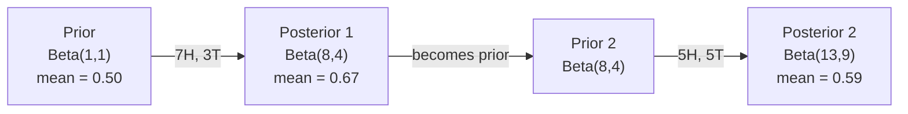

# Bayes Teoremi

> Olasılık ne beklediğinizle ilgilidir. Bayes teoremi ne öğrendiğinizle ilgilidir.

**Tür:** Yapım
**Dil:** Python
**Önkoşullar:** Aşama 1, Ders 06 (Olasılığın Temelleri)
**Süre:** ~75 dakika

## Öğrenme Hedefleri

- Öncellerden, olasılıklardan ve kanıtlardan sonsal olasılıkları hesaplamak için Bayes teoremini uygulayın
- Laplace yumuşatma ve günlük alanı hesaplaması ile sıfırdan bir Naive Bayes metin sınıflandırıcısı oluşturun
- MLE ve MAP tahminini karşılaştırın ve MAP'ın L2 düzenlemesine nasıl karşılık geldiğini açıklayın
- A/B testi için Beta-Binomial eşlenik önceliklerini kullanarak sıralı Bayesian güncellemesini uygulayın

## Sorun

Tıbbi bir test %99 oranında doğrudur. Testiniz pozitif. Gerçekten hastalığa yakalanma ihtimaliniz nedir?

Çoğu kişi %99 diyor. Gerçek cevap hastalığın ne kadar nadir olduğuna bağlıdır. Eğer 10.000 kişiden 1'inde bu hastalık görülüyorsa, pozitif bir sonuç size yalnızca %1 oranında hastalanma şansı verir. Olumlu sonuçların diğer %99'u sağlıklı insanlardan gelen yanlış alarmlardır.

Bu hileli bir soru değil. Bayes teoremi. Belirsizliği ölçen her spam filtresi, her tıbbi teşhis, her machine learning modeli tam olarak bu mantığı kullanır. Bir inançla başlarsın. Kanıt görüyorsunuz. Sen güncelle.

Bunu anlamadan makine öğrenimi sistemleri oluşturursanız model çıktılarını yanlış yorumlayacak, kötü eşikler belirleyecek ve kendinize aşırı güvenen tahminler sunacaksınız.

## Konsept

### Ortak olasılıktan Bayes'e

Ders 06'dan zaten koşullu olasılığın şöyle olduğunu biliyorsunuz:

```
P(A|B) = P(A and B) / P(B)
```

Ve simetrik olarak:

```
P(B|A) = P(A and B) / P(A)
```

Her iki ifade de aynı paya sahiptir: P(A ve B). Bunları eşitleyin ve yeniden düzenleyin:

```
P(A and B) = P(A|B) * P(B) = P(B|A) * P(A)

Therefore:

P(A|B) = P(B|A) * P(A) / P(B)
```

Bu Bayes'in teoremi. Dört büyüklük, bir denklem.

### Dört bölüm

| Bölüm | İsim | Ne anlama geliyor |
|------|------|---------------|
| P(A\|B) | Arka | B kanıtını gördükten sonra A hakkındaki güncellenmiş inancınız |
| P(B\|A) | Olasılık | A doğruysa B'nin kanıtı ne kadar olası |
| P(A) | Önceki | Herhangi bir kanıt görmeden önce A hakkındaki inancınız |
| P(B) | Kanıt | Tüm olasılıklarda B'yi görmenin toplam olasılığı |

Kanıt terimi P(B) normalleştirici görevi görür. Toplam olasılık yasasını kullanarak genişletebilirsiniz:

```
P(B) = P(B|A) * P(A) + P(B|not A) * P(not A)
```

### Tıbbi test örneği

Bir hastalık 10.000 kişiden 1'ini etkiler. Test %99 doğrudur (hasta kişilerin %99'unu yakalar, %1'inde yanlış pozitif sonuç verir).

```
P(sick)          = 0.0001     (prior: disease is rare)
P(positive|sick) = 0.99       (likelihood: test catches it)
P(positive|healthy) = 0.01    (false positive rate)

P(positive) = P(positive|sick) * P(sick) + P(positive|healthy) * P(healthy)
            = 0.99 * 0.0001 + 0.01 * 0.9999
            = 0.000099 + 0.009999
            = 0.010098

P(sick|positive) = P(positive|sick) * P(sick) / P(positive)
                 = 0.99 * 0.0001 / 0.010098
                 = 0.0098
                 = 0.98%
```

%1'den az. Önceki hakimdir. Bir durum nadir olduğunda, doğru testler bile çoğunlukla yanlış pozitif sonuçlar verir. Bu nedenle doktorlar doğrulama testleri isterler.

### Spam filtresi örneği

"Piyango" kelimesini içeren bir e-posta alırsınız. Spam mı?

```
P(spam)                = 0.3      (30% of email is spam)
P("lottery"|spam)      = 0.05     (5% of spam emails contain "lottery")
P("lottery"|not spam)  = 0.001    (0.1% of legitimate emails contain "lottery")

P("lottery") = 0.05 * 0.3 + 0.001 * 0.7
             = 0.015 + 0.0007
             = 0.0157

P(spam|"lottery") = 0.05 * 0.3 / 0.0157
                  = 0.955
                  = 95.5%
```

Tek kelime olasılığı %30'dan %95,5'e çıkarır. Gerçek bir spam filtresi, Bayes'i aynı anda yüzlerce kelimeye uygular.

### Naive Bayes: bağımsızlık varsayımı

Naive Bayes, tüm özelliklerin sınıfa göre koşullu olarak bağımsız olduğunu varsayarak bunu birden fazla özelliğe genişletir:

```
P(class | feature_1, feature_2, ..., feature_n)
  = P(class) * P(feature_1|class) * P(feature_2|class) * ... * P(feature_n|class)
    / P(feature_1, feature_2, ..., feature_n)
```

"Saf" kısım ise bağımsızlık varsayımıdır. Metinde sözcük geçişleri bağımsız değildir ("New" ve "York" ilişkilidir). Ancak bu varsayım pratikte şaşırtıcı derecede iyi işliyor çünkü sınıflandırıcının kalibre edilmiş olasılıklar üretmesi değil, yalnızca sınıfları sıralaması gerekiyor.

Payda tüm sınıflar için aynı olduğundan, bunu atlayıp sadece payları karşılaştırabilirsiniz:

```
score(class) = P(class) * product of P(feature_i | class)
```

En yüksek puana sahip sınıfı seçin.

### Maksimum olasılık tahmini (MLE)

Eğitim verilerinden P(özellik|sınıf)'ı nasıl elde edersiniz? Saymak.

```
P("free"|spam) = (number of spam emails containing "free") / (total spam emails)
```

Bu MLE'dir: gözlemlenen verileri en olası kılan parametre değerlerini seçin. Ayrık sayımlar için göreceli frekansa düşen olabilirlik fonksiyonunu maksimuma çıkarıyorsunuz.

Sorun: Eğitim sırasında bir kelime asla spam'de görünmüyorsa, MLE bu kelimeye sıfır olasılığını verir. Görünmeyen bir kelime tüm ürünü öldürür. Bunu Laplace yumuşatmayla düzeltin:

```
P(word|class) = (count(word, class) + 1) / (total_words_in_class + vocabulary_size)
```

Her sayıma 1 eklemek hiçbir olasılığın sıfır olmamasını sağlar.

### Sonradan maksimum (MAP)

MLE şunu sorar: Hangi parametreler P(veri|parametreler)'i maksimuma çıkarır?

MAP şunu sorar: Hangi parametreler P(parametreler|veri)'yi maksimuma çıkarır?

Bayes teoremine göre:

```
P(parameters|data) proportional to P(data|parameters) * P(parameters)
```

MAP, parametrelerin üzerine bir öncelik ekler. Parametrelerin küçük olması gerektiğine inanıyorsanız, bunu büyük değerleri cezalandıran bir öncelik olarak kodlarsınız. Bu, ML'deki L2 düzenlemesiyle aynıdır. Sırt regresyonundaki "sırt" cezası, tam anlamıyla ağırlıklardan önce gelen bir Gaussian'dır.

| Tahmin | Optimize Ediyor | ML eşdeğeri |
|------------|-----------|---------------|
| MLE | P(veri\|paramlar) | Düzenlenmemiş eğitim |
| HARİTA | P(veri\|paramlar) * P(paramlar) | L2 / L1 düzenlemesi |

### Bayesian ve frekansçı: pratik fark

Frekansçılar parametreleri sabit bilinmeyenler olarak ele alır. Şöyle soruyorlar: "Bu deneyi defalarca tekrarlasaydım ne olurdu?"

Bayesçiler parametreleri dağılım olarak ele alır. Şunu soruyorlar: "Gözlemlediklerime göre parametreler hakkında neye inanıyorum?"

Makine öğrenimi sistemleri oluşturmak için pratik fark:

| Görünüş | Frequentist | Bayesian |
|--------|-------------|----------|
| Çıkış | Puan tahmini | Değerlere göre dağılım |
| Belirsizlik | Güven aralıkları (prosedür hakkında) | Güvenilir aralıklar (parametre hakkında) |
| Küçük veriler | Fazla sığabilir | Önceki düzenleme, düzenleme görevi görür |
| Hesaplama | Genellikle daha hızlı | Çoğunlukla örnekleme gerektirir (MCMC) |

Çoğu üretim ML'si sıktır (SGD, nokta tahminleri). Bayes yöntemleri, kalibre edilmiş belirsizliğe ihtiyaç duyduğunuzda (tıbbi kararlar, güvenlik açısından kritik sistemler) veya verilerin kıt olduğu durumlarda (birkaç adımlı öğrenme, soğuk başlangıç) parlar.

### Bayesian düşüncesi makine öğrenimi için neden önemlidir?

Bağlantı benzetmeden daha derindir:

**Öncelikler düzenlileştirmedir.** Ağırlıklara ilişkin bir Gauss önceliği L2 düzenlileştirmesidir. Laplace önceliği L1'dir. Her düzenlileştirme terimi eklediğinizde, hangi parametre değerlerini beklediğinize ilişkin bir Bayesian ifadesi yapmış olursunuz.

**Sonrakiler belirsizliktir.** Tahmin edilen tek bir olasılık, modelin bu tahminden ne kadar emin olduğu konusunda size hiçbir şey söylemez. Bayesian yöntemleri size bir dağılım verir: "P(spam)'in 0,8 ile 0,95 arasında olduğunu düşünüyorum."

**Bayes güncellemeleri çevrimiçi öğrenmedir.** Bugünün arkası yarının önceliği olur. Modeliniz yeni veriler gördüğünde sıfırdan yeniden eğitim almak yerine inançlarını aşamalı olarak günceller.

**Model karşılaştırması Bayesian'dır.** Bayesian bilgi kriteri (BIC), marjinal olasılık ve Bayes faktörlerinin tümü, modeller arasında aşırı uyum olmadan seçim yapmak için Bayesian akıl yürütmeyi kullanır.

```figure
bayes-update
```

## İnşa Et

### Adım 1: Bayes teoremi fonksiyonu

```python
def bayes(prior, likelihood, false_positive_rate):
    evidence = likelihood * prior + false_positive_rate * (1 - prior)
    posterior = likelihood * prior / evidence
    return posterior

result = bayes(prior=0.0001, likelihood=0.99, false_positive_rate=0.01)
print(f"P(sick|positive) = {result:.4f}")
```

### Adım 2: Naive Bayes sınıflandırıcısı

```python
import math
from collections import defaultdict

class NaiveBayes:
    def __init__(self, smoothing=1.0):
        self.smoothing = smoothing
        self.class_counts = defaultdict(int)
        self.word_counts = defaultdict(lambda: defaultdict(int))
        self.class_word_totals = defaultdict(int)
        self.vocab = set()

    def train(self, documents, labels):
        for doc, label in zip(documents, labels):
            self.class_counts[label] += 1
            words = doc.lower().split()
            for word in words:
                self.word_counts[label][word] += 1
                self.class_word_totals[label] += 1
                self.vocab.add(word)

    def predict(self, document):
        words = document.lower().split()
        total_docs = sum(self.class_counts.values())
        vocab_size = len(self.vocab)
        best_class = None
        best_score = float("-inf")
        for cls in self.class_counts:
            score = math.log(self.class_counts[cls] / total_docs)
            for word in words:
                count = self.word_counts[cls].get(word, 0)
                total = self.class_word_totals[cls]
                score += math.log((count + self.smoothing) / (total + self.smoothing * vocab_size))
            if score > best_score:
                best_score = score
                best_class = cls
        return best_class
```

Günlük olasılıkları taşmayı önler. Birçok küçük olasılığın çarpılması, kayan nokta için çok küçük sayılar üretir. Log olasılıklarının toplanması sayısal olarak kararlı ve matematiksel olarak eşdeğerdir.

### 3. Adım: Spam verileri konusunda eğitim alın

```python
train_docs = [
    "win free money now",
    "free lottery ticket winner",
    "claim your prize today free",
    "urgent offer free cash",
    "congratulations you won free",
    "meeting tomorrow at noon",
    "project update attached",
    "can we schedule a call",
    "quarterly report review",
    "lunch on thursday sounds good",
    "team standup notes attached",
    "please review the pull request",
]

train_labels = [
    "spam", "spam", "spam", "spam", "spam",
    "ham", "ham", "ham", "ham", "ham", "ham", "ham",
]

classifier = NaiveBayes()
classifier.train(train_docs, train_labels)

test_messages = [
    "free money waiting for you",
    "meeting rescheduled to friday",
    "you won a free prize",
    "please review the attached report",
]

for msg in test_messages:
    print(f"  '{msg}' -> {classifier.predict(msg)}")
```

### Adım 4: Öğrenilen olasılıkları inceleyin

```python
def show_top_words(classifier, cls, n=5):
    vocab_size = len(classifier.vocab)
    total = classifier.class_word_totals[cls]
    probs = {}
    for word in classifier.vocab:
        count = classifier.word_counts[cls].get(word, 0)
        probs[word] = (count + classifier.smoothing) / (total + classifier.smoothing * vocab_size)
    sorted_words = sorted(probs.items(), key=lambda x: x[1], reverse=True)
    for word, prob in sorted_words[:n]:
        print(f"    {word}: {prob:.4f}")

print("\nTop spam words:")
show_top_words(classifier, "spam")
print("\nTop ham words:")
show_top_words(classifier, "ham")
```

## Kullan onu

Scikit-learn gemilerinin üretime hazır saf Bayes uygulamaları:

```python
from sklearn.feature_extraction.text import CountVectorizer
from sklearn.naive_bayes import MultinomialNB
from sklearn.metrics import classification_report

vectorizer = CountVectorizer()
X_train = vectorizer.fit_transform(train_docs)
clf = MultinomialNB()
clf.fit(X_train, train_labels)

X_test = vectorizer.transform(test_messages)
predictions = clf.predict(X_test)
for msg, pred in zip(test_messages, predictions):
    print(f"  '{msg}' -> {pred}")
```

Aynı algoritma. CountVectorizer, tokenizasyon ve kelime dağarcığı oluşturma işlemlerini gerçekleştirir. MultinomialNB, yumuşatma ve günlük olasılıklarını dahili olarak yönetir. Sıfırdan sürümünüz aynı şeyi 40 satırda yapıyor.

## Gönderin

Burada oluşturulan NaiveBayes sınıfı tüm boru hattını gösterir: tokenizasyon, Laplace düzeltmeyle olasılık tahmini, günlük alanı tahmini. `code/bayes.py`'deki kod, Python'un standart kütüphanesinin ötesinde hiçbir bağımlılık olmadan uçtan uca çalışır.

### Eşlenik Öncüller

Öncel ve sonuncu aynı dağılım ailesine ait olduğunda önceliğe "eşlenik" adı verilir. Bu, Bayesian güncellemesini cebirsel olarak temiz hale getirir; sayısal entegrasyon olmadan kapalı formlu bir posterior elde edersiniz.

| Olasılık | Önceki Eşlenik | Arka | Örnek |
|-----------|----------------|-----------|---------|
| Bernoulli | Beta(a, b) | Beta(a + başarılar, b + başarısızlıklar) | Yazı-tura önyargı tahmini |
| Normal (bilinen fark) | Normal(mu_0, sigma_0) | Normal(ağırlıklı ortalama, daha küçük varyans) | Sensör kalibrasyonu |
| Poisson | Gama(a, b) | Gama(a + sayımların toplamı, b + n) | Varış oranlarının modellenmesi |
| Çok terimli | Dirichlet(alfa) | Dirichlet(alfa + sayımlar) | Konu modelleme, dil modelleri |

Bu neden önemlidir: eşlenik önseller olmadan, sonsala yaklaşmak için Monte Carlo örneklemesine veya varyasyonel inference'ye ihtiyacınız vardır. Eşlenik önceliklerle yalnızca iki sayıyı güncellersiniz.

Beta dağılımı pratikte en yaygın eşleniktir. Beta(a, b), bir olasılık parametresi hakkındaki inancınızı temsil eder. Ortalama a/(a+b)'dir. a+b ne kadar büyükse, dağılım o kadar konsantre (güvenli) olur.

Beta öncesindeki özel durumlar:
- Beta(1, 1) = tek biçimli. Parametre hakkında hiçbir fikriniz yok.
- Beta(10, 10) = 0,5'te zirve yaptı. Parametrenin 0,5'e yakın olduğuna kesinlikle inanıyorsunuz.
- Beta(1, 10) = 0'a doğru çarpık. Parametrenin küçük olduğunu düşünüyorsunuz.

Güncelleme kuralı çok basittir:

```
Prior:     Beta(a, b)
Data:      s successes, f failures
Posterior: Beta(a + s, b + f)
```

İntegral yok. Örnekleme yok. Sadece ekleme.

### Sıralı Bayes Güncellemesi

Bayesian inference doğal olarak sıralıdır. Bugünün arkası yarının önceliği olur. Bu, gerçek sistemlerin tüm geçmiş verileri yeniden işlemeden aşamalı olarak öğrenme şeklidir.

Somut örnek: bir madalyonun adil olup olmadığını tahmin etmek.

**1. Gün: Henüz veri yok.**
Beta(1, 1) ile başlayın -- birörnek önsel. Hiçbir fikrin yok.
- Önceki ortalama: 0,5
- Önceki [0, 1] boyunca düzdür

**2. Gün: 7 yazı, 3 yazı gözlemleyin.**
Arka = Beta(1 + 7, 1 + 3) = Beta(8, 4)
- Arka ortalama: 8/12 = 0,667
- Kanıtlar madalyonun yazıya doğru eğilimli olduğunu gösteriyor

**3. Gün: 5 yazı daha, 5 yazı daha gözlemleyin.**
Dünün sonunu bugünün öncesi olarak kullanın.
Arka = Beta(8 + 5, 4 + 5) = Beta(13, 9)
- Arka ortalama: 13/22 = 0,591
- Dengeli yeni veriler tahmini 0,5'e çekti



Gözlemlerin sırası önemli değildir. 12 yazı ve 8 yazının tamamıyla aynı anda güncellenen Beta(1,1), Beta(13, 9)'u verir; aynı sonuç. Sıralı güncelleme ve toplu güncelleme matematiksel olarak eşdeğerdir. Ancak sıralı güncelleme, ham verileri depolamadan her adımda karar vermenizi sağlar.

Bu, üretim makine öğrenimi sistemlerinde çevrimiçi öğrenmenin temelidir. Haydutlar için Thompson örneklemesi, artımlı öneri sistemleri ve akış anormalliği dedektörlerinin tümü bu modeli kullanır.

### A/B Testine Bağlantı

A/B testi Bayesian inference'nin kılık değiştirmiş halidir.

Kurulum: iki düğme rengini test ediyorsunuz. A Varyantı (mavi) ve B Varyantı (yeşil). Hangisinin daha fazla tıklama aldığını bilmek istiyorsunuz.

Bayesian A/B testi:

1. **Önceki** Her iki değişken için de Beta(1, 1) ile başlayın. Öncelikli tercih yok.
2. **Veri.** Varyant A: 1000 görüntülemeden 50 tıklama. Varyant B: 1000 görüntülemeden 65 tıklama.
3. **Arka kısımlar.**
   - A: Beta(1 + 50, 1 + 950) = Beta(51, 951). Ortalama = 0,051
   - B: Beta(1 + 65, 1 + 935) = Beta(66, 936). Ortalama = 0,066
4. **Karar.** P(B > A)'yı hesaplayın -- B'nin gerçek dönüşüm oranının A'nınkinden yüksek olma olasılığı.

P(B > A)'yı analitik olarak hesaplamak zordur. Ancak Monte Carlo bunu önemsizleştiriyor:

```
1. Draw 100,000 samples from Beta(51, 951)  -> samples_A
2. Draw 100,000 samples from Beta(66, 936)  -> samples_B
3. P(B > A) = fraction of samples where B > A
```

P(B > A) > 0,95 ise B varyantını gönderirsiniz. 0,05 ile 0,95 arasındaysa veri toplamaya devam edersiniz. P(B > A) < 0,05 ise A varyantını gönderirsiniz.

Sık A/B testine göre avantajları:
- Doğrudan bir olasılık ifadesi alırsınız: "B'nin daha iyi olma ihtimali %97'dir"
- P değeri karışıklığı yok. "Boş hipotezin reddedilmesinde başarısızlık" riskinden korunma yoktur.
- Yanlış pozitif oranları şişirmeden sonuçları istediğiniz zaman kontrol edebilirsiniz ("gözetleme sorunu yok")
- Önceki bilgileri dahil edebilirsiniz (e.g., önceki testler dönüşüm oranlarının genellikle %3-8 olduğunu göstermektedir)

| Görünüş | Frekansçı A/B | Bayes A/B |
|--------|----------------|--------------|
| Çıkış | p-değeri | P(B > A) |
| Yorumlama | "Eğer A=B ise bu veri ne kadar şaşırtıcı?" | "B'nin A'dan daha iyi olma ihtimali ne kadar?" |
| Erken durdurma | Yanlış pozitifleri şişirir | Her noktada güvenli (önceden iyi seçilmiş ve doğru şekilde belirlenmiş bir model göz önüne alındığında) |
| Ön bilgi | Kullanılmıyor | Önceki Beta olarak kodlandı |
| Karar kuralı | p < 0,05 | P(B > A) > eşik |

## Egzersizler

1. **Birden fazla test.** Bir hasta bağımsız testlerde iki kez pozitif sonuç verir (her ikisi de %99 doğru, hastalık prevalansı 10.000'de 1). Her iki testten sonra P(hasta) nedir? İlk testin arka kısmını ikinci testin öncesi olarak kullanın.

2. **Düzleştirme etkisi.** Spam sınıflandırıcısını 0,01, 0,1, 1,0 ve 10,0 düzeltme değerleriyle çalıştırın. En iyi kelime olasılıkları nasıl değişir? Düzeltme=0 ve yalnızca jambonla görünen bir kelimeye ne olur?

3. **Özellikler ekleyin.** NaiveBayes sınıfını, kelime sayısının yanı sıra mesaj uzunluğunu da (kısa/uzun) bir özellik olarak kullanacak şekilde genişletin. Eğitim verilerinden P(short|spam) ve P(short|ham) değerlerini tahmin edin ve bunu tahmin puanına katlayın.

4. **El ile HARİTA.** Gözlemlenen veriler göz önüne alındığında (10 yazı-tura atışta 7 yazı), önceden bir Beta(2,2) kullanarak yanlılığın MAP tahminini hesaplayın. Bunu MLE tahminiyle karşılaştırın (7/10).

## Anahtar Terimler

| Dönem | İnsanlar ne diyor | Aslında ne anlama geliyor |
|------|----------------|----------------------|
| Önceki | "İlk tahminim" | P(hipotez) kanıtları gözlemlemeden önce. ML'de: düzenleme terimi. |
| Olasılık | "Veriler ne kadar iyi uyuyor" | P(kanıt\|hipotez). Gözlemlenen verilerin belirli bir hipotez altında ne kadar muhtemel olduğu. |
| Arka | "Güncellenmiş inancım" | P(hipotez\|kanıt). Önceki olasılık ile çarpılır, ardından normalleştirilir. |
| Kanıt | "Normalleştirme sabiti" | Tüm hipotezlerde P(veri). Son toplamların 1'e eşit olmasını sağlar. |
| Naif Bayes | "Bu basit metin sınıflandırıcı" | Özelliklerin sınıfa göre bağımsız olduğunu varsayan bir sınıflandırıcı. Yanlış varsayıma rağmen iyi çalışıyor. |
| Laplace yumuşatma | "Eklenti yumuşatma" | Görünmeyen verilerden kaynaklanan sıfır olasılığı önlemek için her özelliğe küçük bir sayım eklenmesi. |
| MLE | "Sadece frekansları kullanın" | P(veri\|parametreler)'i maksimuma çıkaran parametreleri seçin. Öncesi yok. Küçük verilerle aşırı uyum sağlayabilir. |
| HARİTA | "Öncelikli MLE" | P(veri\|parametreler) * P(parametreler)'i maksimuma çıkaran parametreleri seçin. Düzenli MLE'ye eşdeğerdir. |
| Log-olasılık | "Günlük alanında çalışın" | Çok sayıda küçük sayıyı çarparken kayan nokta taşmasını önlemek için P yerine log(P) kullanılması. |
| Yanlış pozitif | "Yanlış alarm" | Test pozitif diyor ama gerçek durum negatif. Taban oran yanılgısını tetikliyor. |

## Daha Fazla Okuma

- [3Blue1Brown: Bayes teoremi](https://www.youtube.com/watch?v=HZGCoVF3YvM) - tıbbi test örneğiyle görsel açıklama
- [Stanford CS229: Üretken Öğrenme Algoritmaları](https://cs229.stanford.edu/notes2022fall/cs229-notes2.pdf) - saf Bayes ve bunun ayırt edici modellerle bağlantısı
- [Think Bayes](https://greenteapress.com/wp/think-bayes/) - ücretsiz kitap, Python koduyla Bayes istatistikleri
- [scikit-learn Naive Bayes](https://scikit-learn.org/stable/modules/naive_bayes.html) - üretim uygulamaları ve her bir varyantın ne zaman kullanılacağı
