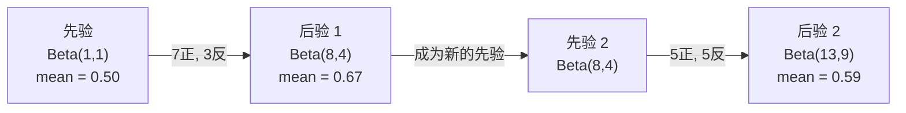

# 贝叶斯定理（Bayes' Theorem）

> 译注：本文译自同目录 [`en.md`](./en.md)。术语遵循仓根 [TRANSLATION_GUIDE.md](../../../../TRANSLATION_GUIDE.md)。

> 概率讲的是你预期会发生什么。贝叶斯定理讲的是你从中学到了什么。

**Type:** Build
**Language:** Python
**Prerequisites:** Phase 1, Lesson 06 (Probability Fundamentals)
**Time:** ~75 minutes

## 学习目标（Learning Objectives）

- 应用贝叶斯定理，从先验、似然和证据计算后验概率
- 从零搭建一个 Naive Bayes 文本分类器，带 Laplace 平滑和 log 空间计算
- 对比 MLE（极大似然估计）和 MAP（最大后验），并解释 MAP 为何对应 L2 正则化
- 用 Beta-Binomial 共轭先验实现序贯贝叶斯更新，做 A/B 测试

## 问题（The Problem）

某医学检测准确率 99%。你的检测结果是阳性。你真的得这个病的概率是多少？

大多数人会说 99%。真实答案取决于这个病有多罕见。如果每 1 万人里只有 1 人患病，那么阳性结果只意味着大约 1% 的患病可能。其余 99% 的阳性结果都是健康人身上的假警报。

这不是脑筋急转弯，这是贝叶斯定理。每一个垃圾邮件过滤器、每一次医学诊断、每一个量化不确定性的机器学习模型，背后都是同一套推理。你从一个信念出发，看到证据，然后更新它。

如果你不理解这套逻辑就去搭 ML 系统，你会误读模型输出、设错阈值、上线一个过度自信的预测器。

## 概念（The Concept）

### 从联合概率到贝叶斯（From joint probability to Bayes）

在 Lesson 06 你已经知道条件概率是：

```
P(A|B) = P(A and B) / P(B)
```

对称地：

```
P(B|A) = P(A and B) / P(A)
```

两个表达式分子相同：P(A and B)。把它们设为相等并整理：

```
P(A and B) = P(A|B) * P(B) = P(B|A) * P(A)

Therefore:

P(A|B) = P(B|A) * P(A) / P(B)
```

这就是贝叶斯定理。四个量，一个等式。

### 四个组成部分（The four parts）

| 部分 | 名称 | 含义 |
|------|------|---------------|
| P(A\|B) | Posterior（后验） | 看到证据 B 之后你对 A 的更新信念 |
| P(B\|A) | Likelihood（似然） | 如果 A 为真，证据 B 出现的概率 |
| P(A) | Prior（先验） | 在看到任何证据之前你对 A 的信念 |
| P(B) | Evidence（证据） | 在所有可能下看到 B 的总概率 |

证据项 P(B) 起到归一化的作用。可以用全概率公式展开：

```
P(B) = P(B|A) * P(A) + P(B|not A) * P(not A)
```

### 医学检测示例（Medical test example）

某种病每 1 万人里影响 1 人。检测准确率 99%（能查出 99% 的病人，假阳性率 1%）。

```
P(sick)          = 0.0001     (prior: disease is rare)
P(positive|sick) = 0.99       (likelihood: test catches it)
P(positive|healthy) = 0.01    (false positive rate)

P(positive) = P(positive|sick) * P(sick) + P(positive|healthy) * P(healthy)
            = 0.99 * 0.0001 + 0.01 * 0.9999
            = 0.000099 + 0.009999
            = 0.010098

P(sick|positive) = P(positive|sick) * P(sick) / P(positive)
                 = 0.99 * 0.0001 / 0.010098
                 = 0.0098
                 = 0.98%
```

不到 1%。先验主导了结果。当一个状况非常罕见时，即便检测很准确，绝大多数阳性也都是假阳性。这就是为什么医生会再开一份确认检测。

### 垃圾邮件过滤示例（Spam filter example）

你收到一封含有 "lottery" 这个词的邮件。它是垃圾邮件吗？

```
P(spam)                = 0.3      (30% of email is spam)
P("lottery"|spam)      = 0.05     (5% of spam emails contain "lottery")
P("lottery"|not spam)  = 0.001    (0.1% of legitimate emails contain "lottery")

P("lottery") = 0.05 * 0.3 + 0.001 * 0.7
             = 0.015 + 0.0007
             = 0.0157

P(spam|"lottery") = 0.05 * 0.3 / 0.0157
                  = 0.955
                  = 95.5%
```

一个词把概率从 30% 推到了 95.5%。真实的垃圾邮件过滤器会同时在数百个词上做贝叶斯。

### Naive Bayes：独立性假设（Naive Bayes: independence assumption）

Naive Bayes 把这套推理扩展到多特征——它假设给定类别后所有特征条件独立：

```
P(class | feature_1, feature_2, ..., feature_n)
  = P(class) * P(feature_1|class) * P(feature_2|class) * ... * P(feature_n|class)
    / P(feature_1, feature_2, ..., feature_n)
```

"naive"（朴素）就在于这个独立性假设。在文本里，词的出现并非独立（"New" 和 "York" 是相关的）。但实际效果出奇地好，因为分类器只需要给类别排序，不必输出校准良好的概率。

由于分母对所有类别都一样，可以直接忽略分母，只比较分子：

```
score(class) = P(class) * product of P(feature_i | class)
```

挑得分最高的类别。

### 极大似然估计（Maximum likelihood estimation, MLE）

P(feature|class) 怎么从训练数据里得到？数数。

```
P("free"|spam) = (number of spam emails containing "free") / (total spam emails)
```

这就是 MLE：选取让观测数据出现概率最大的参数值。你在最大化似然函数；对离散计数而言，它就退化成相对频率。

问题来了：如果某个词在训练里从未出现在 spam 中，MLE 会给它概率 0。一个没见过的词就会让整个乘积归零。用 Laplace 平滑修复它：

```
P(word|class) = (count(word, class) + 1) / (total_words_in_class + vocabulary_size)
```

给每个计数都加 1，确保任何概率都不会变成零。

### 最大后验（Maximum a posteriori, MAP）

MLE 问的是：什么参数让 P(data|parameters) 最大？

MAP 问的是：什么参数让 P(parameters|data) 最大？

由贝叶斯定理：

```
P(parameters|data) proportional to P(data|parameters) * P(parameters)
```

MAP 在参数本身上加了一个先验。如果你相信参数应当较小，就把这种偏好编码成一个对大值施加惩罚的先验。这与 ML 中的 L2 正则化完全等价。岭回归（ridge regression）里的 "ridge" 惩罚，本质上就是权重的高斯先验。

| 估计方式 | 优化目标 | ML 中的对应 |
|------------|-----------|---------------|
| MLE | P(data\|params) | 不带正则的训练 |
| MAP | P(data\|params) * P(params) | L2 / L1 正则化 |

### 贝叶斯派 vs 频率派：实际差别（Bayesian vs frequentist: the practical difference）

频率派把参数当成固定的未知量。他们问：「如果我把这个实验重复很多次，会发生什么？」

贝叶斯派把参数当成分布。他们问：「鉴于我观察到的数据，我对参数有什么信念？」

对搭 ML 系统而言，实际差别如下：

| 方面 | 频率派 | 贝叶斯派 |
|--------|-------------|----------|
| 输出 | 点估计 | 取值上的分布 |
| 不确定性 | 置信区间（关于流程） | 可信区间（关于参数） |
| 小数据 | 容易过拟合 | 先验起到正则作用 |
| 计算 | 通常更快 | 常需采样（MCMC） |

绝大多数生产 ML 是频率派（SGD、点估计）。当你需要校准良好的不确定性（医疗决策、安全攸关系统）或者数据稀缺（few-shot learning、冷启动）时，贝叶斯方法才大放异彩。

### 贝叶斯思维为什么对 ML 重要（Why Bayesian thinking matters for ML）

这层联系比类比更深：

**先验就是正则化。** 权重上的高斯先验等价于 L2 正则化，Laplace 先验等价于 L1。每次你加一项正则，其实都是在做一个关于参数取值的贝叶斯陈述。

**后验就是不确定性。** 单个预测概率不能告诉你模型对这个估计有多自信。贝叶斯方法给你一个分布：「我认为 P(spam) 在 0.8 到 0.95 之间。」

**贝叶斯更新就是在线学习。** 今天的后验就是明天的先验。模型看到新数据时是增量更新信念，而不是从头重训。

**模型比较是贝叶斯。** 贝叶斯信息准则（BIC）、边际似然、贝叶斯因子，都是用贝叶斯推理在不过拟合的前提下挑模型。

## 动手实现（Build It）

### 第 1 步：贝叶斯定理函数（Step 1: Bayes theorem function）

```python
def bayes(prior, likelihood, false_positive_rate):
    evidence = likelihood * prior + false_positive_rate * (1 - prior)
    posterior = likelihood * prior / evidence
    return posterior

result = bayes(prior=0.0001, likelihood=0.99, false_positive_rate=0.01)
print(f"P(sick|positive) = {result:.4f}")
```

### 第 2 步：Naive Bayes 分类器（Step 2: Naive Bayes classifier）

```python
import math
from collections import defaultdict

class NaiveBayes:
    def __init__(self, smoothing=1.0):
        self.smoothing = smoothing
        self.class_counts = defaultdict(int)
        self.word_counts = defaultdict(lambda: defaultdict(int))
        self.class_word_totals = defaultdict(int)
        self.vocab = set()

    def train(self, documents, labels):
        for doc, label in zip(documents, labels):
            self.class_counts[label] += 1
            words = doc.lower().split()
            for word in words:
                self.word_counts[label][word] += 1
                self.class_word_totals[label] += 1
                self.vocab.add(word)

    def predict(self, document):
        words = document.lower().split()
        total_docs = sum(self.class_counts.values())
        vocab_size = len(self.vocab)
        best_class = None
        best_score = float("-inf")
        for cls in self.class_counts:
            score = math.log(self.class_counts[cls] / total_docs)
            for word in words:
                count = self.word_counts[cls].get(word, 0)
                total = self.class_word_totals[cls]
                score += math.log((count + self.smoothing) / (total + self.smoothing * vocab_size))
            if score > best_score:
                best_score = score
                best_class = cls
        return best_class
```

log 概率可以避免下溢。把许多小概率乘起来会得到对浮点数太小的数；改成 log 概率求和，数值上稳定，数学上等价。

### 第 3 步：在垃圾邮件数据上训练（Step 3: Train on spam data）

```python
train_docs = [
    "win free money now",
    "free lottery ticket winner",
    "claim your prize today free",
    "urgent offer free cash",
    "congratulations you won free",
    "meeting tomorrow at noon",
    "project update attached",
    "can we schedule a call",
    "quarterly report review",
    "lunch on thursday sounds good",
    "team standup notes attached",
    "please review the pull request",
]

train_labels = [
    "spam", "spam", "spam", "spam", "spam",
    "ham", "ham", "ham", "ham", "ham", "ham", "ham",
]

classifier = NaiveBayes()
classifier.train(train_docs, train_labels)

test_messages = [
    "free money waiting for you",
    "meeting rescheduled to friday",
    "you won a free prize",
    "please review the attached report",
]

for msg in test_messages:
    print(f"  '{msg}' -> {classifier.predict(msg)}")
```

### 第 4 步：检视学到的概率（Step 4: Inspect the learned probabilities）

```python
def show_top_words(classifier, cls, n=5):
    vocab_size = len(classifier.vocab)
    total = classifier.class_word_totals[cls]
    probs = {}
    for word in classifier.vocab:
        count = classifier.word_counts[cls].get(word, 0)
        probs[word] = (count + classifier.smoothing) / (total + classifier.smoothing * vocab_size)
    sorted_words = sorted(probs.items(), key=lambda x: x[1], reverse=True)
    for word, prob in sorted_words[:n]:
        print(f"    {word}: {prob:.4f}")

print("\nTop spam words:")
show_top_words(classifier, "spam")
print("\nTop ham words:")
show_top_words(classifier, "ham")
```

## 用起来（Use It）

scikit-learn 自带可用于生产的 naive Bayes 实现：

```python
from sklearn.feature_extraction.text import CountVectorizer
from sklearn.naive_bayes import MultinomialNB
from sklearn.metrics import classification_report

vectorizer = CountVectorizer()
X_train = vectorizer.fit_transform(train_docs)
clf = MultinomialNB()
clf.fit(X_train, train_labels)

X_test = vectorizer.transform(test_messages)
predictions = clf.predict(X_test)
for msg, pred in zip(test_messages, predictions):
    print(f"  '{msg}' -> {pred}")
```

算法相同。CountVectorizer 负责 tokenize 和构建词表，MultinomialNB 内部处理平滑和 log 概率。你的 from-scratch 版本用 40 行做的也是这件事。

## 上线部署（Ship It）

这里搭的 NaiveBayes 类演示了完整流水线：tokenize、带 Laplace 平滑的概率估计、log 空间下的预测。`code/bayes.py` 中的代码端到端运行，除了 Python 标准库无任何依赖。

### 共轭先验（Conjugate Priors）

当先验和后验属于同一族分布时，这个先验就叫做「共轭」的。这让贝叶斯更新在代数上非常干净——你能拿到闭式后验，不需要数值积分。

| 似然 | 共轭先验 | 后验 | 例子 |
|-----------|----------------|-----------|---------|
| Bernoulli | Beta(a, b) | Beta(a + successes, b + failures) | 估计硬币偏置 |
| Normal（已知方差） | Normal(mu_0, sigma_0) | Normal（加权均值，方差更小） | 传感器校准 |
| Poisson | Gamma(a, b) | Gamma(a + sum of counts, b + n) | 到达率建模 |
| Multinomial | Dirichlet(alpha) | Dirichlet(alpha + counts) | 主题模型、语言模型 |

为什么这事重要：没有共轭先验，你就得用蒙特卡罗采样或变分推断来近似后验；有了共轭先验，你只需要更新两个数。

Beta 分布是实践中最常见的共轭先验。Beta(a, b) 表示你对某个概率参数的信念。均值是 a/(a+b)。a+b 越大，分布越集中（越自信）。

Beta 先验的几个特例：
- Beta(1, 1) = 均匀分布。你对参数没有任何看法。
- Beta(10, 10) = 在 0.5 处尖峰。你强烈相信参数在 0.5 附近。
- Beta(1, 10) = 偏向 0。你相信参数偏小。

更新规则简单到不能再简单：

```
Prior:     Beta(a, b)
Data:      s successes, f failures
Posterior: Beta(a + s, b + f)
```

不需要积分，不需要采样，只需要做加法。

### 序贯贝叶斯更新（Sequential Bayesian Updating）

贝叶斯推断天然是序贯的：今天的后验就是明天的先验。这正是真实系统在不重新处理所有历史数据的情况下，做增量学习的方式。

具体例子：估计一枚硬币是不是公平的。

**第 1 天：还没有数据。**
从 Beta(1, 1) 出发——一个均匀先验。你没有任何看法。
- 先验均值：0.5
- 先验在 [0, 1] 上是平的

**第 2 天：观察到 7 次正面、3 次反面。**
后验 = Beta(1 + 7, 1 + 3) = Beta(8, 4)
- 后验均值：8/12 = 0.667
- 证据表明硬币偏向正面

**第 3 天：又观察到 5 次正面、5 次反面。**
把昨天的后验当作今天的先验。
后验 = Beta(8 + 5, 4 + 5) = Beta(13, 9)
- 后验均值：13/22 = 0.591
- 这批均衡的新数据把估计往 0.5 拉回了一些



观测顺序不影响结果。把全部 12 次正面和 8 次反面一次性塞给 Beta(1,1) 更新，得到的同样是 Beta(13, 9)。序贯更新和 batch 更新在数学上等价。但序贯更新让你可以在每一步都做决策，而不必保留原始数据。

这就是生产 ML 系统中在线学习的基石。bandit 的 Thompson 采样、增量推荐系统、流式异常检测，全都用这套模式。

### 与 A/B 测试的联系（Connection to A/B Testing）

A/B 测试本质上就是化了妆的贝叶斯推断。

设定：你在测试两种按钮颜色。变体 A（蓝）和变体 B（绿）。你想知道哪个点击更多。

贝叶斯式 A/B 测试：

1. **先验。** 两个变体都从 Beta(1, 1) 出发。没有先入偏好。
2. **数据。** 变体 A：1000 次曝光中 50 次点击。变体 B：1000 次曝光中 65 次点击。
3. **后验。**
   - A：Beta(1 + 50, 1 + 950) = Beta(51, 951)。均值 = 0.051
   - B：Beta(1 + 65, 1 + 935) = Beta(66, 936)。均值 = 0.066
4. **决策。** 计算 P(B > A)——B 的真实转化率高于 A 的概率。

解析地求 P(B > A) 很难。但用蒙特卡罗就轻而易举：

```
1. Draw 100,000 samples from Beta(51, 951)  -> samples_A
2. Draw 100,000 samples from Beta(66, 936)  -> samples_B
3. P(B > A) = fraction of samples where B > A
```

如果 P(B > A) > 0.95，上 B；如果在 0.05 到 0.95 之间，继续收数据；如果 P(B > A) < 0.05，上 A。

相对于频率派 A/B 测试的好处：
- 你能直接得到一句概率陈述：「B 更好的概率是 97%」
- 没有 p 值的混乱，也没有「拒绝零假设失败」这种含糊其辞
- 你可以在任何时间点查看结果，不会膨胀假阳性率（没有 "peeking problem"）
- 可以纳入先验知识（比如以往测试表明转化率通常在 3%–8%）

| 方面 | 频率派 A/B | 贝叶斯 A/B |
|--------|----------------|--------------|
| 输出 | p 值 | P(B > A) |
| 解释 | 「如果 A=B，这批数据有多令人惊讶？」 | 「B 比 A 更好的可能性有多大？」 |
| 提前停止 | 会膨胀假阳性 | 任何时候都安全（前提是先验合理、模型规范正确） |
| 先验知识 | 不使用 | 编码为 Beta 先验 |
| 决策规则 | p < 0.05 | P(B > A) > 阈值 |

## 练习（Exercises）

1. **多次检测。** 一位患者在两次独立检测中都呈阳性（两次都是 99% 准确，发病率 1/10000）。两次检测之后 P(sick) 是多少？把第一次检测的后验作为第二次的先验。

2. **平滑的影响。** 用 0.01、0.1、1.0、10.0 这几个平滑值跑一遍 spam 分类器。top 词的概率会怎么变化？如果 smoothing=0、并且某个词只出现在 ham 中，会发生什么？

3. **加新特征。** 扩展 NaiveBayes 类，把消息长度（短/长）也作为特征，与词计数并列。从训练数据估计 P(short|spam) 和 P(short|ham)，并把它折进预测得分。

4. **手算 MAP。** 给定观测数据（10 次抛掷里 7 次正面），用 Beta(2,2) 先验计算偏置的 MAP 估计。把它和 MLE 估计（7/10）做个对比。

## 关键术语（Key Terms）

| 术语 | 大家通常怎么说 | 它实际是什么 |
|------|----------------|----------------------|
| Prior（先验） | 「我最初的猜测」 | 在观察到证据之前的 P(hypothesis)。在 ML 中：正则化项。 |
| Likelihood（似然） | 「数据拟合得多好」 | P(evidence\|hypothesis)。在某个特定假设下，观测数据出现的概率。 |
| Posterior（后验） | 「我更新后的信念」 | P(hypothesis\|evidence)。先验乘似然再归一化。 |
| Evidence（证据） | 「归一化常数」 | 在所有假设上的 P(data)，确保后验加和为 1。 |
| Naive Bayes | 「那个简单的文本分类器」 | 假设给定类别后特征独立的分类器。尽管假设不成立，效果却很好。 |
| Laplace smoothing | 「加一平滑」 | 给每个特征加一个小计数，防止未见数据带来零概率。 |
| MLE | 「直接用频率」 | 选取让 P(data\|parameters) 最大的参数。无先验。在小数据上易过拟合。 |
| MAP | 「带先验的 MLE」 | 选取让 P(data\|parameters) * P(parameters) 最大的参数。等价于带正则的 MLE。 |
| Log-probability | 「在 log 空间里算」 | 用 log(P) 替代 P，避免大量小数相乘时的浮点下溢。 |
| False positive（假阳性） | 「报错警」 | 检测说阳性，但真实状态是阴性。它是基率谬误（base rate fallacy）的根源。 |

## 延伸阅读（Further Reading）

- [3Blue1Brown: Bayes' theorem](https://www.youtube.com/watch?v=HZGCoVF3YvM) - 用医学检测例子做的可视化讲解
- [Stanford CS229: Generative Learning Algorithms](https://cs229.stanford.edu/notes2022fall/cs229-notes2.pdf) - naive Bayes 及其与判别式模型的联系
- [Think Bayes](https://greenteapress.com/wp/think-bayes/) - 免费书，用 Python 讲贝叶斯统计
- [scikit-learn Naive Bayes](https://scikit-learn.org/stable/modules/naive_bayes.html) - 生产实现，以及各变体的适用场景
