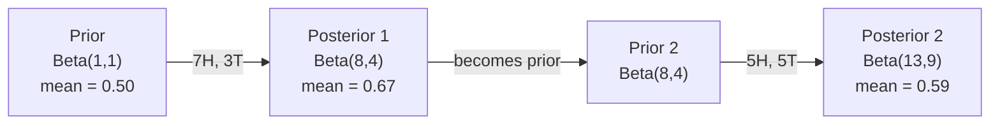

# Bayes' Theorem

> 概率取决于你的期望。贝氏定理关乎你学到的东西。

**Type:** Build
**Language:** Python
**Prerequisites:** Phase 1, Lesson 06 (Probability Fundamentals)
**Time:** ~75 minutes

## Learning Objectives

- Apply Bayes' theorem to compute posterior probabilities from priors, likelihoods, and evidence
- 利用拉普拉斯平滑和日志空间计算从头开始构建朴素的Bayes文本分类器
- 比较MLE和MAP估计并解释MAP如何对应于L2正规化
- 使用Beta-二项共乘先验实现顺序Bayesian更新以进行A/B测试

## The Problem

医学测试的准确率为99%。你检测呈阳性。您真正患有这种疾病的可能性有多大？

Most people say 99%. The real answer depends on how rare the disease is. If 1 in 10,000 people have it, a positive result only gives you about a 1% chance of being sick. The other 99% of positive results are false alarms from healthy people.

This is not a trick question. It is Bayes' theorem. Every spam filter, every medical diagnostic, every machine learning model that quantifies uncertainty uses this exact reasoning. You start with a belief. You see evidence. You update.

如果您在不了解这一点的情况下构建ML系统，您将误解模型输出、设置不良阈值并发布过于自信的预测。

## The Concept

### From joint probability to Bayes

您从06课已经知道条件概率是：

```
P(A|B) = P(A and B) / P(B)
```

对称地：

```
P(B|A) = P(A and B) / P(A)
```

两个表达式共享相同的分子：P（A和B）。将它们设置为相等并重新排列：

```
P(A and B) = P(A|B) * P(B) = P(B|A) * P(A)

Therefore:

P(A|B) = P(B|A) * P(A) / P(B)
```

That is Bayes' theorem. Four quantities, one equation.

### The four parts

| Part | 名称 | 意味着什么 |
|------|------|---------------|
| P(A\ | B) | Posterior | 看到证据B后您对A的更新信念 |
| P（B\ | A) | Likelihood | 如果A为真，证据B的可能性有多大 |
| P（A） | Prior | Your belief about A before seeing any evidence |
| P(B) | 证据 | 在所有可能性下看到B的总概率 |

The evidence term P(B) acts as a normalizer. You can expand it using the law of total probability:

```
P(B) = P(B|A) * P(A) + P(B|not A) * P(not A)
```

### Medical test example

A disease affects 1 in 10,000 people. The test is 99% accurate (catches 99% of sick people, gives false positives 1% of the time).

```
P(sick)          = 0.0001     (prior: disease is rare)
P(positive|sick) = 0.99       (likelihood: test catches it)
P(positive|healthy) = 0.01    (false positive rate)

P(positive) = P(positive|sick) * P(sick) + P(positive|healthy) * P(healthy)
            = 0.99 * 0.0001 + 0.01 * 0.9999
            = 0.000099 + 0.009999
            = 0.010098

P(sick|positive) = P(positive|sick) * P(sick) / P(positive)
                 = 0.99 * 0.0001 / 0.010098
                 = 0.0098
                 = 0.98%
```

不到1%。先验占主导地位。当病情罕见时，即使是准确的测试也大多会产生假阳性。这就是医生下令确认测试的原因。

### Spam filter example

您收到一封包含“彩票”一词的电子邮件。是垃圾邮件吗？

```
P(spam)                = 0.3      (30% of email is spam)
P("lottery"|spam)      = 0.05     (5% of spam emails contain "lottery")
P("lottery"|not spam)  = 0.001    (0.1% of legitimate emails contain "lottery")

P("lottery") = 0.05 * 0.3 + 0.001 * 0.7
             = 0.015 + 0.0007
             = 0.0157

P(spam|"lottery") = 0.05 * 0.3 / 0.0157
                  = 0.955
                  = 95.5%
```

一个词将可能性从30%转移到95.5%。真正的垃圾邮件过滤器同时对数百个单词应用Bayes。

### Naive Bayes: independence assumption

Naive Bayes通过假设所有特征在给定类别的情况下都有条件独立来将其扩展到多个特征：

```
P(class | feature_1, feature_2, ..., feature_n)
  = P(class) * P(feature_1|class) * P(feature_2|class) * ... * P(feature_n|class)
    / P(feature_1, feature_2, ..., feature_n)
```

The "naive" part is the independence assumption. In text, word occurrences are not independent ("New" and "York" are correlated). But the assumption works surprisingly well in practice because the classifier only needs to rank classes, not produce calibrated probabilities.

Since the denominator is the same for all classes, you can skip it and just compare numerators:

```
score(class) = P(class) * product of P(feature_i | class)
```

选择得分最高的班级。

### Maximum likelihood estimation (MLE)

如何获得P（功能|类）来自训练数据？算

```
P("free"|spam) = (number of spam emails containing "free") / (total spam emails)
```

This is MLE: choose the parameter values that make the observed data most likely. You are maximizing the likelihood function, which for discrete counts reduces to relative frequency.

Problem: if a word never appears in spam during training, MLE gives it probability zero. One unseen word kills the entire product. Fix this with Laplace smoothing:

```
P(word|class) = (count(word, class) + 1) / (total_words_in_class + vocabulary_size)
```

每个计数加1确保没有概率为零。

### Maximum a posteriori (MAP)

MLE询问：哪些参数最大化P（数据|参数）？

MAP asks: what parameters maximize P(parameters|data)?

By Bayes' theorem:

```
P(parameters|data) proportional to P(data|parameters) * P(parameters)
```

MAP在参数本身上添加了先验。如果您认为参数应该很小，则将其编码为惩罚大值的先验。这与ML中的L2正规化相同。岭回归中的“岭”罚分实际上是权重的高斯先验。

| 估计 | Optimizes | ML等效物 |
|------------|-----------|---------------|
| MLE | P(data\ | params) | 非正规培训 |
| 地图 | P（数据\ | params) * P(params) | L2 / L1正则化 |

### Bayesian vs frequentist: the practical difference

频率论者将参数视为固定的未知数。他们问：“如果我多次重复这个实验，会发生什么？"

Bayesian将参数视为分布。他们问：“鉴于我所观察到的情况，我对这些参数有何看法？"

对于构建ML系统，实际差异：

| 方面 | 频率论 | 贝叶斯 |
|--------|-------------|----------|
| Output | 点估计值 | 价值观的分布 |
| Uncertainty | Confidence intervals (about procedure) | Credible intervals (about parameter) |
| 小数据 | 可以过度贴合 | 先前充当正规化 |
| 计算 | 通常较快 | Often requires sampling (MCMC) |

Most production ML is frequentist (SGD, point estimates). Bayesian methods shine when you need calibrated uncertainty (medical decisions, safety-critical systems) or when data is scarce (few-shot learning, cold start).

### Why Bayesian thinking matters for ML

The connection is deeper than analogy:

** 前科已正规化。**权重的高斯先验是L2正规化。拉普拉斯先验是L1。每次添加一个正规化项时，您都会对您期望的参数值做出一个Bayesian声明。

** 后传是不确定的。**单个预测概率并不能告诉您模型对该估计的信心有多大。Bayesian方法为您提供分布：“我认为P（垃圾邮件）在0.8和0.95之间。"

**Bayes更新是在线学习。**今天的后验变成明天的前验。当您的模型看到新数据时，它会逐步更新其信念，而不是从头开始重新训练。

** 模型比较是Bayesian的。** Bayesian信息准则（BIC）、边际似然性和Bayeses因子都使用Bayesian推理在模型之间进行选择，而不会过度逼近。

## Build It

### Step 1: Bayes theorem function

```python
def bayes(prior, likelihood, false_positive_rate):
    evidence = likelihood * prior + false_positive_rate * (1 - prior)
    posterior = likelihood * prior / evidence
    return posterior

result = bayes(prior=0.0001, likelihood=0.99, false_positive_rate=0.01)
print(f"P(sick|positive) = {result:.4f}")
```

### Step 2: Naive Bayes classifier

```python
import math
from collections import defaultdict

class NaiveBayes:
    def __init__(self, smoothing=1.0):
        self.smoothing = smoothing
        self.class_counts = defaultdict(int)
        self.word_counts = defaultdict(lambda: defaultdict(int))
        self.class_word_totals = defaultdict(int)
        self.vocab = set()

    def train(self, documents, labels):
        for doc, label in zip(documents, labels):
            self.class_counts[label] += 1
            words = doc.lower().split()
            for word in words:
                self.word_counts[label][word] += 1
                self.class_word_totals[label] += 1
                self.vocab.add(word)

    def predict(self, document):
        words = document.lower().split()
        total_docs = sum(self.class_counts.values())
        vocab_size = len(self.vocab)
        best_class = None
        best_score = float("-inf")
        for cls in self.class_counts:
            score = math.log(self.class_counts[cls] / total_docs)
            for word in words:
                count = self.word_counts[cls].get(word, 0)
                total = self.class_word_totals[cls]
                score += math.log((count + self.smoothing) / (total + self.smoothing * vocab_size))
            if score > best_score:
                best_score = score
                best_class = cls
        return best_class
```

日志概率防止下溢。乘以许多小概率会产生对于浮点来说太小的数字。逻辑概率总和在数字上是稳定的，并且在数学上是等效的。

### Step 3: Train on spam data

```python
train_docs = [
    "win free money now",
    "free lottery ticket winner",
    "claim your prize today free",
    "urgent offer free cash",
    "congratulations you won free",
    "meeting tomorrow at noon",
    "project update attached",
    "can we schedule a call",
    "quarterly report review",
    "lunch on thursday sounds good",
    "team standup notes attached",
    "please review the pull request",
]

train_labels = [
    "spam", "spam", "spam", "spam", "spam",
    "ham", "ham", "ham", "ham", "ham", "ham", "ham",
]

classifier = NaiveBayes()
classifier.train(train_docs, train_labels)

test_messages = [
    "free money waiting for you",
    "meeting rescheduled to friday",
    "you won a free prize",
    "please review the attached report",
]

for msg in test_messages:
    print(f"  '{msg}' -> {classifier.predict(msg)}")
```

### Step 4: Inspect the learned probabilities

```python
def show_top_words(classifier, cls, n=5):
    vocab_size = len(classifier.vocab)
    total = classifier.class_word_totals[cls]
    probs = {}
    for word in classifier.vocab:
        count = classifier.word_counts[cls].get(word, 0)
        probs[word] = (count + classifier.smoothing) / (total + classifier.smoothing * vocab_size)
    sorted_words = sorted(probs.items(), key=lambda x: x[1], reverse=True)
    for word, prob in sorted_words[:n]:
        print(f"    {word}: {prob:.4f}")

print("\nTop spam words:")
show_top_words(classifier, "spam")
print("\nTop ham words:")
show_top_words(classifier, "ham")
```

## Use It

Scikit-learn推出了可生产的原始Bayes实现：

```python
from sklearn.feature_extraction.text import CountVectorizer
from sklearn.naive_bayes import MultinomialNB
from sklearn.metrics import classification_report

vectorizer = CountVectorizer()
X_train = vectorizer.fit_transform(train_docs)
clf = MultinomialNB()
clf.fit(X_train, train_labels)

X_test = vectorizer.transform(test_messages)
predictions = clf.predict(X_test)
for msg, pred in zip(test_messages, predictions):
    print(f"  '{msg}' -> {pred}")
```

Same algorithm. CountVectorizer handles tokenization and vocabulary building. MultinomialNB handles smoothing and log-probabilities internally. Your from-scratch version does the same thing in 40 lines.

## Ship It

The NaiveBayes class built here demonstrates the full pipeline: tokenization, probability estimation with Laplace smoothing, log-space prediction. The code in `code/bayes.py` runs end-to-end with no dependencies beyond Python's standard library.

### Conjugate Priors

当先验和后验属于同一个分布族时，先验被称为“共轭”。“这使得贝叶斯更新代数干净-你得到一个封闭形式的后验没有数值积分。

| 可能性 | Conjugate Prior | 后 | 例如 |
|-----------|----------------|-----------|---------|
| 伯努利 | Beta(a, b) | Beta（a +成功，b +失败） | 抛硬币偏差估计 |
| 正态（已知方差） | 正常（mu_0，西格玛_0） | 正态（加权平均值，方差较小） | Sensor calibration |
| 泊松 | 伽玛（a，b） | 伽玛（a +计数和，b + n） | Modeling arrival rates |
| 多项式 | 狄利克雷（Alpha） | Dirichlet（阿尔法+计数） | Topic modeling, language models |

为什么这很重要：如果没有共乘先验，您需要蒙特卡洛抽样或变分推断来逼近后验。对于共乘先验，您只需更新两个数字。

Beta分布是实践中最常见的共乘先验。Beta（a，b）代表您对概率参数的信念。平均值是a/（a+b）。a+b越大，分布越集中（有信心）。

Special cases of the Beta prior:
- Beta（1，1）=均匀。您对该参数没有意见。
- Beta（10，10）=峰值为0.5。你坚信参数在0.5附近。
- Beta(1, 10) = skewed toward 0. You believe the parameter is small.

The update rule is dead simple:

```
Prior:     Beta(a, b)
Data:      s successes, f failures
Posterior: Beta(a + s, b + f)
```

没有积分。没有抽样。只是添加。

### Sequential Bayesian Updating

Bayesian推理自然是连续的。今天的后验变成明天的前验。这就是真实系统渐进式学习的方式，而无需重新处理所有历史数据。

Concrete example: estimating whether a coin is fair.

**Day 1: No data yet.**
Start with Beta(1, 1) -- a uniform prior. You have no opinion.
- 先验平均值：0.5
- Prior在[0，1]上是平坦的

**Day 2: Observe 7 heads, 3 tails.**
Posterior = Beta(1 + 7, 1 + 3) = Beta(8, 4)
- Posterior mean: 8/12 = 0.667
- 有证据表明硬币偏向正面

** 第3天：观察另外5个正面，5个反面。**
使用昨天的后验作为今天的前验。
后验= Beta（8 + 5，4 + 5）= Beta（13，9）
- Posterior mean: 13/22 = 0.591
- 平衡的新数据将估计值拉回至0.5



观察的顺序并不重要。同时更新所有12个正面和8个反面的Beta（1，1），给出Beta（13，9）--相同的结果。顺序更新和批量更新在数学上是等效的。但顺序更新可以让您在每一步做出决策，而无需存储原始数据。

这是生产ML系统在线学习的基础。针对土匪的汤普森采样、增量推荐系统和流异常检测器都使用这种模式。

### Connection to A/B Testing

A/B测试是伪装的Bayesian推理。

Setup: you are testing two button colors. Variant A (blue) and variant B (green). You want to know which one gets more clicks.

The Bayesian A/B test:

1. ** 先验。**对于这两个变体，从Beta（1，1）开始。没有优先偏好。
2. ** 数据。**变体A：1000次查看中有50次点击。变体B：1000次查看中有65次点击。
3. **Posteriors.**
   - A：Beta（1 + 50，1 + 950）= Beta（51，951）。平均值= 0.051
   - B：Beta（1 + 65，1 + 935）= Beta（66，936）。平均值= 0.066
4. **Decision.** Compute P(B > A) -- the probability that B's true conversion rate is higher than A's.

分析计算P（B > A）很困难。但蒙特卡洛让它变得微不足道：

```
1. Draw 100,000 samples from Beta(51, 951)  -> samples_A
2. Draw 100,000 samples from Beta(66, 936)  -> samples_B
3. P(B > A) = fraction of samples where B > A
```

如果P（B > A）> 0.95，则发送变体B。如果在0.05和0.95之间，则继续收集数据。如果P（B > A）< 0.05，则发送变体A。

Advantages over frequentist A/B testing:
- You get a direct probability statement: "there is a 97% chance B is better"
- 没有p值混淆。没有“未能拒绝零假设”的对冲。
- 您可以随时检查结果，而不会夸大假阳性率（没有“偷看问题”）
- You can incorporate prior knowledge (e.g., previous tests suggest conversion rates are usually 3-8%)

| 方面 | 常客A/B | Bayesian A/B |
|--------|----------------|--------------|
| 输出 | p值 | P（B > A） |
| 解释 | “如果A=B，这个数据有多令人惊讶？" | "How likely is B better than A?" |
| Early stopping | 增加假阳性 | 在任何时候都安全（给定精心选择的先前且正确指定的模型） |
| Prior knowledge | Not used | 之前编码为Beta |
| 决策规则 | p < 0.05 | P（B > A）>阈值 |

## Exercises

1. ** 多次测试。**患者在独立检测中两次检测呈阳性（准确率均为99%，疾病患病率为万分之1）。两次测试后P（sick）是多少？使用第一次测试的后验作为第二次测试的前验。

2. ** 平滑影响。**运行平滑值为0.01、0.1、1.0和10.0的垃圾邮件分类器。顶级单词概率如何变化？平滑=0和只出现在火腿中的单词会发生什么？

3. ** 添加功能。**扩展NaiveBayes类，以将消息长度（短/长）作为与字数一起使用的功能。估计P（短|垃圾邮件）和P（简短|ham），并将其折叠到预测得分中。

4. ** 手动地图。**给定观察到的数据（10次抛硬币中有7个正面），使用Beta（2，2）先验计算偏差的MAP估计。将其与MLE估计值（7/10）进行比较。

## Key Terms

| Term | What people say | 它实际上意味着什么 |
|------|----------------|----------------------|
| 之前 | “我最初的猜测” | P（假设）在观察证据之前。ML中：正规化术语。 |
| 可能性 | "How well the data fits" | P(evidence\ | hypothesis). How probable the observed data is under a specific hypothesis. |
| 后 | “我更新的信念” | P(hypothesis\ | evidence). The prior multiplied by the likelihood, then normalized. |
| 证据 | “归一化常数” | P(data) across all hypotheses. Ensures the posterior sums to 1. |
| Naive Bayes | “那个简单的文本分类器” | 假设特征在给定类别时是独立的分类器。尽管假设错误，但效果良好。 |
| Laplace smoothing | “加一平滑” | 为每个特征添加一小部分计数，以防止未见数据的概率为零。 |
| MLE | "Just use the frequencies" | 选择最大化P（数据\ | 参数）。没有先验。可以过度适应小数据。 |
| 地图 | “有前科的MLE” | 选择最大化P（数据\ | 参数）* P（参数）。相当于正规化的MLE。 |
| Log-probability | “在日志空间中工作” | 使用log（P）代替P以避免在乘许多小数时出现浮点下溢。 |
| False positive | “警报错误” | 测试显示阳性，但真实状态是阴性。推动了基本利率谬误。 |

## Further Reading

- [3Blue1Brown: Bayes' theorem](https://www.youtube.com/watch?v=HZGCoVF3YvM) - visual explanation with the medical test example
- [斯坦福CS 229：生成式学习算法]（https：//cs229.stanford.edu/notes2022fall/cs229-notes2.pdf）-天真的Bayes及其与区分模型的连接
- [Think Bayes]（https：//greenteapress.com/wp/think-bayes/）-免费书籍，带Python代码的Bayesian统计
- [scikit-learn Naive Bayes]（https：//scikit-learn.org/stable/modules/naive_bayes.html）-生产实现以及何时使用每个变体
