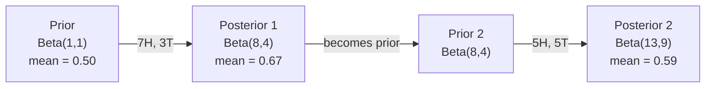

# 07 · 贝叶斯定理

> 概率讲的是你预期会发生什么。贝叶斯定理讲的是你从中学到了什么。

**类型：** 实战 | **语言：** Python | **前置：** 阶段 1，第 06 课（概率基础） | **时长：** 约 75 分钟

## 学习目标

- 应用「贝叶斯定理（Bayes' theorem）」，从先验、似然和证据计算后验概率
- 从零构建一个带「拉普拉斯平滑（Laplace smoothing）」和对数空间计算的「朴素贝叶斯（Naive Bayes）」文本分类器
- 比较「最大似然估计（MLE）」与「最大后验估计（MAP）」，并解释 MAP 如何对应 L2 正则化
- 使用「Beta-二项共轭先验（Beta-Binomial conjugate priors）」为 A/B 测试实现序贯贝叶斯更新

## 问题

一项医学检测的准确率为 99%。你的检测结果呈阳性。那么你真正患病的概率有多大？

大多数人会说 99%。真实答案取决于这种疾病有多罕见。如果每 10000 人中只有 1 人患病，那么一个阳性结果只意味着你大约有 1% 的概率真的生病。剩下 99% 的阳性结果都是来自健康人群的误报。

这不是脑筋急转弯，而是贝叶斯定理。每一个垃圾邮件过滤器、每一个医学诊断、每一个量化不确定性的机器学习模型，用的都是这套完全相同的推理。你从一个信念出发，看到证据，然后更新。

如果你在构建机器学习系统时不理解这一点，就会误读模型输出、设置错误的阈值，并上线过度自信的预测。

## 概念

### 从联合概率到贝叶斯

你已经从第 06 课了解到，条件概率为：

```
P(A|B) = P(A and B) / P(B)
```

对称地：

```
P(B|A) = P(A and B) / P(A)
```

这两个表达式共享同一个分子：P(A and B)。令它们相等并重新整理：

```
P(A and B) = P(A|B) * P(B) = P(B|A) * P(A)

因此：

P(A|B) = P(B|A) * P(A) / P(B)
```

这就是贝叶斯定理。四个量，一个等式。

### 四个组成部分

| 部分 | 名称 | 含义 |
|------|------|---------------|
| P(A\|B) | 后验（Posterior） | 在看到证据 B 之后，你对 A 的更新信念 |
| P(B\|A) | 似然（Likelihood） | 如果 A 为真，证据 B 出现的概率有多大 |
| P(A) | 先验（Prior） | 在看到任何证据之前，你对 A 的信念 |
| P(B) | 证据（Evidence） | 在所有可能情形下看到 B 的总概率 |

证据项 P(B) 起到归一化的作用。你可以用「全概率公式（law of total probability）」将其展开：

```
P(B) = P(B|A) * P(A) + P(B|not A) * P(not A)
```

### 医学检测示例

某种疾病每 10000 人中影响 1 人。检测准确率为 99%（能检出 99% 的患病者，并有 1% 的概率给出误报）。

```
P(sick)          = 0.0001     (先验：疾病很罕见)
P(positive|sick) = 0.99       (似然：检测能查出它)
P(positive|healthy) = 0.01    (误报率)

P(positive) = P(positive|sick) * P(sick) + P(positive|healthy) * P(healthy)
            = 0.99 * 0.0001 + 0.01 * 0.9999
            = 0.000099 + 0.009999
            = 0.010098

P(sick|positive) = P(positive|sick) * P(sick) / P(positive)
                 = 0.99 * 0.0001 / 0.010098
                 = 0.0098
                 = 0.98%
```

不到 1%。先验占据主导。当一种状况很罕见时，即使是准确的检测也会产生大量误报。这正是医生要安排复检的原因。

### 垃圾邮件过滤器示例

你收到一封包含 "lottery"（彩票）一词的邮件。它是垃圾邮件吗？

```
P(spam)                = 0.3      (30% 的邮件是垃圾邮件)
P("lottery"|spam)      = 0.05     (5% 的垃圾邮件包含 "lottery")
P("lottery"|not spam)  = 0.001    (0.1% 的正常邮件包含 "lottery")

P("lottery") = 0.05 * 0.3 + 0.001 * 0.7
             = 0.015 + 0.0007
             = 0.0157

P(spam|"lottery") = 0.05 * 0.3 / 0.0157
                  = 0.955
                  = 95.5%
```

仅一个词就把概率从 30% 拉升到 95.5%。真正的垃圾邮件过滤器会同时对数百个词应用贝叶斯定理。

### 朴素贝叶斯：独立性假设

朴素贝叶斯通过假设给定类别后所有特征条件独立，把这套方法扩展到多个特征：

```
P(class | feature_1, feature_2, ..., feature_n)
  = P(class) * P(feature_1|class) * P(feature_2|class) * ... * P(feature_n|class)
    / P(feature_1, feature_2, ..., feature_n)
```

「朴素（naive）」之处就在于这个独立性假设。在文本中，词语的出现并不独立（"New" 和 "York" 是相关的）。但这一假设在实践中出奇地有效，因为分类器只需要给类别排序，并不需要产出校准过的概率。

由于分母对所有类别都相同，你可以略过它，只比较分子：

```
score(class) = P(class) * product of P(feature_i | class)
```

选择得分最高的类别。

### 最大似然估计（MLE）

如何从训练数据得到 P(feature|class)？数数。

```
P("free"|spam) = (number of spam emails containing "free") / (total spam emails)
```

这就是 MLE：选择能让观测数据出现概率最大的参数值。你在最大化似然函数，对于离散计数而言，它退化为相对频率。

问题：如果某个词在训练中从未出现在垃圾邮件里，MLE 会给它零概率。一个没见过的词就能让整个乘积归零。用拉普拉斯平滑来修复这一点：

```
P(word|class) = (count(word, class) + 1) / (total_words_in_class + vocabulary_size)
```

给每个计数都加 1，确保任何概率都不会为零。

### 最大后验估计（MAP）

MLE 问的是：哪些参数能最大化 P(data|parameters)？

MAP 问的是：哪些参数能最大化 P(parameters|data)？

由贝叶斯定理：

```
P(parameters|data) proportional to P(data|parameters) * P(parameters)
```

MAP 在参数本身之上加了一个先验。如果你认为参数应该偏小，就把这一点编码为一个惩罚大数值的先验。这与机器学习中的 L2 正则化完全等价。「岭回归（ridge regression）」中的「岭（ridge）」惩罚项，本质上就是权重上的「高斯先验（Gaussian prior）」。

| 估计方法 | 优化目标 | 机器学习中的等价物 |
|------------|-----------|---------------|
| MLE | P(data\|params) | 无正则化训练 |
| MAP | P(data\|params) * P(params) | L2 / L1 正则化 |

### 贝叶斯派 vs 频率派：实际差异

「频率派（Frequentist）」把参数视为固定的未知量。他们问：「如果我把这个实验重复很多次，会发生什么？」

「贝叶斯派（Bayesian）」把参数视为分布。他们问：「在我已经观测到的基础上，我对参数有什么信念？」

对于构建机器学习系统而言，实际差异如下：

| 方面 | 频率派 | 贝叶斯派 |
|--------|-------------|----------|
| 输出 | 点估计 | 取值上的分布 |
| 不确定性 | 置信区间（关于流程） | 可信区间（关于参数） |
| 小数据 | 可能过拟合 | 先验起到正则化作用 |
| 计算 | 通常更快 | 往往需要采样（MCMC） |

大多数生产环境的机器学习是频率派的（SGD、点估计）。当你需要校准过的不确定性（医疗决策、安全攸关系统），或数据稀缺时（少样本学习、冷启动），贝叶斯方法就大放异彩。

### 为什么贝叶斯思维对机器学习很重要

这种联系比类比更深刻：

**先验即正则化。** 权重上的高斯先验就是 L2 正则化，拉普拉斯先验就是 L1。每当你添加一个正则化项，你其实就是在做一个贝叶斯式的陈述，表达你预期参数取什么值。

**后验即不确定性。** 单个预测概率无法告诉你模型对该估计有多大把握。贝叶斯方法给你一个分布：「我认为 P(spam) 在 0.8 到 0.95 之间。」

**贝叶斯更新即在线学习。** 今天的后验会成为明天的先验。当模型看到新数据时，它会增量式地更新信念，而不是从头重训。

**模型比较即贝叶斯。** 「贝叶斯信息准则（BIC）」、「边际似然（marginal likelihood）」和「贝叶斯因子（Bayes factors）」都用贝叶斯推理来在模型之间做选择，而不至于过拟合。

## 动手构建

### 第 1 步：贝叶斯定理函数

```python
def bayes(prior, likelihood, false_positive_rate):
    evidence = likelihood * prior + false_positive_rate * (1 - prior)
    posterior = likelihood * prior / evidence
    return posterior

result = bayes(prior=0.0001, likelihood=0.99, false_positive_rate=0.01)
print(f"P(sick|positive) = {result:.4f}")
```

### 第 2 步：朴素贝叶斯分类器

```python
import math
from collections import defaultdict

class NaiveBayes:
    def __init__(self, smoothing=1.0):
        self.smoothing = smoothing
        self.class_counts = defaultdict(int)
        self.word_counts = defaultdict(lambda: defaultdict(int))
        self.class_word_totals = defaultdict(int)
        self.vocab = set()

    def train(self, documents, labels):
        for doc, label in zip(documents, labels):
            self.class_counts[label] += 1
            words = doc.lower().split()
            for word in words:
                self.word_counts[label][word] += 1
                self.class_word_totals[label] += 1
                self.vocab.add(word)

    def predict(self, document):
        words = document.lower().split()
        total_docs = sum(self.class_counts.values())
        vocab_size = len(self.vocab)
        best_class = None
        best_score = float("-inf")
        for cls in self.class_counts:
            score = math.log(self.class_counts[cls] / total_docs)
            for word in words:
                count = self.word_counts[cls].get(word, 0)
                total = self.class_word_totals[cls]
                score += math.log((count + self.smoothing) / (total + self.smoothing * vocab_size))
            if score > best_score:
                best_score = score
                best_class = cls
        return best_class
```

对数概率可防止下溢。把许多小概率相乘会得到对浮点数而言过小的数字。对对数概率求和则数值稳定，且在数学上等价。

### 第 3 步：在垃圾邮件数据上训练

```python
train_docs = [
    "win free money now",
    "free lottery ticket winner",
    "claim your prize today free",
    "urgent offer free cash",
    "congratulations you won free",
    "meeting tomorrow at noon",
    "project update attached",
    "can we schedule a call",
    "quarterly report review",
    "lunch on thursday sounds good",
    "team standup notes attached",
    "please review the pull request",
]

train_labels = [
    "spam", "spam", "spam", "spam", "spam",
    "ham", "ham", "ham", "ham", "ham", "ham", "ham",
]

classifier = NaiveBayes()
classifier.train(train_docs, train_labels)

test_messages = [
    "free money waiting for you",
    "meeting rescheduled to friday",
    "you won a free prize",
    "please review the attached report",
]

for msg in test_messages:
    print(f"  '{msg}' -> {classifier.predict(msg)}")
```

### 第 4 步：检查学到的概率

```python
def show_top_words(classifier, cls, n=5):
    vocab_size = len(classifier.vocab)
    total = classifier.class_word_totals[cls]
    probs = {}
    for word in classifier.vocab:
        count = classifier.word_counts[cls].get(word, 0)
        probs[word] = (count + classifier.smoothing) / (total + classifier.smoothing * vocab_size)
    sorted_words = sorted(probs.items(), key=lambda x: x[1], reverse=True)
    for word, prob in sorted_words[:n]:
        print(f"    {word}: {prob:.4f}")

print("\nTop spam words:")
show_top_words(classifier, "spam")
print("\nTop ham words:")
show_top_words(classifier, "ham")
```

## 实际使用

Scikit-learn 自带了生产可用的朴素贝叶斯实现：

```python
from sklearn.feature_extraction.text import CountVectorizer
from sklearn.naive_bayes import MultinomialNB
from sklearn.metrics import classification_report

vectorizer = CountVectorizer()
X_train = vectorizer.fit_transform(train_docs)
clf = MultinomialNB()
clf.fit(X_train, train_labels)

X_test = vectorizer.transform(test_messages)
predictions = clf.predict(X_test)
for msg, pred in zip(test_messages, predictions):
    print(f"  '{msg}' -> {pred}")
```

同样的算法。CountVectorizer 负责分词和词表构建，MultinomialNB 在内部处理平滑和对数概率。你从零写的版本用 40 行代码做的是同一件事。

## 上线交付

这里构建的 NaiveBayes 类展示了完整的流水线：分词、带拉普拉斯平滑的概率估计、对数空间预测。`code/bayes.py` 中的代码可端到端运行，除 Python 标准库外无任何依赖。

### 共轭先验

当先验和后验属于同一分布族时，该先验被称为「共轭（conjugate）」先验。这让贝叶斯更新在代数上变得干净利落——你能得到一个闭式后验，无需数值积分。

| 似然 | 共轭先验 | 后验 | 示例 |
|-----------|----------------|-----------|---------|
| Bernoulli | Beta(a, b) | Beta(a + successes, b + failures) | 抛硬币偏差估计 |
| Normal（已知方差） | Normal(mu_0, sigma_0) | Normal(加权均值, 更小的方差) | 传感器校准 |
| Poisson | Gamma(a, b) | Gamma(a + sum of counts, b + n) | 到达率建模 |
| Multinomial | Dirichlet(alpha) | Dirichlet(alpha + counts) | 主题建模、语言模型 |

为什么这很重要：没有共轭先验时，你需要用「蒙特卡洛采样（Monte Carlo sampling）」或「变分推断（variational inference）」来近似后验；有了共轭先验，你只需更新两个数字。

「Beta 分布（Beta distribution）」是实践中最常见的共轭先验。Beta(a, b) 表示你对一个概率参数的信念。其均值为 a/(a+b)。a+b 越大，分布就越集中（越自信）。

Beta 先验的几个特例：
- Beta(1, 1) = 均匀分布。你对该参数没有任何意见。
- Beta(10, 10) = 在 0.5 处呈峰。你强烈认为该参数接近 0.5。
- Beta(1, 10) = 偏向 0。你认为该参数很小。

更新规则极其简单：

```
Prior:     Beta(a, b)
Data:      s successes, f failures
Posterior: Beta(a + s, b + f)
```

没有积分，没有采样，只有加法。

### 序贯贝叶斯更新

贝叶斯推断天然是序贯的。今天的后验会成为明天的先验。真实系统正是这样在不重新处理全部历史数据的情况下增量学习的。

具体例子：估计一枚硬币是否公平。

**第 1 天：尚无数据。**
从 Beta(1, 1) 开始——一个均匀先验。你没有任何意见。
- 先验均值：0.5
- 先验在 [0, 1] 上是平的

**第 2 天：观测到 7 次正面、3 次反面。**
后验 = Beta(1 + 7, 1 + 3) = Beta(8, 4)
- 后验均值：8/12 = 0.667
- 证据表明这枚硬币偏向正面

**第 3 天：再观测到 5 次正面、5 次反面。**
把昨天的后验当作今天的先验。
后验 = Beta(8 + 5, 4 + 5) = Beta(13, 9)
- 后验均值：13/22 = 0.591
- 均衡的新数据把估计拉回到接近 0.5



观测的顺序无关紧要。用全部 12 次正面和 8 次反面一次性更新 Beta(1,1)，会得到 Beta(13, 9)——结果完全相同。序贯更新和批量更新在数学上等价。但序贯更新让你能在每一步做出决策，而无需存储原始数据。

这是生产环境机器学习系统中在线学习的基础。用于多臂老虎机的「汤普森采样（Thompson sampling）」、增量式推荐系统，以及流式异常检测器，全都使用这一模式。

### 与 A/B 测试的联系

A/B 测试就是披着外衣的贝叶斯推断。

设定：你在测试两种按钮颜色。变体 A（蓝色）和变体 B（绿色）。你想知道哪一个能获得更多点击。

贝叶斯式的 A/B 测试：

1. **先验。** 对两个变体都从 Beta(1, 1) 开始。没有先入为主的偏好。
2. **数据。** 变体 A：1000 次浏览中 50 次点击。变体 B：1000 次浏览中 65 次点击。
3. **后验。**
   - A：Beta(1 + 50, 1 + 950) = Beta(51, 951)。均值 = 0.051
   - B：Beta(1 + 65, 1 + 935) = Beta(66, 936)。均值 = 0.066
4. **决策。** 计算 P(B > A)——即 B 的真实转化率高于 A 的概率。

解析地计算 P(B > A) 很难。但蒙特卡洛方法让它变得轻而易举：

```
1. Draw 100,000 samples from Beta(51, 951)  -> samples_A
2. Draw 100,000 samples from Beta(66, 936)  -> samples_B
3. P(B > A) = fraction of samples where B > A
```

如果 P(B > A) > 0.95，就上线变体 B。如果它介于 0.05 和 0.95 之间，就继续收集数据。如果 P(B > A) < 0.05，就上线变体 A。

相对于频率派 A/B 测试的优势：
- 你能得到一个直接的概率陈述：「B 更好的概率是 97%」
- 没有 p 值的困惑，没有「未能拒绝原假设」式的含糊措辞。
- 你可以随时查看结果，而不会抬高误报率（没有「偷看问题（peeking problem）」）
- 你可以纳入先验知识（例如，以往的测试表明转化率通常在 3%-8% 之间）

| 方面 | 频率派 A/B | 贝叶斯派 A/B |
|--------|----------------|--------------|
| 输出 | p 值 | P(B > A) |
| 解释 | 「如果 A=B，这份数据有多令人意外？」 | 「B 比 A 更好的可能性有多大？」 |
| 提前停止 | 抬高误报率 | 任何时刻都安全（前提是选了恰当的先验且模型设定正确） |
| 先验知识 | 不使用 | 编码为 Beta 先验 |
| 决策规则 | p < 0.05 | P(B > A) > 阈值 |

## 练习

1. **多次检测。** 一名患者在两次独立检测中都呈阳性（两次都 99% 准确，疾病患病率为每 10000 人 1 例）。两次检测之后 P(sick) 是多少？把第一次检测的后验当作第二次的先验。

2. **平滑的影响。** 用 0.01、0.1、1.0 和 10.0 这几个平滑值运行垃圾邮件分类器。最高频词的概率如何变化？当 smoothing=0 且某个词只出现在 ham 中时会发生什么？

3. **添加特征。** 扩展 NaiveBayes 类，让它在词频之外也把邮件长度（短/长）作为一个特征。从训练数据估计 P(short|spam) 和 P(short|ham)，并将其折入预测得分。

4. **手算 MAP。** 给定观测数据（10 次抛硬币中有 7 次正面），用 Beta(2,2) 先验计算偏差的 MAP 估计。将其与 MLE 估计（7/10）作比较。

## 关键术语

| 术语 | 人们怎么说 | 实际含义 |
|------|----------------|----------------------|
| 先验（Prior） | 「我的初始猜测」 | 观测证据之前的 P(hypothesis)。在机器学习中：正则化项。 |
| 似然（Likelihood） | 「数据拟合得有多好」 | P(evidence\|hypothesis)。在某个特定假设下，观测数据出现的概率有多大。 |
| 后验（Posterior） | 「我更新后的信念」 | P(hypothesis\|evidence)。先验乘以似然，再归一化。 |
| 证据（Evidence） | 「归一化常数」 | 跨所有假设的 P(data)。确保后验之和为 1。 |
| 朴素贝叶斯（Naive Bayes） | 「那个简单的文本分类器」 | 一种假设给定类别后特征相互独立的分类器。尽管假设是错的，效果却很好。 |
| 拉普拉斯平滑（Laplace smoothing） | 「加一平滑」 | 给每个特征加一个小计数，防止未见数据导致零概率。 |
| MLE | 「直接用频率就行」 | 选择能最大化 P(data\|parameters) 的参数。无先验。小数据下可能过拟合。 |
| MAP | 「带先验的 MLE」 | 选择能最大化 P(data\|parameters) * P(parameters) 的参数。等价于带正则化的 MLE。 |
| 对数概率（Log-probability） | 「在对数空间里算」 | 使用 log(P) 而非 P，以避免在相乘许多小数时出现浮点下溢。 |
| 误报（False positive） | 「一次错误的警报」 | 检测说是阳性，但真实状态是阴性。它是基率谬误的根源。 |

## 延伸阅读

- [3Blue1Brown：贝叶斯定理](https://www.youtube.com/watch?v=HZGCoVF3YvM) —— 用医学检测示例做的可视化讲解
- [Stanford CS229：生成式学习算法](https://cs229.stanford.edu/notes2022fall/cs229-notes2.pdf) —— 朴素贝叶斯及其与判别式模型的联系
- [Think Bayes](https://greenteapress.com/wp/think-bayes/) —— 免费书籍，用 Python 代码讲贝叶斯统计
- [scikit-learn 朴素贝叶斯](https://scikit-learn.org/stable/modules/naive_bayes.html) —— 生产级实现，以及各变体的适用场景
