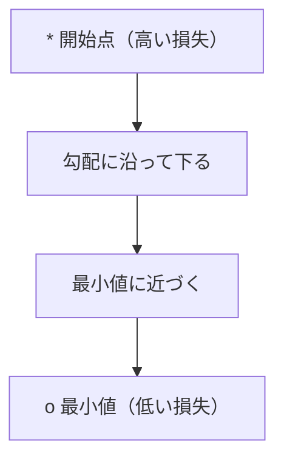
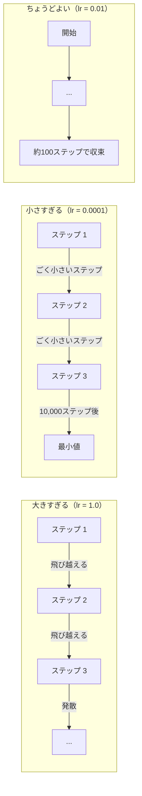
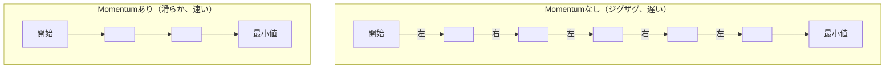
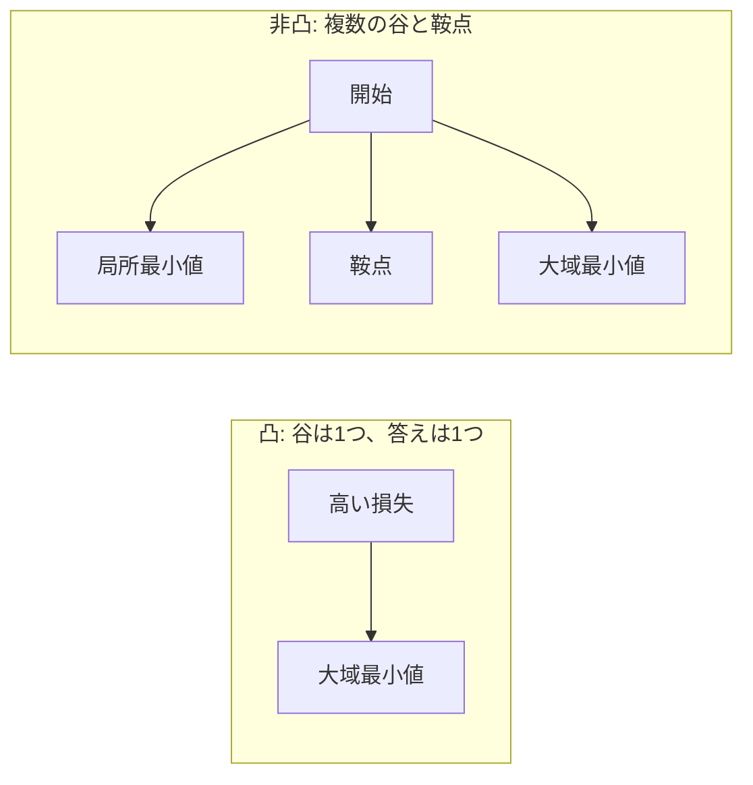
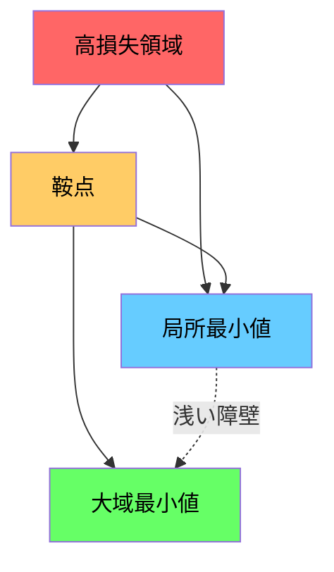

# 最適化

> ニューラルネットワークの訓練とは、谷底を見つけることにすぎません。

**種別:** 構築
**言語:** Python
**前提条件:** Phase 1、Lessons 04-05（微分、勾配）
**所要時間:** 約75分

## 学習目標

- 通常の勾配降下法、momentum付きSGD、Adamをスクラッチで実装する
- Rosenbrock関数でoptimizerの収束を比較し、Adamが重みごとに学習率を適応させる理由を説明する
- 凸な損失地形と非凸な損失地形を区別し、高次元での鞍点の役割を説明する
- 訓練安定性のために、学習率スケジュール（step decay、cosine annealing、warmup）を設定する

## 問題

損失関数があります。それはモデルがどれだけ間違っているかを教えてくれます。勾配があります。それは、どの方向へ進むと損失が悪化するかを教えてくれます。ここで必要なのは、下り坂を歩くための戦略です。

素朴な方法は単純です。勾配と反対方向に動く。学習率と呼ばれる数値でステップを拡大縮小する。繰り返す。これが勾配降下法であり、実際に機能します。ただし、「機能する」には注意点があります。学習率が大きすぎると谷を完全に飛び越え、壁の間で跳ね返ります。小さすぎると、不要な数千ステップをかけて答えに向かって這うことになります。鞍点にぶつかると、最小値を見つけていないのに動きが止まります。

深層学習のあらゆるoptimizerは、同じ問いへの答えです。どうすれば谷底へ、より速く、より確実に到達できるか？

## 概念

### 最適化とは何か

最適化とは、関数を最小化（または最大化）する入力値を見つけることです。機械学習では、その関数は損失です。入力はモデルの重みです。訓練とは最適化です。

```
minimize L(w) 条件:
  L = 損失関数
  w = モデル重み（数百万パラメータになり得る）
```

### 勾配降下法（vanilla）

最も単純なoptimizerです。すべての重みに関して損失の勾配を計算します。各重みを、その勾配と反対方向に動かします。ステップ幅は学習率で調整します。

```
w = w - lr * gradient
```

これがアルゴリズム全体です。1行です。



### 学習率: 最も重要なハイパーパラメータ

学習率はステップ幅を制御します。収束に関するほぼすべてを決めます。



正しい学習率を求める公式はありません。実験で見つけます。一般的な開始点は、Adamなら0.001、momentum付きSGDなら0.01です。

### SGD vs batch vs mini-batch

通常の勾配降下法は、1ステップ進む前にデータセット全体で勾配を計算します。これはバッチ勾配降下法と呼ばれます。安定していますが遅いです。

確率的勾配降下法（SGD）は、1つのランダムなサンプルで勾配を計算し、すぐにステップします。ノイズは大きいですが高速です。

ミニバッチ勾配降下法は、その中間です。小さなバッチ（32、64、128、256サンプル）で勾配を計算し、ステップします。実際にほぼ全員が使っているのはこれです。

| 種類 | バッチサイズ | 勾配の品質 | 1ステップあたりの速度 | ノイズ |
|------|--------------|------------|------------------------|--------|
| Batch GD | データセット全体 | 正確 | 遅い | なし |
| SGD | 1サンプル | 非常にノイジー | 速い | 高い |
| Mini-batch | 32-256 | 良い推定 | バランスがよい | 中程度 |

SGDやミニバッチのノイズはバグではありません。浅い局所最小値や鞍点から抜け出す助けになります。

### Momentum: 下り坂を転がるボール

通常の勾配降下法は現在の勾配だけを見ます。勾配がジグザグする場合（狭い谷ではよく起こります）、進みは遅くなります。Momentumは、過去の勾配を速度項に蓄積することでこれを修正します。

```
v = beta * v + gradient
w = w - lr * v
```

比喩としては、下り坂を転がるボールです。小さな凹凸ごとに停止して再出発するわけではありません。一貫した方向で速度を蓄え、振動を減衰させます。



`beta`（通常は0.9）は、どれだけ履歴を保持するかを制御します。betaが高いほどmomentumが強く、経路は滑らかになりますが、方向変化への反応は遅くなります。

### Adam: 適応的な学習率

重みによって必要な学習率は異なります。めったに大きな勾配を受け取らない重みは、いざ受け取ったときに大きく動くべきです。常に巨大な勾配を受け取る重みは、小さく動くべきです。

Adam（Adaptive Moment Estimation）は、各重みについて2つの量を追跡します。

1. 第1モーメント（m）: 勾配の移動平均（momentumに似ている）
2. 第2モーメント（v）: 勾配二乗の移動平均（勾配の大きさ）

```
m = beta1 * m + (1 - beta1) * gradient
v = beta2 * v + (1 - beta2) * gradient^2

m_hat = m / (1 - beta1^t)    バイアス補正
v_hat = v / (1 - beta2^t)    バイアス補正

w = w - lr * m_hat / (sqrt(v_hat) + epsilon)
```

`sqrt(v_hat)` で割ることが重要な洞察です。大きな勾配を持つ重みは大きな数で割られます（有効ステップは小さい）。小さな勾配を持つ重みは小さな数で割られます（有効ステップは大きい）。各重みがそれぞれ適応的な学習率を持ちます。

デフォルトのハイパーパラメータは `lr=0.001, beta1=0.9, beta2=0.999, epsilon=1e-8` です。ほとんどの問題で、このデフォルトはうまく機能します。

### 学習率スケジュール

固定学習率は妥協です。訓練初期には、大きなステップで素早く進みたい。訓練後期には、最小値付近を微調整するために小さなステップにしたい。

一般的なスケジュール:

| スケジュール | 公式 | 使いどころ |
|--------------|------|------------|
| Step decay | lr = lr * factor every N epochs | 単純で、手動制御しやすい |
| Exponential decay | lr = lr_0 * decay^t | 滑らかな減衰 |
| Cosine annealing | lr = lr_min + 0.5 * (lr_max - lr_min) * (1 + cos(pi * t / T)) | Transformers、現代的な訓練 |
| Warmup + decay | 線形に立ち上げ、その後減衰 | 大規模モデル、初期の不安定性を防ぐ |

### 凸と非凸

凸関数には最小値が1つあります。勾配降下法は常にそれを見つけます。`f(x) = x^2` のような二次関数は凸です。

ニューラルネットワークの損失関数は非凸です。多くの局所最小値、鞍点、平坦領域があります。



実務では、高次元ニューラルネットワークの局所最小値はめったに問題になりません。ほとんどの局所最小値は、大域最小値に近い損失値を持ちます。本当の障害は鞍点（一部の方向では平坦で、別の方向では曲がっている点）です。Momentumとミニバッチ由来のノイズは、そこから抜け出す助けになります。

### 損失地形の可視化

損失はすべての重みに関する関数です。100万個の重みを持つモデルでは、損失地形は1,000,001次元空間に存在します。これを可視化するには、重み空間で2つのランダムな方向を選び、その方向に沿った損失をプロットして2D曲面を作ります。



鋭い最小値は汎化が悪くなりやすいです。平坦な最小値はよく汎化します。これが、最終的なテスト精度でmomentum付きSGDがAdamを上回ることが多い理由の1つです。SGDのノイズは、鋭い最小値に落ち着くのを防ぎます。

## 作ってみる

### ステップ 1: テスト関数を定義する

Rosenbrock関数は古典的な最適化ベンチマークです。最小値は (1, 1) にあり、見つけるのは簡単ですが、たどるのは難しい細く曲がった谷の中にあります。

```
f(x, y) = (1 - x)^2 + 100 * (y - x^2)^2
```

```python
def rosenbrock(params):
    x, y = params
    return (1 - x) ** 2 + 100 * (y - x ** 2) ** 2

def rosenbrock_gradient(params):
    x, y = params
    df_dx = -2 * (1 - x) + 200 * (y - x ** 2) * (-2 * x)
    df_dy = 200 * (y - x ** 2)
    return [df_dx, df_dy]
```

### ステップ 2: 通常の勾配降下法

```python
class GradientDescent:
    def __init__(self, lr=0.001):
        self.lr = lr

    def step(self, params, grads):
        return [p - self.lr * g for p, g in zip(params, grads)]
```

### ステップ 3: Momentum付きSGD

```python
class SGDMomentum:
    def __init__(self, lr=0.001, momentum=0.9):
        self.lr = lr
        self.momentum = momentum
        self.velocity = None

    def step(self, params, grads):
        if self.velocity is None:
            self.velocity = [0.0] * len(params)
        self.velocity = [
            self.momentum * v + g
            for v, g in zip(self.velocity, grads)
        ]
        return [p - self.lr * v for p, v in zip(params, self.velocity)]
```

### ステップ 4: Adam

```python
class Adam:
    def __init__(self, lr=0.001, beta1=0.9, beta2=0.999, epsilon=1e-8):
        self.lr = lr
        self.beta1 = beta1
        self.beta2 = beta2
        self.epsilon = epsilon
        self.m = None
        self.v = None
        self.t = 0

    def step(self, params, grads):
        if self.m is None:
            self.m = [0.0] * len(params)
            self.v = [0.0] * len(params)

        self.t += 1

        self.m = [
            self.beta1 * m + (1 - self.beta1) * g
            for m, g in zip(self.m, grads)
        ]
        self.v = [
            self.beta2 * v + (1 - self.beta2) * g ** 2
            for v, g in zip(self.v, grads)
        ]

        m_hat = [m / (1 - self.beta1 ** self.t) for m in self.m]
        v_hat = [v / (1 - self.beta2 ** self.t) for v in self.v]

        return [
            p - self.lr * mh / (vh ** 0.5 + self.epsilon)
            for p, mh, vh in zip(params, m_hat, v_hat)
        ]
```

### ステップ 5: 実行して比較する

```python
def optimize(optimizer, func, grad_func, start, steps=5000):
    params = list(start)
    history = [params[:]]
    for _ in range(steps):
        grads = grad_func(params)
        params = optimizer.step(params, grads)
        history.append(params[:])
    return history

start = [-1.0, 1.0]

gd_history = optimize(GradientDescent(lr=0.0005), rosenbrock, rosenbrock_gradient, start)
sgd_history = optimize(SGDMomentum(lr=0.0001, momentum=0.9), rosenbrock, rosenbrock_gradient, start)
adam_history = optimize(Adam(lr=0.01), rosenbrock, rosenbrock_gradient, start)

for name, history in [("GD", gd_history), ("SGD+M", sgd_history), ("Adam", adam_history)]:
    final = history[-1]
    loss = rosenbrock(final)
    print(f"{name:6s} -> x={final[0]:.6f}, y={final[1]:.6f}, loss={loss:.8f}")
```

期待される出力: Adamが最も速く収束します。Momentum付きSGDはより滑らかな経路をたどります。通常のGDは、細い谷に沿ってゆっくり進みます。

## 使ってみる

実務では、PyTorchやJAXのoptimizerを使います。これらはパラメータグループ、weight decay、gradient clipping、GPU高速化を扱います。

```python
import torch

model = torch.nn.Linear(784, 10)

sgd = torch.optim.SGD(model.parameters(), lr=0.01, momentum=0.9)
adam = torch.optim.Adam(model.parameters(), lr=0.001)
adamw = torch.optim.AdamW(model.parameters(), lr=0.001, weight_decay=0.01)

scheduler = torch.optim.lr_scheduler.CosineAnnealingLR(adam, T_max=100)
```

経験則:

- Adam（lr=0.001）から始める。ほとんどの問題では、チューニングなしで動く。
- 最終精度が最重要で、チューニングの余裕がある場合は、momentum付きSGD（lr=0.01, momentum=0.9）へ切り替える。
- TransformersにはAdamW（decoupled weight decay付きAdam）を使う。
- 数epochを超える訓練では、必ず学習率スケジュールを使う。
- 訓練が不安定なら学習率を下げる。訓練が遅すぎるなら学習率を上げる。

## 出荷する

このレッスンでは、適切なoptimizerを選ぶためのプロンプトを作ります。`outputs/prompt-optimizer-guide.md` を参照してください。

ここで構築したoptimizerクラスは、Phase 3でニューラルネットワークをスクラッチから訓練するときに再登場します。

## 演習

1. **学習率スイープ。** Rosenbrock関数に対して、学習率 [0.0001, 0.0005, 0.001, 0.005, 0.01] で通常の勾配降下法を実行してください。それぞれについて5000ステップ後の最終損失をプロットまたは表示してください。収束する最大の学習率を見つけてください。

2. **Momentum比較。** Rosenbrock関数で、momentum値 [0.0, 0.5, 0.9, 0.99] のSGDを実行してください。各ステップの損失を追跡します。どのmomentum値が最も速く収束しますか？どれが飛び越えますか？

3. **鞍点からの脱出。** 関数 `f(x, y) = x^2 - y^2`（原点に鞍点）を定義してください。(0.01, 0.01) から開始します。通常のGD、momentum付きSGD、Adamの挙動を比較してください。どれが鞍点から抜け出しますか？

4. **学習率減衰を実装する。** GradientDescentクラスに指数減衰スケジュール `lr = lr_0 * 0.999^step` を追加してください。Rosenbrock関数で、減衰ありとなしの収束を比較してください。

## 重要用語

| 用語 | よく言われる表現 | 実際の意味 |
|------|------------------|------------|
| Gradient descent | 「下り坂を進む」 | 学習率でスケールした勾配を引くことで重みを更新する。最も基本的なoptimizer。 |
| Learning rate | 「ステップ幅」 | 各更新で重みをどれだけ動かすかを制御するスカラー。大きすぎると発散し、小さすぎると計算を浪費する。 |
| Momentum | 「転がり続ける」 | 過去の勾配を速度ベクトルに蓄積する。振動を減らし、一貫した方向への移動を加速する。 |
| SGD | 「ランダムサンプリング」 | Stochastic gradient descent。データセット全体ではなくランダムな部分集合で勾配を計算する。実務ではほぼ常にミニバッチSGDを意味する。 |
| Mini-batch | 「データの塊」 | 勾配を推定するために使う訓練データの小さな部分集合（32-256サンプル）。速度と勾配精度のバランスを取る。 |
| Adam | 「デフォルトのoptimizer」 | Adaptive Moment Estimation。各重みの勾配と勾配二乗の移動平均を追跡し、それぞれの重みに独自の学習率を与える。 |
| Bias correction | 「コールドスタートの補正」 | Adamの第1・第2モーメントはゼロで初期化される。初期ステップで補償するために (1 - beta^t) で割る。 |
| Learning rate schedule | 「時間とともにlrを変える」 | 訓練中に学習率を調整する関数。初期は大きなステップ、後期は小さなステップ。 |
| Convex function | 「谷が1つ」 | 任意の局所最小値が大域最小値である関数。勾配降下法は必ずそれを見つける。ニューラルネットワークの損失は凸ではない。 |
| Saddle point | 「平坦だが最小値ではない」 | 勾配はゼロだが、一部の方向では最小、一部の方向では最大である点。高次元でよく現れる。 |
| Loss landscape | 「地形」 | 重み空間上にプロットされた損失関数。2つのランダムな方向に沿ってスライスして可視化する。 |
| Convergence | 「到達すること」 | 追加のステップで損失が意味のあるほど下がらない点にoptimizerが到達した状態。 |

## 参考資料

- [Sebastian Ruder: An overview of gradient descent optimization algorithms](https://ruder.io/optimizing-gradient-descent/) - 主要なoptimizerを網羅した包括的な調査
- [Why Momentum Really Works (Distill)](https://distill.pub/2017/momentum/) - momentumのダイナミクスを示すインタラクティブな可視化
- [Adam: A Method for Stochastic Optimization (Kingma & Ba, 2014)](https://arxiv.org/abs/1412.6980) - Adamの原論文。短く読みやすい
- [Visualizing the Loss Landscape of Neural Nets (Li et al., 2018)](https://arxiv.org/abs/1712.09913) - 鋭い最小値と平坦な最小値を示した論文
