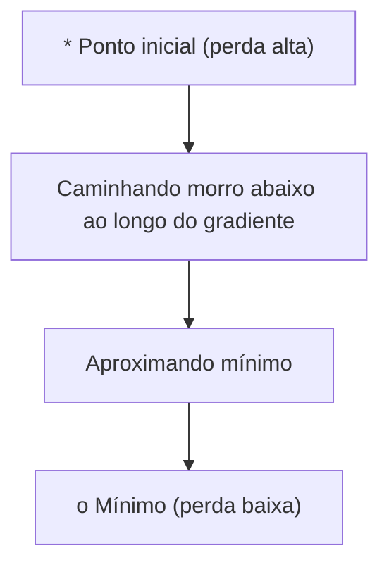
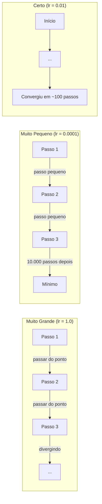
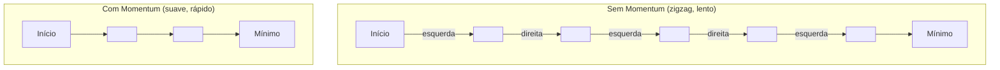
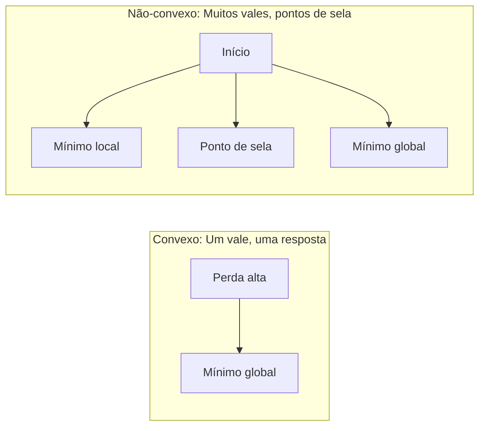

# Otimização

> Treinar uma rede neural não é nada mais do que encontrar o fundo de um vale.

**Tipo:** Construir
**Linguagem:** Python
**Pré-requisitos:** Fase 1, Aulas 04-05 (Derivadas, Gradientes)
**Tempo:** ~75 minutos

## Objetivos de Aprendizado

- Implementar descida do gradiente vanilla, SGD com momentum e Adam do zero
- Comparar convergência de otimizadores na função Rosenbrock e explicar por que Adam adapta taxas de aprendizado por peso
- Distinguir paisagens de perda convexas de não-convexas e explicar o papel de pontos de sela em altas dimensões
- Configurar agendamentos de taxa de aprendizado (decaimento em etapa, cosseno com aneling, warmup) pra estabilidade de treino

## O Problemo

Você tem uma função de perda. Ela diz quão errado seu modelo está. Você tem gradientes. Eles dizem qual direção torna a perda pior. Agora você precisa de uma estratégia pra caminhar morro abaixo.

A abordagem ingênua é simples: mova na direção oposta ao gradiente. Escale o passo por algum número chamado taxa de aprendizado. Repita. Isso é descida do gradiente, e funciona. Mas "funciona" tem ressalvas. Taxa de aprendizado muito grande e você passa completamente do vale, quicando entre as paredes. Muito pequena e você engatinha em direção à resposta em milhares de passos desnecessários. Encontre um ponto de sela e você para de se mover mesmo sem ter encontrado um mínimo.

Todo otimizador em deep learning é uma resposta à mesma pergunta: como você chega ao fundo do vale mais rápido e com mais confiabilidade?

## O Conceito

### O que significa otimização

Otimização é encontrar os valores de entrada que minimizam (ou maximizam) uma função. Em machine learning, a função é a perda. As entradas são os pesos do modelo. Treino é otimização.

```
minimizar L(w) onde:
  L = função de perda
  w = pesos do modelo (podem ser milhões de parâmetros)
```

### Descida do gradiente (vanilla)

O otimizador mais simples. Compute o gradiente da perda em relação a cada peso. Mova cada peso na direção oposta ao seu gradiente. Escale o passo pela taxa de aprendizado.

```
w = w - lr * gradiente
```

Isso é o algoritmo inteiro. Uma linha.



### Taxa de aprendizado: o hiperparâmetro mais importante

A taxa de aprendizado controla o tamanho do passo. Ela determina tudo sobre convergência.



Não existe fórmula pra taxa de aprendizado certa. Você encontra por experimento. Pontos de partida comuns: 0.001 pra Adam, 0.01 pra SGD com momentum.

### SGD vs lote vs mini-lote

Descida do gradiente vanilla computa o gradiente sobre o dataset inteiro antes de dar um passo. Isso se chama descida do gradiente em lote. É estável mas lenta.

Descida do gradiente estocástica (SGD) computa o gradiente em uma única amostra aleatória e dá o passo imediatamente. É ruidosa mas rápida.

Descida do gradiente em mini-lote divide a diferença. Compute o gradiente sobre um mini-lote pequeno (32, 64, 128, 256 amostras), depois dê o passo. Isso é o que todo mundo realmente usa.

| Variante | Tamanho do lote | Qualidade do gradiente | Velocidade por passo | Ruído |
|---------|-----------|-----------------|---------------|-------|
| GD em lote | Dataset inteiro | Exato | Lento | Nenhum |
| SGD | 1 amostra | Muito ruidoso | Rápido | Alto |
| Mini-lote | 32-256 | Boa estimativa | Balanceado | Moderado |

O ruído em SGD e mini-lote não é um bug. Ele ajuda a escapar de mínimos locais rasos e pontos de sela.

### Momentum: a bola rolando morro abaixo

Descida do gradiente vanilla só olha o gradiente atual. Se o gradiente ziguezagueia (comum em vales estreitos), o progresso é lento. Momentum conserta isso acumulando gradientes passados em um termo de velocidade.

```
v = beta * v + gradiente
w = w - lr * v
```

A analogia: uma bola rolando morro abaixo. Ela não para e recomeça em cada bump. Ela ganha velocidade em direções consistentes e amortiza oscilações.



`beta` (tipicamente 0.9) controla quanto histórico manter. Beta mais alto significa mais momentum, caminhos mais suaves, mas resposta mais lenta a mudanças de direção.

### Adam: taxas de aprendizado adaptativas

Pesos diferentes precisam de taxas de aprendizado diferentes. Um peso que raramente recebe gradientes grandes deve dar passos maiores quando finalmente recebe. Um peso que constantemente recebe gradientes enormes deve dar passos menores.

Adam (Estimação de Momento Adaptativo) rastreia duas coisas por peso:

1. Primeiro momento (m): média móvel dos gradientes (como momentum)
2. Segundo momento (v): média móvel dos gradientes ao quadrado (magnitude do gradiente)

```
m = beta1 * m + (1 - beta1) * gradiente
v = beta2 * v + (1 - beta2) * gradiente^2

m_hat = m / (1 - beta1^t)    correção de viés
v_hat = v / (1 - beta2^t)    correção de viés

w = w - lr * m_hat / (sqrt(v_hat) + epsilon)
```

A divisão por `sqrt(v_hat)` é a ideia principal. Pesos com gradientes grandes são divididos por um número grande (passo efetivo pequeno). Pesos com gradientes pequenos são divididos por um número pequeno (passo efetivo grande). Cada peso ganha sua própria taxa de aprendizado adaptativa.

Hiperparâmetros padrão: `lr=0.001, beta1=0.9, beta2=0.999, epsilon=1e-8`. Esses configurações-padrão funcionam bem pra maioria dos problemas.

### Agendamentos de taxa de aprendizado

Uma taxa de aprendizado fixa é um compromisso. No início do treino, você quer passos grandes pra progresso rápido. No final, você quer passos pequenos pra refinar perto do mínimo.

Agendamentos comuns:

| Agendamento | Fórmula | Caso de uso |
|----------|---------|----------|
| Decaimento em etapa | lr = lr * fator a cada N épocas | Simples, controle manual |
| Decaimento exponencial | lr = lr_0 * decaimento^t | Redução suave |
| Anelamento de cosseno | lr = lr_min + 0.5 * (lr_max - lr_min) * (1 + cos(pi * t / T)) | Transformers, treino moderno |
| Warmup + decaimento | Rampa linear, depois decaimento | Modelos grandes, previne instabilidade inicial |

### Convexo vs não-convexo

Uma função convexa tem um único mínimo. A descida do gradiente sempre o encontra. Uma quadrática como `f(x) = x^2` é convexa.

Funções de perda de redes neurais são não-convexas. Elas têm muitos mínimos locais, pontos de sela e regiões planas.



Na prática, mínimos locais em redes neurais de alta dimensão raramente são um problema. A maioria dos mínimos locais tem valores de perda próximos ao mínimo global. Pontos de sela (planos em algumas direções, curvos em outras) são o verdadeiro obstáculo. Momentum e ruído de mini-lotes ajudam a escapar deles.

## Construa

### Passo 1: Defina uma função de teste

A função Rosenbrock é um benchmark clássico de otimização. Seu mínimo está em (1, 1) dentro de um vale curvo estreito que é fácil de encontrar mas difícil de seguir.

```
f(x, y) = (1 - x)^2 + 100 * (y - x^2)^2
```

```python
def rosenbrock(params):
    x, y = params
    return (1 - x) ** 2 + 100 * (y - x ** 2) ** 2

def rosenbrock_gradient(params):
    x, y = params
    df_dx = -2 * (1 - x) + 200 * (y - x ** 2) * (-2 * x)
    df_dy = 200 * (y - x ** 2)
    return [df_dx, df_dy]
```

### Passo 2: Descida do gradiente vanilla

```python
class GradientDescent:
    def __init__(self, lr=0.001):
        self.lr = lr

    def step(self, params, grads):
        return [p - self.lr * g for p, g in zip(params, grads)]
```

### Passo 3: SGD com momentum

```python
class SGDMomentum:
    def __init__(self, lr=0.001, momentum=0.9):
        self.lr = lr
        self.momentum = momentum
        self.velocity = None

    def step(self, params, grads):
        if self.velocity is None:
            self.velocity = [0.0] * len(params)
        self.velocity = [
            self.momentum * v + g
            for v, g in zip(self.velocity, grads)
        ]
        return [p - self.lr * v for p, v in zip(params, self.velocity)]
```

### Passo 4: Adam

```python
class Adam:
    def __init__(self, lr=0.001, beta1=0.9, beta2=0.999, epsilon=1e-8):
        self.lr = lr
        self.beta1 = beta1
        self.beta2 = beta2
        self.epsilon = epsilon
        self.m = None
        self.v = None
        self.t = 0

    def step(self, params, grads):
        if self.m is None:
            self.m = [0.0] * len(params)
            self.v = [0.0] * len(params)

        self.t += 1

        self.m = [
            self.beta1 * m + (1 - self.beta1) * g
            for m, g in zip(self.m, grads)
        ]
        self.v = [
            self.beta2 * v + (1 - self.beta2) * g ** 2
            for v, g in zip(self.v, grads)
        ]

        m_hat = [m / (1 - self.beta1 ** self.t) for m in self.m]
        v_hat = [v / (1 - self.beta2 ** self.t) for v in self.v]

        return [
            p - self.lr * mh / (vh ** 0.5 + self.epsilon)
            for p, mh, vh in zip(params, m_hat, v_hat)
        ]
```

### Passo 5: Execute e compare

```python
def optimize(optimizer, func, grad_func, start, steps=5000):
    params = list(start)
    history = [params[:]]
    for _ in range(steps):
        grads = grad_func(params)
        params = optimizer.step(params, grads)
        history.append(params[:])
    return history

start = [-1.0, 1.0]

gd_history = optimize(GradientDescent(lr=0.0005), rosenbrock, rosenbrock_gradient, start)
sgd_history = optimize(SGDMomentum(lr=0.0001, momentum=0.9), rosenbrock, rosenbrock_gradient, start)
adam_history = optimize(Adam(lr=0.01), rosenbrock, rosenbrock_gradient, start)

for name, history in [("GD", gd_history), ("SGD+M", sgd_history), ("Adam", adam_history)]:
    final = history[-1]
    loss = rosenbrock(final)
    print(f"{name:6s} -> x={final[0]:.6f}, y={final[1]:.6f}, perda={loss:.8f}")
```

Resultado esperado: Adam converge mais rápido. SGD com momentum segue um caminho mais suave. GD vanilla faz progresso lento pelo vale estreito.

## Use

Na prática, use otimizadores do PyTorch ou JAX. Eles lidam com grupos de parâmetros, decaimento de pesos, clipping de gradiente e aceleração em GPU.

```python
import torch

model = torch.nn.Linear(784, 10)

sgd = torch.optim.SGD(model.parameters(), lr=0.01, momentum=0.9)
adam = torch.optim.Adam(model.parameters(), lr=0.001)
adamw = torch.optim.AdamW(model.parameters(), lr=0.001, weight_decay=0.01)

scheduler = torch.optim.lr_scheduler.CosineAnnealingLR(adam, T_max=100)
```

Regras práticas:

- Comece com Adam (lr=0.001). Funciona pra maioria dos problemas sem ajuste.
- Mude pra SGD com momentum (lr=0.01, momentum=0.9) quando precisar da melhor acurácia final e puder aguentar mais ajuste.
- Use AdamW (Adam com decaimento de pesos desacoplado) pra transformers.
- Sempre use agendamento de taxa de aprendizado pra treinos maiores que poucas épocas.
- Se treino for instável, reduza a taxa de aprendizado. Se for muito lenta, aumente.

## Entregue

Esta aula produz um prompt pra escolher o otimizador certo. Veja `outputs/prompt-optimizer-guide.md`.

As classes de otimizador construídas aqui reaparecem na Fase 3 quando treinamos uma rede neural do zero.

## Exercícios

1. **Varredura de taxa de aprendizado.** Rode descida do gradiente vanilla na função Rosenbrock com taxas de aprendizado [0.0001, 0.0005, 0.001, 0.005, 0.01]. Plote ou imprima a perda final após 5000 passos pra cada. Encontre a maior taxa que ainda converge.

2. **Comparação de momentum.** Rode SGD com valores de momentum [0.0, 0.5, 0.9, 0.99] na função Rosenbrock. Acompanhe a perda a cada passo. Qual valor de momentum converge mais rápido? Qual passa do ponto?

3. **Fuga de ponto de sela.** Defina a função `f(x, y) = x^2 - y^2` (um ponto de sela na origem). Comece em (0.01, 0.01). Compare como GD vanilla, SGD com momentum e Adam se comportam. Qual escapa do ponto de sela?

4. **Implemente decaimento de taxa de aprendizado.** Adicione um agendamento de decaimento exponencial à classe GradientDescent: `lr = lr_0 * 0.999^passo`. Compare convergência com e sem decaimento na função Rosenbrock.

## Termos Chave

| Termo | O que dizem | O que realmente significa |
|------|----------------|----------------------|
| Descida do gradiente | "Ir morro abaixo" | Atualizar pesos subtraindo o gradiente escalado pela taxa de aprendizado. O otimizador mais básico. |
| Taxa de aprendizado | "Tamanho do passo" | Um escalar que controla o quanto cada atualização move os pesos. Muito grande causa divergência. Muito pequena desperdiça computação. |
| Momentum | "Continuar rolando" | Acumular gradientes passados em um vetor de velocidade. Amortiza oscilações e acelera movimento em direções consistentes. |
| SGD | "Amostragem aleatória" | Descida do gradiente estocástica. Computar gradiente em um subconjunto aleatório em vez do dataset inteiro. Quase sempre significa SGD em mini-lote na prática. |
| Mini-lote | "Um pedaço de dados" | Um subconjunto pequeno de dados de treino (32-256 amostras) usado pra estimar o gradiente. Equilibra velocidade e acurácia do gradiente. |
| Adam | "O otimizador padrão" | Estimação de Momento Adaptativo. Rastreia médias móveis de gradientes e gradientes ao quadrado por peso pra dar a cada peso sua própria taxa de aprendizado. |
| Agendamento de taxa de aprendizado | "Mudar lr ao longo do tempo" | Uma função que ajusta a taxa de aprendizado durante o treino. Passos grandes no início, pequenos no final. |
| Função convexa | "Um vale" | Uma função onde todo mínimo local é o mínimo global. A descida do gradiente sempre o encontra. Perdas de rede neural não são convexas. |
| Ponto de sela | "Plano mas não é mínimo" | Um ponto onde o gradiente é zero mas é mínimo em algumas direações e máximo em outras. Comum em altas dimensões. |
| Paisagem de perda | "O terreno" | A função de perda plotada sobre o espaço de pesos. Visualizada fatiando ao longo de duas direções aleatórias. |
| Convergência | "Chegando lá" | O otimizador alcançou um ponto onde passos adicionais não reduzem significativamente a perda. |

## Leitura Complementar

- [Sebastian Ruder: Uma visão geral dos algoritmos de otimização de descida do gradiente](https://ruder.io/optimizing-gradient-descent/) — levantamento abrangente de todos os principais otimizadores
- [Por que Momentum Realmente Funciona (Distill)](https://distill.pub/2017/momentum/) — visualização interativa da dinâmica do momentum
- [Adam: Um Método para Otimização Estocástica (Kingma & Ba, 2014)](https://arxiv.org/abs/1412.6980) — o paper original do Adam, legível e curto
- [Visualizando a Paisagem de Perda de Redes Neurais (Li et al., 2018)](https://arxiv.org/abs/1712.09913) — o paper que mostrou mínimos afiados vs planos
