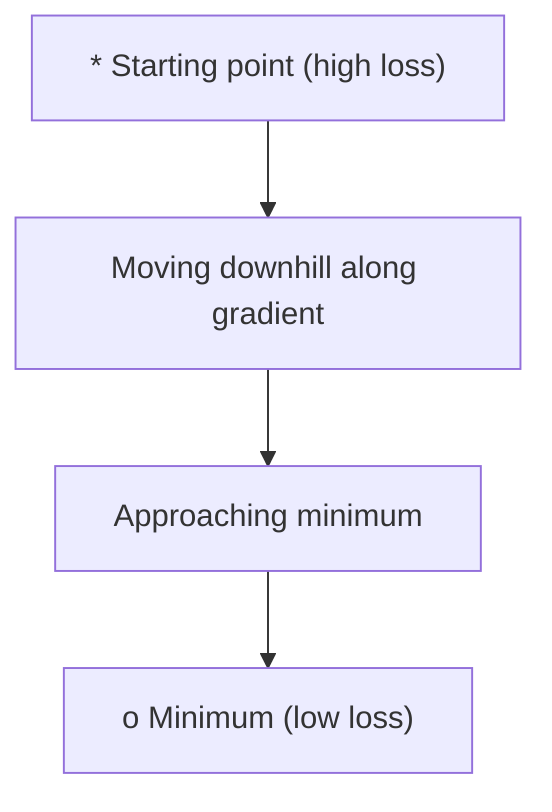
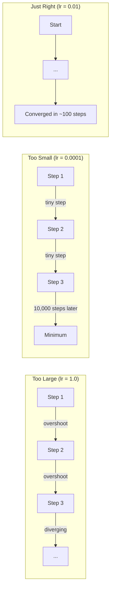
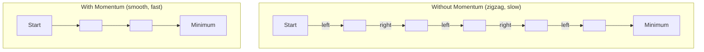
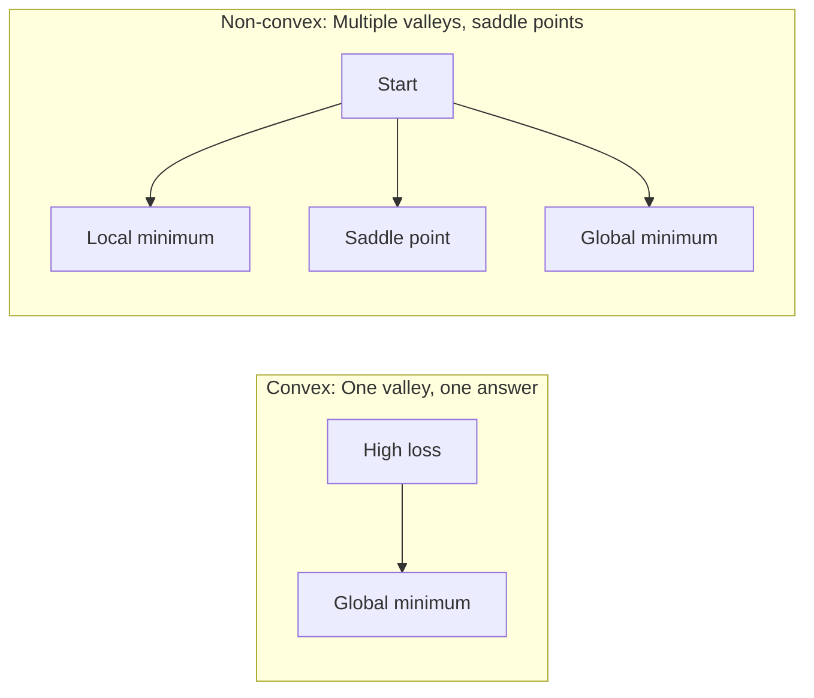
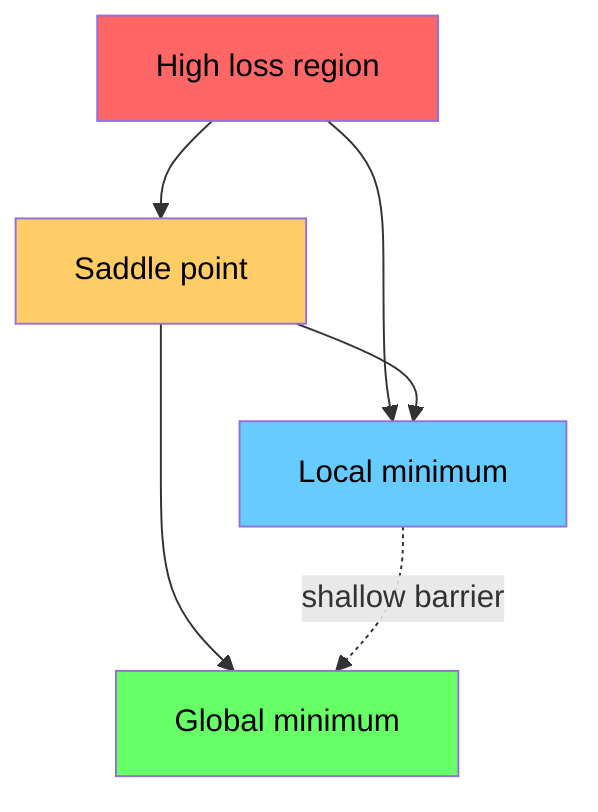

# Optimizasyon

> neural network'yi eğitmek bir vadinin dibini bulmaktan başka bir şey değildir.

**Tür:** Yapım
**Dil:** Python
**Önkoşullar:** Aşama 1, Dersler 04-05 (Türevler, Gradient'ler)
**Süre:** ~75 dakika

## Öğrenme Hedefleri

- Vanilya gradient inişini, ivme ile SGD'yi ve Adam'ı sıfırdan uygulayın
- Rosenbrock fonksiyonundaki optimize edici yakınsamasını karşılaştırın ve Adam'ın neden ağırlık başına öğrenme oranlarını uyarladığını açıklayın
- Dışbükey kayıp manzaralarını dışbükey olmayanlardan ayırt edin ve yüksek boyutlarda eyer noktalarının rolünü açıklayın
- Eğitim kararlılığı için öğrenme hızı programlarını (adım azalması, kosinüs tavlaması, ısınma) yapılandırın

## Sorun

Bir loss function'niz var. Modelinizin ne kadar yanlış olduğunu anlatır. gradient'leriniz var. Hangi yönün kaybı daha da kötüleştirdiğini size söylerler. Artık yokuş aşağı yürümek için bir stratejiye ihtiyacınız var.

Saf yaklaşım basittir: gradient'nin tersine hareket edin. Adımı öğrenme oranı adı verilen bir sayıya göre ölçeklendirin. Tekrarlamak. Bu gradient inişi ve işe yarıyor. Ancak "çalışmaların" uyarıları var. Öğrenme oranının çok yüksek olması durumunda duvarların arasından sıçrayarak vadiyi tamamen aşarsınız. Çok küçük ve binlerce gereksiz adımın üzerinden cevaba doğru sürünerek ilerliyorsunuz. Bir eyer noktasına çarptığınızda minimum noktayı bulamasanız bile hareket etmeyi bırakırsınız.

deep learning'deki her optimize edici aynı sorunun cevabıdır: Vadinin dibine nasıl daha hızlı ve daha güvenilir bir şekilde ulaşırsınız?

## Konsept

### Optimizasyon ne anlama gelir?

Optimizasyon, bir fonksiyonu en aza indiren (veya en üst düzeye çıkaran) girdi değerlerini bulmaktır. machine learning'de fonksiyon kayıptır. Girdiler modelin ağırlıklarıdır. Eğitim optimizasyondur.

```
minimize L(w) where:
  L = loss function
  w = model weights (could be millions of parameters)
```

### Gradient iniş (vanilya)

En basit optimize edici. Her ağırlığa göre kaybın gradient değerini hesaplayın. Her ağırlığı gradient yönünün tersi yönde hareket ettirin. Adımı öğrenme oranına göre ölçeklendirin.

```
w = w - lr * gradient
```

Tüm algoritma budur. Bir satır.



### Öğrenme hızı: en önemli hiperparametre

Öğrenme oranı adım boyutunu kontrol eder. Yakınsamayla ilgili her şeyi belirler.



Doğru öğrenme oranı için bir formül yoktur. Deneyerek bulursun. Ortak başlangıç ​​noktaları: Adam için 0,001, momentumlu SGD için 0,01.

### SGD vs toplu vs mini parti

Vanilya gradient inişi, bir adım atmadan önce gradient'yi tüm dataset üzerinden hesaplar. Buna toplu gradient iniş adı verilir. Kararlı ama yavaş.

Stokastik gradient inişi (SGD), gradient'yi tek bir rastgele örnek üzerinde hesaplar ve hemen adım atar. Gürültülü ama hızlı.

Mini toplu gradient iniş farkı böler. Küçük bir grup (32, 64, 128, 256 örnek) üzerinden gradient'yi hesaplayın ve ardından adım atın. Aslında herkesin kullandığı şey bu.

| Varyant | Parti boyutu | Gradient kalitesi | Adım başına hız | Gürültü |
|---------|-----------|-----------------|---------------|-------|
| Toplu GD | Tamamı dataset | Tam | Yavaş | Yok |
| SGD | 1 örnek | Çok gürültülü | Hızlı | Yüksek |
| Mini toplu | 32-256 | İyi tahmin | Dengeli | Orta |

SGD ve mini partideki gürültü bir hata değildir. Sığ yerel minimumlardan ve eyer noktalarından kaçmaya yardımcı olur.

### Momentum: topun yokuş aşağı yuvarlanması

Vanilya gradient inişi yalnızca mevcut gradient'ye bakar. gradient zikzaklar çiziyorsa (dar vadilerde yaygındır), ilerleme yavaştır. Momentum, geçmiş gradient'leri bir hız teriminde toplayarak bu sorunu giderir.

```
v = beta * v + gradient
w = w - lr * v
```

Benzetme: yokuş aşağı yuvarlanan bir top. Her çarpmada durmuyor ve yeniden başlatılmıyor. Tutarlı yönlerde hız oluşturur ve salınımları azaltır.



`beta` (tipik olarak 0,9), ne kadar geçmişin tutulacağını kontrol eder. Daha yüksek beta, daha fazla momentum, daha yumuşak yollar ancak yön değişikliklerine daha yavaş tepki anlamına gelir.

### Adam: uyarlanabilir öğrenme oranları

Farklı ağırlıklar farklı öğrenme oranlarına ihtiyaç duyar. Nadiren büyük gradient elde eden bir ağırlık, sonunda ulaştığında daha büyük adımlar atmalıdır. Sürekli büyük gradient alan bir ağırlığın daha küçük adımlar atması gerekir.

Adam (Uyarlanabilir Moment Tahmini) ağırlık başına iki şeyi izler:

1. İlk an (m): gradient'lerin hareketli ortalaması (momentum gibi)
2. İkinci moment (v): gradient'lerin karesinin devam eden ortalaması (gradient büyüklüğü)

```
m = beta1 * m + (1 - beta1) * gradient
v = beta2 * v + (1 - beta2) * gradient^2

m_hat = m / (1 - beta1^t)    bias correction
v_hat = v / (1 - beta2^t)    bias correction

w = w - lr * m_hat / (sqrt(v_hat) + epsilon)
```

`sqrt(v_hat)`'ye göre bölümleme önemli bir fikirdir. Büyük gradient'lere sahip ağırlıklar büyük bir sayıya bölünür (küçük etkili adım). Küçük gradient'lere sahip ağırlıklar küçük bir sayıya bölünür (büyük etkili adım). Her ağırlık kendi uyarlanabilir öğrenme oranına sahiptir.

Varsayılan hiperparametreler: `lr=0.001, beta1=0.9, beta2=0.999, epsilon=1e-8`. Bu varsayılanlar çoğu sorun için iyi çalışır.

### Öğrenme oranı programları

Sabit bir öğrenme oranı bir uzlaşmadır. Antrenmanın başlarında hızlı ilerleme sağlamak için büyük adımlar atmak istersiniz. Eğitimin sonlarında, minimuma yakın ince ayar yapmak için küçük adımlar istersiniz.

Ortak programlar:

| Program | Formül | Kullanım örneği |
|----------|---------|----------|
| Adım çürümesi | lr = lr * her N dönemi faktörle | Basit, manuel kontrol |
| Üstel bozunma | lr = lr_0 * bozunum^t | Pürüzsüz azaltma |
| Kosinüs tavlama | lr = lr_min + 0,5 * (lr_max - lr_min) * (1 + cos(pi * t / T)) | Transformer'ler, modern eğitim |
| Isınma + bozulma | Doğrusal artış, ardından azalma | Büyük modeller, erken dengesizliği önler |

### Dışbükey ve dışbükey olmayan

Dışbükey bir fonksiyonun bir minimumu vardır. Gradient iniş her zaman onu bulur. `f(x) = x^2` gibi ikinci dereceden bir ifade dışbükeydir.

Neural network loss function'ler dışbükey değildir. Birçok yerel minimuma, eyer noktasına ve düz bölgeye sahiptirler.



Uygulamada, yüksek boyutlu neural network'lerdeki yerel minimumlar nadiren sorun oluşturur. Çoğu yerel minimum, global minimuma yakın kayıp değerlerine sahiptir. Eyer noktaları (bazı yönlerde düz, bazı yönlerde kavisli) asıl engeldir. Mini partilerin momentumu ve gürültüsü onlardan kaçmaya yardımcı olur.

### Kayıp manzarası görselleştirmesi

Kayıp tüm ağırlıkların bir fonksiyonudur. 1 milyon ağırlığa sahip bir model için kayıp manzarası 1.000.001 boyutlu uzayda yaşıyor. Ağırlık uzayında iki rastgele yön seçerek ve kaybı bu yönler boyunca çizerek 2 boyutlu bir yüzey oluşturarak bunu görselleştiriyoruz.



Keskin minimumlar zayıf genelleme yapar. Düz minimumlar iyi genelleme yapar. Momentumlu SGD'nin son test doğruluğu konusunda Adam'dan daha iyi performans göstermesinin nedenlerinden biri de budur: gürültüsü keskin minimumlara yerleşmeyi önler.

```figure
gradient-descent
```

## İnşa Et

### Adım 1: Bir test fonksiyonu tanımlayın

Rosenbrock işlevi klasik bir optimizasyon benchmark'dir. Bulması kolay ama takip etmesi zor, dar kavisli bir vadinin içinde minimum değeri (1, 1)'dir.

```
f(x, y) = (1 - x)^2 + 100 * (y - x^2)^2
```

```python
def rosenbrock(params):
    x, y = params
    return (1 - x) ** 2 + 100 * (y - x ** 2) ** 2

def rosenbrock_gradient(params):
    x, y = params
    df_dx = -2 * (1 - x) + 200 * (y - x ** 2) * (-2 * x)
    df_dy = 200 * (y - x ** 2)
    return [df_dx, df_dy]
```

### Adım 2: Vanilya gradient iniş

```python
class GradientDescent:
    def __init__(self, lr=0.001):
        self.lr = lr

    def step(self, params, grads):
        return [p - self.lr * g for p, g in zip(params, grads)]
```

### Adım 3: Momentumlu SGD

```python
class SGDMomentum:
    def __init__(self, lr=0.001, momentum=0.9):
        self.lr = lr
        self.momentum = momentum
        self.velocity = None

    def step(self, params, grads):
        if self.velocity is None:
            self.velocity = [0.0] * len(params)
        self.velocity = [
            self.momentum * v + g
            for v, g in zip(self.velocity, grads)
        ]
        return [p - self.lr * v for p, v in zip(params, self.velocity)]
```

### Adım 4: Adem

```python
class Adam:
    def __init__(self, lr=0.001, beta1=0.9, beta2=0.999, epsilon=1e-8):
        self.lr = lr
        self.beta1 = beta1
        self.beta2 = beta2
        self.epsilon = epsilon
        self.m = None
        self.v = None
        self.t = 0

    def step(self, params, grads):
        if self.m is None:
            self.m = [0.0] * len(params)
            self.v = [0.0] * len(params)

        self.t += 1

        self.m = [
            self.beta1 * m + (1 - self.beta1) * g
            for m, g in zip(self.m, grads)
        ]
        self.v = [
            self.beta2 * v + (1 - self.beta2) * g ** 2
            for v, g in zip(self.v, grads)
        ]

        m_hat = [m / (1 - self.beta1 ** self.t) for m in self.m]
        v_hat = [v / (1 - self.beta2 ** self.t) for v in self.v]

        return [
            p - self.lr * mh / (vh ** 0.5 + self.epsilon)
            for p, mh, vh in zip(params, m_hat, v_hat)
        ]
```

### Adım 5: Çalıştırın ve karşılaştırın

```python
def optimize(optimizer, func, grad_func, start, steps=5000):
    params = list(start)
    history = [params[:]]
    for _ in range(steps):
        grads = grad_func(params)
        params = optimizer.step(params, grads)
        history.append(params[:])
    return history

start = [-1.0, 1.0]

gd_history = optimize(GradientDescent(lr=0.0005), rosenbrock, rosenbrock_gradient, start)
sgd_history = optimize(SGDMomentum(lr=0.0001, momentum=0.9), rosenbrock, rosenbrock_gradient, start)
adam_history = optimize(Adam(lr=0.01), rosenbrock, rosenbrock_gradient, start)

for name, history in [("GD", gd_history), ("SGD+M", sgd_history), ("Adam", adam_history)]:
    final = history[-1]
    loss = rosenbrock(final)
    print(f"{name:6s} -> x={final[0]:.6f}, y={final[1]:.6f}, loss={loss:.8f}")
```

Beklenen çıktı: Adam en hızlı yakınsar. Momentumlu SGD daha yumuşak bir yol izliyor. Vanilla GD dar vadi boyunca yavaş ilerlemektedir.

## Kullan onu

Pratikte PyTorch veya JAX iyileştiricilerini kullanın. Parametre gruplarını, ağırlık azalmasını, gradient kırpmayı ve GPU hızlandırmayı yönetirler.

```python
import torch

model = torch.nn.Linear(784, 10)

sgd = torch.optim.SGD(model.parameters(), lr=0.01, momentum=0.9)
adam = torch.optim.Adam(model.parameters(), lr=0.001)
adamw = torch.optim.AdamW(model.parameters(), lr=0.001, weight_decay=0.01)

scheduler = torch.optim.lr_scheduler.CosineAnnealingLR(adam, T_max=100)
```

Temel kurallar:

- Adem ile başlayın (lr=0,001). Çoğu sorun için ayar yapmadan çalışır.
- En iyi son doğruluğa ihtiyaç duyduğunuzda ve daha fazla ayar yapmaya gücünüz yettiğinde momentumlu (lr=0,01, momentum=0,9) SGD'ye geçin.
- transformer'ler için AdamW'yi (bağlantısız ağırlık azalmasına sahip Adam) kullanın.
- Birkaç dönemden daha uzun süren eğitim çalışmaları için her zaman bir öğrenme oranı çizelgesi kullanın.
- Eğitim istikrarsızsa öğrenme oranını azaltın. Eğitim çok yavaşsa artırın.

## Gönderin

Bu ders, doğru optimize ediciyi seçmek için bir prompt oluşturur. Bkz. `outputs/prompt-optimizer-guide.md`.

Burada oluşturulan optimizer sınıfları, bir neural network'yi sıfırdan eğittiğimizde Aşama 3'te yeniden ortaya çıkıyor.

## Egzersizler

1. **Öğrenme oranı taraması.** Rosenbrock fonksiyonu üzerinde öğrenme oranları [0,0001, 0,0005, 0,001, 0,005, 0,01] ile vanilya gradient inişini çalıştırın. Her biri için 5000 adımdan sonra son kaybı çizin veya yazdırın. Hala yakınsayan en büyük öğrenme oranını bulun.

2. **Momentum karşılaştırması.** Rosenbrock fonksiyonunda SGD'yi momentum değerleriyle [0,0, 0,5, 0,9, 0,99] çalıştırın. Her adımda kaybı takip edin. Hangi momentum değeri en hızlı yakınsar? Hangi aşırılıklar?

3. **Eyer noktası kaçışı.** `f(x, y) = x^2 - y^2` (başlangıç noktasındaki eyer noktası) fonksiyonunu tanımlayın. (0,01, 0,01) ile başlayın. Vanilya GD'nin, momentumlu SGD'nin ve Adam'ın nasıl davrandığını karşılaştırın. Hangisi eyer noktasından kaçar?

4. **Öğrenme hızı azalmasını uygulayın.** GradientDescent sınıfına üstel bir azalma planı ekleyin: `lr = lr_0 * 0.999^step`. Rosenbrock fonksiyonunda bozulmalı ve bozulmasız yakınsamayı karşılaştırın.

## Anahtar Terimler

| Dönem | İnsanlar ne diyor | Aslında ne anlama geliyor |
|------|----------------|----------------------|
| Gradient iniş | "Yokuş aşağı git" | Öğrenme oranına göre ölçeklenen gradient'yi çıkararak ağırlıkları güncelleyin. En temel optimize edici. |
| Öğrenme oranı | "Adım boyutu" | Her güncellemenin ağırlıkları ne kadar ileri taşıdığını kontrol eden bir skaler. Çok büyük olması ayrılığa neden olur. Çok küçük atıklar hesaplanır. |
| ivme | "Yuvarlanmaya devam et" | Geçmiş gradient'leri bir hız vektöründe toplayın. Salınımları azaltır ve tutarlı yönlerde hareketi hızlandırır. |
| SGD | "Rastgele örnekleme" | Stokastik gradient inişi. gradient'yi tam dataset yerine rastgele bir alt küme üzerinde hesaplayın. Pratikte neredeyse her zaman mini parti SGD anlamına gelir. |
| Mini toplu | "Bir yığın veri" | gradient'yi tahmin etmek için kullanılan küçük bir eğitim verisi alt kümesi (32-256 örnek). Hızı ve gradient doğruluğunu dengeler. |
| Adem | "Varsayılan optimize edici" | Uyarlanabilir Moment Tahmini. Her ağırlığa kendi öğrenme oranını vermek için gradient'lerin ve kareli gradient'lerin ağırlık başına çalışma ortalamalarını izler. |
| Önyargı düzeltmesi | "Soğuk başlatmayı düzeltin" | Adam'ın birinci ve ikinci anları sıfıra sıfırlanmıştır. Önyargı düzeltmesi, ilk adımlarda telafi etmek için (1 - beta^t)'ye bölünür. |
| Öğrenme oranı planı | "lr'yi zamanla değiştirin" | Eğitim sırasında öğrenme oranını ayarlayan bir işlev. Büyük adımlar erken, küçük adımlar geç. |
| Dışbükey fonksiyon | "Tek Vadi" | Herhangi bir yerel minimumun global minimum olduğu bir fonksiyon. Gradient iniş her zaman onu bulur. Neural network kayıpları dışbükey değildir. |
| Eyer noktası | "Düz ama minimum değil" | gradient'nin sıfır olduğu ancak bazı yönlerde minimum ve bazı yönlerde maksimum olduğu bir nokta. Yüksek boyutlarda yaygındır. |
| Kayıp manzarası | "Arazi" | loss function ağırlık alanı üzerinde çizildi. İki rastgele yön boyunca dilimlenerek görselleştirilir. |
| Yakınsama | "Oraya varmak" | Optimize edici, sonraki adımların kaybı anlamlı şekilde azaltmadığı bir noktaya ulaştı. |

## Daha Fazla Okuma

- [Sebastian Ruder: gradient iniş optimizasyon algoritmalarına genel bakış](https://ruder.io/optimizing-gradient-descent/) - tüm önemli optimize edicilerin kapsamlı araştırması
- [Momentum Gerçekten Neden Çalışıyor (Distill)](https://distill.pub/2017/momentum/) - momentum dinamiklerinin etkileşimli görselleştirilmesi
- [Adam: A Method for Stochastic Optimization (Kingma & Ba, 2014)](https://arxiv.org/abs/1412.6980) - orijinal Adam makalesi, okunabilir ve kısa
- [Sinir Ağlarının Kayıp Ortamının Görselleştirilmesi (Li ve diğerleri, 2018)](https://arxiv.org/abs/1712.09913) - keskin ve düz minimumları gösteren makale
