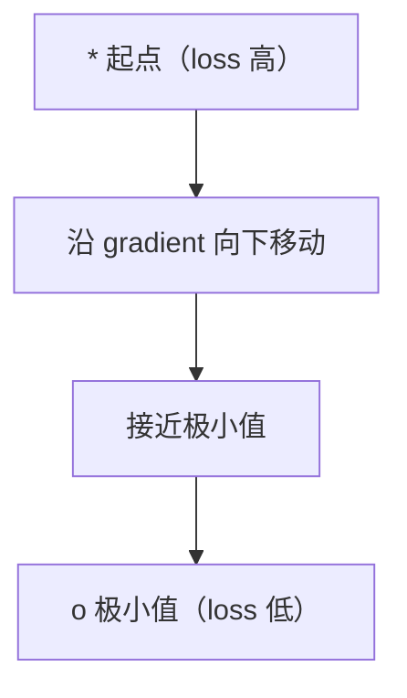
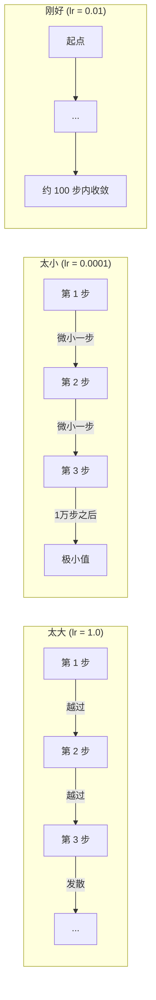
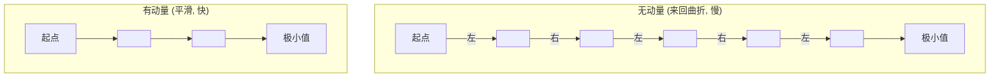
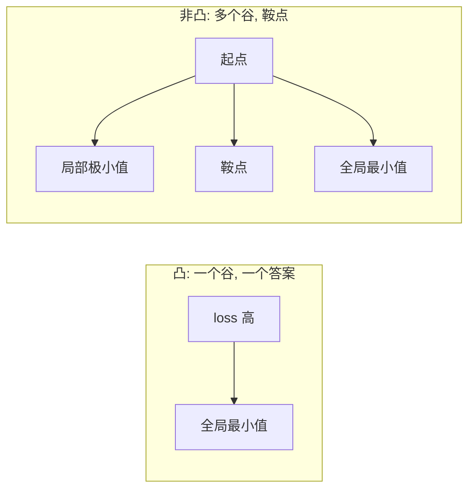
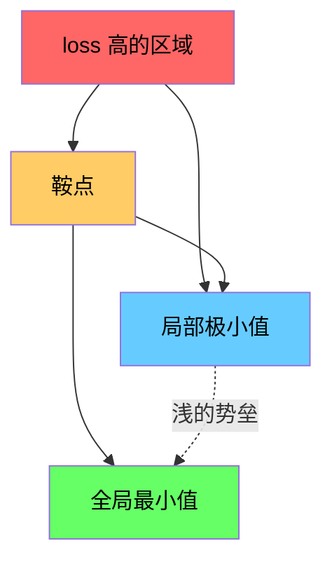

# 优化（Optimization）

> 译注：本文译自同目录 [`en.md`](./en.md)。术语遵循仓根 [TRANSLATION_GUIDE.md](../../../../TRANSLATION_GUIDE.md)。

> 训练神经网络无非就是找到山谷的谷底。

**Type:** Build
**Language:** Python
**Prerequisites:** Phase 1, Lessons 04-05 (Derivatives, Gradients)
**Time:** ~75 minutes

## 学习目标（Learning Objectives）

- 从零实现 vanilla 梯度下降、带动量的 SGD，以及 Adam
- 在 Rosenbrock 函数上比较各 optimizer 的收敛表现，并解释 Adam 为何能为每个权重自适应调整学习率
- 区分凸（convex）与非凸（non-convex）损失曲面，并解释 saddle point（鞍点）在高维空间里的角色
- 配置学习率调度（step decay、cosine annealing、warmup）以提升训练稳定性

## 问题（Problem）

你已经有了一个损失函数，它告诉你模型有多错。你也有了 gradient（梯度），它告诉你哪个方向会让损失变得更糟。现在你需要一套策略来「往山下走」。

最直白的做法很简单：朝 gradient 的反方向走，每一步的大小由一个叫做学习率（learning rate）的数缩放，然后重复。这就是梯度下降，确实管用。但「管用」是有附加条件的。学习率太大，你会一脚跨过整个山谷，在两边山壁之间反复弹跳；学习率太小，你要花上千步才能慢吞吞地挪到答案附近。撞上 saddle point，你甚至会停下来——尽管你根本还没找到极小值。

深度学习里的每一个 optimizer，都是在回答同一个问题：怎样更快、更可靠地走到谷底？

## 概念（Concept）

### 优化是什么意思（What optimization means）

优化就是找到能让某个函数取得最小值（或最大值）的输入。在机器学习里，这个函数是 loss（损失），输入是模型的权重。训练就是优化。

```
minimize L(w) where:
  L = loss function
  w = model weights (could be millions of parameters)
```

### 梯度下降（Gradient descent，vanilla）

最简单的 optimizer。计算损失对每个权重的 gradient，让每个权重朝其 gradient 的反方向移动，步长由学习率缩放。

```
w = w - lr * gradient
```

这就是整个算法——一行代码。



### 学习率：最重要的超参数（Learning rate: the most important hyperparameter）

学习率控制步长，它决定了收敛的一切。



没有公式能告诉你哪个学习率才对，你只能靠实验找。常见的起点：Adam 用 0.001，带动量的 SGD 用 0.01。

### SGD vs batch vs mini-batch

vanilla 梯度下降在迈出一步之前，要在整个数据集上算一次 gradient，叫做 batch gradient descent，稳定但慢。

随机梯度下降（Stochastic gradient descent，SGD）在单个随机样本上算 gradient，立即更新一步。噪声大但快。

mini-batch 梯度下降折中：在一个小 batch（32、64、128、256 个样本）上算 gradient，再更新。这才是大家实际在用的做法。

| Variant | Batch size | Gradient quality | Speed per step | Noise |
|---------|-----------|-----------------|---------------|-------|
| Batch GD | Entire dataset | Exact | Slow | None |
| SGD | 1 sample | Very noisy | Fast | High |
| Mini-batch | 32-256 | Good estimate | Balanced | Moderate |

SGD 和 mini-batch 里的噪声不是 bug，反而能帮你跳出浅的局部极小值和 saddle point。

### 动量：滚下山的小球（Momentum: the ball rolling downhill）

vanilla 梯度下降只看当前的 gradient。如果 gradient 一直左右横跳（在狭长山谷里很常见），进展就会很慢。动量（momentum）通过把过去的 gradient 累积成一个速度项来解决这个问题。

```
v = beta * v + gradient
w = w - lr * v
```

类比：一个滚下山的小球，它不会在每个小坑前都停下来重新启动；它会在一致的方向上积累速度，并且抑制振荡。



`beta`（一般取 0.9）控制保留多少历史。beta 越大，动量越强、轨迹越平滑，但对方向变化的响应也越慢。

### Adam：自适应学习率（Adam: adaptive learning rates）

不同的权重需要不同的学习率。一个很少拿到大 gradient 的权重，在终于拿到时应该多走几步；一个总是拿到巨大 gradient 的权重，则应该走得更小心。

Adam（Adaptive Moment Estimation）为每个权重追踪两件事：

1. 一阶矩（first moment，m）：gradient 的滑动平均（类似动量）
2. 二阶矩（second moment，v）：gradient 平方的滑动平均（gradient 的量级）

```
m = beta1 * m + (1 - beta1) * gradient
v = beta2 * v + (1 - beta2) * gradient^2

m_hat = m / (1 - beta1^t)    bias correction
v_hat = v / (1 - beta2^t)    bias correction

w = w - lr * m_hat / (sqrt(v_hat) + epsilon)
```

关键洞察就在 `sqrt(v_hat)` 这个除法。gradient 大的权重被一个大数除掉（有效步长变小），gradient 小的权重被一个小数除掉（有效步长变大）。每个权重都拥有了自己的自适应学习率。

默认超参数：`lr=0.001, beta1=0.9, beta2=0.999, epsilon=1e-8`，这些默认值在大多数问题上都好用。

### 学习率调度（Learning rate schedules）

固定的学习率是一种妥协。训练初期你想要大步快进，训练末期你想要小步慢调，靠近最小值时精修。

常见的调度：

| Schedule | Formula | Use case |
|----------|---------|----------|
| Step decay | lr = lr * factor every N epochs | Simple, manual control |
| Exponential decay | lr = lr_0 * decay^t | Smooth reduction |
| Cosine annealing | lr = lr_min + 0.5 * (lr_max - lr_min) * (1 + cos(pi * t / T)) | Transformers, modern training |
| Warmup + decay | Linear ramp up, then decay | Large models, prevents early instability |

### 凸 vs 非凸（Convex vs non-convex）

凸函数只有一个最小值，梯度下降总能找到它。比如 `f(x) = x^2` 这样的二次函数就是凸的。

神经网络的损失函数是非凸的，里面有许多局部极小值、saddle point 和平坦区域。



实际上，高维神经网络里的局部极小值很少成为问题——大多数局部极小值的损失值都和全局最小值差不多。真正的障碍是 saddle point（在某些方向上是平的，另一些方向上是弯的）。动量和 mini-batch 的噪声可以帮你逃出来。

### 损失曲面可视化（Loss landscape visualization）

损失是所有权重的函数。对一个有 100 万权重的模型来说，损失曲面活在 1,000,001 维空间里。我们的可视化办法是：在权重空间里随机挑两个方向，沿着这两个方向画出损失值，得到一个 2D 曲面。



尖锐的极小值泛化得差，平坦的极小值泛化得好。这也是为什么带动量的 SGD 在最终测试精度上常常比 Adam 强的一个原因：它的噪声能阻止你掉进尖锐的极小值。

## 动手实现（Build It）

### 第 1 步：定义一个测试函数（Define a test function）

Rosenbrock 函数是优化领域的经典 benchmark。它的最小值在 (1, 1)，藏在一条狭长弯曲的山谷里——容易找到，但难以沿着走。

```
f(x, y) = (1 - x)^2 + 100 * (y - x^2)^2
```

```python
def rosenbrock(params):
    x, y = params
    return (1 - x) ** 2 + 100 * (y - x ** 2) ** 2

def rosenbrock_gradient(params):
    x, y = params
    df_dx = -2 * (1 - x) + 200 * (y - x ** 2) * (-2 * x)
    df_dy = 200 * (y - x ** 2)
    return [df_dx, df_dy]
```

### 第 2 步：vanilla 梯度下降（Vanilla gradient descent）

```python
class GradientDescent:
    def __init__(self, lr=0.001):
        self.lr = lr

    def step(self, params, grads):
        return [p - self.lr * g for p, g in zip(params, grads)]
```

### 第 3 步：带动量的 SGD（SGD with momentum）

```python
class SGDMomentum:
    def __init__(self, lr=0.001, momentum=0.9):
        self.lr = lr
        self.momentum = momentum
        self.velocity = None

    def step(self, params, grads):
        if self.velocity is None:
            self.velocity = [0.0] * len(params)
        self.velocity = [
            self.momentum * v + g
            for v, g in zip(self.velocity, grads)
        ]
        return [p - self.lr * v for p, v in zip(params, self.velocity)]
```

### 第 4 步：Adam

```python
class Adam:
    def __init__(self, lr=0.001, beta1=0.9, beta2=0.999, epsilon=1e-8):
        self.lr = lr
        self.beta1 = beta1
        self.beta2 = beta2
        self.epsilon = epsilon
        self.m = None
        self.v = None
        self.t = 0

    def step(self, params, grads):
        if self.m is None:
            self.m = [0.0] * len(params)
            self.v = [0.0] * len(params)

        self.t += 1

        self.m = [
            self.beta1 * m + (1 - self.beta1) * g
            for m, g in zip(self.m, grads)
        ]
        self.v = [
            self.beta2 * v + (1 - self.beta2) * g ** 2
            for v, g in zip(self.v, grads)
        ]

        m_hat = [m / (1 - self.beta1 ** self.t) for m in self.m]
        v_hat = [v / (1 - self.beta2 ** self.t) for v in self.v]

        return [
            p - self.lr * mh / (vh ** 0.5 + self.epsilon)
            for p, mh, vh in zip(params, m_hat, v_hat)
        ]
```

### 第 5 步：跑一遍并对比（Run and compare）

```python
def optimize(optimizer, func, grad_func, start, steps=5000):
    params = list(start)
    history = [params[:]]
    for _ in range(steps):
        grads = grad_func(params)
        params = optimizer.step(params, grads)
        history.append(params[:])
    return history

start = [-1.0, 1.0]

gd_history = optimize(GradientDescent(lr=0.0005), rosenbrock, rosenbrock_gradient, start)
sgd_history = optimize(SGDMomentum(lr=0.0001, momentum=0.9), rosenbrock, rosenbrock_gradient, start)
adam_history = optimize(Adam(lr=0.01), rosenbrock, rosenbrock_gradient, start)

for name, history in [("GD", gd_history), ("SGD+M", sgd_history), ("Adam", adam_history)]:
    final = history[-1]
    loss = rosenbrock(final)
    print(f"{name:6s} -> x={final[0]:.6f}, y={final[1]:.6f}, loss={loss:.8f}")
```

预期结果：Adam 收敛最快；带动量的 SGD 走出来的轨迹更平滑；vanilla GD 沿着狭长山谷只能慢慢挪。

## 用起来（Use It）

实际项目里请直接使用 PyTorch 或 JAX 的 optimizer，它们已经处理好参数分组、weight decay（权重衰减）、gradient 裁剪和 GPU 加速。

```python
import torch

model = torch.nn.Linear(784, 10)

sgd = torch.optim.SGD(model.parameters(), lr=0.01, momentum=0.9)
adam = torch.optim.Adam(model.parameters(), lr=0.001)
adamw = torch.optim.AdamW(model.parameters(), lr=0.001, weight_decay=0.01)

scheduler = torch.optim.lr_scheduler.CosineAnnealingLR(adam, T_max=100)
```

经验法则：

- 从 Adam（lr=0.001）开始，几乎不调参就能在大多数问题上跑起来。
- 当你需要最佳的最终精度，并且愿意花时间调参时，再切换到带动量的 SGD（lr=0.01, momentum=0.9）。
- transformer 用 AdamW（把 weight decay 解耦的 Adam）。
- 训练超过几个 epoch 时，永远要配一个学习率调度。
- 如果训练不稳定，调小学习率；如果训练太慢，调大它。

## 上线部署（Ship It）

本课产出一个用于挑选合适 optimizer 的 prompt，见 `outputs/prompt-optimizer-guide.md`。

这里写的 optimizer 类会在第 3 阶段从零训练神经网络时再次出现。

## 练习（Exercises）

1. **学习率扫描（Learning rate sweep）。** 在 Rosenbrock 函数上用学习率 [0.0001, 0.0005, 0.001, 0.005, 0.01] 跑 vanilla 梯度下降。把每组跑 5000 步后的最终损失画出来或打印出来，找出仍能收敛的最大学习率。

2. **动量对比（Momentum comparison）。** 在 Rosenbrock 函数上用动量值 [0.0, 0.5, 0.9, 0.99] 跑 SGD，记录每一步的损失。哪个动量收敛最快？哪个会 overshoot？

3. **逃离 saddle point（Saddle point escape）。** 定义函数 `f(x, y) = x^2 - y^2`（原点是一个 saddle point），从 (0.01, 0.01) 出发。比较 vanilla GD、带动量的 SGD 和 Adam 各自的表现。哪一个能逃出 saddle point？

4. **实现学习率衰减（Implement learning rate decay）。** 给 GradientDescent 类加一个指数衰减调度：`lr = lr_0 * 0.999^step`。在 Rosenbrock 函数上对比加不加衰减的收敛差异。

## 关键术语（Key Terms）

| Term | What people say | What it actually means |
|------|----------------|----------------------|
| Gradient descent | "Go downhill" | 通过减去 gradient 乘以学习率来更新权重，最基本的 optimizer。 |
| Learning rate | "Step size" | 一个标量，决定每次更新把权重移动多远。太大会发散，太小会浪费算力。 |
| Momentum | "Keep rolling" | 把过去的 gradient 累加成一个速度向量，抑制振荡，并在一致方向上加速移动。 |
| SGD | "Random sampling" | 随机梯度下降。在随机子集上算 gradient，而不是整个数据集。实际上几乎都指 mini-batch SGD。 |
| Mini-batch | "A chunk of data" | 训练数据的一个小子集（32-256 个样本），用来估计 gradient。在速度和 gradient 精度之间做平衡。 |
| Adam | "The default optimizer" | Adaptive Moment Estimation。为每个权重追踪 gradient 及其平方的滑动平均，从而给每个权重各自的学习率。 |
| Bias correction | "Fix the cold start" | Adam 的一阶、二阶矩初始化为 0，bias correction 通过除以 (1 - beta^t) 来在前几步补偿这一冷启动。 |
| Learning rate schedule | "Change lr over time" | 在训练过程中调整学习率的函数。早期大步、后期小步。 |
| Convex function | "One valley" | 任何局部极小值都是全局最小值的函数。梯度下降总能找到它。神经网络的损失不是凸的。 |
| Saddle point | "Flat but not a minimum" | gradient 为零的点，但它在某些方向上是极小、在另一些方向上是极大。在高维空间里很常见。 |
| Loss landscape | "The terrain" | 损失函数在权重空间上展开的曲面。通常通过沿两个随机方向切片来可视化。 |
| Convergence | "Getting there" | optimizer 已经走到一个点，进一步迭代不再显著降低损失。 |

## 延伸阅读（Further Reading）

- [Sebastian Ruder: An overview of gradient descent optimization algorithms](https://ruder.io/optimizing-gradient-descent/) - 全面综述所有主流 optimizer
- [Why Momentum Really Works (Distill)](https://distill.pub/2017/momentum/) - 动量动力学的可交互可视化
- [Adam: A Method for Stochastic Optimization (Kingma & Ba, 2014)](https://arxiv.org/abs/1412.6980) - Adam 原始论文，简短易读
- [Visualizing the Loss Landscape of Neural Nets (Li et al., 2018)](https://arxiv.org/abs/1712.09913) - 揭示 sharp 与 flat 极小值差异的论文
