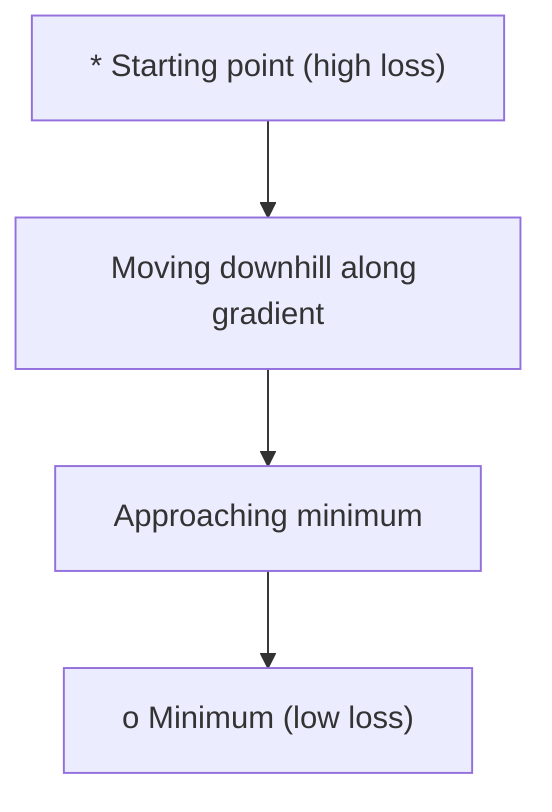
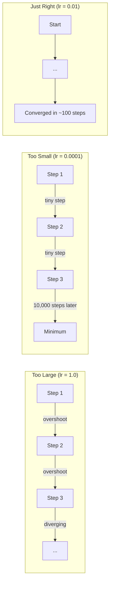
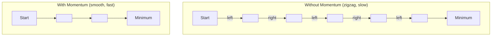
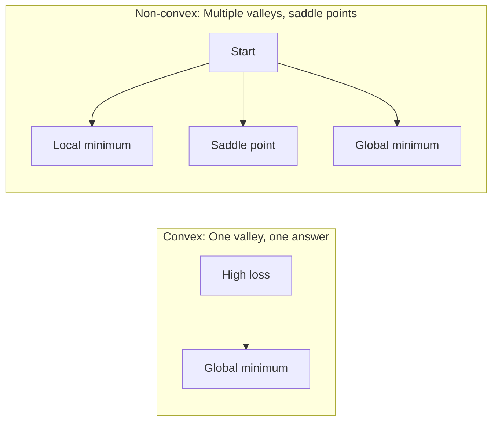
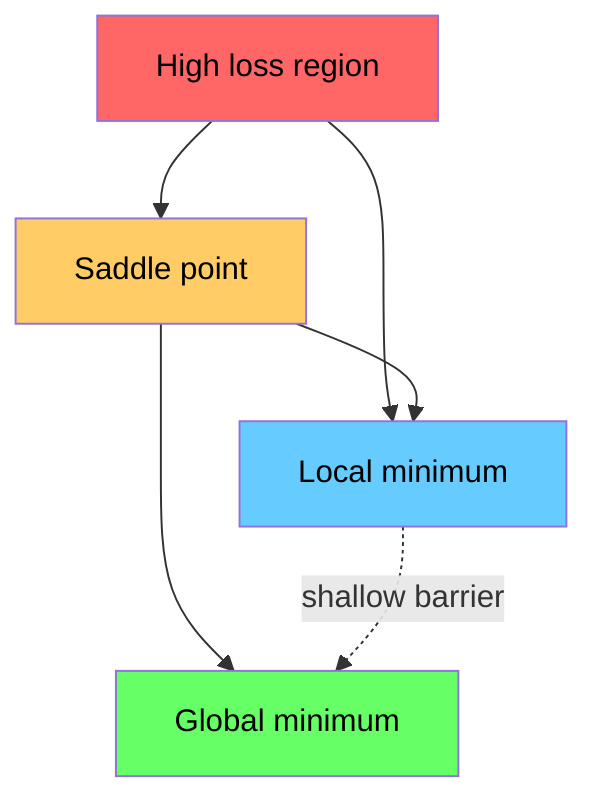

# Optimization

> 训练神经网络无非是寻找谷底。

**Type:** Build
**Language:** Python
**Prerequisites:** Phase 1, Lessons 04-05 (Derivatives, Gradients)
**Time:** ~75 minutes

## Learning Objectives

- Implement vanilla gradient descent, SGD with momentum, and Adam from scratch
- 比较Rosenbrock函数上的优化器收敛性并解释Adam为何调整按权重学习率
- 区分凸形和非凸形损失景观并解释鞍点在高维度中的作用
- Configure learning rate schedules (step decay, cosine annealing, warmup) for training stability

## The Problem

You have a loss function. It tells you how wrong your model is. You have gradients. They tell you which direction makes the loss worse. Now you need a strategy for walking downhill.

天真的方法很简单：与梯度相反移动。通过某个称为学习率的数字来扩展该步骤。重复.这是梯度下降，而且有效。但“作品”有一些警告。学习率太大，你会完全超越山谷，在墙壁之间弹跳。太小了，你会经过数千个不必要的步骤才能找到答案。击中马鞍点后，即使您还没有找到最小值，您也会停止移动。

深度学习领域的每个优化器都是对同一个问题的回答：如何更快、更可靠地到达谷底？

## The Concept

### What optimization means

优化是寻找最小化（或最大化）函数的输入值。在机器学习中，功能就是损失。输入是模型的权重。培训就是优化。

```
minimize L(w) where:
  L = loss function
  w = model weights (could be millions of parameters)
```

### Gradient descent (vanilla)

最简单的优化器。计算每个重量的损失梯度。将每个权重沿其梯度的相反方向移动。通过学习率缩放步骤。

```
w = w - lr * gradient
```

That is the entire algorithm. One line.



### Learning rate: the most important hyperparameter

学习率控制步进大小。它决定了有关融合的一切。



正确的学习率没有公式。你通过实验找到它。常见起点：Adam 0.001，有动力的新元0.01。

### SGD vs batch vs mini-batch

Vanilla梯度下降在迈出一步之前计算整个数据集的梯度。这称为批量梯度下降。它很稳定但很慢。

随机梯度下降（BCD）计算单个随机样本的梯度并立即步进。它很吵，但速度很快。

小批量梯度下降缩小了差异。计算一小批（32、64、128、256个样本）的梯度，然后分步进行。这是每个人实际使用的。

| 变体 | Batch size | Gradient quality | 每步速度 | 噪声 |
|---------|-----------|-----------------|---------------|-------|
| Batch GD | Entire dataset | Exact | 慢 | 没有一 |
| SGD | 1 sample | 非常嘈杂 | 快速 | 高 |
| Mini-batch | 32-256 | 良好估计 | Balanced | Moderate |

新元和迷你批次中的噪音不是错误。它有助于摆脱浅的局部极小值和鞍点。

### Momentum: the ball rolling downhill

香草梯度下降只考虑当前的梯度。如果梯度呈锯齿状（在狭窄的山谷中常见），进展就会很慢。动量通过将过去的梯度累积为速度项来修复这一点。

```
v = beta * v + gradient
w = w - lr * v
```

The analogy: a ball rolling downhill. It does not stop and restart at every bump. It builds speed in consistent directions and dampens oscillations.



“beta”（通常为0.9）控制要保留多少历史记录。更高的beta意味着更大的动量，更平滑的路径，但对方向变化的反应更慢。

### Adam: adaptive learning rates

不同的权重需要不同的学习率。很少获得大梯度的权重在最终获得大梯度时应该采取更大的步骤。不断获得巨大梯度的权重应该采取较小的步骤。

Adam（自适应矩估计）跟踪每个重量的两件事：

1. 一阶矩（m）：梯度的运行平均值（例如动量）
2. Second moment (v): running average of squared gradients (gradient magnitude)

```
m = beta1 * m + (1 - beta1) * gradient
v = beta2 * v + (1 - beta2) * gradient^2

m_hat = m / (1 - beta1^t)    bias correction
v_hat = v / (1 - beta2^t)    bias correction

w = w - lr * m_hat / (sqrt(v_hat) + epsilon)
```

通过“SQRT（v_hat）”进行划分是关键见解。具有大梯度的权重被除以大数字（小有效步骤）。具有小梯度的权重被一个小数字除（大的有效步骤）。每个权重都有自己的自适应学习率。

默认超参数：“lr=0.001，beta1=0.9，beta2=0.999，= 1 e-8”。这些默认设置对于大多数问题都很有效。

### Learning rate schedules

固定的学习率是一种妥协。在训练的早期，你想要大步前进以取得快速进步。在训练后期，你需要小步微调到最小值附近。

常见时间表：

| 附表 | 式 | 用例 |
|----------|---------|----------|
| Step decay | lr = lr * 每N个历元的因子 | 简单的手动控制 |
| Exponential decay | lr = lr_0 * 衰变' t | 平滑减小 |
| Cosine退变 | lr = lr_min + 0.5 *（lr_max - lr_min）*（1 + cos（pi * t / T）） | 变形金刚、现代训练 |
| Warmup + decay | 线性上升，然后衰减 | 大型模型，防止早期不稳定 |

### Convex vs non-convex

A convex function has one minimum. Gradient descent always finds it. A quadratic like `f(x) = x^2` is convex.

Neural network loss functions are non-convex. They have many local minima, saddle points, and flat regions.



在实践中，高维神经网络中的局部极小值很少成为问题。大多数局部最小值的损失值接近全局最小值。鞍点（在某些方向上平坦，在其他方向上弯曲）是真正的障碍。小批量的动量和噪音有助于逃脱它们。

### Loss landscape visualization

The loss is a function of all weights. For a model with 1 million weights, the loss landscape lives in 1,000,001-dimensional space. We visualize it by picking two random directions in weight space and plotting the loss along those directions, producing a 2D surface.



Sharp minima generalize poorly. Flat minima generalize well. This is one reason SGD with momentum often outperforms Adam on final test accuracy: its noise prevents settling into sharp minima.

## Build It

### Step 1: Define a test function

Rosenbrock函数是经典的优化基准。它的最小值在一个狭窄的弯曲山谷内（1，1）处，很容易找到但很难遵循。

```
f(x, y) = (1 - x)^2 + 100 * (y - x^2)^2
```

```python
def rosenbrock(params):
    x, y = params
    return (1 - x) ** 2 + 100 * (y - x ** 2) ** 2

def rosenbrock_gradient(params):
    x, y = params
    df_dx = -2 * (1 - x) + 200 * (y - x ** 2) * (-2 * x)
    df_dy = 200 * (y - x ** 2)
    return [df_dx, df_dy]
```

### Step 2: Vanilla gradient descent

```python
class GradientDescent:
    def __init__(self, lr=0.001):
        self.lr = lr

    def step(self, params, grads):
        return [p - self.lr * g for p, g in zip(params, grads)]
```

### Step 3: SGD with momentum

```python
class SGDMomentum:
    def __init__(self, lr=0.001, momentum=0.9):
        self.lr = lr
        self.momentum = momentum
        self.velocity = None

    def step(self, params, grads):
        if self.velocity is None:
            self.velocity = [0.0] * len(params)
        self.velocity = [
            self.momentum * v + g
            for v, g in zip(self.velocity, grads)
        ]
        return [p - self.lr * v for p, v in zip(params, self.velocity)]
```

### Step 4: Adam

```python
class Adam:
    def __init__(self, lr=0.001, beta1=0.9, beta2=0.999, epsilon=1e-8):
        self.lr = lr
        self.beta1 = beta1
        self.beta2 = beta2
        self.epsilon = epsilon
        self.m = None
        self.v = None
        self.t = 0

    def step(self, params, grads):
        if self.m is None:
            self.m = [0.0] * len(params)
            self.v = [0.0] * len(params)

        self.t += 1

        self.m = [
            self.beta1 * m + (1 - self.beta1) * g
            for m, g in zip(self.m, grads)
        ]
        self.v = [
            self.beta2 * v + (1 - self.beta2) * g ** 2
            for v, g in zip(self.v, grads)
        ]

        m_hat = [m / (1 - self.beta1 ** self.t) for m in self.m]
        v_hat = [v / (1 - self.beta2 ** self.t) for v in self.v]

        return [
            p - self.lr * mh / (vh ** 0.5 + self.epsilon)
            for p, mh, vh in zip(params, m_hat, v_hat)
        ]
```

### Step 5: Run and compare

```python
def optimize(optimizer, func, grad_func, start, steps=5000):
    params = list(start)
    history = [params[:]]
    for _ in range(steps):
        grads = grad_func(params)
        params = optimizer.step(params, grads)
        history.append(params[:])
    return history

start = [-1.0, 1.0]

gd_history = optimize(GradientDescent(lr=0.0005), rosenbrock, rosenbrock_gradient, start)
sgd_history = optimize(SGDMomentum(lr=0.0001, momentum=0.9), rosenbrock, rosenbrock_gradient, start)
adam_history = optimize(Adam(lr=0.01), rosenbrock, rosenbrock_gradient, start)

for name, history in [("GD", gd_history), ("SGD+M", sgd_history), ("Adam", adam_history)]:
    final = history[-1]
    loss = rosenbrock(final)
    print(f"{name:6s} -> x={final[0]:.6f}, y={final[1]:.6f}, loss={loss:.8f}")
```

预期输出：Adam收敛最快。势头强劲的新加坡元走上了更平坦的道路。香草GD沿着狭窄的山谷缓慢前进。

## Use It

In practice, use PyTorch or JAX optimizers. They handle parameter groups, weight decay, gradient clipping, and GPU acceleration.

```python
import torch

model = torch.nn.Linear(784, 10)

sgd = torch.optim.SGD(model.parameters(), lr=0.01, momentum=0.9)
adam = torch.optim.Adam(model.parameters(), lr=0.001)
adamw = torch.optim.AdamW(model.parameters(), lr=0.001, weight_decay=0.01)

scheduler = torch.optim.lr_scheduler.CosineAnnealingLR(adam, T_max=100)
```

经验法则：

- 从亚当开始（lr=0.001）。它适用于大多数无需调整的问题。
- 当您需要最佳的最终准确性并且可以提供更多调整时，切换到带有动量的新元（lr=0.01，动量=0.9）。
- 使用AdamW（Adam with decoupled weight decay）作为变压器。
- 始终使用学习率计划来进行超过几个纪元的训练。
- If training is unstable, reduce the learning rate. If training is too slow, increase it.

## Ship It

This lesson produces a prompt for choosing the right optimizer. See `outputs/prompt-optimizer-guide.md`.

当我们从头开始训练神经网络时，这里构建的优化器类会在第3阶段重新出现。

## Exercises

1. ** 学习率扫描。**使用学习率[0.0001，0.0005，0.001，0.005，0.001，0.005，0.01]对Rosenbrock函数运行香草梯度下降。绘制或打印每个步骤5000步后的最终损失。找到仍然收敛的最大学习率。

2. ** 动量比较。**在Rosenbrock函数上运行动量值[0.0，0.5，0.9，0.99]的Singapore。跟踪每一步的损失。哪个动量值收敛得最快？哪些超调？

3. ** 马鞍点逃生。**定义函数' f（x，y）= x#2-y#2 '（原点处的鞍点）。从（0.01，0.01）开始。比较vanilla god、Singapore with moment和Adam的行为。哪个逃脱了马鞍点？

4. ** 实现学习率衰减。**将指数衰减计划添加到AppoentDestent类：' lr = lr_0 * 0. 999 '步'。比较罗森布洛克函数有衰减和没有衰减的收敛性。

## Key Terms

| Term | What people say | What it actually means |
|------|----------------|----------------------|
| 梯度下降 | “走下坡路” | Update weights by subtracting the gradient scaled by the learning rate. The most basic optimizer. |
| Learning rate | “步骤大小” | 一个控制每次更新将权重移动多远的量。太大会导致分歧。太小会浪费计算。 |
| Momentum | "Keep rolling" | 将过去的梯度累积为速度载体。抑制振动并加速一致方向的运动。 |
| SGD | "Random sampling" | Stochastic gradient descent. Compute gradient on a random subset instead of the full dataset. Almost always means mini-batch SGD in practice. |
| 小批量 | “一大块数据” | A small subset of training data (32-256 samples) used to estimate the gradient. Balances speed and gradient accuracy. |
| Adam | “默认优化器” | 自适应矩估计。跟踪梯度和梯度平方的按权重的运行平均值，以赋予每个权重自己的学习率。 |
| Bias correction | “修复冷启动” | 亚当的第一时刻和第二时刻被初始化为零。偏差纠正除以（1 - Beta ' t）以在早期步骤中进行补偿。 |
| Learning rate schedule | "Change lr over time" | 在训练期间调整学习率的功能。大步早，小步晚。 |
| 凸函数 | "One valley" | A function where any local minimum is the global minimum. Gradient descent always finds it. Neural network losses are not convex. |
| 鞍点 | “平淡但不是最低限度” | 梯度为零但在某些方向上为最小值而在其他方向上为最大值的点。常见于高维度。 |
| 损失景观 | “地形” | 在重量空间上绘制的损失函数。通过沿着两个随机方向切片来可视化。 |
| 收敛 | "Getting there" | The optimizer has reached a point where further steps do not meaningfully reduce the loss. |

## Further Reading

- [塞巴斯蒂安·鲁德：梯度下降优化算法概述]（https：//ruder.io/optimizing-gradient-desent/）-所有主要优化器的全面调查
- [Why动量确实有效（Distill）]（https：//guardian.pub/2017/momentum/）-动量动态的交互式可视化
- [Adam: A Method for Stochastic Optimization (Kingma & Ba, 2014)](https://arxiv.org/abs/1412.6980) - the original Adam paper, readable and short
- [可视化神经网络的损失格局（Li等人，2018）]（https：//arxiv.org/ab/1712.09913）-展示尖锐与平坦最小值的论文
