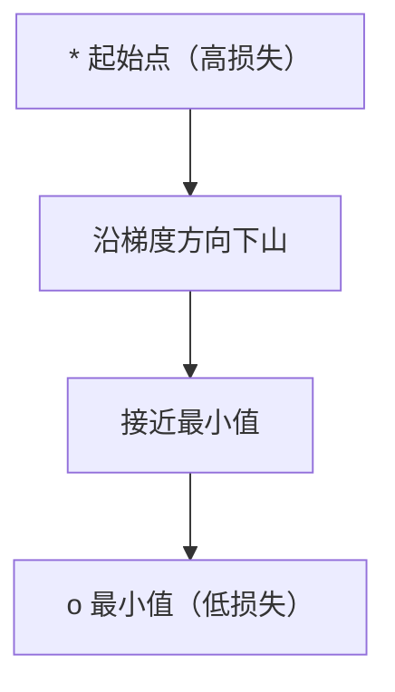
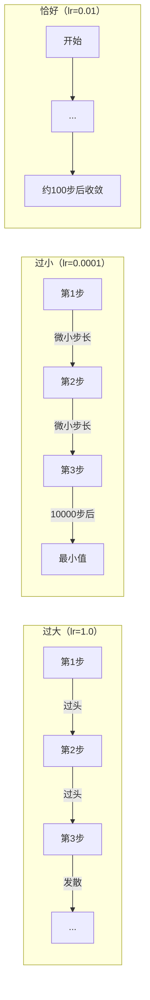
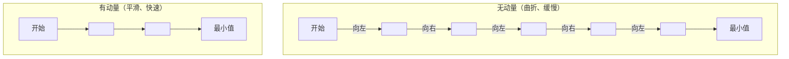
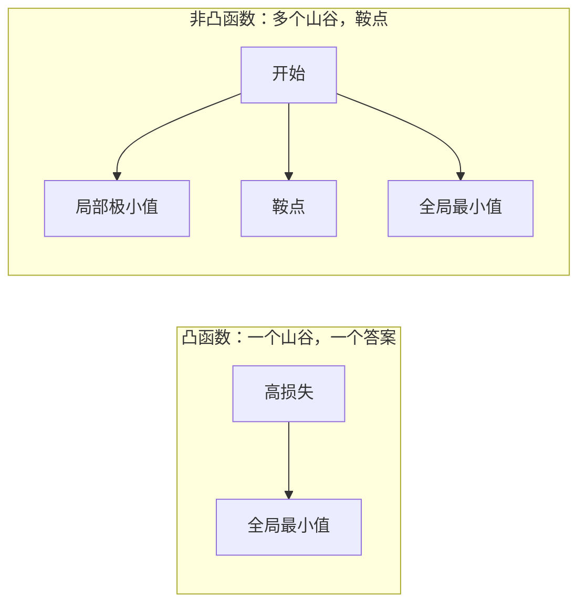
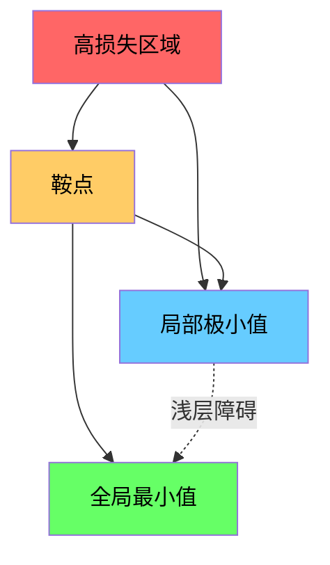

# 优化

> 训练神经网络本质上就是寻找一个山谷的底部。

**类型：** 构建
**语言：** Python
**前置要求：** 阶段一，第04-05课（导数、梯度）
**时长：** 约75分钟

## 学习目标

- 从零实现原始梯度下降、带动量的随机梯度下降（SGD with momentum）和Adam优化器
- 比较不同优化器在Rosenbrock函数上的收敛性，并解释Adam为何能为每个权重自适应调整学习率
- 区分凸损失曲面与非凸损失曲面，解释高维空间中鞍点（saddle point）的作用
- 配置学习率调度策略（阶梯衰减、余弦退火、预热）以确保训练稳定性

## 问题

你有一个损失函数（loss function）。它告诉你模型错得有多离谱。你还有梯度（gradients）。它们告诉你哪个方向会让损失变得更差。现在你需要一种下山的策略。

最直接的方法很简单：沿着梯度的反方向移动。用一个称为学习率（learning rate）的数字来缩放步长。重复。这就是梯度下降（gradient descent），它确实有效。但“有效”是有条件的。学习率过大，你会完全跳过山谷，在两壁之间来回反弹。学习率过小，你会像蜗牛一样爬向答案，浪费数千步。碰到鞍点（saddle point）时，即使还没找到最小值，你也会停止移动。

深度学习中的每一个优化器（optimizer）都是对同一个问题的回答：如何更快、更可靠地到达山谷底部？

## 概念

### 优化的含义

优化就是寻找使得函数最小化（或最大化）的输入值。在机器学习中，函数就是损失。输入是模型的权重。训练就是优化。

```
最小化 L(w) 其中：
  L = 损失函数
  w = 模型权重（可能有数百万个参数）
```

### 梯度下降（原始版）

最简单的优化器。计算损失相对于每个权重的梯度。将每个权重朝其梯度的相反方向移动。用学习率缩放步长。

```
w = w - lr * gradient
```

这就是整个算法。一行代码。



### 学习率：最重要的超参数

学习率控制步长。它决定了收敛的一切。



没有公式可以算出正确的学习率。你需要通过实验来找到。常见的起点：Adam用0.001，带动量的SGD用0.01。

### 批量梯度下降（SGD） vs 批量 vs 小批量

原始梯度下降在每次更新之前，会计算整个数据集上的梯度。这被称为批量梯度下降（batch gradient descent）。它很稳定，但速度慢。

随机梯度下降（Stochastic Gradient Descent, SGD）在单个随机样本上计算梯度，并立即更新。它噪声大，但速度快。

小批量梯度下降（mini-batch gradient descent）则折中：在一个小批量（32、64、128、256个样本）上计算梯度，然后更新。这才是实际中大家真正使用的。

| 变体 | 批量大小 | 梯度质量 | 每步速度 | 噪声 |
|---------|-----------|-----------------|---------------|-------|
| 批量梯度下降 | 整个数据集 | 精确 | 慢 | 无 |
| SGD | 1个样本 | 噪声很大 | 快 | 高 |
| 小批量梯度下降 | 32-256 | 良好估计 | 适中 | 中等 |

SGD和小批量中的噪声并非bug。它有助于逃离浅层局部极小值和鞍点。

### 动量：滚下山坡的球

原始梯度下降只关注当前梯度。如果梯度方向曲折（常见于狭窄山谷），则进展缓慢。动量（Momentum）通过将过去的梯度累积成速度项（velocity term）来解决这个问题。

```
v = beta * v + gradient
w = w - lr * v
```

打个比方：一个球滚下山坡。它不会在每个凸起处停下并重新开始。它在一致的方向上积累速度，并抑制振荡。



`beta`（通常取0.9）控制保留多少历史信息。beta越大，动量越大，路径越光滑，但对方向变化的响应越慢。

### Adam：自适应学习率

不同的权重需要不同的学习率。一个很少获得大梯度的权重，在终于获得大梯度时应该迈出更大的步。而一个不断获得巨大梯度的权重，步长应该更小。

Adam（自适应矩估计，Adaptive Moment Estimation）为每个权重追踪两个量：

1. 一阶矩（m）：梯度的运行平均值（类似动量）
2. 二阶矩（v）：梯度平方的运行平均值（梯度幅度）

```
m = beta1 * m + (1 - beta1) * gradient
v = beta2 * v + (1 - beta2) * gradient^2

m_hat = m / (1 - beta1^t)    偏差修正
v_hat = v / (1 - beta2^t)    偏差修正

w = w - lr * m_hat / (sqrt(v_hat) + epsilon)
```

除以 `sqrt(v_hat)` 是关键所在。梯度大的权重被一个大数除（有效步长小）。梯度小的权重被一个小数除（有效步长大）。每个权重都获得了自己的自适应学习率。

默认超参数：`lr=0.001, beta1=0.9, beta2=0.999, epsilon=1e-8`。这些默认值在大多数问题上效果良好。

### 学习率调度

固定的学习率是一种折衷。在训练早期，你需要大步长来快速推进。在训练后期，你需要小步长来在最小值附近进行微调。

常见的调度：

| 调度 | 公式 | 使用场景 |
|----------|---------|----------|
| 阶梯衰减 | 每N个epoch lr = lr * factor | 简单、手动控制 |
| 指数衰减 | lr = lr_0 * decay^t | 平滑降低 |
| 余弦退火 | lr = lr_min + 0.5 * (lr_max - lr_min) * (1 + cos(pi * t / T)) | Transformer、现代训练 |
| 预热 + 衰减 | 线性上升，然后衰减 | 大模型，防止早期不稳定 |

### 凸 vs 非凸

凸函数（convex function）只有一个最小值。梯度下降总能找到它。像 `f(x) = x^2` 这样的二次函数就是凸的。

神经网络的损失函数是非凸的（non-convex）。它们有许多局部极小值、鞍点和平坦区域。



实际上，高维神经网络中的局部极小值很少成为问题。大多数局部极小值的损失值都接近全局最小值。鞍点（在某些方向平坦，在其他方向弯曲）才是真正的障碍。动量和小批量的噪声有助于逃离它们。

### 损失曲面可视化

损失是所有权重的函数。对于一个有100万个权重的模型，损失曲面位于1,000,001维空间中。我们通过选择权重空间中两个随机方向，并沿着这些方向绘制损失值，从而得到一个二维曲面来进行可视化。



尖锐的极小值（sharp minima）泛化能力差。平坦的极小值（flat minima）泛化能力强。这也是为什么带动量的SGD在最终测试准确率上往往优于Adam的原因之一：它的噪声防止了模型落入尖锐的极小值。

## 动手构建

### 步骤1：定义测试函数

Rosenbrock函数是经典的优化基准。它的最小值位于(1, 1)，位于一条狭窄弯曲的山谷中，很容易找到但很难跟上。

```
f(x, y) = (1 - x)^2 + 100 * (y - x^2)^2
```

```python
def rosenbrock(params):
    x, y = params
    return (1 - x) ** 2 + 100 * (y - x ** 2) ** 2

def rosenbrock_gradient(params):
    x, y = params
    df_dx = -2 * (1 - x) + 200 * (y - x ** 2) * (-2 * x)
    df_dy = 200 * (y - x ** 2)
    return [df_dx, df_dy]
```

### 步骤2：原始梯度下降

```python
class GradientDescent:
    def __init__(self, lr=0.001):
        self.lr = lr

    def step(self, params, grads):
        return [p - self.lr * g for p, g in zip(params, grads)]
```

### 步骤3：带动量的SGD

```python
class SGDMomentum:
    def __init__(self, lr=0.001, momentum=0.9):
        self.lr = lr
        self.momentum = momentum
        self.velocity = None

    def step(self, params, grads):
        if self.velocity is None:
            self.velocity = [0.0] * len(params)
        self.velocity = [
            self.momentum * v + g
            for v, g in zip(self.velocity, grads)
        ]
        return [p - self.lr * v for p, v in zip(params, self.velocity)]
```

### 步骤4：Adam

```python
class Adam:
    def __init__(self, lr=0.001, beta1=0.9, beta2=0.999, epsilon=1e-8):
        self.lr = lr
        self.beta1 = beta1
        self.beta2 = beta2
        self.epsilon = epsilon
        self.m = None
        self.v = None
        self.t = 0

    def step(self, params, grads):
        if self.m is None:
            self.m = [0.0] * len(params)
            self.v = [0.0] * len(params)

        self.t += 1

        self.m = [
            self.beta1 * m + (1 - self.beta1) * g
            for m, g in zip(self.m, grads)
        ]
        self.v = [
            self.beta2 * v + (1 - self.beta2) * g ** 2
            for v, g in zip(self.v, grads)
        ]

        m_hat = [m / (1 - self.beta1 ** self.t) for m in self.m]
        v_hat = [v / (1 - self.beta2 ** self.t) for v in self.v]

        return [
            p - self.lr * mh / (vh ** 0.5 + self.epsilon)
            for p, mh, vh in zip(params, m_hat, v_hat)
        ]
```

### 步骤5：运行并比较

```python
def optimize(optimizer, func, grad_func, start, steps=5000):
    params = list(start)
    history = [params[:]]
    for _ in range(steps):
        grads = grad_func(params)
        params = optimizer.step(params, grads)
        history.append(params[:])
    return history

start = [-1.0, 1.0]

gd_history = optimize(GradientDescent(lr=0.0005), rosenbrock, rosenbrock_gradient, start)
sgd_history = optimize(SGDMomentum(lr=0.0001, momentum=0.9), rosenbrock, rosenbrock_gradient, start)
adam_history = optimize(Adam(lr=0.01), rosenbrock, rosenbrock_gradient, start)

for name, history in [("GD", gd_history), ("SGD+M", sgd_history), ("Adam", adam_history)]:
    final = history[-1]
    loss = rosenbrock(final)
    print(f"{name:6s} -> x={final[0]:.6f}, y={final[1]:.6f}, loss={loss:.8f}")
```

预期输出：Adam收敛最快。带动量的SGD路径更平滑。原始GD在狭窄山谷中进展缓慢。

## 实际使用

在实践中，请使用PyTorch或JAX的优化器。它们处理参数组、权重衰减（weight decay）、梯度裁剪（gradient clipping）和GPU加速。

```python
import torch

model = torch.nn.Linear(784, 10)

sgd = torch.optim.SGD(model.parameters(), lr=0.01, momentum=0.9)
adam = torch.optim.Adam(model.parameters(), lr=0.001)
adamw = torch.optim.AdamW(model.parameters(), lr=0.001, weight_decay=0.01)

scheduler = torch.optim.lr_scheduler.CosineAnnealingLR(adam, T_max=100)
```

经验法则：

- 从Adam开始（lr=0.001）。它对大多数问题都有效，无需调参。
- 当你需要最佳最终准确率并且可以承受更多调参时，切换为带动量的SGD（lr=0.01, momentum=0.9）。
- 对Transformer使用AdamW（带解耦权重衰减的Adam）。
- 对于超过几个epoch的训练，始终使用学习率调度。
- 如果训练不稳定，降低学习率。如果训练太慢，提高学习率。

## 交付物

本课学习内容产生一个用于选择合适优化器的提示。参见 `outputs/prompt-optimizer-guide.md`。

此处构建的优化器类将在阶段三中从零训练神经网络时再次出现。

## 练习

1. **学习率扫描。** 用学习率 [0.0001, 0.0005, 0.001, 0.005, 0.01] 在Rosenbrock函数上运行原始梯度下降。绘制或打印每个学习率在5000步后的最终损失。找到仍然能收敛的最大学习率。

2. **动量比较。** 用动量值 [0.0, 0.5, 0.9, 0.99] 在Rosenbrock函数上运行带动量的SGD。追踪每一步的损失。哪个动量值收敛最快？哪个动量值导致过冲？

3. **逃离鞍点。** 定义函数 `f(x, y) = x^2 - y^2`（原点处有一个鞍点）。从 (0.01, 0.01) 开始。比较原始GD、带动量的SGD和Adam的表现。哪个能逃离鞍点？

4. **实现学习率衰减。** 在GradientDescent类中添加指数衰减调度：`lr = lr_0 * 0.999^step`。在Rosenbrock函数上比较有衰减和无衰减的收敛情况。

## 关键术语

| 术语 | 人们怎么说 | 实际含义 |
|------|----------------|----------------------|
| 梯度下降（Gradient descent） | “下山” | 通过减去梯度乘以学习率来更新权重。最基本的优化器。 |
| 学习率（Learning rate） | “步长” | 控制每次更新移动权重的标量。太大会导致发散。太小浪费计算。 |
| 动量（Momentum） | “继续滚” | 将过去的梯度累积成速度向量。抑制振荡并加速在一致方向上的移动。 |
| SGD | “随机采样” | 随机梯度下降。在随机子集上计算梯度，而不是整个数据集。实践中几乎总是指小批量SGD。 |
| 小批量（Mini-batch） | “一块数据” | 用于估计梯度的一小部分训练数据（32-256个样本）。平衡速度与梯度精度。 |
| Adam | “默认优化器” | 自适应矩估计。为每个权重追踪梯度和梯度平方的运行平均值，使每个权重拥有