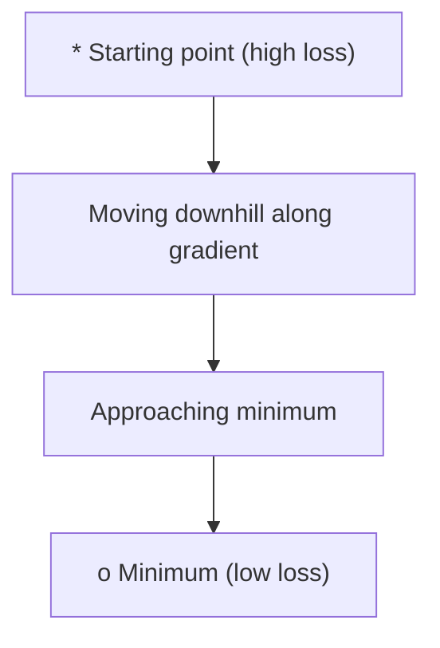
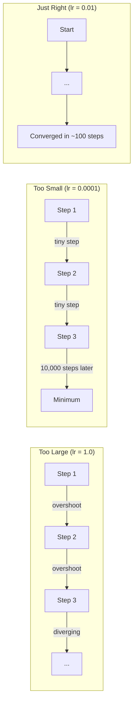
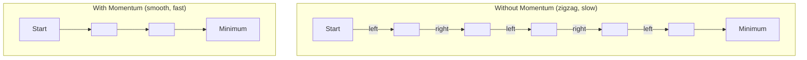
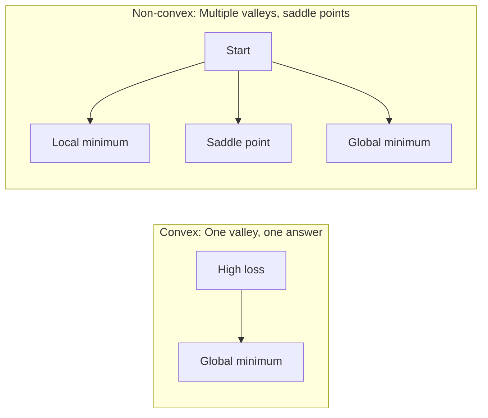
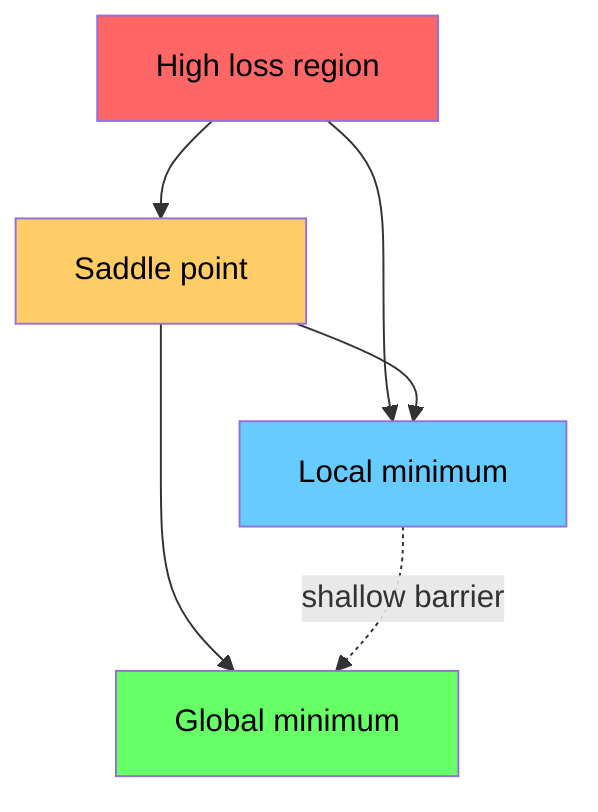

# 最佳化

> 訓練神經網路不過就是找到谷底而已。

**類型：** 實作
**程式語言：** Python
**先修單元：** 階段 1 · 單元 04-05（導數、梯度）
**時間：** 約 75 分鐘

## 學習目標

- 從零實作原始版梯度下降、帶動量的 SGD，以及 Adam
- 在 Rosenbrock 函式上比較各最佳化器的收斂情形，並說明 Adam 為何會為每個權重調整學習率
- 分辨凸與非凸的損失地景，並說明鞍點在高維空間中扮演的角色
- 為訓練穩定性設定學習率排程（階梯式衰減、cosine annealing、warmup）

## 問題所在

你有一個損失函式，它告訴你模型錯得多離譜。你也有梯度，它告訴你哪個方向會讓損失變得更糟。現在你需要一套往下坡走的策略。

最直白的做法很簡單：往梯度的反方向走，步伐大小乘上一個叫學習率的數字，然後重複。這就是梯度下降，而它確實有用。但「有用」是有前提的。學習率太大，你會整個衝過谷底，在兩側山壁之間彈來彈去。太小，你就得多花好幾千步不必要的爬行才走到答案。碰上鞍點，你明明還沒找到最小值，卻停在那裡不動了。

深度學習裡的每一個最佳化器，都是在回答同一個問題：怎麼更快、更可靠地走到谷底？

## 核心概念

### 最佳化是什麼意思

最佳化就是找出讓某個函式最小（或最大）的輸入值。在機器學習裡，那個函式是損失，輸入是模型的權重。訓練就是最佳化。

```
minimize L(w) where:
  L = loss function
  w = model weights (could be millions of parameters)
```

### 梯度下降（原始版）

最簡單的最佳化器。算出損失對每一個權重的梯度，把每個權重往它自己梯度的反方向移動，步伐大小乘上學習率。

```
w = w - lr * gradient
```

整個演算法就這樣。一行。


```mermaid
graph TD
    A["* Starting point (high loss)"] --> B["Moving downhill along gradient"]
    B --> C["Approaching minimum"]
    C --> D["o Minimum (low loss)"]
```

### 學習率：最重要的超參數

學習率控制步伐大小。收斂的一切都由它決定。


```mermaid
graph LR
    subgraph TooLarge["Too Large (lr = 1.0)"]
        A1["Step 1"] -->|overshoot| A2["Step 2"]
        A2 -->|overshoot| A3["Step 3"]
        A3 -->|diverging| A4["..."]
    end
    subgraph TooSmall["Too Small (lr = 0.0001)"]
        B1["Step 1"] -->|tiny step| B2["Step 2"]
        B2 -->|tiny step| B3["Step 3"]
        B3 -->|10,000 steps later| B4["Minimum"]
    end
    subgraph JustRight["Just Right (lr = 0.01)"]
        C1["Start"] --> C2["..."] --> C3["Converged in ~100 steps"]
    end
```

沒有公式能算出正確的學習率。你得靠實驗找出來。常見的起點：Adam 用 0.001，帶動量的 SGD 用 0.01。

### SGD vs 批次 vs 小批次

原始版梯度下降會先在整份資料集上算出梯度，才踏一步。這叫批次梯度下降。它很穩定，但很慢。

隨機梯度下降（SGD）只在單一個隨機樣本上算梯度，然後立刻更新。它很吵，但很快。

小批次梯度下降取兩者的折衷。在一個小批次（32、64、128、256 個樣本）上算梯度，然後更新。這才是大家實際在用的做法。

| 變體 | 批次大小 | 梯度品質 | 每步速度 | 雜訊 |
|---------|-----------|-----------------|---------------|-------|
| 批次 GD | 整份資料集 | 精確 | 慢 | 無 |
| SGD | 1 個樣本 | 非常吵 | 快 | 高 |
| 小批次 | 32-256 | 不錯的估計 | 平衡 | 中等 |

SGD 與小批次帶來的雜訊不是缺陷。它幫助你逃出淺的區域最小值與鞍點。

### 動量：滾下山坡的球

原始版梯度下降只看當下的梯度。如果梯度來回鋸齒（在狹長的山谷裡很常見），進展就會很慢。動量的做法是把過去的梯度累積成一個速度項，藉此解決這個問題。

```
v = beta * v + gradient
w = w - lr * v
```

這個比喻是：一顆滾下山坡的球。它不會在每個坑窪處停下來重新起步。它會在方向一致的路上累積速度，並抑制來回震盪。


```mermaid
graph TD
    subgraph Without["Without Momentum (zigzag, slow)"]
        W1["Start"] -->|left| W2[" "]
        W2 -->|right| W3[" "]
        W3 -->|left| W4[" "]
        W4 -->|right| W5[" "]
        W5 -->|left| W6[" "]
        W6 --> W7["Minimum"]
    end
    subgraph With["With Momentum (smooth, fast)"]
        M1["Start"] --> M2[" "] --> M3[" "] --> M4["Minimum"]
    end
```

`beta`（通常是 0.9）控制要保留多少歷史。beta 越大，動量越強、路徑越平滑，但對方向改變的反應也越慢。

### Adam：自適應學習率

不同的權重需要不同的學習率。一個很少拿到大梯度的權重，在終於拿到的時候應該踏大一點的步。一個總是拿到巨大梯度的權重，則應該踏小一點。

Adam（Adaptive Moment Estimation）為每個權重追蹤兩件事：

1. 一階動量（m）：梯度的移動平均（就像動量）
2. 二階動量（v）：梯度平方的移動平均（梯度的大小）

```
m = beta1 * m + (1 - beta1) * gradient
v = beta2 * v + (1 - beta2) * gradient^2

m_hat = m / (1 - beta1^t)    bias correction
v_hat = v / (1 - beta2^t)    bias correction

w = w - lr * m_hat / (sqrt(v_hat) + epsilon)
```

除以 `sqrt(v_hat)` 是這裡的關鍵洞見。梯度大的權重會被一個大的數字除（有效步伐變小）。梯度小的權重會被一個小的數字除（有效步伐變大）。每個權重都拿到自己的自適應學習率。

預設超參數：`lr=0.001, beta1=0.9, beta2=0.999, epsilon=1e-8`。這些預設值在多數問題上都表現良好。

### 學習率排程

固定的學習率是一種妥協。訓練早期，你想用大步伐快速推進。訓練後期，你想用小步伐在最小值附近做細調。

常見的排程：

| 排程 | 公式 | 適用場景 |
|----------|---------|----------|
| 階梯式衰減 | lr = lr * factor every N epochs | 簡單、可手動控制 |
| 指數衰減 | lr = lr_0 * decay^t | 平滑地遞減 |
| Cosine annealing | lr = lr_min + 0.5 * (lr_max - lr_min) * (1 + cos(pi * t / T)) | Transformer、現代訓練流程 |
| Warmup + 衰減 | 線性上升，然後衰減 | 大模型，避免早期不穩定 |

### 凸 vs 非凸

凸函式只有一個最小值，梯度下降一定找得到。像 `f(x) = x^2` 這樣的二次函式就是凸的。

神經網路的損失函式是非凸的。它們有很多區域最小值、鞍點與平坦區域。


```mermaid
graph LR
    subgraph Convex["Convex: One valley, one answer"]
        direction TB
        CV1["High loss"] --> CV2["Global minimum"]
    end
    subgraph NonConvex["Non-convex: Multiple valleys, saddle points"]
        direction TB
        NC1["Start"] --> NC2["Local minimum"]
        NC1 --> NC3["Saddle point"]
        NC1 --> NC4["Global minimum"]
    end
```

實務上，高維神經網路裡的區域最小值很少構成問題。大多數區域最小值的損失值都接近全域最小值。真正的障礙是鞍點（在某些方向上是平的，在其他方向上是彎的）。動量與小批次帶來的雜訊有助於逃離它們。

### 損失地景視覺化

損失是所有權重的函式。對一個有 100 萬個權重的模型來說，損失地景活在 1,000,001 維的空間裡。我們的視覺化方式是：在權重空間裡挑兩個隨機方向，沿著這兩個方向畫出損失，得到一個二維曲面。


```mermaid
graph TD
    HL["High loss region"] --> SP["Saddle point"]
    HL --> LM["Local minimum"]
    SP --> LM
    SP --> GM["Global minimum"]
    LM -.->|"shallow barrier"| GM
    style HL fill:#ff6666,color:#000
    style SP fill:#ffcc66,color:#000
    style LM fill:#66ccff,color:#000
    style GM fill:#66ff66,color:#000
```

尖銳的最小值泛化得差。平坦的最小值泛化得好。這是帶動量的 SGD 在最終測試準確率上常常勝過 Adam 的原因之一：它的雜訊讓模型不會安頓在尖銳的最小值裡。

```figure
gradient-descent
```

## 動手實作

### 步驟 1：定義一個測試函式

Rosenbrock 函式是經典的最佳化基準。它的最小值在 (1, 1)，位在一條狹長彎曲的山谷裡 —— 谷很好找，但很難沿著它走。

```
f(x, y) = (1 - x)^2 + 100 * (y - x^2)^2
```

```python
def rosenbrock(params):
    x, y = params
    return (1 - x) ** 2 + 100 * (y - x ** 2) ** 2

def rosenbrock_gradient(params):
    x, y = params
    df_dx = -2 * (1 - x) + 200 * (y - x ** 2) * (-2 * x)
    df_dy = 200 * (y - x ** 2)
    return [df_dx, df_dy]
```

### 步驟 2：原始版梯度下降

```python
class GradientDescent:
    def __init__(self, lr=0.001):
        self.lr = lr

    def step(self, params, grads):
        return [p - self.lr * g for p, g in zip(params, grads)]
```

### 步驟 3：帶動量的 SGD

```python
class SGDMomentum:
    def __init__(self, lr=0.001, momentum=0.9):
        self.lr = lr
        self.momentum = momentum
        self.velocity = None

    def step(self, params, grads):
        if self.velocity is None:
            self.velocity = [0.0] * len(params)
        self.velocity = [
            self.momentum * v + g
            for v, g in zip(self.velocity, grads)
        ]
        return [p - self.lr * v for p, v in zip(params, self.velocity)]
```

### 步驟 4：Adam

```python
class Adam:
    def __init__(self, lr=0.001, beta1=0.9, beta2=0.999, epsilon=1e-8):
        self.lr = lr
        self.beta1 = beta1
        self.beta2 = beta2
        self.epsilon = epsilon
        self.m = None
        self.v = None
        self.t = 0

    def step(self, params, grads):
        if self.m is None:
            self.m = [0.0] * len(params)
            self.v = [0.0] * len(params)

        self.t += 1

        self.m = [
            self.beta1 * m + (1 - self.beta1) * g
            for m, g in zip(self.m, grads)
        ]
        self.v = [
            self.beta2 * v + (1 - self.beta2) * g ** 2
            for v, g in zip(self.v, grads)
        ]

        m_hat = [m / (1 - self.beta1 ** self.t) for m in self.m]
        v_hat = [v / (1 - self.beta2 ** self.t) for v in self.v]

        return [
            p - self.lr * mh / (vh ** 0.5 + self.epsilon)
            for p, mh, vh in zip(params, m_hat, v_hat)
        ]
```

### 步驟 5：跑起來比一比

```python
def optimize(optimizer, func, grad_func, start, steps=5000):
    params = list(start)
    history = [params[:]]
    for _ in range(steps):
        grads = grad_func(params)
        params = optimizer.step(params, grads)
        history.append(params[:])
    return history

start = [-1.0, 1.0]

gd_history = optimize(GradientDescent(lr=0.0005), rosenbrock, rosenbrock_gradient, start)
sgd_history = optimize(SGDMomentum(lr=0.0001, momentum=0.9), rosenbrock, rosenbrock_gradient, start)
adam_history = optimize(Adam(lr=0.01), rosenbrock, rosenbrock_gradient, start)

for name, history in [("GD", gd_history), ("SGD+M", sgd_history), ("Adam", adam_history)]:
    final = history[-1]
    loss = rosenbrock(final)
    print(f"{name:6s} -> x={final[0]:.6f}, y={final[1]:.6f}, loss={loss:.8f}")
```

預期輸出：Adam 收斂最快。帶動量的 SGD 走的路徑比較平滑。原始版 GD 在狹長山谷裡進展很慢。

## 框架應用

實務上請用 PyTorch 或 JAX 的最佳化器。它們會處理參數群組、權重衰減、梯度裁剪與 GPU 加速。

```python
import torch

model = torch.nn.Linear(784, 10)

sgd = torch.optim.SGD(model.parameters(), lr=0.01, momentum=0.9)
adam = torch.optim.Adam(model.parameters(), lr=0.001)
adamw = torch.optim.AdamW(model.parameters(), lr=0.001, weight_decay=0.01)

scheduler = torch.optim.lr_scheduler.CosineAnnealingLR(adam, T_max=100)
```

經驗法則：

- 先從 Adam（lr=0.001）開始。它不用調參就能應付大多數問題。
- 當你需要最好的最終準確率、也願意花更多力氣調參時，換成帶動量的 SGD（lr=0.01, momentum=0.9）。
- Transformer 用 AdamW（把權重衰減解耦的 Adam）。
- 只要訓練跑超過幾個 epoch，就一定要用學習率排程。
- 訓練不穩定就把學習率調小。訓練太慢就調大。

## 產出交付

這個單元會產出一份挑選最佳化器的提示詞。見 `outputs/prompt-optimizer-guide.md`。

這裡打造的最佳化器類別會在階段 3 再次出現 —— 那時我們要從零訓練一個神經網路。

## 練習

1. **學習率掃描。** 在 Rosenbrock 函式上用學習率 [0.0001, 0.0005, 0.001, 0.005, 0.01] 跑原始版梯度下降。把每一種在 5000 步後的最終損失畫出來或印出來。找出仍然會收斂的最大學習率。

2. **動量比較。** 在 Rosenbrock 函式上用動量值 [0.0, 0.5, 0.9, 0.99] 跑 SGD。追蹤每一步的損失。哪個動量值收斂最快？哪個會衝過頭？

3. **逃離鞍點。** 定義函式 `f(x, y) = x^2 - y^2`（原點是一個鞍點）。從 (0.01, 0.01) 出發。比較原始版 GD、帶動量的 SGD 與 Adam 的行為。哪一個逃出了鞍點？

4. **實作學習率衰減。** 為 GradientDescent 類別加上指數衰減排程：`lr = lr_0 * 0.999^step`。在 Rosenbrock 函式上比較有衰減與沒衰減的收斂情形。

## 關鍵術語

| 術語 | 大家怎麼說 | 實際上是什麼 |
|------|----------------|----------------------|
| 梯度下降 | 「往下坡走」 | 把梯度乘上學習率後從權重裡減掉，以此更新權重。最基本的最佳化器。 |
| 學習率 | 「步伐大小」 | 一個控制每次更新把權重挪多遠的純量。太大會發散，太小則浪費算力。 |
| 動量 (momentum) | 「保持滾動」 | 把過去的梯度累積成一個速度向量。抑制震盪，並在方向一致的路上加速前進。 |
| SGD | 「隨機取樣」 | 隨機梯度下降。在一個隨機子集上算梯度，而不是整份資料集。實務上幾乎都是指小批次 SGD。 |
| 小批次 (mini-batch) | 「一小塊資料」 | 用來估計梯度的一小份訓練資料（32-256 個樣本）。在速度與梯度精確度之間取得平衡。 |
| Adam | 「預設的最佳化器」 | Adaptive Moment Estimation。為每個權重追蹤梯度與梯度平方的移動平均，讓每個權重都有自己的學習率。 |
| 偏差校正 | 「修掉冷啟動」 | Adam 的一階與二階動量都初始化為零。偏差校正會除以 (1 - beta^t)，在早期的步伐裡補償這件事。 |
| 學習率排程 | 「讓 lr 隨時間變化」 | 一個在訓練過程中調整學習率的函式。早期踏大步，後期踏小步。 |
| 凸函式 | 「只有一個山谷」 | 任何區域最小值都同時是全域最小值的函式。梯度下降一定找得到。神經網路的損失不是凸的。 |
| 鞍點 | 「平的，但不是最小值」 | 梯度為零的點，但它在某些方向上是最小值、在其他方向上是最大值。在高維空間裡很常見。 |
| 損失地景 | 「地形」 | 損失函式在權重空間上畫出來的樣子。透過沿兩個隨機方向切片來視覺化。 |
| 收斂 | 「走到了」 | 最佳化器已經走到一個位置，再往下走也不會有意義地降低損失。 |

## 延伸閱讀

- [Sebastian Ruder: An overview of gradient descent optimization algorithms](https://ruder.io/optimizing-gradient-descent/) - 涵蓋所有主要最佳化器的完整綜述
- [Why Momentum Really Works (Distill)](https://distill.pub/2017/momentum/) - 動量動態的互動式視覺化
- [Adam: A Method for Stochastic Optimization (Kingma & Ba, 2014)](https://arxiv.org/abs/1412.6980) - Adam 的原始論文，好讀又短
- [Visualizing the Loss Landscape of Neural Nets (Li et al., 2018)](https://arxiv.org/abs/1712.09913) - 提出尖銳與平坦最小值對比的那篇論文
