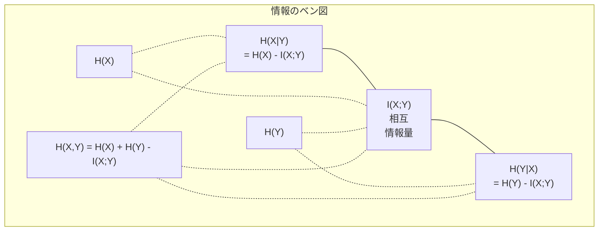

# 情報理論

> 情報理論は驚きを測ります。損失関数はその上に作られています。

**種別:** 学習
**言語:** Python
**前提条件:** Phase 1、Lesson 06（確率）
**所要時間:** 約60分

## 学習目標

- エントロピー、クロスエントロピー、KLダイバージェンスをスクラッチで計算し、それらの関係を説明する
- クロスエントロピー損失の最小化がlog尤度の最大化と等価である理由を導出する
- 特徴量とターゲットの間の相互情報量を計算し、特徴量重要度を順位付けする
- パープレキシティを、言語モデルが選んでいる有効語彙サイズとして説明する

## 問題

分類モデルを訓練するたびに `CrossEntropyLoss()` を呼びます。どの言語モデル論文でも「perplexity」を目にします。VAE、distillation、RLHFではKLダイバージェンスが出てきます。これらは互いに切り離された概念ではありません。すべて同じアイデアが違う帽子をかぶっているだけです。

情報理論は、不確実性、圧縮、予測について推論するための言語を与えてくれます。Claude Shannonは1948年に通信問題を解くためにこれを発明しました。実は、ニューラルネットワークの訓練も通信問題です。モデルは、学習された重みというノイズのあるチャネルを通して、正しいラベルを伝えようとしています。

このレッスンでは、すべての式をスクラッチから構築し、それらがどこから来て、なぜ機能するのかを見ていきます。

## 概念

### 情報量（驚き）

起こりにくいことが起きると、より多くの情報を持ちます。コインが表になる？それほど驚きません。宝くじに当たる？非常に驚きます。

確率 p の事象の情報量は次のとおりです。

```
I(x) = -log(p(x))
```

logの底に2を使うと単位はbitsです。自然対数を使うとnatsです。同じ考え方で、単位が違うだけです。

```
事象                確率          驚き（bits）
公平なコインの表    0.5           1.0
サイコロで6          0.167         2.58
1000分の1の事象      0.001         9.97
確実な事象           1.0           0.0
```

確実な事象は情報量ゼロです。すでに起こるとわかっていたからです。

### エントロピー（平均的な驚き）

エントロピーは、ある分布のすべての可能な結果にわたる期待驚きです。

```
H(P) = -sum( p(x) * log(p(x)) )  すべてのxについて
```

公平なコインは、二値変数として最大エントロピーを持ちます。1 bitです。偏ったコイン（99%が表）は低いエントロピーを持ちます。0.08 bitsです。何が起こるかほぼわかっているので、各試行はほとんど何も教えてくれません。

```
公平なコイン: H = -(0.5 * log2(0.5) + 0.5 * log2(0.5)) = 1.0 bit
偏ったコイン: H = -(0.99 * log2(0.99) + 0.01 * log2(0.01)) = 0.08 bits
```

エントロピーは分布に残る削減不能な不確実性を測ります。それ未満には圧縮できません。

### クロスエントロピー（毎日使っている損失関数）

クロスエントロピーは、本当は分布Pから来ている事象を、分布Qを使って符号化したときの平均的な驚きを測ります。

```
H(P, Q) = -sum( p(x) * log(q(x)) )  すべてのxについて
```

Pは真の分布（ラベル）です。Qはモデルの予測です。QがPに完全に一致していれば、クロスエントロピーはエントロピーと等しくなります。不一致があると、それより大きくなります。

分類では、Pはone-hotベクトルです（真のクラスの確率が1で、それ以外は0）。そのため、クロスエントロピーは次のように単純化されます。

```
H(P, Q) = -log(q(true_class))
```

これが分類におけるクロスエントロピー損失の式全体です。正しいクラスの予測確率を最大化します。

### KLダイバージェンス（分布間の距離）

KLダイバージェンスは、Pの代わりにQを使うことで生じる追加の驚きを測ります。

```
D_KL(P || Q) = sum( p(x) * log(p(x) / q(x)) )  すべてのxについて
             = H(P, Q) - H(P)
```

クロスエントロピーは、エントロピーにKLダイバージェンスを足したものです。訓練中、真の分布のエントロピーは定数なので、クロスエントロピーを最小化することはKLダイバージェンスを最小化することと同じです。モデルの分布を真の分布へ押し寄せています。

KLダイバージェンスは対称ではありません。D_KL(P || Q) != D_KL(Q || P) です。真の距離尺度ではありません。

### 相互情報量

相互情報量は、一方の変数を知ることで、もう一方についてどれだけわかるかを測ります。

```
I(X; Y) = H(X) - H(X|Y)
        = H(X) + H(Y) - H(X, Y)
```

XとYが独立なら、相互情報量はゼロです。一方を知っても、もう一方について何もわかりません。完全に相関しているなら、相互情報量はどちらか一方の変数のエントロピーに等しくなります。

特徴量選択では、特徴量とターゲットの間の相互情報量が高いほど、その特徴量は有用です。相互情報量が低いなら、それはノイズです。

### 条件付きエントロピー

H(Y|X) は、Xを観測した後にYについてどれだけ不確実性が残るかを測ります。

```
H(Y|X) = H(X,Y) - H(X)
```

2つの極端な場合:
- XがYを完全に決めるなら、H(Y|X) = 0 です。Xを知ればYに関する不確実性はすべて消えます。例: X = 摂氏温度、Y = 華氏温度。
- XがYについて何も教えてくれないなら、H(Y|X) = H(Y) です。Xを知っても不確実性はまったく減りません。例: X = コイン投げ、Y = 明日の天気。

条件付きエントロピーは常に非負で、H(Y)を超えません。

```
0 <= H(Y|X) <= H(Y)
```

機械学習では、条件付きエントロピーは決定木に現れます。各分割で、アルゴリズムは H(Y|X) を最小化する特徴量Xを選びます。つまり、ラベルYについて最も多くの不確実性を取り除く特徴量です。

### 結合エントロピー

H(X,Y) は、XとYを合わせた結合分布のエントロピーです。

```
H(X,Y) = -sum sum p(x,y) * log(p(x,y))   すべてのx, yについて
```

重要な性質:

```
H(X,Y) <= H(X) + H(Y)
```

XとYが独立のとき等号が成り立ちます。情報を共有している場合、結合エントロピーは個別のエントロピーの和より小さくなります。「欠けている」エントロピーが、まさに相互情報量です。



関係式:
- H(X,Y) = H(X) + H(Y|X) = H(Y) + H(X|Y)
- I(X;Y) = H(X) - H(X|Y) = H(Y) - H(Y|X)
- H(X,Y) = H(X) + H(Y) - I(X;Y)

### 相互情報量（深掘り）

相互情報量 I(X;Y) は、一方の変数を知ることで、もう一方についての不確実性がどれだけ減るかを定量化します。

```
I(X;Y) = H(X) - H(X|Y)
       = H(Y) - H(Y|X)
       = H(X) + H(Y) - H(X,Y)
       = sum sum p(x,y) * log(p(x,y) / (p(x) * p(y)))
```

性質:
- I(X;Y) >= 0 は常に成り立ちます。何かを観測して情報を失うことはありません。
- I(X;Y) = 0 であることと、XとYが独立であることは同値です。
- I(X;Y) = I(Y;X)。KLダイバージェンスと違って対称です。
- I(X;X) = H(X)。変数は自分自身とすべての情報を共有します。

**特徴量選択のための相互情報量。** MLでは、ターゲットについて情報を持つ特徴量が欲しいです。相互情報量は、特徴量を順位付けするための原理的な方法を与えます。

1. 各特徴量 X_i について、Yをターゲット変数として I(X_i; Y) を計算する。
2. MIスコアで特徴量を順位付けする。
3. 上位k個の特徴量を残す。

これは特徴量とターゲットのどんな関係にも使えます。線形、非線形、単調、非単調のどれでも構いません。相関は線形関係しか捉えません。MIはすべてを捉えます。

| 手法 | 検出するもの | 計算コスト | カテゴリ変数に対応するか |
|------|--------------|------------|--------------------------|
| Pearson correlation | 線形関係 | O(n) | いいえ |
| Spearman correlation | 単調関係 | O(n log n) | いいえ |
| Mutual information | 任意の統計的依存 | ビニングありで O(n log n) | はい |

### Label Smoothingとクロスエントロピー

標準的な分類では、hard targetを使います。[0, 0, 1, 0] のように、真のクラスは確率1、それ以外は0です。Label smoothingはこれをsoft targetに置き換えます。

```
soft_target = (1 - epsilon) * hard_target + epsilon / num_classes
```

epsilon = 0.1、4クラスの場合:
- Hard target:  [0, 0, 1, 0]
- Soft target:  [0.025, 0.025, 0.925, 0.025]

情報理論の視点では、label smoothingはターゲット分布のエントロピーを増やします。hardなone-hotターゲットのエントロピーは0です。不確実性がないからです。soft targetは正のエントロピーを持ちます。

これが役立つ理由:
- モデルがlogitsを極端な値へ押し上げるのを防ぐ（クロスエントロピーでone-hotターゲットに完全一致するには無限大のlogitsが必要）
- 正則化として働く: モデルは100%自信満々にはなれない
- 較正を改善する: 予測確率が真の不確実性をよりよく反映する
- 訓練時と推論時の振る舞いのギャップを減らす

label smoothingを使ったクロスエントロピー損失は次のようになります。

```
L = (1 - epsilon) * CE(hard_target, prediction) + epsilon * H_uniform(prediction)
```

第2項は、一様分布から遠い予測にペナルティを与えます。自信に対する直接的な正則化です。

### なぜクロスエントロピーが分類損失の本命なのか

3つの視点、同じ結論です。

**情報理論の視点。** クロスエントロピーは、真の分布ではなくモデルの分布を使うことで何bits無駄にするかを測ります。これを最小化すると、モデルは現実を最も効率よく符号化するものになります。

**最尤の視点。** 真のクラス y_i を持つN個の訓練サンプルについて:

```
Likelihood     = product( q(y_i) )
Log-likelihood = sum( log(q(y_i)) )
Negative log-likelihood = -sum( log(q(y_i)) )
```

最後の行がクロスエントロピー損失です。クロスエントロピーの最小化 = モデルのもとで訓練データの尤度を最大化することです。

**勾配の視点。** logitsに関するクロスエントロピーの勾配は、単に (predicted - true) です。きれいで、安定し、高速に計算できます。これがsoftmaxと完璧に組み合わさる理由です。

### Bits vs Nats

違いはlogの底だけです。

```
log base 2   -> bits      （情報理論の伝統）
log base e   -> nats      （機械学習の慣例）
log base 10  -> hartleys  （ほとんど使われない）
```

1 nat = 1/ln(2) bits = 1.4427 bits です。PyTorchとTensorFlowはデフォルトで自然対数（nats）を使います。

### パープレキシティ

パープレキシティはクロスエントロピーの指数です。モデルがどれだけの等確率な選択肢の間で迷っているか、という有効数を示します。

```
Perplexity = 2^H(P,Q)   (if using bits)
Perplexity = e^H(P,Q)   (if using nats)
```

パープレキシティ50の言語モデルは、平均すると、次トークンを50個の候補から一様に選ばなければならないのと同じくらい迷っている、という意味です。低いほどよいです。

GPT-2は一般的なベンチマークで約30のパープレキシティを達成しました。現代のモデルは、十分に表現されたドメインでは一桁台です。

## 作ってみる

### ステップ 1: 情報量とエントロピー

```python
import math

def information_content(p, base=2):
    if p <= 0 or p > 1:
        return float('inf') if p <= 0 else 0.0
    return -math.log(p) / math.log(base)

def entropy(probs, base=2):
    return sum(
        p * information_content(p, base)
        for p in probs if p > 0
    )

fair_coin = [0.5, 0.5]
biased_coin = [0.99, 0.01]
fair_die = [1/6] * 6

print(f"Fair coin entropy:   {entropy(fair_coin):.4f} bits")
print(f"Biased coin entropy: {entropy(biased_coin):.4f} bits")
print(f"Fair die entropy:    {entropy(fair_die):.4f} bits")
```

### ステップ 2: クロスエントロピーとKLダイバージェンス

```python
def cross_entropy(p, q, base=2):
    total = 0.0
    for pi, qi in zip(p, q):
        if pi > 0:
            if qi <= 0:
                return float('inf')
            total += pi * (-math.log(qi) / math.log(base))
    return total

def kl_divergence(p, q, base=2):
    return cross_entropy(p, q, base) - entropy(p, base)

true_dist = [0.7, 0.2, 0.1]
good_model = [0.6, 0.25, 0.15]
bad_model = [0.1, 0.1, 0.8]

print(f"Entropy of true dist:     {entropy(true_dist):.4f} bits")
print(f"CE (good model):          {cross_entropy(true_dist, good_model):.4f} bits")
print(f"CE (bad model):           {cross_entropy(true_dist, bad_model):.4f} bits")
print(f"KL divergence (good):     {kl_divergence(true_dist, good_model):.4f} bits")
print(f"KL divergence (bad):      {kl_divergence(true_dist, bad_model):.4f} bits")
```

### ステップ 3: 分類損失としてのクロスエントロピー

```python
def softmax(logits):
    max_logit = max(logits)
    exps = [math.exp(z - max_logit) for z in logits]
    total = sum(exps)
    return [e / total for e in exps]

def cross_entropy_loss(true_class, logits):
    probs = softmax(logits)
    return -math.log(probs[true_class])

logits = [2.0, 1.0, 0.1]
true_class = 0

probs = softmax(logits)
loss = cross_entropy_loss(true_class, logits)

print(f"Logits:      {logits}")
print(f"Softmax:     {[f'{p:.4f}' for p in probs]}")
print(f"True class:  {true_class}")
print(f"Loss:        {loss:.4f} nats")
print(f"Perplexity:  {math.exp(loss):.2f}")
```

### ステップ 4: クロスエントロピーは負のlog尤度に等しい

```python
import random

random.seed(42)

n_samples = 1000
n_classes = 3
true_labels = [random.randint(0, n_classes - 1) for _ in range(n_samples)]
model_logits = [[random.gauss(0, 1) for _ in range(n_classes)] for _ in range(n_samples)]

ce_loss = sum(
    cross_entropy_loss(label, logits)
    for label, logits in zip(true_labels, model_logits)
) / n_samples

nll = -sum(
    math.log(softmax(logits)[label])
    for label, logits in zip(true_labels, model_logits)
) / n_samples

print(f"Cross-entropy loss:      {ce_loss:.6f}")
print(f"Negative log-likelihood: {nll:.6f}")
print(f"Difference:              {abs(ce_loss - nll):.2e}")
```

### ステップ 5: 相互情報量

```python
def mutual_information(joint_probs, base=2):
    rows = len(joint_probs)
    cols = len(joint_probs[0])

    margin_x = [sum(joint_probs[i][j] for j in range(cols)) for i in range(rows)]
    margin_y = [sum(joint_probs[i][j] for i in range(rows)) for j in range(cols)]

    mi = 0.0
    for i in range(rows):
        for j in range(cols):
            pxy = joint_probs[i][j]
            if pxy > 0:
                mi += pxy * math.log(pxy / (margin_x[i] * margin_y[j])) / math.log(base)
    return mi

independent = [[0.25, 0.25], [0.25, 0.25]]
dependent = [[0.45, 0.05], [0.05, 0.45]]

print(f"MI (independent): {mutual_information(independent):.4f} bits")
print(f"MI (dependent):   {mutual_information(dependent):.4f} bits")
```

## 使ってみる

実務で使う形に近い、NumPyでの同じ概念です。

```python
import numpy as np

def np_entropy(p):
    p = np.asarray(p, dtype=float)
    mask = p > 0
    result = np.zeros_like(p)
    result[mask] = p[mask] * np.log(p[mask])
    return -result.sum()

def np_cross_entropy(p, q):
    p, q = np.asarray(p, dtype=float), np.asarray(q, dtype=float)
    mask = p > 0
    return -(p[mask] * np.log(q[mask])).sum()

def np_kl_divergence(p, q):
    return np_cross_entropy(p, q) - np_entropy(p)

true = np.array([0.7, 0.2, 0.1])
pred = np.array([0.6, 0.25, 0.15])
print(f"Entropy:    {np_entropy(true):.4f} nats")
print(f"Cross-ent:  {np_cross_entropy(true, pred):.4f} nats")
print(f"KL div:     {np_kl_divergence(true, pred):.4f} nats")
```

あなたは `torch.nn.CrossEntropyLoss()` が内部で行っていることをスクラッチで構築しました。訓練中に損失が下がる理由もわかりました。モデルの予測分布が真の分布に近づいており、その近さを無駄な情報量のnatsで測っているのです。

## 演習

1. 英語アルファベットが一様分布（26文字）だと仮定してエントロピーを計算してください。次に、実際の文字頻度を使って推定してください。どちらが高く、なぜですか？

2. あるサンプルの真のクラスが1で、モデルがlogits [5.0, 2.0, 0.5] を出力しました。クロスエントロピー損失を手計算し、`cross_entropy_loss` 関数で検証してください。どのようなlogitsなら損失がゼロになりますか？

3. KLダイバージェンスが対称でないことを示してください。2つの分布PとQを選び、D_KL(P || Q) と D_KL(Q || P) を計算してください。なぜ違うのか説明してください。

4. トークン予測列のパープレキシティを計算する関数を作ってください。`(true_token_index, predicted_logits)` のペアのリストが与えられたら、その系列のパープレキシティを返します。

## 重要用語

| 用語 | よく言われる表現 | 実際の意味 |
|------|------------------|------------|
| Information content | 「驚き」 | 事象を符号化するために必要なbits（またはnats）の数: -log(p) |
| Entropy | 「ランダムさ」 | 分布のすべての結果にわたる平均的な驚き。削減不能な不確実性を測る。 |
| Cross-entropy | 「損失関数」 | 真の分布Pから来る事象をモデル分布Qで符号化するときの平均的な驚き。 |
| KL divergence | 「分布間の距離」 | Pの代わりにQを使うことで無駄になる追加bits。クロスエントロピーからエントロピーを引いたもの。対称ではない。 |
| Mutual information | 「XとYはどれだけ関係しているか」 | Yを知ることによるXの不確実性の減少。ゼロなら独立。 |
| Softmax | 「logitsを確率にする」 | 指数を取り、正規化する。任意の実数値ベクトルを有効な確率分布へ写す。 |
| Perplexity | 「モデルがどれだけ迷っているか」 | クロスエントロピーの指数。各ステップでモデルが選んでいる有効語彙サイズ。 |
| Bits | 「Shannonの単位」 | logの底2で測る情報量。1 bitは公平なコイン投げ1回を解決する。 |
| Nats | 「MLの単位」 | 自然対数で測る情報量。PyTorchとTensorFlowでデフォルトで使われる。 |
| Negative log-likelihood | 「NLL loss」 | one-hotラベルではクロスエントロピー損失と同一。これを最小化すると、正解予測の確率を最大化する。 |

## 参考資料

- [Shannon 1948: A Mathematical Theory of Communication](https://people.math.harvard.edu/~ctm/home/text/others/shannon/entropy/entropy.pdf) - 原論文。今でも読みやすい
- [Visual Information Theory (Chris Olah)](https://colah.github.io/posts/2015-09-Visual-Information/) - エントロピーとKLダイバージェンスの優れた視覚的説明
- [PyTorch CrossEntropyLoss docs](https://pytorch.org/docs/stable/generated/torch.nn.CrossEntropyLoss.html) - ここで構築したものをフレームワークがどう実装しているか
