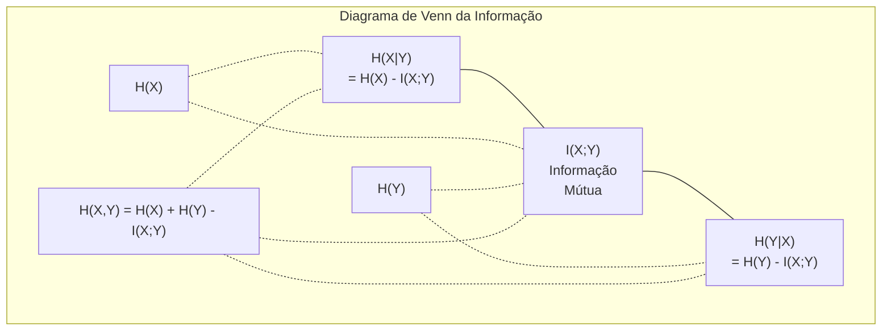

# Teoria da Informação

> Teoria da Informação mede surpresa. Funções de perda são construídas sobre ela.

**Tipo:** Aprender
**Linguagem:** Python
**Pré-requisitos:** Fase 1, Aula 06 (Probabilidade)
**Tempo:** ~60 minutos

## Objetivos de Aprendizado

- Computar entropia, entropia cruzada e divergência KL do zero e explicar sua relação
- Derivar por que minimizar perda de entropia cruzada é equivalente a maximizar verossimilhança logarítmica
- Calcular informação mútua entre features e um alvo pra ranquear importância de features
- Explicar perplexidade como o tamanho efetivo do vocabulário que um modelo de linguagem escolhe

## O Problemo

Você chama `CrossEntropyLoss()` em todo modelo de classificação que treina. Você vê "perplexidade" em todo paper de modelo de linguagem. Você lê sobre divergência KL em VAEs, destilação e RLHF. Esses não são conceitos desconectados. São todos a mesma ideia usando chapéus diferentes.

Teoria da Informação dá o idioma pra raciocinar sobre incerteza, compressão e previsão. Claude Shannon inventou em 1948 pra resolver problemas de comunicação. Turns out, treinar uma rede neural é um problema de comunicação: o modelo está tentando transmitir o rótulo correto através de um canal ruidoso de pesos aprendidos.

Esta aula construiu cada fórmula do zero pra você ver de onde vêm e por que funcionam.

## O Conceito

### Conteúdo de Informação (Surpresa)

Quando algo improvável acontece, carrega mais informação. Uma moeda caindo em cara? Não surpreendente. Ganhar na loteria? Muito surpreendente.

O conteúdo de informação de um evento com probabilidade p é:

```
I(x) = -log(p(x))
```

Usando logaritmo base 2 dá bits. Usando logaritmo natural dá nats. Mesma ideia, unidades diferentes.

```
Evento              Probabilidade    Surpresa (bits)
Cara de moeda justa  0.5            1.0
Dado caindo em 6     0.167          2.58
Evento 1 em 1000     0.001          9.97
Evento certo         1.0            0.0
```

Eventos certos carregam zero informação. Você já sabia que iam acontecer.

### Entropia (Surpresa Média)

Entropia é a surpresa esperada em todos os resultados possíveis de uma distribuição.

```
H(P) = -soma( p(x) * log(p(x)) )  para todo x
```

Uma moeda justa tem entropia máxima pra uma variável binária: 1 bit. Uma moeda enviesada (99% cara) tem entropia baixa: 0.08 bits. Você já sabe o que vai acontecer, então cada lance diz quase nada.

```
Moeda justa:    H = -(0.5 * log2(0.5) + 0.5 * log2(0.5)) = 1.0 bit
Moeda enviesada: H = -(0.99 * log2(0.99) + 0.01 * log2(0.01)) = 0.08 bits
```

Entropia mede a incerteza irredutível em uma distribuição. Você não pode comprimir abaixo dela.

### Entropia Cruzada (A Função de Perda que Você Usa Todo Dia)

Entropia cruzada mede a surpresa média quando você usa a distribuição Q pra codificar eventos que realmente vêm da distribuição P.

```
H(P, Q) = -soma( p(x) * log(q(x)) )  para todo x
```

P é a distribuição verdadeira (os rótulos). Q são as previsões do seu modelo. Se Q combina perfeitamente com P, entropia cruzada é igual a entropia. Qualquer discrepância a torna maior.

Em classificação, P é um vetor one-hot (a classe verdadeira tem probabilidade 1, tudo o mais 0). Isso simplifica a entropia cruzada pra:

```
H(P, Q) = -log(q(classe_verdadeira))
```

Essa é a fórmula inteira de perda de entropia cruzada pra classificação. Maximize a probabilidade prevista da classe correta.

### Divergência KL (Distância Entre Distribuições)

Divergência KL mede quanta surpresa extra você ganha usando Q em vez de P.

```
D_KL(P || Q) = soma( p(x) * log(p(x) / q(x)) )  para todo x
             = H(P, Q) - H(P)
```

Entropia cruzada é entropia mais divergência KL. Já que a entropia da distribuição verdadeira é constante durante o treino, minimizar entropia cruzada é o mesmo que minimizar divergência KL. Você está empurrando a distribuição do modelo pra perto da distribuição verdadeira.

Divergência KL não é simétrica: D_KL(P || Q) != D_KL(Q || P). Não é uma métrica de distância verdadeira.

### Informação Mútua

Informação mútua mede quanto saber uma variável diz sobre outra.

```
I(X; Y) = H(X) - H(X|Y)
        = H(X) + H(Y) - H(X, Y)
```

Se X e Y são independentes, informação mútua é zero. Saber um não diz nada sobre o outro. Se são perfeitamente correlacionadas, informação mútua é igual à entropia de qualquer variável.

Na seleção de features, alta informação mútua entre uma funcionalidade e o alvo significa que a funcionalidade é útil. Baixa informação mútua significa ruído.

### Entropia Condicional

H(Y|X) mede quanta incerteza resta sobre Y depois que você observa X.

```
H(Y|X) = H(X,Y) - H(X)
```

Dois extremos:
- Se X completamente determina Y, então H(Y|X) = 0. Saber X elimina toda incerteza sobre Y. Exemplo: X = temperatura em Celsius, Y = temperatura em Fahrenheit.
- Se X não diz nada sobre Y, então H(Y|X) = H(Y). Saber X não reduz sua incerteza. Exemplo: X = lance de moeda, Y = clima de amanhã.

Entropia condicional é sempre não-negativa e nunca excede H(Y):

```
0 <= H(Y|X) <= H(Y)
```

Em machine learning, entropia condicional aparece em árvores de decisão. A cada divisão, o algoritmo escolhe a funcionalidade X que minimiza H(Y|X) — a funcionalidade que mais remove incerteza do rótulo Y.

### Entropia Conjunta

H(X,Y) é a entropia da distribuição conjunta de X e Y juntos.

```
H(X,Y) = -soma soma p(x,y) * log(p(x,y))   para todo x, y
```

Propriedade principal:

```
H(X,Y) <= H(X) + H(Y)
```

Igualdade vale quando X e Y são independentes. Se compartilham informação, a entropia conjunta é menor que a soma das entropias individuais. A entropia "faltante" é exatamente a informação mútua.



As relações:
- H(X,Y) = H(X) + H(Y|X) = H(Y) + H(X|Y)
- I(X;Y) = H(X) - H(X|Y) = H(Y) - H(Y|X)
- H(X,Y) = H(X) + H(Y) - I(X;Y)

### Informação Mútua (Aprofundamento)

Informação mútua I(X;Y) quantifica quanto saber uma variável reduz incerteza sobre a outra.

```
I(X;Y) = H(X) - H(X|Y)
       = H(Y) - H(Y|X)
       = H(X) + H(Y) - H(X,Y)
       = soma soma p(x,y) * log(p(x,y) / (p(x) * p(y)))
```

Propriedades:
- I(X;Y) >= 0 sempre. Você nunca perde informação ao observar algo.
- I(X;Y) = 0 se e somente se X e Y são independentes.
- I(X;Y) = I(Y;X). É simétrica, ao contrário da divergência KL.
- I(X;X) = H(X). Uma variável compartilha toda sua informação consigo mesma.

**Informação mútua pra seleção de features.** No ML, você quer features que são informativas sobre o alvo. Informação mútua dá uma maneira fundamentada pra ranquear features:

1. Para cada funcionalidade X_i, compute I(X_i; Y) onde Y é a variável alvo.
2. Ranqueie features pela pontuação de IM.
3. Mantenha as top k features.

Isso funciona pra qualquer relação entre funcionalidade e alvo — linear, não-linear, monótona ou não. Correlação só pega relações lineares. IM pega tudo.

| Método | Detecta | Custo computacional | Lida com categórica? |
|--------|---------|-------------------|---------------------|
| Correlação de Pearson | Relações lineares | O(n) | Não |
| Correlação de Spearman | Relações monótonas | O(n log n) | Não |
| Informação mútua | Qualquer dependência estatística | O(n log n) com binning | Sim |

### Suavização de Rótulos e Entropia Cruzada

Classificação padrão usa rótulos duros: [0, 0, 1, 0]. A classe verdadeira ganha probabilidade 1, tudo o mais ganha 0. Suavização de rótulos substitui por rótulos suaves:

```
rótulo_suave = (1 - epsilon) * rótulo_duro + epsilon / num_classes
```

Com epsilon = 0.1 e 4 classes:
- Rótulo duro:  [0, 0, 1, 0]
- Rótulo suave: [0.025, 0.025, 0.925, 0.025]

Sob a perespecificaçãotiva da teoria da informação, suavização de rótulos aumenta a entropia da distribuição alvo. Rótulos duros one-hot têm entropia 0 — não há incerteza. Rótulos suaves têm entropia positiva.

Por que isso ajuda:
- Impede que o modelo envie logits pra valores extremos (logits infinitos seriam necessários pra combinar perfeitamente um alvo one-hot sob entropia cruzada)
- Funciona como regularização: o modelo não pode ter 100% de confiança
- Melhora calibração: probabilidades previstas refletem melhor a incerteza verdadeira
- Reduz a lacuna entre comportamento de treino e inferência

A perda de entropia cruzada com suavização de rótulos vira:

```
L = (1 - epsilon) * CE(rótulo_duro, predição) + epsilon * H_uniforme(predição)
```

O segundo termo penaliza previsões distantes da uniforme — uma regularização direta sobre confiança.

### Por que Entropia Cruzada É A Perda de Classificação

Três perespecificaçãotivas, mesma conclusão.

**Visão da teoria da informação.** Entropia cruzada mede quantos bits você desperdiça usando a distribuição do seu modelo em vez da verdadeira. Minimizá-la torna seu modelo o codificador mais eficiente da realidade.

**Visão de máxima verossimilhança.** Para N amostras de treino com classes verdadeiras y_i:

```
Verossimilhança     = produto( q(y_i) )
Log-verossimilhança = soma( log(q(y_i)) )
Verossimilhança negativa = -soma( log(q(y_i)) )
```

A última linha é a perda de entropia cruzada. Minimizar entropia cruzada = maximizar a verossimilhança dos dados de treino sob seu modelo.

**Visão do gradiente.** O gradiente da entropia cruzada em relação aos logits é simplesmente (previsto - verdadeiro). Limpo, estável e rápido de computar. É por isso que combina perfeitamente com softmax.

### Bits vs Nats

A única diferença é a base do logaritmo.

```
logaritmo base 2   -> bits      (tradição de teoria da informação)
logaritmo base e   -> nats      (convenção de machine learning)
logaritmo base 10  -> hartleys  (raramente usado)
```

1 nat = 1/ln(2) bits = 1.4427 bits. PyTorch e TensorFlow usam logaritmo natural (nats) por padrão.

### Perplexidade

Perplexidade é o exponencial da entropia cruzada. Diz o número efetivo de escolhas igualmente prováveis entre as quais o modelo está indeciso.

```
Perplexidade = 2^H(P,Q)   (se usando bits)
Perplexidade = e^H(P,Q)   (se usando nats)
```

Um modelo de linguagem com perplexidade 50 é, em média, tão confuso quanto se tivesse que escolher uniformemente entre 50 próximos tokens possíveis. Menor é melhor.

GPT-2 alcançou perplexidade ~30 em benchmarks comuns. Modelos modernos estão em dígitos simples para domínios bem representados.

## Construa

### Passo 1: Conteúdo de informação e entropia

```python
import math

def information_content(p, base=2):
    if p <= 0 or p > 1:
        return float('inf') if p <= 0 else 0.0
    return -math.log(p) / math.log(base)

def entropy(probs, base=2):
    return sum(
        p * information_content(p, base)
        for p in probs if p > 0
    )

fair_coin = [0.5, 0.5]
biased_coin = [0.99, 0.01]
fair_die = [1/6] * 6

print(f"Entropia moeda justa:   {entropy(fair_coin):.4f} bits")
print(f"Entropia moeda enviesada: {entropy(biased_coin):.4f} bits")
print(f"Entropia dado justo:    {entropy(fair_die):.4f} bits")
```

### Passo 2: Entropia cruzada e divergência KL

```python
def cross_entropy(p, q, base=2):
    total = 0.0
    for pi, qi in zip(p, q):
        if pi > 0:
            if qi <= 0:
                return float('inf')
            total += pi * (-math.log(qi) / math.log(base))
    return total

def kl_divergence(p, q, base=2):
    return cross_entropy(p, q, base) - entropy(p, base)

true_dist = [0.7, 0.2, 0.1]
good_model = [0.6, 0.25, 0.15]
bad_model = [0.1, 0.1, 0.8]

print(f"Entropia da dist verdadeira:     {entropy(true_dist):.4f} bits")
print(f"CE (bom modelo):          {cross_entropy(true_dist, good_model):.4f} bits")
print(f"CE (mau modelo):           {cross_entropy(true_dist, bad_model):.4f} bits")
print(f"Divergência KL (bom):     {kl_divergence(true_dist, good_model):.4f} bits")
print(f"Divergência KL (mau):      {kl_divergence(true_dist, bad_model):.4f} bits")
```

### Passo 3: Entropia cruzada como perda de classificação

```python
def softmax(logits):
    max_logit = max(logits)
    exps = [math.exp(z - max_logit) for z in logits]
    total = sum(exps)
    return [e / total for e in exps]

def cross_entropy_loss(true_class, logits):
    probs = softmax(logits)
    return -math.log(probs[true_class])

logits = [2.0, 1.0, 0.1]
true_class = 0

probs = softmax(logits)
loss = cross_entropy_loss(true_class, logits)

print(f"Logits:      {logits}")
print(f"Softmax:     {[f'{p:.4f}' for p in probs]}")
print(f"Classe verdadeira:  {true_class}")
print(f"Perda:        {loss:.4f} nats")
print(f"Perplexidade:  {math.exp(loss):.2f}")
```

### Passo 4: Entropia cruzada iguala verossimilhança negativa

```python
import random

random.seed(42)

n_samples = 1000
n_classes = 3
true_rótulos = [random.randint(0, n_classes - 1) for _ in range(n_samples)]
model_logits = [[random.gauss(0, 1) for _ in range(n_classes)] for _ in range(n_samples)]

ce_loss = sum(
    cross_entropy_loss(label, logits)
    for label, logits in zip(true_rótulos, model_logits)
) / n_samples

nll = -sum(
    math.log(softmax(logits)[label])
    for label, logits in zip(true_rótulos, model_logits)
) / n_samples

print(f"Perda de entropia cruzada:      {ce_loss:.6f}")
print(f"Verossimilhança negativa: {nll:.6f}")
print(f"Diferença:              {abs(ce_loss - nll):.2e}")
```

### Passo 5: Informação mútua

```python
def mutual_information(joint_probs, base=2):
    rows = len(joint_probs)
    cols = len(joint_probs[0])

    margin_x = [sum(joint_probs[i][j] for j in range(cols)) for i in range(rows)]
    margin_y = [sum(joint_probs[i][j] for i in range(rows)) for j in range(cols)]

    mi = 0.0
    for i in range(rows):
        for j in range(cols):
            pxy = joint_probs[i][j]
            if pxy > 0:
                mi += pxy * math.log(pxy / (margin_x[i] * margin_y[j])) / math.log(base)
    return mi

independent = [[0.25, 0.25], [0.25, 0.25]]
dependent = [[0.45, 0.05], [0.05, 0.45]]

print(f"IM (independente): {mutual_information(independent):.4f} bits")
print(f"IM (dependente):   {mutual_information(dependent):.4f} bits")
```

## Use

Os mesmos conceitos usando NumPy, como você vai usá-los na prática:

```python
import numpy as np

def np_entropy(p):
    p = np.asarray(p, dtype=float)
    mask = p > 0
    result = np.zeros_like(p)
    result[mask] = p[mask] * np.log(p[mask])
    return -result.sum()

def np_cross_entropy(p, q):
    p, q = np.asarray(p, dtype=float), np.asarray(q, dtype=float)
    mask = p > 0
    return -(p[mask] * np.log(q[mask])).sum()

def np_kl_divergence(p, q):
    return np_cross_entropy(p, q) - np_entropy(p)

true = np.array([0.7, 0.2, 0.1])
pred = np.array([0.6, 0.25, 0.15])
print(f"Entropia:    {np_entropy(true):.4f} nats")
print(f"CE:          {np_cross_entropy(true, pred):.4f} nats")
print(f"KL div:      {np_kl_divergence(true, pred):.4f} nats")
```

Você construiu do zero o que `torch.nn.CrossEntropyLoss()` faz internamente. Agora você sabe por que a perda desce durante o treino: a distribuição prevista do seu modelo está ficando mais perto da verdadeira, medida em nats de informação desperdiçada.

## Exercícios

1. Compute a entropia do alfabeto inglês assumindo distribuição uniforme (26 letras). Depois estime com frequências reais de letras. Qual é maior e por quê?

2. Um modelo produz logits [5.0, 2.0, 0.5] para uma amostra com classe verdadeira 1. Compute a perda de entropia cruzada à mão, depois verifique com sua função `cross_entropy_loss`. Que logits dariam perda zero?

3. Mostre que divergência KL não é simétrica. Escolha duas distribuições P e Q e compute D_KL(P || Q) e D_KL(Q || P). Explique por que são diferentes.

4. Construa uma função que compute perplexidade para uma sequência de previsões de tokens. Dada uma lista de pares (índice_token_verdadeiro, logits_previstos), retorne a perplexidade da sequência.

## Termos Chave

| Termo | O que dizem | O que realmente significa |
|------|----------------|----------------------|
| Conteúdo de informação | "Surpresa" | O número de bits (ou nats) necessários pra codificar um evento: -log(p) |
| Entropia | "Aleatoriedade" | A surpresa média em todos os resultados de uma distribuição. Mede incerteza irredutível. |
| Entropia cruzada | "A função de perda" | Surpresa média ao usar a distribuição do modelo Q pra codificar eventos da verdadeira P. |
| Divergência KL | "Distância entre distribuições" | Bits extras desperdiçados usando Q em vez de P. Igual a entropia cruzada menos entropia. Não é simétrica. |
| Informação mútua | "Quão relacionados são X e Y" | Redução em incerteza sobre X ao saber Y. Zero significa independentes. |
| Softmax | "Transformar logits em probabilidades" | Exponenciar e normalizar. Mapeia qualquer vetor real pra uma distribuição de probabilidade válida. |
| Perplexidade | "Quão confuso o modelo está" | Exponencial da entropia cruzada. O tamanho efetivo do vocabulário que o modelo escolhe a cada passo. |
| Bits | "Unidade de Shannon" | Informação medida com logaritmo base 2. Um bit resolve um lance de moeda justa. |
| Nats | "Unidade do ML" | Informação medida com logaritmo natural. Usado por PyTorch e TensorFlow por padrão. |
| Verossimilhança negativa | "Perda NLL" | Idêntica à perda de entropia cruzada pra rótulos one-hot. Minimizá-la maximiza a probabilidade de previsões corretas. |

## Leitura Complementar

- [Shannon 1948: Uma Teoria Matemática da Comunicação](https://people.math.harvard.edu/~ctm/home/text/others/shannon/entropy/entropy.pdf) — o paper original, ainda legível
- [Teoria da Informação Visual (Chris Olah)](https://colah.github.io/posts/2015-09-Visual-Information/) — melhor explicação visual de entropia e divergência KL
- [Documentação CrossEntropyLoss do PyTorch](https://pytorch.org/docs/stable/generated/torch.nn.CrossEntropyLoss.html) — como a framework implementa o que você acabou de construir
