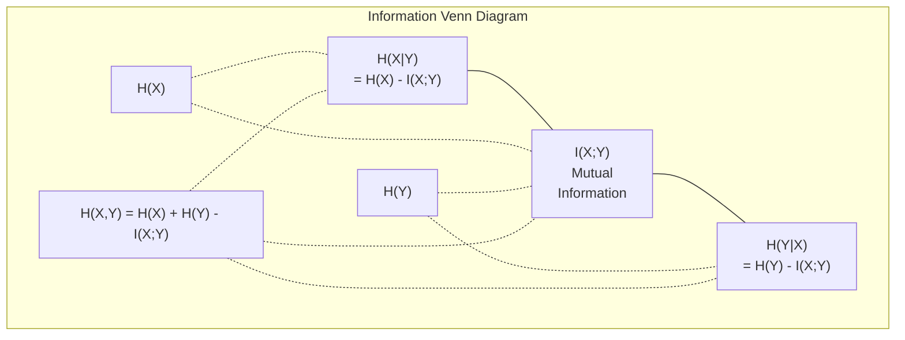

# Bilgi Teorisi

> Bilgi teorisi sürprizi ölçer. Loss function'ler bunun üzerine inşa edilmiştir.

**Tür:** Öğren
**Dil:** Python
**Önkoşullar:** Aşama 1, Ders 06 (Olasılık)
**Süre:** ~60 dakika

## Öğrenme Hedefleri

- Entropi, çapraz entropi ve KL sapmasını sıfırdan hesaplayın ve ilişkilerini açıklayın
- Çapraz entropi kaybını en aza indirmenin neden log olasılığını en üst düzeye çıkarmaya eşdeğer olduğunu öğrenin
- Özellikler arasındaki karşılıklı bilgileri hesaplayın ve özelliğin önemini sıralamak için bir hedef
- Şaşkınlığı, bir dil modelinin seçtiği etkili sözcük dağarcığı boyutu olarak açıklayın

## Sorun

Eğittiğiniz her sınıflandırma modelinde `CrossEntropyLoss()`'yi çağırırsınız. Her dil modeli makalesinde "şaşkınlık" görüyorsunuz. VAE'lerde, damıtmada ve RLHF'de KL farklılığını okudunuz. Bunlar birbirinden kopuk kavramlar değil. Hepsi aynı fikirde, farklı şapkalar takıyorlar.

Bilgi teorisi size belirsizlik, sıkıştırma ve tahmin hakkında akıl yürütme dili sağlar. Claude Shannon bunu 1948'de iletişim sorunlarını çözmek için icat etti. Bir neural network'nin eğitiminin bir iletişim sorunu olduğu ortaya çıktı: model, öğrenilen ağırlıkların gürültülü bir kanalı aracılığıyla doğru etiketi iletmeye çalışıyor.

Bu ders her formülü sıfırdan oluşturur, böylece bunların nereden geldiğini ve neden işe yaradığını görebilirsiniz.

## Konsept

### Bilgi İçeriği (Sürpriz)

Beklenmedik bir şey olduğunda daha fazla bilgi taşır. Bir bozuk para iniş tura mı? Şaşırtıcı değil. Piyango kazancı mı? Çok şaşırtıcı.

Olasılık p olan bir olayın bilgi içeriği:

```
I(x) = -log(p(x))
```

Günlük tabanı 2'yi kullanmak size bitler verir. Doğal log kullanmak size nats verir. Aynı fikir, farklı birimler.

```
Event              Probability    Surprise (bits)
Fair coin heads    0.5            1.0
Rolling a 6        0.167          2.58
1-in-1000 event    0.001          9.97
Certain event      1.0            0.0
```

Bazı olaylar sıfır bilgi taşır. Bunların olacağını zaten biliyordun.

### Entropi (Ortalama Sürpriz)

Entropi, bir dağılımın tüm olası sonuçlarında beklenen sürprizdir.

```
H(P) = -sum( p(x) * log(p(x)) )  for all x
```

Adil bir madalyonun ikili değişken için maksimum entropisi vardır: 1 bit. Önyargılı bir madeni para (%99 tura) düşük entropiye sahiptir: 0,08 bit. Ne olacağını zaten biliyorsun, dolayısıyla her çevirme sana neredeyse hiçbir şey anlatmıyor.

```
Fair coin:    H = -(0.5 * log2(0.5) + 0.5 * log2(0.5)) = 1.0 bit
Biased coin:  H = -(0.99 * log2(0.99) + 0.01 * log2(0.01)) = 0.08 bits
```

Entropi bir dağılımdaki indirgenemez belirsizliği ölçer. Altına sıkıştıramazsınız.

### Çapraz Entropi (Her Gün Kullandığınız Loss Function)

Çapraz entropi, aslında P dağıtımından gelen olayları kodlamak için Q dağılımını kullandığınızda ortalama sürprizi ölçer.

```
H(P, Q) = -sum( p(x) * log(q(x)) )  for all x
```

P gerçek dağılımdır (etiketler). Q, modelinizin tahminleridir. Eğer Q, P ile mükemmel bir şekilde eşleşiyorsa, çapraz entropi entropiye eşittir. Herhangi bir uyumsuzluk onu daha da büyütür.

Sınıflandırmada, P bir sıcak vektördür (gerçek sınıfın olasılığı 1, geri kalan her şey 0'dır). Bu, çapraz entropiyi şu şekilde basitleştirir:

```
H(P, Q) = -log(q(true_class))
```

Sınıflandırmaya yönelik tüm çapraz entropi kaybı formülü budur. Doğru sınıfın tahmin edilen olasılığını maksimuma çıkarın.

### KL Diverjansı (Dağıtımlar Arasındaki Mesafe)

KL sapması, P yerine Q kullandığınızda ne kadar ekstra sürpriz elde ettiğinizi ölçer.

```
D_KL(P || Q) = sum( p(x) * log(p(x) / q(x)) )  for all x
             = H(P, Q) - H(P)
```

Çapraz entropi, entropi artı KL sapmasıdır. Gerçek dağılımın entropisi eğitim sırasında sabit olduğundan, çapraz entropiyi en aza indirmek KL sapmasını en aza indirmekle aynıdır. Modelinizin dağılımını gerçek dağılıma doğru zorluyorsunuz.

KL ıraksaması simetrik değildir: D_KL(P || Q) != D_KL(Q || P). Bu gerçek bir mesafe ölçüsü değildir.

### Karşılıklı Bilgi

Karşılıklı bilgi, bir değişkeni bilmenin size diğeri hakkında ne kadar bilgi verdiğini ölçer.

```
I(X; Y) = H(X) - H(X|Y)
        = H(X) + H(Y) - H(X, Y)
```

X ve Y bağımsızsa karşılıklı bilgi sıfırdır. Birini bilmek diğeri hakkında hiçbir şey söylemez. Eğer bunlar mükemmel bir korelasyona sahipse, karşılıklı bilgi her iki değişkenin entropisine eşittir.

Özellik seçiminde, bir özellik ile hedef arasındaki karşılıklı bilginin yüksek olması, özelliğin faydalı olduğu anlamına gelir. Karşılıklı bilginin düşük olması gürültü olduğu anlamına gelir.

### Koşullu Entropi

H(Y|X), X'i gözlemledikten sonra Y hakkında ne kadar belirsizlik kaldığını ölçer.

```
H(Y|X) = H(X,Y) - H(X)
```

İki aşırı uç:
- Eğer X, Y'yi tamamen belirliyorsa, H(Y|X) = 0 olur. X'i bilmek, Y hakkındaki tüm belirsizliği ortadan kaldırır. Örnek: X = Celsius cinsinden sıcaklık, Y = Fahrenheit cinsinden sıcaklık.
- Eğer X size Y hakkında hiçbir şey söylemiyorsa, o zaman H(Y|X) = H(Y) olur. X'i bilmek belirsizliğinizi hiçbir şekilde azaltmaz. Örnek: X = yazı tura atma, Y = yarının hava durumu.

Koşullu entropi her zaman negatif değildir ve hiçbir zaman H(Y)'yi aşmaz:

```
0 <= H(Y|X) <= H(Y)
```

machine learning'de karar ağaçlarında koşullu entropi görünür. Her bölmede algoritma, H(Y|X)'i en aza indiren X özelliğini, yani Y etiketi hakkındaki belirsizliği en fazla ortadan kaldıran özelliği seçer.

### Ortak Entropi

H(X,Y), X ve Y'nin ortak dağılımının entropisidir.

```
H(X,Y) = -sum sum p(x,y) * log(p(x,y))   for all x, y
```

Anahtar özellik:

```
H(X,Y) <= H(X) + H(Y)
```

Eşitlik X ve Y bağımsız olduğunda geçerlidir. Bilgiyi paylaşırlarsa ortak entropi bireysel entropilerin toplamından daha az olur. "Eksik" entropi tam olarak karşılıklı bilgidir.



İlişkiler:
- H(X,Y) = H(X) + H(Y|X) = H(Y) + H(X|Y)
- I(X;Y) = H(X) - H(X|Y) = H(Y) - H(Y|X)
- H(X,Y) = H(X) + H(Y) - I(X;Y)

### Karşılıklı Bilgi (Derin İnceleme)

Karşılıklı bilgi I(X;Y), bir değişkeni bilmenin diğeri hakkındaki belirsizliği ne kadar azalttığını ölçer.

```
I(X;Y) = H(X) - H(X|Y)
       = H(Y) - H(Y|X)
       = H(X) + H(Y) - H(X,Y)
       = sum sum p(x,y) * log(p(x,y) / (p(x) * p(y)))
```

Özellikler:
- I(X;Y) >= 0 her zaman. Bir şeyi gözlemleyerek asla bilgi kaybetmezsiniz.
- I(X;Y) = 0 ancak ve ancak X ve Y bağımsızsa.
- I(X;Y) = I(Y;X). KL ıraksamasından farklı olarak simetriktir.
- I(X;X) = H(X). Bir değişken tüm bilgisini kendisiyle paylaşır.

**Özellik seçimi için karşılıklı bilgi.** ML'de hedef hakkında bilgilendirici özellikler istersiniz. Karşılıklı bilgi size özellikleri sıralamak için ilkeli bir yol sunar:

1. Her X_i özelliği için I(X_i; Y)'yi hesaplayın; burada Y, hedef değişkendir.
2. Özellikleri MI puanına göre sıralayın.
3. En iyi özellikleri koruyun.

Bu, özellik ile hedef arasındaki (doğrusal, doğrusal olmayan, monoton veya olmayan) her türlü ilişki için işe yarar. Korelasyon yalnızca doğrusal ilişkileri yakalar. MI her şeyi yakalar.

| Yöntem | algılar | Hesaplamalı maliyet | Kategorik olarak mı ele alınır? |
|--------|---------|-------------------|---------------------|
| Pearson korelasyonu | Doğrusal ilişkiler | O(n) | Hayır |
| Spearman korelasyonu | Monoton ilişkiler | O(n log n) | Hayır |
| Karşılıklı bilgi | Herhangi bir istatistiksel bağımlılık | O(n log n) gruplama ile | Evet |

### Etiket Düzeltme ve Çapraz Entropi

Standart sınıflandırmada zor hedefler kullanılır: [0, 0, 1, 0]. Gerçek sınıf olasılık 1 alır, diğer her şey 0 alır. Etiket yumuşatma bunların yerine yumuşak hedefler koyar:

```
soft_target = (1 - epsilon) * hard_target + epsilon / num_classes
```

Epsilon = 0,1 ve 4 sınıf ile:
- Zor hedef: [0, 0, 1, 0]
- Geçici hedef: [0,025, 0,025, 0,925, 0,025]

Bilgi teorisi açısından bakıldığında, etiket yumuşatma hedef dağılımın entropisini artırır. Sert tek sıcak hedeflerin entropisi 0'dır; belirsizlik yoktur. Yumuşak hedeflerin pozitif entropisi vardır.

Bu neden yardımcı olur:
- Modelin logitleri aşırı değerlere çıkarmasını önler (çapraz entropi altında tek sıcak bir hedefi mükemmel şekilde eşleştirmek için sonsuz logitlere ihtiyaç duyulur)
- Düzenleme görevi görür: model %100 emin olamaz
- Kalibrasyonu iyileştirir: tahmin edilen olasılıklar gerçek belirsizliği daha iyi yansıtır
- Eğitim ile inference davranışı arasındaki boşluğu azaltır

Etiket yumuşatmayla çapraz entropi kaybı şu şekilde olur:

```
L = (1 - epsilon) * CE(hard_target, prediction) + epsilon * H_uniform(prediction)
```

İkinci dönem, tek tip olmaktan uzak tahminleri cezalandırıyor; güven konusunda doğrudan bir düzenleme.

### Neden Çapraz Entropi Sınıflandırma Kaybıdır

Üç bakış açısı, aynı sonuç.

**Bilgi teorisi görünümü.** Çapraz entropi, gerçek dağılım yerine modelinizin dağılımını kullanarak ne kadar bit israf ettiğinizi ölçer. Bunu en aza indirmek, modelinizi gerçekliğin en verimli kodlayıcısı haline getirir.

**Maksimum olabilirlik görünümü.** Gerçek y_i sınıflarına sahip N eğitim örneği için:

```
Likelihood     = product( q(y_i) )
Log-likelihood = sum( log(q(y_i)) )
Negative log-likelihood = -sum( log(q(y_i)) )
```

Bu son çizgi çapraz entropi kaybıdır. Çapraz entropiyi en aza indirmek = modeliniz altındaki eğitim verilerinin olasılığını en üst düzeye çıkarmak.

**Gradient görünümü.** Logitlere göre çapraz entropinin gradient'si basitçe (tahmin edilen - doğru). Temiz, istikrarlı ve hesaplaması hızlı. Bu nedenle softmax ile mükemmel bir şekilde eşleşir.

### Bitler ve Nats

Tek fark log tabanıdır.

```
log base 2   -> bits      (information theory tradition)
log base e   -> nats      (machine learning convention)
log base 10  -> hartleys  (rarely used)
```

1 nat = 1/ln(2) bit = 1,4427 bit. PyTorch ve TensorFlow varsayılan olarak doğal günlüğü (nats) kullanır.

### Şaşkınlık

Şaşkınlık çapraz entropinin üstel değeridir. Bu size modelin aralarında belirsiz olduğu eşit olasılıklı seçeneklerin etkili sayısını söyler.

```
Perplexity = 2^H(P,Q)   (if using bits)
Perplexity = e^H(P,Q)   (if using nats)
```

Şaşkınlığı 50 olan bir dil modeli, ortalama olarak, sanki sonraki 50 olası token arasından tekdüze bir şekilde seçim yapmak zorundaymış gibi kafa karıştırıcıdır. Daha düşük olması daha iyidir.

GPT-2, ortak benchmark'lerde ~30 kafa karışıklığına ulaştı. İyi temsil edilen alanlarda modern modeller tek haneli rakamlardadır.

```figure
entropy-kl
```

## İnşa Et

### Adım 1: Bilgi içeriği ve entropi

```python
import math

def information_content(p, base=2):
    if p <= 0 or p > 1:
        return float('inf') if p <= 0 else 0.0
    return -math.log(p) / math.log(base)

def entropy(probs, base=2):
    return sum(
        p * information_content(p, base)
        for p in probs if p > 0
    )

fair_coin = [0.5, 0.5]
biased_coin = [0.99, 0.01]
fair_die = [1/6] * 6

print(f"Fair coin entropy:   {entropy(fair_coin):.4f} bits")
print(f"Biased coin entropy: {entropy(biased_coin):.4f} bits")
print(f"Fair die entropy:    {entropy(fair_die):.4f} bits")
```

### Adım 2: Çapraz entropi ve KL sapması

```python
def cross_entropy(p, q, base=2):
    total = 0.0
    for pi, qi in zip(p, q):
        if pi > 0:
            if qi <= 0:
                return float('inf')
            total += pi * (-math.log(qi) / math.log(base))
    return total

def kl_divergence(p, q, base=2):
    return cross_entropy(p, q, base) - entropy(p, base)

true_dist = [0.7, 0.2, 0.1]
good_model = [0.6, 0.25, 0.15]
bad_model = [0.1, 0.1, 0.8]

print(f"Entropy of true dist:     {entropy(true_dist):.4f} bits")
print(f"CE (good model):          {cross_entropy(true_dist, good_model):.4f} bits")
print(f"CE (bad model):           {cross_entropy(true_dist, bad_model):.4f} bits")
print(f"KL divergence (good):     {kl_divergence(true_dist, good_model):.4f} bits")
print(f"KL divergence (bad):      {kl_divergence(true_dist, bad_model):.4f} bits")
```

### Adım 3: Sınıflandırma kaybı olarak çapraz entropi

```python
def softmax(logits):
    max_logit = max(logits)
    exps = [math.exp(z - max_logit) for z in logits]
    total = sum(exps)
    return [e / total for e in exps]

def cross_entropy_loss(true_class, logits):
    probs = softmax(logits)
    return -math.log(probs[true_class])

logits = [2.0, 1.0, 0.1]
true_class = 0

probs = softmax(logits)
loss = cross_entropy_loss(true_class, logits)

print(f"Logits:      {logits}")
print(f"Softmax:     {[f'{p:.4f}' for p in probs]}")
print(f"True class:  {true_class}")
print(f"Loss:        {loss:.4f} nats")
print(f"Perplexity:  {math.exp(loss):.2f}")
```

### Adım 4: Çapraz entropi eşittir negatif log-olasılık

```python
import random

random.seed(42)

n_samples = 1000
n_classes = 3
true_labels = [random.randint(0, n_classes - 1) for _ in range(n_samples)]
model_logits = [[random.gauss(0, 1) for _ in range(n_classes)] for _ in range(n_samples)]

ce_loss = sum(
    cross_entropy_loss(label, logits)
    for label, logits in zip(true_labels, model_logits)
) / n_samples

nll = -sum(
    math.log(softmax(logits)[label])
    for label, logits in zip(true_labels, model_logits)
) / n_samples

print(f"Cross-entropy loss:      {ce_loss:.6f}")
print(f"Negative log-likelihood: {nll:.6f}")
print(f"Difference:              {abs(ce_loss - nll):.2e}")
```

### Adım 5: Karşılıklı bilgi

```python
def mutual_information(joint_probs, base=2):
    rows = len(joint_probs)
    cols = len(joint_probs[0])

    margin_x = [sum(joint_probs[i][j] for j in range(cols)) for i in range(rows)]
    margin_y = [sum(joint_probs[i][j] for i in range(rows)) for j in range(cols)]

    mi = 0.0
    for i in range(rows):
        for j in range(cols):
            pxy = joint_probs[i][j]
            if pxy > 0:
                mi += pxy * math.log(pxy / (margin_x[i] * margin_y[j])) / math.log(base)
    return mi

independent = [[0.25, 0.25], [0.25, 0.25]]
dependent = [[0.45, 0.05], [0.05, 0.45]]

print(f"MI (independent): {mutual_information(independent):.4f} bits")
print(f"MI (dependent):   {mutual_information(dependent):.4f} bits")
```

## Kullan onu

NumPy'yi kullanan aynı kavramlar, bunları pratikte kullanma şekliniz:

```python
import numpy as np

def np_entropy(p):
    p = np.asarray(p, dtype=float)
    mask = p > 0
    result = np.zeros_like(p)
    result[mask] = p[mask] * np.log(p[mask])
    return -result.sum()

def np_cross_entropy(p, q):
    p, q = np.asarray(p, dtype=float), np.asarray(q, dtype=float)
    mask = p > 0
    return -(p[mask] * np.log(q[mask])).sum()

def np_kl_divergence(p, q):
    return np_cross_entropy(p, q) - np_entropy(p)

true = np.array([0.7, 0.2, 0.1])
pred = np.array([0.6, 0.25, 0.15])
print(f"Entropy:    {np_entropy(true):.4f} nats")
print(f"Cross-ent:  {np_cross_entropy(true, pred):.4f} nats")
print(f"KL div:     {np_kl_divergence(true, pred):.4f} nats")
```

`torch.nn.CrossEntropyLoss()`'nin dahili olarak yaptıklarını sıfırdan oluşturdunuz. Artık eğitim sırasında kaybın neden azaldığını biliyorsunuz: Modelinizin tahmin edilen dağılımı, boşa harcanan bilgilerin doğasıyla ölçülen gerçek dağılıma yaklaşıyor.

## Egzersizler

1. Düzgün dağılım (26 harf) varsayarak İngiliz alfabesinin entropisini hesaplayın. Daha sonra gerçek harf frekanslarını kullanarak tahmin edin. Hangisi daha yüksek ve neden?

2. Bir model, gerçek sınıf 1'e sahip bir örnek için logitleri [5.0, 2.0, 0.5] çıkarır. Çapraz entropi kaybını elle hesaplayın, ardından `cross_entropy_loss` fonksiyonunuzla doğrulayın. Hangi logitler sıfır kayıp verir?

3. KL diverjansının simetrik olmadığını gösterin. İki P ve Q dağılımı seçin ve D_KL(P || Q) ve D_KL(Q || P)'yi hesaplayın. Neden farklı olduklarını açıklayın.

4. token tahmin dizisinin karmaşıklığını hesaplayan bir fonksiyon oluşturun. (true_token_index, öngörülen_logits) çiftlerinin bir listesi verildiğinde, dizinin karmaşıklığını döndürün.

## Anahtar Terimler

| Dönem | İnsanlar ne diyor | Aslında ne anlama geliyor |
|------|----------------|----------------------|
| Bilgi içeriği | "Sürpriz" | Bir olayı kodlamak için gereken bit (veya nat) sayısı: -log(p) |
| Entropi | "Rastgelelik" | Bir dağılımın tüm sonuçlarındaki ortalama sürpriz. İndirgenemez belirsizliği ölçer. |
| Çapraz entropi | "loss function" | Gerçek dağılım P'den olayları kodlamak için model dağılımı Q kullanıldığında ortalama sürpriz. |
| KL farklılığı | "Dağıtımlar arasındaki mesafe" | P yerine Q kullanılarak ekstra bitler israf edilir. Çapraz entropi eksi entropiye eşittir. Simetrik değil. |
| Karşılıklı bilgi | "X ve Y ne kadar ilişkili" | Y'yi bilmek X hakkındaki belirsizliği azaltır. Sıfır, bağımsız anlamına gelir. |
| Softmax | "Lojitleri olasılıklara dönüştürün" | Üstelleştirme ve normalleştirme. Herhangi bir gerçek değerli vektörü geçerli bir olasılık dağılımına eşler. |
| Şaşkınlık | "Model ne kadar karışık" | Çapraz entropinin üstel değeri. Modelin her adımda seçtiği etkili kelime büyüklüğü. |
| Bitler | "Shannon'ın birimi" | Bilgiler log tabanı 2 ile ölçülür. Bir bit, adil bir yazı tura atmayı çözer. |
| Nats | "ML'nin birimi" | Bilgiler doğal log ile ölçülür. Varsayılan olarak PyTorch ve TensorFlow tarafından kullanılır. |
| Negatif günlük olasılığı | "NLL kaybı" | Tek sıcak etiketler için çapraz entropi kaybıyla aynıdır. Bunu en aza indirmek, doğru tahminlerin olasılığını en üst düzeye çıkarır. |

## Daha Fazla Okuma

- [Shannon 1948: Matematiksel İletişim Teorisi](https://people.math.harvard.edu/~ctm/home/text/others/shannon/entropy/entropy.pdf) - orijinal makale, hala okunabilir durumda
- [Görsel Bilgi Teorisi (Chris Olah)](https://colah.github.io/posts/2015-09-Visual-Information/) - entropi ve KL farklılığının en iyi görsel açıklaması
- [PyTorch CrossEntropyLoss docs](https://pytorch.org/docs/stable/generated/torch.nn.CrossEntropyLoss.html) - framework az önce oluşturduğunuz şeyi nasıl uygular?
