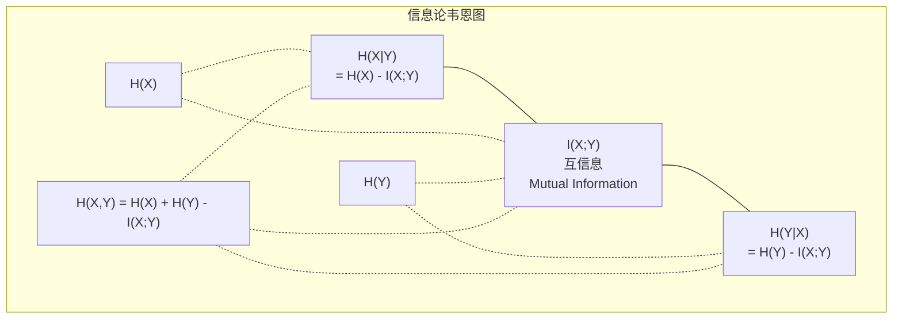

# 信息论（Information Theory）

> 译注：本文译自同目录 [`en.md`](./en.md)。术语遵循仓根 [TRANSLATION_GUIDE.md](../../../../TRANSLATION_GUIDE.md)。

> 信息论度量「意外」。损失函数（loss function）就建立在它之上。

**Type:** Learn
**Language:** Python
**Prerequisites:** Phase 1, Lesson 06 (Probability)
**Time:** ~60 minutes

## 学习目标（Learning Objectives）

- 从零计算 entropy（熵）、cross-entropy（交叉熵）和 KL 散度（KL divergence），并解释三者的关系
- 推导为什么最小化 cross-entropy loss 等价于最大化 log-likelihood（对数似然）
- 计算特征与目标变量之间的 mutual information（互信息），用以排序特征重要性
- 把 perplexity（困惑度）解释成语言模型在多少个候选 token 之间「等概率挑选」

## 问题（The Problem）

每次训练分类模型，你都会调一句 `CrossEntropyLoss()`。每篇语言模型论文里，你都看得到 "perplexity"。在 VAE、distillation（蒸馏）、RLHF 里，你都会读到 KL divergence。这些不是各自独立的概念，而是同一个想法换了不同的帽子。

信息论给你一套语言，去推理不确定性、压缩与预测。Claude Shannon 1948 年发明它，是为了解决通信问题。结果发现，训练神经网络也是个通信问题：模型在试图把正确的标签（label），通过「学到的权重」这条带噪信道传递出去。

这一课会从零搭起每一条公式，让你看清它们从哪儿来、为什么管用。

## 概念（The Concept）

### 信息量 / 意外度（Information Content / Surprise）

不太可能发生的事，一旦发生，就承载更多信息。硬币正面朝上？不意外。中彩票？非常意外。

一个概率为 p 的事件，其信息量为：

```
I(x) = -log(p(x))
```

底数取 2 得到 bits，取自然对数得到 nats。同一个想法，单位不同。

```
Event              Probability    Surprise (bits)
Fair coin heads    0.5            1.0
Rolling a 6        0.167          2.58
1-in-1000 event    0.001          9.97
Certain event      1.0            0.0
```

必然事件携带零信息——你早就知道它会发生。

### 熵（Entropy，平均意外度）

熵是一个分布上所有可能结果的「平均意外度」。

```
H(P) = -sum( p(x) * log(p(x)) )  for all x
```

公平硬币在二元变量上拥有最大熵：1 bit。偏置硬币（99% 正面）熵很低：0.08 bits。你已经知道大概率会发生什么，每一次抛硬币几乎不告诉你新信息。

```
Fair coin:    H = -(0.5 * log2(0.5) + 0.5 * log2(0.5)) = 1.0 bit
Biased coin:  H = -(0.99 * log2(0.99) + 0.01 * log2(0.01)) = 0.08 bits
```

熵度量一个分布中**不可压缩的不确定性**。你不可能压缩到比它更短。

### 交叉熵（Cross-Entropy，你天天用的损失函数）

Cross-entropy 度量的是：当你用分布 Q 去编码实际来自分布 P 的事件时，平均意外度是多少。

```
H(P, Q) = -sum( p(x) * log(q(x)) )  for all x
```

P 是真实分布（标签），Q 是你模型的预测。如果 Q 和 P 完全一致，cross-entropy 就等于 entropy；任何偏差都会让它变大。

在分类任务里，P 是一个 one-hot 向量（真实类的概率为 1，其余全 0）。这把 cross-entropy 简化成：

```
H(P, Q) = -log(q(true_class))
```

这就是分类任务里 cross-entropy loss 的全部公式：最大化模型对正确类别的预测概率。

### KL 散度（KL Divergence，分布之间的「距离」）

KL divergence 度量的是：用 Q 代替 P 后，你额外付出多少「意外度」。

```
D_KL(P || Q) = sum( p(x) * log(p(x) / q(x)) )  for all x
             = H(P, Q) - H(P)
```

Cross-entropy = entropy + KL divergence。训练过程中真实分布的 entropy 是常数，所以**最小化 cross-entropy 等同于最小化 KL divergence**——你在把模型的分布往真实分布上推。

KL divergence 不对称：D_KL(P || Q) ≠ D_KL(Q || P)。它不是真正的距离度量。

### 互信息（Mutual Information）

Mutual information 度量「知道一个变量后，能告诉你多少关于另一个变量的信息」。

```
I(X; Y) = H(X) - H(X|Y)
        = H(X) + H(Y) - H(X, Y)
```

如果 X 和 Y 独立，互信息为零——知道一个对另一个毫无帮助。如果它们完全相关，互信息等于其中任何一个变量的 entropy。

在特征选择里，特征与目标之间高互信息说明该特征有用；低互信息则意味着它是噪声。

### 条件熵（Conditional Entropy）

H(Y|X) 度量「在你观察到 X 之后，关于 Y 还剩下多少不确定性」。

```
H(Y|X) = H(X,Y) - H(X)
```

两个极端：
- 如果 X 完全决定 Y，则 H(Y|X) = 0。知道 X 就消除了关于 Y 的全部不确定性。例如：X = 摄氏温度，Y = 华氏温度。
- 如果 X 对 Y 毫无信息，则 H(Y|X) = H(Y)。知道 X 一点也降低不了你的不确定性。例如：X = 抛硬币，Y = 明天的天气。

条件熵恒非负，且永远不超过 H(Y)：

```
0 <= H(Y|X) <= H(Y)
```

机器学习里，条件熵出现在决策树中。每次分裂时，算法挑出能让 H(Y|X) 最小的特征 X——也就是消除最多关于标签 Y 的不确定性的那个特征。

### 联合熵（Joint Entropy）

H(X,Y) 是 X 与 Y 联合分布的 entropy。

```
H(X,Y) = -sum sum p(x,y) * log(p(x,y))   for all x, y
```

关键性质：

```
H(X,Y) <= H(X) + H(Y)
```

仅当 X 与 Y 独立时取等号。如果它们共享信息，联合熵就比两者之和小，少掉的那一部分就是互信息。



各种关系：
- H(X,Y) = H(X) + H(Y|X) = H(Y) + H(X|Y)
- I(X;Y) = H(X) - H(X|Y) = H(Y) - H(Y|X)
- H(X,Y) = H(X) + H(Y) - I(X;Y)

### 互信息（Mutual Information，深入版）

互信息 I(X;Y) 量化「知道一个变量能让另一个变量的不确定性下降多少」。

```
I(X;Y) = H(X) - H(X|Y)
       = H(Y) - H(Y|X)
       = H(X) + H(Y) - H(X,Y)
       = sum sum p(x,y) * log(p(x,y) / (p(x) * p(y)))
```

性质：
- I(X;Y) >= 0 永远成立。观察一件事永远不会让你失去信息。
- I(X;Y) = 0 当且仅当 X 与 Y 独立。
- I(X;Y) = I(Y;X)。它对称——和 KL divergence 不一样。
- I(X;X) = H(X)。一个变量与自己共享全部信息。

**用互信息做特征选择。** 在 ML 里，你想要那些「对目标有信息量」的特征。互信息提供了一种有原则的方式给特征排序：

1. 对每个特征 X_i，计算它与目标变量 Y 的 I(X_i; Y)。
2. 按 MI 分数排序。
3. 保留前 k 个。

它适用于特征与目标之间的任何关系——线性、非线性、单调或非单调。相关系数只能捕捉线性关系，MI 全都能抓。

| 方法 | 能检测什么 | 计算成本 | 支持类别变量？ |
|--------|---------|-------------------|---------------------|
| Pearson 相关系数 | 线性关系 | O(n) | 否 |
| Spearman 相关系数 | 单调关系 | O(n log n) | 否 |
| 互信息 | 任意统计依赖 | 配合分箱 O(n log n) | 是 |

### 标签平滑与交叉熵（Label Smoothing and Cross-Entropy）

标准分类用硬目标：[0, 0, 1, 0]。真实类得概率 1，其它都为 0。Label smoothing 用软目标替换它们：

```
soft_target = (1 - epsilon) * hard_target + epsilon / num_classes
```

epsilon = 0.1、4 个类时：
- Hard target:  [0, 0, 1, 0]
- Soft target:  [0.025, 0.025, 0.925, 0.025]

从信息论视角看，label smoothing 提高了目标分布的 entropy。one-hot 硬目标 entropy 为 0——毫无不确定性。软目标 entropy 为正。

为什么这样有帮助：
- 防止模型把 logits 推到极端值（在 cross-entropy 下，要完美匹配 one-hot 需要无穷大的 logits）
- 起到正则化作用：模型不会 100% 自信
- 改善校准：预测概率更真实地反映实际不确定性
- 缩小训练时与推理时行为之间的差距

带 label smoothing 的 cross-entropy loss 变为：

```
L = (1 - epsilon) * CE(hard_target, prediction) + epsilon * H_uniform(prediction)
```

第二项惩罚那些「远离均匀分布」的预测——直接对置信度做了正则化。

### 为什么 Cross-Entropy 是分类损失的「正解」

三个视角，同一个结论。

**信息论视角。** Cross-entropy 度量「使用模型分布而非真实分布会浪费多少 bits」。最小化它，就是把你的模型变成对真实最有效率的编码器。

**最大似然视角（Maximum Likelihood）。** 对 N 个真实类别为 y_i 的训练样本：

```
Likelihood     = product( q(y_i) )
Log-likelihood = sum( log(q(y_i)) )
Negative log-likelihood = -sum( log(q(y_i)) )
```

最后一行就是 cross-entropy loss。最小化 cross-entropy ＝ 最大化训练数据在你模型下的似然。

**梯度视角（Gradient）。** Cross-entropy 对 logits 的 gradient 就是简单的 (predicted - true)。干净、稳定、计算快。这正是它能与 softmax 完美配对的原因。

### Bits 与 Nats

唯一的区别就是 log 的底。

```
log base 2   -> bits      (information theory tradition)
log base e   -> nats      (machine learning convention)
log base 10  -> hartleys  (rarely used)
```

1 nat = 1/ln(2) bits = 1.4427 bits。PyTorch 和 TensorFlow 默认使用自然对数（nats）。

### 困惑度（Perplexity）

Perplexity 是 cross-entropy 的指数。它告诉你：模型「在多少个等概率的候选之间犹豫」。

```
Perplexity = 2^H(P,Q)   (if using bits)
Perplexity = e^H(P,Q)   (if using nats)
```

一个 perplexity 为 50 的语言模型，平均而言，相当于在 50 个可能的下一个 token 中均匀挑一个那么困惑。越低越好。

GPT-2 在常见基准上达到 perplexity ~30。现代模型在表征良好的领域里可以做到个位数。

## 动手实现（Build It）

### 第 1 步：信息量与熵

```python
import math

def information_content(p, base=2):
    if p <= 0 or p > 1:
        return float('inf') if p <= 0 else 0.0
    return -math.log(p) / math.log(base)

def entropy(probs, base=2):
    return sum(
        p * information_content(p, base)
        for p in probs if p > 0
    )

fair_coin = [0.5, 0.5]
biased_coin = [0.99, 0.01]
fair_die = [1/6] * 6

print(f"Fair coin entropy:   {entropy(fair_coin):.4f} bits")
print(f"Biased coin entropy: {entropy(biased_coin):.4f} bits")
print(f"Fair die entropy:    {entropy(fair_die):.4f} bits")
```

### 第 2 步：交叉熵与 KL 散度

```python
def cross_entropy(p, q, base=2):
    total = 0.0
    for pi, qi in zip(p, q):
        if pi > 0:
            if qi <= 0:
                return float('inf')
            total += pi * (-math.log(qi) / math.log(base))
    return total

def kl_divergence(p, q, base=2):
    return cross_entropy(p, q, base) - entropy(p, base)

true_dist = [0.7, 0.2, 0.1]
good_model = [0.6, 0.25, 0.15]
bad_model = [0.1, 0.1, 0.8]

print(f"Entropy of true dist:     {entropy(true_dist):.4f} bits")
print(f"CE (good model):          {cross_entropy(true_dist, good_model):.4f} bits")
print(f"CE (bad model):           {cross_entropy(true_dist, bad_model):.4f} bits")
print(f"KL divergence (good):     {kl_divergence(true_dist, good_model):.4f} bits")
print(f"KL divergence (bad):      {kl_divergence(true_dist, bad_model):.4f} bits")
```

### 第 3 步：把 cross-entropy 当作分类损失

```python
def softmax(logits):
    max_logit = max(logits)
    exps = [math.exp(z - max_logit) for z in logits]
    total = sum(exps)
    return [e / total for e in exps]

def cross_entropy_loss(true_class, logits):
    probs = softmax(logits)
    return -math.log(probs[true_class])

logits = [2.0, 1.0, 0.1]
true_class = 0

probs = softmax(logits)
loss = cross_entropy_loss(true_class, logits)

print(f"Logits:      {logits}")
print(f"Softmax:     {[f'{p:.4f}' for p in probs]}")
print(f"True class:  {true_class}")
print(f"Loss:        {loss:.4f} nats")
print(f"Perplexity:  {math.exp(loss):.2f}")
```

### 第 4 步：cross-entropy 等于负对数似然

```python
import random

random.seed(42)

n_samples = 1000
n_classes = 3
true_labels = [random.randint(0, n_classes - 1) for _ in range(n_samples)]
model_logits = [[random.gauss(0, 1) for _ in range(n_classes)] for _ in range(n_samples)]

ce_loss = sum(
    cross_entropy_loss(label, logits)
    for label, logits in zip(true_labels, model_logits)
) / n_samples

nll = -sum(
    math.log(softmax(logits)[label])
    for label, logits in zip(true_labels, model_logits)
) / n_samples

print(f"Cross-entropy loss:      {ce_loss:.6f}")
print(f"Negative log-likelihood: {nll:.6f}")
print(f"Difference:              {abs(ce_loss - nll):.2e}")
```

### 第 5 步：互信息

```python
def mutual_information(joint_probs, base=2):
    rows = len(joint_probs)
    cols = len(joint_probs[0])

    margin_x = [sum(joint_probs[i][j] for j in range(cols)) for i in range(rows)]
    margin_y = [sum(joint_probs[i][j] for i in range(rows)) for j in range(cols)]

    mi = 0.0
    for i in range(rows):
        for j in range(cols):
            pxy = joint_probs[i][j]
            if pxy > 0:
                mi += pxy * math.log(pxy / (margin_x[i] * margin_y[j])) / math.log(base)
    return mi

independent = [[0.25, 0.25], [0.25, 0.25]]
dependent = [[0.45, 0.05], [0.05, 0.45]]

print(f"MI (independent): {mutual_information(independent):.4f} bits")
print(f"MI (dependent):   {mutual_information(dependent):.4f} bits")
```

## 用起来（Use It）

同一套概念，用 NumPy 写——这才是你日常会用的样子：

```python
import numpy as np

def np_entropy(p):
    p = np.asarray(p, dtype=float)
    mask = p > 0
    result = np.zeros_like(p)
    result[mask] = p[mask] * np.log(p[mask])
    return -result.sum()

def np_cross_entropy(p, q):
    p, q = np.asarray(p, dtype=float), np.asarray(q, dtype=float)
    mask = p > 0
    return -(p[mask] * np.log(q[mask])).sum()

def np_kl_divergence(p, q):
    return np_cross_entropy(p, q) - np_entropy(p)

true = np.array([0.7, 0.2, 0.1])
pred = np.array([0.6, 0.25, 0.15])
print(f"Entropy:    {np_entropy(true):.4f} nats")
print(f"Cross-ent:  {np_cross_entropy(true, pred):.4f} nats")
print(f"KL div:     {np_kl_divergence(true, pred):.4f} nats")
```

你刚刚从零搭出了 `torch.nn.CrossEntropyLoss()` 内部做的事情。现在你也明白训练时 loss 为什么在下降：你模型预测的分布在不断向真实分布靠拢，单位是「nats 的浪费信息」。

## 练习（Exercises）

1. 假设英文字母均匀分布（26 个字母），计算其 entropy。然后用真实的字母频率再估一次。哪个更高？为什么？

2. 模型对某个真实类别为 1 的样本输出 logits [5.0, 2.0, 0.5]。手算 cross-entropy loss，再用你写的 `cross_entropy_loss` 函数验证。什么样的 logits 能让 loss 为零？

3. 证明 KL divergence 不对称。任选两个分布 P 与 Q，分别计算 D_KL(P || Q) 与 D_KL(Q || P)，并解释为什么不同。

4. 写一个函数，对一段 token 预测序列计算 perplexity。给定一组 (true_token_index, predicted_logits) 对，返回该序列的 perplexity。

## 关键术语（Key Terms）

| 术语 | 大家怎么说 | 它实际是什么 |
|------|----------------|----------------------|
| Information content（信息量） | "Surprise（意外度）" | 编码一个事件所需的 bits（或 nats）数：-log(p) |
| Entropy（熵） | "随机性" | 一个分布中所有结果的平均意外度。度量不可压缩的不确定性。 |
| Cross-entropy（交叉熵） | "那个损失函数" | 用模型分布 Q 编码来自真实分布 P 的事件时的平均意外度。 |
| KL divergence（KL 散度） | "分布之间的距离" | 用 Q 代替 P 时浪费的额外 bits。等于 cross-entropy 减 entropy。不对称。 |
| Mutual information（互信息） | "X 和 Y 有多相关" | 知道 Y 后关于 X 的不确定性下降了多少。为零意味着独立。 |
| Softmax | "把 logits 变成概率" | 取指数再归一化。把任意实值向量映射成合法的概率分布。 |
| Perplexity（困惑度） | "模型有多迷糊" | cross-entropy 的指数。模型在每一步「相当于在多少个候选里挑」的有效词表大小。 |
| Bits | "Shannon 的单位" | 以 log 底 2 衡量的信息。1 bit 解决 1 次公平抛硬币。 |
| Nats | "ML 的单位" | 以自然对数衡量的信息。PyTorch 和 TensorFlow 默认就用它。 |
| Negative log-likelihood（负对数似然） | "NLL loss" | 在 one-hot 标签下与 cross-entropy loss 完全一致。最小化它就是最大化对正确预测的概率。 |

## 延伸阅读（Further Reading）

- [Shannon 1948: A Mathematical Theory of Communication](https://people.math.harvard.edu/~ctm/home/text/others/shannon/entropy/entropy.pdf) —— 原始论文，至今仍读得动
- [Visual Information Theory (Chris Olah)](https://colah.github.io/posts/2015-09-Visual-Information/) —— 对 entropy 与 KL divergence 最好的可视化讲解
- [PyTorch CrossEntropyLoss docs](https://pytorch.org/docs/stable/generated/torch.nn.CrossEntropyLoss.html) —— 框架是怎么实现你刚刚搭好的东西的
