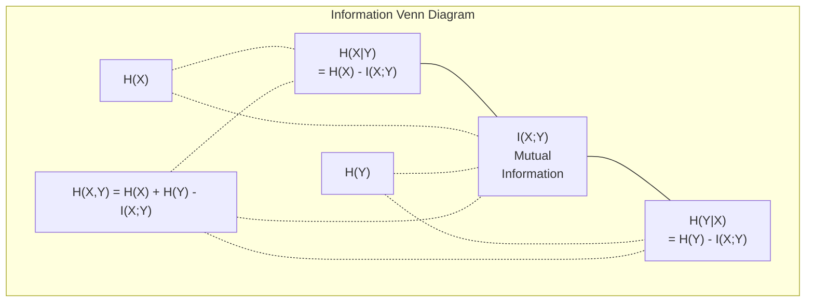

# Information Theory

> 信息论衡量惊喜。损失函数就是建立在它之上的。

**Type:** Learn
**Language:** Python
**Prerequisites:** Phase 1, Lesson 06 (Probability)
**Time:** ~60 minutes

## Learning Objectives

- 从头开始计算信息量、交叉信息量和KL偏差并解释它们的关系
- 推导出为什么最小化交叉熵损失相当于最大化log似然性
- Calculate mutual information between features and a target to rank feature importance
- 将困惑解释为语言模型选择的有效词汇量

## The Problem

您在训练的每个分类模型中都调用“CrossEntropyLoss（）”。你在每张语言模型论文中都会看到“困惑”。您读到了VAE、蒸馏和RL HF中的KL分歧。这些并不是相互关联的概念。他们戴着不同的帽子，想法都是一样的。

信息论为您提供了推理不确定性、压缩和预测的语言。克劳德·香农（Claude Shannon）于1948年发明了它来解决沟通问题。事实证明，训练神经网络是一个通信问题：该模型试图通过学习权重的有噪通道传输正确的标签。

本课从头开始构建每个公式，以便您了解它们来自哪里以及它们为何起作用。

## The Concept

### Information Content (Surprise)

When something unlikely happens, it carries more information. A coin landing heads? Not surprising. A lottery win? Very surprising.

概率为p的事件的信息内容为：

```
I(x) = -log(p(x))
```

使用以2为底的对数可以得到位。使用自然日志给你nats。同样的想法，不同的单位。

```
Event              Probability    Surprise (bits)
Fair coin heads    0.5            1.0
Rolling a 6        0.167          2.58
1-in-1000 event    0.001          9.97
Certain event      1.0            0.0
```

Certain events carry zero information. You already knew they would happen.

### Entropy (Average Surprise)

熵是分布所有可能结果的预期惊喜。

```
H(P) = -sum( p(x) * log(p(x)) )  for all x
```

公平硬币对于二进制变量具有最大的熵：1位。有偏见的硬币（99%的正面）具有较低的熵：0.08位。您已经知道会发生什么，所以每次翻转几乎什么也不会告诉您。

```
Fair coin:    H = -(0.5 * log2(0.5) + 0.5 * log2(0.5)) = 1.0 bit
Biased coin:  H = -(0.99 * log2(0.99) + 0.01 * log2(0.01)) = 0.08 bits
```

Entropy measures the irreducible uncertainty in a distribution. You cannot compress below it.

### Cross-Entropy (The Loss Function You Use Every Day)

当您使用分布Q对实际来自分布P的事件进行编码时，交叉熵测量平均惊喜。

```
H(P, Q) = -sum( p(x) * log(q(x)) )  for all x
```

P是真实分布（标签）。Q是模型的预测。如果Q与P完全匹配，则交叉信息量等于信息量。任何不匹配都会使其更大。

在分类中，P是一个独热的载体（真实类别的概率为1，其他所有概率为0）。这将交叉信息简化为：

```
H(P, Q) = -log(q(true_class))
```

这就是整个分类的交叉熵损失公式。最大化正确类别的预测概率。

### KL Divergence (Distance Between Distributions)

KL差异衡量您使用Q而不是P获得多少额外惊喜。

```
D_KL(P || Q) = sum( p(x) * log(p(x) / q(x)) )  for all x
             = H(P, Q) - H(P)
```

交叉信息是信息量加KL偏差。由于真实分布的信息在训练期间是恒定的，因此最小化交叉信息与最小化KL分歧是一样的。您正在将模型的分布推向真实分布。

KL背离不对称：D_KL（P|| Q）！= D_KL（Q|| P）。它不是真正的距离指标。

### Mutual Information

Mutual information measures how much knowing one variable tells you about another.

```
I(X; Y) = H(X) - H(X|Y)
        = H(X) + H(Y) - H(X, Y)
```

如果X和Y独立，则互信息为零。了解其中一个并不能告诉你关于另一个的任何信息。如果它们完全相关，则互信息等于任何一个变量的熵。

在特征选择中，特征和目标之间的高互信息意味着该特征是有用的。低互信息意味着它是噪音。

### Conditional Entropy

H(Y|X) measures how much uncertainty remains about Y after you observe X.

```
H(Y|X) = H(X,Y) - H(X)
```

两个极端：
- 如果X完全决定Y，那么H（Y| X）= 0。了解X消除了有关Y的所有不确定性。示例：X =温度（摄氏度），Y =温度（华氏度）。
- 如果X没有告诉您有关Y的任何信息，那么H（Y| X）= H（Y）。了解X根本不会减少您的不确定性。示例：X =抛硬币，Y =明天的天气。

条件熵总是非负的，永远不会超过H（Y）：

```
0 <= H(Y|X) <= H(Y)
```

在机器学习中，条件熵出现在决策树中。在每次拆分时，算法都会选择最小化H（Y）的特征X| X）--消除标签Y最不确定性的功能。

### Joint Entropy

H（X，Y）是X和Y共同分布的熵。

```
H(X,Y) = -sum sum p(x,y) * log(p(x,y))   for all x, y
```

关键属性：

```
H(X,Y) <= H(X) + H(Y)
```

当X和Y独立时，平等成立。如果它们共享信息，联合信息就会小于个体信息的总和。“缺失”的信息正是互信息。



关系：
- H(X,Y) = H(X) + H(Y|X) = H(Y) + H(X|Y)
- I(X;Y) = H(X) - H(X|Y) = H(Y) - H(Y|X)
- H（X，Y）= H（X）+ H（Y）- I（X;Y）

### Mutual Information (Deep Dive)

互信息I（X;Y）量化了了解一个变量在多大程度上减少了另一个变量的不确定性。

```
I(X;Y) = H(X) - H(X|Y)
       = H(Y) - H(Y|X)
       = H(X) + H(Y) - H(X,Y)
       = sum sum p(x,y) * log(p(x,y) / (p(x) * p(y)))
```

属性：
- I（X;Y）始终>= 0。你永远不会因为观察某件事而丢失信息。
- I(X;Y) = 0 if and only if X and Y are independent.
- I(X;Y) = I(Y;X). It is symmetric, unlike KL divergence.
- I(X;X) = H(X). A variable shares all its information with itself.

** 特征选择互信息。**在ML中，您需要提供有关目标的信息的特征。互信息为您提供了一种原则性的特征排名方法：

1. 对于每个特征X_i，计算I（X_i; Y），其中Y是目标变量。
2. Rank features by MI score.
3. 保留顶级k功能。

这适用于特征和目标之间的任何关系--线性、非线性、单调或非线性。相关性只能捕捉线性关系。MI捕捉到一切。

| Method | 检测 | 计算成本 | 处理分类？ |
|--------|---------|-------------------|---------------------|
| Pearson相关 | 线性关系 | O（n） | No |
| Spearman相关 | 单调的关系 | O(n log n) | 没有 |
| 互信息 | 任何统计依赖性 | O(n log n) with binning | 是的 |

### Label Smoothing and Cross-Entropy

标准分类使用硬目标：[0，0，1，0]。真实类的概率为1，其他所有的概率为0。标签平滑用软目标取代这些：

```
soft_target = (1 - epsilon) * hard_target + epsilon / num_classes
```

With epsilon = 0.1 and 4 classes:
- 硬目标：[0，0，1，0]
- 软目标：[0.025，0.025，0.925，0.025]

From an information theory perspective, label smoothing increases the entropy of the target distribution. Hard one-hot targets have entropy 0 -- there is no uncertainty. Soft targets have positive entropy.

为什么这有帮助：
- 防止模型将logit驱动到极端值（需要无限个logit才能完美匹配交叉信息下的一热目标）
- Acts as regularization: the model cannot be 100% confident
- 改进校准：预测概率更好地反映真实的不确定性
- 缩小训练和推理行为之间的差距

The cross-entropy loss with label smoothing becomes:

```
L = (1 - epsilon) * CE(hard_target, prediction) + epsilon * H_uniform(prediction)
```

第二项惩罚远离统一的预测--一种直接的置信度正则化。

### Why Cross-Entropy Is THE Classification Loss

三个角度，相同的结论。

**Information theory view.** Cross-entropy measures how many bits you waste by using your model's distribution instead of the true distribution. Minimizing it makes your model the most efficient encoder of reality.

** 最大可能性视图。**对于具有真实类别y_i的N个训练样本：

```
Likelihood     = product( q(y_i) )
Log-likelihood = sum( log(q(y_i)) )
Negative log-likelihood = -sum( log(q(y_i)) )
```

最后一条线是交叉熵损失。最大限度地减少交叉信息=最大限度地增加模型下训练数据的可能性。

**Gradient view.** The gradient of cross-entropy with respect to the logits is simply (predicted - true). Clean, stable, and fast to compute. This is why it pairs perfectly with softmax.

### Bits vs Nats

The only difference is the log base.

```
log base 2   -> bits      (information theory tradition)
log base e   -> nats      (machine learning convention)
log base 10  -> hartleys  (rarely used)
```

1 nat = 1/lnn（2）位= 1.4427位。PyTorch和TensorFlow默认使用自然日志（nats）。

### Perplexity

困惑是交叉信息的指数。它告诉您模型之间不确定的同等可能选择的有效数量。

```
Perplexity = 2^H(P,Q)   (if using bits)
Perplexity = e^H(P,Q)   (if using nats)
```

平均而言，困惑度为50的语言模型会感到困惑，就好像它必须从50个可能的下一个符号中均匀地选择一样。低越好。

GPT-2在常见基准上达到了~30的困惑度。对于具有良好代表性的领域，现代模型为个位数。

## Build It

### Step 1: Information content and entropy

```python
import math

def information_content(p, base=2):
    if p <= 0 or p > 1:
        return float('inf') if p <= 0 else 0.0
    return -math.log(p) / math.log(base)

def entropy(probs, base=2):
    return sum(
        p * information_content(p, base)
        for p in probs if p > 0
    )

fair_coin = [0.5, 0.5]
biased_coin = [0.99, 0.01]
fair_die = [1/6] * 6

print(f"Fair coin entropy:   {entropy(fair_coin):.4f} bits")
print(f"Biased coin entropy: {entropy(biased_coin):.4f} bits")
print(f"Fair die entropy:    {entropy(fair_die):.4f} bits")
```

### Step 2: Cross-entropy and KL divergence

```python
def cross_entropy(p, q, base=2):
    total = 0.0
    for pi, qi in zip(p, q):
        if pi > 0:
            if qi <= 0:
                return float('inf')
            total += pi * (-math.log(qi) / math.log(base))
    return total

def kl_divergence(p, q, base=2):
    return cross_entropy(p, q, base) - entropy(p, base)

true_dist = [0.7, 0.2, 0.1]
good_model = [0.6, 0.25, 0.15]
bad_model = [0.1, 0.1, 0.8]

print(f"Entropy of true dist:     {entropy(true_dist):.4f} bits")
print(f"CE (good model):          {cross_entropy(true_dist, good_model):.4f} bits")
print(f"CE (bad model):           {cross_entropy(true_dist, bad_model):.4f} bits")
print(f"KL divergence (good):     {kl_divergence(true_dist, good_model):.4f} bits")
print(f"KL divergence (bad):      {kl_divergence(true_dist, bad_model):.4f} bits")
```

### Step 3: Cross-entropy as classification loss

```python
def softmax(logits):
    max_logit = max(logits)
    exps = [math.exp(z - max_logit) for z in logits]
    total = sum(exps)
    return [e / total for e in exps]

def cross_entropy_loss(true_class, logits):
    probs = softmax(logits)
    return -math.log(probs[true_class])

logits = [2.0, 1.0, 0.1]
true_class = 0

probs = softmax(logits)
loss = cross_entropy_loss(true_class, logits)

print(f"Logits:      {logits}")
print(f"Softmax:     {[f'{p:.4f}' for p in probs]}")
print(f"True class:  {true_class}")
print(f"Loss:        {loss:.4f} nats")
print(f"Perplexity:  {math.exp(loss):.2f}")
```

### Step 4: Cross-entropy equals negative log-likelihood

```python
import random

random.seed(42)

n_samples = 1000
n_classes = 3
true_labels = [random.randint(0, n_classes - 1) for _ in range(n_samples)]
model_logits = [[random.gauss(0, 1) for _ in range(n_classes)] for _ in range(n_samples)]

ce_loss = sum(
    cross_entropy_loss(label, logits)
    for label, logits in zip(true_labels, model_logits)
) / n_samples

nll = -sum(
    math.log(softmax(logits)[label])
    for label, logits in zip(true_labels, model_logits)
) / n_samples

print(f"Cross-entropy loss:      {ce_loss:.6f}")
print(f"Negative log-likelihood: {nll:.6f}")
print(f"Difference:              {abs(ce_loss - nll):.2e}")
```

### Step 5: Mutual information

```python
def mutual_information(joint_probs, base=2):
    rows = len(joint_probs)
    cols = len(joint_probs[0])

    margin_x = [sum(joint_probs[i][j] for j in range(cols)) for i in range(rows)]
    margin_y = [sum(joint_probs[i][j] for i in range(rows)) for j in range(cols)]

    mi = 0.0
    for i in range(rows):
        for j in range(cols):
            pxy = joint_probs[i][j]
            if pxy > 0:
                mi += pxy * math.log(pxy / (margin_x[i] * margin_y[j])) / math.log(base)
    return mi

independent = [[0.25, 0.25], [0.25, 0.25]]
dependent = [[0.45, 0.05], [0.05, 0.45]]

print(f"MI (independent): {mutual_information(independent):.4f} bits")
print(f"MI (dependent):   {mutual_information(dependent):.4f} bits")
```

## Use It

使用NumPy的相同概念，以及您在实践中使用它们的方式：

```python
import numpy as np

def np_entropy(p):
    p = np.asarray(p, dtype=float)
    mask = p > 0
    result = np.zeros_like(p)
    result[mask] = p[mask] * np.log(p[mask])
    return -result.sum()

def np_cross_entropy(p, q):
    p, q = np.asarray(p, dtype=float), np.asarray(q, dtype=float)
    mask = p > 0
    return -(p[mask] * np.log(q[mask])).sum()

def np_kl_divergence(p, q):
    return np_cross_entropy(p, q) - np_entropy(p)

true = np.array([0.7, 0.2, 0.1])
pred = np.array([0.6, 0.25, 0.15])
print(f"Entropy:    {np_entropy(true):.4f} nats")
print(f"Cross-ent:  {np_cross_entropy(true, pred):.4f} nats")
print(f"KL div:     {np_kl_divergence(true, pred):.4f} nats")
```

您从头开始构建了`torch.nn.CrossEntropyLoss（）`在内部执行的操作。现在你知道为什么在训练过程中损失会下降了：你的模型的预测分布越来越接近真实分布，以浪费的信息量来衡量。

## Exercises

1. 假设均匀分布（26个字母），计算英语字母表的熵。然后使用实际的字母频率来估计它。哪个更高？为什么？

2. 模型为真正类别1的样本输出logits [5.0，2.0，0.5]。手工计算交叉熵损失，然后使用“cross_entropy_loss”函数进行验证。哪些Logits可以实现零损失？

3. 表明KL分歧不对称。选择两个分布P和Q并计算D_KL（P|| Q）和D_KL（Q|| P）。解释为什么它们不同。

4. 构建一个函数，计算代币预测序列的困惑度。给定（true_token_index，predicted_logits）对列表，返回序列的困惑性。

## Key Terms

| Term | 别人怎么说 | 它实际上意味着什么 |
|------|----------------|----------------------|
| 信息内容 | “惊喜” | The number of bits (or nats) needed to encode an event: -log(p) |
| Entropy | “随机性” | 分布的所有结果的平均惊喜。测量不可约的不确定性。 |
| Cross-entropy | “损失功能” | 使用模型分布Q对真实分布P中的事件进行编码时的平均惊喜。 |
| KL divergence | “分布之间的距离” | 使用Q而不是P浪费了额外的比特。等于交叉信息量减去信息量。不对称。 |
| 互信息 | “X和Y有多相关” | 由于了解Y而减少X的不确定性。零意味着独立。 |
| Softmax | "Turn logits into probabilities" | Exponentiate and normalize. Maps any real-valued vector to a valid probability distribution. |
| 困惑 | “这个模型有多混乱” | Exponential of cross-entropy. The effective vocabulary size the model is choosing from at each step. |
| 比特 | “香农的部队” | Information measured with log base 2. One bit resolves one fair coin flip. |
| Nats | “ML的单位” | 用自然日志测量的信息。默认由PyTorch和TensorFlow使用。 |
| Negative log-likelihood | “NLL损失” | 与一热标签的交叉熵损失相同。最小化它可以最大限度地提高正确预测的可能性。 |

## Further Reading

- [Shannon 1948: A Mathematical Theory of Communication](https://people.math.harvard.edu/~ctm/home/text/others/shannon/entropy/entropy.pdf) - the original paper, still readable
- [视觉信息理论（Chris Olah）]（https：//colah.github.io/posts/2015-09-Visual-Information/）-对信息和KL分歧的最佳视觉解释
- [PyTorch CrossEntropyLoss文档]（https：//pytorch.org/docs/stable/generated/torch.nn.CrossEntropyLoss.html）-框架如何实现您刚刚构建的内容
