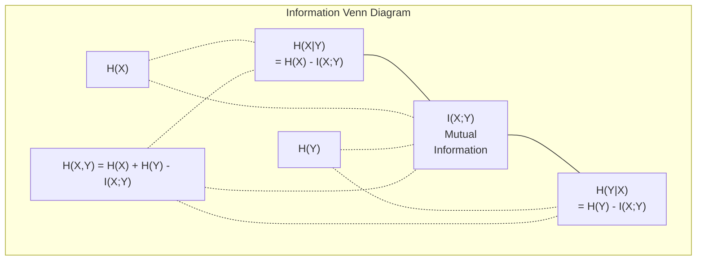

# 09 · 信息论

> 信息论度量「惊讶程度」。损失函数正是建立在它之上的。

**类型：** 学习
**语言：** Python
**前置：** 阶段 1，第 06 课（概率）
**时长：** 约 60 分钟

## 学习目标

- 从零计算「熵（entropy）」、「交叉熵（cross-entropy）」和「KL 散度（KL divergence）」，并解释三者之间的关系
- 推导为什么最小化交叉熵损失等价于最大化对数似然
- 计算特征与目标之间的「互信息（mutual information）」，用于对特征重要性排序
- 把「困惑度（perplexity）」解释为语言模型在每一步实际从中挑选的有效词表规模

## 问题所在

你训练的每一个分类模型里都会调用 `CrossEntropyLoss()`。你在每一篇语言模型论文里都会看到 "perplexity"（困惑度）。你在「变分自编码器（VAE）」、知识蒸馏和「人类反馈强化学习（RLHF）」中都会读到 KL 散度。这些并不是互不相干的概念，它们其实是同一个思想戴着不同的帽子。

信息论给了你一套语言，用来推理不确定性、压缩与预测。克劳德·香农（Claude Shannon）在 1948 年发明它，是为了解决通信问题。事实证明，训练一个神经网络也是一个通信问题：模型试图把正确的标签，透过一条由学到的权重构成的、充满噪声的信道传输出去。

本课从零构建每一个公式，让你看清它们的来历，以及它们为什么有效。

## 核心概念

### 信息量（惊讶程度）

当一件不太可能发生的事真的发生了，它就携带了更多的信息。硬币落地正面朝上？不意外。中了彩票？非常意外。

一个概率为 p 的事件，其信息量为：

```
I(x) = -log(p(x))
```

以 2 为底取对数，得到的单位是「比特（bits）」。以自然对数（e 为底）取对数，得到的单位是「奈特（nats）」。思想相同，只是单位不同。

```
事件               概率           惊讶程度（比特）
公平硬币正面       0.5            1.0
掷出 6 点          0.167          2.58
千分之一事件       0.001          9.97
必然事件           1.0            0.0
```

必然事件携带的信息为零。你早就知道它们会发生。

### 熵（平均惊讶程度）

熵是一个分布所有可能结果上惊讶程度的期望值。

```
H(P) = -sum( p(x) * log(p(x)) )  对所有 x 求和
```

对于二元变量，公平硬币具有最大的熵：1 比特。偏置硬币（99% 正面）的熵很低：0.08 比特。你已经知道会发生什么，所以每一次抛掷几乎没告诉你任何新信息。

```
公平硬币：    H = -(0.5 * log2(0.5) + 0.5 * log2(0.5)) = 1.0 比特
偏置硬币：    H = -(0.99 * log2(0.99) + 0.01 * log2(0.01)) = 0.08 比特
```

熵度量一个分布中不可消除的不确定性。你无法把它压缩到熵以下。

### 交叉熵（你每天都在用的损失函数）

交叉熵度量的是：当你用分布 Q 来编码实际来自分布 P 的事件时，平均的惊讶程度。

```
H(P, Q) = -sum( p(x) * log(q(x)) )  对所有 x 求和
```

P 是真实分布（标签），Q 是你的模型的预测。如果 Q 与 P 完全吻合，交叉熵就等于熵。任何不吻合都会让它变大。

在分类任务中，P 是一个独热（one-hot）向量（真实类别的概率为 1，其余全为 0）。这把交叉熵简化为：

```
H(P, Q) = -log(q(true_class))
```

这就是分类任务交叉熵损失的全部公式。也就是让正确类别的预测概率最大化。

### KL 散度（分布之间的「距离」）

KL 散度度量的是：用 Q 代替 P 会让你额外多承受多少惊讶程度。

```
D_KL(P || Q) = sum( p(x) * log(p(x) / q(x)) )  对所有 x 求和
             = H(P, Q) - H(P)
```

交叉熵等于熵加上 KL 散度。由于真实分布的熵在训练过程中是个常数，所以最小化交叉熵等同于最小化 KL 散度。你正是在把模型的分布推向真实分布。

KL 散度不是对称的：D_KL(P || Q) != D_KL(Q || P)。它并不是一个真正的距离度量。

### 互信息

互信息度量的是：知道一个变量能告诉你多少关于另一个变量的信息。

```
I(X; Y) = H(X) - H(X|Y)
        = H(X) + H(Y) - H(X, Y)
```

如果 X 与 Y 相互独立，互信息为零。知道其中一个，对另一个一无所知。如果二者完全相关，互信息就等于任一变量的熵。

在特征选择中，特征与目标之间的高互信息意味着该特征是有用的。低互信息意味着它只是噪声。

### 条件熵

H(Y|X) 度量的是：在观测到 X 之后，关于 Y 还剩多少不确定性。

```
H(Y|X) = H(X,Y) - H(X)
```

两个极端情形：
- 如果 X 完全决定了 Y，那么 H(Y|X) = 0。知道 X 就消除了关于 Y 的所有不确定性。例如：X = 摄氏温度，Y = 华氏温度。
- 如果 X 对 Y 一无所告，那么 H(Y|X) = H(Y)。知道 X 完全不会减少你的不确定性。例如：X = 抛硬币结果，Y = 明天的天气。

条件熵始终非负，且永远不超过 H(Y)：

```
0 <= H(Y|X) <= H(Y)
```

在机器学习中，条件熵出现在决策树里。在每一次划分时，算法会挑选使 H(Y|X) 最小的特征 X——也就是最能消除标签 Y 的不确定性的那个特征。

### 联合熵

H(X,Y) 是 X 与 Y 共同构成的联合分布的熵。

```
H(X,Y) = -sum sum p(x,y) * log(p(x,y))   对所有 x, y 求和
```

关键性质：

```
H(X,Y) <= H(X) + H(Y)
```

当 X 与 Y 相互独立时取等号。如果它们共享信息，联合熵就小于各自熵之和。这「缺失」的那部分熵，恰好就是互信息。

〔图：信息论的维恩图——展示 H(X)、H(Y)、互信息 I(X;Y) 及条件熵 H(X|Y)、H(Y|X) 与联合熵 H(X,Y) 之间的关系〕



这些关系为：
- H(X,Y) = H(X) + H(Y|X) = H(Y) + H(X|Y)
- I(X;Y) = H(X) - H(X|Y) = H(Y) - H(Y|X)
- H(X,Y) = H(X) + H(Y) - I(X;Y)

### 互信息（深入剖析）

互信息 I(X;Y) 量化的是：知道一个变量能减少多少关于另一个变量的不确定性。

```
I(X;Y) = H(X) - H(X|Y)
       = H(Y) - H(Y|X)
       = H(X) + H(Y) - H(X,Y)
       = sum sum p(x,y) * log(p(x,y) / (p(x) * p(y)))
```

性质：
- I(X;Y) >= 0 永远成立。观测某样东西绝不会让你损失信息。
- I(X;Y) = 0 当且仅当 X 与 Y 相互独立。
- I(X;Y) = I(Y;X)。它是对称的，这与 KL 散度不同。
- I(X;X) = H(X)。一个变量与自身共享其全部信息。

**用互信息做特征选择。** 在机器学习中，你希望选出对目标有信息量的特征。互信息为特征排序提供了一种有原则的方法：

1. 对每个特征 X_i，计算 I(X_i; Y)，其中 Y 是目标变量。
2. 按 MI 分数对特征排序。
3. 保留排名最高的前 k 个特征。

这种方法适用于特征与目标之间的任何关系——线性、非线性、单调与否皆可。相关性只能捕捉线性关系，而互信息能捕捉一切。

| 方法 | 能检测什么 | 计算开销 | 能否处理类别变量？ |
|--------|---------|-------------------|---------------------|
| 皮尔逊相关（Pearson correlation） | 线性关系 | O(n) | 否 |
| 斯皮尔曼相关（Spearman correlation） | 单调关系 | O(n log n) | 否 |
| 互信息（Mutual information） | 任意统计依赖关系 | O(n log n)（需分箱） | 是 |

### 标签平滑与交叉熵

标准分类使用硬目标：[0, 0, 1, 0]。真实类别的概率为 1，其余全为 0。「标签平滑（label smoothing）」用软目标取而代之：

```
soft_target = (1 - epsilon) * hard_target + epsilon / num_classes
```

当 epsilon = 0.1、类别数为 4 时：
- 硬目标：  [0, 0, 1, 0]
- 软目标：  [0.025, 0.025, 0.925, 0.025]

从信息论的角度看，标签平滑提升了目标分布的熵。硬独热目标的熵为 0——没有任何不确定性。软目标则具有正的熵。

它为什么有帮助：
- 防止模型把 logits 推向极端值（在交叉熵下，要完美匹配一个独热目标，需要无穷大的 logits）
- 起到正则化作用：模型不可能 100% 自信
- 改善校准：预测概率更好地反映真实的不确定性
- 缩小训练行为与推理行为之间的差距

带标签平滑的交叉熵损失变为：

```
L = (1 - epsilon) * CE(hard_target, prediction) + epsilon * H_uniform(prediction)
```

第二项会惩罚那些远离均匀分布的预测——这是对置信度的一种直接正则化。

### 为什么交叉熵是「那个」分类损失

三个视角，同一结论。

**信息论视角。** 交叉熵度量的是：用模型的分布代替真实分布会浪费多少比特。把它最小化，会让你的模型成为对现实最高效的编码器。

**最大似然视角。** 对于 N 个训练样本，其真实类别为 y_i：

```
似然           = product( q(y_i) )
对数似然       = sum( log(q(y_i)) )
负对数似然     = -sum( log(q(y_i)) )
```

最后那一行就是交叉熵损失。最小化交叉熵 = 在你的模型下最大化训练数据的似然。

**梯度视角。** 交叉熵对 logits 的梯度就是简单的 (predicted - true)。干净、稳定、计算迅速。这正是它与 softmax 完美搭配的原因。

### 比特与奈特

唯一的区别在于对数的底。

```
以 2 为底   -> 比特（bits）      （信息论传统）
以 e 为底   -> 奈特（nats）      （机器学习惯例）
以 10 为底  -> 哈特利（hartleys）（很少使用）
```

1 奈特 = 1/ln(2) 比特 = 1.4427 比特。PyTorch 和 TensorFlow 默认使用自然对数（奈特）。

### 困惑度

困惑度是交叉熵的指数。它告诉你：模型在多少个等可能的选项之间犹豫不决，即「有效选项数」。

```
Perplexity = 2^H(P,Q)   （若使用比特）
Perplexity = e^H(P,Q)   （若使用奈特）
```

困惑度为 50 的语言模型，平均而言，其困惑程度就好比它必须从 50 个可能的下一个 token 中均匀地挑选。越低越好。

GPT-2 在常见基准上达到约 30 的困惑度。现代模型在表征充分的领域里已能做到个位数。

## 动手构建

### 步骤 1：信息量与熵

```python
import math

def information_content(p, base=2):
    if p <= 0 or p > 1:
        return float('inf') if p <= 0 else 0.0
    return -math.log(p) / math.log(base)

def entropy(probs, base=2):
    return sum(
        p * information_content(p, base)
        for p in probs if p > 0
    )

fair_coin = [0.5, 0.5]
biased_coin = [0.99, 0.01]
fair_die = [1/6] * 6

print(f"Fair coin entropy:   {entropy(fair_coin):.4f} bits")
print(f"Biased coin entropy: {entropy(biased_coin):.4f} bits")
print(f"Fair die entropy:    {entropy(fair_die):.4f} bits")
```

### 步骤 2：交叉熵与 KL 散度

```python
def cross_entropy(p, q, base=2):
    total = 0.0
    for pi, qi in zip(p, q):
        if pi > 0:
            if qi <= 0:
                return float('inf')
            total += pi * (-math.log(qi) / math.log(base))
    return total

def kl_divergence(p, q, base=2):
    return cross_entropy(p, q, base) - entropy(p, base)

true_dist = [0.7, 0.2, 0.1]
good_model = [0.6, 0.25, 0.15]
bad_model = [0.1, 0.1, 0.8]

print(f"Entropy of true dist:     {entropy(true_dist):.4f} bits")
print(f"CE (good model):          {cross_entropy(true_dist, good_model):.4f} bits")
print(f"CE (bad model):           {cross_entropy(true_dist, bad_model):.4f} bits")
print(f"KL divergence (good):     {kl_divergence(true_dist, good_model):.4f} bits")
print(f"KL divergence (bad):      {kl_divergence(true_dist, bad_model):.4f} bits")
```

### 步骤 3：把交叉熵作为分类损失

```python
def softmax(logits):
    max_logit = max(logits)
    exps = [math.exp(z - max_logit) for z in logits]
    total = sum(exps)
    return [e / total for e in exps]

def cross_entropy_loss(true_class, logits):
    probs = softmax(logits)
    return -math.log(probs[true_class])

logits = [2.0, 1.0, 0.1]
true_class = 0

probs = softmax(logits)
loss = cross_entropy_loss(true_class, logits)

print(f"Logits:      {logits}")
print(f"Softmax:     {[f'{p:.4f}' for p in probs]}")
print(f"True class:  {true_class}")
print(f"Loss:        {loss:.4f} nats")
print(f"Perplexity:  {math.exp(loss):.2f}")
```

### 步骤 4：交叉熵等于负对数似然

```python
import random

random.seed(42)

n_samples = 1000
n_classes = 3
true_labels = [random.randint(0, n_classes - 1) for _ in range(n_samples)]
model_logits = [[random.gauss(0, 1) for _ in range(n_classes)] for _ in range(n_samples)]

ce_loss = sum(
    cross_entropy_loss(label, logits)
    for label, logits in zip(true_labels, model_logits)
) / n_samples

nll = -sum(
    math.log(softmax(logits)[label])
    for label, logits in zip(true_labels, model_logits)
) / n_samples

print(f"Cross-entropy loss:      {ce_loss:.6f}")
print(f"Negative log-likelihood: {nll:.6f}")
print(f"Difference:              {abs(ce_loss - nll):.2e}")
```

### 步骤 5：互信息

```python
def mutual_information(joint_probs, base=2):
    rows = len(joint_probs)
    cols = len(joint_probs[0])

    margin_x = [sum(joint_probs[i][j] for j in range(cols)) for i in range(rows)]
    margin_y = [sum(joint_probs[i][j] for i in range(rows)) for j in range(cols)]

    mi = 0.0
    for i in range(rows):
        for j in range(cols):
            pxy = joint_probs[i][j]
            if pxy > 0:
                mi += pxy * math.log(pxy / (margin_x[i] * margin_y[j])) / math.log(base)
    return mi

independent = [[0.25, 0.25], [0.25, 0.25]]
dependent = [[0.45, 0.05], [0.05, 0.45]]

print(f"MI (independent): {mutual_information(independent):.4f} bits")
print(f"MI (dependent):   {mutual_information(dependent):.4f} bits")
```

## 实战运用

下面是用 NumPy 实现的同样概念，也就是你在实践中会用到的方式：

```python
import numpy as np

def np_entropy(p):
    p = np.asarray(p, dtype=float)
    mask = p > 0
    result = np.zeros_like(p)
    result[mask] = p[mask] * np.log(p[mask])
    return -result.sum()

def np_cross_entropy(p, q):
    p, q = np.asarray(p, dtype=float), np.asarray(q, dtype=float)
    mask = p > 0
    return -(p[mask] * np.log(q[mask])).sum()

def np_kl_divergence(p, q):
    return np_cross_entropy(p, q) - np_entropy(p)

true = np.array([0.7, 0.2, 0.1])
pred = np.array([0.6, 0.25, 0.15])
print(f"Entropy:    {np_entropy(true):.4f} nats")
print(f"Cross-ent:  {np_cross_entropy(true, pred):.4f} nats")
print(f"KL div:     {np_kl_divergence(true, pred):.4f} nats")
```

你刚刚从零构建了 `torch.nn.CrossEntropyLoss()` 在内部所做的事情。现在你明白了为什么训练时损失会下降：你的模型预测的分布正在逼近真实分布，而这个差距正是以「被浪费的信息的奈特数」来度量的。

## 练习

1. 假设英文字母表服从均匀分布（26 个字母），计算其熵。然后用真实的字母频率来估计它。哪个更高，为什么？

2. 某模型对一个真实类别为 1 的样本输出 logits [5.0, 2.0, 0.5]。先手算其交叉熵损失，再用你的 `cross_entropy_loss` 函数验证。什么样的 logits 会给出零损失？

3. 证明 KL 散度不是对称的。挑选两个分布 P 和 Q，计算 D_KL(P || Q) 和 D_KL(Q || P)，并解释它们为何不同。

4. 构建一个函数，为一串 token 预测计算困惑度。给定一个 (true_token_index, predicted_logits) 对组成的列表，返回整个序列的困惑度。

## 关键术语

| 术语 | 人们怎么说 | 它实际的含义 |
|------|----------------|----------------------|
| 信息量（Information content） | 「惊讶程度」 | 编码一个事件所需的比特（或奈特）数：-log(p) |
| 熵（Entropy） | 「随机性」 | 一个分布所有结果上的平均惊讶程度。度量不可消除的不确定性。 |
| 交叉熵（Cross-entropy） | 「那个损失函数」 | 用模型分布 Q 编码来自真实分布 P 的事件时的平均惊讶程度。 |
| KL 散度（KL divergence） | 「分布之间的距离」 | 用 Q 代替 P 所浪费的额外比特。等于交叉熵减去熵。不对称。 |
| 互信息（Mutual information） | 「X 和 Y 有多相关」 | 知道 Y 后关于 X 的不确定性减少量。为零表示相互独立。 |
| Softmax | 「把 logits 变成概率」 | 取指数再归一化。把任意实值向量映射为一个合法的概率分布。 |
| 困惑度（Perplexity） | 「模型有多困惑」 | 交叉熵的指数。模型在每一步从中挑选的有效词表规模。 |
| 比特（Bits） | 「香农的单位」 | 以 2 为底取对数所度量的信息。一个比特可解决一次公平抛硬币。 |
| 奈特（Nats） | 「机器学习的单位」 | 以自然对数度量的信息。PyTorch 和 TensorFlow 默认使用它。 |
| 负对数似然（Negative log-likelihood） | 「NLL 损失」 | 对于独热标签，与交叉熵损失完全相同。最小化它会最大化正确预测的概率。 |

## 延伸阅读

- [Shannon 1948：通信的数学理论（A Mathematical Theory of Communication）](https://people.math.harvard.edu/~ctm/home/text/others/shannon/entropy/entropy.pdf) —— 原始论文，至今仍可读
- [可视化信息论（Visual Information Theory，Chris Olah）](https://colah.github.io/posts/2015-09-Visual-Information/) —— 关于熵与 KL 散度最好的可视化讲解
- [PyTorch CrossEntropyLoss 文档](https://pytorch.org/docs/stable/generated/torch.nn.CrossEntropyLoss.html) —— 框架如何实现你刚刚构建的内容
