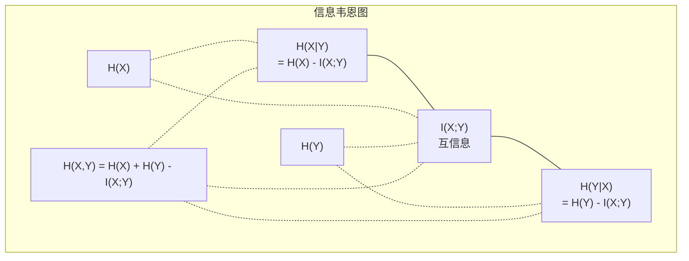

# 信息论

> 信息论衡量惊奇程度。损失函数建立在其基础之上。

**类型:** 学习
**语言:** Python
**前置条件:** 阶段1，第06课（概率论）
**时长:** ~60分钟

## 学习目标

- 从零开始计算熵、交叉熵和KL散度，并解释它们之间的关系
- 推导为什么最小化交叉熵损失等价于最大化对数似然
- 计算特征与目标之间的互信息以对特征重要性进行排序
- 将困惑度解释为语言模型选择的有效词汇表大小

## 问题

你在训练的每个分类模型中都调用了 `CrossEntropyLoss()`。你在每篇语言模型论文中都看到了“困惑度”。你在 VAE、知识蒸馏和 RLHF 中读到了 KL 散度。这些并非互不相关的概念。它们都是同一个想法换上了不同的外衣。

信息论为你提供了推理不确定性、压缩和预测的语言。克劳德·香农在 1948 年发明它来解决通信问题。结果表明，训练神经网络就是一个通信问题：模型试图通过一个由学习权重组成的噪声信道来传输正确的标签。

本课程从零开始构建每一个公式，让你看到它们的来源以及它们为何有效。

## 概念

### 信息量（惊奇程度）

当不太可能的事情发生时，它携带的信息更多。一枚硬币落地是正面？并不令人惊讶。中彩票？非常令人惊讶。

一个概率为 p 的事件的**信息量**是：

```
I(x) = -log(p(x))
```

使用以 2 为底的对数得到比特（bits）。使用自然对数得到纳特（nats）。同一个想法，不同的单位。

```
事件              概率        惊奇程度（比特）
公平硬币正面     0.5         1.0
掷出6            0.167       2.58
千分之一事件     0.001       9.97
必然事件         1.0         0.0
```

必然事件携带零信息量。你早已知道它们会发生。

### 熵（平均惊奇程度）

熵是一个分布中所有可能结果的期望惊奇程度。

```
H(P) = -sum( p(x) * log(p(x)) )  对所有 x
```

对于一个二元变量，公平硬币具有最大熵：1 比特。一个有偏硬币（99% 正面）具有低熵：0.08 比特。你早就知道会发生什么，所以每次抛掷几乎不告诉你任何信息。

```
公平硬币:   H = -(0.5 * log2(0.5) + 0.5 * log2(0.5)) = 1.0 比特
有偏硬币:   H = -(0.99 * log2(0.99) + 0.01 * log2(0.01)) = 0.08 比特
```

熵衡量一个分布中不可约的不确定性。你无法压缩到它以下。

### 交叉熵（你每天都在用的损失函数）

交叉熵衡量当你使用分布 Q 来编码实际来自分布 P 的事件时的平均惊奇程度。

```
H(P, Q) = -sum( p(x) * log(q(x)) )  对所有 x
```

P 是真实分布（标签）。Q 是你的模型的预测。如果 Q 与 P 完美匹配，交叉熵等于熵。任何不匹配都会使其变大。

在分类中，P 是一个 one-hot 向量（真实类别的概率为 1，其他所有为 0）。这使交叉熵简化为：

```
H(P, Q) = -log(q(true_class))
```

这就是分类的整个交叉熵损失公式。最大化正确类别的预测概率。

### KL 散度（分布之间的距离）

KL 散度衡量使用 Q 代替 P 所导致的额外惊奇程度。

```
D_KL(P || Q) = sum( p(x) * log(p(x) / q(x)) )  对所有 x
             = H(P, Q) - H(P)
```

交叉熵是熵加上 KL 散度。由于真实分布的熵在训练期间是常数，最小化交叉熵等同于最小化 KL 散度。你正在将你的模型分布推向真实分布。

KL 散度不满足对称性：D_KL(P || Q) != D_KL(Q || P)。它不是一个真正的距离度量。

### 互信息

互信息衡量知道一个变量能告诉你另一个变量多少信息。

```
I(X; Y) = H(X) - H(X|Y)
        = H(X) + H(Y) - H(X, Y)
```

如果 X 和 Y 独立，互信息为零。知道一个变量对另一个变量毫无所知。如果它们完全相关，互信息等于任一变量的熵。

在特征选择中，特征与目标之间的高互信息意味着该特征有用。低互信息意味着它是噪声。

### 条件熵

H(Y|X) 衡量在观察到 X 之后，关于 Y 还剩下多少不确定性。

```
H(Y|X) = H(X,Y) - H(X)
```

两个极端：
- 如果 X 完全决定了 Y，那么 H(Y|X) = 0。知道 X 消除了关于 Y 的所有不确定性。示例：X = 摄氏温度，Y = 华氏温度。
- 如果 X 对 Y 毫无所知，那么 H(Y|X) = H(Y)。知道 X 完全没有减少你的不确定性。示例：X = 抛硬币，Y = 明天的天气。

条件熵总是非负且永远不会超过 H(Y)：

```
0 <= H(Y|X) <= H(Y)
```

在机器学习中，条件熵出现在决策树中。在每个分裂点，算法选择最小化 H(Y|X) 的特征 X——即消除关于标签 Y 最大不确定性的特征。

### 联合熵

H(X,Y) 是 X 和 Y 联合分布的熵。

```
H(X,Y) = -sum sum p(x,y) * log(p(x,y))   对所有 x, y
```

关键性质：

```
H(X,Y) <= H(X) + H(Y)
```

当 X 和 Y 独立时等号成立。如果它们共享信息，联合熵小于单个熵之和。“缺失”的熵正是互信息。



关系：
- H(X,Y) = H(X) + H(Y|X) = H(Y) + H(X|Y)
- I(X;Y) = H(X) - H(X|Y) = H(Y) - H(Y|X)
- H(X,Y) = H(X) + H(Y) - I(X;Y)

### 互信息（深入探讨）

互信息 I(X;Y) 量化知道一个变量能在多大程度上减少关于另一个变量的不确定性。

```
I(X;Y) = H(X) - H(X|Y)
       = H(Y) - H(Y|X)
       = H(X) + H(Y) - H(X,Y)
       = sum sum p(x,y) * log(p(x,y) / (p(x) * p(y)))
```

性质：
- I(X;Y) >= 0 始终成立。观察某事物永远不会损失信息。
- I(X;Y) = 0 当且仅当 X 和 Y 独立。
- I(X;Y) = I(Y;X)。它是对称的，与 KL 散度不同。
- I(X;X) = H(X)。一个变量与自身共享其所有信息。

**用于特征选择的互信息。** 在机器学习中，你希望特征对目标具有信息量。互信息为你提供了一种有原则的方式来对特征进行排序：

1. 对每个特征 X_i，计算 I(X_i; Y)，其中 Y 是目标变量。
2. 按 MI 分数对特征排序。
3. 保留前 k 个特征。

这适用于特征与目标之间的任何关系——线性、非线性、单调或非单调。相关性只捕捉线性关系。MI 捕捉所有关系。

| 方法 | 检测 | 计算成本 | 处理分类变量？ |
|--------|---------|-------------------|---------------------|
| 皮尔逊相关系数 | 线性关系 | O(n) | 否 |
| 斯皮尔曼相关系数 | 单调关系 | O(n log n) | 否 |
| 互信息 | 任何统计依赖 | O(n log n) 需分箱 | 是 |

### 标签平滑与交叉熵

标准分类使用硬目标：[0, 0, 1, 0]。真实类别概率为 1，其他所有为 0。标签平滑将其替换为软目标：

```
soft_target = (1 - epsilon) * hard_target + epsilon / num_classes
```

epsilon = 0.1 且 4 个类别时：
- 硬目标：  [0, 0, 1, 0]
- 软目标：  [0.025, 0.025, 0.925, 0.025]

从信息论的角度来看，标签平滑增加了目标分布的熵。硬 one-hot 目标的熵为 0——没有不确定性。软目标具有正熵。

为什么这有帮助：
- 防止模型将 logits 驱动到极端值（需要无限 logits 才能在交叉熵下完美匹配 one-hot 目标）
- 充当正则化：模型不能 100% 确定
- 改善校准：预测概率更好地反映真实不确定性
- 减少训练与推理行为之间的差距

带标签平滑的交叉熵损失变为：

```
L = (1 - epsilon) * CE(hard_target, prediction) + epsilon * H_uniform(prediction)
```

第二项惩罚那些远离均匀分布的预测——对置信度直接进行正则化。

### 为什么交叉熵是分类的标准损失

三个视角，同一个结论。

**信息论视角。** 交叉熵衡量你使用模型分布代替真实分布所浪费的比特数。最小化它使你的模型成为现实最有效的编码器。

**最大似然视角。** 对于 N 个训练样本及其真实类别 y_i：

```
似然         = product( q(y_i) )
对数似然     = sum( log(q(y_i)) )
负对数似然   = -sum( log(q(y_i)) )
```

最后一行就是交叉熵损失。最小化交叉熵 = 最大化训练数据在你模型下的似然。

**梯度视角。** 交叉熵相对于 logits 的梯度就是 (predicted - true)。干净、稳定且计算快速。这就是为什么它与 softmax 完美配对。

### 比特 vs 纳特

唯一的区别在于对数的底。

```
以 2 为底的对数 -> 比特（bits）      （信息论传统）
以 e 为底的对数 -> 纳特（nats）      （机器学习惯例）
以 10 为底的对数 -> 哈特利（hartleys）（很少使用）
```

1 纳特 = 1/ln(2) 比特 = 1.4427 比特。PyTorch 和 TensorFlow 默认使用自然对数（纳特）。

### 困惑度

困惑度是交叉熵的指数。它告诉你模型不确定的等可能选择的有效数量。

```
困惑度 = 2^H(P,Q)   （如果使用比特）
困惑度 = e^H(P,Q)   （如果使用纳特）
```

困惑度为 50 的语言模型平均而言就像必须从 50 个可能的下一 token 中均匀挑选一样困惑。越低越好。

GPT-2 在常见基准测试中达到了约 30 的困惑度。现代模型在表示良好的领域内已达到个位数。

## 动手实现

### 第一步：信息量和熵

```python
import math

def information_content(p, base=2):
    if p <= 0 or p > 1:
        return float('inf') if p <= 0 else 0.0
    return -math.log(p) / math.log(base)

def entropy(probs, base=2):
    return sum(
        p * information_content(p, base)
        for p in probs if p > 0
    )

fair_coin = [0.5, 0.5]
biased_coin = [0.99, 0.01]
fair_die = [1/6] * 6

print(f"公平硬币熵:   {entropy(fair_coin):.4f} 比特")
print(f"有偏硬币熵: {entropy(biased_coin):.4f} 比特")
print(f"公平骰子熵:    {entropy(fair_die):.4f} 比特")
```

### 第二步：交叉熵和KL散度

```python
def cross_entropy(p, q, base=2):
    total = 0.0
    for pi, qi in zip(p, q):
        if pi > 0:
            if qi <= 0:
                return float('inf')
            total += pi * (-math.log(qi) / math.log(base))
    return total

def kl_divergence(p, q, base=2):
    return cross_entropy(p, q, base) - entropy(p, base)

true_dist = [0.7, 0.2, 0.1]
good_model = [0.6, 0.25, 0.15]
bad_model = [0.1, 0.1, 0.8]

print(f"真实分布的熵:     {entropy(true_dist):.4f} 比特")
print(f"CE (好模型):          {cross_entropy(true_dist, good_model):.4f} 比特")
print(f"CE (坏模型):          {cross_entropy(true_dist, bad_model):.4f} 比特")
print(f"KL散度 (好):     {kl_divergence(true_dist, good_model):.4f} 比特")
print(f"KL散度 (坏):      {kl_divergence(true_dist, bad_model):.4f} 比特")
```

### 第三步：交叉熵作为分类损失

```python
def softmax(logits):
    max_logit = max(logits)
    exps = [math.exp(z - max_logit) for z in logits]
    total = sum(exps)
    return [e / total for e in exps]

def cross_entropy_loss(true_class, logits):
    probs = softmax(logits)
    return -math.log(probs[true_class])

logits = [2.0, 1.0, 0.1]
true_class = 0

probs = softmax(logits)
loss = cross_entropy_loss(true_class, logits)

print(f"Logits:      {logits}")
print(f"Softmax:     {[f'{p:.4f}' for p in probs]}")
print(f"真实类别:  {true_class}")
print(f"损失:        {loss:.4f} 纳特")
print(f"困惑度:  {math.exp(loss):.2f}")
```

### 第四步：交叉熵等于负对数似然

```python
import random

random.seed(42)

n_samples = 1000
n_classes = 3
true_labels = [random.randint(0, n_classes - 1) for _ in range(n_samples)]
model_logits = [[random.gauss(0, 1) for _ in range(n_classes)] for _ in range(n_samples)]

ce_loss = sum(
    cross_entropy_loss(label, logits)
    for label, logits in zip(true_labels, model_logits)
) / n_samples

nll = -sum(
    math.log(softmax(logits)[label])
    for label, logits in zip(true_labels, model_logits)
) / n_samples

print(f"交叉熵损失:      {ce_loss:.6f}")
print(f"负对数似然: {nll:.6f}")
print(f"差异:              {abs(ce_loss - nll):.2e}")
```

### 第五步：互信息

```python
def mutual_information(joint_probs, base=2):
    rows = len(joint_probs)
    cols = len(joint_probs[0])

    margin_x = [sum(joint_probs[i][j] for j in range(cols)) for i in range(rows)]
    margin_y = [sum(joint_probs[i][j] for i in range(rows)) for j in range(cols)]

    mi = 0.0
    for i in range(