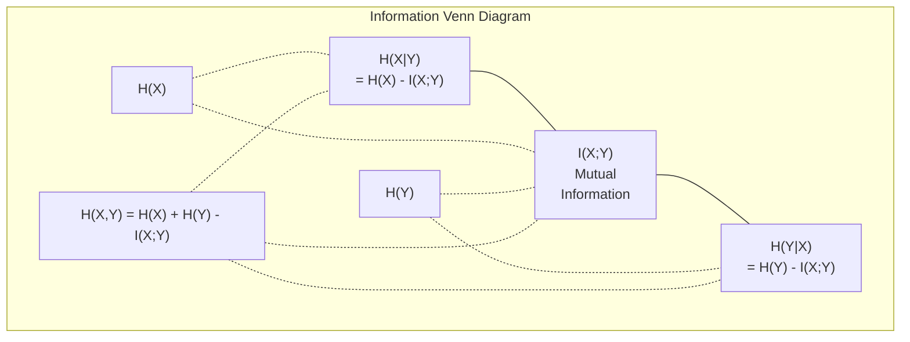

# 資訊理論

> 資訊理論衡量的是驚訝程度。損失函式就建立在它之上。

**類型：** 學習
**程式語言：** Python
**先修單元：** 階段 1 · 06（機率）
**時間：** 約 60 分鐘

## 學習目標

- 從零計算熵、交叉熵與 KL 散度，並說明三者之間的關係
- 推導出為什麼最小化交叉熵損失等同於最大化對數概似
- 計算特徵與目標之間的互資訊，用來排序特徵重要性
- 把困惑度解釋成語言模型實際上是在多大的詞彙表裡挑選

## 問題所在

你訓練的每一個分類模型都會呼叫 `CrossEntropyLoss()`。你在每一篇語言模型論文裡都看得到「perplexity」。你在 VAE、蒸餾與 RLHF 的資料裡都讀到 KL 散度。這些不是互不相干的概念，而是同一個想法戴著不同的帽子。

資訊理論給了你一套語言，用來推理不確定性、壓縮與預測。Claude Shannon 在 1948 年發明它來解決通訊問題。結果發現，訓練一個神經網路也是通訊問題：模型正試著把正確的標籤，透過一條由學到的權重構成的雜訊通道傳送出去。

這一課會把每一條公式都從零建起來，讓你看清它們從哪來、為什麼有效。

## 核心概念

### 訊息量（驚訝度）

當不太可能的事情發生時，它帶有更多資訊。硬幣落下是正面？不驚訝。中樂透？非常驚訝。

一個機率為 p 的事件，它的訊息量是：

```
I(x) = -log(p(x))
```

用 log 以 2 為底得到位元（bits）。用自然對數得到 nats。想法相同，只是單位不同。

```
Event              Probability    Surprise (bits)
Fair coin heads    0.5            1.0
Rolling a 6        0.167          2.58
1-in-1000 event    0.001          9.97
Certain event      1.0            0.0
```

必然發生的事件帶有零資訊。你早就知道它會發生了。

### 熵（平均驚訝度）

熵是一個分布中所有可能結果的期望驚訝度。

```
H(P) = -sum( p(x) * log(p(x)) )  for all x
```

對一個二元變數來說，公平硬幣有最大的熵：1 位元。偏差硬幣（99% 正面）的熵很低：0.08 位元。你早就知道會發生什麼，所以每一次拋擲幾乎沒告訴你任何事。

```
Fair coin:    H = -(0.5 * log2(0.5) + 0.5 * log2(0.5)) = 1.0 bit
Biased coin:  H = -(0.99 * log2(0.99) + 0.01 * log2(0.01)) = 0.08 bits
```

熵衡量一個分布中無法再削減的不確定性。你不可能壓縮到比它更低。

### 交叉熵（你每天都在用的那個損失函式）

交叉熵衡量的是：當你用分布 Q 去編碼實際上來自分布 P 的事件時，平均的驚訝度有多大。

```
H(P, Q) = -sum( p(x) * log(q(x)) )  for all x
```

P 是真實分布（標籤）。Q 是你模型的預測。如果 Q 完全符合 P，交叉熵就等於熵。只要有任何落差，它就會變大。

在分類問題裡，P 是一個 one-hot 向量（正確類別的機率是 1，其他全是 0）。這讓交叉熵簡化成：

```
H(P, Q) = -log(q(true_class))
```

這就是分類問題交叉熵損失的全部公式。把正確類別的預測機率最大化就對了。

### KL 散度（分布之間的距離）

KL 散度衡量的是：用 Q 取代 P 會讓你多付出多少額外的驚訝度。

```
D_KL(P || Q) = sum( p(x) * log(p(x) / q(x)) )  for all x
             = H(P, Q) - H(P)
```

交叉熵就是熵加上 KL 散度。既然真實分布的熵在訓練過程中是常數，最小化交叉熵就等於最小化 KL 散度。你是在把模型的分布推向真實分布。

KL 散度不對稱：D_KL(P || Q) != D_KL(Q || P)。它不是真正的距離度量。

### 互資訊

互資訊衡量的是：知道其中一個變數，能告訴你關於另一個變數多少事。

```
I(X; Y) = H(X) - H(X|Y)
        = H(X) + H(Y) - H(X, Y)
```

如果 X 與 Y 獨立，互資訊是零。知道一個，對另一個毫無幫助。如果它們完全相關，互資訊就等於任一個變數的熵。

在特徵選擇裡，某個特徵與目標之間的互資訊高，表示這個特徵有用。互資訊低，表示它是雜訊。

### 條件熵

H(Y|X) 衡量的是：在你觀察到 X 之後，關於 Y 還剩下多少不確定性。

```
H(Y|X) = H(X,Y) - H(X)
```

兩種極端：
- 如果 X 完全決定 Y，那麼 H(Y|X) = 0。知道 X 就消除了關於 Y 的所有不確定性。例子：X = 攝氏溫度，Y = 華氏溫度。
- 如果 X 完全不能告訴你關於 Y 的任何事，那麼 H(Y|X) = H(Y)。知道 X 一點也沒有減少你的不確定性。例子：X = 拋硬幣結果，Y = 明天的天氣。

條件熵永遠非負，而且不會超過 H(Y)：

```
0 <= H(Y|X) <= H(Y)
```

在機器學習裡，條件熵出現在決策樹中。每一次分裂時，演算法都會挑出讓 H(Y|X) 最小的特徵 X ——也就是最能消除標籤 Y 不確定性的那個特徵。

### 聯合熵

H(X,Y) 是 X 與 Y 合起來看的聯合分布的熵。

```
H(X,Y) = -sum sum p(x,y) * log(p(x,y))   for all x, y
```

關鍵性質：

```
H(X,Y) <= H(X) + H(Y)
```

等號在 X 與 Y 獨立時成立。如果它們共用了一些資訊，聯合熵就會小於各自熵的總和。「少掉」的那部分熵，恰好就是互資訊。


```mermaid
graph TD
    subgraph "Information Venn Diagram"
        direction LR
        HX["H(X)"]
        HY["H(Y)"]
        MI["I(X;Y)<br/>Mutual<br/>Information"]
        HXgY["H(X|Y)<br/>= H(X) - I(X;Y)"]
        HYgX["H(Y|X)<br/>= H(Y) - I(X;Y)"]
        HXY["H(X,Y) = H(X) + H(Y) - I(X;Y)"]
    end

    HXgY --- MI
    MI --- HYgX
    HX -.- HXgY
    HX -.- MI
    HY -.- MI
    HY -.- HYgX
    HXY -.- HXgY
    HXY -.- MI
    HXY -.- HYgX
```

它們之間的關係：
- H(X,Y) = H(X) + H(Y|X) = H(Y) + H(X|Y)
- I(X;Y) = H(X) - H(X|Y) = H(Y) - H(Y|X)
- H(X,Y) = H(X) + H(Y) - I(X;Y)

### 互資訊（深入）

互資訊 I(X;Y) 量化的是：知道其中一個變數，能減少多少關於另一個變數的不確定性。

```
I(X;Y) = H(X) - H(X|Y)
       = H(Y) - H(Y|X)
       = H(X) + H(Y) - H(X,Y)
       = sum sum p(x,y) * log(p(x,y) / (p(x) * p(y)))
```

性質：
- I(X;Y) >= 0 永遠成立。觀察到某件事，絕不會讓你損失資訊。
- I(X;Y) = 0 的充分必要條件是 X 與 Y 獨立。
- I(X;Y) = I(Y;X)。它是對稱的，跟 KL 散度不同。
- I(X;X) = H(X)。一個變數和自己共用全部的資訊。

**用互資訊做特徵選擇。** 在 ML 裡，你想要的是對目標有資訊量的特徵。互資訊給了你一套有原則的排序方法：

1. 對每個特徵 X_i，計算 I(X_i; Y)，其中 Y 是目標變數。
2. 依 MI 分數排序特徵。
3. 留下前 k 個特徵。

不管特徵與目標之間是什麼關係——線性、非線性、單調或不單調——這招都管用。相關係數只抓得到線性關係，MI 什麼都抓得到。

| 方法 | 偵測得到 | 計算成本 | 能處理類別型？ |
|--------|---------|-------------------|---------------------|
| Pearson 相關係數 | 線性關係 | O(n) | 不行 |
| Spearman 相關係數 | 單調關係 | O(n log n) | 不行 |
| 互資訊 | 任何統計相依性 | O(n log n)（需分箱） | 可以 |

### 標籤平滑與交叉熵

標準的分類用的是硬目標：[0, 0, 1, 0]。正確類別拿到機率 1，其他全都是 0。標籤平滑把它換成軟目標：

```
soft_target = (1 - epsilon) * hard_target + epsilon / num_classes
```

當 epsilon = 0.1、類別數為 4 時：
- 硬目標：[0, 0, 1, 0]
- 軟目標：[0.025, 0.025, 0.925, 0.025]

從資訊理論的角度看，標籤平滑提高了目標分布的熵。硬 one-hot 目標的熵是 0 ——完全沒有不確定性。軟目標的熵是正的。

這為什麼有幫助：
- 避免模型把 logits 推到極端值（在交叉熵下，要完全符合 one-hot 目標會需要無限大的 logits）
- 起到正則化的作用：模型不可能 100% 自信
- 改善校準：預測出的機率更能反映真實的不確定性
- 縮小訓練與推論時行為的差距

加上標籤平滑的交叉熵損失變成：

```
L = (1 - epsilon) * CE(hard_target, prediction) + epsilon * H_uniform(prediction)
```

第二項會懲罰離均勻分布太遠的預測——一種直接針對自信程度的正則化。

### 為什麼交叉熵就是「那個」分類損失

三種觀點，同一個結論。

**資訊理論觀點。** 交叉熵衡量的是：你用模型的分布而不是真實分布，會浪費掉多少位元。把它最小化，就是讓你的模型成為最有效率的現實編碼器。

**最大概似觀點。** 對 N 個訓練樣本，其真實類別為 y_i：

```
Likelihood     = product( q(y_i) )
Log-likelihood = sum( log(q(y_i)) )
Negative log-likelihood = -sum( log(q(y_i)) )
```

最後那一行就是交叉熵損失。最小化交叉熵 = 在你的模型下最大化訓練資料的概似。

**梯度觀點。** 交叉熵對 logits 的梯度就只是（預測值 - 真實值）。乾淨、穩定、算起來快。這就是為什麼它跟 softmax 是天作之合。

### 位元 vs nats

唯一的差別就是對數的底。

```
log base 2   -> bits      (information theory tradition)
log base e   -> nats      (machine learning convention)
log base 10  -> hartleys  (rarely used)
```

1 nat = 1/ln(2) bits = 1.4427 bits。PyTorch 與 TensorFlow 預設用自然對數（nats）。

### 困惑度

困惑度是交叉熵的指數。它告訴你：模型實際上是在多少個等可能的選項之間猶豫不決。

```
Perplexity = 2^H(P,Q)   (if using bits)
Perplexity = e^H(P,Q)   (if using nats)
```

一個困惑度為 50 的語言模型，平均而言就像是必須從 50 個可能的下一個詞元裡均勻挑選那樣困惑。越低越好。

GPT-2 在常見的基準測試上達到約 30 的困惑度。現代模型在資料充足的領域已經進到個位數。

```figure
entropy-kl
```

## 動手實作

### 步驟 1：訊息量與熵

```python
import math

def information_content(p, base=2):
    if p <= 0 or p > 1:
        return float('inf') if p <= 0 else 0.0
    return -math.log(p) / math.log(base)

def entropy(probs, base=2):
    return sum(
        p * information_content(p, base)
        for p in probs if p > 0
    )

fair_coin = [0.5, 0.5]
biased_coin = [0.99, 0.01]
fair_die = [1/6] * 6

print(f"Fair coin entropy:   {entropy(fair_coin):.4f} bits")
print(f"Biased coin entropy: {entropy(biased_coin):.4f} bits")
print(f"Fair die entropy:    {entropy(fair_die):.4f} bits")
```

### 步驟 2：交叉熵與 KL 散度

```python
def cross_entropy(p, q, base=2):
    total = 0.0
    for pi, qi in zip(p, q):
        if pi > 0:
            if qi <= 0:
                return float('inf')
            total += pi * (-math.log(qi) / math.log(base))
    return total

def kl_divergence(p, q, base=2):
    return cross_entropy(p, q, base) - entropy(p, base)

true_dist = [0.7, 0.2, 0.1]
good_model = [0.6, 0.25, 0.15]
bad_model = [0.1, 0.1, 0.8]

print(f"Entropy of true dist:     {entropy(true_dist):.4f} bits")
print(f"CE (good model):          {cross_entropy(true_dist, good_model):.4f} bits")
print(f"CE (bad model):           {cross_entropy(true_dist, bad_model):.4f} bits")
print(f"KL divergence (good):     {kl_divergence(true_dist, good_model):.4f} bits")
print(f"KL divergence (bad):      {kl_divergence(true_dist, bad_model):.4f} bits")
```

### 步驟 3：交叉熵作為分類損失

```python
def softmax(logits):
    max_logit = max(logits)
    exps = [math.exp(z - max_logit) for z in logits]
    total = sum(exps)
    return [e / total for e in exps]

def cross_entropy_loss(true_class, logits):
    probs = softmax(logits)
    return -math.log(probs[true_class])

logits = [2.0, 1.0, 0.1]
true_class = 0

probs = softmax(logits)
loss = cross_entropy_loss(true_class, logits)

print(f"Logits:      {logits}")
print(f"Softmax:     {[f'{p:.4f}' for p in probs]}")
print(f"True class:  {true_class}")
print(f"Loss:        {loss:.4f} nats")
print(f"Perplexity:  {math.exp(loss):.2f}")
```

### 步驟 4：交叉熵等於負對數概似

```python
import random

random.seed(42)

n_samples = 1000
n_classes = 3
true_labels = [random.randint(0, n_classes - 1) for _ in range(n_samples)]
model_logits = [[random.gauss(0, 1) for _ in range(n_classes)] for _ in range(n_samples)]

ce_loss = sum(
    cross_entropy_loss(label, logits)
    for label, logits in zip(true_labels, model_logits)
) / n_samples

nll = -sum(
    math.log(softmax(logits)[label])
    for label, logits in zip(true_labels, model_logits)
) / n_samples

print(f"Cross-entropy loss:      {ce_loss:.6f}")
print(f"Negative log-likelihood: {nll:.6f}")
print(f"Difference:              {abs(ce_loss - nll):.2e}")
```

### 步驟 5：互資訊

```python
def mutual_information(joint_probs, base=2):
    rows = len(joint_probs)
    cols = len(joint_probs[0])

    margin_x = [sum(joint_probs[i][j] for j in range(cols)) for i in range(rows)]
    margin_y = [sum(joint_probs[i][j] for i in range(rows)) for j in range(cols)]

    mi = 0.0
    for i in range(rows):
        for j in range(cols):
            pxy = joint_probs[i][j]
            if pxy > 0:
                mi += pxy * math.log(pxy / (margin_x[i] * margin_y[j])) / math.log(base)
    return mi

independent = [[0.25, 0.25], [0.25, 0.25]]
dependent = [[0.45, 0.05], [0.05, 0.45]]

print(f"MI (independent): {mutual_information(independent):.4f} bits")
print(f"MI (dependent):   {mutual_information(dependent):.4f} bits")
```

## 框架應用

同樣的概念，改用 NumPy 寫，也就是你實務上會用的方式：

```python
import numpy as np

def np_entropy(p):
    p = np.asarray(p, dtype=float)
    mask = p > 0
    result = np.zeros_like(p)
    result[mask] = p[mask] * np.log(p[mask])
    return -result.sum()

def np_cross_entropy(p, q):
    p, q = np.asarray(p, dtype=float), np.asarray(q, dtype=float)
    mask = p > 0
    return -(p[mask] * np.log(q[mask])).sum()

def np_kl_divergence(p, q):
    return np_cross_entropy(p, q) - np_entropy(p)

true = np.array([0.7, 0.2, 0.1])
pred = np.array([0.6, 0.25, 0.15])
print(f"Entropy:    {np_entropy(true):.4f} nats")
print(f"Cross-ent:  {np_cross_entropy(true, pred):.4f} nats")
print(f"KL div:     {np_kl_divergence(true, pred):.4f} nats")
```

你已經從零打造出 `torch.nn.CrossEntropyLoss()` 內部在做的事。現在你知道訓練過程中損失為什麼會下降了：你模型預測的分布正在靠近真實分布，而衡量的單位是被浪費掉的資訊有幾個 nats。

## 練習

1. 假設英文字母是均勻分布（26 個字母），計算它的熵。接著用實際的字母頻率估算一次。哪一個比較高，為什麼？

2. 有一個模型對某個樣本輸出 logits [5.0, 2.0, 0.5]，而真實類別是 1。請手算交叉熵損失，然後用你的 `cross_entropy_loss` 函式驗證。什麼樣的 logits 會讓損失變成零？

3. 證明 KL 散度不對稱。挑兩個分布 P 與 Q，算出 D_KL(P || Q) 與 D_KL(Q || P)，並解釋為什麼它們不一樣。

4. 寫一個函式，計算一串詞元預測的困惑度。輸入是一串 (true_token_index, predicted_logits) 配對，回傳這個序列的困惑度。

## 關鍵術語

| 術語 | 大家怎麼說 | 實際上是什麼 |
|------|----------------|----------------------|
| 訊息量 | 「驚訝度」 | 編碼一個事件所需的位元數（或 nats）：-log(p) |
| 熵 | 「隨機程度」 | 一個分布中所有結果的平均驚訝度。衡量無法再削減的不確定性。 |
| 交叉熵 | 「那個損失函式」 | 用模型分布 Q 去編碼來自真實分布 P 的事件時，平均的驚訝度。 |
| KL 散度 | 「分布之間的距離」 | 用 Q 取代 P 所浪費掉的額外位元。等於交叉熵減去熵。不對稱。 |
| 互資訊 | 「X 跟 Y 有多相關」 | 知道 Y 之後，關於 X 的不確定性減少了多少。為零代表獨立。 |
| Softmax | 「把 logits 變成機率」 | 取指數再正規化。把任何實數向量映射成一個合法的機率分布。 |
| 困惑度 | 「模型有多困惑」 | 交叉熵的指數。模型每一步實際上是在多大的詞彙表裡挑選。 |
| 位元（bits） | 「Shannon 的單位」 | 以 log 底數 2 衡量的資訊。一個位元解決一次公平拋硬幣。 |
| Nats | 「ML 的單位」 | 以自然對數衡量的資訊。PyTorch 與 TensorFlow 預設採用。 |
| 負對數概似 | 「NLL 損失」 | 對 one-hot 標籤而言，與交叉熵損失完全相同。把它最小化就是把正確預測的機率最大化。 |

## 延伸閱讀

- [Shannon 1948: A Mathematical Theory of Communication](https://people.math.harvard.edu/~ctm/home/text/others/shannon/entropy/entropy.pdf) —— 原始論文，至今仍然好讀
- [Visual Information Theory (Chris Olah)](https://colah.github.io/posts/2015-09-Visual-Information/) —— 關於熵與 KL 散度最好的視覺化解釋
- [PyTorch CrossEntropyLoss docs](https://pytorch.org/docs/stable/generated/torch.nn.CrossEntropyLoss.html) —— 框架是怎麼實作你剛剛打造出來的東西的
