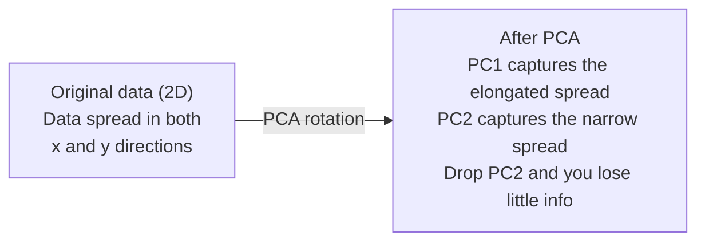

# 次元削減

> 高次元データには構造があります。適切な角度から見れば、それを見つけられます。

**種別:** 構築
**言語:** Python
**前提条件:** Phase 1、Lesson 01（線形代数の直感）、02（ベクトル・行列・演算）、03（固有値と固有ベクトル）、06（確率と分布）
**所要時間:** 約90分

## 学習目標

- PCAをスクラッチから実装する: データの中心化、共分散行列の計算、固有分解、射影
- 説明分散比とエルボー法を使い、主成分数を選ぶ
- MNISTの数字を2Dで可視化するためにPCA、t-SNE、UMAPを比較し、それぞれのトレードオフを説明する
- RBFカーネルを使ったkernel PCAを適用し、標準PCAでは扱えない非線形データ構造を分離する

## 問題

1サンプルあたり784個の特徴量を持つデータセットがあります。手書き数字のピクセル値かもしれません。遺伝子発現量かもしれません。ユーザー行動シグナルかもしれません。784次元は可視化できません。プロットもできません。頭の中で考えることすらできません。

しかし、その784個の特徴量の大半は冗長です。実際の情報は、はるかに小さな面の上にあります。手書きの「7」を表すのに、784個の独立した数値は必要ありません。線の角度、横棒の長さ、どれだけ傾いているか、そうした少数の要素で十分です。残りはノイズです。

次元削減は、その小さな面を見つけます。784次元のデータを2次元、10次元、50次元へ圧縮しながら、重要な構造を保ちます。

## 概念

### 次元の呪い

高次元空間は直感に反します。次元が増えると、3つのことが破綻します。

**距離が意味を失います。** 高次元では、任意の2つのランダム点の距離が同じ値へ収束していきます。すべての点が他のすべての点からほぼ同じ距離にあるなら、最近傍探索は機能しなくなります。

```
Dimension    Avg distance ratio (max/min between random points)
2            ~5.0
10           ~1.8
100          ~1.2
1000         ~1.02
```

**体積が角に集中します。** d次元の単位超立方体には2^d個の角があります。100次元では、体積のほぼすべてが中心から遠い角にあります。データ点は端へ散らばり、モデルは内部領域のデータ不足に苦しみます。

**指数関数的に多くのデータが必要になります。** 空間内のサンプル密度を同じに保つには、2Dから20Dへ移るだけで10^18倍のデータが必要です。そんな量は手に入りません。次元を減らすと、データ密度は扱える範囲へ戻ります。

### PCA: 重要な方向を見つける

主成分分析（PCA）は、データが最も大きく変動する軸を見つけます。座標系を回転させ、最初の軸が最大の分散を捉え、2番目の軸が次に大きな分散を捉え、以後同様に続くようにします。

アルゴリズム:

```
1. Center the data        (subtract the mean from each feature)
2. Compute covariance     (how features move together)
3. Eigendecomposition     (find the principal directions)
4. Sort by eigenvalue     (biggest variance first)
5. Project               (keep top k eigenvectors, drop the rest)
```

なぜ固有分解なのでしょうか。共分散行列は対称かつ半正定値です。その固有ベクトルは特徴空間内の直交方向を表します。固有値は、それぞれの方向がどれだけの分散を捉えるかを示します。最大固有値を持つ固有ベクトルは、分散が最大になる方向を指します。



- **PCA前:** データ雲はx軸とy軸の両方にまたがって斜めに広がっている
- **PCA後:** 座標系が回転し、PC1は最大分散の方向（細長い広がり）に、PC2は最小分散の方向（狭い広がり）にそろう
- **次元削減:** PC2を捨てると、データはPC1へ射影され、失われる情報はごくわずかになる

### 説明分散比

各主成分は、全体の分散の一部を捉えます。説明分散比は、その割合を教えてくれます。

```
Component    Eigenvalue    Explained ratio    Cumulative
PC1          4.73          0.473              0.473
PC2          2.51          0.251              0.724
PC3          1.12          0.112              0.836
PC4          0.89          0.089              0.925
...
```

累積説明分散が0.95に達したら、その数の成分で情報の95%を捉えられていることがわかります。それ以降はほとんどノイズです。

### 成分数の選び方

3つの戦略があります。

1. **しきい値。** 分散の90-95%を説明するのに十分な成分を残す。
2. **エルボー法。** 成分ごとの説明分散をプロットする。急に落ちる場所を探す。
3. **下流タスクの性能。** PCAを前処理として使う。kを変えながらモデル精度を測る。精度が頭打ちになる場所が最適なk。

### t-SNE: 近傍を保つ

t-Distributed Stochastic Neighbor Embedding（t-SNE）は可視化のために設計されています。高次元データを2D（または3D）へ写像しながら、どの点同士が近いかを保ちます。

直感はこうです。元の空間で、点のペアに対する確率分布を距離に基づいて計算します。近い点は高い確率を持ち、遠い点は低い確率を持ちます。次に、同じ確率分布が成り立つような2D配置を探します。784次元で近傍だった点は、2Dでも近傍のままです。

t-SNEの主な性質:
- 非線形。PCAでは展開できない複雑な多様体を展開できる。
- 確率的。実行ごとに異なるレイアウトが得られる。
- perplexityパラメータが、考慮する近傍数を制御する（典型的な範囲: 5-50）。
- 出力内のクラスタ間距離は意味を持たない。意味があるのはクラスタそのものだけ。
- 大規模データでは遅い。デフォルトではO(n^2)。

### UMAP: より高速で、大域構造をより保つ

Uniform Manifold Approximation and Projection（UMAP）はt-SNEに似ていますが、2つの利点があります。
- より高速。全ペア距離を計算する代わりに、近似最近傍グラフを使う。
- 大域構造がよりよい。出力内のクラスタの相対位置は、t-SNEより意味を持ちやすい。

UMAPは高次元空間で重み付きグラフ（「ファジー位相表現」）を構築し、そのグラフをできるだけ保つ低次元レイアウトを見つけます。

主要パラメータ:
- `n_neighbors`: 局所構造を定義する近傍数（perplexityに似ている）。大きい値ほど大域構造をより保つ。
- `min_dist`: 出力内で点をどれだけ密に詰めるか。小さい値ほど密なクラスタを作る。

### どれをいつ使うか

| 手法 | 使いどころ | 保つもの | 速度 |
|--------|----------|-----------|-------|
| PCA | 訓練前の前処理 | 大域的な分散 | 高速（厳密）、数百万サンプルでも動く |
| PCA | すばやい探索的可視化 | 線形構造 | 高速 |
| t-SNE | 論文品質の2Dプロット | 局所近傍 | 遅い（1万サンプル未満が理想） |
| UMAP | 大規模な2D可視化 | 局所構造 + 一部の大域構造 | 中程度（数百万件も扱える） |
| PCA | モデル向け特徴量削減 | 分散順に並んだ特徴 | 高速 |
| t-SNE / UMAP | クラスタ構造の理解 | クラスタ分離 | 中程度から遅い |

経験則: 前処理とデータ圧縮にはPCAを使います。2Dで構造を可視化する必要があるときはt-SNEまたはUMAPを使います。

### Kernel PCA

標準PCAは線形部分空間を見つけます。座標系を回転し、軸を落とします。しかし、データが非線形多様体の上にある場合はどうでしょうか。2Dの円は、どんな直線でも分離できません。標準PCAは役に立ちません。

Kernel PCAは、カーネル関数によって誘導される高次元特徴空間でPCAを適用します。ただし、その空間の座標は明示的には計算しません。これはカーネルトリックであり、SVMの背後にある考え方と同じです。

アルゴリズム:
1. K_ij = k(x_i, x_j) となるカーネル行列Kを計算する
2. 特徴空間でカーネル行列を中心化する
3. 中心化されたカーネル行列を固有分解する
4. 上位固有ベクトル（1/sqrt(eigenvalue)でスケールしたもの）が射影になる

一般的なカーネル関数:

| カーネル | 公式 | 向いているもの |
|--------|---------|----------|
| RBF (Gaussian) | exp(-gamma * \|\|x - y\|\|^2) | ほとんどの非線形データ、なめらかな多様体 |
| Polynomial | (x . y + c)^d | 多項式的な関係 |
| Sigmoid | tanh(alpha * x . y + c) | ニューラルネットワークのような写像 |

Kernel PCAと標準PCAの使い分け:

| 基準 | 標準PCA | Kernel PCA |
|-----------|-------------|------------|
| データ構造 | 線形部分空間 | 非線形多様体 |
| 速度 | O(min(n^2 d, d^2 n)) | O(n^2 d + n^3) |
| 解釈性 | 成分は特徴量の線形結合 | 成分には直接的な特徴量解釈がない |
| スケーラビリティ | 数百万サンプルで動く | カーネル行列がn x nなのでメモリ制約を受ける |
| 再構成 | 直接的な逆変換 | pre-image近似が必要 |

古典的な例は、2Dの同心円です。2つの点の輪があり、一方がもう一方の内側にあります。標準PCAは両方を同じ直線へ射影するため、分類には使えません。RBFカーネルを使ったkernel PCAは、内側の円と外側の円を異なる領域へ写像し、線形分離可能にします。

### 再構成誤差

次元削減はどれくらいうまくいったのでしょうか。784次元を50次元に圧縮しました。何を失ったのでしょうか。

再構成誤差を測ります。
1. データをk次元へ射影する: X_reduced = X @ W_k
2. 再構成する: X_hat = X_reduced @ W_k^T
3. MSEを計算する: mean((X - X_hat)^2)

PCAでは、再構成誤差は説明分散ときれいな関係を持ちます。

```
Reconstruction error = sum of eigenvalues NOT included
Total variance = sum of ALL eigenvalues
Fraction lost = (sum of dropped eigenvalues) / (sum of all eigenvalues)
```

各成分の説明分散比は次のとおりです。

```
explained_ratio_k = eigenvalue_k / sum(all eigenvalues)
```

成分数に対して累積説明分散をプロットすると、「エルボー」曲線が得られます。適切な成分数は次の条件を満たす場所です。
- 曲線が平坦になる（追加効果が逓減する）
- 累積分散がしきい値を超える（通常は0.90または0.95）
- 下流タスクの性能が頭打ちになる

再構成誤差はkを選ぶ以外にも役立ちます。異常検知に使えます。再構成誤差が大きいサンプルは、学習された部分空間に合わない外れ値です。これは本番システムにおけるPCAベース異常検知の基礎です。

## 構築

### Step 1: PCAをスクラッチから実装する

```python
import numpy as np

class PCA:
    def __init__(self, n_components):
        self.n_components = n_components
        self.components = None
        self.mean = None
        self.eigenvalues = None
        self.explained_variance_ratio_ = None

    def fit(self, X):
        self.mean = np.mean(X, axis=0)
        X_centered = X - self.mean

        cov_matrix = np.cov(X_centered, rowvar=False)

        eigenvalues, eigenvectors = np.linalg.eigh(cov_matrix)

        sorted_idx = np.argsort(eigenvalues)[::-1]
        eigenvalues = eigenvalues[sorted_idx]
        eigenvectors = eigenvectors[:, sorted_idx]

        self.components = eigenvectors[:, :self.n_components].T
        self.eigenvalues = eigenvalues[:self.n_components]
        total_var = np.sum(eigenvalues)
        self.explained_variance_ratio_ = self.eigenvalues / total_var

        return self

    def transform(self, X):
        X_centered = X - self.mean
        return X_centered @ self.components.T

    def fit_transform(self, X):
        self.fit(X)
        return self.transform(X)
```

### Step 2: 合成データでテストする

```python
np.random.seed(42)
n_samples = 500

t = np.random.uniform(0, 2 * np.pi, n_samples)
x1 = 3 * np.cos(t) + np.random.normal(0, 0.2, n_samples)
x2 = 3 * np.sin(t) + np.random.normal(0, 0.2, n_samples)
x3 = 0.5 * x1 + 0.3 * x2 + np.random.normal(0, 0.1, n_samples)

X_synthetic = np.column_stack([x1, x2, x3])

pca = PCA(n_components=2)
X_reduced = pca.fit_transform(X_synthetic)

print(f"Original shape: {X_synthetic.shape}")
print(f"Reduced shape:  {X_reduced.shape}")
print(f"Explained variance ratios: {pca.explained_variance_ratio_}")
print(f"Total variance captured: {sum(pca.explained_variance_ratio_):.4f}")
```

### Step 3: MNISTの数字を2Dにする

```python
from sklearn.datasets import fetch_openml

mnist = fetch_openml("mnist_784", version=1, as_frame=False, parser="auto")
X_mnist = mnist.data[:5000].astype(float)
y_mnist = mnist.target[:5000].astype(int)

pca_mnist = PCA(n_components=50)
X_pca50 = pca_mnist.fit_transform(X_mnist)
print(f"50 components capture {sum(pca_mnist.explained_variance_ratio_):.2%} of variance")

pca_2d = PCA(n_components=2)
X_pca2d = pca_2d.fit_transform(X_mnist)
print(f"2 components capture {sum(pca_2d.explained_variance_ratio_):.2%} of variance")
```

### Step 4: sklearnと比較する

```python
from sklearn.decomposition import PCA as SklearnPCA
from sklearn.manifold import TSNE

sklearn_pca = SklearnPCA(n_components=2)
X_sklearn_pca = sklearn_pca.fit_transform(X_mnist)

print(f"\nOur PCA explained variance:     {pca_2d.explained_variance_ratio_}")
print(f"Sklearn PCA explained variance: {sklearn_pca.explained_variance_ratio_}")

diff = np.abs(np.abs(X_pca2d) - np.abs(X_sklearn_pca))
print(f"Max absolute difference: {diff.max():.10f}")

tsne = TSNE(n_components=2, perplexity=30, random_state=42)
X_tsne = tsne.fit_transform(X_mnist)
print(f"\nt-SNE output shape: {X_tsne.shape}")
```

### Step 5: UMAPと比較する

```python
try:
    from umap import UMAP

    reducer = UMAP(n_components=2, n_neighbors=15, min_dist=0.1, random_state=42)
    X_umap = reducer.fit_transform(X_mnist)
    print(f"UMAP output shape: {X_umap.shape}")
except ImportError:
    print("Install umap-learn: pip install umap-learn")
```

## 使う

分類器の前処理としてPCAを使う例:

```python
from sklearn.decomposition import PCA as SklearnPCA
from sklearn.linear_model import LogisticRegression
from sklearn.model_selection import train_test_split
from sklearn.metrics import accuracy_score

X_train, X_test, y_train, y_test = train_test_split(
    X_mnist, y_mnist, test_size=0.2, random_state=42
)

results = {}
for k in [10, 30, 50, 100, 200]:
    pca_k = SklearnPCA(n_components=k)
    X_tr = pca_k.fit_transform(X_train)
    X_te = pca_k.transform(X_test)

    clf = LogisticRegression(max_iter=1000, random_state=42)
    clf.fit(X_tr, y_train)
    acc = accuracy_score(y_test, clf.predict(X_te))
    var_captured = sum(pca_k.explained_variance_ratio_)
    results[k] = (acc, var_captured)
    print(f"k={k:>3d}  accuracy={acc:.4f}  variance={var_captured:.4f}")
```

性能は784次元に達するずっと前に頭打ちになります。その頭打ちの地点が運用上の選択点です。

## 成果物

このレッスンでは次を作ります。
- `outputs/skill-dimensionality-reduction.md` - 与えられたタスクに適した次元削減手法を選ぶためのskill

## 演習

1. `inverse_transform` をサポートするようにPCAクラスを変更してください。10、50、200成分からMNISTの数字を再構成し、それぞれの再構成誤差（元画像との差の平均二乗）を出力してください。

2. 同じMNISTサブセットに対して、perplexityを5、30、100にしてt-SNEを実行してください。出力がどう変わるかを説明してください。なぜperplexityはクラスタの密度に影響するのでしょうか。

3. 50個の特徴量のうち5個だけが有用なデータセットを用意してください（`sklearn.datasets.make_classification` で生成できます）。PCAを適用し、説明分散曲線がデータの実効次元が5であることを正しく示すか確認してください。

## 重要用語

| 用語 | よくある言い方 | 実際の意味 |
|------|----------------|----------------------|
| 次元の呪い | 「特徴量が多すぎる」 | 次元が増えると、距離、体積、データ密度がすべて直感に反して振る舞う。モデルはそれを補うために指数関数的に多くのデータを必要とする。 |
| PCA | 「次元を減らす」 | 座標系を回転して軸を最大分散の方向にそろえ、低分散の軸を捨てる。 |
| 主成分 | 「重要な方向」 | 共分散行列の固有ベクトル。特徴空間内でデータが最も大きく変動する方向。 |
| 説明分散比 | 「この成分が持つ情報量」 | 1つの主成分が捉える全分散の割合。上位k個の比率を足すと、k成分がどれだけ保持するかがわかる。 |
| 共分散行列 | 「特徴量がどう相関するか」 | 要素(i,j)が特徴量iと特徴量jがどのように一緒に動くかを測る対称行列。対角要素は個々の分散。 |
| t-SNE | 「あのクラスタプロット」 | ペアごとの近傍確率を保つことで高次元データを2Dへ写像する非線形手法。可視化にはよいが、前処理には向かない。 |
| UMAP | 「より高速なt-SNE」 | 位相的データ解析に基づく非線形手法。局所構造と一部の大域構造を保つ。t-SNEよりスケールしやすい。 |
| Perplexity | 「t-SNEのつまみ」 | 各点が考慮する有効近傍数を制御する。低いperplexityは非常に局所的な構造に注目し、高いperplexityはより広いパターンを捉える。 |
| Manifold | 「データが乗っている面」 | 高次元空間に埋め込まれた低次元の面。3Dで丸められた紙は2D多様体。 |

## さらに読む

- [A Tutorial on Principal Component Analysis](https://arxiv.org/abs/1404.1100)（Shlens）- PCAを基礎から明快に導出している
- [How to Use t-SNE Effectively](https://distill.pub/2016/misread-tsne/)（Wattenbergほか）- t-SNEの落とし穴とパラメータ選択を扱うインタラクティブガイド
- [UMAP documentation](https://umap-learn.readthedocs.io/) - UMAP作者による理論と実践のガイド
