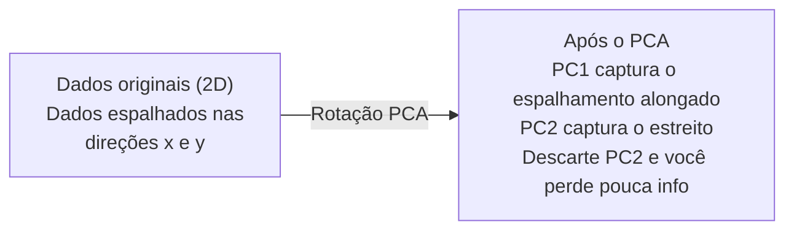

# Redução de Dimensionalidade

> Dados de alta dimensão têm estrutura. Você encontra olhando pelo ângulo certo.

**Tipo:** Construção
**Idioma:** Python
**Pré-requisitos:** Fase 1, Lições 01 (Intuição de Álgebra Linear), 02 (Vetores, Matrizes & Operações), 03 (Autovalores & Autovetores), 06 (Probabilidade & Distribuições)
**Tempo:** ~90 minutos

## Objetivos de Aprendizado

- Implementar PCA do zero: centralizar dados, calcular a matriz de covariância, autodecompor e projetar
- Usar a razão de variância explicada e o método do cotovelo para escolher o número de componentes principais
- Comparar PCA, t-SNE e UMAP para visualizar dígitos MNIST em 2D e explicar seus tradeoffs
- Aplicar kernel PCA com kernel RBF para separar estruturas não-lineares que o PCA padrão não consegue lidar

## O Problema

Você tem um dataset com 784 features por amostra. Talvez sejam valores de pixel de dígitos manuscritos. Talvez sejam níveis de expressão gênica. Talvez sejam sinais de comportamento do usuário. Você não consegue visualizar 784 dimensões. Não consegue plotar. Nem pensar nelas.

Mas a maioria dessas 784 features é redundante. A informação real vive em uma superfície muito menor. Um "7" manuscrito não precisa de 784 números independentes pra descrevê-lo. Precisa de poucos: o ângulo da traço, o tamanho da barra horizontal, o quanto ele inclina. O resto é ruído.

Redução de dimensionalidade encontra essa superfície menor. Pega seus dados de 784 dimensões e comprime para 2, 10 ou 50 dimensões enquanto mantém a estrutura que importa.

## O Conceito

### A maldição da dimensionalidade

Espaços de alta dimensão são contraintuitivos. Três coisas quebram conforme as dimensões crescem.

**Distância perde significado.** Em altas dimensões, a distância entre quaisquer dois pontos aleatórios converge para o mesmo valor. Se todo ponto está aproximadamente à mesma distância de todos os outros, a busca por vizinho mais próximo para de funcionar.

```
Dimensão     Razão média de distância (max/min entre pontos aleatórios)
2            ~5.0
10           ~1.8
100          ~1.2
1000         ~1.02
```

**Volume concentra nos cantos.** Um hiper cubo unitário em d dimensões tem 2^d cantos. Em 100 dimensões, quase todo o volume está nos cantos, longe do centro. Os pontos de dados se espalham pelas bordas e seus modelos ficam com fome de dados no interior.

**Você precisa de dados exponencialmente maiores.** Para manter a mesma densidade de amostras em um espaço, ir de 2D para 20D significa que você precisa de 10^18 vezes mais dados. Você nunca tem o suficiente. Reduzir dimensões traz a densidade de dados de volta para algo viável.

### PCA: encontrar as direções que importam

Principal Component Analysis (PCA) encontra os eixos ao longo dos quais seus dados variam mais. Ele rotaciona seu sistema de coordenadas para que o primeiro eixo capture a maior variância, o segundo capture a próxima maior, e assim por diante.

O algoritmo:

```
1. Centralizar os dados      (subtrair a média de cada feature)
2. Calcular covariância      (como as features se movem juntas)
3. Autodecomposição          (encontrar as direções principais)
4. Ordenar por autovalor     (maior variância primeiro)
5. Projetar                  (manter top k autovetores, descartar o resto)
```

Por que autodecomposição? A matriz de covariância é simétrica e semi-definida positiva. Seus autovetores são direções ortogonais no espaço de features. Os autovalores dizem quanto de variância cada direção captura. O autovetor com o maior autovalor aponta na direção de máxima variância.



- **Antes do PCA:** A nuvem de dados se espalha diagonalmente em ambos os eixos x e y
- **Após o PCA:** O sistema de coordenadas é rotacionado para que PC1 se alinhe com a direção de máxima variância (espacalhamento alongado) e PC2 com a direção de mínima variância (espalhamento estreito)
- **Redução de dimensionalidade:** Descartar PC2 projeta os dados em PC1, perdendo muito pouca informação

### Razão de variância explicada

Cada componente principal captura uma fração da variância total. A razão de variância explicada diz quanto.

```
Componente    Autovalor    Razão explicada    Acumulada
PC1           4.73         0.473              0.473
PC2           2.51         0.251              0.724
PC3           1.12         0.112              0.836
PC4           0.89         0.089              0.925
...
```

Quando a variância explicada acumulada atinge 0.95, você sabe que essas componentes capturam 95% da informação. Depois disso, tudo é basicamente ruído.

### Escolhendo o número de componentes

Três estratégias:

1. **Limiar.** Manter componentes suficientes para explicar 90-95% da variância.
2. **Método do cotovelo.** Plotar a variância explicada por componente. Procure uma queda acentuada.
3. **Performance downstream.** Usar PCA como pré-processamento. Varie k e meça a acurácia do modelo. O melhor k é onde a acurácia estabiliza.

### t-SNE: preservar vizinhanças

t-Distributed Stochastic Neighbor Embedding (t-SNE) é projetado para visualização. Ele mapeia dados de alta dimensão para 2D (ou 3D) enquanto preserva quais pontos estão próximos uns dos outros.

A intuição: no espaço original, compute uma distribuição de probabilidade sobre pares de pontos baseado nas distâncias. Pontos próximos ganham alta probabilidade. Pontos distantes ganham baixa probabilidade. Depois encontre uma disposição 2D onde a mesma distribuição se mantém. Pontos que eram vizinhos em 784 dimensões continuam vizinhos em 2D.

Propriedades-chave do t-SNE:
- Não-linear. Pode desdobrar variedades complexas que o PCA não consegue.
- Estocástico. Execuções diferentes produzem disposições diferentes.
- O parâmetro perplexidade controla quantos vizinhos considerar (faixa típica: 5-50).
- As distâncias entre clusters na saída não são significativas. Só os clusters em si.
- Lento em datasets grandes. O(n^2) por padrão.

### UMAP: mais rápido, melhor estrutura global

Uniform Manifold Approximation and Projection (UMAP) funciona similar ao t-SNE mas com duas vantagens:
- Mais rápido. Usa grafos aproximados de vizinhos mais próximos ao invés de calcular todas as distâncias pareadas.
- Melhor estrutura global. As posições relativas dos clusters na saída tendem a ser mais significativas que no t-SNE.

O UMAP constrói um grafo ponderado no espaço de alta dimensão (a "representação topológica fuzzy") e depois encontra uma disposição de baixa dimensão que preserva esse grafo o melhor possível.

Parâmetros-chave:
- `n_neighbors`: quantos vizinhos definem a estrutura local (similar à perplexidade). Valores maiores preservam mais estrutura global.
- `min_dist`: o quão compactos os pontos ficam na saída. Valores menores criam clusters mais densos.

### Quando usar cada método

| Método | Caso de uso | Preserva | Velocidade |
|--------|-------------|----------|------------|
| PCA | Pré-processamento antes do treino | Variância global | Rápido (exato), funciona com milhões de amostras |
| PCA | Visualização exploratória rápida | Estrutura linear | Rápido |
| t-SNE | Gráficos 2D de qualidade para publicação | Vizinhanças locais | Lento (< 10k amostras ideal) |
| UMAP | Visualização 2D em escala | Local + alguma estrutura global | Médio (lida com milhões) |
| PCA | Redução de features para modelos | Features ranqueadas por variância | Rápido |
| t-SNE / UMAP | Entender estrutura de clusters | Separação de clusters | Médio a lento |

Regra geral: use PCA para pré-processamento e compressão de dados. Use t-SNE ou UMAP quando precisar visualizar estrutura em 2D.

### Kernel PCA

PCA padrão encontra subespaços lineares. Ele rotaciona seu sistema de coordenadas e descarta eixos. Mas e se os dados estão em uma variedade não-linear? Um círculo em 2D não pode ser separado por nenhuma linha. PCA padrão não ajuda.

Kernel PCA aplica PCA em um espaço de features de alta dimensão induzido por uma função kernel, sem computar explicitamente as coordenadas nesse espaço. Essa é a truque do kernel -- a mesma ideia por trás dos SVMs.

O algoritmo:
1. Compute a matriz kernel K onde K_ij = k(x_i, x_j)
2. Centralize a matriz kernel no espaço de features
3. Faça a autodecomposição da matriz kernel centralizada
4. Os top autovetores (escalonados por 1/sqrt(autovalor)) são as projeções

Funções kernel comuns:

| Kernel | Fórmula | Bom para |
|--------|---------|----------|
| RBF (Gaussian) | exp(-gamma * \|\|x - y\|\|^2) | Maioria dos dados não-lineares, variedades suaves |
| Polynomial | (x . y + c)^d | Relações polinomiais |
| Sigmoid | tanh(alpha * x . y + c) | Mapeamentos tipo rede neural |

Quando usar kernel PCA vs PCA padrão:

| Critério | PCA padrão | Kernel PCA |
|----------|-----------|------------|
| Estrutura de dados | Subespaço linear | Variedade não-linear |
| Velocidade | O(min(n^2 d, d^2 n)) | O(n^2 d + n^3) |
| Interpretabilidade | Componentes são combinações lineares de features | Componentes sem interpretação direta das features |
| Escalabilidade | Funciona com milhões de amostras | Matriz kernel é n x n, limitada por memória |
| Reconstrução | Transformada inversa direta | Requer aproximação de pré-imagem |

O exemplo clássico: círculos concêntricos em 2D. Dois anéis de pontos, um dentro do outro. PCA padrão projeta ambos na mesma linha -- inútil para classificação. Kernel PCA com kernel RBF mapeia o círculo interno e externo para regiões diferentes, tornando-os linearmente separáveis.

### Erro de Reconstrução

Quão boa é sua redução de dimensionalidade? Você comprimiu 784 dimensões para 50. O que você perdeu?

Meça o erro de reconstrução:
1. Projete os dados em k dimensões: X_reduced = X @ W_k
2. Reconstrua: X_hat = X_reduced @ W_k^T
3. Calcule o MSE: mean((X - X_hat)^2)

Para o PCA, o erro de reconstrução tem uma relação direta com a variância explicada:

```
Erro de reconstrução = soma dos autovalores NÃO incluídos
Variância total = soma de TODOS os autovalores
Fração perdida = (soma dos autovalores descartados) / (soma de todos os autovalores)
```

A razão de variância explicada para cada componente é:

```
explained_ratio_k = autovalor_k / soma(todos os autovalores)
```

Plotar a variância explicada acumulada contra o número de componentes dá a curva do "cotovelo". O número certo de componentes é onde:
- A curva estabiliza (retornos decrescentes)
- A variância acumulada cruza seu limiar (geralmente 0.90 ou 0.95)
- A performance downstream estabiliza

O erro de reconstrução é útil além de escolher k. Você pode usá-lo para detecção de anomalias: amostras com alto erro de reconstrução são outliers que não se encaixam no subespaço aprendido. Essa é a base da detecção de anomalias baseada em PCA em sistemas de produção.

## Construa

### Passo 1: PCA do zero

```python
import numpy as np

class PCA:
    def __init__(self, n_components):
        self.n_components = n_components
        self.components = None
        self.mean = None
        self.eigenvalues = None
        self.explained_variance_ratio_ = None

    def fit(self, X):
        self.mean = np.mean(X, axis=0)
        X_centered = X - self.mean

        cov_matrix = np.cov(X_centered, rowvar=False)

        eigenvalues, eigenvectors = np.linalg.eigh(cov_matrix)

        sorted_idx = np.argsort(eigenvalues)[::-1]
        eigenvalues = eigenvalues[sorted_idx]
        eigenvectors = eigenvectors[:, sorted_idx]

        self.components = eigenvectors[:, :self.n_components].T
        self.eigenvalues = eigenvalues[:self.n_components]
        total_var = np.sum(eigenvalues)
        self.explained_variance_ratio_ = self.eigenvalues / total_var

        return self

    def transform(self, X):
        X_centered = X - self.mean
        return X_centered @ self.components.T

    def fit_transform(self, X):
        self.fit(X)
        return self.transform(X)
```

### Passo 2: Teste em dados sintéticos

```python
np.random.seed(42)
n_samples = 500

t = np.random.uniform(0, 2 * np.pi, n_samples)
x1 = 3 * np.cos(t) + np.random.normal(0, 0.2, n_samples)
x2 = 3 * np.sin(t) + np.random.normal(0, 0.2, n_samples)
x3 = 0.5 * x1 + 0.3 * x2 + np.random.normal(0, 0.1, n_samples)

X_synthetic = np.column_stack([x1, x2, x3])

pca = PCA(n_components=2)
X_reduced = pca.fit_transform(X_synthetic)

print(f"Original shape: {X_synthetic.shape}")
print(f"Reduced shape:  {X_reduced.shape}")
print(f"Explained variance ratios: {pca.explained_variance_ratio_}")
print(f"Total variance captured: {sum(pca.explained_variance_ratio_):.4f}")
```

### Passo 3: Dígitos MNIST em 2D

```python
from sklearn.datasets import fetch_openml

mnist = fetch_openml("mnist_784", version=1, as_frame=False, parser="auto")
X_mnist = mnist.data[:5000].astype(float)
y_mnist = mnist.target[:5000].astype(int)

pca_mnist = PCA(n_components=50)
X_pca50 = pca_mnist.fit_transform(X_mnist)
print(f"50 components capture {sum(pca_mnist.explained_variance_ratio_):.2%} of variance")

pca_2d = PCA(n_components=2)
X_pca2d = pca_2d.fit_transform(X_mnist)
print(f"2 components capture {sum(pca_2d.explained_variance_ratio_):.2%} of variance")
```

### Passo 4: Comparação com sklearn

```python
from sklearn.decomposition import PCA as SklearnPCA
from sklearn.manifold import TSNE

sklearn_pca = SklearnPCA(n_components=2)
X_sklearn_pca = sklearn_pca.fit_transform(X_mnist)

print(f"\nOur PCA explained variance:     {pca_2d.explained_variance_ratio_}")
print(f"Sklearn PCA explained variance: {sklearn_pca.explained_variance_ratio_}")

diff = np.abs(np.abs(X_pca2d) - np.abs(X_sklearn_pca))
print(f"Max absolute difference: {diff.max():.10f}")

tsne = TSNE(n_components=2, perplexity=30, random_state=42)
X_tsne = tsne.fit_transform(X_mnist)
print(f"\nt-SNE output shape: {X_tsne.shape}")
```

### Passo 5: Comparação com UMAP

```python
try:
    from umap import UMAP

    reducer = UMAP(n_components=2, n_neighbors=15, min_dist=0.1, random_state=42)
    X_umap = reducer.fit_transform(X_mnist)
    print(f"UMAP output shape: {X_umap.shape}")
except ImportError:
    print("Install umap-learn: pip install umap-learn")
```

## Use

PCA como pré-processamento antes de um classificador:

```python
from sklearn.decomposition import PCA as SklearnPCA
from sklearn.linear_model import LogisticRegression
from sklearn.model_selection import train_test_split
from sklearn.metrics import accuracy_score

X_train, X_test, y_train, y_test = train_test_split(
    X_mnist, y_mnist, test_size=0.2, random_state=42
)

results = {}
for k in [10, 30, 50, 100, 200]:
    pca_k = SklearnPCA(n_components=k)
    X_tr = pca_k.fit_transform(X_train)
    X_te = pca_k.transform(X_test)

    clf = LogisticRegression(max_iter=1000, random_state=42)
    clf.fit(X_tr, y_train)
    acc = accuracy_score(y_test, clf.predict(X_te))
    var_captured = sum(pca_k.explained_variance_ratio_)
    results[k] = (acc, var_captured)
    print(f"k={k:>3d}  accuracy={acc:.4f}  variance={var_captured:.4f}")
```

A performance estabiliza bem antes de 784 dimensões. Essa estabilização é seu ponto de operação.

## Entregue

Esta lição produz:
- `outputs/skill-dimensionality-reduction.md` - uma skill para escolher a técnica de redução de dimensionalidade certa para uma tarefa dada

## Exercícios

1. Modifique a classe PCA para suportar `inverse_transform`. Reconstrua dígitos MNIST de 10, 50 e 200 componentes. Imprima o erro de reconstrução (diferença quadrática média em relação ao original) para cada um.

2. Execute t-SNE no mesmo subconjunto de MNIST com valores de perplexidade de 5, 30 e 100. Descreva como a saída muda. Por que a perplexidade afeta a compactação dos clusters?

3. Pegue um dataset com 50 features onde apenas 5 são informativas (gere um com `sklearn.datasets.make_classification`). Aplique PCA e verifique se a curva de variância explicada identifica corretamente que os dados são efetivamente 5-dimensionais.

## Termos-Chave

| Termo | O que as pessoas dizem | O que realmente significa |
|-------|----------------------|--------------------------|
| Maldição da dimensionalidade | "Muitas features" | Distâncias, volumes e densidade de dados se comportam de forma contraintuitiva conforme as dimensões crescem. Modelos precisam de dados exponencialmente maiores para compensar. |
| PCA | "Reduzir dimensões" | Rotacionar seu sistema de coordenadas para que os eixos se alinhem com as direções de máxima variância, depois descartar os eixos de baixa variância. |
| Componente principal | "Uma direção importante" | Um autovetor da matriz de covariância. A direção no espaço de features ao longo da qual os dados mais variam. |
| Razão de variância explicada | "Quanta info essa componente tem" | A fração da variância total capturada por uma componente principal. Some as top k razões pra ver quanto k componentes preservam. |
| Matriz de covariância | "Como as features se correlacionam" | Uma matriz simétrica onde a entrada (i,j) mede como a funcionalidade i e a funcionalidade j se movem juntas. As entradas diagonais são as variâncias individuais. |
| t-SNE | "Aquele gráfico de clusters" | Um método não-linear que mapeia dados de alta dimensão para 2D preservando probabilidades de vizinhança pareadas. Bom para visualização, não para pré-processamento. |
| UMAP | "t-SNE mais rápido" | Um método não-linear baseado em análise de dados topológicos. Preserva tanto local quanto alguma estrutura global. Escala melhor que o t-SNE. |
| Perplexidade | "Um botão do t-SNE" | Controla o número efetivo de vizinhos que cada ponto considera. Perplexidade baixa foca em estrutura muito local. Perplexidade alta captura padrões mais amplos. |
| Variedade | "A superfície onde os dados vivem" | Uma superfície de menor dimensão embutida em um espaço de maior dimensão. Uma folha de papel amassada em 3D é uma variedade 2D. |

## Leitura Adicional

- [A Tutorial on Principal Component Analysis](https://arxiv.org/abs/1404.1100) (Shlens) - derivação clara do PCA do zero
- [How to Use t-SNE Effectively](https://distill.pub/2016/misread-tsne/) (Wattenberg et al.) - guia interativo sobre armadilhas e escolhas de parâmetros do t-SNE
- [Documentação do UMAP](https://umap-learn.readthedocs.io/) - teoria e orientação prática dos autores do UMAP
