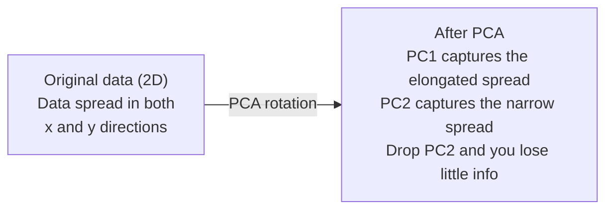

# Boyut Azaltma

> Yüksek boyutlu verinin yapısı vardır. Doğru açıdan bakarak bulabilirsiniz.

**Tür:** Yapım
**Dil:** Python
**Önkoşullar:** Aşama 1, Dersler 01 (Doğrusal Cebir Sezgisi), 02 (Vektörler, Matrisler ve İşlemler), 03 (Özdeğerler ve Özvektörler), 06 (Olasılık ve Dağılımlar)
**Süre:** ~90 dakika

## Öğrenme Hedefleri

- PCA'yı sıfırdan uygulayın: verileri merkeze alın, kovaryans matrisini hesaplayın, özyineleme ve projelendirin
- Ana bileşenlerin sayısını seçmek için açıklanan varyans oranını ve dirsek yöntemini kullanın
- MNIST rakamlarını 2 boyutlu olarak görselleştirmek için PCA, t-SNE ve UMAP'yi karşılaştırın ve bunların ödünlerini açıklayın
- Standart PCA'nın işleyemeyeceği doğrusal olmayan veri yapılarını ayırmak için çekirdek PCA'sını bir RBF çekirdeği ile uygulayın

## Sorun

Örnek başına 784 özelliğe sahip bir dataset'niz var. Belki elle yazılan rakamların piksel değerleridir. Belki gen ekspresyon seviyeleridir. Belki kullanıcı davranış sinyalleridir. 784 boyutu görselleştiremezsiniz. Bunları planlayamazsınız. Bunları düşünemezsiniz bile.

Ancak bu 784 özelliğinin çoğu gereksizdir. Gerçek bilgi çok daha küçük bir yüzeyde yaşar. Elle yazılan bir "7"yi tanımlamak için 784 bağımsız sayıya ihtiyaç yoktur. Birkaç şeye ihtiyacı var: vuruş açısı, üst direğin uzunluğu, ne kadar eğildiği. Gerisi gürültü.

Boyutsallık azaltımı daha küçük bir yüzey bulur. 784 boyutlu verilerinizi alır ve önemli olan yapıyı koruyarak 2, 10 veya 50 boyuta sıkıştırır.

## Konsept

### Boyutsallığın laneti

Yüksek boyutlu uzaylar sezgisel değildir. Boyutlar büyüdükçe üç şey kırılır.

**Mesafe anlamsız hale gelir.** Yüksek boyutlarda herhangi iki rastgele nokta arasındaki mesafe aynı değere yakınsar. Her nokta diğer tüm noktalara kabaca aynı uzaklıktaysa, en yakın komşu araması çalışmayı durdurur.

```
Dimension    Avg distance ratio (max/min between random points)
2            ~5.0
10           ~1.8
100          ~1.2
1000         ~1.02
```

**Hacim köşelerde yoğunlaşır.** d boyutlu bir birim hiperküpün 2^d köşesi vardır. 100 boyutta hacmin neredeyse tamamı köşelerde, merkezden uzaktadır. Veri noktaları kenarlara yayılır ve modelleriniz iç kısımdaki verilere ihtiyaç duyar.

**Üstel olarak daha fazla veriye ihtiyacınız var.** Bir alanda aynı örnek yoğunluğunu korumak için 2B'den 20B'ye geçiş, 10^18 kat daha fazla veriye ihtiyacınız olduğu anlamına gelir. Asla yeterli olmazsın. Boyutları azaltmak, veri yoğunluğunu tekrar uygulanabilir bir seviyeye getirir.

### PCA: önemli olan yönleri bulun

Temel Bileşen Analizi (PCA), verilerinizin en çok değişiklik gösterdiği eksenleri bulur. Koordinat sisteminizi, ilk eksenin en fazla varyansı, ikincisinin sonraki en fazla farkı yakalayacağı şekilde döndürür.

Algoritma:

```
1. Center the data        (subtract the mean from each feature)
2. Compute covariance     (how features move together)
3. Eigendecomposition     (find the principal directions)
4. Sort by eigenvalue     (biggest variance first)
5. Project               (keep top k eigenvectors, drop the rest)
```

Neden özbileşim? Kovaryans matrisi simetrik ve pozitif yarı tanımlıdır. Özvektörleri özellik uzayındaki dik yönlerdir. Özdeğerler size her yönün ne kadar varyans yakaladığını söyler. En büyük özdeğere sahip özvektör, maksimum varyans yönünde noktalara sahiptir.



- **PCA'dan önce:** Veri bulutu hem x hem de y eksenlerine çapraz olarak yayılır
- **PCA'dan sonra:** Koordinat sistemi, PC1 maksimum varyans yönüne (uzun yayılma) ve PC2 minimum varyans yönüne (dar yayılma) hizalanacak şekilde döndürülür
- **Boyutsallığın azaltılması:** PC2'nin bırakılması, verileri PC1'e yansıtır ve çok az bilgi kaybeder

### Açıklanan varyans oranı

Her temel bileşen toplam varyansın bir kısmını yakalar. Açıklanan varyans oranı size ne kadar olduğunu söyler.

```
Component    Eigenvalue    Explained ratio    Cumulative
PC1          4.73          0.473              0.473
PC2          2.51          0.251              0.724
PC3          1.12          0.112              0.836
PC4          0.89          0.089              0.925
...
```

Kümülatif açıklanan varyans 0,95'e ulaştığında birçok bileşenin bilginin %95'ini yakaladığını bilirsiniz. Bundan sonraki her şey çoğunlukla gürültüden ibaret.

### Bileşen sayısını seçme

Üç strateji:

1. **Eşik.** Varyansın %90-95'ini açıklayacak yeterli bileşeni tutun.
2. **Dirsek yöntemi.** Grafikte bileşen başına açıklanan varyans. Keskin bir düşüş arayın.
3. **Aşağı akış performansı.** Ön işleme olarak PCA'yı kullanın. K'yi tarayın ve modelinizin doğruluğunu ölçün. En iyi k, doğruluğun düz olduğu yerdir.

### t-SNE: mahalleleri koruyun

t-Dağıtılmış Stokastik Komşu Embedding (t-SNE) görselleştirme için tasarlanmıştır. Hangi noktaların birbirine yakın olduğunu koruyarak yüksek boyutlu verileri 2B'ye (veya 3B'ye) eşler.

Sezgi: Orijinal uzayda, mesafelerine göre nokta çiftleri üzerinde bir olasılık dağılımı hesaplayın. Yakın noktalar yüksek olasılık alır. Uzak noktaların olasılığı düşüktür. Daha sonra aynı olasılık dağılımının geçerli olduğu 2 boyutlu bir düzenleme bulun. 784 boyutta komşu olan noktalar 2B'de komşu kalır.

t-SNE'nin temel özellikleri:
- Doğrusal değil. PCA'nın yapamadığı karmaşık manifoldları ortaya çıkarabilir.
- Stokastik. Farklı çalıştırmalar farklı düzenler üretir.
- Şaşkınlık parametresi kaç komşunun dikkate alınacağını kontrol eder (tipik aralık: 5-50).
- Çıkıştaki kümeler arasındaki mesafeler anlamlı değildir. Yalnızca kümelerin kendisi öyledir.
- Büyük dataset'lerde yavaşlayın. O(n^2) varsayılan olarak.

### UMAP: daha hızlı, daha iyi küresel yapı

Düzgün Manifold Yaklaşımı ve Projeksiyonu (UMAP), t-SNE'ye benzer şekilde çalışır ancak iki avantajı vardır:
- Daha hızlı. Tüm ikili mesafeleri hesaplamak yerine yaklaşık en yakın komşu grafiklerini kullanır.
- Daha iyi küresel yapı. Çıktıdaki kümelerin göreceli konumları t-SNE'ye göre daha anlamlı olma eğilimindedir.

UMAP, yüksek boyutlu uzayda ("bulanık topolojik gösterim") ağırlıklı bir grafik oluşturur ve ardından bu grafiği mümkün olduğu kadar koruyan düşük boyutlu bir düzen bulur.

Anahtar parametreler:
- `n_neighbors`: yerel yapıyı kaç komşu tanımlar (karışıklığa benzer). Daha yüksek değerler daha fazla küresel yapıyı korur.
- `min_dist`: çıktıda noktaların ne kadar sıkı bir şekilde bir araya toplandığı. Daha düşük değerler daha yoğun kümeler oluşturur.

### Hangisi ne zaman kullanılmalı

| Yöntem | Kullanım örneği | konserveler | Hız |
|--------|----------|-----------|-------|
| PCA | Eğitimden önce ön işleme | Küresel fark | Hızlı (kesin), milyonlarca örnek üzerinde çalışır |
| PCA | Hızlı keşifsel görselleştirme | Doğrusal yapı | Hızlı |
| t-SNE | Yayın kalitesinde 2D grafikler | Yerel mahalleler | Yavaş (< 10k örnek ideal) |
| UMAP | uygun ölçekte 2D görselleştirme | Yerel + bazı küresel yapılar | Orta (milyonlarca kişiyi yönetir) |
| PCA | Modeller için özellik azaltma | Varyans dereceli özellikler | Hızlı |
| t-SNE / UMAP | Küme yapısını anlama | Küme ayrımı | Orta ila yavaş |

Temel kural: ön işleme ve veri sıkıştırma için PCA'yı kullanın. Yapıyı 2B olarak görselleştirmeniz gerektiğinde t-SNE veya UMAP kullanın.

### Çekirdek PCA'sı

Standart PCA doğrusal alt uzayları bulur. Koordinat sisteminizi döndürür ve eksenleri düşürür. Peki ya veriler doğrusal olmayan bir manifold üzerinde yer alıyorsa? 2B'deki bir daire herhangi bir çizgiyle ayrılamaz. Standart PCA yardımcı olmayacaktır.

Çekirdek PCA, PCA'yı, bir çekirdek işlevi tarafından indüklenen yüksek boyutlu bir özellik alanına, o alandaki koordinatları açıkça hesaplamadan uygular. Bu, çekirdeğin püf noktasıdır; SVM'lerin arkasındaki fikirle aynıdır.

Algoritma:
1. K_ij = k(x_i, x_j) olmak üzere K çekirdek matrisini hesaplayın.
2. Çekirdek matrisini özellik uzayında ortalayın
3. Ortalanmış çekirdek matrisini özoluşturun
4. Üst özvektörler (1/sqrt(özdeğer) ile ölçeklendirilmiş) projeksiyonlardır

Ortak çekirdek işlevleri:

| Çekirdek | Formül | Şunun için iyi: |
|--------|---------|----------|
| RBF (Gauss) | exp(-gamma * \|\|x - y\|\|^2) | Çoğu doğrusal olmayan veri, düzgün manifoldlar |
| Polinom | (x . y + c)^d | Polinom ilişkileri |
| Sigmoid | tanh(alfa * x . y + c) | Neural network benzeri eşlemeler |

Çekirdek PCA ve standart PCA ne zaman kullanılmalı:

| Kriter | Standart PCA | Çekirdek PCA'sı |
|-----------|-------------|------------|
| Veri yapısı | Doğrusal alt uzay | Doğrusal olmayan manifold |
| Hız | O(min(n^2 d, d^2 n)) | O(n^2 d + n^3) |
| Yorumlanabilirlik | Bileşenler, özelliklerin doğrusal kombinasyonlarıdır | Bileşenler doğrudan özellik yorumlamasından yoksundur |
| Ölçeklenebilirlik | Milyonlarca örnek üzerinde çalışıyor | Çekirdek matrisi n x n'dir, bellek sınırlıdır |
| Yeniden Yapılanma | Doğrudan ters dönüşüm | Görüntü öncesi yaklaşım gerektirir |

Klasik örnek: 2 boyutlu eşmerkezli daireler. Biri diğerinin içinde olan iki nokta halkası. Standart PCA her ikisini de aynı çizgiye yansıtır; sınıflandırma açısından faydası yoktur. RBF çekirdeğine sahip Çekirdek PCA, iç daireyi ve dış daireyi farklı bölgelere eşleyerek onları doğrusal olarak ayrılabilir hale getirir.

### Yeniden Yapılandırma Hatası

Boyutsallık azaltmanız ne kadar iyi? 784 boyutu 50'ye sıkıştırdınız. Ne kaybettiniz?

Yeniden yapılandırma hatasını ölçün:
1. Verileri k boyuta yansıtın: X_reduced = X @ W_k
2. Yeniden Oluşturun: X_hat = X_reduced @ W_k^T
3. MSE'yi hesaplayın: ortalama((X - X_hat)^2)

PCA için yeniden yapılandırma hatasının açıklanan varyansla temiz bir ilişkisi vardır:

```
Reconstruction error = sum of eigenvalues NOT included
Total variance = sum of ALL eigenvalues
Fraction lost = (sum of dropped eigenvalues) / (sum of all eigenvalues)
```

Her bir bileşen için açıklanan varyans oranı şöyledir:

```
explained_ratio_k = eigenvalue_k / sum(all eigenvalues)
```

Bileşen sayısına göre kümülatif açıklanan varyansın grafiğini çizmek size "dirsek" eğrisini verir. Doğru sayıda bileşen burada:
- Eğri düzleşiyor (getiriler azalıyor)
- Kümülatif sapma eşiğinizi aşar (genellikle 0,90 veya 0,95)
- Aşağı yönlü görev performans platoları

Yeniden yapılandırma hatası k seçiminin ötesinde faydalıdır. Anormallik tespiti için kullanabilirsiniz: Yüksek yeniden yapılandırma hatasına sahip örnekler, öğrenilen alt uzaya uymayan aykırı değerlerdir. Bu, üretim sistemlerinde PCA tabanlı anormallik tespitinin temelidir.

```figure
pca-axes
```

## İnşa Et

### Adım 1: Sıfırdan PCA

```python
import numpy as np

class PCA:
    def __init__(self, n_components):
        self.n_components = n_components
        self.components = None
        self.mean = None
        self.eigenvalues = None
        self.explained_variance_ratio_ = None

    def fit(self, X):
        self.mean = np.mean(X, axis=0)
        X_centered = X - self.mean

        cov_matrix = np.cov(X_centered, rowvar=False)

        eigenvalues, eigenvectors = np.linalg.eigh(cov_matrix)

        sorted_idx = np.argsort(eigenvalues)[::-1]
        eigenvalues = eigenvalues[sorted_idx]
        eigenvectors = eigenvectors[:, sorted_idx]

        self.components = eigenvectors[:, :self.n_components].T
        self.eigenvalues = eigenvalues[:self.n_components]
        total_var = np.sum(eigenvalues)
        self.explained_variance_ratio_ = self.eigenvalues / total_var

        return self

    def transform(self, X):
        X_centered = X - self.mean
        return X_centered @ self.components.T

    def fit_transform(self, X):
        self.fit(X)
        return self.transform(X)
```

### 2. Adım: Sentetik veriler üzerinde test yapın

```python
np.random.seed(42)
n_samples = 500

t = np.random.uniform(0, 2 * np.pi, n_samples)
x1 = 3 * np.cos(t) + np.random.normal(0, 0.2, n_samples)
x2 = 3 * np.sin(t) + np.random.normal(0, 0.2, n_samples)
x3 = 0.5 * x1 + 0.3 * x2 + np.random.normal(0, 0.1, n_samples)

X_synthetic = np.column_stack([x1, x2, x3])

pca = PCA(n_components=2)
X_reduced = pca.fit_transform(X_synthetic)

print(f"Original shape: {X_synthetic.shape}")
print(f"Reduced shape:  {X_reduced.shape}")
print(f"Explained variance ratios: {pca.explained_variance_ratio_}")
print(f"Total variance captured: {sum(pca.explained_variance_ratio_):.4f}")
```

### Adım 3: 2B'de MNIST rakamları

```python
from sklearn.datasets import fetch_openml

mnist = fetch_openml("mnist_784", version=1, as_frame=False, parser="auto")
X_mnist = mnist.data[:5000].astype(float)
y_mnist = mnist.target[:5000].astype(int)

pca_mnist = PCA(n_components=50)
X_pca50 = pca_mnist.fit_transform(X_mnist)
print(f"50 components capture {sum(pca_mnist.explained_variance_ratio_):.2%} of variance")

pca_2d = PCA(n_components=2)
X_pca2d = pca_2d.fit_transform(X_mnist)
print(f"2 components capture {sum(pca_2d.explained_variance_ratio_):.2%} of variance")
```

### 4. Adım: sklearn ile karşılaştırın

```python
from sklearn.decomposition import PCA as SklearnPCA
from sklearn.manifold import TSNE

sklearn_pca = SklearnPCA(n_components=2)
X_sklearn_pca = sklearn_pca.fit_transform(X_mnist)

print(f"\nOur PCA explained variance:     {pca_2d.explained_variance_ratio_}")
print(f"Sklearn PCA explained variance: {sklearn_pca.explained_variance_ratio_}")

diff = np.abs(np.abs(X_pca2d) - np.abs(X_sklearn_pca))
print(f"Max absolute difference: {diff.max():.10f}")

tsne = TSNE(n_components=2, perplexity=30, random_state=42)
X_tsne = tsne.fit_transform(X_mnist)
print(f"\nt-SNE output shape: {X_tsne.shape}")
```

### Adım 5: UMAP karşılaştırması

```python
try:
    from umap import UMAP

    reducer = UMAP(n_components=2, n_neighbors=15, min_dist=0.1, random_state=42)
    X_umap = reducer.fit_transform(X_mnist)
    print(f"UMAP output shape: {X_umap.shape}")
except ImportError:
    print("Install umap-learn: pip install umap-learn")
```

## Kullan onu

Bir sınıflandırıcıdan önce ön işleme olarak PCA:

```python
from sklearn.decomposition import PCA as SklearnPCA
from sklearn.linear_model import LogisticRegression
from sklearn.model_selection import train_test_split
from sklearn.metrics import accuracy_score

X_train, X_test, y_train, y_test = train_test_split(
    X_mnist, y_mnist, test_size=0.2, random_state=42
)

results = {}
for k in [10, 30, 50, 100, 200]:
    pca_k = SklearnPCA(n_components=k)
    X_tr = pca_k.fit_transform(X_train)
    X_te = pca_k.transform(X_test)

    clf = LogisticRegression(max_iter=1000, random_state=42)
    clf.fit(X_tr, y_train)
    acc = accuracy_score(y_test, clf.predict(X_te))
    var_captured = sum(pca_k.explained_variance_ratio_)
    results[k] = (acc, var_captured)
    print(f"k={k:>3d}  accuracy={acc:.4f}  variance={var_captured:.4f}")
```

784 boyuttan çok önce performans platoları. O plato sizin çalışma noktanızdır.

## Gönderin

Bu ders şunları üretir:
- `outputs/skill-dimensionality-reduction.md` - belirli bir görev için doğru boyut azaltma tekniğini seçme becerisi

## Egzersizler

1. PCA sınıfını `inverse_transform`'yi destekleyecek şekilde değiştirin. 10, 50 ve 200 bileşenden MNIST rakamlarını yeniden oluşturun. Her biri için yeniden yapılandırma hatasını (orijinalden ortalama kare farkı) yazdırın.

2. t-SNE'yi aynı MNIST alt kümesinde 5, 30 ve 100 şaşkınlık değerleriyle çalıştırın. Çıktının nasıl değiştiğini açıklayın. Şaşkınlık neden küme sıkılığını etkiler?

3. Yalnızca 5'inin bilgilendirici olduğu 50 özelliğe sahip bir dataset alın (`sklearn.datasets.make_classification` ile bir tane oluşturun). PCA'yı uygulayın ve açıklanan varyans eğrisinin, verilerin etkili bir şekilde 5 boyutlu olduğunu doğru şekilde tanımlayıp tanımlamadığını kontrol edin.

## Anahtar Terimler

| Dönem | İnsanlar ne diyor | Aslında ne anlama geliyor |
|------|----------------|----------------------|
| Boyutluluğun laneti | "Çok fazla özellik" | Boyutlar büyüdükçe mesafeler, hacimler ve veri yoğunluğunun tümü mantık dışı davranır. Modellerin bunu telafi etmek için katlanarak daha fazla veriye ihtiyacı var. |
| PCA | "Boyutları küçült" | Koordinat sisteminizi, eksenler maksimum varyans yönleriyle hizalanacak şekilde döndürün, ardından düşük varyanslı eksenleri bırakın. |
| Ana bileşen | "Önemli bir yön" | Kovaryans matrisinin bir özvektörü. Verinin en çok değiştiği özellik uzayındaki yön. |
| Açıklanan varyans oranı | "Bu bileşenin ne kadar bilgisi var" | Bir temel bileşen tarafından yakalanan toplam varyansın kesri. K bileşeninin ne kadarını koruduğunu görmek için üst k oranlarını toplayın. |
| Kovaryans matrisi | "Özellikler nasıl ilişkilendirilir?" | Giriş (i,j), i özelliğinin ve j özelliğinin birlikte nasıl hareket ettiğini ölçtüğü simetrik bir matris. Çapraz girişler bireysel varyanslardır. |
| t-SNE | "Bu küme grafiği" | Çift komşuluk olasılıklarını koruyarak yüksek boyutlu verileri 2B'ye eşleyen doğrusal olmayan bir yöntem. Ön işleme için değil, görselleştirme için iyidir. |
| UMAP | "Daha hızlı t-SNE" | Topolojik veri analizine dayanan doğrusal olmayan bir yöntem. Hem yerel hem de bazı küresel yapıyı korur. T-SNE'den daha iyi ölçeklenir. |
| Şaşkınlık | "Bir t-SNE düğmesi" | Her noktanın dikkate aldığı etkin komşu sayısını kontrol eder. Düşük şaşkınlık çok yerel yapıya odaklanır. Yüksek şaşkınlık daha geniş kalıpları yakalar. |
| manifold | "Verinin yaşadığı yüzey" | Daha yüksek boyutlu bir uzaya gömülü daha düşük boyutlu bir yüzey. 3 boyutlu olarak buruşturulmuş bir kağıt yaprağı 2 boyutlu bir manifolddur. |

## Daha Fazla Okuma

- [Temel Bileşen Analizi Üzerine Bir Eğitim](https://arxiv.org/abs/1404.1100) (Shlens) - PCA'nın sıfırdan net bir şekilde türetilmesi
- [t-SNE Etkili Bir Şekilde Nasıl Kullanılır](https://distill.pub/2016/misread-tsne/) (Wattenberg ve diğerleri) - t-SNE tehlikeleri ve parametre seçimlerine ilişkin etkileşimli kılavuz
- [UMAP belgeleri](https://umap-learn.readthedocs.io/) - UMAP yazarlarından teorik ve pratik rehberlik
