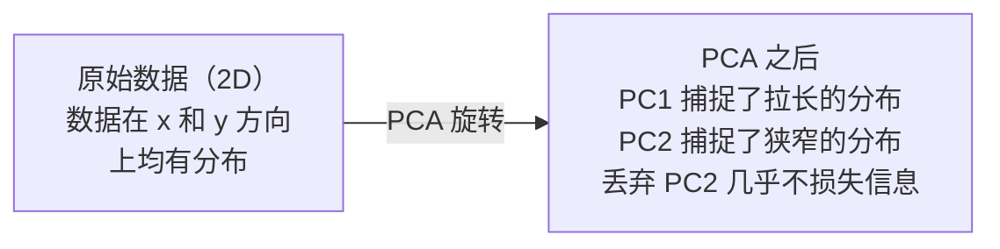

# 降维（Dimensionality Reduction）

> 高维数据蕴含结构。只需从正确的角度观察，便能发现它。

**类型：** 构建
**语言：** Python
**前置知识：** 阶段1，课程01（线性代数直觉），02（向量、矩阵与运算），03（特征值与特征向量），06（概率与分布）
**预计时间：** ~90分钟

## 学习目标

- 从零实现主成分分析（PCA）：数据中心化、计算协方差矩阵、特征分解、投影
- 使用解释方差比（Explained Variance Ratio）和肘部法（Elbow Method）选择主成分数量
- 对比 PCA、t-SNE 和 UMAP 在 MNIST 手写数字二维可视化中的表现，并解释各自的权衡
- 应用带 RBF 核的核主成分分析（Kernel PCA）来分离标准 PCA 无法处理的非线性数据结构

## 问题

你有一个数据集，每个样本包含 784 个特征。这些特征可能是手写数字的像素值，也可能是基因表达水平，或者是用户行为信号。你无法可视化 784 维数据，无法绘制它们，甚至无法思考它们。

但其中大部分特征都是冗余的。真正的信息存在于一个更小的表面上。一个手写的“7”并不需要 784 个独立的数字来描述它。它只需要几个：笔画的倾斜角度、横线的长度、倾斜程度。其余的都是噪声。

降维（Dimensionality reduction）就是为了找到那个更小的表面。它把你的 784 维数据压缩到 2 维、10 维或 50 维，同时保留关键的结构信息。

## 概念

### 维数灾难（Curse of Dimensionality）

高维空间违反直觉。随着维度增长，三件事会出问题。

**距离变得无意义。** 在高维空间中，任意两个随机点之间的距离会趋近于同一个值。如果每个点与其他所有点的距离都大致相等，那么最近邻搜索就失效了。

```
维度    平均距离比（随机点之间的最大/最小距离）
2        ~5.0
10       ~1.8
100      ~1.2
1000     ~1.02
```

**体积集中在角落。** d 维单位超立方体有 2^d 个角落。在 100 维空间中，几乎所有的体积都集中在角落，远离中心。数据点会扩散到边缘，内部区域的数据变得稀疏。

**你需要指数级增长的数据。** 为了保持空间中相同的样本密度，从 2 维增加到 20 维，你需要 10^18 倍的数据。你永远不会有足够的数据。降维可以让数据密度恢复到可操作的水平。

### PCA：找到关键方向

主成分分析（Principal Component Analysis, PCA）找到数据方差最大的方向。它旋转你的坐标系，使第一个轴捕捉到最大方差，第二个轴捕捉到次大方差，以此类推。

算法步骤：

```
1. 数据中心化        （每个特征减去均值）
2. 计算协方差        （特征之间的协同变化关系）
3. 特征分解          （找到主方向）
4. 按特征值排序      （最大方差优先）
5. 投影              （保留前 k 个特征向量，丢弃其余）
```

为什么要进行特征分解？协方差矩阵是对称且半正定的。它的特征向量是特征空间中的正交方向。特征值告诉你每个方向捕捉了多少方差。最大特征值对应的特征向量指向方差最大的方向。



- **PCA 之前：** 数据云沿 x 轴和 y 轴的对角线方向散布
- **PCA 之后：** 坐标系旋转，使 PC1 与最大方差方向（拉长的分布）对齐，PC2 与最小方差方向（狭窄的分布）对齐
- **降维：** 丢弃 PC2 将数据投影到 PC1 上，丢失极少的信息

### 解释方差比（Explained Variance Ratio）

每个主成分捕捉总方差的一部分。解释方差比告诉你这一部分有多大。

```
成分       特征值    解释比率    累积
PC1          4.73      0.473      0.473
PC2          2.51      0.251      0.724
PC3          1.12      0.112      0.836
PC4          0.89      0.089      0.925
...
```

当累积解释方差达到 0.95 时，你就知道这么多成分包含了 95% 的信息。此后的成分大多是噪声。

### 选择主成分数量

三种策略：

1. **阈值法。** 保留足够多的成分，解释 90-95% 的方差。
2. **肘部法。** 绘制每个成分的解释方差图，寻找急剧下降的点。
3. **下游性能法。** 将 PCA 作为预处理步骤，遍历 k 并测量模型准确率。最佳 k 是准确率趋于平稳的点。

### t-SNE：保持邻居关系

t-分布随机邻域嵌入（t-Distributed Stochastic Neighbor Embedding, t-SNE）专为可视化设计。它将高维数据映射到二维（或三维），同时保持点在原始空间中的相邻关系。

直觉是：在原始空间中，基于点之间的距离计算点对之间的概率分布。近的点概率高，远的点概率低。然后找到一个二维布局，使得同样的概率分布成立。在 784 维空间中相邻的点，在二维中仍然相邻。

t-SNE 的关键特性：
- **非线性。** 它可以展开 PCA 无法处理的复杂流形。
- **随机性。** 不同运行会产生不同布局。
- **困惑度（Perplexity）参数**控制考虑多少个邻居（典型范围：5-50）。
- 输出中簇之间的距离没有意义。只有簇本身有意义。
- 在大数据集上很慢。默认 O(n^2)。

### UMAP：更快，更好的全局结构

统一流形近似与投影（Uniform Manifold Approximation and Projection, UMAP）的工作方式与 t-SNE 类似，但有两大优势：
- 更快。它使用近似最近邻图，而不是计算所有点对之间的距离。
- 更好的全局结构。输出中簇的相对位置通常比 t-SNE 更有意义。

UMAP 在高维空间中构建一个加权图（“模糊拓扑表示”），然后找到一个尽可能保留该图的低维布局。

关键参数：
- `n_neighbors`：定义局部结构的邻居数量（类似困惑度）。值越大，保留的全局结构越多。
- `min_dist`：输出中点之间聚集的紧密程度。值越小，产生的簇越密集。

### 何时使用哪种方法

| 方法 | 使用场景 | 保留什么 | 速度 |
|------|----------|----------|------|
| PCA | 训练前的预处理 | 全局方差 | 快速（精确），适用于百万级样本 |
| PCA | 快速探索性可视化 | 线性结构 | 快速 |
| t-SNE | 出版级二维图 | 局部邻域 | 慢（理想 <10k 样本） |
| UMAP | 大规模二维可视化 | 局部 + 部分全局结构 | 中等（可处理百万级） |
| PCA | 模型的特征降维 | 按方差排序的特征 | 快速 |
| t-SNE / UMAP | 理解簇结构 | 簇分离 | 中到慢 |

经验法则：预处理和数据压缩用 PCA。需要可视化二维结构时用 t-SNE 或 UMAP。

### 核主成分分析（Kernel PCA）

标准 PCA 寻找线性子空间。它旋转你的坐标系并丢弃轴。但如果数据位于非线性流形上呢？二维中的圆形无法用任何直线分离。标准 PCA 帮不上忙。

核 PCA 在由核函数诱导的高维特征空间中应用 PCA，而无需显式计算该空间中的坐标。这就是核技巧（Kernel Trick）——与支持向量机（SVM）背后的思想相同。

算法：
1. 计算核矩阵 K，其中 K_ij = k(x_i, x_j)
2. 在特征空间中对核矩阵中心化
3. 对中心化的核矩阵进行特征分解
4. 顶部特征向量（按 1/sqrt(特征值) 缩放）即为投影

常用核函数：

| 核 | 公式 | 适用场景 |
|----|------|----------|
| RBF（高斯） | exp(-gamma * \|\|x - y\|\|^2) | 大多数非线性数据，平滑流形 |
| 多项式 | (x . y + c)^d | 多项式关系 |
| Sigmoid | tanh(alpha * x . y + c) | 类似神经网络的映射 |

何时使用核 PCA 与标准 PCA：

| 准则 | 标准 PCA | 核 PCA |
|------|----------|--------|
| 数据结构 | 线性子空间 | 非线性流形 |
| 速度 | O(min(n^2 d, d^2 n)) | O(n^2 d + n^3) |
| 可解释性 | 成分是特征的线性组合 | 成分缺少直接的特征解释 |
| 可扩展性 | 适用于百万级样本 | 核矩阵为 n x n，受内存限制 |
| 重构 | 直接逆变换 | 需要预映像近似 |

经典例子：二维同心圆。两个点环，内环和外环。标准 PCA 将两者投影到同一根线上——对分类无用。使用 RBF 核的核 PCA 将内圆和外圆映射到不同区域，使它们变得线性可分离。

### 重构误差（Reconstruction Error）

你的降维效果如何？你将 784 维压缩到 50 维，丢失了什么？

通过以下方式度量重构误差：
1. 将数据投影到 k 维：X_reduced = X @ W_k
2. 重构：X_hat = X_reduced @ W_k^T
3. 计算均方误差（MSE）：mean((X - X_hat)^2)

对于 PCA，重构误差与解释方差有清晰的关系：

```
重构误差 = 未包含的特征值之和
总方差 = 所有特征值之和
丢失比例 = (丢弃的特征值之和) / (所有特征值之和)
```

每个成分的解释方差比为：

```
explained_ratio_k = eigenvalue_k / sum(all eigenvalues)
```

绘制累积解释方差与主成分数量的关系图，得到“肘部”曲线。正确的主成分数量是：
- 曲线变平（收益递减）的地方
- 累积方差超过你的阈值（通常 0.90 或 0.95）的地方
- 下游任务性能趋于平稳的地方

重构误差在选择 k 之外也很有用。你可以用它进行异常检测：重构误差高的样本是不符合所学子空间的异常值。这是生产系统中基于 PCA 的异常检测的基础。

## 动手构建

### 步骤 1：从零实现 PCA

```python
import numpy as np

class PCA:
    def __init__(self, n_components):
        self.n_components = n_components
        self.components = None
        self.mean = None
        self.eigenvalues = None
        self.explained_variance_ratio_ = None

    def fit(self, X):
        self.mean = np.mean(X, axis=0)
        X_centered = X - self.mean

        cov_matrix = np.cov(X_centered, rowvar=False)

        eigenvalues, eigenvectors = np.linalg.eigh(cov_matrix)

        sorted_idx = np.argsort(eigenvalues)[::-1]
        eigenvalues = eigenvalues[sorted_idx]
        eigenvectors = eigenvectors[:, sorted_idx]

        self.components = eigenvectors[:, :self.n_components].T
        self.eigenvalues = eigenvalues[:self.n_components]
        total_var = np.sum(eigenvalues)
        self.explained_variance_ratio_ = self.eigenvalues / total_var

        return self

    def transform(self, X):
        X_centered = X - self.mean
        return X_centered @ self.components.T

    def fit_transform(self, X):
        self.fit(X)
        return self.transform(X)
```

### 步骤 2：在合成数据上测试

```python
np.random.seed(42)
n_samples = 500

t = np.random.uniform(0, 2 * np.pi, n_samples)
x1 = 3 * np.cos(t) + np.random.normal(0, 0.2, n_samples)
x2 = 3 * np.sin(t) + np.random.normal(0, 0.2, n_samples)
x3 = 0.5 * x1 + 0.3 * x2 + np.random.normal(0, 0.1, n_samples)

X_synthetic = np.column_stack([x1, x2, x3])

pca = PCA(n_components=2)
X_reduced = pca.fit_transform(X_synthetic)

print(f"原始形状: {X_synthetic.shape}")
print(f"降维后形状:  {X_reduced.shape}")
print(f"解释方差比: {pca.explained_variance_ratio_}")
print(f"捕获的总方差: {sum(pca.explained_variance_ratio_):.4f}")
```

### 步骤 3：二维展示 MNIST 手写数字

```python
from sklearn.datasets import fetch_openml

mnist = fetch_openml("mnist_784", version=1, as_frame=False, parser="auto")
X_mnist = mnist.data[:5000].astype(float)
y_mnist = mnist.target[:5000].astype(int)

pca_mnist = PCA(n_components=50)
X_pca50 = pca_mnist.fit_transform(X_mnist)
print(f"50 个成分捕获了 {sum(pca_mnist.explained_variance_ratio_):.2%} 的方差")

pca_2d = PCA(n_components=2)
X_pca2d = pca_2d.fit_transform(X_mnist)
print(f"2 个成分捕获了 {sum(pca_2d.explained_variance_ratio_):.2%} 的方差")
```

### 步骤 4：与 sklearn 对比

```python
from sklearn.decomposition import PCA as SklearnPCA
from sklearn.manifold import TSNE

sklearn_pca = SklearnPCA(n_components=2)
X_sklearn_pca = sklearn_pca.fit_transform(X_mnist)

print(f"\n我们自己实现的 PCA 解释方差:     {pca_2d.explained_variance_ratio_}")
print(f"Sklearn PCA 解释方差: {sklearn_pca.explained_variance_ratio_}")

diff = np.abs(np.abs(X_pca2d) - np.abs(X_sklearn_pca))
print(f"最大绝对差异: {diff.max():.10f}")

tsne = TSNE(n_components=2, perplexity=30, random_state=42)
X_tsne = tsne.fit_transform(X_mnist)
print(f"\nt-SNE 输出形状: {X_tsne.shape}")
```

### 步骤 5：UMAP 对比

```python
try:
    from umap import UMAP

    reducer = UMAP(n_components=2, n_neighbors=15, min_dist=0.1, random_state=42)
    X_umap = reducer.fit_transform(X_mnist)
    print(f"UMAP 输出形状: {X_umap.shape}")
except ImportError:
    print("安装 umap-learn: pip install umap-learn")
```

## 实际运用

将 PCA 用作分类器前的预处理：

```python
from sklearn.decomposition import PCA as SklearnPCA
from sklearn.linear_model import LogisticRegression
from sklearn.model_selection import train_test_split
from sklearn.metrics import accuracy_score

X_train, X_test, y_train, y_test = train_test_split(
    X_mnist, y_mnist, test_size=0.2, random_state=42
)

results = {}
for k in [10, 30, 50, 100, 200]:
    pca_k = SklearnPCA(n_components=k)
    X_tr = pca_k.fit_transform(X_train)
    X_te = pca_k.transform(X_test)

    clf = LogisticRegression(max_iter=1000, random_state=42)
    clf.fit(X_tr, y_train)
    acc = accuracy_score(y_test, clf.predict(X_te))
    var_captured = sum(pca_k.explained_variance_ratio_)
    results[k] = (acc, var_captured)
    print(f"k={k:>3d}  准确率={acc:.4f}  方差={var_captured:.4f}")
```

性能在远未达到 784 维之前就趋于平稳。那个平稳点就是你的操作点。

## 产出

本课程产生：
- `outputs/skill-dimensionality-reduction.md` - 一项技能：针对给定任务选择合适的降维技术

## 练习

1. 修改 PCA 类以支持 `inverse_transform`。分别从 10、50 和 200 个成分重构 MNIST 数字。打印每个成分数量的重构误差（与原始数据的均方差异）。

2. 在相同的 MNIST 子集上运行 t-SNE，分别设置困惑度为 5、30 和 100。描述输出如何变化。为什么困惑度会影响簇的紧密程度？

3. 取一个包含 50 个特征但只有 5 个有信息量的数据集（使用 `sklearn.datasets.make_classification` 生成）。应用 PCA 并检查解释方差曲线是否能正确识别数据实际上是 5 维的。

## 关键术语

| 术语 | 人们常说的 | 实际含义 |
|------|------------|----------|
| 维数灾难（Curse of Dimensionality） | “特征太多” | 随着维度