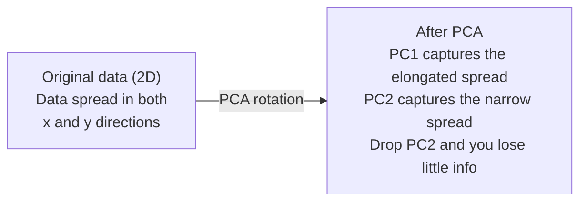

# Dimensionality Reduction

> High-dimensional data has structure. You find it by looking from the right angle.

** 类型：** 构建
** 语言：** Python
** 先决条件：** 第1阶段，第01课（线性代数直觉）、02课（载体、矩阵和运算）、03课（特征值和特征载体）、06课（概率和分布）
** 时间：** ~90分钟

## Learning Objectives

- 从头开始实施PCA：中心数据、计算协方差矩阵、特征分解和项目
- 使用解释方差比和肘部法选择主成分数
- 比较PCA、t-SNE和UMAP以2D形式可视化MNIST数字并解释它们的权衡
- Apply kernel PCA with an RBF kernel to separate nonlinear data structures that standard PCA cannot handle

## The Problem

You have a dataset with 784 features per sample. Maybe it is pixel values of handwritten digits. Maybe it is gene expression levels. Maybe it is user behavior signals. You cannot visualize 784 dimensions. You cannot plot them. You cannot even think about them.

但这784个功能中的大多数都是多余的。实际信息存在于一个小得多的表面上。手写的“7”不需要784个独立数字来描述它。它需要一些：笔画的角度、横梁的长度、倾斜程度。其余的都是噪音。

Dimensionality reduction finds that smaller surface. It takes your 784-dimensional data and compresses it to 2, 10, or 50 dimensions while keeping the structure that matters.

## The Concept

### The curse of dimensionality

多维空间是不直观的。随着维度的增长，三件事会破裂。

** 距离变得毫无意义。**在高维度中，任何两个随机点之间的距离都会收敛到相同的值。如果每个点与其他点的距离大致相同，最近邻搜索就会停止工作。

```
Dimension    Avg distance ratio (max/min between random points)
2            ~5.0
10           ~1.8
100          ~1.2
1000         ~1.02
```

**Volume concentrates in corners.** A unit hypercube in d dimensions has 2^d corners. In 100 dimensions, nearly all the volume is in the corners, far from the center. Data points spread to the edges and your models starve for data in the interior.

** 您需要指数级更多的数据。**为了在空间中保持相同的样本密度，从2D到20 D意味着您需要10 ' 18倍的数据。你永远不会得到足够的。减少维度可以使数据密度恢复到可行的水平。

### PCA: find the directions that matter

主成分分析（PCA）查找数据变化最大的轴。它会旋转您的坐标系，以便第一个轴捕获最大的方差，第二个轴捕获次大的方差，等等。

算法：

```
1. Center the data        (subtract the mean from each feature)
2. Compute covariance     (how features move together)
3. Eigendecomposition     (find the principal directions)
4. Sort by eigenvalue     (biggest variance first)
5. Project               (keep top k eigenvectors, drop the rest)
```

为什么是特征分解？协方差矩阵是对称的、半正定的。其特征量是特征空间中的垂直方向。特征值告诉您每个方向捕获了多少方差。具有最大特征值的特征量指向最大方差方向。



- **Before PCA:** Data cloud is spread diagonally across both x and y axes
- **After PCA:** Coordinate system is rotated so PC1 aligns with the direction of maximum variance (elongated spread) and PC2 aligns with the direction of minimum variance (narrow spread)
- ** 简化：** 删除PC 2会将数据投影到PC 1上，丢失的信息很少

### Explained variance ratio

每个主成分捕获总方差的一小部分。解释的方差比告诉您有多少。

```
Component    Eigenvalue    Explained ratio    Cumulative
PC1          4.73          0.473              0.473
PC2          2.51          0.251              0.724
PC3          1.12          0.112              0.836
PC4          0.89          0.089              0.925
...
```

当累积解释方差达到0.95时，您就知道许多组件捕获了95%的信息。之后的一切大部分都是噪音。

### Choosing the number of components

三个策略：

1. **Threshold.** Keep enough components to explain 90-95% of the variance.
2. **Elbow method.** Plot explained variance per component. Look for a sharp drop-off.
3. ** 下游性能。**使用PCA作为预处理。扫描k并测量模型的准确性。最好的k是准确性达到平稳状态的地方。

### t-SNE: preserve neighborhoods

t-分布式随机邻居嵌入（t-SNE）专为可视化而设计。它将多维数据映射到2D（或3D），同时保留哪些点彼此靠近。

The intuition: in the original space, compute a probability distribution over pairs of points based on their distances. Near points get high probability. Far points get low probability. Then find a 2D arrangement where the same probability distribution holds. Points that were neighbors in 784 dimensions stay neighbors in 2D.

t-SNE的关键属性：
- 非线性的。它可以展开PCA无法展开的复杂多管齐下。
- Stochastic. Different runs produce different layouts.
- Perplexity参数控制考虑多少个邻居（典型范围：5-50）。
- 输出中集群之间的距离没有意义。只有集群本身才是。
- Slow on large datasets. O(n^2) by default.

### UMAP: faster, better global structure

Uniform Manifold Approximation and Projection (UMAP) works similarly to t-SNE but with two advantages:
- 快它使用大约最近邻图，而不是计算所有成对距离。
- 更好的全球结构。输出中聚类的相对位置往往比t-SNE中更有意义。

UMAP在多维空间中构建加权图（“模糊拓扑表示”），然后找到尽可能保留该图的低维布局。

关键参数：
- `n_neighbors`: how many neighbors define local structure (similar to perplexity). Higher values preserve more global structure.
- `min_dist`: how tightly points pack together in the output. Lower values create denser clusters.

### When to use which

| Method | 用例 | 保留 | Speed |
|--------|----------|-----------|-------|
| PCA | Preprocessing before training | 全球方差 | Fast (exact), works on millions of samples |
| PCA | 快速探索性可视化 | 线性结构 | 快速 |
| t-SNE | 出版质量的2D图 | 当地社区 | 缓慢（理想样本<10 k） |
| UMAP | 大规模2D可视化 | 本地+一些全球结构 | 中等（处理数百万美元） |
| PCA | 模型的功能简化 | 方差排名特征 | 快速 |
| t-SNE / UMAP | 了解集群结构 | 聚类分离 | 中等到缓慢 |

经验法则：使用PCA进行预处理和数据压缩。当您需要以2D形式可视化结构时，使用t-SNE或UMAP。

### Kernel PCA

标准PCA查找线性子空间。它旋转您的坐标系并下降轴。但如果数据位于非线性流上怎么办？2D中的圆不能被任何线分开。标准PCA无济于事。

核心PCA在由核心函数诱导的多维特征空间中应用PCA，而无需显式计算该空间中的坐标。这是内核技巧--与支持者服务器背后的想法相同。

算法：
1. 计算核矩阵K，其中K_aj = k（x_i，x_j）
2. 将核心矩阵置于特征空间的中心
3. 特征分解中心核矩阵
4. 顶部的特征量（按1/平方（特征值）缩放）是投影

常见内核功能：

| 内核 | 式 | 有利于 |
|--------|---------|----------|
| RBS（高斯） | BEP（-gamma * \ | \ | x - y\ | \ | #2） | 大多数非线性数据，光滑的多边形 |
| 多项式 | （x。y + c）' d | 多项关系 |
| 乙状 | tanh（Alpha * x . y + c） | 类神经网络映射 |

何时使用核心PCA与标准PCA：

| 标准 | 标准PCA | 核PCA |
|-----------|-------------|------------|
| 数据结构 | 线性子空间 | 非线性流形 |
| 速度 | O（min（n#2 d，d#2 n）） | O（n#2 d + n#3） |
| 解释性 | 组件是特征的线性组合 | 组件缺乏直接的特征解释 |
| 扩展性 | 处理数百万个样本 | 核矩阵为n x n，内存有限 |
| 重建 | 直接逆变换 | 需要预图像逼近 |

经典示例：2D中的同心圆。两个点环，一个在另一个里面。标准PCA将两者投影到同一条线上--对于分类来说无用。具有RBS核的核PCA将内圆和外圆映射到不同的区域，使它们线性可分离。

### Reconstruction Error

你的维度缩减有多好？您将784个维度压缩为50个维度。你失去了什么？

测量重建误差：
1. 将数据投影到k个维度：X_reduced = X @ W_k
2. 重建：X_hat = X_reduced @ W_k ' T
3. 计算SSE：平均值（（X - X_hat）#2）

对于PCA，重建误差与解释方差有明确的关系：

```
Reconstruction error = sum of eigenvalues NOT included
Total variance = sum of ALL eigenvalues
Fraction lost = (sum of dropped eigenvalues) / (sum of all eigenvalues)
```

每个成分的解释方差比为：

```
explained_ratio_k = eigenvalue_k / sum(all eigenvalues)
```

将累积解释方差与组件数量绘制为“肘部”曲线。正确数量的组件是：
- 曲线消失（收益递减）
- 累积方差超过阈值（通常为0.90或0.95）
- 下游任务绩效停滞

除了选择k之外，重建误差也很有用。您可以使用它进行异常检测：具有高重建误差的样本是不符合学习子空间的离群值。这是生产系统中基于PCA的异常检测的基础。

## Build It

### Step 1: PCA from scratch

```python
import numpy as np

class PCA:
    def __init__(self, n_components):
        self.n_components = n_components
        self.components = None
        self.mean = None
        self.eigenvalues = None
        self.explained_variance_ratio_ = None

    def fit(self, X):
        self.mean = np.mean(X, axis=0)
        X_centered = X - self.mean

        cov_matrix = np.cov(X_centered, rowvar=False)

        eigenvalues, eigenvectors = np.linalg.eigh(cov_matrix)

        sorted_idx = np.argsort(eigenvalues)[::-1]
        eigenvalues = eigenvalues[sorted_idx]
        eigenvectors = eigenvectors[:, sorted_idx]

        self.components = eigenvectors[:, :self.n_components].T
        self.eigenvalues = eigenvalues[:self.n_components]
        total_var = np.sum(eigenvalues)
        self.explained_variance_ratio_ = self.eigenvalues / total_var

        return self

    def transform(self, X):
        X_centered = X - self.mean
        return X_centered @ self.components.T

    def fit_transform(self, X):
        self.fit(X)
        return self.transform(X)
```

### Step 2: Test on synthetic data

```python
np.random.seed(42)
n_samples = 500

t = np.random.uniform(0, 2 * np.pi, n_samples)
x1 = 3 * np.cos(t) + np.random.normal(0, 0.2, n_samples)
x2 = 3 * np.sin(t) + np.random.normal(0, 0.2, n_samples)
x3 = 0.5 * x1 + 0.3 * x2 + np.random.normal(0, 0.1, n_samples)

X_synthetic = np.column_stack([x1, x2, x3])

pca = PCA(n_components=2)
X_reduced = pca.fit_transform(X_synthetic)

print(f"Original shape: {X_synthetic.shape}")
print(f"Reduced shape:  {X_reduced.shape}")
print(f"Explained variance ratios: {pca.explained_variance_ratio_}")
print(f"Total variance captured: {sum(pca.explained_variance_ratio_):.4f}")
```

### Step 3: MNIST digits in 2D

```python
from sklearn.datasets import fetch_openml

mnist = fetch_openml("mnist_784", version=1, as_frame=False, parser="auto")
X_mnist = mnist.data[:5000].astype(float)
y_mnist = mnist.target[:5000].astype(int)

pca_mnist = PCA(n_components=50)
X_pca50 = pca_mnist.fit_transform(X_mnist)
print(f"50 components capture {sum(pca_mnist.explained_variance_ratio_):.2%} of variance")

pca_2d = PCA(n_components=2)
X_pca2d = pca_2d.fit_transform(X_mnist)
print(f"2 components capture {sum(pca_2d.explained_variance_ratio_):.2%} of variance")
```

### Step 4: Compare with sklearn

```python
from sklearn.decomposition import PCA as SklearnPCA
from sklearn.manifold import TSNE

sklearn_pca = SklearnPCA(n_components=2)
X_sklearn_pca = sklearn_pca.fit_transform(X_mnist)

print(f"\nOur PCA explained variance:     {pca_2d.explained_variance_ratio_}")
print(f"Sklearn PCA explained variance: {sklearn_pca.explained_variance_ratio_}")

diff = np.abs(np.abs(X_pca2d) - np.abs(X_sklearn_pca))
print(f"Max absolute difference: {diff.max():.10f}")

tsne = TSNE(n_components=2, perplexity=30, random_state=42)
X_tsne = tsne.fit_transform(X_mnist)
print(f"\nt-SNE output shape: {X_tsne.shape}")
```

### Step 5: UMAP comparison

```python
try:
    from umap import UMAP

    reducer = UMAP(n_components=2, n_neighbors=15, min_dist=0.1, random_state=42)
    X_umap = reducer.fit_transform(X_mnist)
    print(f"UMAP output shape: {X_umap.shape}")
except ImportError:
    print("Install umap-learn: pip install umap-learn")
```

## Use It

PCA作为分类器之前的预处理：

```python
from sklearn.decomposition import PCA as SklearnPCA
from sklearn.linear_model import LogisticRegression
from sklearn.model_selection import train_test_split
from sklearn.metrics import accuracy_score

X_train, X_test, y_train, y_test = train_test_split(
    X_mnist, y_mnist, test_size=0.2, random_state=42
)

results = {}
for k in [10, 30, 50, 100, 200]:
    pca_k = SklearnPCA(n_components=k)
    X_tr = pca_k.fit_transform(X_train)
    X_te = pca_k.transform(X_test)

    clf = LogisticRegression(max_iter=1000, random_state=42)
    clf.fit(X_tr, y_train)
    acc = accuracy_score(y_test, clf.predict(X_te))
    var_captured = sum(pca_k.explained_variance_ratio_)
    results[k] = (acc, var_captured)
    print(f"k={k:>3d}  accuracy={acc:.4f}  variance={var_captured:.4f}")
```

在784维之前，性能就处于平稳状态。这个平台是您的工作点。

## Ship It

本课产生：
- '输出/skill-dimensionality-reduction.md '-为给定任务选择正确的维度缩减技术的技能

## Exercises

1. 修改PCA类以支持“inverate_transform”。从10、50和200个组件重建MNIST数字。打印每个重建误差（与原始误差的均方差）。

2. 对困惑度值为5、30和100的相同MNIST子集运行t-SNE。描述输出如何变化。为什么困惑会影响集群紧密度？

3. 取一个具有50个特征的数据集，其中只有5个具有信息性（使用“sklearn.datasets.make_classification”生成一个特征）。应用PCA并检查解释的方差曲线是否正确识别数据实际上是5维的。

## Key Terms

| Term | 别人怎么说 | 它实际上意味着什么 |
|------|----------------|----------------------|
| 维数灾难 | “功能太多” | 随着维度的增长，距离、容量和数据密度的表现都违反直觉。模型需要指数级更多的数据来补偿。 |
| PCA | “缩小维度” | 旋转坐标系，使轴与最大方差的方向对齐，然后删除低方差轴。 |
| 主成分 | “一个重要方向” | 协方差矩阵的特征量。特征空间中数据变化最大的方向。 |
| 解释方差比 | “此组件包含多少信息” | 一个主成分捕获的总方差的分数。将前k个比率相加，看看保留多少k个分量。 |
| 协方差矩阵 | “功能如何相互关联” | 一个对称矩阵，其中元素（i，j）测量特征i和特征j如何一起移动。对角项是单个方差。 |
| t-SNE | “那个集群情节” | 一种非线性方法，通过保留成对邻居概率将多维数据映射到2D。适合可视化，不适合预处理。 |
| UMAP | “更快的t-SNE” | 一种基于拓扑数据分析的非线性方法。保留本地和一些全球结构。规模比t-SNE更好。 |
| 困惑 | “一个t-SNE旋钮” | 控制每个点考虑的邻居的有效数量。低困惑感关注的是非常局部的结构。高度困惑捕捉更广泛的模式。 |
| 歧管 | “数据赖以生存的表面” | 嵌入更高维度空间的低维度表面。一张在3D中皱巴巴的纸就是2D集合。 |

## Further Reading

- [on主成分分析]（https：//arxiv.org/ab/1404.1100）（Shlens）-从头开始清晰地推导PCA
- [How有效使用t-SNE]（https：//guard.pub/2016/misread-tsne/）（Wattenberg等人）- t-SNE陷阱和参数选择的交互式指南
- [UMAP文档]（https：//umap-learn.readthedocs.io/）-来自UMAP作者的理论和实践指导
