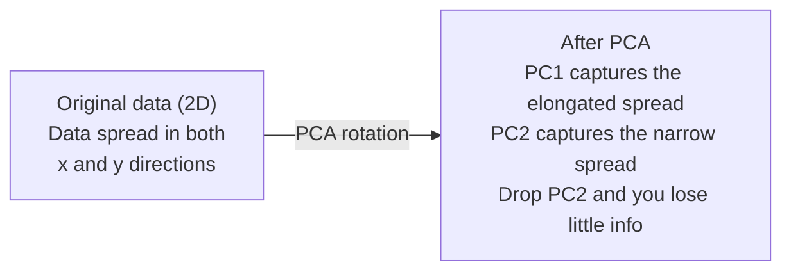

# 10 · 降维

> 高维数据自有其结构。只要从正确的角度去看，你就能发现它。

**类型：** 实践构建
**语言：** Python
**前置：** 第 1 阶段，第 01 课（线性代数直觉）、02 课（向量、矩阵与运算）、03 课（特征值与特征向量）、06 课（概率与分布）
**时长：** 约 90 分钟

## 学习目标

- 从零实现 PCA：对数据做中心化、计算协方差矩阵、做特征分解，并完成投影
- 使用「解释方差比（explained variance ratio）」和「肘部法则（elbow method）」来选择主成分的数量
- 对比 PCA、t-SNE 和 UMAP 在二维可视化 MNIST 手写数字上的表现，并解释它们各自的权衡
- 应用带 RBF 核的「核 PCA（kernel PCA）」，分离标准 PCA 无法处理的非线性数据结构

## 问题所在

你有一个数据集，每个样本有 784 个特征。也许它是手写数字的像素值，也许是基因表达水平，也许是用户行为信号。你无法可视化 784 个维度，无法把它们画出来，甚至无法去思考它们。

但这 784 个特征中的大部分是冗余的。真正的信息存在于一个小得多的曲面上。一个手写的「7」并不需要 784 个独立的数字来描述，它只需要几个：笔画的角度、横划的长度、它倾斜的程度。其余的都是噪声。

降维就是要找到那个更小的曲面。它把你 784 维的数据压缩到 2 维、10 维或 50 维，同时保留真正重要的结构。

## 核心概念

### 维度灾难

高维空间是反直觉的。随着维度增长，有三件事会崩坏。

**距离变得毫无意义。** 在高维空间中，任意两个随机点之间的距离都会收敛到同一个值。如果每个点到其他每个点的距离都大致相同，那么最近邻搜索就失效了。

```
Dimension    Avg distance ratio (max/min between random points)
2            ~5.0
10           ~1.8
100          ~1.2
1000         ~1.02
```

**体积集中在角落。** 一个 d 维单位超立方体有 2^d 个角。在 100 维中，几乎所有体积都集中在角落，远离中心。数据点向边缘扩散，而你的模型在内部却得不到足够的数据。

**你需要指数级增长的数据量。** 要在一个空间中维持相同的样本密度，从 2 维升到 20 维意味着你需要多出 10^18 倍的数据。你永远不会有足够的数据。降维能把数据密度拉回到一个可处理的水平。

### PCA：找到重要的方向

「主成分分析（Principal Component Analysis，PCA）」会找出数据变化最大的那些坐标轴。它旋转你的坐标系，使第一个轴捕获最大的方差，第二个轴捕获次大的方差，依此类推。

算法流程：

```
1. Center the data        (subtract the mean from each feature)
2. Compute covariance     (how features move together)
3. Eigendecomposition     (find the principal directions)
4. Sort by eigenvalue     (biggest variance first)
5. Project               (keep top k eigenvectors, drop the rest)
```

为什么要做特征分解？协方差矩阵是对称且半正定的。它的特征向量是特征空间中相互正交的方向。特征值告诉你每个方向捕获了多少方差。特征值最大的特征向量指向方差最大的方向。



- **PCA 之前：** 数据云沿对角方向同时在 x 轴和 y 轴上铺开
- **PCA 之后：** 坐标系被旋转，使 PC1 对齐方差最大的方向（拉长的扩散），PC2 对齐方差最小的方向（狭窄的扩散）
- **降维：** 舍弃 PC2，将数据投影到 PC1 上，几乎不损失信息

### 解释方差比

每个主成分都捕获了总方差的一部分。解释方差比告诉你这一部分有多大。

```
Component    Eigenvalue    Explained ratio    Cumulative
PC1          4.73          0.473              0.473
PC2          2.51          0.251              0.724
PC3          1.12          0.112              0.836
PC4          0.89          0.089              0.925
...
```

当累计解释方差达到 0.95 时，你就知道这么多个主成分已经捕获了 95% 的信息。在那之后的一切大多是噪声。

### 选择主成分的数量

三种策略：

1. **阈值法。** 保留足够多的主成分，使其解释 90%–95% 的方差。
2. **肘部法则。** 绘制每个主成分的解释方差。寻找一个陡然下降的拐点。
3. **下游性能法。** 把 PCA 作为预处理。扫描 k 值并测量你模型的准确率。最佳的 k 就在准确率趋于平稳的地方。

### t-SNE：保留邻域关系

「t 分布随机邻域嵌入（t-Distributed Stochastic Neighbor Embedding，t-SNE）」是为可视化而设计的。它把高维数据映射到 2 维（或 3 维），同时保留哪些点彼此相邻的关系。

直觉如下：在原始空间中，基于点对之间的距离计算一个概率分布。相邻的点获得高概率，相距远的点获得低概率。然后找到一个二维排布，使其满足相同的概率分布。在 784 维中互为邻居的点，在 2 维中仍然是邻居。

t-SNE 的关键特性：
- 非线性。它能展开 PCA 无法处理的复杂流形。
- 随机性。不同的运行会产生不同的布局。
- 困惑度（perplexity）参数控制要考虑多少个邻居（典型范围：5–50）。
- 输出中各簇之间的距离没有意义。只有簇本身才有意义。
- 在大数据集上很慢。默认是 O(n^2) 复杂度。

### UMAP：更快，全局结构更好

「均匀流形近似与投影（Uniform Manifold Approximation and Projection，UMAP）」的工作方式与 t-SNE 类似，但有两个优势：
- 更快。它使用近似最近邻图，而非计算所有成对距离。
- 全局结构更好。输出中各簇的相对位置往往比 t-SNE 更有意义。

UMAP 在高维空间中构建一个加权图（即「模糊拓扑表示」），然后找到一个尽可能保留该图结构的低维布局。

关键参数：
- `n_neighbors`：用多少个邻居来定义局部结构（类似于 perplexity）。值越大越能保留全局结构。
- `min_dist`：输出中点之间堆叠得有多紧密。值越小，簇越密集。

### 何时用哪一种

| 方法 | 适用场景 | 保留的内容 | 速度 |
|--------|----------|-----------|-------|
| PCA | 训练前的预处理 | 全局方差 | 快（精确解），可处理数百万样本 |
| PCA | 快速的探索性可视化 | 线性结构 | 快 |
| t-SNE | 出版级质量的二维图 | 局部邻域 | 慢（理想情况下 < 1 万样本） |
| UMAP | 大规模的二维可视化 | 局部结构 + 部分全局结构 | 中等（可处理数百万样本） |
| PCA | 为模型做特征降维 | 按方差排序的特征 | 快 |
| t-SNE / UMAP | 理解簇结构 | 簇的分离度 | 中等到慢 |

经验法则：用 PCA 做预处理和数据压缩。当你需要在二维中可视化结构时，用 t-SNE 或 UMAP。

### 核 PCA

标准 PCA 找的是线性子空间。它旋转坐标系并舍弃某些轴。但如果数据位于一个非线性流形上呢？二维中的一个圆无法被任何直线分开。标准 PCA 帮不上忙。

核 PCA 在由「核函数（kernel function）」诱导出的高维特征空间中应用 PCA，而无需显式计算该空间中的坐标。这就是「核技巧（kernel trick）」——与 SVM 背后的思想相同。

算法流程：
1. 计算核矩阵 K，其中 K_ij = k(x_i, x_j)
2. 在特征空间中对核矩阵做中心化
3. 对中心化后的核矩阵做特征分解
4. 排在前列的特征向量（按 1/sqrt(eigenvalue) 缩放）即为投影结果

常见的核函数：

| 核函数 | 公式 | 适用于 |
|--------|---------|----------|
| RBF（高斯） | exp(-gamma * \|\|x - y\|\|^2) | 大多数非线性数据、光滑流形 |
| 多项式 | (x . y + c)^d | 多项式关系 |
| Sigmoid | tanh(alpha * x . y + c) | 类神经网络的映射 |

何时用核 PCA、何时用标准 PCA：

| 评判标准 | 标准 PCA | 核 PCA |
|-----------|-------------|------------|
| 数据结构 | 线性子空间 | 非线性流形 |
| 速度 | O(min(n^2 d, d^2 n)) | O(n^2 d + n^3) |
| 可解释性 | 主成分是特征的线性组合 | 主成分缺乏直接的特征解释 |
| 可扩展性 | 可处理数百万样本 | 核矩阵为 n x n，受内存限制 |
| 重构 | 直接做逆变换 | 需要做「原像（pre-image）」近似 |

经典例子：二维中的同心圆。两圈点，一圈套在另一圈里面。标准 PCA 会把两者投影到同一条直线上——对分类毫无用处。带 RBF 核的核 PCA 会把内圈和外圈映射到不同的区域，使它们线性可分。

### 重构误差

你的降维到底有多好？你把 784 维压缩到了 50 维。你损失了什么？

衡量重构误差：
1. 把数据投影到 k 维：X_reduced = X @ W_k
2. 重构：X_hat = X_reduced @ W_k^T
3. 计算 MSE：mean((X - X_hat)^2)

对于 PCA，重构误差与解释方差之间有一个干净的关系：

```
Reconstruction error = sum of eigenvalues NOT included
Total variance = sum of ALL eigenvalues
Fraction lost = (sum of dropped eigenvalues) / (sum of all eigenvalues)
```

每个主成分的解释方差比为：

```
explained_ratio_k = eigenvalue_k / sum(all eigenvalues)
```

将累计解释方差对主成分数量作图，就得到「肘部」曲线。合适的主成分数量在以下位置：
- 曲线趋于平坦（边际收益递减）
- 累计方差越过你的阈值（通常是 0.90 或 0.95）
- 下游任务性能趋于平稳

重构误差的用途不止于选择 k。你可以用它做异常检测：重构误差高的样本就是不符合所学子空间的离群点。这正是生产系统中基于 PCA 的异常检测的基础。

## 动手构建

### 第 1 步：从零实现 PCA

```python
import numpy as np

class PCA:
    def __init__(self, n_components):
        self.n_components = n_components
        self.components = None
        self.mean = None
        self.eigenvalues = None
        self.explained_variance_ratio_ = None

    def fit(self, X):
        self.mean = np.mean(X, axis=0)
        X_centered = X - self.mean

        cov_matrix = np.cov(X_centered, rowvar=False)

        eigenvalues, eigenvectors = np.linalg.eigh(cov_matrix)

        sorted_idx = np.argsort(eigenvalues)[::-1]
        eigenvalues = eigenvalues[sorted_idx]
        eigenvectors = eigenvectors[:, sorted_idx]

        self.components = eigenvectors[:, :self.n_components].T
        self.eigenvalues = eigenvalues[:self.n_components]
        total_var = np.sum(eigenvalues)
        self.explained_variance_ratio_ = self.eigenvalues / total_var

        return self

    def transform(self, X):
        X_centered = X - self.mean
        return X_centered @ self.components.T

    def fit_transform(self, X):
        self.fit(X)
        return self.transform(X)
```

### 第 2 步：在合成数据上测试

```python
np.random.seed(42)
n_samples = 500

t = np.random.uniform(0, 2 * np.pi, n_samples)
x1 = 3 * np.cos(t) + np.random.normal(0, 0.2, n_samples)
x2 = 3 * np.sin(t) + np.random.normal(0, 0.2, n_samples)
x3 = 0.5 * x1 + 0.3 * x2 + np.random.normal(0, 0.1, n_samples)

X_synthetic = np.column_stack([x1, x2, x3])

pca = PCA(n_components=2)
X_reduced = pca.fit_transform(X_synthetic)

print(f"Original shape: {X_synthetic.shape}")
print(f"Reduced shape:  {X_reduced.shape}")
print(f"Explained variance ratios: {pca.explained_variance_ratio_}")
print(f"Total variance captured: {sum(pca.explained_variance_ratio_):.4f}")
```

### 第 3 步：在二维中展示 MNIST 数字

```python
from sklearn.datasets import fetch_openml

mnist = fetch_openml("mnist_784", version=1, as_frame=False, parser="auto")
X_mnist = mnist.data[:5000].astype(float)
y_mnist = mnist.target[:5000].astype(int)

pca_mnist = PCA(n_components=50)
X_pca50 = pca_mnist.fit_transform(X_mnist)
print(f"50 components capture {sum(pca_mnist.explained_variance_ratio_):.2%} of variance")

pca_2d = PCA(n_components=2)
X_pca2d = pca_2d.fit_transform(X_mnist)
print(f"2 components capture {sum(pca_2d.explained_variance_ratio_):.2%} of variance")
```

### 第 4 步：与 sklearn 对比

```python
from sklearn.decomposition import PCA as SklearnPCA
from sklearn.manifold import TSNE

sklearn_pca = SklearnPCA(n_components=2)
X_sklearn_pca = sklearn_pca.fit_transform(X_mnist)

print(f"\nOur PCA explained variance:     {pca_2d.explained_variance_ratio_}")
print(f"Sklearn PCA explained variance: {sklearn_pca.explained_variance_ratio_}")

diff = np.abs(np.abs(X_pca2d) - np.abs(X_sklearn_pca))
print(f"Max absolute difference: {diff.max():.10f}")

tsne = TSNE(n_components=2, perplexity=30, random_state=42)
X_tsne = tsne.fit_transform(X_mnist)
print(f"\nt-SNE output shape: {X_tsne.shape}")
```

### 第 5 步：UMAP 对比

```python
try:
    from umap import UMAP

    reducer = UMAP(n_components=2, n_neighbors=15, min_dist=0.1, random_state=42)
    X_umap = reducer.fit_transform(X_mnist)
    print(f"UMAP output shape: {X_umap.shape}")
except ImportError:
    print("Install umap-learn: pip install umap-learn")
```

## 实际应用

把 PCA 作为分类器之前的预处理：

```python
from sklearn.decomposition import PCA as SklearnPCA
from sklearn.linear_model import LogisticRegression
from sklearn.model_selection import train_test_split
from sklearn.metrics import accuracy_score

X_train, X_test, y_train, y_test = train_test_split(
    X_mnist, y_mnist, test_size=0.2, random_state=42
)

results = {}
for k in [10, 30, 50, 100, 200]:
    pca_k = SklearnPCA(n_components=k)
    X_tr = pca_k.fit_transform(X_train)
    X_te = pca_k.transform(X_test)

    clf = LogisticRegression(max_iter=1000, random_state=42)
    clf.fit(X_tr, y_train)
    acc = accuracy_score(y_test, clf.predict(X_te))
    var_captured = sum(pca_k.explained_variance_ratio_)
    results[k] = (acc, var_captured)
    print(f"k={k:>3d}  accuracy={acc:.4f}  variance={var_captured:.4f}")
```

性能远在 784 维之前就趋于平稳了。那个平稳点就是你的工作点。

## 交付成果

本课产出：
- `outputs/skill-dimensionality-reduction.md` —— 一份用于为给定任务选择合适降维技术的技能文档

## 练习

1. 修改 PCA 类以支持 `inverse_transform`。从 10、50 和 200 个主成分重构 MNIST 数字。打印每种情况下的重构误差（与原图的均方差）。

2. 在同一份 MNIST 子集上，分别用 5、30 和 100 的困惑度值运行 t-SNE。描述输出如何变化。为什么困惑度会影响簇的紧密程度？

3. 取一个有 50 个特征但只有 5 个是有信息量的数据集（用 `sklearn.datasets.make_classification` 生成一个）。应用 PCA，检查解释方差曲线是否正确地识别出数据实际上是 5 维的。

## 关键术语

| 术语 | 人们怎么说 | 它实际是什么意思 |
|------|----------------|----------------------|
| 维度灾难 | 「特征太多了」 | 随着维度增长，距离、体积和数据密度都表现得反直觉。模型需要指数级增长的数据来弥补。 |
| PCA | 「降维」 | 旋转坐标系，使坐标轴对齐方差最大的方向，然后舍弃低方差的轴。 |
| 主成分 | 「一个重要的方向」 | 协方差矩阵的一个特征向量。特征空间中数据变化最大的那个方向。 |
| 解释方差比 | 「这个主成分包含了多少信息」 | 单个主成分所捕获的总方差占比。把前 k 个比值相加，即可看出 k 个主成分保留了多少信息。 |
| 协方差矩阵 | 「特征之间如何相关」 | 一个对称矩阵，其中条目 (i,j) 衡量特征 i 和特征 j 如何一起变化。对角线上的条目是各自的方差。 |
| t-SNE | 「那种聚类散点图」 | 一种非线性方法，通过保留成对邻域概率把高维数据映射到二维。适合可视化，不适合做预处理。 |
| UMAP | 「更快的 t-SNE」 | 一种基于拓扑数据分析的非线性方法。同时保留局部结构和部分全局结构。比 t-SNE 更易扩展。 |
| 困惑度 | 「t-SNE 的一个旋钮」 | 控制每个点考虑的有效邻居数量。低困惑度聚焦于非常局部的结构。高困惑度捕获更宽泛的模式。 |
| 流形 | 「数据所在的那个曲面」 | 嵌入在更高维空间中的一个低维曲面。一张在三维中揉皱的纸就是一个二维流形。 |

## 延伸阅读

- [A Tutorial on Principal Component Analysis](https://arxiv.org/abs/1404.1100)（Shlens）—— 从最基础开始清晰推导 PCA
- [How to Use t-SNE Effectively](https://distill.pub/2016/misread-tsne/)（Wattenberg 等）—— 关于 t-SNE 陷阱与参数选择的交互式指南
- [UMAP documentation](https://umap-learn.readthedocs.io/) —— 来自 UMAP 作者的理论与实践指引
