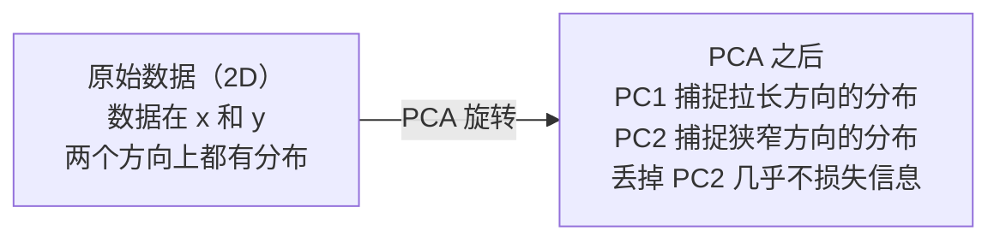

# 降维（Dimensionality Reduction）

> 译注：本文译自同目录 [`en.md`](./en.md)。术语遵循仓根 [TRANSLATION_GUIDE.md](../../../../TRANSLATION_GUIDE.md)。

> 高维数据是有结构的。你只是需要换个角度去看它。

**Type:** Build
**Language:** Python
**Prerequisites:** Phase 1, Lessons 01 (Linear Algebra Intuition), 02 (Vectors, Matrices & Operations), 03 (Eigenvalues & Eigenvectors), 06 (Probability & Distributions)
**Time:** ~90 minutes

## 学习目标（Learning Objectives）

- 从零实现 PCA：中心化数据、计算协方差矩阵、特征分解、然后投影
- 用解释方差比（explained variance ratio）和肘部法（elbow method）来选择主成分的数量
- 在 MNIST 数字数据上对比 PCA、t-SNE 和 UMAP 的 2D 可视化效果，并说清楚它们各自的取舍
- 用 RBF 核的 kernel PCA 去分离标准 PCA 处理不了的非线性数据结构

## 问题（The Problem）

你手上有一份数据集，每个样本有 784 个特征。可能是手写数字的像素值，可能是基因表达量，也可能是用户行为信号。784 个维度，你看不见、画不出来，甚至想都想不过来。

但这 784 个特征里大部分是冗余的。真正的信息只生活在一个小得多的曲面上。一个手写的 "7" 不需要 784 个独立的数字来描述，它只需要几个：笔画的角度、横杠的长度、它倾斜的程度。剩下的都是噪声。

降维就是要找到那个更小的曲面。它把你 784 维的数据压缩到 2 维、10 维或 50 维，同时保留真正重要的结构。

## 概念（The Concept）

### 维度灾难（The curse of dimensionality）

高维空间是反直觉的。维度一升上去，就有三件事会崩坏。

**距离失去意义。** 在高维空间里，任意两个随机点之间的距离都收敛到同一个值。如果每个点离其他每个点的距离都差不多，最近邻搜索就废了。

```
Dimension    Avg distance ratio (max/min between random points)
2            ~5.0
10           ~1.8
100          ~1.2
1000         ~1.02
```

**体积全集中在角落。** d 维的单位超立方体有 2^d 个角。在 100 维里，几乎所有体积都堆在角落，远离中心。数据点散到边缘去，模型在内部就没数据可吃。

**你需要指数级更多的数据。** 想在空间里维持同样的样本密度，从 2D 到 20D 意味着你需要 10^18 倍的数据。你永远凑不够。降维能把数据密度拉回到一个能干活的水平。

### PCA：找出真正重要的方向（PCA: find the directions that matter）

主成分分析（Principal Component Analysis，PCA）会找到数据变化最大的那些坐标轴。它把你的坐标系旋转一下：第一根轴抓最大方差，第二根轴抓次大，依此类推。

算法：

```
1. Center the data        (subtract the mean from each feature)
2. Compute covariance     (how features move together)
3. Eigendecomposition     (find the principal directions)
4. Sort by eigenvalue     (biggest variance first)
5. Project               (keep top k eigenvectors, drop the rest)
```

为什么是特征分解？协方差矩阵是对称且半正定的，它的特征向量是特征空间里彼此正交的方向。特征值告诉你每个方向上抓到了多少方差。最大特征值对应的特征向量，就指向方差最大的那个方向。



- **PCA 之前：** 数据云沿着 x 和 y 两根轴斜着铺开
- **PCA 之后：** 坐标系被旋转，PC1 对齐方差最大的方向（拉长的那一边），PC2 对齐方差最小的方向（窄的那一边）
- **降维：** 丢掉 PC2 就是把数据投影到 PC1 上，几乎不损失信息

### 解释方差比（Explained variance ratio）

每个主成分都抓到了总方差的一部分。解释方差比告诉你具体抓了多少。

```
Component    Eigenvalue    Explained ratio    Cumulative
PC1          4.73          0.473              0.473
PC2          2.51          0.251              0.724
PC3          1.12          0.112              0.836
PC4          0.89          0.089              0.925
...
```

当累积解释方差达到 0.95 时，你就知道那几个主成分已经抓住了 95% 的信息。再往后基本都是噪声。

### 选主成分的数量（Choosing the number of components）

三种思路：

1. **阈值法。** 保留足够多的主成分，让它们覆盖 90-95% 的方差。
2. **肘部法（Elbow method）。** 把每个主成分的解释方差画出来，找那个突然掉下去的点。
3. **下游性能法。** 把 PCA 当预处理，扫一遍 k 值，测模型的准确率。准确率在哪儿趋于平坦，最佳 k 就在哪儿。

### t-SNE：保留邻域关系（t-SNE: preserve neighborhoods）

t-Distributed Stochastic Neighbor Embedding（t-SNE）是为可视化而生的。它把高维数据映射到 2D（或 3D），同时保留谁跟谁是邻居这件事。

直觉是这样的：在原空间里，根据点对之间的距离算一个概率分布——近的点概率高，远的点概率低。然后在 2D 里找一个排布，使得同样的概率分布成立。在 784 维里互为邻居的点，在 2D 里依然挨在一起。

t-SNE 的几个关键性质：
- 非线性。它能展开 PCA 搞不定的复杂 manifold（流形）。
- 随机。每次跑结果都不一样。
- perplexity（困惑度）参数控制每个点考虑多少邻居（典型范围 5-50）。
- 输出图里簇与簇之间的距离没有意义。只有簇本身有意义。
- 在大数据集上慢。默认是 O(n^2)。

### UMAP：更快、全局结构更好（UMAP: faster, better global structure）

Uniform Manifold Approximation and Projection（UMAP）的思路跟 t-SNE 类似，但有两个优势：
- 更快。它用近似最近邻图，而不是计算所有点对之间的距离。
- 全局结构更好。输出里簇之间的相对位置往往比 t-SNE 更有意义。

UMAP 在高维空间里建一张加权图（也叫"模糊拓扑表示"），然后找一个低维布局，尽可能保留这张图。

关键参数：
- `n_neighbors`：多少个邻居定义局部结构（类似 perplexity）。值越大越偏全局结构。
- `min_dist`：输出里点能堆得多紧。值越小簇越紧凑。

### 什么时候用哪个（When to use which）

| Method | Use case | Preserves | Speed |
|--------|----------|-----------|-------|
| PCA | 训练前的预处理 | 全局方差 | 快（精确解），能跑百万级样本 |
| PCA | 快速做探索性可视化 | 线性结构 | 快 |
| t-SNE | 出版级 2D 图 | 局部邻域 | 慢（理想是 < 10k 样本） |
| UMAP | 大规模 2D 可视化 | 局部 + 部分全局结构 | 中等（百万级也能扛） |
| PCA | 给模型做特征降维 | 按方差排序的特征 | 快 |
| t-SNE / UMAP | 理解簇结构 | 簇的分离 | 中到慢 |

经验法则：预处理和压缩用 PCA。要在 2D 里看清楚结构，用 t-SNE 或 UMAP。

### Kernel PCA

标准 PCA 找的是线性子空间，它旋转坐标系然后扔掉一些轴。但如果数据躺在一个非线性 manifold 上呢？2D 里的一个圆环，你怎么用直线都切不开。标准 PCA 帮不了你。

Kernel PCA 通过一个核函数把 PCA 跑在一个高维特征空间里，但又不显式地去算那个空间里的坐标。这就是"核技巧"——和 SVM 背后是同一个想法。

算法：
1. 计算核矩阵 K，其中 K_ij = k(x_i, x_j)
2. 在特征空间中对核矩阵做中心化
3. 对中心化后的核矩阵做特征分解
4. 顶部的特征向量（用 1/sqrt(eigenvalue) 缩放后）就是投影

常见核函数：

| Kernel | Formula | Good for |
|--------|---------|----------|
| RBF (Gaussian) | exp(-gamma * \|\|x - y\|\|^2) | 大多数非线性数据，光滑的 manifold |
| Polynomial | (x . y + c)^d | 多项式关系 |
| Sigmoid | tanh(alpha * x . y + c) | 神经网络风格的映射 |

什么时候用 kernel PCA、什么时候用标准 PCA：

| Criterion | Standard PCA | Kernel PCA |
|-----------|-------------|------------|
| 数据结构 | 线性子空间 | 非线性 manifold |
| 速度 | O(min(n^2 d, d^2 n)) | O(n^2 d + n^3) |
| 可解释性 | 主成分是特征的线性组合 | 主成分没有直接的特征解释 |
| 可扩展性 | 百万级样本没问题 | 核矩阵是 n x n，受内存限制 |
| 重建 | 直接逆变换 | 需要做 pre-image 近似 |

经典例子：2D 里的同心圆。两圈点，一圈套一圈。标准 PCA 把它们都投到同一根线上——分类用不了。带 RBF 核的 kernel PCA 会把内圈和外圈映射到不同区域，让它们线性可分。

### 重建误差（Reconstruction Error）

你的降维到底好不好？把 784 维压成了 50 维，丢了什么？

衡量重建误差：
1. 投影到 k 维：X_reduced = X @ W_k
2. 重建：X_hat = X_reduced @ W_k^T
3. 算 MSE：mean((X - X_hat)^2)

对 PCA 来说，重建误差和解释方差有一个干净的关系：

```
Reconstruction error = sum of eigenvalues NOT included
Total variance = sum of ALL eigenvalues
Fraction lost = (sum of dropped eigenvalues) / (sum of all eigenvalues)
```

每个主成分的解释方差比是：

```
explained_ratio_k = eigenvalue_k / sum(all eigenvalues)
```

把累积解释方差对主成分数量画出来，就是那条"肘部"曲线。合适的主成分数量在以下几个地方之一：
- 曲线开始平坦（边际收益递减）
- 累积方差越过你的阈值（一般是 0.90 或 0.95）
- 下游任务的性能趋于平坦

重建误差不止能用来选 k。它还可以用来做异常检测：重建误差高的样本就是不符合所学子空间的离群点。这就是生产系统里基于 PCA 的异常检测的根基。

## 动手实现（Build It）

### Step 1: 从零写一个 PCA（PCA from scratch）

```python
import numpy as np

class PCA:
    def __init__(self, n_components):
        self.n_components = n_components
        self.components = None
        self.mean = None
        self.eigenvalues = None
        self.explained_variance_ratio_ = None

    def fit(self, X):
        self.mean = np.mean(X, axis=0)
        X_centered = X - self.mean

        cov_matrix = np.cov(X_centered, rowvar=False)

        eigenvalues, eigenvectors = np.linalg.eigh(cov_matrix)

        sorted_idx = np.argsort(eigenvalues)[::-1]
        eigenvalues = eigenvalues[sorted_idx]
        eigenvectors = eigenvectors[:, sorted_idx]

        self.components = eigenvectors[:, :self.n_components].T
        self.eigenvalues = eigenvalues[:self.n_components]
        total_var = np.sum(eigenvalues)
        self.explained_variance_ratio_ = self.eigenvalues / total_var

        return self

    def transform(self, X):
        X_centered = X - self.mean
        return X_centered @ self.components.T

    def fit_transform(self, X):
        self.fit(X)
        return self.transform(X)
```

### Step 2: 在合成数据上测试（Test on synthetic data）

```python
np.random.seed(42)
n_samples = 500

t = np.random.uniform(0, 2 * np.pi, n_samples)
x1 = 3 * np.cos(t) + np.random.normal(0, 0.2, n_samples)
x2 = 3 * np.sin(t) + np.random.normal(0, 0.2, n_samples)
x3 = 0.5 * x1 + 0.3 * x2 + np.random.normal(0, 0.1, n_samples)

X_synthetic = np.column_stack([x1, x2, x3])

pca = PCA(n_components=2)
X_reduced = pca.fit_transform(X_synthetic)

print(f"Original shape: {X_synthetic.shape}")
print(f"Reduced shape:  {X_reduced.shape}")
print(f"Explained variance ratios: {pca.explained_variance_ratio_}")
print(f"Total variance captured: {sum(pca.explained_variance_ratio_):.4f}")
```

### Step 3: 把 MNIST 投到 2D（MNIST digits in 2D）

```python
from sklearn.datasets import fetch_openml

mnist = fetch_openml("mnist_784", version=1, as_frame=False, parser="auto")
X_mnist = mnist.data[:5000].astype(float)
y_mnist = mnist.target[:5000].astype(int)

pca_mnist = PCA(n_components=50)
X_pca50 = pca_mnist.fit_transform(X_mnist)
print(f"50 components capture {sum(pca_mnist.explained_variance_ratio_):.2%} of variance")

pca_2d = PCA(n_components=2)
X_pca2d = pca_2d.fit_transform(X_mnist)
print(f"2 components capture {sum(pca_2d.explained_variance_ratio_):.2%} of variance")
```

### Step 4: 和 sklearn 对比（Compare with sklearn）

```python
from sklearn.decomposition import PCA as SklearnPCA
from sklearn.manifold import TSNE

sklearn_pca = SklearnPCA(n_components=2)
X_sklearn_pca = sklearn_pca.fit_transform(X_mnist)

print(f"\nOur PCA explained variance:     {pca_2d.explained_variance_ratio_}")
print(f"Sklearn PCA explained variance: {sklearn_pca.explained_variance_ratio_}")

diff = np.abs(np.abs(X_pca2d) - np.abs(X_sklearn_pca))
print(f"Max absolute difference: {diff.max():.10f}")

tsne = TSNE(n_components=2, perplexity=30, random_state=42)
X_tsne = tsne.fit_transform(X_mnist)
print(f"\nt-SNE output shape: {X_tsne.shape}")
```

### Step 5: 与 UMAP 对比（UMAP comparison）

```python
try:
    from umap import UMAP

    reducer = UMAP(n_components=2, n_neighbors=15, min_dist=0.1, random_state=42)
    X_umap = reducer.fit_transform(X_mnist)
    print(f"UMAP output shape: {X_umap.shape}")
except ImportError:
    print("Install umap-learn: pip install umap-learn")
```

## 用起来（Use It）

把 PCA 当作分类器之前的预处理：

```python
from sklearn.decomposition import PCA as SklearnPCA
from sklearn.linear_model import LogisticRegression
from sklearn.model_selection import train_test_split
from sklearn.metrics import accuracy_score

X_train, X_test, y_train, y_test = train_test_split(
    X_mnist, y_mnist, test_size=0.2, random_state=42
)

results = {}
for k in [10, 30, 50, 100, 200]:
    pca_k = SklearnPCA(n_components=k)
    X_tr = pca_k.fit_transform(X_train)
    X_te = pca_k.transform(X_test)

    clf = LogisticRegression(max_iter=1000, random_state=42)
    clf.fit(X_tr, y_train)
    acc = accuracy_score(y_test, clf.predict(X_te))
    var_captured = sum(pca_k.explained_variance_ratio_)
    results[k] = (acc, var_captured)
    print(f"k={k:>3d}  accuracy={acc:.4f}  variance={var_captured:.4f}")
```

性能远在 784 维之前就稳了。那个稳住的点，就是你的工作点。

## 上线部署（Ship It）

本课产出：
- `outputs/skill-dimensionality-reduction.md` —— 一个 skill，用来在给定任务下挑选合适的降维技术

## 练习（Exercises）

1. 给 PCA 类加上 `inverse_transform`。从 10、50、200 个主成分重建 MNIST 数字，分别打印重建误差（与原图的均方差）。

2. 在同一份 MNIST 子集上跑 t-SNE，perplexity 取 5、30、100。描述输出怎么变。为什么 perplexity 会影响簇的紧凑程度？

3. 找一份 50 个特征里只有 5 个真正有信息量的数据集（用 `sklearn.datasets.make_classification` 生成一份）。跑 PCA，看看解释方差曲线能不能正确告诉你这份数据其实是 5 维的。

## 关键术语（Key Terms）

| Term | What people say | What it actually means |
|------|----------------|----------------------|
| 维度灾难（Curse of dimensionality） | "特征太多了" | 维度一升，距离、体积、数据密度都开始反直觉。模型需要指数级更多数据来弥补。 |
| PCA | "降维一下" | 把坐标系旋转到对齐最大方差的方向，然后扔掉低方差的轴。 |
| 主成分（Principal component） | "一个重要的方向" | 协方差矩阵的特征向量。特征空间里数据变化最大的方向。 |
| 解释方差比（Explained variance ratio） | "这个主成分携带了多少信息" | 一个主成分占总方差的比例。把前 k 个加起来，就知道 k 个主成分一共保留了多少。 |
| 协方差矩阵（Covariance matrix） | "特征怎么相关" | 一个对称矩阵，第 (i,j) 项衡量特征 i 和特征 j 一起怎么动。对角线是各自的方差。 |
| t-SNE | "那种聚类图" | 一种非线性方法，通过保留点对邻域概率把高维数据映射到 2D。适合可视化，不适合做预处理。 |
| UMAP | "更快的 t-SNE" | 一种基于拓扑数据分析的非线性方法。同时保留局部结构和部分全局结构，比 t-SNE 更能扩展。 |
| Perplexity（困惑度） | "t-SNE 的一个旋钮" | 控制每个点考虑多少邻居。低 perplexity 关注非常局部的结构，高 perplexity 抓更宏观的模式。 |
| Manifold（流形） | "数据躺着的那个曲面" | 嵌入在高维空间里的低维曲面。在 3D 里揉皱的一张纸就是一个 2D manifold。 |

## 延伸阅读（Further Reading）

- [A Tutorial on Principal Component Analysis](https://arxiv.org/abs/1404.1100) (Shlens) —— 从最底层把 PCA 推一遍，清晰
- [How to Use t-SNE Effectively](https://distill.pub/2016/misread-tsne/) (Wattenberg et al.) —— t-SNE 的坑和参数选择，互动式指南
- [UMAP documentation](https://umap-learn.readthedocs.io/) —— UMAP 作者写的理论加实战指南
