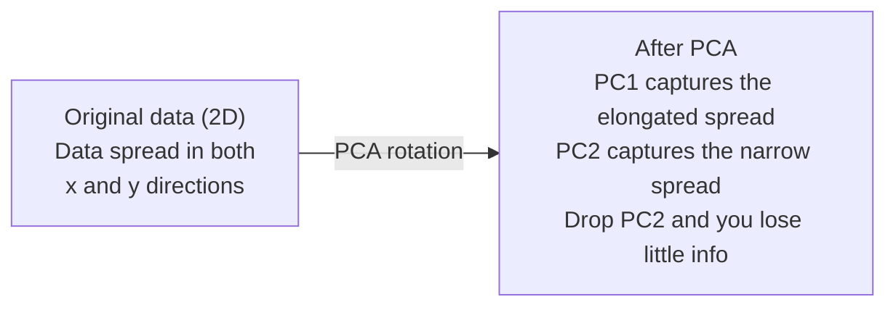

# 降維

> 高維資料是有結構的。你只要從對的角度看，就能找到它。

**類型：** 實作
**程式語言：** Python
**先修單元：** 階段 1 · 01（線性代數直覺）、02（向量、矩陣與運算）、03（特徵值與特徵向量）、06（機率與分布）
**時間：** 約 90 分鐘

## 學習目標

- 從零實作 PCA：把資料中心化、算出共變異數矩陣、做特徵分解，然後投影
- 用解釋變異量比例與肘部法則決定要保留幾個主成分
- 比較 PCA、t-SNE 與 UMAP 在 2D 視覺化 MNIST 數字上的表現，並說明各自的取捨
- 用 RBF 核的 kernel PCA 分離標準 PCA 處理不了的非線性結構

## 問題所在

你手上有一份資料集，每筆樣本有 784 個特徵。也許它是手寫數字的像素值，也許是基因表現量，也許是使用者行為訊號。你沒辦法把 784 個維度視覺化，沒辦法畫出來，甚至連想像都做不到。

但那 784 個特徵大多是多餘的。真正的資訊活在一個小得多的曲面上。一個手寫的「7」不需要 784 個獨立的數字來描述，它只需要少數幾個：筆畫的角度、橫槓的長度、傾斜的程度。其餘的都是雜訊。

降維就是去找出那個更小的曲面。它把你的 784 維資料壓縮成 2 維、10 維或 50 維，同時保住真正重要的結構。

## 核心概念

### 維度詛咒

高維空間很不直觀。維度一長，有三件事會壞掉。

**距離失去意義。** 在高維空間裡，任兩個隨機點之間的距離會收斂到同一個值。如果每個點跟其他每個點的距離都差不多，最近鄰搜尋就失效了。

```
Dimension    Avg distance ratio (max/min between random points)
2            ~5.0
10           ~1.8
100          ~1.2
1000         ~1.02
```

**體積集中在角落。** d 維的單位超立方體有 2^d 個角。在 100 維裡，幾乎所有體積都在角落，離中心很遠。資料點被推向邊緣，你的模型在內部區域則餓得沒資料可吃。

**你需要指數倍的資料。** 要在一個空間裡維持相同的樣本密度，從 2D 走到 20D 意味著你需要多 10^18 倍的資料。你永遠不會有那麼多。降低維度能把資料密度拉回一個還能處理的水準。

### PCA：找出真正重要的方向

主成分分析（Principal Component Analysis, PCA）會找出你的資料變化最大的那些軸。它旋轉你的座標系，讓第一個軸捕捉最多的變異量，第二個軸捕捉次多的，依此類推。

演算法：

```
1. Center the data        (subtract the mean from each feature)
2. Compute covariance     (how features move together)
3. Eigendecomposition     (find the principal directions)
4. Sort by eigenvalue     (biggest variance first)
5. Project               (keep top k eigenvectors, drop the rest)
```

為什麼要做特徵分解？因為共變異數矩陣是對稱的半正定矩陣。它的特徵向量是特徵空間中互相正交的方向，而特徵值告訴你每個方向捕捉了多少變異量。特徵值最大的那個特徵向量，就指向變異量最大的方向。


```mermaid
graph LR
    A["Original data (2D)\nData spread in both\nx and y directions"] -->|"PCA rotation"| B["After PCA\nPC1 captures the elongated spread\nPC2 captures the narrow spread\nDrop PC2 and you lose little info"]
```

- **PCA 之前：** 資料雲沿著對角方向散開，同時橫跨 x 軸與 y 軸
- **PCA 之後：** 座標系被旋轉過，PC1 對齊變異量最大的方向（拉長的那個散布），PC2 對齊變異量最小的方向（窄的那個散布）
- **降維：** 丟掉 PC2、把資料投影到 PC1 上，幾乎不會損失什麼資訊

### 解釋變異量比例

每個主成分都捕捉了總變異量的一部分。解釋變異量比例告訴你那是多少。

```
Component    Eigenvalue    Explained ratio    Cumulative
PC1          4.73          0.473              0.473
PC2          2.51          0.251              0.724
PC3          1.12          0.112              0.836
PC4          0.89          0.089              0.925
...
```

當累積解釋變異量達到 0.95，你就知道這麼多個成分捕捉了 95% 的資訊。之後的部分大多是雜訊。

### 決定要保留幾個成分

三種策略：

1. **門檻法。** 保留足夠的成分，解釋 90-95% 的變異量。
2. **肘部法則。** 把每個成分的解釋變異量畫出來，找那個陡降的轉折點。
3. **下游表現。** 把 PCA 當成前處理，掃過不同的 k 值並量測模型準確率。最好的 k 就是準確率開始持平的地方。

### t-SNE：保留鄰域關係

t-Distributed Stochastic Neighbor Embedding（t-SNE）是為視覺化而設計的。它把高維資料映射到 2D（或 3D），同時保留「哪些點彼此靠近」這件事。

直覺是這樣：在原始空間裡，根據點對之間的距離算出一個機率分布，近的點機率高、遠的點機率低。然後找一個 2D 的排列，讓同樣的機率分布成立。在 784 維裡是鄰居的點，在 2D 裡仍然是鄰居。

t-SNE 的關鍵性質：
- 非線性。它能展開 PCA 攤不平的複雜流形。
- 隨機性。不同次執行會產生不同的版面。
- perplexity 參數控制要考慮多少個鄰居（典型範圍：5-50）。
- 輸出中叢集之間的距離沒有意義，只有叢集本身有意義。
- 在大型資料集上很慢。預設是 O(n^2)。

### UMAP：更快，全域結構更好

Uniform Manifold Approximation and Projection（UMAP）的運作方式跟 t-SNE 類似，但有兩個優勢：
- 更快。它用近似最近鄰圖，而不是計算所有點對之間的距離。
- 全域結構更好。輸出中叢集之間的相對位置，通常比 t-SNE 更有意義。

UMAP 會在高維空間裡建一個帶權重的圖（所謂的「模糊拓撲表示」），然後找一個低維版面，盡可能保留這張圖。

關鍵參數：
- `n_neighbors`：多少個鄰居構成局部結構（類似 perplexity）。值越大，保留的全域結構越多。
- `min_dist`：輸出中點擠得多緊。值越小，叢集越密集。

### 什麼時候該用哪個

| 方法 | 使用場景 | 保留什麼 | 速度 |
|--------|----------|-----------|-------|
| PCA | 訓練前的前處理 | 全域變異量 | 快（精確解），可處理數百萬筆樣本 |
| PCA | 快速的探索性視覺化 | 線性結構 | 快 |
| t-SNE | 論文品質的 2D 圖 | 局部鄰域 | 慢（樣本數 < 10k 最理想） |
| UMAP | 大規模的 2D 視覺化 | 局部結構＋部分全域結構 | 中等（能處理數百萬筆） |
| PCA | 給模型用的特徵縮減 | 依變異量排序的特徵 | 快 |
| t-SNE / UMAP | 理解叢集結構 | 叢集之間的分離 | 中等到慢 |

經驗法則：前處理與資料壓縮用 PCA；需要把結構畫成 2D 看的時候，用 t-SNE 或 UMAP。

### Kernel PCA

標準 PCA 找的是線性子空間。它旋轉你的座標系，然後丟掉幾個軸。但如果資料躺在一個非線性的流形上呢？2D 裡的一個圓，沒有任何一條直線能把它分開，標準 PCA 幫不上忙。

Kernel PCA 是在由核函數導出的高維特徵空間裡做 PCA，而且不需要真的把那個空間的座標算出來。這就是核技巧（kernel trick）—— 跟 SVM 背後是同一個想法。

演算法：
1. 算出核矩陣 K，其中 K_ij = k(x_i, x_j)
2. 在特徵空間裡把核矩陣中心化
3. 對中心化後的核矩陣做特徵分解
4. 前幾個特徵向量（各自除以 sqrt(eigenvalue)）就是投影結果

常見的核函數：

| 核函數 | 公式 | 適合什麼 |
|--------|---------|----------|
| RBF（高斯） | exp(-gamma * \|\|x - y\|\|^2) | 大多數非線性資料、平滑的流形 |
| 多項式 | (x . y + c)^d | 多項式關係 |
| Sigmoid | tanh(alpha * x . y + c) | 類神經網路的映射 |

Kernel PCA 與標準 PCA 的取捨：

| 判準 | 標準 PCA | Kernel PCA |
|-----------|-------------|------------|
| 資料結構 | 線性子空間 | 非線性流形 |
| 速度 | O(min(n^2 d, d^2 n)) | O(n^2 d + n^3) |
| 可解釋性 | 成分是特徵的線性組合 | 成分沒有直接對應的特徵意義 |
| 可擴充性 | 能處理數百萬筆樣本 | 核矩陣是 n x n，受記憶體限制 |
| 重建 | 直接做反向轉換 | 需要做 pre-image 近似 |

經典的例子：2D 裡的同心圓。兩圈點，一圈在另一圈裡面。標準 PCA 會把兩者投影到同一條線上 —— 對分類完全沒用。用 RBF 核的 kernel PCA 會把內圈和外圈映射到不同的區域，讓它們變成線性可分。

### 重建誤差

你的降維做得好不好？你把 784 維壓成了 50 維，那到底損失了什麼？

量測重建誤差：
1. 把資料投影到 k 維：X_reduced = X @ W_k
2. 重建：X_hat = X_reduced @ W_k^T
3. 算 MSE：mean((X - X_hat)^2)

對 PCA 來說，重建誤差跟解釋變異量之間有個很乾淨的關係：

```
Reconstruction error = sum of eigenvalues NOT included
Total variance = sum of ALL eigenvalues
Fraction lost = (sum of dropped eigenvalues) / (sum of all eigenvalues)
```

每個成分的解釋變異量比例是：

```
explained_ratio_k = eigenvalue_k / sum(all eigenvalues)
```

把累積解釋變異量對成分個數畫出來，就得到那條「肘部」曲線。成分個數的正確答案在這幾個地方：
- 曲線開始變平（報酬遞減）
- 累積變異量跨過你的門檻（通常是 0.90 或 0.95）
- 下游任務的表現開始持平

重建誤差的用途不只是挑 k。你可以拿它做異常偵測：重建誤差高的樣本，就是不符合已學到的子空間的離群點。這正是生產系統中以 PCA 做異常偵測的基礎。

```figure
pca-axes
```

## 動手實作

### 步驟 1：從零實作 PCA

```python
import numpy as np

class PCA:
    def __init__(self, n_components):
        self.n_components = n_components
        self.components = None
        self.mean = None
        self.eigenvalues = None
        self.explained_variance_ratio_ = None

    def fit(self, X):
        self.mean = np.mean(X, axis=0)
        X_centered = X - self.mean

        cov_matrix = np.cov(X_centered, rowvar=False)

        eigenvalues, eigenvectors = np.linalg.eigh(cov_matrix)

        sorted_idx = np.argsort(eigenvalues)[::-1]
        eigenvalues = eigenvalues[sorted_idx]
        eigenvectors = eigenvectors[:, sorted_idx]

        self.components = eigenvectors[:, :self.n_components].T
        self.eigenvalues = eigenvalues[:self.n_components]
        total_var = np.sum(eigenvalues)
        self.explained_variance_ratio_ = self.eigenvalues / total_var

        return self

    def transform(self, X):
        X_centered = X - self.mean
        return X_centered @ self.components.T

    def fit_transform(self, X):
        self.fit(X)
        return self.transform(X)
```

### 步驟 2：在合成資料上測試

```python
np.random.seed(42)
n_samples = 500

t = np.random.uniform(0, 2 * np.pi, n_samples)
x1 = 3 * np.cos(t) + np.random.normal(0, 0.2, n_samples)
x2 = 3 * np.sin(t) + np.random.normal(0, 0.2, n_samples)
x3 = 0.5 * x1 + 0.3 * x2 + np.random.normal(0, 0.1, n_samples)

X_synthetic = np.column_stack([x1, x2, x3])

pca = PCA(n_components=2)
X_reduced = pca.fit_transform(X_synthetic)

print(f"Original shape: {X_synthetic.shape}")
print(f"Reduced shape:  {X_reduced.shape}")
print(f"Explained variance ratios: {pca.explained_variance_ratio_}")
print(f"Total variance captured: {sum(pca.explained_variance_ratio_):.4f}")
```

### 步驟 3：把 MNIST 數字畫到 2D

```python
from sklearn.datasets import fetch_openml

mnist = fetch_openml("mnist_784", version=1, as_frame=False, parser="auto")
X_mnist = mnist.data[:5000].astype(float)
y_mnist = mnist.target[:5000].astype(int)

pca_mnist = PCA(n_components=50)
X_pca50 = pca_mnist.fit_transform(X_mnist)
print(f"50 components capture {sum(pca_mnist.explained_variance_ratio_):.2%} of variance")

pca_2d = PCA(n_components=2)
X_pca2d = pca_2d.fit_transform(X_mnist)
print(f"2 components capture {sum(pca_2d.explained_variance_ratio_):.2%} of variance")
```

### 步驟 4：跟 sklearn 對照

```python
from sklearn.decomposition import PCA as SklearnPCA
from sklearn.manifold import TSNE

sklearn_pca = SklearnPCA(n_components=2)
X_sklearn_pca = sklearn_pca.fit_transform(X_mnist)

print(f"\nOur PCA explained variance:     {pca_2d.explained_variance_ratio_}")
print(f"Sklearn PCA explained variance: {sklearn_pca.explained_variance_ratio_}")

diff = np.abs(np.abs(X_pca2d) - np.abs(X_sklearn_pca))
print(f"Max absolute difference: {diff.max():.10f}")

tsne = TSNE(n_components=2, perplexity=30, random_state=42)
X_tsne = tsne.fit_transform(X_mnist)
print(f"\nt-SNE output shape: {X_tsne.shape}")
```

### 步驟 5：UMAP 對照

```python
try:
    from umap import UMAP

    reducer = UMAP(n_components=2, n_neighbors=15, min_dist=0.1, random_state=42)
    X_umap = reducer.fit_transform(X_mnist)
    print(f"UMAP output shape: {X_umap.shape}")
except ImportError:
    print("Install umap-learn: pip install umap-learn")
```

## 框架應用

把 PCA 當成分類器之前的前處理：

```python
from sklearn.decomposition import PCA as SklearnPCA
from sklearn.linear_model import LogisticRegression
from sklearn.model_selection import train_test_split
from sklearn.metrics import accuracy_score

X_train, X_test, y_train, y_test = train_test_split(
    X_mnist, y_mnist, test_size=0.2, random_state=42
)

results = {}
for k in [10, 30, 50, 100, 200]:
    pca_k = SklearnPCA(n_components=k)
    X_tr = pca_k.fit_transform(X_train)
    X_te = pca_k.transform(X_test)

    clf = LogisticRegression(max_iter=1000, random_state=42)
    clf.fit(X_tr, y_train)
    acc = accuracy_score(y_test, clf.predict(X_te))
    var_captured = sum(pca_k.explained_variance_ratio_)
    results[k] = (acc, var_captured)
    print(f"k={k:>3d}  accuracy={acc:.4f}  variance={var_captured:.4f}")
```

表現遠在 784 維之前就持平了。那個持平點就是你的運作點。

## 產出交付

本單元會產出：
- `outputs/skill-dimensionality-reduction.md` —— 一項技能，用來針對給定的任務挑選合適的降維技術

## 練習

1. 修改 PCA 類別，讓它支援 `inverse_transform`。分別用 10、50 與 200 個成分重建 MNIST 數字，並印出每一種的重建誤差（與原圖的均方差）。

2. 在同一份 MNIST 子集上跑 t-SNE，perplexity 分別取 5、30 與 100。描述輸出如何變化。為什麼 perplexity 會影響叢集的緊密程度？

3. 找一份有 50 個特徵、但只有 5 個帶資訊的資料集（用 `sklearn.datasets.make_classification` 生一份）。套用 PCA，檢查解釋變異量曲線是否正確指出這份資料實際上只有 5 維。

## 關鍵術語

| 術語 | 大家怎麼說 | 實際上是什麼 |
|------|----------------|----------------------|
| 維度詛咒 | 「特徵太多了」 | 維度一長，距離、體積與資料密度全都會違反直覺。模型需要指數倍的資料才補得回來。 |
| PCA | 「降維」 | 旋轉座標系，讓各軸對齊變異量最大的方向，然後丟掉低變異量的軸。 |
| 主成分 | 「一個重要的方向」 | 共變異數矩陣的一個特徵向量。特徵空間中資料變化最大的那個方向。 |
| 解釋變異量比例 | 「這個成分有多少資訊」 | 單一主成分捕捉到的總變異量比例。把前 k 個加起來，就知道 k 個成分保住了多少。 |
| 共變異數矩陣 | 「特徵之間怎麼相關」 | 一個對稱矩陣，第 (i,j) 項衡量特徵 i 與特徵 j 一起變動的程度。對角線上是各自的變異數。 |
| t-SNE | 「那種叢集圖」 | 一種非線性方法，透過保留點對之間的鄰域機率，把高維資料映射到 2D。適合視覺化，不適合當前處理。 |
| UMAP | 「更快的 t-SNE」 | 一種以拓撲資料分析為基礎的非線性方法。同時保留局部結構與部分全域結構，擴充性比 t-SNE 好。 |
| Perplexity | 「t-SNE 的一個旋鈕」 | 控制每個點實際會考慮幾個鄰居。低 perplexity 專注在非常局部的結構，高 perplexity 捕捉較大範圍的樣態。 |
| 流形 | 「資料所在的那個曲面」 | 嵌在高維空間裡的一個低維曲面。一張在 3D 中被揉成一團的紙，是個 2D 流形。 |

## 延伸閱讀

- [A Tutorial on Principal Component Analysis](https://arxiv.org/abs/1404.1100)（Shlens）—— 從最基本處清楚推導 PCA
- [How to Use t-SNE Effectively](https://distill.pub/2016/misread-tsne/)（Wattenberg et al.）—— 互動式指南，講 t-SNE 的陷阱與參數選擇
- [UMAP documentation](https://umap-learn.readthedocs.io/) —— UMAP 作者提供的理論與實務建議
