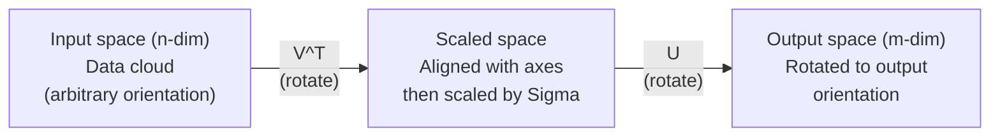
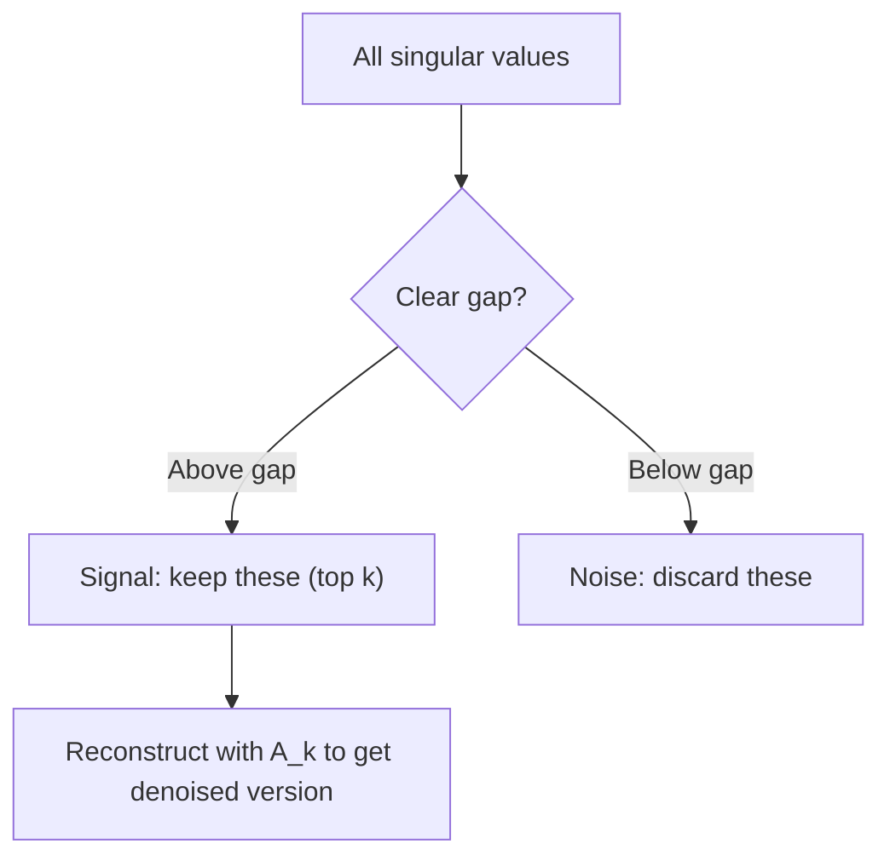

# 特異値分解

> SVDは線形代数の万能ナイフです。どんな行列にも存在し、すべてのデータサイエンティストに必要です。

**種別:** 構築
**言語:** Python、Julia
**前提条件:** Phase 1、Lesson 01（線形代数の直感）、02（ベクトル・行列演算）、03（行列変換）
**所要時間:** 約120分

## 学習目標

- べき反復でSVDを実装し、U、Sigma、V^Tの幾何学的意味を説明する
- 切り詰めSVDを画像圧縮に適用し、圧縮率と再構成誤差を測る
- SVDでMoore-Penrose擬似逆行列を計算し、過決定の最小二乗系を解く
- SVDをPCA、推薦システム（潜在因子）、NLPのLatent Semantic Analysisへ結びつける

## 問題

1000x2000の行列があります。ユーザーと映画の評価かもしれません。文書と単語の頻度表かもしれません。画像のピクセル値かもしれません。それを圧縮したい、ノイズを取り除きたい、隠れた構造を見つけたい、あるいは最小二乗系を解きたいとします。固有分解は正方行列にしか使えません。さらに、その行列が線形独立な固有ベクトルの完全な集合を持つ必要があります。

SVDはどんな行列にも使えます。どんな形でも、どんなrankでも、条件はありません。SVDは行列を3つの因子へ分解し、その行列が空間に対して何をしているのかという幾何を明らかにします。線形代数全体で最も一般的で、最も有用な分解です。

## 概念

### SVDは幾何学的に何をするか

どんな形の行列でも、順番に3つの操作を行います。回転、スケール、回転です。SVDはこの分解を明示します。

```
A = U * Sigma * V^T

      m x n     m x m    m x n    n x n
     (any)    (rotate)  (scale)  (rotate)
```

任意の行列Aについて、SVDはそれを次のように分解します。
- V^Tは入力空間（n次元）のベクトルを回転する
- Sigmaは各軸に沿ってスケールする（伸ばす、または縮める）
- Uは結果を出力空間（m次元）へ回転する



このように考えてください。SVDに行列を渡すと、こう教えてくれます。「この行列は入力の球を、まずV^Tで回転し、次にSigmaで楕円体へ伸縮し、最後にUでその楕円体を回転します」。特異値は、その楕円体の軸の長さです。

### 完全な分解

shapeがm x nの行列Aについて:

```
A = U * Sigma * V^T

where:
  U     is m x m, orthogonal (U^T U = I)
  Sigma is m x n, diagonal (singular values on the diagonal)
  V     is n x n, orthogonal (V^T V = I)

The singular values sigma_1 >= sigma_2 >= ... >= sigma_r > 0
where r = rank(A)
```

Uの列は左特異ベクトルと呼ばれます。Vの列は右特異ベクトルと呼ばれます。Sigmaの対角要素は特異値と呼ばれます。特異値は常に非負で、慣例的に降順に並べられます。

### 左特異ベクトル、特異値、右特異ベクトル

SVDの各要素には、それぞれ異なる幾何学的意味があります。

**右特異ベクトル（Vの列）:** 入力空間（R^n）の正規直交基底を形成します。行列が出力空間の直交方向へ写す入力空間の方向です。定義域にとって自然な座標系だと考えられます。

**特異値（Sigmaの対角）:** スケール係数です。i番目の特異値は、行列がi番目の右特異ベクトル方向に沿うベクトルをどれだけ伸ばすかを示します。特異値がゼロなら、その方向は完全につぶされます。

**左特異ベクトル（Uの列）:** 出力空間（R^m）の正規直交基底を形成します。i番目の左特異ベクトルは、i番目の右特異ベクトルが（スケール後に）到達する出力空間内の方向です。

これらの関係は次のとおりです。

```
A * v_i = sigma_i * u_i

The matrix A takes the i-th right singular vector v_i,
scales it by sigma_i, and maps it to the i-th left singular vector u_i.
```

これにより、任意の行列が何をするのかを座標ごとに理解できます。

### 外積形式

SVDはrank-1行列の和として書けます。

```
A = sigma_1 * u_1 * v_1^T + sigma_2 * u_2 * v_2^T + ... + sigma_r * u_r * v_r^T

Each term sigma_i * u_i * v_i^T is a rank-1 matrix (an outer product).
The full matrix is the sum of r such matrices, where r is the rank.
```

この形式は低rank近似の基礎です。各項は構造を1層ずつ追加します。最初の項は単一で最も重要なパターンを捉えます。2番目の項は次に重要なパターンを捉えます。以後も同様です。この和を途中で切ると、与えられたrankで可能な最良の近似が得られます。

```
Rank-1 approx:    A_1 = sigma_1 * u_1 * v_1^T
                  (captures the dominant pattern)

Rank-2 approx:    A_2 = sigma_1 * u_1 * v_1^T + sigma_2 * u_2 * v_2^T
                  (captures the two most important patterns)

Rank-k approx:    A_k = sum of top k terms
                  (optimal by the Eckart-Young theorem)
```

### 固有分解との関係

SVDと固有分解は深くつながっています。Aの特異値と特異ベクトルは、A^T AとA A^Tの固有値・固有ベクトルから直接得られます。

```
A^T A = V * Sigma^T * U^T * U * Sigma * V^T
      = V * Sigma^T * Sigma * V^T
      = V * D * V^T

where D = Sigma^T * Sigma is a diagonal matrix with sigma_i^2 on the diagonal.

So:
- The right singular vectors (V) are eigenvectors of A^T A
- The singular values squared (sigma_i^2) are eigenvalues of A^T A

Similarly:
A A^T = U * Sigma * V^T * V * Sigma^T * U^T
      = U * Sigma * Sigma^T * U^T

So:
- The left singular vectors (U) are eigenvectors of A A^T
- The eigenvalues of A A^T are also sigma_i^2
```

この関係から3つのことがわかります。
1. 特異値は常に実数かつ非負です（半正定値行列の固有値の平方根だからです）。
2. A^T Aの固有分解でSVDを計算することもできますが、条件数を二乗して数値精度を失います。専用のSVDアルゴリズムはこれを避けます。
3. Aが正方かつ対称半正定値なら、SVDと固有分解は同じものになります。

### 切り詰めSVD: 低rank近似

Eckart-Young-Mirskyの定理は、Aに対する最良のrank-k近似（Frobeniusノルムとスペクトルノルムの両方）は、上位k個の特異値と対応するベクトルだけを残すことで得られる、と述べます。

```
A_k = U_k * Sigma_k * V_k^T

where:
  U_k     is m x k  (first k columns of U)
  Sigma_k is k x k  (top-left k x k block of Sigma)
  V_k     is n x k  (first k columns of V)

Approximation error = sigma_{k+1}  (in spectral norm)
                    = sqrt(sigma_{k+1}^2 + ... + sigma_r^2)  (in Frobenius norm)
```

これは単に「よい」近似ではありません。rank kで可能な最良近似であることが証明されています。Aにこれ以上近いrank-k行列は存在しません。

| 成分 | 相対的な大きさ | rank-3近似で残すか？ |
|-----------|-------------------|------------------------|
| sigma_1 | 最大 | はい |
| sigma_2 | 大 | はい |
| sigma_3 | 中から大 | はい |
| sigma_4 | 中 | いいえ（誤差） |
| sigma_5 | 中から小 | いいえ（誤差） |
| sigma_6 | 小 | いいえ（誤差） |
| sigma_7 | 非常に小 | いいえ（誤差） |
| sigma_8 | ごく小 | いいえ（誤差） |

上位3個を残すと、A_3は3つの最大特異値を捉えます。誤差は残りの値（sigma_4からsigma_8）です。

特異値が急速に減衰するなら、小さなkで行列の大半を捉えられます。ゆっくり減衰するなら、その行列には低rank構造がありません。

### SVDによる画像圧縮

グレースケール画像はピクセル強度の行列です。800x600の画像には480,000個の値があります。SVDを使うと、はるかに少ない値で近似できます。

```
Original image: 800 x 600 = 480,000 values

SVD with rank k:
  U_k:      800 x k values
  Sigma_k:  k values
  V_k:      600 x k values
  Total:    k * (800 + 600 + 1) = k * 1401 values

  k=10:   14,010 values   (2.9% of original)
  k=50:   70,050 values  (14.6% of original)
  k=100: 140,100 values  (29.2% of original)

  The compression ratio improves as k gets smaller,
  but visual quality degrades.
```

重要な洞察は、自然画像の特異値は急速に減衰するということです。最初の数個の特異値が大まかな構造（形状、勾配）を捉えます。後の特異値は細部とノイズを捉えます。rank 50で切り詰めると、ストレージを85%削減しながら元画像とほぼ同じに見える画像になることがよくあります。

### 推薦システムにおけるSVD

Netflix Prizeによってこの考え方は有名になりました。ユーザーと映画の評価行列があり、大半の要素は欠損しています。

```
             Movie1  Movie2  Movie3  Movie4  Movie5
  User1      [  5      ?       3       ?       1  ]
  User2      [  ?      4       ?       2       ?  ]
  User3      [  3      ?       5       ?       ?  ]
  User4      [  ?      ?       ?       4       3  ]

  ? = unknown rating
```

考え方は、この評価行列が低rankであるというものです。ユーザーの好みは完全に独立ではありません。ほとんどの嗜好を説明する少数の潜在因子（action vs. drama、old vs. new、cerebral vs. visceral）があります。

（埋められた）評価行列にSVDを適用すると、次へ分解されます。
- U: 潜在因子空間におけるユーザープロファイル
- Sigma: 各潜在因子の重要度
- V^T: 潜在因子空間における映画プロファイル

あるユーザーのある映画に対する予測評価は、そのユーザープロファイルと映画プロファイルの内積（特異値で重み付け）です。低rank近似は欠損要素を埋めます。

実務では、欠損データを直接扱えるSimon Funkのincremental SVDやALS（alternating least squares）のような変種を使います。それでも中核の考え方は同じです。SVDによる潜在因子分解です。

### NLPにおけるSVD: Latent Semantic Analysis

Latent Semantic Analysis（LSA）はLatent Semantic Indexing（LSI）とも呼ばれ、単語-文書行列にSVDを適用します。

```
             Doc1   Doc2   Doc3   Doc4
  "cat"      [  3      0      1      0  ]
  "dog"      [  2      0      0      1  ]
  "fish"     [  0      4      1      0  ]
  "pet"      [  1      1      1      1  ]
  "ocean"    [  0      3      0      0  ]

After SVD with rank k=2:

  Each document becomes a point in 2D "concept space."
  Each term becomes a point in the same 2D space.
  Documents about similar topics cluster together.
  Terms with similar meanings cluster together.

  "cat" and "dog" end up near each other (land pets).
  "fish" and "ocean" end up near each other (water concepts).
  Doc1 and Doc3 cluster if they share similar topics.
```

LSAは、生テキストから意味的類似性を捉えることに成功した初期の手法の1つでした。同義語は似た文書に現れやすいため、SVDはそれらを同じ潜在次元へまとめます。現代の単語埋め込み（Word2Vec、GloVe）は、この考え方の子孫と見ることができます。

### ノイズ除去のためのSVD

ノイズを含むデータでは、信号は上位特異値に集中し、ノイズはすべての特異値に広がります。切り詰めることでノイズ床を取り除けます。

**クリーンな信号の特異値:**

| 成分 | 大きさ | 種類 |
|-----------|-----------|------|
| sigma_1 | 非常に大 | 信号 |
| sigma_2 | 大 | 信号 |
| sigma_3 | 中 | 信号 |
| sigma_4 | ほぼゼロ | 無視可能 |
| sigma_5 | ほぼゼロ | 無視可能 |

**ノイズを含む信号の特異値（ノイズは全体へ加わる）:**

| 成分 | 大きさ | 種類 |
|-----------|-----------|------|
| sigma_1 | 非常に大 | 信号 |
| sigma_2 | 大 | 信号 |
| sigma_3 | 中 | 信号 |
| sigma_4 | 小 | ノイズ |
| sigma_5 | 小 | ノイズ |
| sigma_6 | 小 | ノイズ |
| sigma_7 | 小 | ノイズ |



これは信号処理、科学計測、データクリーニングで使われます。加法ノイズで汚れた行列があるとき、切り詰めSVDは信号とノイズを分ける原理的な方法です。

### SVDによる擬似逆行列

Moore-Penrose擬似逆行列A+は、行列の逆を非正方行列や特異行列へ一般化します。SVDを使うと計算は簡単です。

```
If A = U * Sigma * V^T, then:

A+ = V * Sigma+ * U^T

where Sigma+ is formed by:
  1. Transpose Sigma (swap rows and columns)
  2. Replace each non-zero diagonal entry sigma_i with 1/sigma_i
  3. Leave zeros as zeros

For A (m x n):      A+ is (n x m)
For Sigma (m x n):  Sigma+ is (n x m)
```

擬似逆行列は最小二乗問題を解きます。Ax = bに厳密解が存在しない場合（過決定系）、x = A+ bは最小二乗解（||Ax - b||を最小化する解）です。

```
Overdetermined system (more equations than unknowns):

  [1  1]         [3]
  [2  1] x   =   [5]       No exact solution exists.
  [3  1]         [6]

  x_ls = A+ b = V * Sigma+ * U^T * b

  This gives the x that minimizes the sum of squared residuals.
  Same result as the normal equations (A^T A)^(-1) A^T b,
  but numerically more stable.
```

### 数値安定性上の利点

A^T Aの固有分解を計算すると、特異値が二乗されます（A^T Aの固有値はsigma_i^2です）。これは条件数を二乗し、数値誤差を増幅します。

```
Example:
  A has singular values [1000, 1, 0.001]
  Condition number of A: 1000 / 0.001 = 10^6

  A^T A has eigenvalues [10^6, 1, 10^{-6}]
  Condition number of A^T A: 10^6 / 10^{-6} = 10^{12}

  Computing SVD directly: works with condition number 10^6
  Computing via A^T A:     works with condition number 10^{12}
                           (6 extra digits of precision lost)
```

現代的なSVDアルゴリズム（Golub-Kahan bidiagonalization）はAに直接作用し、A^T Aを作りません。だからこそ、`np.linalg.eig(A.T @ A)` より常に `np.linalg.svd(A)` を選ぶべきです。

### PCAとのつながり

PCAは、中心化したデータに対するSVDです。これは比喩ではありません。文字どおり同じ計算です。

```
Given data matrix X (n_samples x n_features), centered (mean subtracted):

Covariance matrix: C = (1/(n-1)) * X^T X

PCA finds eigenvectors of C. But:

  X = U * Sigma * V^T    (SVD of X)

  X^T X = V * Sigma^2 * V^T

  C = (1/(n-1)) * V * Sigma^2 * V^T

So the principal components are exactly the right singular vectors V.
The explained variance for each component is sigma_i^2 / (n-1).

In sklearn, PCA is implemented using SVD, not eigendecomposition.
It is faster and more numerically stable.
```

つまり、Lesson 10で学んだ次元削減のすべては、内部ではSVDです。PCAは機械学習におけるSVDの最も一般的な応用です。

## 構築

### Step 1: べき反復を使ってSVDをスクラッチから実装する

考え方はこうです。最大特異値と対応するベクトルを見つけるには、A^T A（またはA A^T）にべき反復を使います。次に行列をデフレーションし、次の特異値について繰り返します。

```python
import numpy as np

def power_iteration(M, num_iters=100):
    n = M.shape[1]
    v = np.random.randn(n)
    v = v / np.linalg.norm(v)

    for _ in range(num_iters):
        Mv = M @ v
        v = Mv / np.linalg.norm(Mv)

    eigenvalue = v @ M @ v
    return eigenvalue, v

def svd_from_scratch(A, k=None):
    m, n = A.shape
    if k is None:
        k = min(m, n)

    sigmas = []
    us = []
    vs = []

    A_residual = A.copy().astype(float)

    for _ in range(k):
        AtA = A_residual.T @ A_residual
        eigenvalue, v = power_iteration(AtA, num_iters=200)

        if eigenvalue < 1e-10:
            break

        sigma = np.sqrt(eigenvalue)
        u = A_residual @ v / sigma

        sigmas.append(sigma)
        us.append(u)
        vs.append(v)

        A_residual = A_residual - sigma * np.outer(u, v)

    U = np.column_stack(us) if us else np.empty((m, 0))
    S = np.array(sigmas)
    V = np.column_stack(vs) if vs else np.empty((n, 0))

    return U, S, V
```

### Step 2: テストしてNumPyと比較する

```python
np.random.seed(42)
A = np.random.randn(5, 4)

U_ours, S_ours, V_ours = svd_from_scratch(A)
U_np, S_np, Vt_np = np.linalg.svd(A, full_matrices=False)

print("Our singular values:", np.round(S_ours, 4))
print("NumPy singular values:", np.round(S_np, 4))

A_reconstructed = U_ours @ np.diag(S_ours) @ V_ours.T
print(f"Reconstruction error: {np.linalg.norm(A - A_reconstructed):.8f}")
```

### Step 3: 画像圧縮デモ

```python
def compress_image_svd(image_matrix, k):
    U, S, Vt = np.linalg.svd(image_matrix, full_matrices=False)
    compressed = U[:, :k] @ np.diag(S[:k]) @ Vt[:k, :]
    return compressed

image = np.random.seed(42)
rows, cols = 200, 300
image = np.random.randn(rows, cols)

for k in [1, 5, 10, 20, 50]:
    compressed = compress_image_svd(image, k)
    error = np.linalg.norm(image - compressed) / np.linalg.norm(image)
    original_size = rows * cols
    compressed_size = k * (rows + cols + 1)
    ratio = compressed_size / original_size
    print(f"k={k:>3d}  error={error:.4f}  storage={ratio:.1%}")
```

### Step 4: ノイズ除去

```python
np.random.seed(42)
clean = np.outer(np.sin(np.linspace(0, 4*np.pi, 100)),
                 np.cos(np.linspace(0, 2*np.pi, 80)))
noise = 0.3 * np.random.randn(100, 80)
noisy = clean + noise

U, S, Vt = np.linalg.svd(noisy, full_matrices=False)
denoised = U[:, :5] @ np.diag(S[:5]) @ Vt[:5, :]

print(f"Noisy error:    {np.linalg.norm(noisy - clean):.4f}")
print(f"Denoised error: {np.linalg.norm(denoised - clean):.4f}")
print(f"Improvement:    {(1 - np.linalg.norm(denoised - clean) / np.linalg.norm(noisy - clean)):.1%}")
```

### Step 5: 擬似逆行列

```python
A = np.array([[1, 1], [2, 1], [3, 1]], dtype=float)
b = np.array([3, 5, 6], dtype=float)

U, S, Vt = np.linalg.svd(A, full_matrices=False)
S_inv = np.diag(1.0 / S)
A_pinv = Vt.T @ S_inv @ U.T

x_svd = A_pinv @ b
x_lstsq = np.linalg.lstsq(A, b, rcond=None)[0]
x_pinv = np.linalg.pinv(A) @ b

print(f"SVD pseudoinverse solution:  {x_svd}")
print(f"np.linalg.lstsq solution:   {x_lstsq}")
print(f"np.linalg.pinv solution:    {x_pinv}")
```

## 使う

完全に動作するデモは `code/svd.py` にあります。実行すると、画像圧縮、推薦システム、Latent Semantic Analysis、ノイズ除去にSVDが適用される様子を見られます。

```bash
python svd.py
```

`code/svd.jl` のJulia版は、Juliaネイティブの `svd()` 関数と `LinearAlgebra` パッケージを使って同じ概念を示します。

```bash
julia svd.jl
```

## 成果物

このレッスンでは次を作ります。
- `outputs/skill-svd.md` - 実プロジェクトでSVDをいつ、どのように適用するかを知るためのskill

## 演習

1. べき反復を使わずに完全なSVDをスクラッチから実装してください。代わりに、A^T Aの固有分解を計算してVと特異値を得てから、U = A V Sigma^{-1} を計算します。数値精度を、べき反復版およびNumPyと比較してください。

2. 実際のグレースケール画像を読み込んでください（または画像をグレースケールへ変換してください）。rank 1、5、10、25、50、100で圧縮します。各rankについて圧縮率と相対誤差を計算してください。見た目として許容できるようになるrankを見つけてください。

3. 小さな推薦システムを作ってください。既知の要素をいくつか持つ10x8のユーザー-映画評価行列を作ります。欠損要素を行平均で埋めます。SVDを計算し、rank-3近似を再構成します。再構成行列を使って欠損評価を予測し、予測が妥当か確認してください。

4. 3つの合成トピックを持つ100x50の文書-単語行列を作ってください。各トピックには関連する5語があります。ノイズを加えます。SVDを適用し、上位3つの特異値が残りよりずっと大きいことを確認してください。文書を3D潜在空間へ射影し、同じトピックの文書がまとまることを確認してください。

5. クリーンな低rank行列（rank 3、サイズ50x40）を生成し、異なる水準のGaussian noise（sigma = 0.1、0.5、1.0、2.0）を加えてください。各ノイズ水準について、kを1から40までスイープし、クリーン行列に対する再構成誤差を測って最適な切り詰めrankを見つけてください。最適なkがノイズ水準とともにどう変化するかをプロットしてください。

## 重要用語

| 用語 | よくある言い方 | 実際の意味 |
|------|----------------|----------------------|
| SVD | 「任意の行列を分解する」 | AをU Sigma V^Tへ分解する。UとVは直交行列で、Sigmaは非負要素を持つ対角行列。任意の形の任意の行列で機能する。 |
| 特異値 | 「この成分がどれだけ重要か」 | Sigmaのi番目の対角要素。行列がi番目の主方向に沿ってどれだけ伸ばすかを測る。常に非負で、降順に並ぶ。 |
| 左特異ベクトル | 「出力方向」 | Uの列。i番目の右特異ベクトルが（sigma_iでスケールされた後に）写される出力空間の方向。 |
| 右特異ベクトル | 「入力方向」 | Vの列。行列がi番目の左特異ベクトルへ（sigma_iでスケールして）写す入力空間の方向。 |
| 切り詰めSVD | 「低rank近似」 | 上位k個の特異値とそのベクトルだけを残す。元の行列に対する、証明可能に最良のrank-k近似を作る（Eckart-Young theorem）。 |
| Rank | 「真の次元数」 | 非ゼロ特異値の数。行列が実際に使っている独立方向の数を示す。 |
| 擬似逆行列 | 「一般化された逆行列」 | V Sigma+ U^T。非ゼロ特異値を逆数にし、ゼロはゼロのままにする。非正方または特異行列の最小二乗問題を解く。 |
| 条件数 | 「誤差にどれだけ敏感か」 | sigma_max / sigma_min。条件数が大きいと、小さな入力変化が大きな出力変化を生む。SVDはこれを直接明らかにする。 |
| 潜在因子 | 「隠れ変数」 | SVDが発見する低rank空間内の次元。推薦ではジャンル嗜好に対応するかもしれない。NLPではトピックに対応するかもしれない。 |
| Frobenius norm | 「行列全体の大きさ」 | 要素の二乗和の平方根。特異値の二乗和の平方根に等しい。近似誤差を測るために使う。 |
| Eckart-Young theorem | 「SVDは最良の圧縮を与える」 | 任意の目標rank kについて、切り詰めSVDはすべての可能なrank-k行列の中で近似誤差を最小化する。 |
| べき反復 | 「最大の固有ベクトルを見つける」 | ランダムベクトルに行列を繰り返し掛けて正規化する。最大固有値に対応する固有ベクトルへ収束する。多くのSVDアルゴリズムの構成要素。 |

## さらに読む

- [Gilbert Strang: Linear Algebra and Its Applications, Chapter 7](https://math.mit.edu/~gs/linearalgebra/) - SVDと応用を丁寧に扱っている
- [3Blue1Brown: But what is the SVD?](https://www.youtube.com/watch?v=vSczTbgc8Rc) - SVDの幾何学的直感
- [We Recommend a Singular Value Decomposition](https://www.ams.org/publicoutreach/feature-column/fcarc-svd) - American Mathematical Societyによる親しみやすい概要
- [Netflix Prize and Matrix Factorization](https://sifter.org/~simon/journal/20061211.html) - 推薦向けSVDについてのSimon Funkの元ブログ記事
- [Latent Semantic Analysis](https://en.wikipedia.org/wiki/Latent_semantic_analysis) - SVDの元祖NLP応用
- [Numerical Linear Algebra by Trefethen and Bau](https://people.maths.ox.ac.uk/trefethen/text.html) - SVDアルゴリズムと数値的性質を理解するための定番
