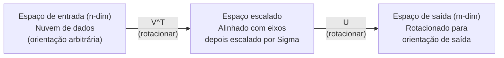
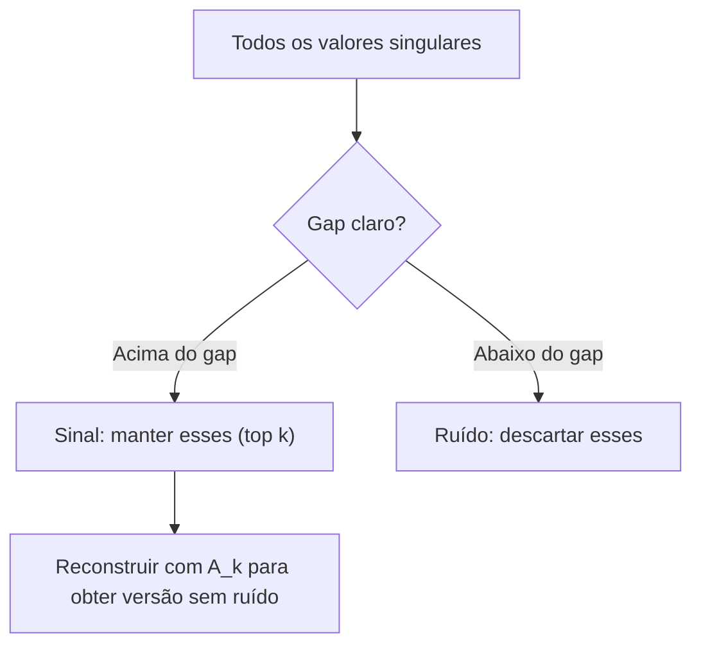

# Decomposição em Valores Singulares

> SVD é a canivete suíço da álgebra linear. Toda matriz tem uma. Todo cientista de dados precisa de uma.

**Tipo:** Construção
**Idiomas:** Python, Julia
**Pré-requisitos:** Fase 1, Lições 01 (Intuição de Álgebra Linear), 02 (Operações de Vetores & Matrizes), 03 (Transformações de Matriz)
**Tempo:** ~120 minutos

## Objetivos de Aprendizado

- Implementar SVD via iteração de potência e explicar o significado geométrico de U, Sigma e V^T
- Aplicar SVD truncado para compressão de imagens e medir a taxa de compressão vs erro de reconstrução
- Calcular a pseudo-inversa de Moore-Penrose via SVD para resolver sistemas de mínimos quadrados sobredeterminados
- Conectar SVD a PCA, sistemas de recomendação (fatores latentes) e Análise Semântica Latente em NLP

## O Problema

Você tem uma matriz 1000x2000. Talvez sejam avaliações de usuários-filmes. Talvez seja uma tabela de frequência documento-termo. Talvez sejam os valores de pixel de uma imagem. Você precisa comprimi-la, removê-la de ruído, encontrar estrutura oculta nela, ou resolver um sistema de mínimos quadrados com ela. Autodecomposição só funciona em matrizes quadradas. Mesmo assim, requer que a matriz tenha um conjunto completo de autovetores linearmente independentes.

SVD funciona em qualquer matriz. Qualquer forma. Qualquer posto. Sem condições. Ele decompõe a matriz em três fatores que revelam a geometria do que a matriz faz com o espaço. É a fatoração mais geral e mais útil de toda a álgebra linear.

## O Conceito

### O que o SVD faz geometricamente

Toda matriz, independentemente da forma, realiza três operações em sequência: rotacionar, escalar, rotacionar. O SVD torna essa decomposição explícita.

```
A = U * Sigma * V^T

      m x n     m x m    m x n    n x n
     (qualquer) (rotacionar) (escalar) (rotacionar)
```

Dada qualquer matriz A, o SVD a fatora em:
- V^T rotaciona vetores no espaço de entrada (n-dimensional)
- Sigma escala ao longo de cada eixo (alonga ou comprime)
- U rotaciona o resultado para o espaço de saída (m-dimensional)



Pense assim. Você passa uma matriz pro SVD. Ele diz: "Essa matriz pega uma esfera de entradas, primeiro rotaciona ela por V^T, depois estica em um elipsoide por Sigma, depois rotaciona o elipsoide por U." Os valores singulares são os comprimentos dos eixos do elipsoide.

### A decomposição completa

Para uma matriz A com forma m x n:

```
A = U * Sigma * V^T

onde:
  U     é m x m, ortogonal (U^T U = I)
  Sigma é m x n, diagonal (valores singulares na diagonal)
  V     é n x n, ortogonal (V^T V = I)

Os valores singulares sigma_1 >= sigma_2 >= ... >= sigma_r > 0
onde r = rank(A)
```

As colunas de U são chamadas de vetores singulares à esquerda. As colunas de V são chamadas de vetores singulares à direita. As entradas diagonais de Sigma são chamadas de valores singulares. Eles são sempre não-negativos e convencionalmente ordenados em ordem decrescente.

### Vetores singulares à esquerda, valores singulares, vetores singulares à direita

Cada componente do SVD tem um significado geométrico distinto.

**Vetores singulares à direita (colunas de V):** Eles formam uma base ortonormal para o espaço de entrada (R^n). São as direções no espaço de entrada que a matriz mapeia para direções ortogonais no espaço de saída. Pense neles como o sistema de coordenadas natural para o domínio.

**Valores singulares (diagonal de Sigma):** Eles são os fatores de escala. O i-ésimo valor singular diz quanto a matriz alonga vetores ao longo da i-ésima direção à direita. Um valor singular zero significa que a matriz esmague aquela direção completamente.

**Vetores singulares à esquerda (colunas de U):** Eles formam uma base ortonormal para o espaço de saída (R^m). O i-ésimo vetor singular à esquerda é a direção no espaço de saída onde o i-ésimo vetor singular à direita cai (após escalonamento).

A relação entre eles:

```
A * v_i = sigma_i * u_i

A matriz A pega o i-ésimo vetor singular à direita v_i,
escalona por sigma_i, e mapeia para o i-ésimo vetor singular à esquerda u_i.
```

Isso te dá uma imagem coordenada por coordenada do que qualquer matriz faz.

### Forma de produto externo

O SVD pode ser escrito como uma soma de matrizes de posto-1:

```
A = sigma_1 * u_1 * v_1^T + sigma_2 * u_2 * v_2^T + ... + sigma_r * u_r * v_r^T

Cada termo sigma_i * u_i * v_i^T é uma matriz de posto-1 (um produto externo).
A matriz completa é a soma de r dessas matrizes, onde r é o posto.
```

Essa forma é a base de aproximação de baixo posto. Cada termo adiciona uma camada de estrutura. O primeiro termo captura o padrão mais importante. O segundo captura o próximo mais importante. E assim por diante. Truncar essa soma te dá a melhor aproximação possível em qualquer posto dado.

```
Aprox rank-1:   A_1 = sigma_1 * u_1 * v_1^T
                (captura o padrão dominante)

Aprox rank-2:   A_2 = sigma_1 * u_1 * v_1^T + sigma_2 * u_2 * v_2^T
                (captura os dois padrões mais importantes)

Aprox rank-k:   A_k = soma dos top k termos
                (ótimo pelo teorema de Eckart-Young)
```

### Relação com autodecomposição

SVD e autodecomposição estão profundamente conectados. Os valores singulares e vetores de A vêm diretamente dos autovalores e autovetores de A^T A e A A^T.

```
A^T A = V * Sigma^T * U^T * U * Sigma * V^T
      = V * Sigma^T * Sigma * V^T
      = V * D * V^T

onde D = Sigma^T * Sigma é uma matriz diagonal com sigma_i^2 na diagonal.

Então:
- Os vetores singulares à direita (V) são autovetores de A^T A
- Os valores singulares ao quadrado (sigma_i^2) são autovalores de A^T A

Analogamente:
A A^T = U * Sigma * V^T * V * Sigma^T * U^T
      = U * Sigma * Sigma^T * U^T

Então:
- Os vetores singulares à esquerda (U) são autovetores de A A^T
- Os autovalores de A A^T também são sigma_i^2
```

Essa conexão te diz três coisas:
1. Valores singulares são sempre reais e não-negativos (são raízes quadradas de autovalores de uma matriz semi-definida positiva).
2. Você poderia calcular SVD via autodecomposição de A^T A, mas isso eleva ao quadrado o número de condição e perde precisão numérica. Algoritmos de SVD dedicados evitam isso.
3. Quando A é quadrada e simétrica semi-definida positiva, SVD e autodecomposição são a mesma coisa.

### SVD truncado: aproximação de baixo posto

O teorema de Eckart-Young-Mirsky afirma que a melhor aproximação de rank-k para A (em ambas as normas de Frobenius e eespecificaçãotral) é obtida mantendo apenas os top k valores singulares e seus vetores correspondentes:

```
A_k = U_k * Sigma_k * V_k^T

onde:
  U_k     é m x k  (primeiras k colunas de U)
  Sigma_k é k x k  (bloco superior esquerdo k x k de Sigma)
  V_k     é n x k  (primeiras k colunas de V)

Erro de aproximação = sigma_{k+1}  (na norma eespecificaçãotral)
                    = sqrt(sigma_{k+1}^2 + ... + sigma_r^2)  (na norma de Frobenius)
```

Isso não é apenas "uma boa" aproximação. É provavelmente a melhor aproximação possível de rank k. Nenhuma outra matriz de rank k está mais perto de A.

| Componente | Magnitude relativa | Mantida na aprox de rank-3? |
|-----------|-------------------|---------------------------|
| sigma_1 | Maior | Sim |
| sigma_2 | Grande | Sim |
| sigma_3 | Médio-grande | Sim |
| sigma_4 | Médio | Não (erro) |
| sigma_5 | Médio-pequeno | Não (erro) |
| sigma_6 | Pequeno | Não (erro) |
| sigma_7 | Muito pequeno | Não (erro) |
| sigma_8 | Minúsculo | Não (erro) |

Mantendo top 3: A_3 captura os três maiores valores singulares. Erro = valores restantes (sigma_4 até sigma_8).

Se os valores singulares decaem rápido, um pequeno k captura a maior parte da matriz. Se decaem lentamente, a matriz não tem estrutura de baixo posto.

### Compressão de imagens com SVD

Uma imagem em tons de cinza é uma matriz de intensidades de pixel. Uma imagem 800x600 tem 480.000 valores. SVD permite aproximá-la com muito menos.

```
Imagem original: 800 x 600 = 480.000 valores

SVD com rank k:
  U_k:      800 x k valores
  Sigma_k:  k valores
  V_k:      600 x k valores
  Total:    k * (800 + 600 + 1) = k * 1401 valores

  k=10:   14.010 valores   (2.9% do original)
  k=50:   70.050 valores  (14.6% do original)
  k=100: 140.100 valores  (29.2% do original)

  A taxa de compressão melhora conforme k diminui,
  mas a qualidade visual degrada.
```

A intuição-chave: imagens naturais têm valores singulares que decaem rapidamente. Os primeiros valores singulares capturam a estrutura ampla (formas, gradientes). Os últimos capturam detalhes finos e ruído. Truncar em rank 50 geralmente produz uma imagem que parece quase idêntica à original usando 85% menos armazenamento.

### SVD para sistemas de recomendação

O Netflix Prize tornou isso famoso. Você tem uma matriz de avaliações usuário-filme onde a maioria das entradas está faltando.

```
             Movie1  Movie2  Movie3  Movie4  Movie5
  User1      [  5      ?       3       ?       1  ]
  User2      [  ?      4       ?       2       ?  ]
  User3      [  3      ?       5       ?       ?  ]
  User4      [  ?      ?       ?       4       3  ]

  ? = avaliação desconhecida
```

A ideia: essa matriz de avaliações tem baixo posto. Usuários não têm gostos completamente independentes. Existem uma mão cheia de fatores latentes (ação vs drama, antigo vs novo, cerebral vs visceral) que explicam a maioria das preferências.

SVD na matriz de avaliações (preenchida) decompõe em:
- U: perfis de usuários no espaço de fatores latentes
- Sigma: importância de cada fator latente
- V^T: perfis de filmes no espaço de fatores latentes

A avaliação prevista de um usuário para um filme é o produto escalar do perfil do usuário com o perfil do filme (ponderado pelos valores singulares). A aproximação de baixo posto preenche as entradas faltantes.

Na prática, você usa variantes como o SVD incremental do Simon Funk ou ALS (mínimos quadrados alternados) que lidam com dados faltantes diretamente. Mas a ideia central é a mesma: decomposição de fatores latentes via SVD.

### SVD em NLP: Análise Semântica Latente

Análise Semântica Latente (LSA), também chamada de Indexação Semântica Latente (LSI), aplica SVD a uma matriz termo-documento.

```
             Doc1   Doc2   Doc3   Doc4
  "cat"      [  3      0      1      0  ]
  "dog"      [  2      0      0      1  ]
  "fish"     [  0      4      1      0  ]
  "pet"      [  1      1      1      1  ]
  "ocean"    [  0      3      0      0  ]

Após SVD com rank k=2:

  Cada documento vira um ponto em "espaço conceitual" 2D.
  Cada termo vira um ponto no mesmo espaço 2D.
  Documentos sobre tópicos similares se agrupam.
  Termos com significados similares se agrupam.

  "cat" e "dog" ficam perto um do outro (pets terrestres).
  "fish" e "ocean" ficam perto um do outro (conceitos aquáticos).
  Doc1 e Doc3 se agrupam se compartilham tópicos similares.
```

LSA foi um dos primeiros métodos bem-sucedidos para capturar similaridade semântica de texto bruto. Funciona porque termos sinônimos tendem a aparecer em documentos similares, então o SVD os agrupa nas mesmas dimensões latentes. Word embeddings modernos (Word2Vec, GloVe) podem ser vistos como descendentes dessa ideia.

### SVD para redução de ruído

Dados com ruído têm sinal concentrado nos top valores singulares e ruído espalhado por todos os valores singulares. Truncar remove o piso de ruído.

**Valores singulares de sinal limpo:**

| Componente | Magnitude | Tipo |
|-----------|-----------|------|
| sigma_1 | Muito grande | Sinal |
| sigma_2 | Grande | Sinal |
| sigma_3 | Médio | Sinal |
| sigma_4 | Próximo a zero | Irrelevante |
| sigma_5 | Próximo a zero | Irrelevante |

**Valores singulares de sinal ruidoso (ruído adiciona a todos):**

| Componente | Magnitude | Tipo |
|-----------|-----------|------|
| sigma_1 | Muito grande | Sinal |
| sigma_2 | Grande | Sinal |
| sigma_3 | Médio | Sinal |
| sigma_4 | Pequeno | Ruído |
| sigma_5 | Pequeno | Ruído |
| sigma_6 | Pequeno | Ruído |
| sigma_7 | Pequeno | Ruído |



Isso é usado em processamento de sinais, medição científica e limpeza de dados. Sempre que você tiver uma matriz corrompida por ruído aditivo, SVD truncado é uma maneira fundamentada de separar sinal de ruído.

### Pseudo-inversa via SVD

A pseudo-inversa de Moore-Penrose A+ generaliza a inversão de matrizes para matrizes não-quadradas e singulares. SVD torna seu cálculo trivial.

```
Se A = U * Sigma * V^T, então:

A+ = V * Sigma+ * U^T

onde Sigma+ é formado por:
  1. Transpor Sigma (trocar linhas e colunas)
  2. Substituir cada entrada diagonal não-nula sigma_i por 1/sigma_i
  3. Deixar zeros como zeros

Para A (m x n):      A+ é (n x m)
Para Sigma (m x n):  Sigma+ é (n x m)
```

A pseudo-inversa resolve problemas de mínimos quadrados. Se Ax = b não tem solução exata (sistema sobredeterminado), então x = A+ b é a solução de mínimos quadrados (minimiza ||Ax - b||).

```
Sistema sobredeterminado (mais equações que incógnitas):

  [1  1]         [3]
  [2  1] x   =   [5]       Não existe solução exata.
  [3  1]         [6]

  x_ls = A+ b = V * Sigma+ * U^T * b

  Isso dá o x que minimiza a soma dos resíduos ao quadrado.
  Mesmo resultado que as equações normais (A^T A)^(-1) A^T b,
  mas numericamente mais estável.
```

### Vantagens de estabilidade numérica

Computar a autodecomposição de A^T A eleva os valores singulares ao quadrado (autovalores de A^T A são sigma_i^2). Isso eleva ao quadrado o número de condição, amplificando erros numéricos.

```
Exemplo:
  A tem valores singulares [1000, 1, 0.001]
  Número de condição de A: 1000 / 0.001 = 10^6

  A^T A tem autovalores [10^6, 1, 10^{-6}]
  Número de condição de A^T A: 10^6 / 10^{-6} = 10^{12}

  Calculando SVD diretamente: trabalha com número de condição 10^6
  Calculando via A^T A:        trabalha com número de condição 10^{12}
                               (6 dígitos extras de precisão perdidos)
```

Algoritmos modernos de SVD (bidiagonalização de Golub-Kahan) trabalham diretamente em A, nunca formando A^T A. É por isso que você deve sempre preferir `np.linalg.svd(A)` sobre `np.linalg.eig(A.T @ A)`.

### Conexão com PCA

PCA É SVD em dados centralizados. Isso não é uma analogia. É literalmente o mesmo cálculo.

```
Dada matriz de dados X (n_amostras x n_features), centralizada (média subtraída):

Matriz de covariância: C = (1/(n-1)) * X^T X

PCA encontra autovetores de C. Mas:

  X = U * Sigma * V^T    (SVD de X)

  X^T X = V * Sigma^2 * V^T

  C = (1/(n-1)) * V * Sigma^2 * V^T

Então as componentes principais são exatamente os vetores singulares à direita V.
A variância explicada para cada componente é sigma_i^2 / (n-1).

No sklearn, PCA é implementado usando SVD, não autodecomposição.
É mais rápido e numericamente mais estável.
```

Isso significa que tudo que você aprendeu sobre redução de dimensionalidade na Lição 10 é SVD por baixo dos panos. PCA é a aplicação mais comum de SVD em machine learning.

## Construa

### Passo 1: SVD do zero usando iteração de potência

A ideia: para encontrar o maior valor singular e seus vetores, use iteração de potência em A^T A (ou A A^T). Depois defla a matriz e repita para o próximo valor singular.

```python
import numpy as np

def power_iteration(M, num_iters=100):
    n = M.shape[1]
    v = np.random.randn(n)
    v = v / np.linalg.norm(v)

    for _ in range(num_iters):
        Mv = M @ v
        v = Mv / np.linalg.norm(Mv)

    eigenvalue = v @ M @ v
    return eigenvalue, v

def svd_from_scratch(A, k=None):
    m, n = A.shape
    if k is None:
        k = min(m, n)

    sigmas = []
    us = []
    vs = []

    A_residual = A.copy().astype(float)

    for _ in range(k):
        AtA = A_residual.T @ A_residual
        eigenvalue, v = power_iteration(AtA, num_iters=200)

        if eigenvalue < 1e-10:
            break

        sigma = np.sqrt(eigenvalue)
        u = A_residual @ v / sigma

        sigmas.append(sigma)
        us.append(u)
        vs.append(v)

        A_residual = A_residual - sigma * np.outer(u, v)

    U = np.column_stack(us) if us else np.empty((m, 0))
    S = np.array(sigmas)
    V = np.column_stack(vs) if vs else np.empty((n, 0))

    return U, S, V
```

### Passo 2: Teste e comparação com NumPy

```python
np.random.seed(42)
A = np.random.randn(5, 4)

U_ours, S_ours, V_ours = svd_from_scratch(A)
U_np, S_np, Vt_np = np.linalg.svd(A, full_matrices=False)

print("Our singular values:", np.round(S_ours, 4))
print("NumPy singular values:", np.round(S_np, 4))

A_reconstructed = U_ours @ np.diag(S_ours) @ V_ours.T
print(f"Reconstruction error: {np.linalg.norm(A - A_reconstructed):.8f}")
```

### Passo 3: Demonstração de compressão de imagem

```python
def compress_image_svd(image_matrix, k):
    U, S, Vt = np.linalg.svd(image_matrix, full_matrices=False)
    compressed = U[:, :k] @ np.diag(S[:k]) @ Vt[:k, :]
    return compressed

image = np.random.seed(42)
rows, cols = 200, 300
image = np.random.randn(rows, cols)

for k in [1, 5, 10, 20, 50]:
    compressed = compress_image_svd(image, k)
    error = np.linalg.norm(image - compressed) / np.linalg.norm(image)
    original_size = rows * cols
    compressed_size = k * (rows + cols + 1)
    ratio = compressed_size / original_size
    print(f"k={k:>3d}  error={error:.4f}  storage={ratio:.1%}")
```

### Passo 4: Redução de ruído

```python
np.random.seed(42)
clean = np.outer(np.sin(np.linspace(0, 4*np.pi, 100)),
                 np.cos(np.linspace(0, 2*np.pi, 80)))
noise = 0.3 * np.random.randn(100, 80)
noisy = clean + noise

U, S, Vt = np.linalg.svd(noisy, full_matrices=False)
denoised = U[:, :5] @ np.diag(S[:5]) @ Vt[:5, :]

print(f"Noisy error:    {np.linalg.norm(noisy - clean):.4f}")
print(f"Denoised error: {np.linalg.norm(denoised - clean):.4f}")
print(f"Improvement:    {(1 - np.linalg.norm(denoised - clean) / np.linalg.norm(noisy - clean)):.1%}")
```

### Passo 5: Pseudo-inversa

```python
A = np.array([[1, 1], [2, 1], [3, 1]], dtype=float)
b = np.array([3, 5, 6], dtype=float)

U, S, Vt = np.linalg.svd(A, full_matrices=False)
S_inv = np.diag(1.0 / S)
A_pinv = Vt.T @ S_inv @ U.T

x_svd = A_pinv @ b
x_lstsq = np.linalg.lstsq(A, b, rcond=None)[0]
x_pinv = np.linalg.pinv(A) @ b

print(f"SVD pseudoinverse solution:  {x_svd}")
print(f"np.linalg.lstsq solution:   {x_lstsq}")
print(f"np.linalg.pinv solution:    {x_pinv}")
```

## Use

Demos completos funcionais estão em `code/svd.py`. Execute para ver SVD aplicado a compressão de imagens, sistemas de recomendação, análise semântica latente e redução de ruído.

```bash
python svd.py
```

A versão Julia em `code/svd.jl` demonstra os mesmos conceitos usando a função nativa `svd()` do Julia e o pacote `LinearAlgebra`.

```bash
julia svd.jl
```

## Entregue

Esta lição produz:
- `outputs/skill-svd.md` - uma skill para saber quando e como aplicar SVD em projetos reais

## Exercícios

1. Implemente SVD completa do zero sem usar iteração de potência. Em vez disso, calcule a autodecomposição de A^T A para obter V e os valores singulares, depois calcule U = A V Sigma^{-1}. Compare a precisão numérica com sua versão de iteração de potência e com NumPy.

2. Carregue uma imagem real em tons de cinza (ou converta uma). Comprima em postos 1, 5, 10, 25, 50, 100. Para cada posto, calcule a taxa de compressão e o erro relativo. Encontre o posto onde a imagem se torna visualmente aceitável.

3. Construa um pequeno sistema de recomendação. Crie uma matriz de avaliações usuário-filme 10x8 com algumas entradas conhecidas. Preencha as entradas faltantes com médias de linha. Calcule SVD e reconstrua uma aproximação de rank-3. Use a matriz reconstruída para prever as avaliações faltantes. Verifique que as previsões são razoáveis.

4. Crie uma matriz termo-documento 100x50 com 3 tópicos sintéticos. Cada tópico tem 5 termos associados. Adicione ruído. Aplique SVD e verifique que os top 3 valores singulares são muito maiores que o resto. Projete documentos no espaço latente 3D e verifique que documentos do mesmo tópico se agrupam.

5. Gere uma matriz de baixo posto limpa (posto 3, tamanho 50x40) e adicione ruído gaussiano em diferentes níveis (sigma = 0.1, 0.5, 1.0, 2.0). Para cada nível de ruído, encontre o posto de truncamento ótimo variando k de 1 a 40 e medindo o erro de reconstrução contra a matriz limpa. Plote como o k ótimo muda com o nível de ruído.

## Termos-Chave

| Termo | O que as pessoas dizem | O que realmente significa |
|-------|----------------------|--------------------------|
| SVD | "Fatorar qualquer matriz" | Decompor A em U Sigma V^T onde U e V são ortogonais e Sigma é diagonal com entradas não-negativas. Funciona para qualquer matriz de qualquer forma. |
| Valor singular | "Quão importante essa componente é" | A i-ésima entrada diagonal de Sigma. Mede quanto a matriz alonga ao longo da i-ésima direção principal. Sempre não-negativo, ordenado em ordem decrescente. |
| Vetor singular à esquerda | "Direção de saída" | Uma coluna de U. A direção no espaço de saída que o i-ésimo vetor singular à direita mapeia (após escalonamento por sigma_i). |
| Vetor singular à direita | "Direção de entrada" | Uma coluna de V. A direção no espaço de entrada que a matriz mapeia para o i-ésimo vetor singular à esquerda (após escalonamento por sigma_i). |
| SVD truncado | "Aproximação de baixo posto" | Manter apenas os top k valores singulares e seus vetores. Produz a melhor aproximação provável de rank-k para a matriz original (teorema de Eckart-Young). |
| Posto | "Dimensionalidade real" | O número de valores singulares não-nulos. Diz quantas direções independentes a matriz realmente usa. |
| Pseudo-inversa | "Inversa generalizada" | V Sigma+ U^T. Inverte valores singulares não-nulos, deixa zeros como zeros. Resolve problemas de mínimos quadrados para matrizes não-quadradas ou singulares. |
| Número de condição | "Quão sensível a erros" | sigma_max / sigma_min. Um número de condição grande significa que pequenas mudanças de entrada causam grandes mudanças de saída. SVD revela isso diretamente. |
| Fator latente | "Variável oculta" | Uma dimensão no espaço de baixo posto descoberta por SVD. Em recomendações, um fator latente pode corresponder a preferência de gênero. Em NLP, pode corresponder a um tópico. |
| Norma de Frobenius | "Tamanho total da matriz" | Raiz quadrada da soma das entradas ao quadrado. Igual à raiz quadrada da soma dos valores singulares ao quadrado. Usada para medir erro de aproximação. |
| Teorema de Eckart-Young | "SVD dá a melhor compressão" | Para qualquer rank-alvo k, o SVD truncado minimiza o erro de aproximação sobre todas as possíveis matrizes de rank-k. |
| Iteração de potência | "Encontrar o maior autovetor" | Multiplicar repetidamente um vetor aleatório pela matriz e normalizar. Converge para o autovetor com o maior autovalor. O bloco construtor de muitos algoritmos de SVD. |

## Leitura Adicional

- [Gilbert Strang: Linear Algebra and Its Applications, Capítulo 7](https://math.mit.edu/~gs/linearalgebra/) - tratamento completo de SVD com aplicações
- [3Blue1Brown: Mas o que é o SVD?](https://www.youtube.com/watch?v=vSczTbgc8Rc) - intuição geométrica para SVD
- [We Recommend a Singular Value Decomposition](https://www.ams.org/publicoutreach/feature-column/fcarc-svd) - visão geral acessível da American Mathematical Society
- [Netflix Prize e Matrix Factorization](https://sifter.org/~simon/journal/20061211.html) - post original do blog do Simon Funk sobre SVD para recomendações
- [Análise Semântica Latente](https://en.wikipedia.org/wiki/Latent_semantic_analysis) - a aplicação original de NLP do SVD
- [Álgebra Linear Numérica de Trefethen e Bau](https://people.maths.ox.ac.uk/trefethen/text.html) - o padrão ouro para entender algoritmos de SVD e suas propriedades numéricas
