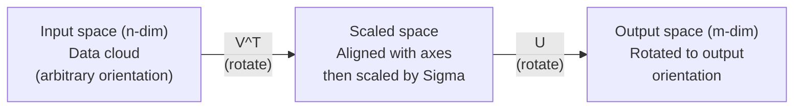
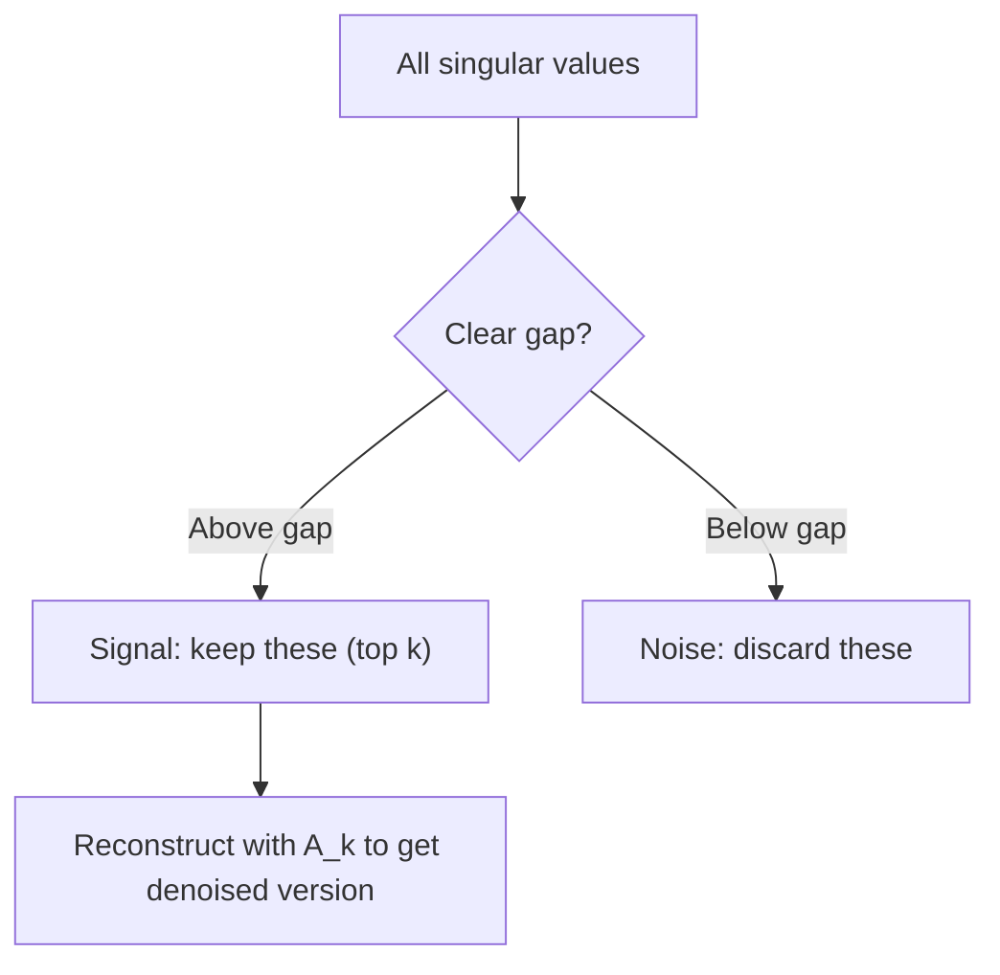

# Tekil Değer Ayrışımı

> SVD, doğrusal cebirin İsviçre Çakısı'dır. Her matrisin bir tane vardır. Her veri bilimcinin buna ihtiyacı vardır.

**Tür:** Yapım
**Diller:** Python, Julia
**Önkoşullar:** Aşama 1, Dersler 01 (Doğrusal Cebir Sezgisi), 02 (Vektörler ve Matris İşlemleri), 03 (Matris Dönüşümleri)
**Süre:** ~120 dakika

## Öğrenme Hedefleri

- Güç yinelemesi yoluyla SVD'yi uygulayın ve U, Sigma ve V^T'nin geometrik anlamını açıklayın
- Görüntü sıkıştırma için kesik SVD uygulayın ve sıkıştırma oranını ve yeniden yapılandırma hatasını ölçün
- Aşırı belirlenmiş en küçük kareler sistemlerini çözmek için Moore-Penrose sözde tersini SVD aracılığıyla hesaplayın
- SVD'yi PCA'ya, öneri sistemlerine (gizli faktörler) ve NLP'de Gizli Semantik Analize bağlayın

## Sorun

1000x2000'lik bir matrisiniz var. Belki de kullanıcı filmi derecelendirmeleridir. Belki bir belge-terim sıklık tablosudur. Belki bir görüntünün piksel değerleridir. Onu sıkıştırmanız, gürültüsünü gidermeniz, içindeki gizli yapıyı bulmanız veya onunla en küçük kareler sistemini çözmeniz gerekiyor. Öz bileşim yalnızca kare matrislerde çalışır. O zaman bile, matrisin tam bir doğrusal bağımsız özvektörler setine sahip olması gerekir.

SVD herhangi bir matris üzerinde çalışır. Herhangi bir şekil. Herhangi bir rütbe. Koşul yok. Matrisin uzaya yaptığı şeyin geometrisini ortaya çıkaran üç faktöre ayrıştırır. Tüm lineer cebirdeki en genel ve en kullanışlı çarpanlara ayırma yöntemidir.

## Konsept

### SVD geometrik olarak ne yapar?

Şekli ne olursa olsun her matris sırayla üç işlemi gerçekleştirir: döndürme, ölçeklendirme, döndürme. SVD bu ayrıştırmayı açıkça ortaya koymaktadır.

```
A = U * Sigma * V^T

      m x n     m x m    m x n    n x n
     (any)    (rotate)  (scale)  (rotate)
```

Herhangi bir A matrisi verildiğinde, SVD bunu şu şekilde hesaba katar:
- V^T giriş uzayındaki vektörleri döndürür (n-boyutlu)
- Sigma her eksen boyunca ölçeklenir (uzar veya sıkıştırır)
- U sonucu çıktı alanına döndürür (m boyutlu)



Bunu bu şekilde düşünün. SVD'ye bir matris veriyorsunuz. Size şunu söyler: "Bu matris bir girdi küresi alır, önce onu V^T kadar döndürür, sonra onu Sigma kadar bir elipsoide kadar uzatır, sonra elipsoidi U kadar döndürür." Tekil değerler elipsoidin eksenlerinin uzunluklarıdır.

### Tam ayrıştırma

m x n şeklindeki bir A matrisi için:

```
A = U * Sigma * V^T

where:
  U     is m x m, orthogonal (U^T U = I)
  Sigma is m x n, diagonal (singular values on the diagonal)
  V     is n x n, orthogonal (V^T V = I)

The singular values sigma_1 >= sigma_2 >= ... >= sigma_r > 0
where r = rank(A)
```

U'nun sütunlarına sol tekil vektörler denir. V'nin sütunlarına dik tekil vektörler denir. Sigma'nın köşegen girişlerine tekil değerler denir. Her zaman negatif değildirler ve geleneksel olarak azalan düzende sıralanırlar.

### Sol tekil vektörler, tekil değerler, sağ tekil vektörler

SVD'nin her bileşeninin ayrı bir geometrik anlamı vardır.

**Sağ tekil vektörler (V sütunları):** Bunlar, girdi uzayı (R^n) için ortonormal bir temel oluşturur. Bunlar, matrisin çıktı uzayındaki dik yönlere eşlediği girdi uzayındaki yönlerdir. Bunları alanın doğal koordinat sistemi olarak düşünün.

**Tekil değerler (Sigma'nın köşegeni):** Bunlar ölçeklendirme faktörleridir. i'inci tekil değer, matrisin vektörleri i'inci sağ tekil vektör boyunca ne kadar uzattığını gösterir. Sıfırın tekil değeri, matrisin bu yönü tamamen ezdiği anlamına gelir.

**Sol tekil vektörler (U sütunları):** Bunlar, çıktı uzayı (R^m) için ortonormal bir temel oluşturur. i'inci sol tekil vektör, çıktı uzayında i'inci sağ tekil vektörün (ölçeklemeden sonra) indiği yöndür.

Aralarındaki ilişki:

```
A * v_i = sigma_i * u_i

The matrix A takes the i-th right singular vector v_i,
scales it by sigma_i, and maps it to the i-th left singular vector u_i.
```

Bu size herhangi bir matrisin ne yaptığının koordinat bazında bir resmini verir.

### Dış ürün formu

SVD, 1. sıradaki matrislerin toplamı olarak yazılabilir:

```
A = sigma_1 * u_1 * v_1^T + sigma_2 * u_2 * v_2^T + ... + sigma_r * u_r * v_r^T

Each term sigma_i * u_i * v_i^T is a rank-1 matrix (an outer product).
The full matrix is the sum of r such matrices, where r is the rank.
```

Bu form düşük dereceli yaklaşımın temelidir. Her terim bir yapı katmanı ekler. İlk terim en önemli tek modeli yakalar. İkincisi bir sonraki en önemli şeyi yakalar. Ve benzeri. Bu toplamı kesmek size herhangi bir sıralamada mümkün olan en iyi yaklaşımı verir.

```
Rank-1 approx:    A_1 = sigma_1 * u_1 * v_1^T
                  (captures the dominant pattern)

Rank-2 approx:    A_2 = sigma_1 * u_1 * v_1^T + sigma_2 * u_2 * v_2^T
                  (captures the two most important patterns)

Rank-k approx:    A_k = sum of top k terms
                  (optimal by the Eckart-Young theorem)
```

### Özayrışma ile ilişki

SVD ve öz bileşim derinden bağlantılıdır. A'nın tekil değerleri ve vektörleri doğrudan A^TA A ve A A^T'nin özdeğerlerinden ve özvektörlerinden gelir.

```
A^T A = V * Sigma^T * U^T * U * Sigma * V^T
      = V * Sigma^T * Sigma * V^T
      = V * D * V^T

where D = Sigma^T * Sigma is a diagonal matrix with sigma_i^2 on the diagonal.

So:
- The right singular vectors (V) are eigenvectors of A^T A
- The singular values squared (sigma_i^2) are eigenvalues of A^T A

Similarly:
A A^T = U * Sigma * V^T * V * Sigma^T * U^T
      = U * Sigma * Sigma^T * U^T

So:
- The left singular vectors (U) are eigenvectors of A A^T
- The eigenvalues of A A^T are also sigma_i^2
```

Bu bağlantı size üç şeyi anlatır:
1. Tekil değerler her zaman gerçektir ve negatif değildir (pozitif yarı tanımlı bir matrisin özdeğerlerinin karekökleridir).
2. SVD'yi A^T A'nın öz bileşimi yoluyla hesaplayabilirsiniz, ancak bu durum sayısının karesini alır ve sayısal kesinliği kaybeder. Özel SVD algoritmaları bunu önler.
3. A kare ve simetrik pozitif yarı tanımlı olduğunda, SVD ve özbileşim aynı şeydir.

### Kesilmiş SVD: düşük dereceli yaklaşım

Eckart-Young-Mirsky teoremi, A'ya (hem Frobenius'ta hem de spektral normda) en iyi k sıralı yaklaşımın yalnızca üst k tekil değerleri ve bunlara karşılık gelen vektörleri tutarak elde edildiğini belirtir:

```
A_k = U_k * Sigma_k * V_k^T

where:
  U_k     is m x k  (first k columns of U)
  Sigma_k is k x k  (top-left k x k block of Sigma)
  V_k     is n x k  (first k columns of V)

Approximation error = sigma_{k+1}  (in spectral norm)
                    = sqrt(sigma_{k+1}^2 + ... + sigma_r^2)  (in Frobenius norm)
```

Bu sadece "iyi" bir yaklaşım değildir. Bu muhtemelen k derecesinin mümkün olan en iyi yaklaşımıdır. Başka hiçbir k-rank matrisi A'ya daha yakın değildir.

| Bileşen | Bağıl büyüklük | Yaklaşık olarak 3. sırada mı kaldınız? |
|-----------|-------------------|------------------------|
| sigma_1 | En Büyük | Evet |
| sigma_2 | Büyük | Evet |
| sigma_3 | Orta-büyük | Evet |
| sigma_4 | Orta | Hayır (hata) |
| sigma_5 | Orta-küçük | Hayır (hata) |
| sigma_6 | Küçük | Hayır (hata) |
| sigma_7 | Çok küçük | Hayır (hata) |
| sigma_8 | Minik | Hayır (hata) |

İlk 3'ü koru: A_3 en büyük üç tekil değeri yakalar. Hata = kalan değerler (sigma_4'ten sigma_8'e kadar).

Tekil değerler hızlı bir şekilde bozulursa, küçük bir k matrisin çoğunu yakalar. Yavaş bozunurlarsa matrisin düşük dereceli yapısı olmaz.

### SVD ile görüntü sıkıştırma

Gri tonlamalı bir görüntü, piksel yoğunluklarının bir matrisidir. 800x600 boyutunda bir görüntünün 480.000 değeri vardır. SVD, çok daha azıyla yaklaşmanıza olanak tanır.

```
Original image: 800 x 600 = 480,000 values

SVD with rank k:
  U_k:      800 x k values
  Sigma_k:  k values
  V_k:      600 x k values
  Total:    k * (800 + 600 + 1) = k * 1401 values

  k=10:   14,010 values   (2.9% of original)
  k=50:   70,050 values  (14.6% of original)
  k=100: 140,100 values  (29.2% of original)

  The compression ratio improves as k gets smaller,
  but visual quality degrades.
```

Temel içgörü: Doğal görüntülerin hızla bozulan tekil değerleri vardır. İlk birkaç tekil değer geniş yapıyı yakalar (şekiller, gradient'ler). Daha sonrakiler ince ayrıntıları ve gürültüyü yakalar. 50. seviyede kesme, genellikle %85 daha az depolama alanı kullanırken orijinaliyle neredeyse aynı görünen bir görüntü üretir.

### Öneri sistemleri için SVD

Netflix Ödülü bunu ünlü yaptı. Çoğu girişin eksik olduğu bir kullanıcı filmi derecelendirme matrisiniz var.

```
             Movie1  Movie2  Movie3  Movie4  Movie5
  User1      [  5      ?       3       ?       1  ]
  User2      [  ?      4       ?       2       ?  ]
  User3      [  3      ?       5       ?       ?  ]
  User4      [  ?      ?       ?       4       3  ]

  ? = unknown rating
```

Fikir şu: Bu derecelendirme matrisinin sıralaması düşük. Kullanıcıların tamamen bağımsız zevkleri yoktur. Tercihlerin çoğunu açıklayan bir avuç gizli faktör (aksiyona karşı drama, eskiye karşı yeni, beyinsele karşı içgüdüsel) vardır.

(Doldurulmuş) derecelendirme matrisindeki SVD, onu şu şekilde ayrıştırır:
- U: gizli faktör uzayındaki kullanıcı profilleri
- Sigma: her gizli faktörün önemi
- V^T: gizli faktör uzayındaki film profilleri

Bir kullanıcının bir film için tahmin edilen puanı, kullanıcı profili ile filmin profilinin nokta çarpımıdır (tekil değerlerle ağırlıklandırılmıştır). Düşük dereceli yaklaşım eksik girdileri doldurur.

Uygulamada, eksik verileri doğrudan işleyen Simon Funk'un artımlı SVD'si veya ALS (alternatif en küçük kareler) gibi değişkenleri kullanırsınız. Ancak temel fikir aynı: SVD yoluyla gizli faktör ayrıştırması.

### NLP'de SVD: Gizli Semantik Analiz

Gizli Anlamsal Dizin Oluşturma (LSI) olarak da adlandırılan Gizli Anlamsal Analiz (LSA), SVD'yi bir terim-belge matrisine uygular.

```
             Doc1   Doc2   Doc3   Doc4
  "cat"      [  3      0      1      0  ]
  "dog"      [  2      0      0      1  ]
  "fish"     [  0      4      1      0  ]
  "pet"      [  1      1      1      1  ]
  "ocean"    [  0      3      0      0  ]

After SVD with rank k=2:

  Each document becomes a point in 2D "concept space."
  Each term becomes a point in the same 2D space.
  Documents about similar topics cluster together.
  Terms with similar meanings cluster together.

  "cat" and "dog" end up near each other (land pets).
  "fish" and "ocean" end up near each other (water concepts).
  Doc1 and Doc3 cluster if they share similar topics.
```

LSA, ham metinden anlamsal benzerliği yakalamanın ilk başarılı yöntemlerinden biriydi. İşe yarar çünkü eşanlamlı terimler benzer belgelerde görünme eğilimindedir; dolayısıyla SVD bunları aynı gizli boyutlara gruplandırır. Modern kelime embedding'ler (Word2Vec, GloVe) bu fikrin torunları olarak görülebilir.

### Gürültü azaltma için SVD

Gürültülü verilerde sinyal en üstteki tekil değerlerde yoğunlaşır ve gürültü tüm tekil değerlere yayılır. Kesmek gürültü tabanını ortadan kaldırır.

**Temiz sinyal tekil değerleri:**

| Bileşen | Büyüklük | Tür |
|-----------|-----------|------|
| sigma_1 | Çok büyük | Sinyal |
| sigma_2 | Büyük | Sinyal |
| sigma_3 | Orta | Sinyal |
| sigma_4 | Sıfıra yakın | İhmal edilebilir |
| sigma_5 | Sıfıra yakın | İhmal edilebilir |

**Gürültülü sinyalin tekil değerleri (gürültü hepsine eklenir):**

| Bileşen | Büyüklük | Tür |
|-----------|-----------|------|
| sigma_1 | Çok büyük | Sinyal |
| sigma_2 | Büyük | Sinyal |
| sigma_3 | Orta | Sinyal |
| sigma_4 | Küçük | Gürültü |
| sigma_5 | Küçük | Gürültü |
| sigma_6 | Küçük | Gürültü |
| sigma_7 | Küçük | Gürültü |



Bu, sinyal işlemede, bilimsel ölçümde ve veri temizlemede kullanılır. Eklemeli gürültü nedeniyle bozulan bir matrisiniz olduğunda, kesik SVD, sinyali gürültüden ayırmanın ilkeli bir yoludur.

### SVD aracılığıyla sözde ters

Moore-Penrose sözde ters A+, matris ters çözümünü kare olmayan ve tekil matrislere genelleştirir. SVD, hesaplamayı önemsiz hale getirir.

```
If A = U * Sigma * V^T, then:

A+ = V * Sigma+ * U^T

where Sigma+ is formed by:
  1. Transpose Sigma (swap rows and columns)
  2. Replace each non-zero diagonal entry sigma_i with 1/sigma_i
  3. Leave zeros as zeros

For A (m x n):      A+ is (n x m)
For Sigma (m x n):  Sigma+ is (n x m)
```

Sözde ters en küçük kareler problemlerini çözer. Eğer Ax = b'nin kesin çözümü yoksa (aşırı belirlenmiş sistem), o zaman x = A+ b en küçük kareler çözümüdür ( ||Ax - b||'yi minimuma indirir).

```
Overdetermined system (more equations than unknowns):

  [1  1]         [3]
  [2  1] x   =   [5]       No exact solution exists.
  [3  1]         [6]

  x_ls = A+ b = V * Sigma+ * U^T * b

  This gives the x that minimizes the sum of squared residuals.
  Same result as the normal equations (A^T A)^(-1) A^T b,
  but numerically more stable.
```

### Sayısal kararlılığın avantajları

A^T A'nın öz bileşiminin hesaplanması, tekil değerlerin karesini alır (A^TA'nın öz değerleri sigma_i^2'dir). Bu, durum sayısının karesini alarak sayısal hataları artırır.

```
Example:
  A has singular values [1000, 1, 0.001]
  Condition number of A: 1000 / 0.001 = 10^6

  A^T A has eigenvalues [10^6, 1, 10^{-6}]
  Condition number of A^T A: 10^6 / 10^{-6} = 10^{12}

  Computing SVD directly: works with condition number 10^6
  Computing via A^T A:     works with condition number 10^{12}
                           (6 extra digits of precision lost)
```

Modern SVD algoritmaları (Golub-Kahan iki köşegenleştirme) doğrudan A üzerinde çalışır, asla A^T A oluşturmaz. Bu nedenle her zaman `np.linalg.eig(A.T @ A)` yerine `np.linalg.svd(A)`'yi tercih etmelisiniz.

### PCA'ya bağlantı

PCA, ortalanmış verilerde SVD'dir. Bu bir benzetme değil. Kelimenin tam anlamıyla aynı hesaplamadır.

```
Given data matrix X (n_samples x n_features), centered (mean subtracted):

Covariance matrix: C = (1/(n-1)) * X^T X

PCA finds eigenvectors of C. But:

  X = U * Sigma * V^T    (SVD of X)

  X^T X = V * Sigma^2 * V^T

  C = (1/(n-1)) * V * Sigma^2 * V^T

So the principal components are exactly the right singular vectors V.
The explained variance for each component is sigma_i^2 / (n-1).

In sklearn, PCA is implemented using SVD, not eigendecomposition.
It is faster and more numerically stable.
```

Bu, Ders 10'da boyut azaltma hakkında öğrendiğiniz her şeyin SVD olduğu anlamına gelir. PCA, machine learning'deki en yaygın SVD uygulamasıdır.

```figure
svd-rank-reconstruction
```

## İnşa Et

### Adım 1: Güç yinelemesini kullanarak sıfırdan SVD

Fikir: En büyük tekil değeri ve vektörlerini bulmak için A^T A (veya A A^T) üzerinde güç yinelemesini kullanın. Daha sonra matrisin havasını söndürün ve bir sonraki tekil değer için işlemi tekrarlayın.

```python
import numpy as np

def power_iteration(M, num_iters=100):
    n = M.shape[1]
    v = np.random.randn(n)
    v = v / np.linalg.norm(v)

    for _ in range(num_iters):
        Mv = M @ v
        v = Mv / np.linalg.norm(Mv)

    eigenvalue = v @ M @ v
    return eigenvalue, v

def svd_from_scratch(A, k=None):
    m, n = A.shape
    if k is None:
        k = min(m, n)

    sigmas = []
    us = []
    vs = []

    A_residual = A.copy().astype(float)

    for _ in range(k):
        AtA = A_residual.T @ A_residual
        eigenvalue, v = power_iteration(AtA, num_iters=200)

        if eigenvalue < 1e-10:
            break

        sigma = np.sqrt(eigenvalue)
        u = A_residual @ v / sigma

        sigmas.append(sigma)
        us.append(u)
        vs.append(v)

        A_residual = A_residual - sigma * np.outer(u, v)

    U = np.column_stack(us) if us else np.empty((m, 0))
    S = np.array(sigmas)
    V = np.column_stack(vs) if vs else np.empty((n, 0))

    return U, S, V
```

### Adım 2: NumPy ile test edin ve karşılaştırın

```python
np.random.seed(42)
A = np.random.randn(5, 4)

U_ours, S_ours, V_ours = svd_from_scratch(A)
U_np, S_np, Vt_np = np.linalg.svd(A, full_matrices=False)

print("Our singular values:", np.round(S_ours, 4))
print("NumPy singular values:", np.round(S_np, 4))

A_reconstructed = U_ours @ np.diag(S_ours) @ V_ours.T
print(f"Reconstruction error: {np.linalg.norm(A - A_reconstructed):.8f}")
```

### Adım 3: Görüntü sıkıştırma demosu

```python
def compress_image_svd(image_matrix, k):
    U, S, Vt = np.linalg.svd(image_matrix, full_matrices=False)
    compressed = U[:, :k] @ np.diag(S[:k]) @ Vt[:k, :]
    return compressed

image = np.random.seed(42)
rows, cols = 200, 300
image = np.random.randn(rows, cols)

for k in [1, 5, 10, 20, 50]:
    compressed = compress_image_svd(image, k)
    error = np.linalg.norm(image - compressed) / np.linalg.norm(image)
    original_size = rows * cols
    compressed_size = k * (rows + cols + 1)
    ratio = compressed_size / original_size
    print(f"k={k:>3d}  error={error:.4f}  storage={ratio:.1%}")
```

### Adım 4: Gürültü azaltma

```python
np.random.seed(42)
clean = np.outer(np.sin(np.linspace(0, 4*np.pi, 100)),
                 np.cos(np.linspace(0, 2*np.pi, 80)))
noise = 0.3 * np.random.randn(100, 80)
noisy = clean + noise

U, S, Vt = np.linalg.svd(noisy, full_matrices=False)
denoised = U[:, :5] @ np.diag(S[:5]) @ Vt[:5, :]

print(f"Noisy error:    {np.linalg.norm(noisy - clean):.4f}")
print(f"Denoised error: {np.linalg.norm(denoised - clean):.4f}")
print(f"Improvement:    {(1 - np.linalg.norm(denoised - clean) / np.linalg.norm(noisy - clean)):.1%}")
```

### Adım 5: Sözde Ters

```python
A = np.array([[1, 1], [2, 1], [3, 1]], dtype=float)
b = np.array([3, 5, 6], dtype=float)

U, S, Vt = np.linalg.svd(A, full_matrices=False)
S_inv = np.diag(1.0 / S)
A_pinv = Vt.T @ S_inv @ U.T

x_svd = A_pinv @ b
x_lstsq = np.linalg.lstsq(A, b, rcond=None)[0]
x_pinv = np.linalg.pinv(A) @ b

print(f"SVD pseudoinverse solution:  {x_svd}")
print(f"np.linalg.lstsq solution:   {x_lstsq}")
print(f"np.linalg.pinv solution:    {x_pinv}")
```

## Kullan onu

Tam çalışma demoları `code/svd.py`'dedir. Görüntü sıkıştırmaya, öneri sistemlerine, gizli anlamsal analize ve gürültü azaltmaya uygulanan SVD'yi görmek için çalıştırın.

```bash
python svd.py
```

`code/svd.jl`'deki Julia sürümü, Julia'nın yerel `svd()` işlevini ve `LinearAlgebra` paketini kullanarak aynı kavramları gösterir.

```bash
julia svd.jl
```

## Gönderin

Bu ders şunları üretir:
- `outputs/skill-svd.md` - SVD'nin gerçek projelerde ne zaman ve nasıl uygulanacağını bilme becerisi

## Egzersizler

1. Güç yinelemesini kullanmadan SVD'nin tamamını sıfırdan uygulayın. Bunun yerine, V'yi ve tekil değerleri elde etmek için A^TA A'nın öz bileşimini hesaplayın, ardından U = AV Sigma^{-1}'yi hesaplayın. Sayısal doğruluğu güç yineleme sürümünüzle ve NumPy ile karşılaştırın.

2. Gerçek bir gri tonlamalı görüntü yükleyin (veya birini gri tonlamaya dönüştürün). 1, 5, 10, 25, 50, 100. sıralarda sıkıştırın. Her sıra için sıkıştırma oranını ve bağıl hatayı hesaplayın. Görüntünün görsel olarak kabul edilebilir hale geldiği sıralamayı bulun.

3. Küçük bir öneri sistemi oluşturun. Bilinen bazı girişleri içeren 10x8'lik bir kullanıcı filmi derecelendirme matrisi oluşturun. Eksik girişleri satır ortalamalarıyla doldurun. SVD'yi hesaplayın ve 3. sıra yaklaşımını yeniden oluşturun. Eksik derecelendirmeleri tahmin etmek için yeniden oluşturulan matrisi kullanın. Tahminlerin makul olduğunu doğrulayın.

4. 3 sentetik konu içeren 100x50'lik bir belge-terim matrisi oluşturun. Her konunun 5 ilişkili terimi vardır. Gürültü ekleyin. SVD'yi uygulayın ve ilk 3 tekil değerin diğerlerinden çok daha büyük olduğunu doğrulayın. Belgeleri 3B gizli alana yansıtın ve aynı konu kümesindeki belgeleri birlikte kontrol edin.

5. Temiz bir düşük dereceli matris oluşturun (derece 3, boyut 50x40) ve farklı seviyelerde Gauss gürültüsü ekleyin (sigma = 0,1, 0,5, 1,0, 2,0). Her gürültü seviyesi için, k'yi 1'den 40'a kadar süpürerek ve yeniden yapılandırma hatasını temiz matrise göre ölçerek en uygun kesme sırasını bulun. Optimum k'nin gürültü düzeyiyle nasıl değiştiğini çizin.

## Anahtar Terimler

| Dönem | İnsanlar ne diyor | Aslında ne anlama geliyor |
|------|----------------|----------------------|
| SVD | "Herhangi bir matrisi çarpanlarına ayır" | A'yı U Sigma V^T'ye ayrıştırın; burada U ve V diktir ve Sigma negatif olmayan girişlerle köşegendir. Herhangi bir şekle sahip herhangi bir matris için çalışır. |
| Tekil değer | "Bu bileşen ne kadar önemli" | Sigma'nın i'inci çapraz girişi. Matrisin i'inci asal yön boyunca ne kadar uzandığını ölçer. Her zaman negatif değildir, azalan düzende sıralanmıştır. |
| Sol tekil vektör | "Çıkış yönü" | Bir U sütunu. i'inci sağ tekil vektörün eşleştiği çıktı uzayındaki yön (sigma_i ile ölçeklendikten sonra). |
| Sağ tekil vektör | "Giriş yönü" | Bir V sütunu. Matrisin i'inci sol tekil vektöre eşlediği giriş uzayındaki yön (sigma_i ile ölçeklendirmeden sonra). |
| Kesilmiş SVD | "Düşük dereceli yaklaşım" | Yalnızca üstteki k tekil değerleri ve bunların vektörlerini saklayın. Orijinal matrise kanıtlanabilir en iyi k dereceli yaklaşımı üretir (Eckart-Young teoremi). |
| Sıra | "Gerçek boyutluluk" | Sıfır olmayan tekil değerlerin sayısı. Matrisin gerçekte kaç tane bağımsız yön kullandığını gösterir. |
| Sözde ters | "Genelleştirilmiş ters" | V Sigma+ U^T. Sıfır olmayan tekil değerleri tersine çevirir, sıfırları sıfır olarak bırakır. Kare olmayan veya tekil matrisler için en küçük kareler problemlerini çözer. |
| Durum numarası | "Hatalara karşı ne kadar duyarlı" | sigma_max / sigma_min. Büyük bir koşul numarası, küçük giriş değişikliklerinin büyük çıkış değişikliklerine neden olduğu anlamına gelir. SVD bunu doğrudan ortaya koyuyor. |
| Gizli faktör | "Gizli değişken" | SVD tarafından keşfedilen düşük dereceli uzayda bir boyut. Önerilerde gizli bir faktör tür tercihine karşılık gelebilir. NLP'de bir konuya karşılık gelebilir. |
| Frobenius normu | "Toplam matris boyutu" | Kareli girişlerin toplamının karekökü. Tekil değerlerin kareleri toplamının kareköküne eşittir. Yaklaşım hatasını ölçmek için kullanılır. |
| Eckart-Young teoremi | "SVD en iyi sıkıştırmayı sağlar" | Herhangi bir hedef sıra k için, kesik SVD, olası tüm sıra-k matrisler üzerindeki yaklaşım hatasını en aza indirir. |
| Güç yinelemesi | "En büyük özvektörü bulun" | Rastgele bir vektörü matrisle tekrar tekrar çarpın ve normalleştirin. En büyük özdeğere sahip özvektöre yakınsar. Birçok SVD algoritmasının yapı taşıdır. |

## Daha Fazla Okuma

- [Gilbert Strang: Lineer Cebir ve Uygulamaları, Bölüm 7](https://math.mit.edu/~gs/linearalgebra/) - SVD'nin uygulamalarla kapsamlı bir şekilde ele alınması
- [3Blue1Brown: Peki SVD nedir?](https://www.youtube.com/watch?v=vSczTbgc8Rc) - SVD için geometrik sezgi
- [Tekil Değer Ayrışımı Öneririz](https://www.ams.org/publicoutreach/feature-column/fcarc-svd) - Amerikan Matematik Derneği'nden erişilebilir genel bakış
- [Netflix Ödülü ve Matris Faktorizasyonu](https://sifter.org/~simon/journal/20061211.html) - Simon Funk'un öneriler için SVD hakkındaki orijinal blog yazısı
- [Gizli Semantik Analiz](https://en.wikipedia.org/wiki/Latent_semantic_analysis) - SVD'nin orijinal NLP uygulaması
- [Trefethen ve Bau'dan Sayısal Doğrusal Cebir](https://people.maths.ox.ac.uk/trefethen/text.html) - SVD algoritmalarını ve bunların sayısal özelliklerini anlamak için altın standart
