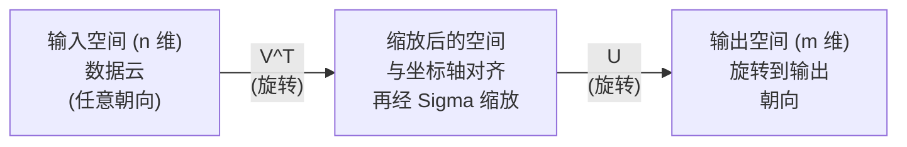
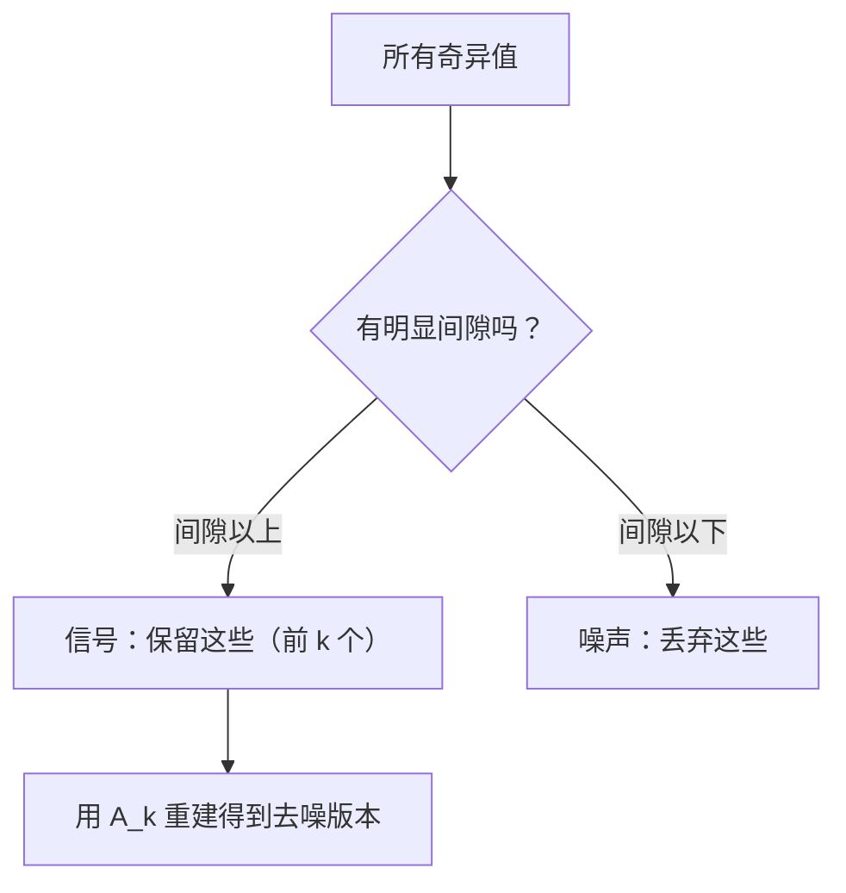

# 奇异值分解（Singular Value Decomposition）

> SVD 是线性代数中的瑞士军刀。每个矩阵都有一个 SVD。每个数据科学家都需要它。

**类型：** 构建
**语言：** Python, Julia
**先修知识：** 阶段 1，课程 01（线性代数直觉），02（向量与矩阵运算），03（矩阵变换）
**时间：** ~120 分钟

## 学习目标

- 通过幂迭代（Power Iteration）实现 SVD，并解释 U、Sigma 和 V^T 的几何意义
- 将截断 SVD（Truncated SVD）应用于图像压缩，并衡量压缩比与重建误差
- 通过 SVD 计算 Moore-Penrose 伪逆（Moore-Penrose Pseudoinverse）来求解超定最小二乘系统
- 将 SVD 与主成分分析（PCA）、推荐系统（潜在因子）以及自然语言处理中的潜在语义分析（Latent Semantic Analysis）联系起来

## 问题

你有一个 1000x2000 的矩阵。它可能是用户-电影评分矩阵，可能是文档-词频表，也可能是图像的像素值。你需要压缩它、降噪、发现其中的隐藏结构，或者用它求解最小二乘系统。特征分解（Eigendecomposition）只适用于方阵，而且即使对方阵，也要求矩阵具有一组完整的线性无关特征向量。

SVD 适用于任何矩阵。任何形状、任何秩、没有条件。它将矩阵分解为三个因子，揭示了矩阵对空间作用的几何结构。它是整个线性代数中最通用、最实用的分解。

## 概念

### SVD 的几何意义

每个矩阵，无论形状如何，都依次执行三个操作：旋转、缩放、旋转。SVD 使得这种分解显式化。

```
A = U * Sigma * V^T

      m x n     m x m    m x n    n x n
     (任意)   (旋转)   (缩放)   (旋转)
```

任意给定矩阵 A，SVD 将其分解为：
- V^T 旋转输入空间中的向量（n 维）
- Sigma 沿各轴缩放（拉伸或压缩）
- U 将结果旋转到输出空间（m 维）



可以这样理解：你把一个矩阵交给 SVD，它告诉你：“这个矩阵首先通过 V^T 旋转一个输入球面，然后通过 Sigma 将其拉伸成一个椭球，最后通过 U 旋转该椭球。”奇异值（Singular Values）就是椭球各轴的长度。

### 完整分解

对于形状为 m x n 的矩阵 A：

```
A = U * Sigma * V^T

其中：
  U     是 m x m 的正交矩阵（U^T U = I）
  Sigma 是 m x n 的对角矩阵（对角线上为奇异值）
  V     是 n x n 的正交矩阵（V^T V = I）

奇异值 sigma_1 >= sigma_2 >= ... >= sigma_r > 0
其中 r = rank(A)
```

U 的列称为左奇异向量（Left Singular Vectors），V 的列称为右奇异向量（Right Singular Vectors），Sigma 的对角线元素称为奇异值（Singular Values）。它们总是非负的，并且按惯例降序排列。

### 左奇异向量、奇异值、右奇异向量

SVD 的每个分量都有独特的几何意义。

**右奇异向量（V 的列）：** 它们构成了输入空间（R^n）的一组标准正交基。它们是输入空间中那些会被矩阵映射到输出空间中正交方向的方向。可以将其看作定义域的自然坐标系。

**奇异值（Sigma 的对角线）：** 它们是缩放因子。第 i 个奇异值告诉你矩阵沿着第 i 个右奇异向量方向拉伸的程度。奇异值为零意味着矩阵完全压碎了那个方向。

**左奇异向量（U 的列）：** 它们构成了输出空间（R^m）的一组标准正交基。第 i 个左奇异向量是第 i 个右奇异向量（经过缩放后）在输出空间中所落的方向。

它们之间的关系：

```
A * v_i = sigma_i * u_i

矩阵 A 将第 i 个右奇异向量 v_i 取出，
用 sigma_i 缩放后，映射到第 i 个左奇异向量 u_i 上。
```

这给出了任意矩阵作用的逐坐标图景。

### 外积形式

SVD 可以写成一系列秩1（Rank-1）矩阵的和：

```
A = sigma_1 * u_1 * v_1^T + sigma_2 * u_2 * v_2^T + ... + sigma_r * u_r * v_r^T

每个项 sigma_i * u_i * v_i^T 都是一个秩1矩阵（外积）。
整个矩阵是 r 个这样的项之和，其中 r 是矩阵的秩。
```

这种形式是低秩近似（Low-Rank Approximation）的基础。每一项都增加一层结构。第一项捕获了最重要的单一模式，第二项捕获次重要的模式，依此类推。截断这个和就能得到任意给定秩下的最佳近似。

```
秩1近似：    A_1 = sigma_1 * u_1 * v_1^T
            （捕获主导模式）

秩2近似：    A_2 = sigma_1 * u_1 * v_1^T + sigma_2 * u_2 * v_2^T
            （捕获两个最重要的模式）

秩k近似：    A_k = 前 k 项之和
            （根据 Eckart-Young 定理，这是最优的）
```

### 与特征分解的关系

SVD 与特征分解密切相关。A 的奇异值和向量直接来源于 A^T A 和 A A^T 的特征值与特征向量。

```
A^T A = V * Sigma^T * U^T * U * Sigma * V^T
      = V * Sigma^T * Sigma * V^T
      = V * D * V^T

其中 D = Sigma^T * Sigma 是一个对角矩阵，对角线元素为 sigma_i^2。

所以：
- 右奇异向量（V）是 A^T A 的特征向量
- 奇异值的平方（sigma_i^2）是 A^T A 的特征值

类似地：
A A^T = U * Sigma * V^T * V * Sigma^T * U^T
      = U * Sigma * Sigma^T * U^T

所以：
- 左奇异向量（U）是 A A^T 的特征向量
- A A^T 的特征值也是 sigma_i^2
```

这种联系告诉你三件事：
1. 奇异值总是实数并且非负（它们是半正定矩阵特征值的平方根）。
2. 你可以通过 A^T A 的特征分解来计算 SVD，但这会使条件数（Condition Number）平方化，损失数值精度。专门的 SVD 算法会避免这一点。
3. 当 A 是方阵且对称半正定时，SVD 与特征分解就是同一回事。

### 截断 SVD：低秩近似

Eckart-Young-Mirsky 定理指出，A 的最佳秩k近似（在 Frobenius 范数和谱范数下）可以通过只保留前 k 个最大奇异值及其对应向量得到：

```
A_k = U_k * Sigma_k * V_k^T

其中：
  U_k     是 m x k（U 的前 k 列）
  Sigma_k 是 k x k（Sigma 的左上角 k x k 子块）
  V_k     是 n x k（V 的前 k 列）

近似误差 = sigma_{k+1}（谱范数下）
         = sqrt(sigma_{k+1}^2 + ... + sigma_r^2)（Frobenius 范数下）
```

这不仅是“一个好的”近似，而且被证明是秩k条件下的最佳近似。没有其他秩k矩阵比它更接近 A。

| 分量 | 相对大小 | 保留在秩3近似中？ |
|------|----------|-------------------|
| sigma_1 | 最大 | 是 |
| sigma_2 | 大 | 是 |
| sigma_3 | 中-大 | 是 |
| sigma_4 | 中 | 否（误差） |
| sigma_5 | 中-小 | 否（误差） |
| sigma_6 | 小 | 否（误差） |
| sigma_7 | 非常小 | 否（误差） |
| sigma_8 | 极小 | 否（误差） |

保留前3个：A_3 捕获了三个最大的奇异值。误差等于剩余奇异值（sigma_4 到 sigma_8）的总和。

如果奇异值衰减很快，那么较小的 k 就能捕获矩阵的大部分信息。如果衰减缓慢，说明矩阵没有低秩结构。

### 图像压缩中的 SVD

灰度图像是一个像素强度矩阵。一张 800x600 的图像有 480,000 个值。SVD 可以用远少于这个数字的值来近似它。

```
原始图像：800 x 600 = 480,000 个值

秩k的 SVD：
  U_k：      800 x k 个值
  Sigma_k：  k 个值
  V_k：      600 x k 个值
  总计：    k * (800 + 600 + 1) = k * 1401 个值

  k=10：   14,010 个值（原图的 2.9%）
  k=50：   70,050 个值（原图的 14.6%）
  k=100： 140,100 个值（原图的 29.2%）

  压缩比随 k 减小而提高，
  但视觉质量会下降。
```

关键洞察：自然图像的奇异值衰减非常快。前几个奇异值捕获了整体结构（形状、渐变），后面的奇异值捕获了细节和噪声。截断到秩50通常能产生看起来几乎与原图相同、但存储量减少85%的图像。

### 推荐系统中的 SVD

Netflix Prize 使这一点名声大噪。你有一个用户-电影评分矩阵，其中大多数条目是缺失的。

```
             Movie1  Movie2  Movie3  Movie4  Movie5
  User1      [  5      ?       3       ?       1  ]
  User2      [  ?      4       ?       2       ?  ]
  User3      [  3      ?       5       ?       ?  ]
  User4      [  ?      ?       ?       4       3  ]

  ? = 未知评分
```

思路：这个评分矩阵是低秩的。用户的品味不是完全独立的。存在少数几个潜在因子（如动作片 vs 剧情片、老片 vs 新片、理性片 vs 感性片）可以解释大部分偏好。

对于（填充后的）评分矩阵进行 SVD，将其分解为：
- U：用户画像在潜在因子空间中的表示
- Sigma：每个潜在因子的重要程度
- V^T：电影画像在潜在因子空间中的表示

用户对某部电影的预测评分就是用户画像与电影画像的点积（经奇异值加权）。低秩近似填补了缺失的条目。

在实践中，你会使用 Simon Funk 的增量 SVD 或交替最小二乘（ALS，Alternating Least Squares）等变体，它们直接处理缺失数据。但核心思想相同：通过 SVD 进行潜在因子分解。

### 自然语言处理中的 SVD：潜在语义分析

潜在语义分析（LSA，Latent Semantic Analysis），也称为潜在语义索引（LSI，Latent Semantic Indexing），将 SVD 应用于词项-文档矩阵。

```
             Doc1   Doc2   Doc3   Doc4
  "cat"      [  3      0      1      0  ]
  "dog"      [  2      0      0      1  ]
  "fish"     [  0      4      1      0  ]
  "pet"      [  1      1      1      1  ]
  "ocean"    [  0      3      0      0  ]

使用秩 k=2 进行 SVD 后：

  每个文档成为二维"概念空间"中的一个点。
  每个词项成为同一二维空间中的一个点。
  关于相似主题的文档聚集在一起。
  含义相似的词项聚集在一起。

  "cat" 和 "dog" 最终彼此靠近（陆地宠物）。
  "fish" 和 "ocean" 最终彼此靠近（水域概念）。
  Doc1 和 Doc3 如果分享相似主题，则聚类在一起。
```

LSA 是最早从原始文本中捕获语义相似性的成功方法之一。它之所以有效，是因为同义词往往出现在相似的文档中，因此 SVD 将它们分组到相同的潜在维度中。现代词嵌入（Word2Vec, GloVe）可以被视为这一思想的后续发展。

### SVD 用于降噪

含噪声的数据中，信号集中在前几个奇异值上，噪声则散布在所有奇异值上。截断操作可以去除本底噪声（Noise Floor）。

**干净信号奇异值：**

| 分量 | 大小 | 类型 |
|------|------|------|
| sigma_1 | 非常大 | 信号 |
| sigma_2 | 大 | 信号 |
| sigma_3 | 中等 | 信号 |
| sigma_4 | 接近零 | 可忽略 |
| sigma_5 | 接近零 | 可忽略 |

**含噪信号奇异值（噪声叠加到所有分量上）：**

| 分量 | 大小 | 类型 |
|------|------|------|
| sigma_1 | 非常大 | 信号 |
| sigma_2 | 大 | 信号 |
| sigma_3 | 中等 | 信号 |
| sigma_4 | 小 | 噪声 |
| sigma_5 | 小 | 噪声 |
| sigma_6 | 小 | 噪声 |
| sigma_7 | 小 | 噪声 |



这用于信号处理、科学测量和数据清洗。每当你有一个被加性噪声污染的矩阵时，截断 SVD 是一种将信号与噪声分离开来的原则性方法。

### 通过 SVD 计算伪逆

Moore-Penrose 伪逆 A^+ 将矩阵求逆推广到非方阵和奇异矩阵。SVD 使得计算它变得非常简单。

```
如果 A = U * Sigma * V^T，那么：

A+ = V * Sigma+ * U^T

其中 Sigma+ 通过以下方式形成：
  1. 转置 Sigma（交换行和列）
  2. 将每个非零对角线元素 sigma_i 替换为 1/sigma_i
  3. 零元素保持不变

对于 A（m x n）：A+ 是 (n x m)
对于 Sigma（m x n）：Sigma+ 是 (n x m)
```

伪逆用于求解最小二乘问题。如果 Ax = b 没有精确解（超定系统），那么 x = A+ b 就是最小二乘解（最小化 ||Ax - b||）。

```
超定系统（方程数多于未知数）：

  [1  1]         [3]
  [2  1] x   =   [5]       不存在精确解。
  [3  1]         [6]

  x_ls = A+ b = V * Sigma+ * U^T * b

  这给出了使残差平方和最小的 x。
  与正规方程 (A^T A)^(-1) A^T b 的结果相同，
  但在数值上更稳定。
```

### 数值稳定性优势

计算 A^T A 的特征分解会使奇异值平方化（A^T A 的特征值是 sigma_i^2）。这会使条件数平方化，放大数值误差。

```
示例：
  A 的奇异值为 [1000, 1, 0.001]
  A 的条件数：1000 / 0.001 = 10^6

  A^T A 的特征值为 [10^6, 1, 10^{-6}]
  A^T A 的条件数：10^6 / 10^{-6} = 10^{12}

  直接计算 SVD：处理条件数 10^6
  通过 A^T A 计算：处理条件数 10^{12}
                  （损失 6 位额外精度）
```

现代 SVD 算法（Golub-Kahan 双对角化）直接在 A 上操作，从不构造 A^T A。这就是为什么你应该始终优先使用 `np.linalg.svd(A)` 而不是 `np.linalg.eig(A.T @ A)`。

### 与主成分分析（PCA）的关系

PCA 就是 SVD 应用于中心化后的数据。这不是类比，而是完全相同的计算。

```
给定数据矩阵 X（n_samples x n_features），减去均值后：

协方差矩阵：C = (1/(n-1)) * X^T X

PCA 寻找 C 的特征向量。但是：

  X = U * Sigma * V^T    （X 的 SVD）

  X^T X = V * Sigma^2 * V^T

  C = (1/(n-1