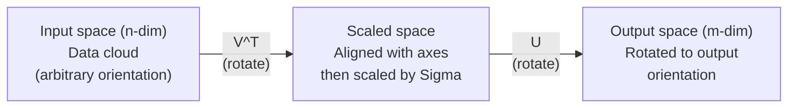
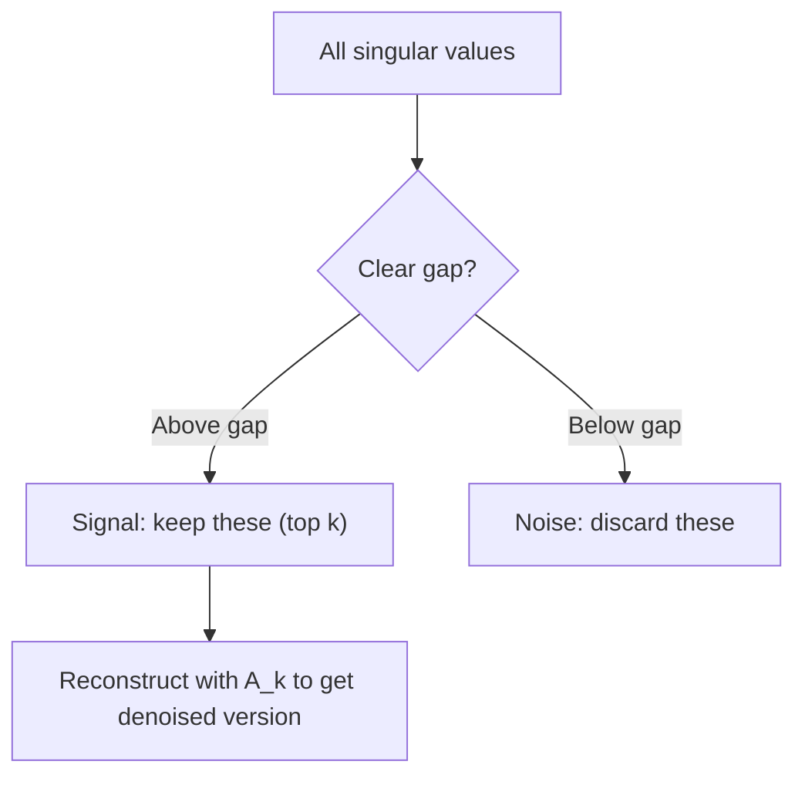

# Singular Value Decomposition

> 奇异值分解是线性代数的瑞士军刀。每个矩阵都有一个。每个数据科学家都需要一个。

** 类型：** 构建
** 语言：** Python，Julia
** 先决条件：** 第1阶段，第01课（线性代数直觉）、02课（载体和矩阵运算）、03课（矩阵变换）
** 时间：** ~120分钟

## Learning Objectives

- 通过功率迭代实现奇异值分解并解释U、Sigma和V ' T的几何含义
- 将截断的奇异值分解应用于图像压缩并测量压缩比与重建误差
- 通过奇异值分解计算Moore-Penrose伪逆以求解超定最小平方系统
- 将SVD与PCA、推荐系统（潜在因素）和NLP中的潜在语义分析相连接

## The Problem

您有一个1000 x2000矩阵。也许是用户电影收视率。也许这是一个文档术语频率表。也许是图像的像素值。您需要压缩它、去噪它、找到其中的隐藏结构，或者用它求解最小平方系统。特征分解仅适用于平方矩阵。即便如此，它也需要矩阵具有一组线性独立的特征载体。

DDD适用于任何矩阵。任何形状。任何军衔。没有条件。它将矩阵分解为三个因素，揭示了矩阵对空间的影响的几何形状。它是所有线性代数中最通用、最有用的因式分解。

## The Concept

### What SVD does geometrically

每个矩阵，无论形状如何，都会依次执行三个操作：旋转、缩放、旋转。DDD使这种分解变得明确。

```
A = U * Sigma * V^T

      m x n     m x m    m x n    n x n
     (any)    (rotate)  (scale)  (rotate)
```

给定任何矩阵A，MVD将其分解为：
- V ' T旋转输入空间（n维）中的载体
- Sigma沿着每个轴缩放（拉伸或压缩）
- U将结果旋转到输出空间（m维）



这样想吧。您向MVD提供一个矩阵。它告诉你：“这个矩阵采用一个输入球体，首先将其旋转V ' T，然后通过Sigma将其扩展为椭圆体，然后将椭圆体旋转U。“奇异值是椭圆体轴的长度。

### The full decomposition

对于形状为m x n的矩阵A：

```
A = U * Sigma * V^T

where:
  U     is m x m, orthogonal (U^T U = I)
  Sigma is m x n, diagonal (singular values on the diagonal)
  V     is n x n, orthogonal (V^T V = I)

The singular values sigma_1 >= sigma_2 >= ... >= sigma_r > 0
where r = rank(A)
```

U的列被称为左奇异载体。V的列被称为右奇异载体。Sigma的对角线项称为奇异值。它们总是非负的，并且通常按递减顺序排序。

### Left singular vectors, singular values, right singular vectors

奇异值分解的每个组成部分都有不同的几何含义。

** 右奇异载体（V的列）：** 这些形成输入空间（R & n）的标准正交基。它们是输入空间中的方向，矩阵将其映射到输出空间中的垂直方向。将它们视为该领域的自然坐标系。

** 奇异值（Sigma的对角线）：** 这些是缩放因子。第i个奇异值告诉您矩阵沿着第i个右奇异值延伸了多少方向。奇异值为零意味着矩阵完全粉碎该方向。

** 左奇异载体（U的列）：** 这些形成输出空间（R & m）的标准正交基。第i个左奇异分量是第i个右奇异分量到达的输出空间中的方向（缩放后）。

他们之间的关系：

```
A * v_i = sigma_i * u_i

The matrix A takes the i-th right singular vector v_i,
scales it by sigma_i, and maps it to the i-th left singular vector u_i.
```

这为您提供了任何矩阵所做的事情的逐坐标图片。

### Outer product form

奇异值分解可以写成1级矩阵的和：

```
A = sigma_1 * u_1 * v_1^T + sigma_2 * u_2 * v_2^T + ... + sigma_r * u_r * v_r^T

Each term sigma_i * u_i * v_i^T is a rank-1 matrix (an outer product).
The full matrix is the sum of r such matrices, where r is the rank.
```

这种形式是低等级逼近的基础。每个术语都增加了一层结构。第一个术语抓住了一个最重要的模式。第二个抓住了下一个最重要的。等等。截断这个和可以为您提供任何给定等级下的最佳逼近。

```
Rank-1 approx:    A_1 = sigma_1 * u_1 * v_1^T
                  (captures the dominant pattern)

Rank-2 approx:    A_2 = sigma_1 * u_1 * v_1^T + sigma_2 * u_2 * v_2^T
                  (captures the two most important patterns)

Rank-k approx:    A_k = sum of top k terms
                  (optimal by the Eckart-Young theorem)
```

### Relationship to eigendecomposition

奇异值分解和特征分解紧密相连。A的奇异值和特征量直接来自A ' T和A ' A ' T的特征值和特征量。

```
A^T A = V * Sigma^T * U^T * U * Sigma * V^T
      = V * Sigma^T * Sigma * V^T
      = V * D * V^T

where D = Sigma^T * Sigma is a diagonal matrix with sigma_i^2 on the diagonal.

So:
- The right singular vectors (V) are eigenvectors of A^T A
- The singular values squared (sigma_i^2) are eigenvalues of A^T A

Similarly:
A A^T = U * Sigma * V^T * V * Sigma^T * U^T
      = U * Sigma * Sigma^T * U^T

So:
- The left singular vectors (U) are eigenvectors of A A^T
- The eigenvalues of A A^T are also sigma_i^2
```

这种联系告诉您三件事：
1. 奇异值总是实且非负的（它们是半正矩阵特征值的平方根）。
2. 您可以通过A ' TA的特征分解来计算奇异值，但这会平方条件数并失去数字精度。专用的奇异值分解算法避免了这种情况。
3. 当A为平方且对称半定时，奇异值分解和特征分解是同一回事。

### Truncated SVD: low-rank approximation

Eckart-Young-Mirsky定理指出，通过仅保留前k个奇异值及其相应的载体来获得A的最佳k阶逼近（在Frobenius和谱规范中）：

```
A_k = U_k * Sigma_k * V_k^T

where:
  U_k     is m x k  (first k columns of U)
  Sigma_k is k x k  (top-left k x k block of Sigma)
  V_k     is n x k  (first k columns of V)

Approximation error = sigma_{k+1}  (in spectral norm)
                    = sqrt(sigma_{k+1}^2 + ... + sigma_r^2)  (in Frobenius norm)
```

这不仅仅是“一个好的”近似。可以证明，它是k级的最佳可能逼近。没有其他rank-k矩阵更接近A。

| 组件 | 相对大小 | 保持在3级左右？ |
|-----------|-------------------|------------------------|
| 西格玛_1 | 最大 | 是的 |
| 西格玛_2 | 大 | 是的 |
| 西格玛_3 | 中大型 | 是的 |
| 西格玛_4 | 介质 | 否（错误） |
| 西格玛_5 | 中小 | 否（错误） |
| 西格玛_6 | 小 | 否（错误） |
| 西格玛_7 | 非常小 | 否（错误） |
| 西格玛_8 | 微小 | 否（错误） |

保持前3：A_3捕获了三个最大的奇异值。错误=剩余值（sigma_4到sigma_8）。

如果奇异值衰减得很快，那么小k就会捕获矩阵的大部分。如果它们衰变缓慢，则矩阵没有低阶结构。

### Image compression with SVD

灰度图像是像素强度的矩阵。800 x600图像有480，000个值。DDD可以让您用少得多的量来逼近它。

```
Original image: 800 x 600 = 480,000 values

SVD with rank k:
  U_k:      800 x k values
  Sigma_k:  k values
  V_k:      600 x k values
  Total:    k * (800 + 600 + 1) = k * 1401 values

  k=10:   14,010 values   (2.9% of original)
  k=50:   70,050 values  (14.6% of original)
  k=100: 140,100 values  (29.2% of original)

  The compression ratio improves as k gets smaller,
  but visual quality degrades.
```

关键见解：自然图像具有迅速衰退的奇异值。前几个奇异值捕捉了广泛的结构（形状、梯度）。后面的那些捕捉到了细微的细节和噪音。在排名50处截断通常会产生看起来与原始图像几乎相同的图像，同时减少85%的存储空间。

### SVD for recommendation systems

Netflix奖让这个出名。您有一个用户电影收视率矩阵，其中大部分条目都缺失。

```
             Movie1  Movie2  Movie3  Movie4  Movie5
  User1      [  5      ?       3       ?       1  ]
  User2      [  ?      4       ?       2       ?  ]
  User3      [  3      ?       5       ?       ?  ]
  User4      [  ?      ?       ?       4       3  ]

  ? = unknown rating
```

想法是：这个收视率矩阵的排名很低。用户并没有完全独立的品味。有一些潜在因素（动作与戏剧、旧与新、大脑与本能）可以解释大多数偏好。

（填写的）评级矩阵上的MVD将其分解为：
- U：潜在因素空间中的用户配置文件
- 西格玛：每个潜在因素的重要性
- V ' T：潜在因素空间中的电影简介

用户对电影的预测评级是其用户个人资料与电影个人资料（通过奇异值加权）的点积。低等级逼近填充缺失的条目。

在实践中，您可以使用Simon Funk的增量MVD或ALS（交替最小平方）等变体来直接处理缺失数据。但核心思想是一样的：通过奇异值分解潜在因素。

### SVD in NLP: Latent Semantic Analysis

潜在语义分析（LSA），也称为潜在语义索引（LSI），将奇异值分解应用于术语文档矩阵。

```
             Doc1   Doc2   Doc3   Doc4
  "cat"      [  3      0      1      0  ]
  "dog"      [  2      0      0      1  ]
  "fish"     [  0      4      1      0  ]
  "pet"      [  1      1      1      1  ]
  "ocean"    [  0      3      0      0  ]

After SVD with rank k=2:

  Each document becomes a point in 2D "concept space."
  Each term becomes a point in the same 2D space.
  Documents about similar topics cluster together.
  Terms with similar meanings cluster together.

  "cat" and "dog" end up near each other (land pets).
  "fish" and "ocean" end up near each other (water concepts).
  Doc1 and Doc3 cluster if they share similar topics.
```

LSA是最早从原始文本中捕获语义相似性的成功方法之一。它之所以有效，是因为同义术语往往出现在相似的文档中，因此DDD将它们分组到相同的潜在维度中。现代文字嵌入（Word2Vec、GloVe）可以被视为这一想法的后裔。

### SVD for noise reduction

噪音数据的信号集中在顶部奇异值中，而噪音则分散在所有奇异值中。截短消除了噪音下限。

** 干净信号奇异值：**

| 组件 | 幅度 | 类型 |
|-----------|-----------|------|
| 西格玛_1 | 非常大 | 信号 |
| 西格玛_2 | 大 | 信号 |
| 西格玛_3 | 介质 | 信号 |
| 西格玛_4 | 接近零 | 可忽略 |
| 西格玛_5 | 接近零 | 可忽略 |

** 有噪音信号奇异值（噪音加到所有）：**

| 组件 | 幅度 | 类型 |
|-----------|-----------|------|
| 西格玛_1 | 非常大 | 信号 |
| 西格玛_2 | 大 | 信号 |
| 西格玛_3 | 介质 | 信号 |
| 西格玛_4 | 小 | 噪声 |
| 西格玛_5 | 小 | 噪声 |
| 西格玛_6 | 小 | 噪声 |
| 西格玛_7 | 小 | 噪声 |



这用于信号处理、科学测量和数据清理。任何时候，当矩阵被添加性噪音破坏时，截断的奇异值分解都是分离信号与噪音的一种原则性方法。

### Pseudoinverse via SVD

Moore-Penrose伪逆A+将矩阵求逆推广到非平方和奇异矩阵。奇异值使得计算变得简单。

```
If A = U * Sigma * V^T, then:

A+ = V * Sigma+ * U^T

where Sigma+ is formed by:
  1. Transpose Sigma (swap rows and columns)
  2. Replace each non-zero diagonal entry sigma_i with 1/sigma_i
  3. Leave zeros as zeros

For A (m x n):      A+ is (n x m)
For Sigma (m x n):  Sigma+ is (n x m)
```

伪逆解决最小平方问题。如果Ax = b没有精确解（超定系统），那么x = A+ b是最小平方解（最小化||Ax-b||).

```
Overdetermined system (more equations than unknowns):

  [1  1]         [3]
  [2  1] x   =   [5]       No exact solution exists.
  [3  1]         [6]

  x_ls = A+ b = V * Sigma+ * U^T * b

  This gives the x that minimizes the sum of squared residuals.
  Same result as the normal equations (A^T A)^(-1) A^T b,
  but numerically more stable.
```

### Numerical stability advantages

计算A^T A的本征分解平方奇异值（A^T A的本征值为σ_i^2）。这会使条件数平方，从而放大数值误差。

```
Example:
  A has singular values [1000, 1, 0.001]
  Condition number of A: 1000 / 0.001 = 10^6

  A^T A has eigenvalues [10^6, 1, 10^{-6}]
  Condition number of A^T A: 10^6 / 10^{-6} = 10^{12}

  Computing SVD directly: works with condition number 10^6
  Computing via A^T A:     works with condition number 10^{12}
                           (6 extra digits of precision lost)
```

现代奇异值分解算法（Golub-Kahan双对角化）直接作用于A，永远不会形成A ' T '这就是为什么您应该始终更喜欢' p.linalg.svd（A）'而不是' p.linalg.eig（A.T @ A）'。

### Connection to PCA

PCA是对中心数据进行奇异值分解。这不是类比。这实际上是相同的计算。

```
Given data matrix X (n_samples x n_features), centered (mean subtracted):

Covariance matrix: C = (1/(n-1)) * X^T X

PCA finds eigenvectors of C. But:

  X = U * Sigma * V^T    (SVD of X)

  X^T X = V * Sigma^2 * V^T

  C = (1/(n-1)) * V * Sigma^2 * V^T

So the principal components are exactly the right singular vectors V.
The explained variance for each component is sigma_i^2 / (n-1).

In sklearn, PCA is implemented using SVD, not eigendecomposition.
It is faster and more numerically stable.
```

这意味着您在第10课中学到的有关降维的一切都是在本质上的DID。PCA是奇异值分解在机器学习中最常见的应用。

## Build It

### Step 1: SVD from scratch using power iteration

其想法是：要找到最大奇异值及其载体，对A ' T（或A ' A ' T）使用功率迭代。然后缩小矩阵，并对下一个奇异值重复上述步骤。

```python
import numpy as np

def power_iteration(M, num_iters=100):
    n = M.shape[1]
    v = np.random.randn(n)
    v = v / np.linalg.norm(v)

    for _ in range(num_iters):
        Mv = M @ v
        v = Mv / np.linalg.norm(Mv)

    eigenvalue = v @ M @ v
    return eigenvalue, v

def svd_from_scratch(A, k=None):
    m, n = A.shape
    if k is None:
        k = min(m, n)

    sigmas = []
    us = []
    vs = []

    A_residual = A.copy().astype(float)

    for _ in range(k):
        AtA = A_residual.T @ A_residual
        eigenvalue, v = power_iteration(AtA, num_iters=200)

        if eigenvalue < 1e-10:
            break

        sigma = np.sqrt(eigenvalue)
        u = A_residual @ v / sigma

        sigmas.append(sigma)
        us.append(u)
        vs.append(v)

        A_residual = A_residual - sigma * np.outer(u, v)

    U = np.column_stack(us) if us else np.empty((m, 0))
    S = np.array(sigmas)
    V = np.column_stack(vs) if vs else np.empty((n, 0))

    return U, S, V
```

### Step 2: Test and compare with NumPy

```python
np.random.seed(42)
A = np.random.randn(5, 4)

U_ours, S_ours, V_ours = svd_from_scratch(A)
U_np, S_np, Vt_np = np.linalg.svd(A, full_matrices=False)

print("Our singular values:", np.round(S_ours, 4))
print("NumPy singular values:", np.round(S_np, 4))

A_reconstructed = U_ours @ np.diag(S_ours) @ V_ours.T
print(f"Reconstruction error: {np.linalg.norm(A - A_reconstructed):.8f}")
```

### Step 3: Image compression demo

```python
def compress_image_svd(image_matrix, k):
    U, S, Vt = np.linalg.svd(image_matrix, full_matrices=False)
    compressed = U[:, :k] @ np.diag(S[:k]) @ Vt[:k, :]
    return compressed

image = np.random.seed(42)
rows, cols = 200, 300
image = np.random.randn(rows, cols)

for k in [1, 5, 10, 20, 50]:
    compressed = compress_image_svd(image, k)
    error = np.linalg.norm(image - compressed) / np.linalg.norm(image)
    original_size = rows * cols
    compressed_size = k * (rows + cols + 1)
    ratio = compressed_size / original_size
    print(f"k={k:>3d}  error={error:.4f}  storage={ratio:.1%}")
```

### Step 4: Noise reduction

```python
np.random.seed(42)
clean = np.outer(np.sin(np.linspace(0, 4*np.pi, 100)),
                 np.cos(np.linspace(0, 2*np.pi, 80)))
noise = 0.3 * np.random.randn(100, 80)
noisy = clean + noise

U, S, Vt = np.linalg.svd(noisy, full_matrices=False)
denoised = U[:, :5] @ np.diag(S[:5]) @ Vt[:5, :]

print(f"Noisy error:    {np.linalg.norm(noisy - clean):.4f}")
print(f"Denoised error: {np.linalg.norm(denoised - clean):.4f}")
print(f"Improvement:    {(1 - np.linalg.norm(denoised - clean) / np.linalg.norm(noisy - clean)):.1%}")
```

### Step 5: Pseudoinverse

```python
A = np.array([[1, 1], [2, 1], [3, 1]], dtype=float)
b = np.array([3, 5, 6], dtype=float)

U, S, Vt = np.linalg.svd(A, full_matrices=False)
S_inv = np.diag(1.0 / S)
A_pinv = Vt.T @ S_inv @ U.T

x_svd = A_pinv @ b
x_lstsq = np.linalg.lstsq(A, b, rcond=None)[0]
x_pinv = np.linalg.pinv(A) @ b

print(f"SVD pseudoinverse solution:  {x_svd}")
print(f"np.linalg.lstsq solution:   {x_lstsq}")
print(f"np.linalg.pinv solution:    {x_pinv}")
```

## Use It

完整的工作演示位于“code/svd.py”中。运行它以查看将奇异分解应用于图像压缩、推荐系统、潜在语义分析和降噪。

```bash
python svd.py
```

' code/svd.jl '中的Julia版本使用Julia的原生' svd（）'函数和' LinearAlgebra '包演示了相同的概念。

```bash
julia svd.jl
```

## Ship It

本课产生：
- '输出/skill-svd.md '-了解何时以及如何在实际项目中应用DID的技能

## Exercises

1. 从头开始实现完整的SVD，而不使用幂迭代。相反，计算A^T A的特征分解以获得V和奇异值，然后计算U = A V Sigma^{-1}。将数值精度与您的幂迭代版本和NumPy进行比较。

2. 加载真实灰度图像（或将其转换为灰度）。将其压缩为1、5、10、25、50、100级。对于每个等级，计算压缩比和相对误差。找到图像在视觉上变得可接受的等级。

3. 构建一个微型推荐系统。使用一些已知条目创建10x8用户电影收视率矩阵。用行平均值填充缺失的条目。计算奇异值并重建3级逼近。使用重建的矩阵来预测缺失的评级。验证预测是否合理。

4. 创建包含3个合成主题的100 x50文档术语矩阵。每个主题有5个相关术语。添加噪音。应用奇异值并验证前3个奇异值是否比其余值大得多。将文档投影到3D潜在空间中，并检查来自同一主题的文档是否聚集在一起。

5. 生成干净的低阶矩阵（rank 3，大小50 x40）并添加不同级别的高斯噪音（西格玛= 0.1、0.5、1.0、2.0）。对于每个噪音水平，通过将k从1扫过到40并根据干净矩阵测量重建误差来找到最佳截断阶。绘制最佳k如何随噪音水平变化。

## Key Terms

| Term | 别人怎么说 | 它实际上意味着什么 |
|------|----------------|----------------------|
| SVD | “考虑任何矩阵” | 将A分解为U Sigma V ' T，其中U和V是垂直的，Sigma是对角的，具有非负项。适用于任何形状的任何矩阵。 |
| 奇异值 | “这个组件有多重要” | Sigma的第i个对角线条目。测量矩阵沿着第i个主方向延伸的程度。总是非负的，按降序排序。 |
| 左奇异向量 | “输出方向” | 美国的专栏。第i个右奇异分量映射到的输出空间中的方向（通过西格玛_i缩放后）。 |
| 右奇异向量 | “输入方向” | V的一列。输入空间中矩阵映射到第i个左奇异载体的方向（通过Sigma_i缩放后）。 |
| 截断SVD | “低级逼近” | 仅保留前k个奇异值及其载体。产生原始矩阵的可证明的最佳k阶逼近（Eckart-Young定理）。 |
| 秩 | “真实维度” | 非零奇异值的数量。告诉您矩阵实际使用多少个独立方向。 |
| 伪逆 | “广义逆” | V Sigma+ U ' T。倒置非零奇异值，将零保留为零。解决非平方或奇异矩阵的最小平方问题。 |
| 条件数 | “对错误有多敏感” | sigma_max / sigma_min。大的条件数意味着小的输入变化会导致大的输出变化。DDD直接揭示了这一点。 |
| 潜在因素 | “隐藏变量” | DDD发现的低级空间中的一个维度。在推荐中，潜在因素可能对应于类型偏好。在NLP中，它可能对应于一个主题。 |
| Frobenius范数 | “总矩阵大小” | 项平方和的平方根。等于奇异值平方和的平方根。用于测量逼近误差。 |
| 埃卡特-杨定理 | “DDD提供最好的压缩” | 对于任何目标rank k，截断的奇异值最小化了所有可能rank k矩阵的逼近误差。 |
| 幂迭代 | “找出最大的特征向量” | 将随机载体重复乘以矩阵并进行规格化。收敛到具有最大特征值的特征值。许多奇异值分解算法的构建模块。 |

## Further Reading

- [吉尔伯特·斯特朗：线性代数及其应用，第7章]（https：//math.mit.edu/guardgs/linearalegbra/）-通过应用彻底处理奇异值
- [3Blue 1Brown：但是什么是MVD？]（https：www.youtube.com/watch? v= vSczTbgc 8 REC）--奇异值分解的几何直觉
- [We推荐奇异值分解]（https：//www.ams.org/publicoutreach/feature-专栏/fcar-svd）-来自美国数学学会的可访问概述
- [Netflix奖和矩阵分解]（https：//sifter.org/guardsimon/journal/20061211.html）- Simon Funk关于DDD的原始博客文章以获取建议
- [潜在语义分析]（https：//en.wikipedia.org/wiki/Latent_semantic_analysis）-SVD的原始NLP应用
- [数值线性代数作者：Trefethen和Bau]（https：//people.maths.ox.ac.uk/Trefethen/text.html）-理解DID算法及其数值性质的黄金标准
