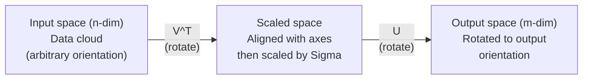
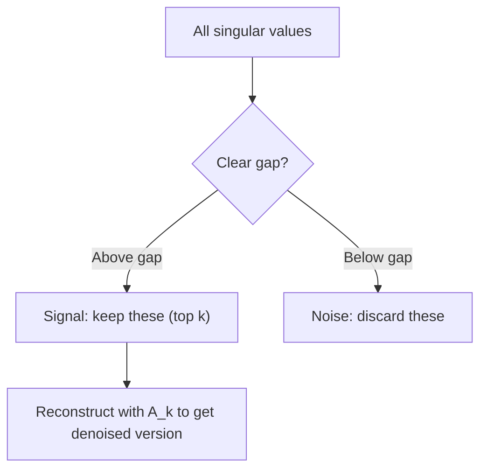

# 11 · 奇异值分解

> SVD 是线性代数中的瑞士军刀。每个矩阵都有一个 SVD，每个数据科学家都需要它。

**类型：** 构建
**语言：** Python、Julia
**前置：** 阶段 1，第 01 课（线性代数直觉）、第 02 课（向量与矩阵运算）、第 03 课（矩阵变换）
**时长：** 约 120 分钟

## 学习目标

- 通过幂迭代（power iteration）实现 SVD，并解释 U、Sigma、V^T 的几何含义
- 应用截断 SVD（truncated SVD）进行图像压缩，并衡量压缩比与重建误差之间的权衡
- 通过 SVD 计算摩尔-彭若斯伪逆（Moore-Penrose pseudoinverse），求解超定最小二乘系统
- 把 SVD 与主成分分析（PCA）、推荐系统（潜在因子）以及 NLP 中的潜在语义分析（Latent Semantic Analysis）联系起来

## 问题所在

你手上有一个 1000x2000 的矩阵。它也许是用户-电影评分表，也许是文档-词频表，也许是一张图像的像素值。你需要压缩它、去噪、找出其中隐藏的结构，或者用它求解最小二乘系统。特征分解（eigendecomposition）只能作用于方阵，即便如此，它还要求矩阵拥有一组完整的线性无关特征向量。

SVD 适用于任意矩阵——任意形状、任意秩，没有任何条件限制。它把矩阵分解为三个因子，揭示出该矩阵对空间所做变换的几何本质。它是整个线性代数中最通用、最有用的分解方法。

## 核心概念

### SVD 在几何上做了什么

任意矩阵，无论形状如何，都依次执行三个操作：旋转、缩放、再旋转。SVD 把这一分解显式地表达出来。

```
A = U * Sigma * V^T

      m x n     m x m    m x n    n x n
     (任意)    (旋转)   (缩放)   (旋转)
```

给定任意矩阵 A，SVD 将其分解为：
- V^T 在输入空间（n 维）中旋转向量
- Sigma 沿每个坐标轴进行缩放（拉伸或压缩）
- U 把结果旋转进输出空间（m 维）



可以这样理解：你递给 SVD 一个矩阵，它告诉你：「这个矩阵接收一个由输入构成的球面，先用 V^T 旋转它，再用 Sigma 把它拉伸成一个椭球，最后用 U 旋转这个椭球。」奇异值就是椭球各个轴的长度。

### 完整分解

对于形状为 m x n 的矩阵 A：

```
A = U * Sigma * V^T

其中：
  U     为 m x m，正交矩阵 (U^T U = I)
  Sigma 为 m x n，对角矩阵（奇异值位于对角线上）
  V     为 n x n，正交矩阵 (V^T V = I)

奇异值满足 sigma_1 >= sigma_2 >= ... >= sigma_r > 0
其中 r = rank(A)
```

U 的列称为左奇异向量（left singular vectors），V 的列称为右奇异向量（right singular vectors），Sigma 对角线上的元素称为奇异值（singular values）。它们始终非负，并按惯例从大到小排列。

### 左奇异向量、奇异值、右奇异向量

SVD 的每个组成部分都有各自明确的几何含义。

**右奇异向量（V 的列）：** 它们构成输入空间（R^n）的一组标准正交基。这些方向是输入空间中被矩阵映射到输出空间正交方向的那些方向。可以把它们看作定义域的自然坐标系。

**奇异值（Sigma 的对角线）：** 它们是缩放因子。第 i 个奇异值告诉你矩阵沿第 i 个右奇异向量方向把向量拉伸了多少。奇异值为零意味着矩阵把该方向完全压扁。

**左奇异向量（U 的列）：** 它们构成输出空间（R^m）的一组标准正交基。第 i 个左奇异向量是第 i 个右奇异向量（经缩放后）所落到的输出空间方向。

它们之间的关系：

```
A * v_i = sigma_i * u_i

矩阵 A 接收第 i 个右奇异向量 v_i，
将其缩放 sigma_i 倍，并映射到第 i 个左奇异向量 u_i。
```

这给了你一幅逐坐标的图景，说明任意矩阵到底做了什么。

### 外积形式

SVD 可以写成一系列秩 1 矩阵之和：

```
A = sigma_1 * u_1 * v_1^T + sigma_2 * u_2 * v_2^T + ... + sigma_r * u_r * v_r^T

每一项 sigma_i * u_i * v_i^T 都是一个秩 1 矩阵（外积）。
完整矩阵是 r 个这样的矩阵之和，其中 r 是矩阵的秩。
```

这种形式是低秩近似的基础。每一项都叠加一层结构。第一项捕获最重要的单一模式，第二项捕获次重要的模式，依此类推。截断这个求和就得到任意给定秩下可能的最佳近似。

```
秩 1 近似：    A_1 = sigma_1 * u_1 * v_1^T
               （捕获主导模式）

秩 2 近似：    A_2 = sigma_1 * u_1 * v_1^T + sigma_2 * u_2 * v_2^T
               （捕获两个最重要的模式）

秩 k 近似：    A_k = 前 k 项之和
               （由 Eckart-Young 定理保证为最优）
```

### 与特征分解的关系

SVD 与特征分解有着深刻的联系。A 的奇异值和奇异向量直接来自 A^T A 和 A A^T 的特征值和特征向量。

```
A^T A = V * Sigma^T * U^T * U * Sigma * V^T
      = V * Sigma^T * Sigma * V^T
      = V * D * V^T

其中 D = Sigma^T * Sigma 是一个对角矩阵，对角线上为 sigma_i^2。

因此：
- 右奇异向量 (V) 是 A^T A 的特征向量
- 奇异值的平方 (sigma_i^2) 是 A^T A 的特征值

类似地：
A A^T = U * Sigma * V^T * V * Sigma^T * U^T
      = U * Sigma * Sigma^T * U^T

因此：
- 左奇异向量 (U) 是 A A^T 的特征向量
- A A^T 的特征值同样是 sigma_i^2
```

这一联系告诉你三件事：
1. 奇异值始终是实数且非负（它们是某个半正定矩阵特征值的平方根）。
2. 你可以通过对 A^T A 做特征分解来计算 SVD，但这会让条件数（condition number）平方，损失数值精度。专门的 SVD 算法会避开这一点。
3. 当 A 是方阵且对称半正定时，SVD 与特征分解是同一回事。

### 截断 SVD：低秩近似

Eckart-Young-Mirsky 定理指出，A 的最佳秩 k 近似（在 Frobenius 范数和谱范数意义下都是最佳）可以通过只保留前 k 个奇异值及其对应向量得到：

```
A_k = U_k * Sigma_k * V_k^T

其中：
  U_k     为 m x k  （U 的前 k 列）
  Sigma_k 为 k x k  （Sigma 左上角的 k x k 块）
  V_k     为 n x k  （V 的前 k 列）

近似误差 = sigma_{k+1}                          （在谱范数下）
        = sqrt(sigma_{k+1}^2 + ... + sigma_r^2)  （在 Frobenius 范数下）
```

这不仅仅是「一个不错的」近似，而是可证明的秩 k 下最佳近似。没有任何其他秩 k 矩阵比它更接近 A。

| 组成部分 | 相对大小 | 在秩 3 近似中保留？ |
|-----------|-------------------|------------------------|
| sigma_1 | 最大 | 是 |
| sigma_2 | 大 | 是 |
| sigma_3 | 中偏大 | 是 |
| sigma_4 | 中等 | 否（误差） |
| sigma_5 | 中偏小 | 否（误差） |
| sigma_6 | 小 | 否（误差） |
| sigma_7 | 很小 | 否（误差） |
| sigma_8 | 极小 | 否（误差） |

保留前 3 个：A_3 捕获三个最大的奇异值。误差 = 剩余的值（sigma_4 到 sigma_8）。

如果奇异值衰减很快，一个较小的 k 就能捕获矩阵的大部分信息。如果衰减缓慢，则说明该矩阵没有低秩结构。

### 用 SVD 进行图像压缩

一张灰度图像就是一个像素强度矩阵。一张 800x600 的图像有 480,000 个数值。SVD 让你用少得多的数值来近似它。

```
原始图像：800 x 600 = 480,000 个数值

秩为 k 的 SVD：
  U_k:      800 x k 个数值
  Sigma_k:  k 个数值
  V_k:      600 x k 个数值
  合计：    k * (800 + 600 + 1) = k * 1401 个数值

  k=10:   14,010 个数值   （原始的 2.9%）
  k=50:   70,050 个数值  （原始的 14.6%）
  k=100: 140,100 个数值  （原始的 29.2%）

  k 越小，压缩比越高，
  但视觉质量会下降。
```

关键洞见：自然图像的奇异值衰减很快。前几个奇异值捕获了大体结构（形状、渐变），后面的捕获细节和噪声。在秩 50 处截断，往往能得到一张看上去与原图几乎一致的图像，同时节省 85% 的存储空间。

### 用于推荐系统的 SVD

奈飞大奖（Netflix Prize）让这一应用声名远扬。你有一个用户-电影评分矩阵，其中大部分条目都是缺失的。

```
             Movie1  Movie2  Movie3  Movie4  Movie5
  User1      [  5      ?       3       ?       1  ]
  User2      [  ?      4       ?       2       ?  ]
  User3      [  3      ?       5       ?       ?  ]
  User4      [  ?      ?       ?       4       3  ]

  ? = 未知评分
```

核心思路是：这个评分矩阵具有低秩。用户的口味并非完全独立。存在少数几个潜在因子（动作 vs. 剧情、老片 vs. 新片、烧脑 vs. 感官刺激）就能解释大部分偏好。

对（填补后的）评分矩阵做 SVD，将其分解为：
- U：潜在因子空间中的用户画像
- Sigma：每个潜在因子的重要程度
- V^T：潜在因子空间中的电影画像

某用户对某部电影的预测评分，是其用户画像与该电影画像的点积（以奇异值加权）。低秩近似填补了缺失的条目。

在实践中，你会使用诸如 Simon Funk 的增量式 SVD 或 ALS（交替最小二乘，alternating least squares）等变体，它们能直接处理缺失数据。但核心思想是一样的：通过 SVD 进行潜在因子分解。

### NLP 中的 SVD：潜在语义分析

潜在语义分析（Latent Semantic Analysis，LSA），又称潜在语义索引（Latent Semantic Indexing，LSI），是把 SVD 应用于词-文档矩阵。

```
             Doc1   Doc2   Doc3   Doc4
  "cat"      [  3      0      1      0  ]
  "dog"      [  2      0      0      1  ]
  "fish"     [  0      4      1      0  ]
  "pet"      [  1      1      1      1  ]
  "ocean"    [  0      3      0      0  ]

在秩 k=2 的 SVD 之后：

  每个文档变成 2 维「概念空间」中的一个点。
  每个词也变成同一 2 维空间中的一个点。
  主题相近的文档会聚集在一起。
  含义相近的词会聚集在一起。

  "cat" 和 "dog" 最终彼此靠近（陆地宠物）。
  "fish" 和 "ocean" 最终彼此靠近（水相关概念）。
  如果 Doc1 和 Doc3 共享相似主题，它们会聚成一簇。
```

LSA 是最早成功从原始文本中捕获语义相似性的方法之一。它之所以奏效，是因为同义词往往出现在相似的文档中，于是 SVD 把它们归入同一批潜在维度。现代词嵌入（Word2Vec、GloVe）可以看作这一思想的后裔。

### 用于降噪的 SVD

含噪数据的信号集中在排名靠前的奇异值上，而噪声则分散在所有奇异值上。截断可以去除噪声基底。

**干净信号的奇异值：**

| 组成部分 | 大小 | 类型 |
|-----------|-----------|------|
| sigma_1 | 非常大 | 信号 |
| sigma_2 | 大 | 信号 |
| sigma_3 | 中等 | 信号 |
| sigma_4 | 接近零 | 可忽略 |
| sigma_5 | 接近零 | 可忽略 |

**含噪信号的奇异值（噪声叠加到所有奇异值上）：**

| 组成部分 | 大小 | 类型 |
|-----------|-----------|------|
| sigma_1 | 非常大 | 信号 |
| sigma_2 | 大 | 信号 |
| sigma_3 | 中等 | 信号 |
| sigma_4 | 小 | 噪声 |
| sigma_5 | 小 | 噪声 |
| sigma_6 | 小 | 噪声 |
| sigma_7 | 小 | 噪声 |



这一方法用于信号处理、科学测量和数据清洗。每当你有一个被加性噪声污染的矩阵时，截断 SVD 都是一种有理论依据的信噪分离手段。

### 通过 SVD 求伪逆

摩尔-彭若斯伪逆 A+ 把矩阵求逆推广到了非方阵和奇异矩阵。SVD 让计算它变得轻而易举。

```
若 A = U * Sigma * V^T，则：

A+ = V * Sigma+ * U^T

其中 Sigma+ 的构造方式为：
  1. 对 Sigma 转置（行列互换）
  2. 把每个非零对角元素 sigma_i 替换为 1/sigma_i
  3. 零保持为零

对于 A (m x n)：     A+ 为 (n x m)
对于 Sigma (m x n)： Sigma+ 为 (n x m)
```

伪逆可以求解最小二乘问题。若 Ax = b 没有精确解（超定系统），则 x = A+ b 就是最小二乘解（使 ||Ax - b|| 最小化）。

```
超定系统（方程多于未知数）：

  [1  1]         [3]
  [2  1] x   =   [5]       不存在精确解。
  [3  1]         [6]

  x_ls = A+ b = V * Sigma+ * U^T * b

  这给出使残差平方和最小化的 x。
  结果与正规方程 (A^T A)^(-1) A^T b 相同，
  但数值上更稳定。
```

### 数值稳定性优势

对 A^T A 做特征分解会使奇异值平方（A^T A 的特征值为 sigma_i^2）。这会使条件数平方，从而放大数值误差。

```
示例：
  A 的奇异值为 [1000, 1, 0.001]
  A 的条件数：1000 / 0.001 = 10^6

  A^T A 的特征值为 [10^6, 1, 10^{-6}]
  A^T A 的条件数：10^6 / 10^{-6} = 10^{12}

  直接计算 SVD：使用条件数 10^6
  经由 A^T A 计算：使用条件数 10^{12}
                  （多损失 6 位有效数字精度）
```

现代 SVD 算法（Golub-Kahan 双对角化）直接作用于 A，绝不构造 A^T A。这正是为什么你应当始终优先使用 `np.linalg.svd(A)` 而非 `np.linalg.eig(A.T @ A)`。

### 与 PCA 的联系

PCA 本身就是对中心化数据做 SVD。这不是类比，而是字面意义上完全相同的计算。

```
给定数据矩阵 X (n_samples x n_features)，已中心化（减去均值）：

协方差矩阵：C = (1/(n-1)) * X^T X

PCA 求 C 的特征向量。但是：

  X = U * Sigma * V^T    （X 的 SVD）

  X^T X = V * Sigma^2 * V^T

  C = (1/(n-1)) * V * Sigma^2 * V^T

所以主成分正好就是右奇异向量 V。
每个成分解释的方差为 sigma_i^2 / (n-1)。

在 sklearn 中，PCA 是用 SVD 而非特征分解实现的。
它更快，数值上也更稳定。
```

这意味着你在第 10 课中学到的关于降维的一切，底层都是 SVD。PCA 是机器学习中 SVD 最常见的应用。

## 动手构建

### 第 1 步：用幂迭代从零实现 SVD

思路：要找到最大的奇异值及其向量，就对 A^T A（或 A A^T）做幂迭代。然后对矩阵进行降秩处理（deflate），并对下一个奇异值重复该过程。

```python
import numpy as np

def power_iteration(M, num_iters=100):
    n = M.shape[1]
    v = np.random.randn(n)
    v = v / np.linalg.norm(v)

    for _ in range(num_iters):
        Mv = M @ v
        v = Mv / np.linalg.norm(Mv)

    eigenvalue = v @ M @ v
    return eigenvalue, v

def svd_from_scratch(A, k=None):
    m, n = A.shape
    if k is None:
        k = min(m, n)

    sigmas = []
    us = []
    vs = []

    A_residual = A.copy().astype(float)

    for _ in range(k):
        AtA = A_residual.T @ A_residual
        eigenvalue, v = power_iteration(AtA, num_iters=200)

        if eigenvalue < 1e-10:
            break

        sigma = np.sqrt(eigenvalue)
        u = A_residual @ v / sigma

        sigmas.append(sigma)
        us.append(u)
        vs.append(v)

        A_residual = A_residual - sigma * np.outer(u, v)

    U = np.column_stack(us) if us else np.empty((m, 0))
    S = np.array(sigmas)
    V = np.column_stack(vs) if vs else np.empty((n, 0))

    return U, S, V
```

### 第 2 步：测试并与 NumPy 对比

```python
np.random.seed(42)
A = np.random.randn(5, 4)

U_ours, S_ours, V_ours = svd_from_scratch(A)
U_np, S_np, Vt_np = np.linalg.svd(A, full_matrices=False)

print("Our singular values:", np.round(S_ours, 4))
print("NumPy singular values:", np.round(S_np, 4))

A_reconstructed = U_ours @ np.diag(S_ours) @ V_ours.T
print(f"Reconstruction error: {np.linalg.norm(A - A_reconstructed):.8f}")
```

### 第 3 步：图像压缩演示

```python
def compress_image_svd(image_matrix, k):
    U, S, Vt = np.linalg.svd(image_matrix, full_matrices=False)
    compressed = U[:, :k] @ np.diag(S[:k]) @ Vt[:k, :]
    return compressed

image = np.random.seed(42)
rows, cols = 200, 300
image = np.random.randn(rows, cols)

for k in [1, 5, 10, 20, 50]:
    compressed = compress_image_svd(image, k)
    error = np.linalg.norm(image - compressed) / np.linalg.norm(image)
    original_size = rows * cols
    compressed_size = k * (rows + cols + 1)
    ratio = compressed_size / original_size
    print(f"k={k:>3d}  error={error:.4f}  storage={ratio:.1%}")
```

### 第 4 步：降噪

```python
np.random.seed(42)
clean = np.outer(np.sin(np.linspace(0, 4*np.pi, 100)),
                 np.cos(np.linspace(0, 2*np.pi, 80)))
noise = 0.3 * np.random.randn(100, 80)
noisy = clean + noise

U, S, Vt = np.linalg.svd(noisy, full_matrices=False)
denoised = U[:, :5] @ np.diag(S[:5]) @ Vt[:5, :]

print(f"Noisy error:    {np.linalg.norm(noisy - clean):.4f}")
print(f"Denoised error: {np.linalg.norm(denoised - clean):.4f}")
print(f"Improvement:    {(1 - np.linalg.norm(denoised - clean) / np.linalg.norm(noisy - clean)):.1%}")
```

### 第 5 步：伪逆

```python
A = np.array([[1, 1], [2, 1], [3, 1]], dtype=float)
b = np.array([3, 5, 6], dtype=float)

U, S, Vt = np.linalg.svd(A, full_matrices=False)
S_inv = np.diag(1.0 / S)
A_pinv = Vt.T @ S_inv @ U.T

x_svd = A_pinv @ b
x_lstsq = np.linalg.lstsq(A, b, rcond=None)[0]
x_pinv = np.linalg.pinv(A) @ b

print(f"SVD pseudoinverse solution:  {x_svd}")
print(f"np.linalg.lstsq solution:   {x_lstsq}")
print(f"np.linalg.pinv solution:    {x_pinv}")
```

## 实际运用

完整可运行的演示位于 `code/svd.py`。运行它即可看到 SVD 应用于图像压缩、推荐系统、潜在语义分析和降噪。

```bash
python svd.py
```

`code/svd.jl` 中的 Julia 版本使用 Julia 原生的 `svd()` 函数和 `LinearAlgebra` 包演示相同的概念。

```bash
julia svd.jl
```

## 交付成果

本课产出：
- `outputs/skill-svd.md` —— 一项技能文档，说明在真实项目中何时以及如何应用 SVD

## 练习

1. 不使用幂迭代，从零实现完整的 SVD。改为计算 A^T A 的特征分解以得到 V 和奇异值，然后计算 U = A V Sigma^{-1}。将其数值精度与你的幂迭代版本以及 NumPy 进行对比。

2. 加载一张真实的灰度图像（或将一张图像转为灰度）。在秩 1、5、10、25、50、100 下分别压缩它。对每个秩，计算压缩比和相对误差。找出图像在视觉上变得可接受时的秩。

3. 构建一个微型推荐系统。创建一个 10x8 的用户-电影评分矩阵，其中有一些已知条目。用行均值填补缺失条目。计算 SVD 并重建一个秩 3 近似。用重建后的矩阵预测缺失评分。验证预测结果是否合理。

4. 创建一个 100x50 的文档-词矩阵，包含 3 个合成主题。每个主题有 5 个相关词。加入噪声。应用 SVD 并验证前 3 个奇异值远大于其余奇异值。将文档投影到 3 维潜在空间，检查同一主题的文档是否聚集在一起。

5. 生成一个干净的低秩矩阵（秩 3，大小 50x40），并在不同水平下加入高斯噪声（sigma = 0.1、0.5、1.0、2.0）。对每个噪声水平，通过将 k 从 1 扫到 40 并测量相对于干净矩阵的重建误差，找出最优截断秩。绘制最优 k 随噪声水平变化的曲线。

## 关键术语

| 术语 | 人们怎么说 | 实际含义 |
|------|----------------|----------------------|
| SVD | 「分解任意矩阵」 | 把 A 分解为 U Sigma V^T，其中 U 和 V 正交，Sigma 为对角矩阵且元素非负。适用于任意形状的任意矩阵。 |
| 奇异值 | 「这个成分有多重要」 | Sigma 的第 i 个对角元素。衡量矩阵沿第 i 个主方向拉伸了多少。始终非负，按从大到小排序。 |
| 左奇异向量 | 「输出方向」 | U 的一列。第 i 个右奇异向量（经 sigma_i 缩放后）映射到的输出空间方向。 |
| 右奇异向量 | 「输入方向」 | V 的一列。被矩阵映射到第 i 个左奇异向量（经 sigma_i 缩放后）的输入空间方向。 |
| 截断 SVD | 「低秩近似」 | 只保留前 k 个奇异值及其向量。产生原矩阵可证明的最佳秩 k 近似（Eckart-Young 定理）。 |
| 秩 | 「真实维度」 | 非零奇异值的个数。告诉你矩阵实际使用了多少个独立方向。 |
| 伪逆 | 「广义逆」 | V Sigma+ U^T。对非零奇异值取逆，零保持为零。为非方阵或奇异矩阵求解最小二乘问题。 |
| 条件数 | 「对误差有多敏感」 | sigma_max / sigma_min。条件数大意味着微小的输入变化会引起巨大的输出变化。SVD 直接揭示了这一点。 |
| 潜在因子 | 「隐藏变量」 | SVD 发现的低秩空间中的一个维度。在推荐系统中，潜在因子可能对应类型偏好；在 NLP 中，它可能对应某个主题。 |
| Frobenius 范数 | 「矩阵的整体大小」 | 所有元素平方和的平方根。等于所有奇异值平方和的平方根。用于衡量近似误差。 |
| Eckart-Young 定理 | 「SVD 给出最佳压缩」 | 对任意目标秩 k，截断 SVD 在所有可能的秩 k 矩阵中使近似误差最小。 |
| 幂迭代 | 「找出最大的特征向量」 | 反复用矩阵乘以一个随机向量并归一化。收敛到对应最大特征值的特征向量。许多 SVD 算法的基础构件。 |

## 延伸阅读

- [Gilbert Strang: Linear Algebra and Its Applications, Chapter 7](https://math.mit.edu/~gs/linearalgebra/) —— 对 SVD 及其应用的透彻论述
- [3Blue1Brown: But what is the SVD?](https://www.youtube.com/watch?v=vSczTbgc8Rc) —— SVD 的几何直觉
- [We Recommend a Singular Value Decomposition](https://www.ams.org/publicoutreach/feature-column/fcarc-svd) —— 美国数学学会（American Mathematical Society）的通俗概述
- [Netflix Prize and Matrix Factorization](https://sifter.org/~simon/journal/20061211.html) —— Simon Funk 关于 SVD 用于推荐系统的原始博文
- [Latent Semantic Analysis](https://en.wikipedia.org/wiki/Latent_semantic_analysis) —— SVD 最初的 NLP 应用
- [Numerical Linear Algebra by Trefethen and Bau](https://people.maths.ox.ac.uk/trefethen/text.html) —— 理解 SVD 算法及其数值性质的黄金标准
