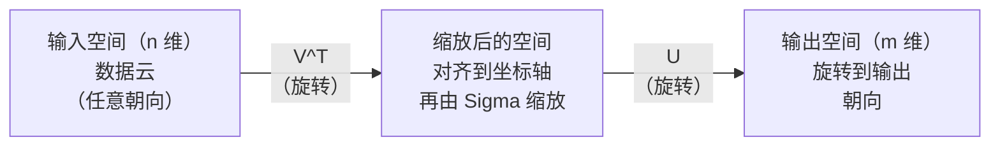
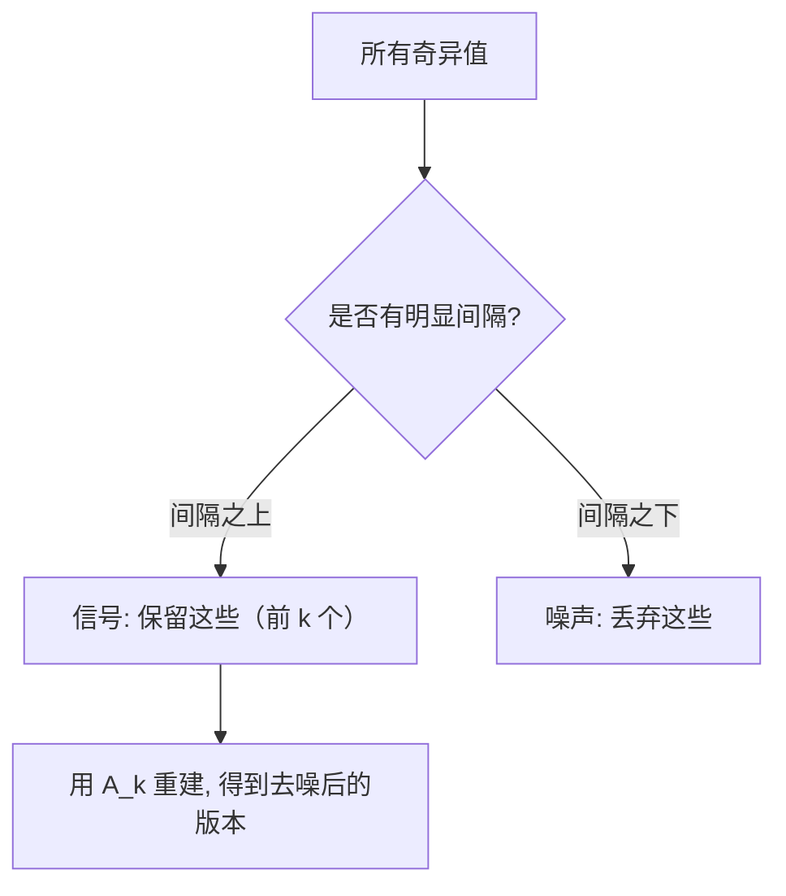

# 奇异值分解（Singular Value Decomposition）

> 译注：本文译自同目录 [`en.md`](./en.md)。术语遵循仓根 [TRANSLATION_GUIDE.md](../../../../TRANSLATION_GUIDE.md)。

> SVD 是线性代数里的瑞士军刀。每个矩阵都有一个。每个数据科学家都需要一个。

**Type:** Build
**Languages:** Python, Julia
**Prerequisites:** Phase 1, Lessons 01 (Linear Algebra Intuition), 02 (Vectors & Matrices Operations), 03 (Matrix Transformations)
**Time:** ~120 minutes

## 学习目标（Learning Objectives）

- 用幂迭代（power iteration）实现 SVD，并解释 U、Sigma、V^T 的几何含义
- 用截断 SVD（truncated SVD）做图像压缩，衡量压缩比与重构误差的权衡
- 用 SVD 计算 Moore-Penrose 伪逆（pseudoinverse），求解超定最小二乘系统
- 把 SVD 与 PCA、推荐系统的隐因子（latent factor），以及 NLP 里的潜在语义分析（Latent Semantic Analysis）联系起来

## 问题（Problem）

你手上有一个 1000x2000 的矩阵。可能是用户-电影评分。可能是文档-词频表。可能是一张图像的像素值。你需要压缩它、降噪它、找出隐藏结构，或者用它求一个最小二乘系统。特征分解（eigendecomposition）只适用于方阵。即便是方阵，也得有一组完整的线性独立的特征向量（eigenvector）才行。

SVD 适用于任何矩阵。任何形状。任何 rank。没有任何前提条件。它把矩阵分解成三个因子，揭示这个矩阵对空间做了什么样的几何变换。它是整个线性代数里最通用、最有用的分解。

## 概念（Concept）

### SVD 在几何上做了什么

任何矩阵，不管是什么形状，都在依次做三件事：旋转、缩放、再旋转。SVD 把这三步显式地拆出来。

```
A = U * Sigma * V^T

      m x n     m x m    m x n    n x n
     (any)    (rotate)  (scale)  (rotate)
```

对任意矩阵 A，SVD 把它分解成：
- V^T 在输入空间（n 维）里旋转向量
- Sigma 沿每个轴缩放（拉伸或压缩）
- U 把结果旋转到输出空间（m 维）



可以这么想：你给 SVD 一个矩阵，它告诉你：「这个矩阵接过一个输入球面，先用 V^T 旋转一下，再用 Sigma 把它拉成一个椭球，最后用 U 把椭球旋转到位。」奇异值（singular value）就是这个椭球各个轴的长度。

### 完整分解

对形状为 m x n 的矩阵 A：

```
A = U * Sigma * V^T

where:
  U     is m x m, orthogonal (U^T U = I)
  Sigma is m x n, diagonal (singular values on the diagonal)
  V     is n x n, orthogonal (V^T V = I)

The singular values sigma_1 >= sigma_2 >= ... >= sigma_r > 0
where r = rank(A)
```

U 的列称为左奇异向量（left singular vector）。V 的列称为右奇异向量（right singular vector）。Sigma 的对角线元素称为奇异值。它们永远非负，并且按惯例从大到小排列。

### 左奇异向量、奇异值、右奇异向量

SVD 的每一部分都有清晰的几何含义。

**右奇异向量（V 的列）：** 它们构成输入空间（R^n）的一组正交规范基。它们是输入空间里的某些方向，矩阵把这些方向映射到输出空间里互相正交的方向。把它们想成定义域上最自然的坐标系。

**奇异值（Sigma 的对角线）：** 这些是缩放因子。第 i 个奇异值告诉你矩阵沿着第 i 个右奇异向量把向量拉伸了多少。奇异值为零意味着矩阵把那个方向完全压扁了。

**左奇异向量（U 的列）：** 它们构成输出空间（R^m）的一组正交规范基。第 i 个左奇异向量是第 i 个右奇异向量被映射后落在输出空间的方向（已经缩放过）。

它们之间的关系：

```
A * v_i = sigma_i * u_i

The matrix A takes the i-th right singular vector v_i,
scales it by sigma_i, and maps it to the i-th left singular vector u_i.
```

这就给出了任意矩阵在每个坐标方向上的逐项行为。

### 外积形式

SVD 可以写成一组 rank-1 矩阵之和：

```
A = sigma_1 * u_1 * v_1^T + sigma_2 * u_2 * v_2^T + ... + sigma_r * u_r * v_r^T

Each term sigma_i * u_i * v_i^T is a rank-1 matrix (an outer product).
The full matrix is the sum of r such matrices, where r is the rank.
```

这个形式是低秩近似（low-rank approximation）的根基。每一项都加进一层结构。第一项捕获最重要的那一种模式。第二项捕获次重要的。依此类推。截断这个和就给出在指定 rank 下最好的近似。

```
Rank-1 approx:    A_1 = sigma_1 * u_1 * v_1^T
                  (captures the dominant pattern)

Rank-2 approx:    A_2 = sigma_1 * u_1 * v_1^T + sigma_2 * u_2 * v_2^T
                  (captures the two most important patterns)

Rank-k approx:    A_k = sum of top k terms
                  (optimal by the Eckart-Young theorem)
```

### 与特征分解的关系

SVD 与特征分解（eigendecomposition）有非常深的联系。A 的奇异值和奇异向量直接来自 A^T A 与 A A^T 的特征值（eigenvalue）和特征向量。

```
A^T A = V * Sigma^T * U^T * U * Sigma * V^T
      = V * Sigma^T * Sigma * V^T
      = V * D * V^T

where D = Sigma^T * Sigma is a diagonal matrix with sigma_i^2 on the diagonal.

So:
- The right singular vectors (V) are eigenvectors of A^T A
- The singular values squared (sigma_i^2) are eigenvalues of A^T A

Similarly:
A A^T = U * Sigma * V^T * V * Sigma^T * U^T
      = U * Sigma * Sigma^T * U^T

So:
- The left singular vectors (U) are eigenvectors of A A^T
- The eigenvalues of A A^T are also sigma_i^2
```

这种联系告诉你三件事：
1. 奇异值永远是实数且非负（它们是半正定矩阵特征值的平方根）。
2. 你可以通过 A^T A 的特征分解来计算 SVD，但这会把条件数（condition number）平方，损失数值精度。专门的 SVD 算法会避免这条路径。
3. 当 A 是方阵且对称半正定时，SVD 与特征分解是同一回事。

### 截断 SVD：低秩近似

Eckart-Young-Mirsky 定理指出：A 在 rank-k 下的最佳近似（Frobenius 范数和谱范数下都成立）就是只保留前 k 个奇异值及其对应向量得到的矩阵：

```
A_k = U_k * Sigma_k * V_k^T

where:
  U_k     is m x k  (first k columns of U)
  Sigma_k is k x k  (top-left k x k block of Sigma)
  V_k     is n x k  (first k columns of V)

Approximation error = sigma_{k+1}  (in spectral norm)
                    = sqrt(sigma_{k+1}^2 + ... + sigma_r^2)  (in Frobenius norm)
```

这不仅仅是「一个不错的」近似。它在数学上可证明地是 rank-k 的最佳近似。任何其他 rank-k 矩阵都不会比它更接近 A。

| 分量 | 相对幅度 | 在 rank-3 近似中保留？ |
|-----------|-------------------|------------------------|
| sigma_1 | 最大 | 是 |
| sigma_2 | 大 | 是 |
| sigma_3 | 中偏大 | 是 |
| sigma_4 | 中 | 否（误差） |
| sigma_5 | 中偏小 | 否（误差） |
| sigma_6 | 小 | 否（误差） |
| sigma_7 | 极小 | 否（误差） |
| sigma_8 | 微不足道 | 否（误差） |

保留前 3 个：A_3 捕获最大的三个奇异值。误差 = 剩下的（sigma_4 到 sigma_8）。

如果奇异值衰减得快，小的 k 就能捕获矩阵的大部分信息。如果衰减慢，那就说明这个矩阵没有低秩结构。

### 用 SVD 做图像压缩

灰度图就是一个像素强度矩阵。一张 800x600 的图像有 480,000 个像素值。SVD 让你用更少的数值去近似它。

```
Original image: 800 x 600 = 480,000 values

SVD with rank k:
  U_k:      800 x k values
  Sigma_k:  k values
  V_k:      600 x k values
  Total:    k * (800 + 600 + 1) = k * 1401 values

  k=10:   14,010 values   (2.9% of original)
  k=50:   70,050 values  (14.6% of original)
  k=100: 140,100 values  (29.2% of original)

  The compression ratio improves as k gets smaller,
  but visual quality degrades.
```

关键洞察：自然图像的奇异值衰减得非常快。前几个奇异值捕获大体结构（形状、渐变），后面的捕获细节和噪声。截断到 rank 50 时，往往得到一张看起来几乎和原图一致、但只占用 15% 存储空间的图像。

### SVD 用于推荐系统

Netflix Prize 让这个用法广为人知。你有一个用户-电影评分矩阵，里面大部分项是缺失的。

```
             Movie1  Movie2  Movie3  Movie4  Movie5
  User1      [  5      ?       3       ?       1  ]
  User2      [  ?      4       ?       2       ?  ]
  User3      [  3      ?       5       ?       ?  ]
  User4      [  ?      ?       ?       4       3  ]

  ? = unknown rating
```

核心想法：这个评分矩阵是低秩的。用户们的口味不会完全独立，背后有一小撮隐因子（动作 vs. 剧情、老片 vs. 新片、烧脑 vs. 直觉）就解释了大部分偏好。

对（填补后的）评分矩阵做 SVD 得到：
- U：用户在隐因子空间里的画像
- Sigma：每个隐因子的重要性
- V^T：电影在隐因子空间里的画像

用户对一部电影的预测评分就是用户画像和电影画像的点积（用奇异值加权）。低秩近似把缺失的格子填了起来。

实践中你会用一些变种，比如 Simon Funk 的增量 SVD 或 ALS（交替最小二乘法），它们能直接处理缺失数据。但核心思想还是一样的：用 SVD 做隐因子分解。

### NLP 里的 SVD：潜在语义分析

潜在语义分析（Latent Semantic Analysis，LSA）也叫潜在语义索引（Latent Semantic Indexing，LSI），就是把 SVD 用在词-文档矩阵上。

```
             Doc1   Doc2   Doc3   Doc4
  "cat"      [  3      0      1      0  ]
  "dog"      [  2      0      0      1  ]
  "fish"     [  0      4      1      0  ]
  "pet"      [  1      1      1      1  ]
  "ocean"    [  0      3      0      0  ]

After SVD with rank k=2:

  Each document becomes a point in 2D "concept space."
  Each term becomes a point in the same 2D space.
  Documents about similar topics cluster together.
  Terms with similar meanings cluster together.

  "cat" and "dog" end up near each other (land pets).
  "fish" and "ocean" end up near each other (water concepts).
  Doc1 and Doc3 cluster if they share similar topics.
```

LSA 是最早能从原始文本里捕获语义相似性的成功方法之一。它能 work 是因为同义词倾向于出现在相似的文档里，所以 SVD 把它们归到同一个隐维度上。现代的词向量（embedding）方法（Word2Vec、GloVe）都可以看作是这个想法的后裔。

### SVD 用于降噪

噪声数据中，信号集中在前几个奇异值上，而噪声散布在所有奇异值上。截断就能把噪声「地板」去掉。

**干净信号的奇异值：**

| 分量 | 幅度 | 类型 |
|-----------|-----------|------|
| sigma_1 | 非常大 | 信号 |
| sigma_2 | 大 | 信号 |
| sigma_3 | 中等 | 信号 |
| sigma_4 | 接近零 | 可忽略 |
| sigma_5 | 接近零 | 可忽略 |

**含噪信号的奇异值（噪声叠加在所有项上）：**

| 分量 | 幅度 | 类型 |
|-----------|-----------|------|
| sigma_1 | 非常大 | 信号 |
| sigma_2 | 大 | 信号 |
| sigma_3 | 中等 | 信号 |
| sigma_4 | 小 | 噪声 |
| sigma_5 | 小 | 噪声 |
| sigma_6 | 小 | 噪声 |
| sigma_7 | 小 | 噪声 |



这个方法用于信号处理、科学测量和数据清洗。任何时候你有一个被加性噪声污染的矩阵，截断 SVD 都是把信号从噪声中分离出来的一种有原则的做法。

### 通过 SVD 计算伪逆

Moore-Penrose 伪逆（pseudoinverse）A+ 把矩阵求逆推广到非方阵和奇异矩阵的情形。SVD 让计算它变得很简单。

```
If A = U * Sigma * V^T, then:

A+ = V * Sigma+ * U^T

where Sigma+ is formed by:
  1. Transpose Sigma (swap rows and columns)
  2. Replace each non-zero diagonal entry sigma_i with 1/sigma_i
  3. Leave zeros as zeros

For A (m x n):      A+ is (n x m)
For Sigma (m x n):  Sigma+ is (n x m)
```

伪逆能解最小二乘问题。如果 Ax = b 没有精确解（超定系统），那么 x = A+ b 就是最小二乘解（最小化 ||Ax - b||）。

```
Overdetermined system (more equations than unknowns):

  [1  1]         [3]
  [2  1] x   =   [5]       No exact solution exists.
  [3  1]         [6]

  x_ls = A+ b = V * Sigma+ * U^T * b

  This gives the x that minimizes the sum of squared residuals.
  Same result as the normal equations (A^T A)^(-1) A^T b,
  but numerically more stable.
```

### 数值稳定性的优势

通过 A^T A 计算特征分解会把奇异值平方（A^T A 的特征值是 sigma_i^2）。这就把条件数也平方了，从而放大数值误差。

```
Example:
  A has singular values [1000, 1, 0.001]
  Condition number of A: 1000 / 0.001 = 10^6

  A^T A has eigenvalues [10^6, 1, 10^{-6}]
  Condition number of A^T A: 10^6 / 10^{-6} = 10^{12}

  Computing SVD directly: works with condition number 10^6
  Computing via A^T A:     works with condition number 10^{12}
                           (6 extra digits of precision lost)
```

现代 SVD 算法（Golub-Kahan 双对角化）直接在 A 上工作，从不显式构造 A^T A。所以你应该永远优先用 `np.linalg.svd(A)`，而不是 `np.linalg.eig(A.T @ A)`。

### 与 PCA 的联系

PCA 就是中心化数据上的 SVD。这不是类比。它在计算上就是同一件事。

```
Given data matrix X (n_samples x n_features), centered (mean subtracted):

Covariance matrix: C = (1/(n-1)) * X^T X

PCA finds eigenvectors of C. But:

  X = U * Sigma * V^T    (SVD of X)

  X^T X = V * Sigma^2 * V^T

  C = (1/(n-1)) * V * Sigma^2 * V^T

So the principal components are exactly the right singular vectors V.
The explained variance for each component is sigma_i^2 / (n-1).

In sklearn, PCA is implemented using SVD, not eigendecomposition.
It is faster and more numerically stable.
```

这意味着你在第 10 课里学到的所有降维方法，底层都是 SVD。PCA 是 SVD 在机器学习里最常见的应用。

## 动手实现（Build It）

### Step 1：用幂迭代从零实现 SVD

思路：要找到最大的奇异值及其向量，对 A^T A（或 A A^T）做幂迭代（power iteration）。然后把矩阵「剥离」（deflate），重复这个过程取下一个奇异值。

```python
import numpy as np

def power_iteration(M, num_iters=100):
    n = M.shape[1]
    v = np.random.randn(n)
    v = v / np.linalg.norm(v)

    for _ in range(num_iters):
        Mv = M @ v
        v = Mv / np.linalg.norm(Mv)

    eigenvalue = v @ M @ v
    return eigenvalue, v

def svd_from_scratch(A, k=None):
    m, n = A.shape
    if k is None:
        k = min(m, n)

    sigmas = []
    us = []
    vs = []

    A_residual = A.copy().astype(float)

    for _ in range(k):
        AtA = A_residual.T @ A_residual
        eigenvalue, v = power_iteration(AtA, num_iters=200)

        if eigenvalue < 1e-10:
            break

        sigma = np.sqrt(eigenvalue)
        u = A_residual @ v / sigma

        sigmas.append(sigma)
        us.append(u)
        vs.append(v)

        A_residual = A_residual - sigma * np.outer(u, v)

    U = np.column_stack(us) if us else np.empty((m, 0))
    S = np.array(sigmas)
    V = np.column_stack(vs) if vs else np.empty((n, 0))

    return U, S, V
```

### Step 2：和 NumPy 对比测试

```python
np.random.seed(42)
A = np.random.randn(5, 4)

U_ours, S_ours, V_ours = svd_from_scratch(A)
U_np, S_np, Vt_np = np.linalg.svd(A, full_matrices=False)

print("Our singular values:", np.round(S_ours, 4))
print("NumPy singular values:", np.round(S_np, 4))

A_reconstructed = U_ours @ np.diag(S_ours) @ V_ours.T
print(f"Reconstruction error: {np.linalg.norm(A - A_reconstructed):.8f}")
```

### Step 3：图像压缩 demo

```python
def compress_image_svd(image_matrix, k):
    U, S, Vt = np.linalg.svd(image_matrix, full_matrices=False)
    compressed = U[:, :k] @ np.diag(S[:k]) @ Vt[:k, :]
    return compressed

image = np.random.seed(42)
rows, cols = 200, 300
image = np.random.randn(rows, cols)

for k in [1, 5, 10, 20, 50]:
    compressed = compress_image_svd(image, k)
    error = np.linalg.norm(image - compressed) / np.linalg.norm(image)
    original_size = rows * cols
    compressed_size = k * (rows + cols + 1)
    ratio = compressed_size / original_size
    print(f"k={k:>3d}  error={error:.4f}  storage={ratio:.1%}")
```

### Step 4：降噪

```python
np.random.seed(42)
clean = np.outer(np.sin(np.linspace(0, 4*np.pi, 100)),
                 np.cos(np.linspace(0, 2*np.pi, 80)))
noise = 0.3 * np.random.randn(100, 80)
noisy = clean + noise

U, S, Vt = np.linalg.svd(noisy, full_matrices=False)
denoised = U[:, :5] @ np.diag(S[:5]) @ Vt[:5, :]

print(f"Noisy error:    {np.linalg.norm(noisy - clean):.4f}")
print(f"Denoised error: {np.linalg.norm(denoised - clean):.4f}")
print(f"Improvement:    {(1 - np.linalg.norm(denoised - clean) / np.linalg.norm(noisy - clean)):.1%}")
```

### Step 5：伪逆

```python
A = np.array([[1, 1], [2, 1], [3, 1]], dtype=float)
b = np.array([3, 5, 6], dtype=float)

U, S, Vt = np.linalg.svd(A, full_matrices=False)
S_inv = np.diag(1.0 / S)
A_pinv = Vt.T @ S_inv @ U.T

x_svd = A_pinv @ b
x_lstsq = np.linalg.lstsq(A, b, rcond=None)[0]
x_pinv = np.linalg.pinv(A) @ b

print(f"SVD pseudoinverse solution:  {x_svd}")
print(f"np.linalg.lstsq solution:   {x_lstsq}")
print(f"np.linalg.pinv solution:    {x_pinv}")
```

## 用起来（Use It）

完整可运行的 demo 在 `code/svd.py`。运行它就能看到 SVD 应用在图像压缩、推荐系统、潜在语义分析和降噪上的效果。

```bash
python svd.py
```

`code/svd.jl` 里的 Julia 版本用 Julia 自带的 `svd()` 函数和 `LinearAlgebra` 包演示了同样的概念。

```bash
julia svd.jl
```

## 上线部署（Ship It）

本节产出：
- `outputs/skill-svd.md` —— 一份 skill，告诉你在真实项目中什么时候、怎么用 SVD

## 练习（Exercises）

1. 不用幂迭代，从零实现完整 SVD。改用对 A^T A 做特征分解得到 V 和奇异值，再用 U = A V Sigma^{-1} 算 U。把数值精度跟你的幂迭代版本以及 NumPy 比较一下。

2. 加载一张真实的灰度图（或者把彩色图转成灰度）。在 rank 为 1、5、10、25、50、100 时分别压缩。对每个 rank 计算压缩比和相对误差。找到图像在视觉上可接受的最低 rank。

3. 搭一个迷你推荐系统。构造一个 10x8 的用户-电影评分矩阵，里面有些已知项。用行均值填补缺失项。计算 SVD 并重构 rank-3 近似。用重构后的矩阵预测缺失评分。验证预测是否合理。

4. 构造一个 100x50 的文档-词矩阵，有 3 个合成主题。每个主题对应 5 个相关词。加上噪声。做 SVD，验证前 3 个奇异值显著大于其他奇异值。把文档投影到 3 维隐空间，检查同一主题的文档是否聚在一起。

5. 生成一个干净的低秩矩阵（rank 3，大小 50x40），加上不同强度的高斯噪声（sigma = 0.1、0.5、1.0、2.0）。对每个噪声水平，从 k=1 到 40 扫一遍，找出让重构误差（与干净矩阵相比）最小的最佳截断 rank。画一张图：最佳 k 随噪声水平如何变化。

## 关键术语（Key Terms）

| 术语 | 大家怎么说 | 实际含义 |
|------|----------------|----------------------|
| SVD | 「分解任意矩阵」 | 把 A 分解为 U Sigma V^T，其中 U 和 V 正交、Sigma 是非负对角阵。适用于任意形状的任意矩阵。 |
| 奇异值 | 「这个分量有多重要」 | Sigma 第 i 个对角元素。衡量矩阵沿第 i 个主方向拉伸的幅度。永远非负，按从大到小排列。 |
| 左奇异向量 | 「输出方向」 | U 的一列。第 i 个右奇异向量被映射到的输出空间方向（按 sigma_i 缩放后）。 |
| 右奇异向量 | 「输入方向」 | V 的一列。矩阵把它映射到第 i 个左奇异向量的输入空间方向（按 sigma_i 缩放后）。 |
| 截断 SVD | 「低秩近似」 | 只保留前 k 个奇异值及其向量。是原矩阵 rank-k 的可证明最佳近似（Eckart-Young 定理）。 |
| Rank | 「真实维数」 | 非零奇异值的个数。告诉你矩阵实际用到了多少独立方向。 |
| 伪逆 | 「广义逆」 | V Sigma+ U^T。把非零奇异值取倒数，零保持为零。能为非方或奇异矩阵求最小二乘解。 |
| 条件数（condition number） | 「对误差有多敏感」 | sigma_max / sigma_min。条件数大意味着输入小变化会导致输出大变化。SVD 直接揭示这一点。 |
| 隐因子（latent factor） | 「隐藏变量」 | SVD 在低秩空间里发现的某个维度。在推荐系统里，隐因子可能对应类型偏好。在 NLP 里，可能对应某个主题。 |
| Frobenius 范数 | 「矩阵的整体大小」 | 所有元素平方和的平方根。等于所有奇异值平方和的平方根。用来衡量近似误差。 |
| Eckart-Young 定理 | 「SVD 给出最佳压缩」 | 对任意目标 rank k，截断 SVD 在所有 rank-k 矩阵中能让近似误差最小。 |
| 幂迭代（power iteration） | 「找最大的特征向量」 | 反复用矩阵乘一个随机向量，再归一化。最终收敛到对应最大特征值的特征向量。是许多 SVD 算法的基础组件。 |

## 延伸阅读（Further Reading）

- [Gilbert Strang: Linear Algebra and Its Applications, Chapter 7](https://math.mit.edu/~gs/linearalgebra/) —— 对 SVD 及其应用的全面讲解
- [3Blue1Brown: But what is the SVD?](https://www.youtube.com/watch?v=vSczTbgc8Rc) —— SVD 的几何直觉
- [We Recommend a Singular Value Decomposition](https://www.ams.org/publicoutreach/feature-column/fcarc-svd) —— 美国数学会的入门概览
- [Netflix Prize and Matrix Factorization](https://sifter.org/~simon/journal/20061211.html) —— Simon Funk 关于 SVD 推荐的原始博客
- [Latent Semantic Analysis](https://en.wikipedia.org/wiki/Latent_semantic_analysis) —— SVD 在 NLP 上最早的应用
- [Numerical Linear Algebra by Trefethen and Bau](https://people.maths.ox.ac.uk/trefethen/text.html) —— 理解 SVD 算法及其数值性质的金标准
