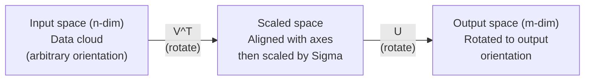
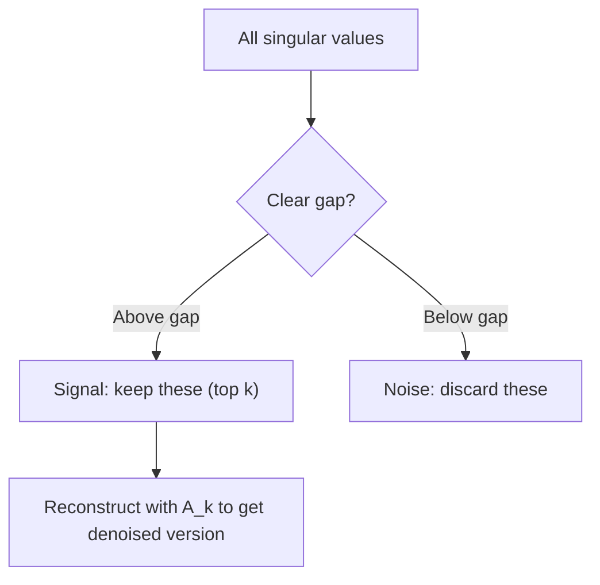

# 奇異值分解

> SVD 是線性代數的瑞士刀。每個矩陣都有一個 SVD，每個資料科學家都需要它。

**類型：** 實作
**程式語言：** Python, Julia
**先修單元：** 階段 1 · 單元 01（線性代數直覺）、02（向量與矩陣運算）、03（矩陣轉換）
**時間：** 約 120 分鐘

## 學習目標

- 用冪次迭代實作 SVD，並說明 U、Sigma 與 V^T 的幾何意義
- 用截斷 SVD 做影像壓縮，並衡量壓縮率與重建誤差的取捨
- 用 SVD 計算 Moore-Penrose 偽逆，解超定的最小平方問題
- 把 SVD 連結到 PCA、推薦系統（潛在因子）以及 NLP 的潛在語意分析

## 問題所在

你有一個 1000x2000 的矩陣。它可能是使用者對電影的評分，可能是文件-詞彙的頻率表，也可能是一張影像的像素值。你需要壓縮它、去噪、找出藏在裡面的結構，或是用它解一個最小平方系統。特徵分解只能用在方陣上，而且就算是方陣，也還要求它有一整組線性獨立的特徵向量。

SVD 對任何矩陣都成立。任何形狀、任何秩，沒有附加條件。它把矩陣分解成三個因子，揭露這個矩陣對空間做了什麼的幾何結構。它是整個線性代數裡最通用、也最好用的分解。

## 核心概念

### SVD 在幾何上做了什麼

每一個矩陣，不論形狀，都依序執行三個操作：旋轉、縮放、旋轉。SVD 把這個分解寫得明明白白。

```
A = U * Sigma * V^T

      m x n     m x m    m x n    n x n
     (any)    (rotate)  (scale)  (rotate)
```

給定任意矩陣 A，SVD 把它分解成：
- V^T 在輸入空間（n 維）中旋轉向量
- Sigma 沿著每個軸縮放（拉伸或壓縮）
- U 把結果旋轉到輸出空間（m 維）


```mermaid
graph LR
    A["Input space (n-dim)\nData cloud\n(arbitrary orientation)"] -->|"V^T\n(rotate)"| B["Scaled space\nAligned with axes\nthen scaled by Sigma"]
    B -->|"U\n(rotate)"| C["Output space (m-dim)\nRotated to output\norientation"]
```

可以這樣想：你把一個矩陣交給 SVD，它告訴你：「這個矩陣拿到一顆由輸入組成的球，先用 V^T 把它轉過去，再用 Sigma 把它拉成一顆橢球，最後用 U 把橢球轉過來。」奇異值就是這顆橢球各軸的長度。

### 完整的分解

對一個 m x n 的矩陣 A：

```
A = U * Sigma * V^T

where:
  U     is m x m, orthogonal (U^T U = I)
  Sigma is m x n, diagonal (singular values on the diagonal)
  V     is n x n, orthogonal (V^T V = I)

The singular values sigma_1 >= sigma_2 >= ... >= sigma_r > 0
where r = rank(A)
```

U 的各行向量（欄）稱為左奇異向量，V 的各欄稱為右奇異向量，Sigma 對角線上的元素稱為奇異值。奇異值永遠非負，而且照慣例由大到小排序。

### 左奇異向量、奇異值、右奇異向量

SVD 的每個組成部分都有各自明確的幾何意義。

**右奇異向量（V 的各欄）：** 它們構成輸入空間（R^n）的一組正交規範基底。它們是輸入空間中的那些方向，矩陣會把它們映射到輸出空間裡互相正交的方向。可以把它們想成定義域最自然的座標系。

**奇異值（Sigma 的對角線）：** 它們是縮放倍率。第 i 個奇異值告訴你矩陣沿著第 i 個右奇異向量把向量拉伸了多少。奇異值為零表示矩陣把那個方向完全壓扁。

**左奇異向量（U 的各欄）：** 它們構成輸出空間（R^m）的一組正交規範基底。第 i 個左奇異向量就是第 i 個右奇異向量（經過縮放後）落腳的輸出空間方向。

它們之間的關係：

```
A * v_i = sigma_i * u_i

The matrix A takes the i-th right singular vector v_i,
scales it by sigma_i, and maps it to the i-th left singular vector u_i.
```

這給了你一幅逐座標的圖像，說明任何矩陣到底在做什麼。

### 外積形式

SVD 可以寫成一連串秩 1 矩陣的和：

```
A = sigma_1 * u_1 * v_1^T + sigma_2 * u_2 * v_2^T + ... + sigma_r * u_r * v_r^T

Each term sigma_i * u_i * v_i^T is a rank-1 matrix (an outer product).
The full matrix is the sum of r such matrices, where r is the rank.
```

這個形式是低秩近似的基礎。每一項都疊上一層結構：第一項抓住最重要的那個模式，第二項抓住次重要的，依此類推。把這個和截斷，就得到在任何給定秩之下最好的近似。

```
Rank-1 approx:    A_1 = sigma_1 * u_1 * v_1^T
                  (captures the dominant pattern)

Rank-2 approx:    A_2 = sigma_1 * u_1 * v_1^T + sigma_2 * u_2 * v_2^T
                  (captures the two most important patterns)

Rank-k approx:    A_k = sum of top k terms
                  (optimal by the Eckart-Young theorem)
```

### 與特徵分解的關係

SVD 與特徵分解關係極深。A 的奇異值與奇異向量，直接來自 A^T A 與 A A^T 的特徵值與特徵向量。

```
A^T A = V * Sigma^T * U^T * U * Sigma * V^T
      = V * Sigma^T * Sigma * V^T
      = V * D * V^T

where D = Sigma^T * Sigma is a diagonal matrix with sigma_i^2 on the diagonal.

So:
- The right singular vectors (V) are eigenvectors of A^T A
- The singular values squared (sigma_i^2) are eigenvalues of A^T A

Similarly:
A A^T = U * Sigma * V^T * V * Sigma^T * U^T
      = U * Sigma * Sigma^T * U^T

So:
- The left singular vectors (U) are eigenvectors of A A^T
- The eigenvalues of A A^T are also sigma_i^2
```

這層關聯告訴你三件事：
1. 奇異值永遠是實數且非負（它們是某個半正定矩陣特徵值的平方根）。
2. 你可以透過 A^T A 的特徵分解算出 SVD，但這會把條件數平方，損失數值精度。專用的 SVD 演算法會避開這條路。
3. 當 A 是方陣、對稱且半正定時，SVD 與特徵分解就是同一回事。

### 截斷 SVD：低秩近似

Eckart-Young-Mirsky 定理說：A 的最佳秩 k 近似（在 Frobenius 範數與譜範數下都成立）就是只保留前 k 個奇異值及其對應向量所得到的結果：

```
A_k = U_k * Sigma_k * V_k^T

where:
  U_k     is m x k  (first k columns of U)
  Sigma_k is k x k  (top-left k x k block of Sigma)
  V_k     is n x k  (first k columns of V)

Approximation error = sigma_{k+1}  (in spectral norm)
                    = sqrt(sigma_{k+1}^2 + ... + sigma_r^2)  (in Frobenius norm)
```

這不只是「一個不錯的」近似，它是可以證明的、秩 k 之下最好的近似。沒有其他秩 k 的矩陣比它更接近 A。

| 成分 | 相對大小 | 秩 3 近似中是否保留？ |
|-----------|-------------------|------------------------|
| sigma_1 | 最大 | 是 |
| sigma_2 | 大 | 是 |
| sigma_3 | 中偏大 | 是 |
| sigma_4 | 中等 | 否（成為誤差） |
| sigma_5 | 中偏小 | 否（成為誤差） |
| sigma_6 | 小 | 否（成為誤差） |
| sigma_7 | 非常小 | 否（成為誤差） |
| sigma_8 | 微不足道 | 否（成為誤差） |

保留前 3 個：A_3 抓住三個最大的奇異值。誤差就是剩下的那些值（sigma_4 到 sigma_8）。

如果奇異值衰減得快，很小的 k 就能抓住矩陣的大部分內容。如果衰減得慢，那這個矩陣就沒有低秩結構。

### 用 SVD 做影像壓縮

一張灰階影像就是一個像素強度矩陣。一張 800x600 的影像有 480,000 個值。SVD 讓你用少得多的數字近似它。

```
Original image: 800 x 600 = 480,000 values

SVD with rank k:
  U_k:      800 x k values
  Sigma_k:  k values
  V_k:      600 x k values
  Total:    k * (800 + 600 + 1) = k * 1401 values

  k=10:   14,010 values   (2.9% of original)
  k=50:   70,050 values  (14.6% of original)
  k=100: 140,100 values  (29.2% of original)

  The compression ratio improves as k gets smaller,
  but visual quality degrades.
```

關鍵在於：自然影像的奇異值衰減得很快。前幾個奇異值抓住大範圍的結構（形狀、漸層），後面的則抓住細節與雜訊。截斷在秩 50 常常就能產生一張看起來幾乎與原圖無異的影像，而儲存量少了 85%。

### SVD 用於推薦系統

Netflix Prize 讓這件事出名。你有一個使用者-電影評分矩陣，其中大部分元素是缺的。

```
             Movie1  Movie2  Movie3  Movie4  Movie5
  User1      [  5      ?       3       ?       1  ]
  User2      [  ?      4       ?       2       ?  ]
  User3      [  3      ?       5       ?       ?  ]
  User4      [  ?      ?       ?       4       3  ]

  ? = unknown rating
```

想法是：這個評分矩陣是低秩的。使用者的口味並不是彼此完全獨立的，背後有少數幾個潛在因子（動作片對劇情片、老片對新片、燒腦對直觀）就解釋了大部分的偏好。

對（補齊後的）評分矩陣做 SVD，會把它分解成：
- U：使用者在潛在因子空間中的輪廓
- Sigma：每個潛在因子的重要程度
- V^T：電影在潛在因子空間中的輪廓

某位使用者對某部電影的預測評分，就是他的使用者輪廓與這部電影輪廓的內積（並用奇異值加權）。低秩近似把缺失的元素補了起來。

實務上你會用 Simon Funk 的增量式 SVD 或 ALS（交替最小平方法）這類變體，它們直接處理缺失資料。但核心想法一樣：用 SVD 做潛在因子分解。

### SVD 在 NLP 中：潛在語意分析

潛在語意分析（LSA），也叫潛在語意索引（LSI），是把 SVD 套用在詞彙-文件矩陣上。

```
             Doc1   Doc2   Doc3   Doc4
  "cat"      [  3      0      1      0  ]
  "dog"      [  2      0      0      1  ]
  "fish"     [  0      4      1      0  ]
  "pet"      [  1      1      1      1  ]
  "ocean"    [  0      3      0      0  ]

After SVD with rank k=2:

  Each document becomes a point in 2D "concept space."
  Each term becomes a point in the same 2D space.
  Documents about similar topics cluster together.
  Terms with similar meanings cluster together.

  "cat" and "dog" end up near each other (land pets).
  "fish" and "ocean" end up near each other (water concepts).
  Doc1 and Doc3 cluster if they share similar topics.
```

LSA 是最早成功從原始文字中捕捉語意相似性的方法之一。它之所以有效，是因為同義的詞彙傾向出現在相似的文件裡，於是 SVD 把它們歸到同一批潛在維度上。現代的詞嵌入（Word2Vec、GloVe）可以看成這個想法的後裔。

### SVD 用於降噪

有雜訊的資料，訊號會集中在前幾個奇異值上，而雜訊則散布在所有奇異值上。截斷就把雜訊底噪切掉。

**乾淨訊號的奇異值：**

| 成分 | 大小 | 類型 |
|-----------|-----------|------|
| sigma_1 | 非常大 | 訊號 |
| sigma_2 | 大 | 訊號 |
| sigma_3 | 中等 | 訊號 |
| sigma_4 | 接近零 | 可忽略 |
| sigma_5 | 接近零 | 可忽略 |

**含雜訊訊號的奇異值（雜訊加到所有成分上）：**

| 成分 | 大小 | 類型 |
|-----------|-----------|------|
| sigma_1 | 非常大 | 訊號 |
| sigma_2 | 大 | 訊號 |
| sigma_3 | 中等 | 訊號 |
| sigma_4 | 小 | 雜訊 |
| sigma_5 | 小 | 雜訊 |
| sigma_6 | 小 | 雜訊 |
| sigma_7 | 小 | 雜訊 |


```mermaid
graph TD
    A["All singular values"] --> B{"Clear gap?"}
    B -->|"Above gap"| C["Signal: keep these (top k)"]
    B -->|"Below gap"| D["Noise: discard these"]
    C --> E["Reconstruct with A_k to get denoised version"]
```

這被用在訊號處理、科學量測與資料清理上。任何時候你手上有一個被加性雜訊污染的矩陣，截斷 SVD 就是一個有原則的方式把訊號從雜訊裡分出來。

### 用 SVD 算偽逆

Moore-Penrose 偽逆 A+ 把矩陣求逆推廣到非方陣與奇異矩陣上。有了 SVD，算它變得無比簡單。

```
If A = U * Sigma * V^T, then:

A+ = V * Sigma+ * U^T

where Sigma+ is formed by:
  1. Transpose Sigma (swap rows and columns)
  2. Replace each non-zero diagonal entry sigma_i with 1/sigma_i
  3. Leave zeros as zeros

For A (m x n):      A+ is (n x m)
For Sigma (m x n):  Sigma+ is (n x m)
```

偽逆能解最小平方問題。如果 Ax = b 沒有精確解（超定系統），那麼 x = A+ b 就是最小平方解（讓 ||Ax - b|| 最小）。

```
Overdetermined system (more equations than unknowns):

  [1  1]         [3]
  [2  1] x   =   [5]       No exact solution exists.
  [3  1]         [6]

  x_ls = A+ b = V * Sigma+ * U^T * b

  This gives the x that minimizes the sum of squared residuals.
  Same result as the normal equations (A^T A)^(-1) A^T b,
  but numerically more stable.
```

### 數值穩定性上的優勢

計算 A^T A 的特徵分解會把奇異值平方（A^T A 的特徵值是 sigma_i^2）。這會把條件數平方，放大數值誤差。

```
Example:
  A has singular values [1000, 1, 0.001]
  Condition number of A: 1000 / 0.001 = 10^6

  A^T A has eigenvalues [10^6, 1, 10^{-6}]
  Condition number of A^T A: 10^6 / 10^{-6} = 10^{12}

  Computing SVD directly: works with condition number 10^6
  Computing via A^T A:     works with condition number 10^{12}
                           (6 extra digits of precision lost)
```

現代的 SVD 演算法（Golub-Kahan 雙對角化）直接作用在 A 上，從不去組出 A^T A。這就是為什麼你永遠該選 `np.linalg.svd(A)` 而不是 `np.linalg.eig(A.T @ A)`。

### 與 PCA 的關聯

PCA 就是對中心化資料做 SVD。這不是比喻，它字面上是同一套計算。

```
Given data matrix X (n_samples x n_features), centered (mean subtracted):

Covariance matrix: C = (1/(n-1)) * X^T X

PCA finds eigenvectors of C. But:

  X = U * Sigma * V^T    (SVD of X)

  X^T X = V * Sigma^2 * V^T

  C = (1/(n-1)) * V * Sigma^2 * V^T

So the principal components are exactly the right singular vectors V.
The explained variance for each component is sigma_i^2 / (n-1).

In sklearn, PCA is implemented using SVD, not eigendecomposition.
It is faster and more numerically stable.
```

這表示你在單元 10 學到的降維，底層全都是 SVD。PCA 是 SVD 在機器學習裡最常見的應用。

```figure
svd-rank-reconstruction
```

## 動手實作

### 步驟 1：用冪次迭代從零實作 SVD

想法是：要找出最大的奇異值與它的奇異向量，就對 A^T A（或 A A^T）做冪次迭代。然後把矩陣做縮減（deflation），再重複找下一個奇異值。

```python
import numpy as np

def power_iteration(M, num_iters=100):
    n = M.shape[1]
    v = np.random.randn(n)
    v = v / np.linalg.norm(v)

    for _ in range(num_iters):
        Mv = M @ v
        v = Mv / np.linalg.norm(Mv)

    eigenvalue = v @ M @ v
    return eigenvalue, v

def svd_from_scratch(A, k=None):
    m, n = A.shape
    if k is None:
        k = min(m, n)

    sigmas = []
    us = []
    vs = []

    A_residual = A.copy().astype(float)

    for _ in range(k):
        AtA = A_residual.T @ A_residual
        eigenvalue, v = power_iteration(AtA, num_iters=200)

        if eigenvalue < 1e-10:
            break

        sigma = np.sqrt(eigenvalue)
        u = A_residual @ v / sigma

        sigmas.append(sigma)
        us.append(u)
        vs.append(v)

        A_residual = A_residual - sigma * np.outer(u, v)

    U = np.column_stack(us) if us else np.empty((m, 0))
    S = np.array(sigmas)
    V = np.column_stack(vs) if vs else np.empty((n, 0))

    return U, S, V
```

### 步驟 2：測試並與 NumPy 比對

```python
np.random.seed(42)
A = np.random.randn(5, 4)

U_ours, S_ours, V_ours = svd_from_scratch(A)
U_np, S_np, Vt_np = np.linalg.svd(A, full_matrices=False)

print("Our singular values:", np.round(S_ours, 4))
print("NumPy singular values:", np.round(S_np, 4))

A_reconstructed = U_ours @ np.diag(S_ours) @ V_ours.T
print(f"Reconstruction error: {np.linalg.norm(A - A_reconstructed):.8f}")
```

### 步驟 3：影像壓縮示範

```python
def compress_image_svd(image_matrix, k):
    U, S, Vt = np.linalg.svd(image_matrix, full_matrices=False)
    compressed = U[:, :k] @ np.diag(S[:k]) @ Vt[:k, :]
    return compressed

image = np.random.seed(42)
rows, cols = 200, 300
image = np.random.randn(rows, cols)

for k in [1, 5, 10, 20, 50]:
    compressed = compress_image_svd(image, k)
    error = np.linalg.norm(image - compressed) / np.linalg.norm(image)
    original_size = rows * cols
    compressed_size = k * (rows + cols + 1)
    ratio = compressed_size / original_size
    print(f"k={k:>3d}  error={error:.4f}  storage={ratio:.1%}")
```

### 步驟 4：降噪

```python
np.random.seed(42)
clean = np.outer(np.sin(np.linspace(0, 4*np.pi, 100)),
                 np.cos(np.linspace(0, 2*np.pi, 80)))
noise = 0.3 * np.random.randn(100, 80)
noisy = clean + noise

U, S, Vt = np.linalg.svd(noisy, full_matrices=False)
denoised = U[:, :5] @ np.diag(S[:5]) @ Vt[:5, :]

print(f"Noisy error:    {np.linalg.norm(noisy - clean):.4f}")
print(f"Denoised error: {np.linalg.norm(denoised - clean):.4f}")
print(f"Improvement:    {(1 - np.linalg.norm(denoised - clean) / np.linalg.norm(noisy - clean)):.1%}")
```

### 步驟 5：偽逆

```python
A = np.array([[1, 1], [2, 1], [3, 1]], dtype=float)
b = np.array([3, 5, 6], dtype=float)

U, S, Vt = np.linalg.svd(A, full_matrices=False)
S_inv = np.diag(1.0 / S)
A_pinv = Vt.T @ S_inv @ U.T

x_svd = A_pinv @ b
x_lstsq = np.linalg.lstsq(A, b, rcond=None)[0]
x_pinv = np.linalg.pinv(A) @ b

print(f"SVD pseudoinverse solution:  {x_svd}")
print(f"np.linalg.lstsq solution:   {x_lstsq}")
print(f"np.linalg.pinv solution:    {x_pinv}")
```

## 框架應用

完整可執行的示範在 `code/svd.py`。跑一次就能看到 SVD 應用在影像壓縮、推薦系統、潛在語意分析與降噪上。

```bash
python svd.py
```

`code/svd.jl` 裡的 Julia 版本用 Julia 內建的 `svd()` 函式與 `LinearAlgebra` 套件示範同樣的概念。

```bash
julia svd.jl
```

## 產出交付

這一課產出：
- `outputs/skill-svd.md` —— 一份技能文件，說明在真實專案中何時、以及如何套用 SVD

## 練習

1. 不用冪次迭代，從零實作完整的 SVD。改成計算 A^T A 的特徵分解來取得 V 與奇異值，再算出 U = A V Sigma^{-1}。把數值精度跟你的冪次迭代版本以及 NumPy 比一比。

2. 載入一張真實的灰階影像（或把一張影像轉成灰階）。在秩 1、5、10、25、50、100 下分別壓縮它。對每個秩算出壓縮率與相對誤差。找出影像在哪個秩開始看起來可以接受。

3. 做一個迷你推薦系統。建立一個 10x8 的使用者-電影評分矩陣，其中部分元素已知。用列平均補齊缺失的元素。算出 SVD 並重建秩 3 的近似。用重建後的矩陣預測缺失的評分，並驗證預測結果合理。

4. 建立一個 100x50 的文件-詞彙矩陣，內含 3 個合成主題，每個主題有 5 個相關詞彙。加入雜訊。套用 SVD，並驗證前 3 個奇異值遠大於其餘的。把文件投影到 3 維潛在空間，檢查同一主題的文件是否聚在一起。

5. 產生一個乾淨的低秩矩陣（秩 3，大小 50x40），並在不同強度下加入高斯雜訊（sigma = 0.1、0.5、1.0、2.0）。對每個雜訊強度，把 k 從 1 掃到 40 並量測對乾淨矩陣的重建誤差，找出最佳的截斷秩。畫出最佳 k 如何隨雜訊強度變化。

## 關鍵術語

| 術語 | 大家怎麼說 | 實際上是什麼 |
|------|----------------|----------------------|
| SVD | 「任何矩陣都能分解」 | 把 A 分解成 U Sigma V^T，其中 U 與 V 是正交矩陣，Sigma 是元素非負的對角矩陣。對任何形狀的任何矩陣都成立。 |
| 奇異值 | 「這個成分有多重要」 | Sigma 對角線上第 i 個元素。衡量矩陣沿著第 i 個主方向拉伸了多少。永遠非負，並由大到小排序。 |
| 左奇異向量 | 「輸出方向」 | U 的一欄。第 i 個右奇異向量（經 sigma_i 縮放後）在輸出空間落腳的方向。 |
| 右奇異向量 | 「輸入方向」 | V 的一欄。輸入空間中被矩陣映射（並經 sigma_i 縮放）到第 i 個左奇異向量的那個方向。 |
| 截斷 SVD | 「低秩近似」 | 只保留前 k 個奇異值與它們的向量。產生原矩陣可證明為最佳的秩 k 近似（Eckart-Young 定理）。 |
| 秩 | 「真正的維度」 | 非零奇異值的個數。告訴你這個矩陣實際上用到幾個獨立方向。 |
| 偽逆 | 「廣義的逆矩陣」 | V Sigma+ U^T。把非零奇異值取倒數，零留成零。能解非方陣或奇異矩陣的最小平方問題。 |
| 條件數 | 「對誤差有多敏感」 | sigma_max / sigma_min。條件數大表示輸入的小變動會造成輸出的大變動。SVD 直接把這件事攤開來看。 |
| 潛在因子 | 「隱藏變數」 | SVD 找出的低秩空間中的一個維度。在推薦系統裡，某個潛在因子可能對應到類型偏好；在 NLP 裡，它可能對應到一個主題。 |
| Frobenius 範數 | 「矩陣整體有多大」 | 所有元素平方和的平方根。等於所有奇異值平方和的平方根。用來衡量近似誤差。 |
| Eckart-Young 定理 | 「SVD 給出最好的壓縮」 | 對任何目標秩 k，截斷 SVD 在所有可能的秩 k 矩陣中把近似誤差降到最小。 |
| 冪次迭代 | 「找出最大的特徵向量」 | 反覆用矩陣乘上一個隨機向量並正規化。會收斂到最大特徵值對應的特徵向量。許多 SVD 演算法的基本構件。 |

## 延伸閱讀

- [Gilbert Strang: Linear Algebra and Its Applications, Chapter 7](https://math.mit.edu/~gs/linearalgebra/) —— 對 SVD 及其應用的完整處理
- [3Blue1Brown: But what is the SVD?](https://www.youtube.com/watch?v=vSczTbgc8Rc) —— SVD 的幾何直覺
- [We Recommend a Singular Value Decomposition](https://www.ams.org/publicoutreach/feature-column/fcarc-svd) —— 美國數學學會寫的平易概覽
- [Netflix Prize and Matrix Factorization](https://sifter.org/~simon/journal/20061211.html) —— Simon Funk 談用 SVD 做推薦的原始部落格文章
- [Latent Semantic Analysis](https://en.wikipedia.org/wiki/Latent_semantic_analysis) —— SVD 最早的 NLP 應用
- [Numerical Linear Algebra by Trefethen and Bau](https://people.maths.ox.ac.uk/trefethen/text.html) —— 理解 SVD 演算法及其數值特性的黃金標準
