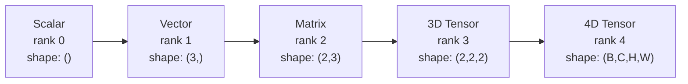
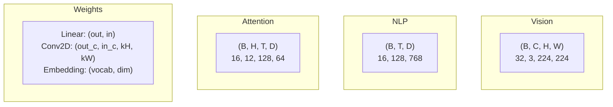
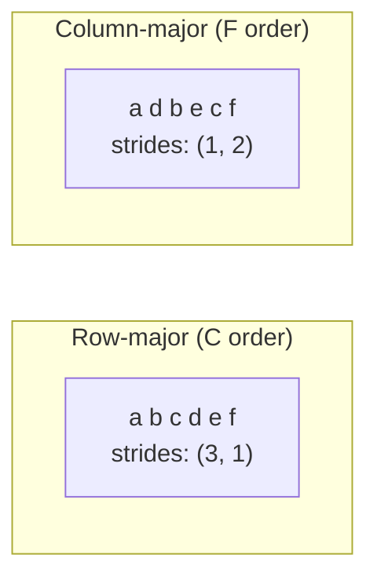
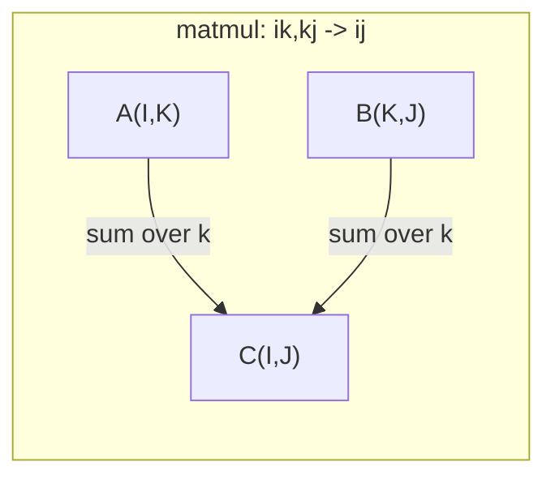

# テンソル操作

> テンソルは、データと深層学習をつなぐ共通言語です。すべての画像、すべての文、すべての勾配がテンソルを通って流れます。

**種別:** 構築
**言語:** Python
**前提条件:** Phase 1、Lesson 01（線形代数の直感）、02（ベクトル・行列・演算）
**所要時間:** 約90分

## 学習目標

- shape、strides、reshape、transpose、要素ごとの演算を持つtensorクラスをスクラッチから実装する
- ブロードキャスト規則を適用し、データをコピーせずに異なるshapeのテンソル同士を演算する
- dot product、matrix multiplication、outer product、batched operationのeinsum式を書く
- multi-head attentionの各ステップで、正確なtensor shapeを追跡する

## 問題

transformerを作っています。forward passはきれいに見えます。実行すると、`RuntimeError: mat1 and mat2 shapes cannot be multiplied (32x768 and 512x768)` が出ます。shapeを見つめます。transposeを試します。今度は `Expected 4D input (got 3D input)` と出ます。unsqueezeを足します。別の場所が壊れます。

shapeエラーは、深層学習コードで最もよくあるバグです。概念的には難しくありません。各演算にはshape契約があります。しかし、すぐに増殖します。transformerには、何十ものreshape、transpose、broadcastが連鎖しています。1つ軸を間違えると、エラーは連鎖します。さらに悪いことに、一部のshapeミスはエラーを投げません。間違った次元に沿ってブロードキャストしたり、間違った軸で和を取ったりして、静かに壊れた値を生みます。

行列は、2組のものの間のペア関係を扱います。現実のデータは2次元には収まりません。224x224のRGB画像32枚のバッチは4Dテンソルです: `(32, 3, 224, 224)`。12ヘッドのself-attentionも4Dです: `(batch, heads, seq_len, head_dim)`。任意の次元数へ一般化でき、すべての次元にわたってきれいに合成できる演算を持つデータ構造が必要です。それがテンソルです。テンソル操作を習得すれば、shapeエラーは簡単にデバッグできるようになります。

## 概念

### テンソルとは

テンソルは、均一なデータ型を持つ数値の多次元配列です。次元数は**rank**（または**order**）です。各次元は**axis**です。**shape**は、各軸のサイズを並べたtupleです。



総要素数 = すべてのサイズの積です。shape `(2, 3, 4)` は `2 * 3 * 4 = 24` 個の要素を持ちます。

### 深層学習におけるtensor shape

データ型ごとに、慣習的なtensor shapeがあります。



PyTorchはNCHW（channels-first）を使います。TensorFlowはデフォルトでNHWC（channels-last）です。レイアウトの不一致は、静かな低速化やエラーの原因になります。

### メモリレイアウトの仕組み

メモリ上の2D配列は、1Dのバイト列です。**Strides**は、各軸に沿って1ステップ進むために何要素スキップするかを教えてくれます。



Transposeはデータを動かしません。stridesを入れ替えるだけで、テンソルを**non-contiguous**にします。つまり、ある行の要素がメモリ上で隣接しなくなります。

### ブロードキャスト規則

ブロードキャストを使うと、データをコピーせずに異なるshapeのテンソル同士を演算できます。shapeは右からそろえます。2つの次元は、等しいか、どちらかが1なら互換です。次元数が少ない方は、左側に1を補います。

```
Tensor A:     (8, 1, 6, 1)
Tensor B:        (7, 1, 5)
Padded B:     (1, 7, 1, 5)
Result:       (8, 7, 6, 5)
```

### Einsum: 万能のテンソル演算

Einstein summationでは、各軸に文字ラベルを付けます。入力にはあるが出力にはない軸は合計されます。両方にある軸は残ります。



主要パターン: `i,i->`（dot product）、`i,j->ij`（outer product）、`ii->`（trace）、`ij->ji`（transpose）、`bij,bjk->bik`（batch matmul）、`bhtd,bhsd->bhts`（attention scores）。

## 構築

コードは `code/tensors.py` にあります。各ステップはその実装を参照します。

### Step 1: Tensor storageとstrides

テンソルは、数値のflat listとshapeメタデータを保存します。Stridesは、インデックス処理が多次元インデックスをフラットな位置へ変換する方法を教えます。

```python
class Tensor:
    def __init__(self, data, shape=None):
        if isinstance(data, (list, tuple)):
            self._data, self._shape = self._flatten_nested(data)
        elif isinstance(data, np.ndarray):
            self._data = data.flatten().tolist()
            self._shape = tuple(data.shape)
        else:
            self._data = [data]
            self._shape = ()

        if shape is not None:
            total = reduce(lambda a, b: a * b, shape, 1)
            if total != len(self._data):
                raise ValueError(
                    f"Cannot reshape {len(self._data)} elements into shape {shape}"
                )
            self._shape = tuple(shape)

        self._strides = self._compute_strides(self._shape)

    @staticmethod
    def _compute_strides(shape):
        if len(shape) == 0:
            return ()
        strides = [1] * len(shape)
        for i in range(len(shape) - 2, -1, -1):
            strides[i] = strides[i + 1] * shape[i + 1]
        return tuple(strides)
```

shape `(3, 4)` のstridesは `(4, 1)` です。1行進むには4要素、1列進むには1要素スキップします。

### Step 2: Reshape、squeeze、unsqueeze

Reshapeは、要素順序を変えずにshapeを変えます。総要素数は同じでなければなりません。1つの次元だけなら `-1` を使ってサイズを推論できます。

```python
t = Tensor(list(range(12)), shape=(2, 6))
r = t.reshape((3, 4))
r = t.reshape((-1, 3))
```

Squeezeはサイズ1の軸を取り除きます。Unsqueezeは軸を1つ挿入します。Unsqueezeはブロードキャストで重要です。`(D,)` のbias vectorを `(B, T, D)` のbatchへ足すには、`(1, 1, D)` へunsqueezeする必要があります。

```python
t = Tensor(list(range(6)), shape=(1, 3, 1, 2))
s = t.squeeze()
v = Tensor([1, 2, 3])
u = v.unsqueeze(0)
```

### Step 3: Transposeとpermute

Transposeは2つの軸を入れ替えます。Permuteはすべての軸を並べ替えます。これにより、NCHWとNHWCを相互変換できます。

```python
mat = Tensor(list(range(6)), shape=(2, 3))
tr = mat.transpose(0, 1)

t4d = Tensor(list(range(24)), shape=(1, 2, 3, 4))
perm = t4d.permute((0, 2, 3, 1))
```

transposeまたはpermuteの後、テンソルはメモリ上でnon-contiguousになります。PyTorchでは、`view` はnon-contiguousなテンソルで失敗します。`reshape` を使うか、先に `.contiguous()` を呼んでください。

### Step 4: 要素ごとの演算とreduction

要素ごとの演算（add、multiply、subtract）は各要素に独立に適用され、shapeを保ちます。Reduction（sum、mean、max）は1つ以上の軸をつぶします。

```python
a = Tensor([[1, 2], [3, 4]])
b = Tensor([[10, 20], [30, 40]])
c = a + b
d = a * 2
s = a.sum(axis=0)
```

CNNのglobal average pooling: `(B, C, H, W).mean(axis=[2, 3])` は `(B, C)` を生成します。NLPのsequence mean pooling: `(B, T, D).mean(axis=1)` は `(B, D)` を生成します。

### Step 5: NumPyでのブロードキャスト

`tensors.py` の `demo_broadcasting_numpy()` 関数は主要パターンを示します。

```python
activations = np.random.randn(4, 3)
bias = np.array([0.1, 0.2, 0.3])
result = activations + bias

images = np.random.randn(2, 3, 4, 4)
scale = np.array([0.5, 1.0, 1.5]).reshape(1, 3, 1, 1)
result = images * scale

a = np.array([1, 2, 3]).reshape(-1, 1)
b = np.array([10, 20, 30, 40]).reshape(1, -1)
outer = a * b
```

ブロードキャストによるペア距離: `(M, 2)` を `(M, 1, 2)` へ、`(N, 2)` を `(1, N, 2)` へreshapeし、引き算、二乗、最後の軸に沿った和、平方根の順に計算します。結果は `(M, N)` です。

### Step 6: Einsum演算

`demo_einsum()` と `demo_einsum_gallery()` 関数は、一般的なすべてのパターンを順に示します。

```python
a = np.array([1.0, 2.0, 3.0])
b = np.array([4.0, 5.0, 6.0])
dot = np.einsum("i,i->", a, b)

A = np.array([[1, 2], [3, 4], [5, 6]], dtype=float)
B = np.array([[7, 8, 9], [10, 11, 12]], dtype=float)
matmul = np.einsum("ik,kj->ij", A, B)

batch_A = np.random.randn(4, 3, 5)
batch_B = np.random.randn(4, 5, 2)
batch_mm = np.einsum("bij,bjk->bik", batch_A, batch_B)
```

contractionの計算コストは、すべてのindex size（残るものと合計されるもの）の積です。B=32、I=128、J=64、K=128の `bij,bjk->bik` では、`32 * 128 * 64 * 128 = 33,554,432` 回のmultiply-addになります。

### Step 7: Einsumによるattention mechanism

`demo_attention_einsum()` 関数はmulti-head attentionをend-to-endで実装します。

```python
B, H, T, D = 2, 4, 8, 16
E = H * D

X = np.random.randn(B, T, E)
W_q = np.random.randn(E, E) * 0.02

Q = np.einsum("bte,ek->btk", X, W_q)
Q = Q.reshape(B, T, H, D).transpose(0, 2, 1, 3)

scores = np.einsum("bhtd,bhsd->bhts", Q, K) / np.sqrt(D)
weights = softmax(scores, axis=-1)
attn_output = np.einsum("bhts,bhsd->bhtd", weights, V)

concat = attn_output.transpose(0, 2, 1, 3).reshape(B, T, E)
output = np.einsum("bte,ek->btk", concat, W_o)
```

すべてのステップがtensor operationです。projection（einsumによるmatmul）、head splitting（reshape + transpose）、attention scores（einsumによるbatch matmul）、weighted sum（einsumによるbatch matmul）、head merging（transpose + reshape）、output projection（einsumによるmatmul）です。

## 使う

### ScratchとNumPyの比較

| 操作 | Scratch（Tensor class） | NumPy |
|---|---|---|
| 作成 | `Tensor([[1,2],[3,4]])` | `np.array([[1,2],[3,4]])` |
| Reshape | `t.reshape((3,4))` | `a.reshape(3,4)` |
| Transpose | `t.transpose(0,1)` | `a.T` or `a.transpose(0,1)` |
| Squeeze | `t.squeeze(0)` | `np.squeeze(a, 0)` |
| Sum | `t.sum(axis=0)` | `a.sum(axis=0)` |
| Einsum | N/A | `np.einsum("ij,jk->ik", a, b)` |

### ScratchとPyTorchの比較

```python
import torch

t = torch.tensor([[1, 2, 3], [4, 5, 6]], dtype=torch.float32)
t.shape
t.stride()
t.is_contiguous()

t.reshape(3, 2)
t.unsqueeze(0)
t.transpose(0, 1)
t.transpose(0, 1).contiguous()

torch.einsum("ik,kj->ij", A, B)
```

PyTorchはautograd、GPUサポート、最適化されたBLAS kernelsを追加します。shape semanticsは同一です。scratch版を理解すれば、PyTorchのshapeエラーは読めるようになります。

### すべてのneural network layerをtensor operationとして見る

| 操作 | Tensor形式 | Einsum |
|---|---|---|
| Linear layer | `Y = X @ W.T + b` | `"bd,od->bo"` + bias |
| Attention QKV | `Q = X @ W_q` | `"btd,dh->bth"` |
| Attention scores | `Q @ K.T / sqrt(d)` | `"bhtd,bhsd->bhts"` |
| Attention output | `softmax(scores) @ V` | `"bhts,bhsd->bhtd"` |
| Batch norm | `(X - mu) / sigma * gamma` | element-wise + broadcast |
| Softmax | `exp(x) / sum(exp(x))` | element-wise + reduction |

## 成果物

このレッスンでは、再利用可能なプロンプトを2つ作ります。

1. **`outputs/prompt-tensor-shapes.md`** -- tensor shape mismatchを体系的にデバッグするためのプロンプト。一般的な各演算（matmul、broadcast、cat、Linear、Conv2d、BatchNorm、softmax）の判断表と修正検索表を含みます。

2. **`outputs/prompt-tensor-debugger.md`** -- shapeエラーで詰まったときに任意のAI assistantへ貼り付ける、step-by-stepのデバッグプロンプト。エラーメッセージとtensor shapeを渡すと、正確な修正を返します。

## 演習

1. **Easy -- Reshapeの往復。** shape `(2, 3, 4)` のテンソルを用意してください。それを `(6, 4)`、次に `(24,)`、最後に `(2, 3, 4)` へ戻します。各ステップでflat dataを出力し、要素順序が保たれていることを確認してください。

2. **Medium -- ブロードキャストを実装する。** `Tensor` クラスに `broadcast_to(shape)` メソッドを追加し、サイズ1の次元をtarget shapeに合わせて拡張できるようにしてください。次に `_elementwise_op` を変更し、演算前に自動でブロードキャストするようにしてください。shape `(3, 1)` と `(1, 4)` でテストし、結果が `(3, 4)` になることを確認してください。

3. **Hard -- einsumをスクラッチから作る。** 少なくともdot product（`i,i->`）、matrix multiply（`ij,jk->ik`）、outer product（`i,j->ij`）、transpose（`ij->ji`）を扱う基本的な `einsum(subscripts, *tensors)` 関数を実装してください。subscript文字列を解析し、contractされるindexを特定し、すべてのindex combinationをループします。結果を `np.einsum` と比較してください。

4. **Hard -- Attention shape tracker。** `batch_size`、`seq_len`、`embed_dim`、`num_heads` を入力として受け取り、multi-head attentionの各ステップの正確なshapeを出力する関数を書いてください。入力、Q/K/V projection、head split、attention scores、softmax weights、weighted sum、head merge、output projectionを追跡します。`demo_attention_einsum()` の出力と照合してください。

## 重要用語

| 用語 | よくある言い方 | 実際の意味 |
|---|---|---|
| Tensor | 「行列にもっと次元を足したもの」 | 均一な型を持ち、定義されたshape、strides、operationsを持つ多次元配列 |
| Rank | 「次元数」 | 軸の数。行列はrank 2であり、行列rankと同じ意味ではない |
| Shape | 「テンソルのサイズ」 | 各軸のサイズを並べたtuple。`(2, 3)` は2行3列を意味する |
| Stride | 「メモリがどう並んでいるか」 | 各軸に沿って1位置進むためにスキップする要素数 |
| Broadcasting | 「shapeが違ってもなんか動く」 | 厳密な規則。右からそろえ、各次元は等しいか、どちらかが1でなければならない |
| Contiguous | 「テンソルが普通の状態」 | 論理レイアウトから見て、要素が隙間や並べ替えなしにメモリ上へ順番に格納されていること |
| Einsum | 「matmulを書く凝った方法」 | tensor contraction、outer product、trace、transposeを1行で表す一般的な記法 |
| View | 「reshapeと同じ」 | 同じメモリバッファを共有しつつ、異なるshape/strideメタデータを持つテンソル。non-contiguousデータでは失敗する |
| Contraction | 「indexについて合計すること」 | テンソル間の共有indexを掛け合わせて合計し、低rankの結果を作る一般操作 |
| NCHW / NHWC | 「PyTorch vs TensorFlowの形式」 | 画像テンソルのメモリレイアウト慣習。NCHWはchannelsをspatial dimsの前に置き、NHWCは後に置く |

## さらに読む

- [NumPy Broadcasting](https://numpy.org/doc/stable/user/basics.broadcasting.html) -- 視覚例付きの標準的な規則
- [PyTorch Tensor Views](https://pytorch.org/docs/stable/tensor_view.html) -- viewが動く場合とコピーになる場合
- [einops](https://github.com/arogozhnikov/einops) -- tensor reshapingを読みやすく安全にするライブラリ
- [The Illustrated Transformer](https://jalammar.github.io/illustrated-transformer/) -- attentionを流れるtensor shapeを可視化している
- [Einstein Summation in NumPy](https://numpy.org/doc/stable/reference/generated/numpy.einsum.html) -- 例付きの完全なeinsumドキュメント
