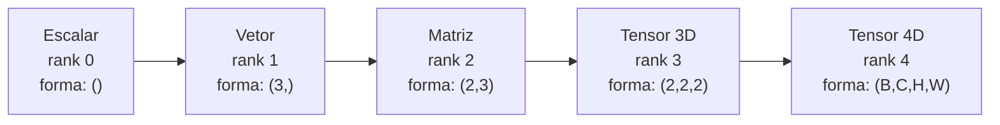
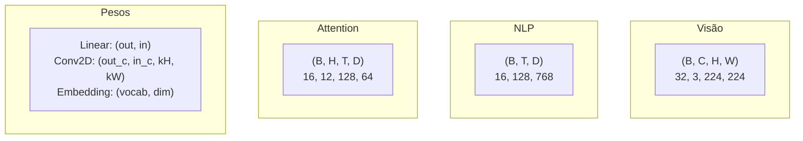
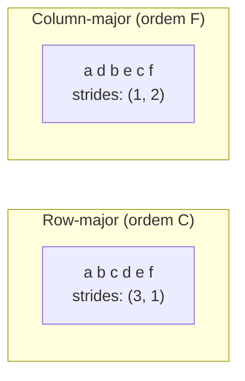
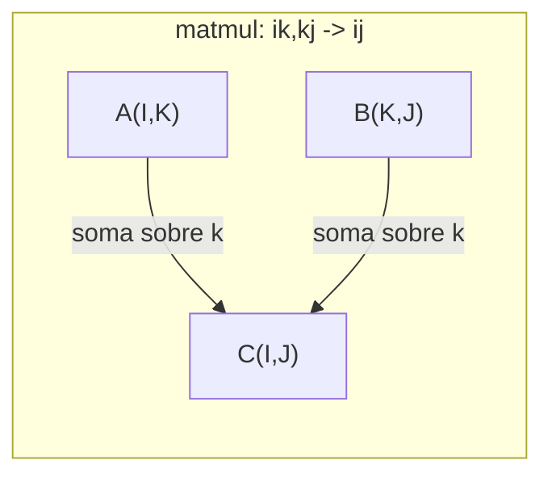

# Operações com Tensores

> Tensores são a linguagem comum entre dados e deep learning. Toda imagem, toda frase, todo gradiente flui por eles.

**Tipo:** Construção
**Idioma:** Python
**Pré-requisitos:** Fase 1, Lições 01 (Intuição de Álgebra Linear), 02 (Vetores, Matrizes & Operações)
**Tempo:** ~90 minutos

## Objetivos de Aprendizado

- Implementar uma classe de tensor com forma, strides, reshape, transpose e operações element-wise do zero
- Aplicar regras de broadcasting para operar em tensores de diferentes formas sem copiar dados
- Escrever expressões einsum para produtos escalares, multiplicações de matriz, produtos externos e operações em lote
- Rastrear as formas exatas dos tensores em cada passo da multi-head attention

## O Problema

Você constrói um transformer. O forward pass parece limpo. Você roda e recebe: `RuntimeError: mat1 and mat2 shapes cannot be multiplied (32x768 and 512x768)`. Você olha as formas. Tenta um transpose. Agora diz `Expected 4D input (got 3D input)`. Você adiciona um unsqueeze. Outra coisa quebra.

Erros de forma são o bug mais comum em código de deep learning. Conceitualmente não são difíceis -- cada operação tem um contrato de forma -- mas se multiplicam rápido. Um transformer tem dezenas de reshapes, transposes e broadcasts encadeados. Um eixo errado e o erro se propaga. Pior, alguns erros de forma não lançam erros. Eles produzem lixo silenciosamente ao longo do eixo errado ou somando sobre o eixo errado.

Matrizes lidam com relações pareadas entre dois conjuntos de coisas. Dados reais não cabem em duas dimensões. Um lote de 32 imagens RGB 224x224 é um tensor 4D: `(32, 3, 224, 224)`. Self-attention com 12 heads também é 4D: `(batch, heads, seq_len, head_dim)`. Você precisa de uma estrutura de dados que generalize para qualquer número de dimensões, com operações que se compostam limpo em todas elas. Essa estrutura é o tensor. Domine suas operações e erros de forma se tornam triviais de debugar.

## O Conceito

### O que é um tensor

Um tensor é um array multidimensional de números com um tipo de dado uniforme. O número de dimensões é o **rank** (ou **ordem**). Cada dimensão é um **eixo**. A **forma** é uma tupla listando o tamanho ao longo de cada eixo.



Total de elementos = produto de todos os tamanhos. Uma forma `(2, 3, 4)` guarda `2 * 3 * 4 = 24` elementos.

### Formas de tensores em deep learning

Diferentes tipos de dados mapeiam para formas de tensor eespecificaçãoíficas por convenção.



PyTorch usa NCHW (canais primeiro). TensorFlow usa por padrão NHWC (canais depois). Layouts incompatíveis causam lentidão silenciosa ou erros.

### Como funciona o layout de memória

Um array 2D na memória é uma sequência 1D de bytes. **Strides** dizem quantos elementos pular para avançar um passo ao longo de cada eixo.



Transpose não move dados. Ele troca os strides, tornando o tensor **não-contíguo** -- os elementos de uma linha não são mais adjacentes na memória.

### Regras de broadcasting

Broadcasting permite operar em tensores de diferentes formas sem copiar dados. Alinhe as formas da direita. Duas dimensões são compatíveis quando são iguais ou uma é 1. Menos dimensões recebem padding com 1s à esquerda.

```
Tensor A:     (8, 1, 6, 1)
Tensor B:        (7, 1, 5)
Padded B:     (1, 7, 1, 5)
Resultado:    (8, 7, 6, 5)
```

### Einsum: a operação universal de tensor

A soma de Einstein rotula cada eixo com uma letra. Eixos na entrada mas não na saída são somados. Eixos em ambos são mantidos.



Padrões-chave: `i,i->` (produto escalar), `i,j->ij` (produto externo), `ii->` (traço), `ij->ji` (transpose), `bij,bjk->bik` (matmul em lote), `bhtd,bhsd->bhts` (pontos de attention).

## Construa

O código está em `code/tensors.py`. Cada passo referencia a implementação lá.

### Passo 1: Armazenamento de tensores e strides

```python
class Tensor:
    def __init__(self, data, shape=None):
        if isinstance(data, (list, tuple)):
            self._data, self._shape = self._flatten_nested(data)
        elif isinstance(data, np.ndarray):
            self._data = data.flatten().tolist()
            self._shape = tuple(data.shape)
        else:
            self._data = [data]
            self._shape = ()

        if shape is not None:
            total = reduce(lambda a, b: a * b, shape, 1)
            if total != len(self._data):
                raise ValueError(
                    f"Cannot reshape {len(self._data)} elements into shape {shape}"
                )
            self._shape = tuple(shape)

        self._strides = self._compute_strides(self._shape)

    @staticmethod
    def _compute_strides(shape):
        if len(shape) == 0:
            return ()
        strides = [1] * len(shape)
        for i in range(len(shape) - 2, -1, -1):
            strides[i] = strides[i + 1] * shape[i + 1]
        return tuple(strides)
```

Para a forma `(3, 4)`, os strides são `(4, 1)` -- pule 4 elementos para avançar uma linha, pule 1 elemento para avançar uma coluna.

### Passo 2: Reshape, squeeze, unsqueeze

```python
t = Tensor(list(range(12)), shape=(2, 6))
r = t.reshape((3, 4))
r = t.reshape((-1, 3))
```

Squeeze remove eixos de tamanho 1. Unsqueeze insere um. Unsqueeze é crucial para broadcasting -- um vetor bias `(D,)` adicionado a um batch `(B, T, D)` precisa de unsqueeze para `(1, 1, D)`.

### Passo 3: Transpose e permute

Transpose troca dois eixos. Permute reordena todos os eixos. É assim que você converte entre NCHW e NHWC.

### Passo 4: Operações element-wise e reduções

```python
a = Tensor([[1, 2], [3, 4]])
b = Tensor([[10, 20], [30, 40]])
c = a + b
d = a * 2
s = a.sum(axis=0)
```

### Passo 5: Broadcasting com NumPy

```python
activations = np.random.randn(4, 3)
bias = np.array([0.1, 0.2, 0.3])
result = activations + bias
```

### Passo 6: Operações Einsum

```python
a = np.array([1.0, 2.0, 3.0])
b = np.array([4.0, 5.0, 6.0])
dot = np.einsum("i,i->", a, b)

A = np.array([[1, 2], [3, 4], [5, 6]], dtype=float)
B = np.array([[7, 8, 9], [10, 11, 12]], dtype=float)
matmul = np.einsum("ik,kj->ij", A, B)
```

### Passo 7: Mecanismo de attention via einsum

```python
B, H, T, D = 2, 4, 8, 16
E = H * D

X = np.random.randn(B, T, E)
W_q = np.random.randn(E, E) * 0.02

Q = np.einsum("bte,ek->btk", X, W_q)
Q = Q.reshape(B, T, H, D).transpose(0, 2, 1, 3)

scores = np.einsum("bhtd,bhsd->bhts", Q, K) / np.sqrt(D)
weights = softmax(scores, axis=-1)
attn_output = np.einsum("bhts,bhsd->bhtd", weights, V)

concat = attn_output.transpose(0, 2, 1, 3).reshape(B, T, E)
output = np.einsum("bte,ek->btk", concat, W_o)
```

## Use

### Do zero vs NumPy

| Operação | Do zero (classe Tensor) | NumPy |
|---|---|---|
| Criar | `Tensor([[1,2],[3,4]])` | `np.array([[1,2],[3,4]])` |
| Reshape | `t.reshape((3,4))` | `a.reshape(3,4)` |
| Transpose | `t.transpose(0,1)` | `a.T` ou `a.transpose(0,1)` |
| Squeeze | `t.squeeze(0)` | `np.squeeze(a, 0)` |
| Sum | `t.sum(axis=0)` | `a.sum(axis=0)` |
| Einsum | N/A | `np.einsum("ij,jk->ik", a, b)` |

### Do zero vs PyTorch

```python
import torch

t = torch.tensor([[1, 2, 3], [4, 5, 6]], dtype=torch.float32)
t.shape
t.stride()
t.is_contiguous()

t.reshape(3, 2)
t.unsqueeze(0)
t.transpose(0, 1)
t.transpose(0, 1).contiguous()

torch.einsum("ik,kj->ij", A, B)
```

PyTorch adiciona autograd, suporte a GPU e kernels BLAS otimizados. A semântica de forma é idêntica. Se você entende a versão do zero, os erros de forma do PyTorch ficam legíveis.

### Cada camada de rede neural como operação de tensor

| Operação | Forma Tensor | Einsum |
|---|---|---|
| Camada Linear | `Y = X @ W.T + b` | `"bd,od->bo"` + bias |
| Attention QKV | `Q = X @ W_q` | `"btd,dh->bth"` |
| Pontos de attention | `Q @ K.T / sqrt(d)` | `"bhtd,bhsd->bhts"` |
| Saída de attention | `softmax(scores) @ V` | `"bhts,bhsd->bhtd"` |
| Batch norm | `(X - mu) / sigma * gamma` | element-wise + broadcast |
| Softmax | `exp(x) / sum(exp(x))` | element-wise + reduction |

## Entregue

Esta lição produz dois prompts reutilizáveis:

1. **`outputs/prompt-tensor-shapes.md`** -- Um prompt sistemático para debugar incompatibilidades de forma de tensor. Inclui tabelas de decisão para cada operação comum.

2. **`outputs/prompt-tensor-debugger.md`** -- Um prompt passo-a-passo para colar em qualquer assistente de IA quando um erro de forma está bloqueando você.

## Exercícios

1. **Fácil -- Reshape ida-e-volta.** Pegue um tensor de forma `(2, 3, 4)`. Reshape para `(6, 4)`, depois para `(24,)`, depois de volta para `(2, 3, 4)`. Verifique que a ordem dos elementos é preservada.

2. **Médio -- Implemente broadcasting.** Estenda a classe `Tensor` com um método `broadcast_to(shape)`. Teste com formas `(3, 1)` e `(1, 4)` produzindo `(3, 4)`.

3. **Difícil -- Construa einsum do zero.** Implemente uma função `einsum(subscripts, *tensors)` que lida com pelo menos: produto escalar, multiplicação de matriz, produto externo e transpose.

4. **Difícil -- Rastreador de formas de attention.** Escreva uma função que recebe `batch_size`, `seq_len`, `embed_dim` e `num_heads` e imprime a forma exata em cada passo da multi-head attention.

## Termos-Chave

| Termo | O que as pessoas dizem | O que realmente significa |
|-------|----------------------|--------------------------|
| Tensor | "Uma matriz mas mais dimensões" | Um array multidimensional com tipo uniforme e forma, strides e operações definidos |
| Rank | "O número de dimensões" | O número de eixos. Uma matriz tem rank 2 |
| Shape | "O tamanho do tensor" | Uma tupla listando o tamanho ao longo de cada eixo |
| Stride | "Como a memória é organizada" | O número de elementos para pular ao avançar uma posição ao longo de cada eixo |
| Broadcasting | "Funciona quando as formas diferem" | Um conjunto estrito de regras: alinhe da direita, dimensões devem ser iguais ou uma deve ser 1 |
| Contiguous | "O tensor é normal" | Elementos armazenados sequencialmente na memória sem gaps |
| Einsum | "Um jeito elegante de escrever matmul" | Uma notação geral que expressa qualquer contração de tensor em uma linha |

## Leitura Adicional

- [Broadcasting do NumPy](https://numpy.org/doc/stable/user/basics.broadcasting.html) -- As regras canônicas com exemplos visuais
- [PyTorch Tensor Views](https://pytorch.org/docs/stable/tensor_view.html) -- Quando views funcionam e quando copiam
- [einops](https://github.com/arogozhnikov/einops) -- Uma biblioteca que torna reshape de tensores legível e seguro
- [The Illustrated Transformer](https://jalammar.github.io/illustrated-transformer/) -- Visualiza as formas de tensores fluindo pela attention
- [Einstein Summation no NumPy](https://numpy.org/doc/stable/reference/generated/numpy.einsum.html) -- Documentação completa do einsum com exemplos
