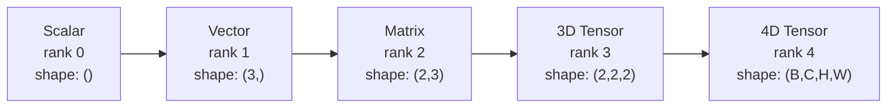
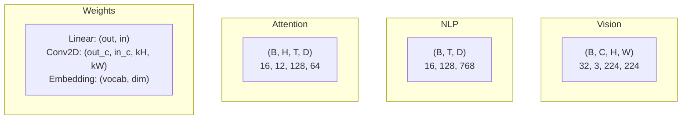
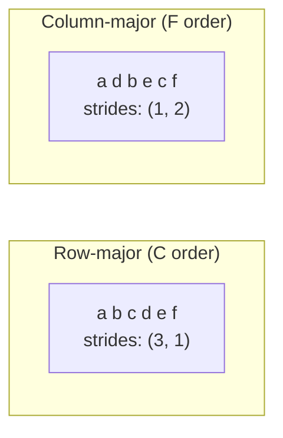
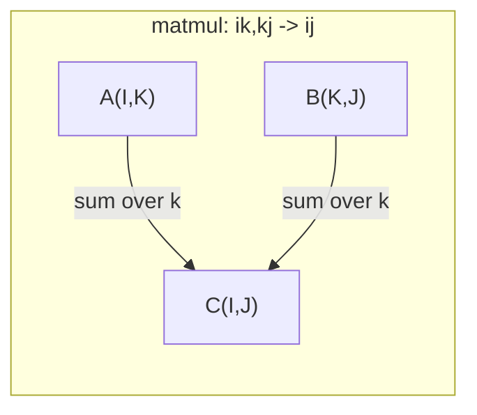

# Tensör İşlemleri

> Tensörler, veriler ile deep learning arasındaki ortak dildir. Her görüntü, her cümle, her gradient onların içinden akıyor.

**Tür:** Yapım
**Dil:** Python
**Önkoşullar:** Aşama 1, Dersler 01 (Doğrusal Cebir Sezgisi), 02 (Vektörler, Matrisler ve İşlemler)
**Süre:** ~90 dakika

## Öğrenme Hedefleri

- Şekil, adımlar, yeniden şekillendirme, devrikleştirme ve öğe bazında işlemleri sıfırdan içeren bir tensör sınıfı uygulayın
- Verileri kopyalamadan farklı şekillerdeki tensörler üzerinde çalışmak için yayın kurallarını uygulayın
- Nokta çarpımları, matris çarpımları, dış çarpımlar ve toplu işlemler için einsum ifadeleri yazın
- Çok kafalı dikkatin her adımında tensör şekillerini tam olarak takip edin

## Sorun

Bir transformer oluşturursunuz. İleri pas temiz görünüyor. Çalıştırırsınız ve şunu alırsınız: `RuntimeError: mat1 and mat2 shapes cannot be multiplied (32x768 and 512x768)`. Şekillere bakıyorsunuz. Bir devrik deneyin. Şimdi `Expected 4D input (got 3D input)` diyor. Bir sıkıştırma ekleyin. Başka bir şey kırılıyor.

Şekil hataları deep learning kodundaki en yaygın hatadır. Kavramsal olarak zor değiller; her operasyonun bir sözleşme şekli var ama hızla çoğalıyorlar. Bir transformer'de birbirine zincirlenmiş düzinelerce yeniden şekillendirme, aktarma ve yayın bulunur. Bir yanlış eksen ve hata art arda gelir. Daha da kötüsü, bazı şekil hataları hiçbir şekilde hataya yol açmaz. Yanlış boyutta yayın yaparak veya yanlış eksende toplayarak sessizce çöp üretirler.

Matrisler iki grup arasındaki ikili ilişkileri yönetir. Gerçek veriler iki boyuta sığmaz. 224x224'teki 32 RGB görüntüden oluşan bir grup bir 4D tensördür: `(32, 3, 224, 224)`. 12 başlı kişisel dikkat de 4B'dir: `(batch, heads, seq_len, head_dim)`. Tüm boyutlarda temiz bir şekilde oluşturulan işlemlerle, herhangi bir sayıda boyuta genelleme yapan bir veri yapısına ihtiyacınız var. Bu yapı tensördür. İşlemlerinde ustalaşın ve şekil hataları kolaylıkla ayıklanabilir hale gelir.

## Konsept

### Tensör nedir

Tensör, tek tip veri türüne sahip çok boyutlu bir sayı dizisidir. Boyutların sayısı **sıra** (veya **sıra**)'dır. Her boyut bir **eksendir**. **Şekil**, her eksen boyunca boyutu listeleyen bir demettir.



Toplam öğeler = her boyuttaki ürün. Bir `(2, 3, 4)` şekli, `2 * 3 * 4 = 24` öğelerini tutar.

### deep learning'deki tensör şekilleri

Farklı veri türleri, kurallara göre belirli tensör şekilleriyle eşleşir.



PyTorch, NCHW'yi (önce kanallar) kullanır. TensorFlow varsayılan olarak NHWC'ye (son kanallar) ayarlıdır. Uyumsuz düzenler sessiz yavaşlamalara veya hatalara neden olur.

### Bellek düzeni nasıl çalışır?

Bellekteki 2 boyutlu bir dizi, 1 boyutlu bir bayt dizisidir. **Adımlar** her eksende bir adım ilerlemek için kaç öğenin atlanması gerektiğini söyler.



Transpoze veriyi taşımaz. Adımları değiştirerek tensörü **bitişik olmayan** hale getirir; bir satırın öğeleri artık bellekte bitişik değildir.

### Yayın kuralları

Yayınlama, verileri kopyalamadan farklı şekillerdeki tensörler üzerinde çalışmanıza olanak tanır. Şekilleri sağdan hizalayın. İki boyut eşit olduğunda veya biri 1 olduğunda uyumludur. Daha az boyut, soldaki 1'lerle doldurulur.

```
Tensor A:     (8, 1, 6, 1)
Tensor B:        (7, 1, 5)
Padded B:     (1, 7, 1, 5)
Result:       (8, 7, 6, 5)
```

### Einsum: evrensel tensör işlemi

Einstein toplamı her ekseni bir harfle etiketler. Girişteki ancak çıkıştaki eksenler toplanır. Her ikisinde de baltalar tutulur.



Anahtar modeller: `i,i->` (nokta çarpım), `i,j->ij` (dış çarpım), `ii->` (izleme), `ij->ji` (transpoze), `bij,bjk->bik` (toplu matmul), `bhtd,bhsd->bhts` (dikkat puanları).

```figure
tensor-broadcast
```

## İnşa Et

Kod `code/tensors.py`'de yaşıyor. Her adım oradaki uygulamaya atıfta bulunur.

### Adım 1: Tensör depolama ve adımlar

Bir tensör, sayıların yanı sıra şekil meta verilerini içeren düz bir listeyi saklar. Adımlar, indeksleme mantığına çok boyutlu indekslerin düz konumlara nasıl eşleneceğini anlatır.

```python
class Tensor:
    def __init__(self, data, shape=None):
        if isinstance(data, (list, tuple)):
            self._data, self._shape = self._flatten_nested(data)
        elif isinstance(data, np.ndarray):
            self._data = data.flatten().tolist()
            self._shape = tuple(data.shape)
        else:
            self._data = [data]
            self._shape = ()

        if shape is not None:
            total = reduce(lambda a, b: a * b, shape, 1)
            if total != len(self._data):
                raise ValueError(
                    f"Cannot reshape {len(self._data)} elements into shape {shape}"
                )
            self._shape = tuple(shape)

        self._strides = self._compute_strides(self._shape)

    @staticmethod
    def _compute_strides(shape):
        if len(shape) == 0:
            return ()
        strides = [1] * len(shape)
        for i in range(len(shape) - 2, -1, -1):
            strides[i] = strides[i + 1] * shape[i + 1]
        return tuple(strides)
```

`(3, 4)` şekli için adımlar `(4, 1)`'dir; bir satır ilerlemek için 4 öğeyi atlayın, bir sütun ilerlemek için 1 öğeyi atlayın.

### Adım 2: Yeniden şekillendirin, sıkın, sıkıştırın

Yeniden şekillendirme, öğe sırasını değiştirmeden şekli değiştirir. Toplam eleman sayısı aynı kalmalıdır. Boyutunu anlamak için bir boyut için `-1` kullanın.

```python
t = Tensor(list(range(12)), shape=(2, 6))
r = t.reshape((3, 4))
r = t.reshape((-1, 3))
```

Sıkıştırma boyutu 1'deki eksenleri çıkarır. Ekleri bir tanesini sıkıştırın. Sıkıştırma işlemi yayın için kritik öneme sahiptir; bir `(B, T, D)` grubuna eklenen `(D,)` öngerilim vektörünün `(1, 1, D)`'ye sıkılması gerekir.

```python
t = Tensor(list(range(6)), shape=(1, 3, 1, 2))
s = t.squeeze()
v = Tensor([1, 2, 3])
u = v.unsqueeze(0)
```

### Adım 3: Transpoze etme ve permütasyon

Transpoze iki ekseni değiştirir. Permute tüm eksenleri yeniden sıralar. NCHW ve NHWC arasında dönüşüm bu şekilde gerçekleşir.

```python
mat = Tensor(list(range(6)), shape=(2, 3))
tr = mat.transpose(0, 1)

t4d = Tensor(list(range(24)), shape=(1, 2, 3, 4))
perm = t4d.permute((0, 2, 3, 1))
```

Devrik veya permütasyondan sonra tensör bellekte bitişik değildir. PyTorch'ta, `view` bitişik olmayan tensörlerde başarısız olur; `reshape` kullanın veya önce `.contiguous()`'yi arayın.

### Adım 4: Öğe bazında işlemler ve indirgemeler

Öğe bazında işlemler (toplama, çarpma, çıkarma) her öğeye bağımsız olarak uygulanır ve şekli korunur. İndirgemeler (toplam, ortalama, maksimum) bir veya daha fazla ekseni daraltır.

```python
a = Tensor([[1, 2], [3, 4]])
b = Tensor([[10, 20], [30, 40]])
c = a + b
d = a * 2
s = a.sum(axis=0)
```

Bir CNN'de küresel ortalama havuzlama: `(B, C, H, W).mean(axis=[2, 3])`, `(B, C)`'yi üretir. NLP'de dizi ortalama havuzlama: `(B, T, D).mean(axis=1)`, `(B, D)`'yi üretir.

### Adım 5: NumPy ile Yayınlama

`tensors.py`'deki `demo_broadcasting_numpy()` işlevi çekirdek kalıpları gösterir.

```python
activations = np.random.randn(4, 3)
bias = np.array([0.1, 0.2, 0.3])
result = activations + bias

images = np.random.randn(2, 3, 4, 4)
scale = np.array([0.5, 1.0, 1.5]).reshape(1, 3, 1, 1)
result = images * scale

a = np.array([1, 2, 3]).reshape(-1, 1)
b = np.array([10, 20, 30, 40]).reshape(1, -1)
outer = a * b
```

Yayın yoluyla ikili mesafe: `(M, 2)`'yi `(M, 1, 2)`'ye ve `(N, 2)`'yi `(1, N, 2)`'ye yeniden şekillendirin, son eksen boyunca çıkarın, karesini alın, toplayın, karekök alın. Sonuç: `(M, N)`.

### Adım 6: Einsum işlemleri

`demo_einsum()` ve `demo_einsum_gallery()` işlevleri her yaygın modelde yol gösterir.

```python
a = np.array([1.0, 2.0, 3.0])
b = np.array([4.0, 5.0, 6.0])
dot = np.einsum("i,i->", a, b)

A = np.array([[1, 2], [3, 4], [5, 6]], dtype=float)
B = np.array([[7, 8, 9], [10, 11, 12]], dtype=float)
matmul = np.einsum("ik,kj->ij", A, B)

batch_A = np.random.randn(4, 3, 5)
batch_B = np.random.randn(4, 5, 2)
batch_mm = np.einsum("bij,bjk->bik", batch_A, batch_B)
```

Bir daralmanın hesaplama maliyeti, tüm endeks boyutlarının (tutulan ve toplanan) çarpımıdır. B=32, I=128, J=64, K=128 olan `bij,bjk->bik` için: `32 * 128 * 64 * 128 = 33,554,432` çarpma toplamaları.

### Adım 7: Einsum aracılığıyla Attention mechanism

`demo_attention_einsum()` işlevi, çok kafalı dikkati uçtan uca uygular.

```python
B, H, T, D = 2, 4, 8, 16
E = H * D

X = np.random.randn(B, T, E)
W_q = np.random.randn(E, E) * 0.02

Q = np.einsum("bte,ek->btk", X, W_q)
Q = Q.reshape(B, T, H, D).transpose(0, 2, 1, 3)

scores = np.einsum("bhtd,bhsd->bhts", Q, K) / np.sqrt(D)
weights = softmax(scores, axis=-1)
attn_output = np.einsum("bhts,bhsd->bhtd", weights, V)

concat = attn_output.transpose(0, 2, 1, 3).reshape(B, T, E)
output = np.einsum("bte,ek->btk", concat, W_o)
```

Her adım bir tensör işlemidir: projeksiyon (einsum yoluyla matmul), kafa bölme (yeniden şekillendirme + devrik), dikkat puanları (einsum yoluyla toplu matmul), ağırlıklı toplam (einsum yoluyla toplu matmul), kafa birleştirme (transpoze + yeniden şekillendirme), çıktı projeksiyonu (einsum yoluyla matmul).

## Kullan onu

### Scratch ve NumPy

| Operasyon | Çizik (Tensör sınıfı) | Sayı |
|---|---|---|
| Oluştur | `Tensor([[1,2],[3,4]])` | `np.array([[1,2],[3,4]])` |
| Yeniden Şekillendir | `t.reshape((3,4))` | `a.reshape(3,4)` |
| Transpoze | `t.transpose(0,1)` | `a.T` veya `a.transpose(0,1)` |
| Sıkıştır | `t.squeeze(0)` | `np.squeeze(a, 0)` |
| Toplam | `t.sum(axis=0)` | `a.sum(axis=0)` |
| Einsum | Yok | `np.einsum("ij,jk->ik", a, b)` |

### Scratch ve PyTorch

```python
import torch

t = torch.tensor([[1, 2, 3], [4, 5, 6]], dtype=torch.float32)
t.shape
t.stride()
t.is_contiguous()

t.reshape(3, 2)
t.unsqueeze(0)
t.transpose(0, 1)
t.transpose(0, 1).contiguous()

torch.einsum("ik,kj->ij", A, B)
```

PyTorch, otomatik yükseltme, GPU desteği ve optimize edilmiş BLAS çekirdekleri ekler. Şekil anlambilimi aynıdır. Karalama versiyonunu anlarsanız PyTorch şekil hataları okunabilir hale gelir.

### Tensör işlemi olarak her neural network katmanı

| Operasyon | Tensör Formu | Einsum |
|---|---|---|
| Doğrusal katman | `Y = X @ W.T + b` | `"bd,od->bo"` + önyargı |
| Dikkat QKV | `Q = X @ W_q` | `"btd,dh->bth"` |
| Dikkat puanları | `Q @ K.T / sqrt(d)` | `"bhtd,bhsd->bhts"` |
| Dikkat çıkışı | `softmax(scores) @ V` | `"bhts,bhsd->bhtd"` |
| Toplu norm | `(X - mu) / sigma * gamma` | öğe bazında + yayın |
| Softmax | `exp(x) / sum(exp(x))` | element bazında + indirgeme |

## Gönderin

Bu ders iki adet yeniden kullanılabilir prompt üretir:

1. **`outputs/prompt-tensor-shapes.md`** -- Tensör şekli uyumsuzluklarında hata ayıklamaya yönelik sistematik bir prompt. Her ortak işlem için (matmul, yayın, cat, Linear, Conv2d, BatchNorm, softmax) karar tablolarını ve düzeltme arama tablosunu içerir.

2. **`outputs/prompt-tensor-debugger.md`** -- Bir şekil hatası sizi engellediğinde herhangi bir yapay zeka asistanına yapıştıracağınız prompt hata ayıklama adım adım. Hata mesajını ve tensör şekillerinizi besleyin, tam düzeltmeyi geri alın.

## Egzersizler

1. **Kolay -- Gidiş dönüşünü yeniden şekillendirin.** `(2, 3, 4)` şeklinde bir tensör alın. `(6, 4)` olarak yeniden şekillendirin, ardından `(24,)` olarak yeniden şekillendirin ve ardından tekrar `(2, 3, 4)` olarak yeniden şekillendirin. Düz verileri yazdırarak öğe sırasının her adımda korunduğunu doğrulayın.

2. **Orta -- Yayınlamayı uygulayın.** `Tensor` sınıfını, boyut 1'in boyutlarını hedef şekle uyacak şekilde genişleten bir `broadcast_to(shape)` yöntemiyle genişletin. Ardından `_elementwise_op`'yi çalıştırmadan önce otomatik olarak yayın yapacak şekilde değiştirin. `(3, 4)` üreten `(3, 1)` ve `(1, 4)` şekilleriyle test edin.

3. **Zor -- Sıfırdan einsum oluşturun.** En azından şunları işleyen temel bir `einsum(subscripts, *tensors)` işlevini uygulayın: nokta çarpım (`i,i->`), matris çarpma (`ij,jk->ik`), dış çarpım (`i,j->ij`) ve devrik (`ij->ji`). Alt simge dizesini ayrıştırın, sözleşmeli dizinleri tanımlayın ve tüm dizin birleşimleri üzerinde döngü yapın. Sonuçlarınızı `np.einsum` ile karşılaştırın.

4. **Zor -- Dikkat şekli izleyici.** `batch_size`, `seq_len`, `embed_dim` ve `num_heads`'yi girdi olarak alan ve çok kafalı dikkatin her adımında tam şekli yazdıran bir fonksiyon yazın: giriş, Q/K/V projeksiyonu, kafa bölünmesi, dikkat puanları, softmax ağırlıkları, ağırlıklı toplam, kafa birleştirme, çıktı projeksiyonu. `demo_attention_einsum()` çıkışına göre doğrulayın.

## Anahtar Terimler

| Dönem | İnsanlar ne diyor | Aslında ne anlama geliyor |
|---|---|---|
| Tensör | "Bir matris ama daha fazla boyut" | Tek tip tip ve tanımlı şekil, adımlar ve işlemlere sahip çok boyutlu bir dizi |
| Sıra | "Boyut sayısı" | Eksen sayısı. Bir matrisin sıralaması 2'dir, sıralaması matris sıralamasına eşit değildir |
| Şekil | "Tensörün boyutu" | Her eksen boyunca boyutu listeleyen bir demet. `(2, 3)`, 2 satır, 3 sütun anlamına gelir |
| Adım | "Bellek nasıl düzenlenir" | Her eksende bir konum ilerlemek için atlanacak öğe sayısı |
| Yayıncılık | "Sadece şekiller farklı olduğunda işe yarar" | Katı kurallar dizisi: Sağdan hizalayın, boyutlar eşit olmalı veya biri 1 |
| Bitişik | "Tensör normal" | Öğeler, boşluk olmadan veya mantıksal düzende yeniden sıralama olmadan bellekte sıralı olarak depolanır |
| Einsum | "Matmul yazmanın süslü bir yolu" | Herhangi bir tensör daralmasını, dış çarpımı, izi veya devriği tek satırda ifade eden genel bir gösterim |
| Görüntüle | "Yeniden şekillendirmeyle aynı" | Aynı bellek arabelleğini paylaşan ancak farklı şekil/adım meta verilerine sahip bir tensör. Bitişik olmayan verilerde başarısız oluyor |
| Kasılma | "Bir dizin üzerinden toplama" | Tensörler arasında paylaşılan bir endeksin çarpılıp toplandığı ve daha düşük dereceli bir sonuç ürettiği genel işlem |
| NCHW / NHWC | "PyTorch ve TensorFlow biçimi" | Görüntü tensörleri için bellek düzeni kuralları. NCHW kanalları uzamsal karartmanın önüne koyar, NHWC ise sonraya koyar |

## Daha Fazla Okuma

- [NumPy Broadcasting](https://numpy.org/doc/stable/user/basics.broadcasting.html) -- Görsel örneklerle standart kurallar
- [PyTorch Tensör Görünümleri](https://pytorch.org/docs/stable/tensor_view.html) -- Görünümler çalıştığında ve kopyalandığında
- [einops](https://github.com/arogozhnikov/einops) -- Tensörün yeniden şekillendirilmesini okunabilir ve güvenli hale getiren bir kitaplık
- [The Illustrated Transformer](https://jalammar.github.io/illustrated-transformer/) -- Dikkatin içinden akan tensör şekillerini görselleştirir
- [NumPy'de Einstein Toplamı](https://numpy.org/doc/stable/reference/generated/numpy.einsum.html) -- Örneklerle birlikte tam einsum dokümantasyonu
