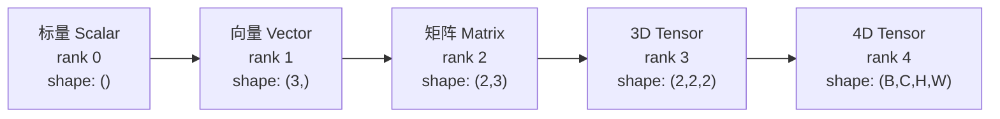
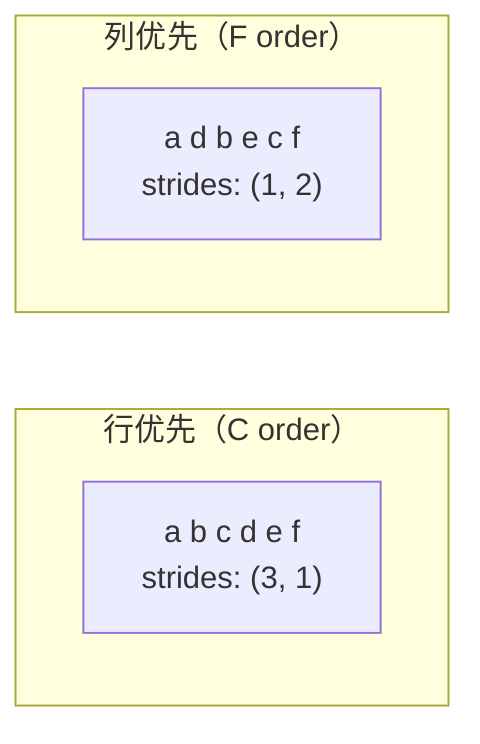
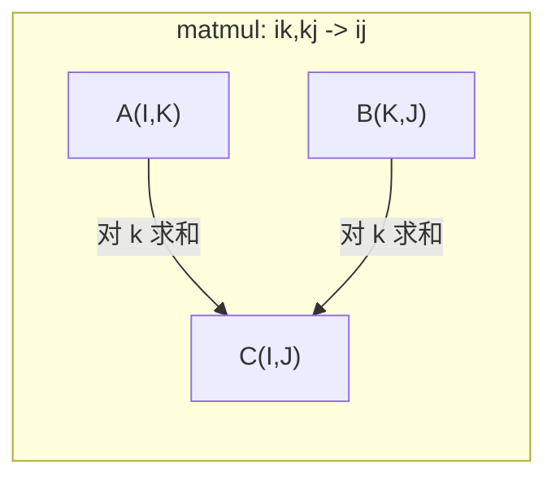

# 张量运算（Tensor Operations）

> 译注：本文译自同目录 [`en.md`](./en.md)。术语遵循仓根 [TRANSLATION_GUIDE.md](../../../../TRANSLATION_GUIDE.md)。

> 张量（tensor）是数据与深度学习之间的通用语言。每一张图、每一句话、每一次 gradient 都从它流过。

**Type:** Build
**Language:** Python
**Prerequisites:** Phase 1, Lessons 01 (Linear Algebra Intuition), 02 (Vectors, Matrices & Operations)
**Time:** ~90 minutes

## 学习目标（Learning Objectives）

- 从零实现一个 tensor 类，包含 shape、strides、reshape、transpose 以及逐元素运算
- 应用 broadcasting（广播）规则，在不复制数据的情况下对不同 shape 的 tensor 做运算
- 写出 einsum 表达式，用于点积、矩阵乘法、外积和批量运算
- 跟踪多头 attention 中每一步的精确 tensor shape

## 问题（The Problem）

你搭了一个 transformer。前向传播看起来很干净。一跑就是：`RuntimeError: mat1 and mat2 shapes cannot be multiplied (32x768 and 512x768)`。你盯着这堆 shape，试着加个 transpose。然后又来：`Expected 4D input (got 3D input)`。你加一个 unsqueeze，又有别的地方崩了。

shape 错误是深度学习代码里最常见的 bug。它在概念上不难——每个运算都有自己的 shape 契约——但它会迅速叠加。一个 transformer 里串着几十个 reshape、transpose 和 broadcast，错一个轴，错误就会层层放大。更糟的是，有些 shape 错误根本不会抛异常，它们悄悄地沿着错误的维度做 broadcast，或者在错误的轴上求和，最后只是默默产出垃圾结果。

矩阵处理两组事物之间的两两关系。但真实数据塞不进二维。一个 32 张 224×224 RGB 图像的 batch 是一个 4D tensor：`(32, 3, 224, 224)`。12 个头的 self-attention 也是 4D：`(batch, heads, seq_len, head_dim)`。你需要一个能扩展到任意维度的数据结构，并且它的运算能在所有维度上干净地组合。这个结构就是 tensor。掌握了它的运算，shape 错误就只是平凡的调试问题。

## 概念（The Concept）

### 什么是 tensor

tensor 是一个具有统一数据类型的多维数字数组。维度的数量叫 **rank**（秩，或 **order**，阶）。每一个维度叫一条 **axis**（轴）。**shape**（形状）是一个元组，列出每条轴上的大小。



总元素数 = 所有维度大小的乘积。shape 为 `(2, 3, 4)` 的 tensor 包含 `2 * 3 * 4 = 24` 个元素。

### 深度学习里的 tensor shape

不同的数据类型按照惯例对应到特定的 tensor shape。


PyTorch 用 NCHW（channels-first，通道在前）。TensorFlow 默认用 NHWC（channels-last，通道在后）。layout 不一致会导致悄悄变慢，或者直接报错。

### 内存布局怎么工作

二维数组在内存里其实是一段一维的字节序列。**Strides**（步长）告诉你沿每条轴前进一步要跳过多少个元素。



transpose 不会搬动数据。它只是交换 strides，让 tensor 变成 **non-contiguous**（非连续）——同一行的元素在内存里不再相邻。

### Broadcasting 规则

broadcasting 让你不用复制数据就能在不同 shape 的 tensor 之间做运算。规则是从右往左对齐 shape。两个维度兼容的条件是：相等，或者其中一个是 1。维度不够的那一侧在左边补 1。

```
Tensor A:     (8, 1, 6, 1)
Tensor B:        (7, 1, 5)
Padded B:     (1, 7, 1, 5)
Result:       (8, 7, 6, 5)
```

### Einsum：通用的 tensor 运算

爱因斯坦求和（Einstein summation，einsum）给每条轴贴一个字母标签。出现在输入但不出现在输出的轴会被求和；同时出现在输入和输出的轴会被保留。



关键模式：`i,i->`（点积）、`i,j->ij`（外积）、`ii->`（迹）、`ij->ji`（转置）、`bij,bjk->bik`（批量矩阵乘）、`bhtd,bhsd->bhts`（attention 分数）。

## 动手实现（Build It）

代码在 `code/tensors.py`。每一步都对应那里的实现。

### Step 1：tensor 存储与 strides

一个 tensor 存一段扁平的数字列表，再加一些 shape 元数据。strides 告诉索引逻辑怎么把多维下标映射到扁平位置。

```python
class Tensor:
    def __init__(self, data, shape=None):
        if isinstance(data, (list, tuple)):
            self._data, self._shape = self._flatten_nested(data)
        elif isinstance(data, np.ndarray):
            self._data = data.flatten().tolist()
            self._shape = tuple(data.shape)
        else:
            self._data = [data]
            self._shape = ()

        if shape is not None:
            total = reduce(lambda a, b: a * b, shape, 1)
            if total != len(self._data):
                raise ValueError(
                    f"Cannot reshape {len(self._data)} elements into shape {shape}"
                )
            self._shape = tuple(shape)

        self._strides = self._compute_strides(self._shape)

    @staticmethod
    def _compute_strides(shape):
        if len(shape) == 0:
            return ()
        strides = [1] * len(shape)
        for i in range(len(shape) - 2, -1, -1):
            strides[i] = strides[i + 1] * shape[i + 1]
        return tuple(strides)
```

shape 为 `(3, 4)` 时，strides 是 `(4, 1)`——往下一行跳要跨 4 个元素，往右一列跳要跨 1 个元素。

### Step 2：reshape、squeeze、unsqueeze

reshape 改变 shape 但不改变元素顺序。元素总数必须保持一致。其中某一维可以传 `-1`，让系统自动推断它的大小。

```python
t = Tensor(list(range(12)), shape=(2, 6))
r = t.reshape((3, 4))
r = t.reshape((-1, 3))
```

squeeze 删除大小为 1 的轴。unsqueeze 插入一条大小为 1 的轴。unsqueeze 对 broadcasting 至关重要——一个偏置向量 `(D,)` 加到 `(B, T, D)` 的 batch 上，需要 unsqueeze 成 `(1, 1, D)` 才行。

```python
t = Tensor(list(range(6)), shape=(1, 3, 1, 2))
s = t.squeeze()
v = Tensor([1, 2, 3])
u = v.unsqueeze(0)
```

### Step 3：transpose 与 permute

transpose 交换两条轴。permute 重新排列所有轴。在 NCHW 与 NHWC 之间相互转换就是用它。

```python
mat = Tensor(list(range(6)), shape=(2, 3))
tr = mat.transpose(0, 1)

t4d = Tensor(list(range(24)), shape=(1, 2, 3, 4))
perm = t4d.permute((0, 2, 3, 1))
```

transpose 或 permute 之后，tensor 在内存里就 non-contiguous 了。在 PyTorch 里，`view` 在 non-contiguous tensor 上会失败——要么用 `reshape`，要么先调 `.contiguous()`。

### Step 4：逐元素运算与归约

逐元素运算（加、乘、减）对每个元素独立作用，保持 shape 不变。归约（sum、mean、max）会折叠一条或多条轴。

```python
a = Tensor([[1, 2], [3, 4]])
b = Tensor([[10, 20], [30, 40]])
c = a + b
d = a * 2
s = a.sum(axis=0)
```

CNN 里的全局平均池化：`(B, C, H, W).mean(axis=[2, 3])` 得到 `(B, C)`。NLP 里的序列均值池化：`(B, T, D).mean(axis=1)` 得到 `(B, D)`。

### Step 5：用 NumPy 做 broadcasting

`tensors.py` 里的 `demo_broadcasting_numpy()` 函数演示了核心套路。

```python
activations = np.random.randn(4, 3)
bias = np.array([0.1, 0.2, 0.3])
result = activations + bias

images = np.random.randn(2, 3, 4, 4)
scale = np.array([0.5, 1.0, 1.5]).reshape(1, 3, 1, 1)
result = images * scale

a = np.array([1, 2, 3]).reshape(-1, 1)
b = np.array([10, 20, 30, 40]).reshape(1, -1)
outer = a * b
```

通过 broadcasting 计算两两距离：把 `(M, 2)` reshape 成 `(M, 1, 2)`，把 `(N, 2)` reshape 成 `(1, N, 2)`，相减、平方、沿最后一条轴求和、开方。结果是 `(M, N)`。

### Step 6：einsum 运算

`demo_einsum()` 和 `demo_einsum_gallery()` 函数把每一种常见模式都走了一遍。

```python
a = np.array([1.0, 2.0, 3.0])
b = np.array([4.0, 5.0, 6.0])
dot = np.einsum("i,i->", a, b)

A = np.array([[1, 2], [3, 4], [5, 6]], dtype=float)
B = np.array([[7, 8, 9], [10, 11, 12]], dtype=float)
matmul = np.einsum("ik,kj->ij", A, B)

batch_A = np.random.randn(4, 3, 5)
batch_B = np.random.randn(4, 5, 2)
batch_mm = np.einsum("bij,bjk->bik", batch_A, batch_B)
```

一次 contraction（缩并）的计算量等于所有下标尺寸（保留的和被求和的）的乘积。`bij,bjk->bik` 在 B=32, I=128, J=64, K=128 时：`32 * 128 * 64 * 128 = 33,554,432` 次乘加。

### Step 7：用 einsum 写 attention

`demo_attention_einsum()` 函数端到端实现了多头 attention。

```python
B, H, T, D = 2, 4, 8, 16
E = H * D

X = np.random.randn(B, T, E)
W_q = np.random.randn(E, E) * 0.02

Q = np.einsum("bte,ek->btk", X, W_q)
Q = Q.reshape(B, T, H, D).transpose(0, 2, 1, 3)

scores = np.einsum("bhtd,bhsd->bhts", Q, K) / np.sqrt(D)
weights = softmax(scores, axis=-1)
attn_output = np.einsum("bhts,bhsd->bhtd", weights, V)

concat = attn_output.transpose(0, 2, 1, 3).reshape(B, T, E)
output = np.einsum("bte,ek->btk", concat, W_o)
```

每一步都是一个 tensor 运算：投影（einsum 形式的 matmul）、拆头（reshape + transpose）、attention 分数（einsum 形式的批量 matmul）、加权求和（einsum 形式的批量 matmul）、合头（transpose + reshape）、输出投影（einsum 形式的 matmul）。

## 用起来（Use It）

### 自己实现 vs NumPy

| 运算 | 自己实现（Tensor 类） | NumPy |
|---|---|---|
| 创建 | `Tensor([[1,2],[3,4]])` | `np.array([[1,2],[3,4]])` |
| Reshape | `t.reshape((3,4))` | `a.reshape(3,4)` |
| Transpose | `t.transpose(0,1)` | `a.T` or `a.transpose(0,1)` |
| Squeeze | `t.squeeze(0)` | `np.squeeze(a, 0)` |
| Sum | `t.sum(axis=0)` | `a.sum(axis=0)` |
| Einsum | N/A | `np.einsum("ij,jk->ik", a, b)` |

### 自己实现 vs PyTorch

```python
import torch

t = torch.tensor([[1, 2, 3], [4, 5, 6]], dtype=torch.float32)
t.shape
t.stride()
t.is_contiguous()

t.reshape(3, 2)
t.unsqueeze(0)
t.transpose(0, 1)
t.transpose(0, 1).contiguous()

torch.einsum("ik,kj->ij", A, B)
```

PyTorch 额外提供了 autograd、GPU 支持以及优化过的 BLAS kernel。但 shape 语义是完全一致的。如果你看懂了从零实现的版本，PyTorch 的 shape 错误就变得可读了。

### 把神经网络的每一层都看成一次 tensor 运算

| 运算 | tensor 形式 | Einsum |
|---|---|---|
| Linear 层 | `Y = X @ W.T + b` | `"bd,od->bo"` + bias |
| Attention QKV | `Q = X @ W_q` | `"btd,dh->bth"` |
| Attention 分数 | `Q @ K.T / sqrt(d)` | `"bhtd,bhsd->bhts"` |
| Attention 输出 | `softmax(scores) @ V` | `"bhts,bhsd->bhtd"` |
| Batch norm | `(X - mu) / sigma * gamma` | 逐元素 + broadcast |
| Softmax | `exp(x) / sum(exp(x))` | 逐元素 + 归约 |

## 上线部署（Ship It）

这一课会沉淀两个可复用的 prompt：

1. **`outputs/prompt-tensor-shapes.md`** —— 一个用于排查 tensor shape 不匹配的系统化 prompt。包含针对每一种常见运算（matmul、broadcast、cat、Linear、Conv2d、BatchNorm、softmax）的决策表，以及一张修复对照表。

2. **`outputs/prompt-tensor-debugger.md`** —— 一个一步一步的调试 prompt，遇到 shape 错误卡住时直接粘到任意 AI 助手里。把错误信息和你的 tensor shape 喂进去，拿回来精确的修复方案。

## 练习（Exercises）

1. **简单 —— Reshape 来回走一遍。** 拿一个 shape 为 `(2, 3, 4)` 的 tensor，reshape 成 `(6, 4)`，再 reshape 成 `(24,)`，然后 reshape 回 `(2, 3, 4)`。每一步都打印扁平数据，验证元素顺序保持不变。

2. **中等 —— 实现 broadcasting。** 给 `Tensor` 类加一个 `broadcast_to(shape)` 方法，把大小为 1 的维度扩展到目标 shape。然后改造 `_elementwise_op`，让它在做运算前自动 broadcast。用 `(3, 1)` 和 `(1, 4)` 测试，期望结果 shape 为 `(3, 4)`。

3. **困难 —— 从零实现 einsum。** 实现一个基本的 `einsum(subscripts, *tensors)` 函数，至少要支持：点积（`i,i->`）、矩阵乘法（`ij,jk->ik`）、外积（`i,j->ij`）和转置（`ij->ji`）。解析下标字符串，识别要 contract 的下标，对所有下标组合做循环。把结果和 `np.einsum` 对比。

4. **困难 —— attention shape 跟踪器。** 写一个函数，接收 `batch_size`、`seq_len`、`embed_dim`、`num_heads` 作为输入，打印多头 attention 每一步的精确 shape：输入、Q/K/V 投影、拆头、attention 分数、softmax 权重、加权求和、合头、输出投影。和 `demo_attention_einsum()` 的输出对照验证。

## 关键术语（Key Terms）

| 术语 | 大家口头怎么说 | 实际上是什么 |
|---|---|---|
| Tensor | "矩阵但维度更多" | 一个具有统一类型，并且定义了 shape、strides 和运算的多维数组 |
| Rank | "维度数" | 轴的数量。一个矩阵的 rank 是 2，并不等于它的矩阵秩 |
| Shape | "tensor 的大小" | 一个元组，列出每条轴的大小。`(2, 3)` 表示 2 行 3 列 |
| Stride | "内存怎么排的" | 沿某条轴前进一格需要跳过的元素个数 |
| Broadcasting | "shape 不一样也能跑" | 一套严格规则：从右对齐，对应维度要么相等，要么其中之一为 1 |
| Contiguous | "tensor 是正常的" | 元素按逻辑布局顺序连续存储在内存里，没有间隔也没有重排 |
| Einsum | "写 matmul 的花哨写法" | 一种通用记法，一行就能表达任意 tensor 缩并、外积、迹或转置 |
| View | "和 reshape 一样" | 一个共享同一段内存缓冲、但 shape/stride 元数据不同的 tensor。non-contiguous 数据会失败 |
| Contraction | "对某个下标求和" | 通用运算：把两 tensor 之间共享的下标相乘并求和，得到 rank 更低的结果 |
| NCHW / NHWC | "PyTorch vs TensorFlow 的格式" | 图像 tensor 的内存布局惯例。NCHW 把通道放在空间维之前，NHWC 放在之后 |

## 延伸阅读（Further Reading）

- [NumPy Broadcasting](https://numpy.org/doc/stable/user/basics.broadcasting.html) —— 官方规则，配可视化示例
- [PyTorch Tensor Views](https://pytorch.org/docs/stable/tensor_view.html) —— view 何时有效、何时会复制
- [einops](https://github.com/arogozhnikov/einops) —— 让 tensor reshape 既可读又安全的库
- [The Illustrated Transformer](https://jalammar.github.io/illustrated-transformer/) —— 把 attention 中流动的 tensor shape 可视化
- [Einstein Summation in NumPy](https://numpy.org/doc/stable/reference/generated/numpy.einsum.html) —— 完整的 einsum 文档与示例
