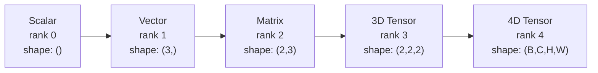
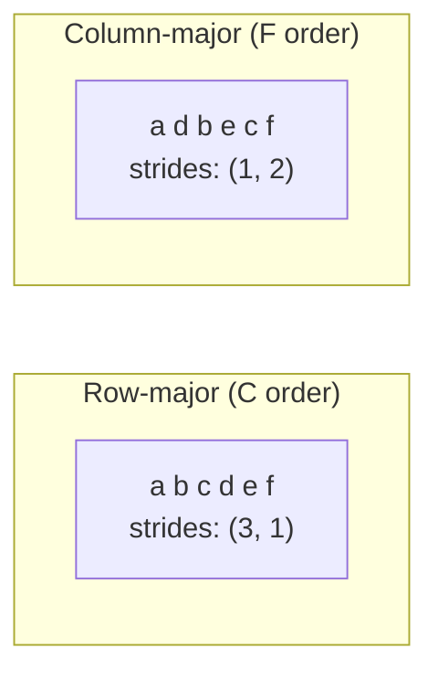
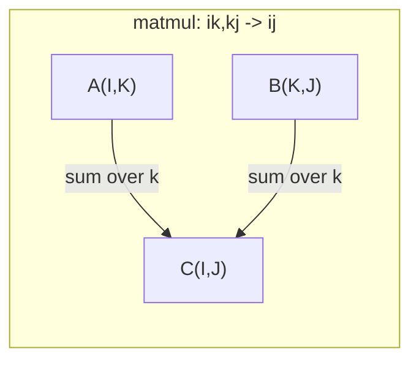

# Tensor Operations

> 张量是数据和深度学习之间的共同语言。每个图像、每个句子、每个梯度都流经它们。

** 类型：** 构建
** 语言：** Python
** 先决条件：** 第1阶段，课程01（线性代数直觉）、02（载体、矩阵和运算）
** 时间：** ~90分钟

## Learning Objectives

- 从头开始实施具有形状、步进、重塑、转置和元素级操作的张量类
- 应用广播规则对不同形状的张量进行操作，而无需复制数据
- 编写点积、矩阵相乘、外积和批处理操作的einsum公式
- 通过多头注意力的每一步追踪精确的张量形状

## The Problem

你建造了一个Transformer。向前传球看起来很干净。运行它并得到：“RuntimeHelp：mat 1和mat 2形状无法相乘（32 x768和512 x768）”。你盯着形状。你尝试转置。现在它说“预期4D输入（已获得3D输入）”。你添加一个解压缩。其他东西坏了。

形状错误是深度学习代码中最常见的错误。它们在概念上并不难--每个操作都有一个形状合同--但它们繁殖得很快。Transformer将数十个重塑、调换和广播链接在一起。一个错误的轴，错误就会级联。更糟糕的是，一些形状错误根本不会产生错误。他们通过沿着错误的维度广播或在错误的轴上进行相加来默默地产生垃圾。

矩阵处理两组事物之间的成对关系。真实数据不适合两个维度。一批32个224 x224的GB图像是4D张量：“（32，3，224，224）”。具有12个头的自我注意力也是4D的：“（batch，heads，seq_len，head_dim）”。您需要一个可推广到任意数量的维度的数据结构，并具有跨越所有维度清晰地组合的操作。该结构就是张量。掌握其操作和形状错误变得微不足道。

## The Concept

### What a tensor is

张量是具有统一数据类型的多维数字数组。维度的数量是 ** 等级 **（或 ** 顺序 **）。每个维度都是一个 ** 轴 **。**shape** 是一个数组，列出了沿着每个轴的大小。



总元素=所有尺寸的产品。形状“（2，3，4）”包含“2 * 3 * 4 = 24”元素。

### Tensor shapes in deep learning

不同的数据类型按照惯例映射到特定的张量形状。


PyTorch使用NCHW（频道优先）。TensorFlow默认为NHWC（channels-last）。布局不匹配会导致无声减慢或错误。

### How memory layout works

内存中的2D数组是1D字节序列。**Strides** 告诉您要跳过多少个元素才能沿着每个轴移动一步。



转置不会移动数据。它交换了步进，使张量 ** 不连续 **-行的元素在内存中不再相邻。

### Broadcasting rules

广播允许您操作不同形状的张量，而无需复制数据。从右侧对齐形状。当两个维度相等或一为1时，它们是兼容的。左侧用1填充更少的维度。

```
Tensor A:     (8, 1, 6, 1)
Tensor B:        (7, 1, 5)
Padded B:     (1, 7, 1, 5)
Result:       (8, 7, 6, 5)
```

### Einsum: the universal tensor operation

爱因斯坦总和用一个字母标记每个轴。输入中的轴而不是输出中的轴被相加。两者的轴均保留。



关键模式：' i，i->'（点积）、' i，j-'（外积）、' ii-'（转置）、' bij，bjk-' bik '（批量matmul）、'、'、'、'（注意力分数）。

## Build It

该代码位于“code/tensors.py”中。每个步骤都引用那里的实现。

### Step 1: Tensor storage and strides

张量存储数字和形状元数据的平面列表。步进告诉索引逻辑如何将多维索引映射到平坦位置。

```python
class Tensor:
    def __init__(self, data, shape=None):
        if isinstance(data, (list, tuple)):
            self._data, self._shape = self._flatten_nested(data)
        elif isinstance(data, np.ndarray):
            self._data = data.flatten().tolist()
            self._shape = tuple(data.shape)
        else:
            self._data = [data]
            self._shape = ()

        if shape is not None:
            total = reduce(lambda a, b: a * b, shape, 1)
            if total != len(self._data):
                raise ValueError(
                    f"Cannot reshape {len(self._data)} elements into shape {shape}"
                )
            self._shape = tuple(shape)

        self._strides = self._compute_strides(self._shape)

    @staticmethod
    def _compute_strides(shape):
        if len(shape) == 0:
            return ()
        strides = [1] * len(shape)
        for i in range(len(shape) - 2, -1, -1):
            strides[i] = strides[i + 1] * shape[i + 1]
        return tuple(strides)
```

对于形状“（3，4）”，步进是“（4，1）”--跳过4个元素以前进一行，跳过1个元素以前进一列。

### Step 2: Reshape, squeeze, unsqueeze

重塑会在不改变元素顺序的情况下更改形状。元素总数必须保持不变。对一维使用“-1”来推断其大小。

```python
t = Tensor(list(range(12)), shape=(2, 6))
r = t.reshape((3, 4))
r = t.reshape((-1, 3))
```

挤压将删除大小为1的轴。不挤压插入物1。解压缩对于广播是关键的--加到一个批`（B，T，D）`上的偏置向量`（D，）`需要解压缩为`（1，1，D）`。

```python
t = Tensor(list(range(6)), shape=(1, 3, 1, 2))
s = t.squeeze()
v = Tensor([1, 2, 3])
u = v.unsqueeze(0)
```

### Step 3: Transpose and permute

调换交换两个轴。Permute重新排序所有轴。这就是NCHW和NHWC之间转换的方式。

```python
mat = Tensor(list(range(6)), shape=(2, 3))
tr = mat.transpose(0, 1)

t4d = Tensor(list(range(24)), shape=(1, 2, 3, 4))
perm = t4d.permute((0, 2, 3, 1))
```

转置或置换后，张量在内存中是非连续的。在PyTorch中，“view”在非连续张量上失败--首先使用“reform”或调用“. continuous（）”。

### Step 4: Element-wise operations and reductions

元素级操作（加、乘、减）独立应用于每个元素并保留形状。减少（总和、平均值、最大值）折叠一个或多个轴。

```python
a = Tensor([[1, 2], [3, 4]])
b = Tensor([[10, 20], [30, 40]])
c = a + b
d = a * 2
s = a.sum(axis=0)
```

CNN中的全球平均池：“（B，C，H，W）.mean（轴=[2，3]）'产生“（B，C）'。NLP中的序列平均值合并：“（B，T，D）.mean（轴=1）”产生“（B，D）”。

### Step 5: Broadcasting with NumPy

' tensors.py '中的' demo_broadcasting_numpy（）'函数显示了核心模式。

```python
activations = np.random.randn(4, 3)
bias = np.array([0.1, 0.2, 0.3])
result = activations + bias

images = np.random.randn(2, 3, 4, 4)
scale = np.array([0.5, 1.0, 1.5]).reshape(1, 3, 1, 1)
result = images * scale

a = np.array([1, 2, 3]).reshape(-1, 1)
b = np.array([10, 20, 30, 40]).reshape(1, -1)
outer = a * b
```

通过广播的成对距离：将“（M，2）”重塑为“（M，1，2）”，将“（N，2）”重塑为“（1，N，2）”，减去、平方、沿着最后一个轴相加，取平方根。结果：“（M，N）”。

### Step 6: Einsum operations

“demo_einsum（）”和“demo_einsum_gallery（）”函数将贯穿所有常见模式。

```python
a = np.array([1.0, 2.0, 3.0])
b = np.array([4.0, 5.0, 6.0])
dot = np.einsum("i,i->", a, b)

A = np.array([[1, 2], [3, 4], [5, 6]], dtype=float)
B = np.array([[7, 8, 9], [10, 11, 12]], dtype=float)
matmul = np.einsum("ik,kj->ij", A, B)

batch_A = np.random.randn(4, 3, 5)
batch_B = np.random.randn(4, 5, 2)
batch_mm = np.einsum("bij,bjk->bik", batch_A, batch_B)
```

收缩的计算成本是所有指数大小（保留和总和）的产物。对于B=32、I=128、J=64、K=128的“bij，bjk->bik”：“32 * 128 * 64 * 128 = 33，554，432”乘加。

### Step 7: Attention mechanism via einsum

' demo_attention_einsum（）'功能实现端到端的多头关注。

```python
B, H, T, D = 2, 4, 8, 16
E = H * D

X = np.random.randn(B, T, E)
W_q = np.random.randn(E, E) * 0.02

Q = np.einsum("bte,ek->btk", X, W_q)
Q = Q.reshape(B, T, H, D).transpose(0, 2, 1, 3)

scores = np.einsum("bhtd,bhsd->bhts", Q, K) / np.sqrt(D)
weights = softmax(scores, axis=-1)
attn_output = np.einsum("bhts,bhsd->bhtd", weights, V)

concat = attn_output.transpose(0, 2, 1, 3).reshape(B, T, E)
output = np.einsum("bte,ek->btk", concat, W_o)
```

每一步都是张量操作：投影（matmul通过einsum）、头部分裂（重塑+转置）、注意力分数（批量matmul通过einsum）、加权和（批量matmul通过einsum）、头部合并（转置+重塑）、输出投影（matmul通过einsum）。

## Use It

### Scratch vs NumPy

| 操作 | 划痕（张量类） | NumPy |
|---|---|---|
| 创建 | '张量（[[1，2]，[3，4]）' | ' NP.数组（[[1，2]，[3，4]）' |
| 重塑 | ' t. reform（3，4）' | ' a.重塑（3，4）' |
| 转置 | ' t.转置（0，1）' | ' a.T '或' a.转置（0，1）' |
| 挤压 | ' t.挤（0）' | ' NP.挤（a，0）' |
| 总和 | ' t.sum（轴=0）' | `a.sum（axis=0）` |
| 恩瑟姆 | N/A | ' NP.einsum（“aj，jk->ik”，a，b）' |

### Scratch vs PyTorch

```python
import torch

t = torch.tensor([[1, 2, 3], [4, 5, 6]], dtype=torch.float32)
t.shape
t.stride()
t.is_contiguous()

t.reshape(3, 2)
t.unsqueeze(0)
t.transpose(0, 1)
t.transpose(0, 1).contiguous()

torch.einsum("ik,kj->ij", A, B)
```

PyTorch添加了自动渐变、图形处理器支持和优化的BLAS内核。形状语义相同。如果您了解了草稿版本，PyTorch形状错误就会变得可读。

### Every neural network layer as a tensor operation

| 操作 | 张量形式 | 恩瑟姆 |
|---|---|---|
| 线性层 | ' Y = X @ W.T + b ' | ' bd，od->bo '+偏见 |
| 注意QKV | ' Q = X @ W_q ' | '' btd，dh-' bth ' |
| 注意力分数 | ' Q @ K.T / SQRT（d）' | '' bhtd ' bhts ' |
| 注意力输出 | ' softmax（分数）@ V ' | '' bhts，bhsdd ' |
| Batch norm | '（X -μ）/西格玛 * 伽玛' | 元素+广播 |
| Softmax | `exp（x）/ sum（exp（x））` | 元素+还原 |

## Ship It

本课生成两个可重复使用的提示：

1. **'输出/prompt-tensor-shapes.md '**--调试张量形状不匹配的系统提示。包括每个常见操作（matmul、broadcast、cat、Linear、Conv 2d、BatchNorm、softmax）的决策表和修复查找表。

2. **'输出/prompt-tensor-debugger.md '**--当形状错误阻止您时，您可以粘贴到任何AI助手中的分步调试提示。向它提供错误消息和张量形状，获取确切的修复。

## Exercises

1. ** 简单--重塑往返。**取形状为“（2，3，4）”的张量。将其重塑为“（6，4）”，然后重塑为“（24，）”，然后回到“（2，3，4）”。通过打印平面数据验证每个步骤是否保留了元素顺序。

2. ** 中--实施广播。**使用“broadcast_to（shape）”方法扩展“Tensor”类，该方法扩展大小为1的维度以匹配目标形状。然后修改'_elementwise_op '以自动广播再操作。用形状“（3，1）”和“（1，4）”进行测试，产生“（3，4）”。

3. ** 很难--从头开始构建einsum。**实现一个基本的“einsum（substrates，*tensors）”函数，该函数至少处理：点积（“i，i->'）、矩阵乘（“aj，jk->ik '）、外积（' i，j-'）和转置（'）。解析脚注字符串、识别收缩索引并循环所有索引组合。将您的结果与“NP.einsum”进行比较。

4. ** 难--注意形状跟踪器。**编写一个以“batch_size”、“seq_len”、“embed_dim”和“num_heads”作为输入的函数，并在多头注意力的每一步打印精确形状：输入、Q/K/V投影、头部分裂、注意力分数、softmax权重、加权和、头部合并、输出投影。根据“demo_attention_einsum（）”输出进行验证。

## Key Terms

| Term | 别人怎么说 | 它实际上意味着什么 |
|---|---|---|
| 张量 | “一个矩阵，但更多维度” | 具有统一类型和定义形状、步伐和操作的多维阵列 |
| 秩 | “维度的数量” | 轴的数量。矩阵的等级为2，等级不等于其矩阵的等级 |
| 形状 | “张量的大小” | 列出每个轴上的大小的二元组。“（2，3）”意味着2行3列 |
| 步幅 | “记忆是如何布局的” | 沿着每个轴前进一个位置需要跳过的元素数量 |
| 广播 | “当形状不同时，它才有效” | 一套严格的规则：从右对齐，维度必须相等或1必须为1 |
| 连续 | “张量正常” | 元素顺序存储在内存中，没有间隙或与逻辑布局重新排序 |
| 恩瑟姆 | “matmul的一种奇特方式” | 一种通用符号，在一行中表达任何张量压缩、外积、痕迹或转置 |
| 视图 | “与重塑相同” | 共享相同内存缓冲区但具有不同形状/跨度元数据的张量。不连续数据失败 |
| 收缩 | “对指数进行汇总” | 将张量之间的共享索引相乘并相加的一般操作，产生较低等级的结果 |
| NCHW / NHWC | “PyTorch与TensorFlow格式” | 图像张量的内存布局约定。NCHW将通道置于空间昏暗之上，NHWC将其置于空间昏暗之上 |

## Further Reading

- [NumPy Broadcasting]（https：//numpy.org/doc/stable/user/basics.broadcasting.html）--带有视觉示例的规范规则
- [PyTorch张量视图]（https：//pytorch.org/docs/stable/tensor_view.html）--视图何时起作用以及何时复制
- [einops]（https：//github.com/arogozhnikov/einops）--使张量重塑可读且安全的库
- [The Illustrated Transformer]（https：//jalammar.github.io/illustred-transformer/）--可视化流经注意力的张量形状
- [NumPy中的爱因斯坦总和]（https：//numpy.org/doc/stable/reference/generated/numpy.einsum.html）--包含示例的完整einsum文档
