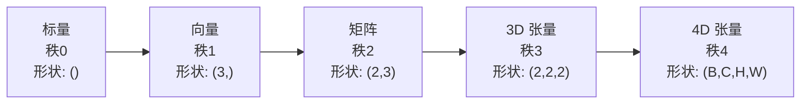
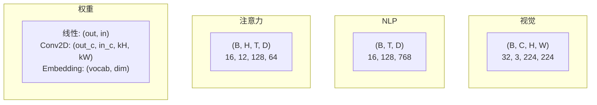
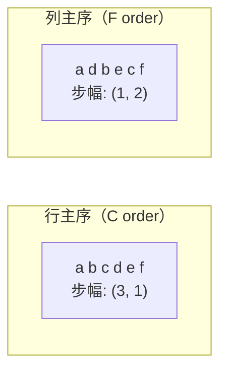
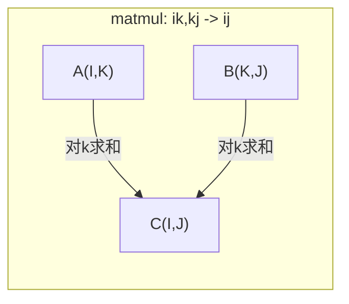

# 张量运算

> 张量是数据与深度学习之间的通用语言。每一张图像、每一个句子、每一道梯度都流经它们。

**类型：** 构建  
**语言：** Python  
**前置条件：** 阶段 1，课程 01（线性代数直觉）、02（向量、矩阵与运算）  
**时长：** 约 90 分钟  

## 学习目标

- 从头实现一个张量类，包含形状（shape）、步幅（strides）、重塑（reshape）、转置（transpose）和逐元素运算
- 应用广播（broadcasting）规则，在不复制数据的情况下对不同形状的张量进行运算
- 编写 einsum 表达式，用于点积、矩阵乘法、外积和批量运算
- 跟踪多头注意力中每一步的确切张量形状

## 问题

你构建了一个 Transformer。前向传播看起来没问题。运行后得到：`RuntimeError: mat1 and mat2 shapes cannot be multiplied (32x768 and 512x768)`。你盯着形状看。你尝试转置。现在它说 `Expected 4D input (got 3D input)`。你添加了一个 unsqueeze。又出别的错了。

形状错误是深度学习代码中最常见的 bug。概念上并不难——每个运算都有一个形状契约——但它们会迅速累积。一个 Transformer 中有几十个重塑、转置和广播操作串联在一起。一个轴错了，错误就会级联放大。更糟糕的是，某些形状错误根本不会抛出异常。它们会沿着错误的维度进行广播或在错误的轴上求和，然后静默地生成垃圾数据。

矩阵处理的是两套事物之间的成对关系。但真实数据并不局限于二维。一个包含 32 张 224x224 的 RGB 图像批次是一个 4D 张量：`(32, 3, 224, 224)`。具有 12 个头的自注意力也是 4D：`(batch, heads, seq_len, head_dim)`。你需要一种数据结构，可以推广到任意数量的维度，并且运算能在所有维度上干净地组合。这种结构就是张量。掌握它的运算后，形状错误就变得容易调试了。

## 概念

### 张量是什么

张量是一个具有统一数据类型的多维数值数组。维度的数量称为**秩（rank）**（或**阶（order）**）。每个维度是一条**轴（axis）**。**形状（shape）** 是一个元组，列出了沿每个轴的大小。



总元素数 = 所有大小的乘积。形状 `(2, 3, 4)` 包含 `2 * 3 * 4 = 24` 个元素。

### 深度学习中的张量形状

不同类型的数据按惯例映射到特定的张量形状。



PyTorch 使用 NCHW（通道在前）。TensorFlow 默认使用 NHWC（通道在后）。布局不匹配会导致静默的性能下降或错误。

### 内存布局如何工作

内存中的二维数组实际上是一个一维的字节序列。**步幅（strides）** 告诉你沿每个轴移动一步需要跳过多少个元素。



转置不会移动数据。它会交换步幅，使得张量变为**不连续（non-contiguous）**——一行中的元素在内存中不再相邻。

### 广播规则

广播允许你对不同形状的张量进行运算而无需复制数据。从右侧对齐形状。当两个维度相等或其中一个为 1 时，它们是兼容的。维度较少的张量会在左侧用 1 进行填充。

```
张量 A:     (8, 1, 6, 1)
张量 B:        (7, 1, 5)
填充后的 B: (1, 7, 1, 5)
结果:       (8, 7, 6, 5)
```

### Einsum：通用张量运算

爱因斯坦求和约定（Einstein summation）用字母标记每个轴。出现在输入但不出现在输出的轴会被求和。同时出现在输入和输出中的轴会被保留。



关键模式：`i,i->`（点积）、`i,j->ij`（外积）、`ii->`（迹）、`ij->ji`（转置）、`bij,bjk->bik`（批量矩阵乘法）、`bhtd,bhsd->bhts`（注意力分数）。

## 动手构建

代码位于 `code/tensors.py`。每一步都会引用其中的实现。

### 第一步：张量存储与步幅

张量存储一个扁平的数字列表，并附带形状元数据。步幅告诉索引逻辑如何将多维索引映射到扁平位置。

```python
class Tensor:
    def __init__(self, data, shape=None):
        if isinstance(data, (list, tuple)):
            self._data, self._shape = self._flatten_nested(data)
        elif isinstance(data, np.ndarray):
            self._data = data.flatten().tolist()
            self._shape = tuple(data.shape)
        else:
            self._data = [data]
            self._shape = ()

        if shape is not None:
            total = reduce(lambda a, b: a * b, shape, 1)
            if total != len(self._data):
                raise ValueError(
                    f"不能将 {len(self._data)} 个元素重塑为形状 {shape}"
                )
            self._shape = tuple(shape)

        self._strides = self._compute_strides(self._shape)

    @staticmethod
    def _compute_strides(shape):
        if len(shape) == 0:
            return ()
        strides = [1] * len(shape)
        for i in range(len(shape) - 2, -1, -1):
            strides[i] = strides[i + 1] * shape[i + 1]
        return tuple(strides)
```

对于形状 `(3, 4)`，步幅为 `(4, 1)`——前进一行跳过 4 个元素，前进一列跳过 1 个元素。

### 第二步：Reshape、Squeeze、Unsqueeze

重塑（Reshape）改变形状而不改变元素顺序。元素总数必须保持不变。对一个维度使用 `-1` 可以推断其大小。

```python
t = Tensor(list(range(12)), shape=(2, 6))
r = t.reshape((3, 4))
r = t.reshape((-1, 3))
```

Squeeze 移除大小为 1 的轴。Unsqueeze 插入一个大小为 1 的轴。Unsqueeze 对于广播至关重要——一个偏置向量 `(D,)` 要加到批次 `(B, T, D)` 上时，需要 unsqueeze 为 `(1, 1, D)`。

```python
t = Tensor(list(range(6)), shape=(1, 3, 1, 2))
s = t.squeeze()
v = Tensor([1, 2, 3])
u = v.unsqueeze(0)
```

### 第三步：Transpose 与 Permute

转置（Transpose）交换两个轴。Permute 重新排列所有轴。这就是在 NCHW 和 NHWC 之间进行转换的方法。

```python
mat = Tensor(list(range(6)), shape=(2, 3))
tr = mat.transpose(0, 1)

t4d = Tensor(list(range(24)), shape=(1, 2, 3, 4))
perm = t4d.permute((0, 2, 3, 1))
```

转置或 permute 之后，张量在内存中是不连续的。在 PyTorch 中，`view` 在不连续张量上会失败——应该使用 `reshape` 或先调用 `.contiguous()`。

### 第四步：逐元素运算与规约

逐元素运算（加法、乘法、减法）独立地应用于每个元素，并保持形状不变。规约（约减，reduction）运算（求和、均值、最大值）会折叠一个或多个轴。

```python
a = Tensor([[1, 2], [3, 4]])
b = Tensor([[10, 20], [30, 40]])
c = a + b
d = a * 2
s = a.sum(axis=0)
```

CNN 中的全局平均池化：`(B, C, H, W).mean(axis=[2, 3])` 得到 `(B, C)`。NLP 中的序列平均池化：`(B, T, D).mean(axis=1)` 得到 `(B, D)`。

### 第五步：使用 NumPy 进行广播

`tensors.py` 中的 `demo_broadcasting_numpy()` 函数展示了核心模式。

```python
activations = np.random.randn(4, 3)
bias = np.array([0.1, 0.2, 0.3])
result = activations + bias

images = np.random.randn(2, 3, 4, 4)
scale = np.array([0.5, 1.0, 1.5]).reshape(1, 3, 1, 1)
result = images * scale

a = np.array([1, 2, 3]).reshape(-1, 1)
b = np.array([10, 20, 30, 40]).reshape(1, -1)
outer = a * b
```

通过广播计算成对距离：将 `(M, 2)` 重塑为 `(M, 1, 2)`，将 `(N, 2)` 重塑为 `(1, N, 2)`，相减，平方，沿最后一轴求和，取平方根。结果：`(M, N)`。

### 第六步：Einsum 运算

`demo_einsum()` 和 `demo_einsum_gallery()` 函数遍历了所有常见模式。

```python
a = np.array([1.0, 2.0, 3.0])
b = np.array([4.0, 5.0, 6.0])
dot = np.einsum("i,i->", a, b)

A = np.array([[1, 2], [3, 4], [5, 6]], dtype=float)
B = np.array([[7, 8, 9], [10, 11, 12]], dtype=float)
matmul = np.einsum("ik,kj->ij", A, B)

batch_A = np.random.randn(4, 3, 5)
batch_B = np.random.randn(4, 5, 2)
batch_mm = np.einsum("bij,bjk->bik", batch_A, batch_B)
```

约减（contraction）的计算开销是所有索引大小（保留的和求和的）的乘积。对于 `bij,bjk->bik`，其中 B=32, I=128, J=64, K=128：`32 * 128 * 64 * 128 = 33,554,432` 次乘加运算。

### 第七步：通过 Einsum 实现注意力机制

`demo_attention_einsum()` 函数端到端地实现了多头注意力。

```python
B, H, T, D = 2, 4, 8, 16
E = H * D

X = np.random.randn(B, T, E)
W_q = np.random.randn(E, E) * 0.02

Q = np.einsum("bte,ek->btk", X, W_q)
Q = Q.reshape(B, T, H, D).transpose(0, 2, 1, 3)

scores = np.einsum("bhtd,bhsd->bhts", Q, K) / np.sqrt(D)
weights = softmax(scores, axis=-1)
attn_output = np.einsum("bhts,bhsd->bhtd", weights, V)

concat = attn_output.transpose(0, 2, 1, 3).reshape(B, T, E)
output = np.einsum("bte,ek->btk", concat, W_o)
```

每一步都是张量运算：投影（通过 einsum 的矩阵乘法）、头拆分（reshape + transpose）、注意力分数（通过 einsum 的批量矩阵乘法）、加权求和（通过 einsum 的批量矩阵乘法）、头合并（transpose + reshape）、输出投影（通过 einsum 的矩阵乘法）。

## 使用它

### 手写版 vs NumPy

| 运算 | 手写版（Tensor 类） | NumPy |
|---|---|---|
| 创建 | `Tensor([[1,2],[3,4]])` | `np.array([[1,2],[3,4]])` |
| 重塑 | `t.reshape((3,4))` | `a.reshape(3,4)` |
| 转置 | `t.transpose(0,1)` | `a.T` 或 `a.transpose(0,1)` |
| Squeeze | `t.squeeze(0)` | `np.squeeze(a, 0)` |
| 求和 | `t.sum(axis=0)` | `a.sum(axis=0)` |
| Einsum | 无 | `np.einsum("ij,jk->ik", a, b)` |

### 手写版 vs PyTorch

```python
import torch

t = torch.tensor([[1, 2, 3], [4, 5, 6]], dtype=torch.float32)
t.shape
t.stride()
t.is_contiguous()

t.reshape(3, 2)
t.unsqueeze(0)
t.transpose(0, 1)
t.transpose(0, 1).contiguous()

torch.einsum("ik,kj->ij", A, B)
```

PyTorch 增加了自动求导（autograd）、GPU 支持和优化的 BLAS 内核。形状语义完全相同。如果你理解了手写版本，PyTorch 的形状错误就会变得可读。

### 每个神经网络层作为一种张量运算

| 运算 | 张量形式 | Einsum |
|---|---|---|
| 线性层 | `Y = X @ W.T + b` | `"bd,od->bo"` + 偏置 |
| 注意力 QKV | `Q = X @ W_q` | `"btd,dh->bth"` |
| 注意力分数 | `Q @ K.T / sqrt(d)` | `"bhtd,bhsd->bhts"` |
| 注意力输出 | `softmax(scores) @ V` | `"bhts,bhsd->bhtd"` |
| 批归一化 | `(X - mu) / sigma * gamma` | 逐元素 + 广播 |
| Softmax | `exp(x) / sum(exp(x))` | 逐元素 + 规约 |

## 交付成果

本课程产生两个可复用的提示词：

1. **`outputs/prompt-tensor-shapes.md`** —— 一个用于调试张量形状不匹配的系统性提示词。包含每个常见运算（矩阵乘法、广播、拼接、Linear、Conv2d、BatchNorm、softmax）的决策表和一个修复查找表。

2. **`outputs/prompt-tensor-debugger.md`** —— 一个逐步调试的提示词，当形状错误阻碍你时，可以粘贴到任何 AI 助手。输入错误信息和张量形状，即可得到确切的修复方法。

## 练习

1. **简单 —— 重塑往返。** 获取一个形状为 `(2, 3, 4)` 的张量。将其重塑为 `(6, 4)`，然后为 `(24,)`，再变回 `(2, 3, 4)`。每一步通过打印扁平数据验证元素顺序是否保持不变。

2. **中等 —— 实现广播。** 为 `Tensor` 类扩展一个 `broadcast_to(shape)` 方法，用于将大小为 1 的维度扩展到匹配目标形状。然后修改 `_elementwise_op`，使其在运算前自动进行广播。用形状 `(3, 1)` 和 `(1, 4)` 测试，期望得到 `(3, 4)`。

3. **困难 —— 从头构建 einsum。** 实现一个基本的 `einsum(subscripts, *tensors)` 函数，至少支持：点积（`i