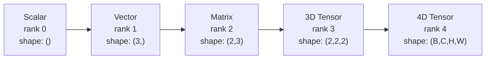
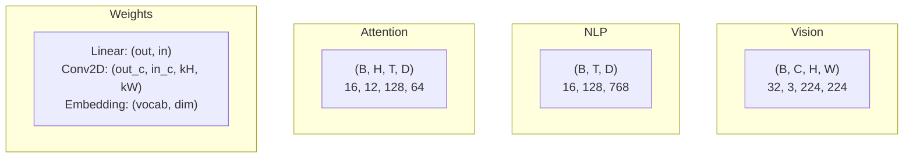
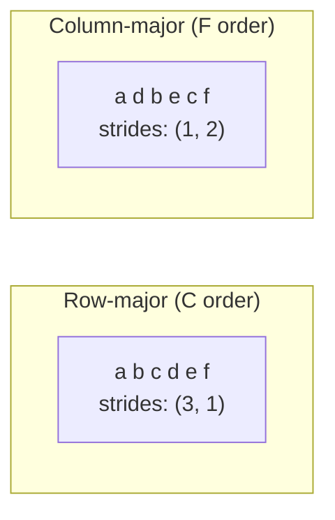
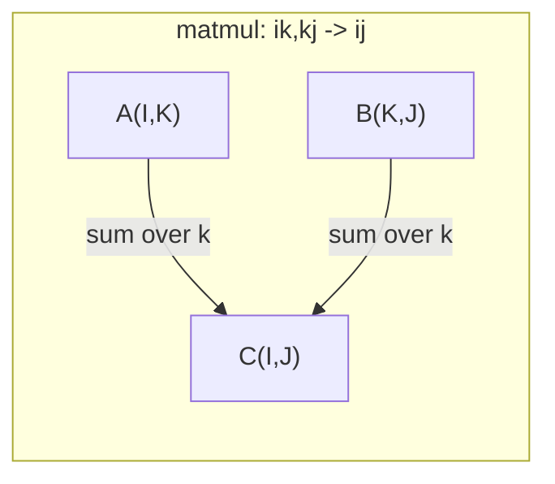

# 張量運算

> 張量是資料與深度學習之間的共通語言。每一張圖片、每一個句子、每一道梯度，都是從張量裡流過去的。

**類型：** 實作
**程式語言：** Python
**先修單元：** 階段 1 · 01（線性代數的直覺）、02（向量、矩陣與運算）
**時間：** 約 90 分鐘

## 學習目標

- 從零實作一個張量類別，支援形狀、步長、重塑、轉置與逐元素運算
- 套用廣播規則，在不複製資料的前提下對形狀不同的張量做運算
- 寫出 einsum 表達式來做內積、矩陣乘法、外積與批次運算
- 追蹤多頭注意力每一個步驟中確切的張量形狀

## 問題所在

你做了一個 transformer。前向傳播看起來很乾淨。一跑就得到：`RuntimeError: mat1 and mat2 shapes cannot be multiplied (32x768 and 512x768)`。你盯著那些形狀，試著加一個轉置。現在它說 `Expected 4D input (got 3D input)`。你加一個 unsqueeze。又壞在別的地方。

形狀錯誤是深度學習程式碼裡最常見的 bug。它們在觀念上並不難——每個運算都有自己的形狀合約——但它們增生得很快。一個 transformer 裡串著幾十次重塑、轉置與廣播。錯一個軸，錯誤就一路連鎖下去。更糟的是，有些形狀錯誤根本不會拋出錯誤。它們沿著錯的維度廣播、或在錯的軸上加總，安安靜靜地產出垃圾。

矩陣處理的是兩組東西之間的兩兩關係。真實資料塞不進兩個維度。一批 32 張 224x224 的 RGB 圖片是一個 4D 張量：`(32, 3, 224, 224)`。12 個頭的自注意力也是 4D：`(batch, heads, seq_len, head_dim)`。你需要一個能推廣到任意維度數的資料結構，而且它的運算要能在所有維度上乾淨地組合起來。那個結構就是張量。把它的運算練熟，形狀錯誤就變得非常容易除錯。

## 核心概念

### 張量是什麼

張量是一個多維的數字陣列，資料型別統一。維度的數目就是它的**階**（rank，或稱 order）。每一個維度是一個**軸**（axis）。**形狀**（shape）是一個元組，列出沿每個軸的大小。


```mermaid
graph LR
    S["Scalar<br/>rank 0<br/>shape: ()"] --> V["Vector<br/>rank 1<br/>shape: (3,)"]
    V --> M["Matrix<br/>rank 2<br/>shape: (2,3)"]
    M --> T3["3D Tensor<br/>rank 3<br/>shape: (2,2,2)"]
    T3 --> T4["4D Tensor<br/>rank 4<br/>shape: (B,C,H,W)"]
```

元素總數 = 所有大小的乘積。形狀 `(2, 3, 4)` 裝了 `2 * 3 * 4 = 24` 個元素。

### 深度學習裡的張量形狀

不同類型的資料按慣例對應到特定的張量形狀。


```mermaid
graph TD
    subgraph Vision
        V1["(B, C, H, W)<br/>32, 3, 224, 224"]
    end
    subgraph NLP
        N1["(B, T, D)<br/>16, 128, 768"]
    end
    subgraph Attention
        A1["(B, H, T, D)<br/>16, 12, 128, 64"]
    end
    subgraph Weights
        W1["Linear: (out, in)<br/>Conv2D: (out_c, in_c, kH, kW)<br/>Embedding: (vocab, dim)"]
    end
```

PyTorch 用 NCHW（通道在前）。TensorFlow 預設是 NHWC（通道在後）。排列方式不一致會造成不聲不響的效能下降或錯誤。

### 記憶體排列是怎麼運作的

一個二維陣列在記憶體裡是一段一維的位元組序列。**步長**（strides）告訴你沿某個軸往前走一步，要跳過多少個元素。


```mermaid
graph LR
    subgraph "Row-major (C order)"
        R["a b c d e f<br/>strides: (3, 1)"]
    end
    subgraph "Column-major (F order)"
        C["a d b e c f<br/>strides: (1, 2)"]
    end
```

轉置不搬動資料。它只是把步長對調，讓張量變成**非連續記憶體**（non-contiguous）——同一列的元素在記憶體裡不再相鄰。

### 廣播規則

廣播讓你在不複製資料的情況下，對形狀不同的張量做運算。從右邊對齊形狀。兩個維度相容的條件是：大小相等，或其中一個是 1。維度較少的那一邊，左側會補上 1。

```
Tensor A:     (8, 1, 6, 1)
Tensor B:        (7, 1, 5)
Padded B:     (1, 7, 1, 5)
Result:       (8, 7, 6, 5)
```

### Einsum：萬用的張量運算

愛因斯坦求和法用一個字母標記每一個軸。只出現在輸入、沒出現在輸出的軸會被加總掉。兩邊都出現的軸會保留。


```mermaid
graph LR
    subgraph "matmul: ik,kj -> ij"
        A["A(I,K)"] --> |"sum over k"| C["C(I,J)"]
        B["B(K,J)"] --> |"sum over k"| C
    end
```

幾個關鍵模式：`i,i->`（內積）、`i,j->ij`（外積）、`ii->`（跡）、`ij->ji`（轉置）、`bij,bjk->bik`（批次矩陣乘法）、`bhtd,bhsd->bhts`（注意力分數）。

```figure
tensor-broadcast
```

## 動手實作

程式碼放在 `code/tensors.py`。每個步驟都對應那裡的實作。

### 步驟 1：張量的儲存與步長

一個張量存的是一份扁平的數字清單，加上形狀的中介資料。步長告訴索引邏輯，怎麼把多維索引映射到扁平位置。

```python
class Tensor:
    def __init__(self, data, shape=None):
        if isinstance(data, (list, tuple)):
            self._data, self._shape = self._flatten_nested(data)
        elif isinstance(data, np.ndarray):
            self._data = data.flatten().tolist()
            self._shape = tuple(data.shape)
        else:
            self._data = [data]
            self._shape = ()

        if shape is not None:
            total = reduce(lambda a, b: a * b, shape, 1)
            if total != len(self._data):
                raise ValueError(
                    f"Cannot reshape {len(self._data)} elements into shape {shape}"
                )
            self._shape = tuple(shape)

        self._strides = self._compute_strides(self._shape)

    @staticmethod
    def _compute_strides(shape):
        if len(shape) == 0:
            return ()
        strides = [1] * len(shape)
        for i in range(len(shape) - 2, -1, -1):
            strides[i] = strides[i + 1] * shape[i + 1]
        return tuple(strides)
```

形狀 `(3, 4)` 的步長是 `(4, 1)`——跳 4 個元素前進一列，跳 1 個元素前進一欄。

### 步驟 2：重塑、擠壓、擴展

重塑會改變形狀，但不改變元素順序。元素總數必須維持不變。其中一個維度可以用 `-1`，讓它自己推算大小。

```python
t = Tensor(list(range(12)), shape=(2, 6))
r = t.reshape((3, 4))
r = t.reshape((-1, 3))
```

擠壓（squeeze）會移除大小為 1 的軸，擴展（unsqueeze）會插入一個。擴展對廣播至關重要——一個偏權值向量 `(D,)` 要加到一個批次 `(B, T, D)` 上時，得先擴展成 `(1, 1, D)`。

```python
t = Tensor(list(range(6)), shape=(1, 3, 1, 2))
s = t.squeeze()
v = Tensor([1, 2, 3])
u = v.unsqueeze(0)
```

### 步驟 3：轉置與 permute

轉置會交換兩個軸。permute 會重排所有的軸。要在 NCHW 與 NHWC 之間轉換，靠的就是它。

```python
mat = Tensor(list(range(6)), shape=(2, 3))
tr = mat.transpose(0, 1)

t4d = Tensor(list(range(24)), shape=(1, 2, 3, 4))
perm = t4d.permute((0, 2, 3, 1))
```

轉置或 permute 之後，張量在記憶體裡就是非連續的。在 PyTorch 裡，`view` 在非連續張量上會失敗——改用 `reshape`，或先呼叫 `.contiguous()`。

### 步驟 4：逐元素運算與歸約

逐元素運算（加、乘、減）各自獨立作用在每個元素上，形狀不變。歸約（sum、mean、max）會把一個或多個軸收掉。

```python
a = Tensor([[1, 2], [3, 4]])
b = Tensor([[10, 20], [30, 40]])
c = a + b
d = a * 2
s = a.sum(axis=0)
```

CNN 裡的全域平均池化：`(B, C, H, W).mean(axis=[2, 3])` 產出 `(B, C)`。NLP 裡的序列平均池化：`(B, T, D).mean(axis=1)` 產出 `(B, D)`。

### 步驟 5：用 NumPy 做廣播

`tensors.py` 裡的 `demo_broadcasting_numpy()` 函式示範了幾個核心模式。

```python
activations = np.random.randn(4, 3)
bias = np.array([0.1, 0.2, 0.3])
result = activations + bias

images = np.random.randn(2, 3, 4, 4)
scale = np.array([0.5, 1.0, 1.5]).reshape(1, 3, 1, 1)
result = images * scale

a = np.array([1, 2, 3]).reshape(-1, 1)
b = np.array([10, 20, 30, 40]).reshape(1, -1)
outer = a * b
```

用廣播算兩兩距離：把 `(M, 2)` 重塑成 `(M, 1, 2)`、`(N, 2)` 重塑成 `(1, N, 2)`，相減、平方、沿最後一軸加總，再開平方根。結果是 `(M, N)`。

### 步驟 6：einsum 運算

`demo_einsum()` 與 `demo_einsum_gallery()` 這兩個函式走過每一種常見模式。

```python
a = np.array([1.0, 2.0, 3.0])
b = np.array([4.0, 5.0, 6.0])
dot = np.einsum("i,i->", a, b)

A = np.array([[1, 2], [3, 4], [5, 6]], dtype=float)
B = np.array([[7, 8, 9], [10, 11, 12]], dtype=float)
matmul = np.einsum("ik,kj->ij", A, B)

batch_A = np.random.randn(4, 3, 5)
batch_B = np.random.randn(4, 5, 2)
batch_mm = np.einsum("bij,bjk->bik", batch_A, batch_B)
```

一次收縮（contraction）的計算成本，是所有索引大小的乘積（保留的與加總掉的都算）。以 `bij,bjk->bik`、B=32、I=128、J=64、K=128 為例：`32 * 128 * 64 * 128 = 33,554,432` 次乘加。

### 步驟 7：用 einsum 實作注意力機制

`demo_attention_einsum()` 函式從頭到尾實作了多頭注意力。

```python
B, H, T, D = 2, 4, 8, 16
E = H * D

X = np.random.randn(B, T, E)
W_q = np.random.randn(E, E) * 0.02

Q = np.einsum("bte,ek->btk", X, W_q)
Q = Q.reshape(B, T, H, D).transpose(0, 2, 1, 3)

scores = np.einsum("bhtd,bhsd->bhts", Q, K) / np.sqrt(D)
weights = softmax(scores, axis=-1)
attn_output = np.einsum("bhts,bhsd->bhtd", weights, V)

concat = attn_output.transpose(0, 2, 1, 3).reshape(B, T, E)
output = np.einsum("bte,ek->btk", concat, W_o)
```

每一步都是一次張量運算：投影（用 einsum 做矩陣乘法）、拆頭（重塑 + 轉置）、注意力分數（用 einsum 做批次矩陣乘法）、加權和（用 einsum 做批次矩陣乘法）、併頭（轉置 + 重塑）、輸出投影（用 einsum 做矩陣乘法）。

## 框架應用

### 從零實作與 NumPy 對照

| 運算 | 從零實作（Tensor 類別） | NumPy |
|---|---|---|
| 建立 | `Tensor([[1,2],[3,4]])` | `np.array([[1,2],[3,4]])` |
| 重塑 | `t.reshape((3,4))` | `a.reshape(3,4)` |
| 轉置 | `t.transpose(0,1)` | `a.T` 或 `a.transpose(0,1)` |
| 擠壓 | `t.squeeze(0)` | `np.squeeze(a, 0)` |
| 加總 | `t.sum(axis=0)` | `a.sum(axis=0)` |
| Einsum | 無 | `np.einsum("ij,jk->ik", a, b)` |

### 從零實作與 PyTorch 對照

```python
import torch

t = torch.tensor([[1, 2, 3], [4, 5, 6]], dtype=torch.float32)
t.shape
t.stride()
t.is_contiguous()

t.reshape(3, 2)
t.unsqueeze(0)
t.transpose(0, 1)
t.transpose(0, 1).contiguous()

torch.einsum("ik,kj->ij", A, B)
```

PyTorch 多給了你自動微分、GPU 支援與最佳化過的 BLAS 核心。形狀的語意是一樣的。只要你懂從零寫的版本，PyTorch 的形狀錯誤就讀得懂了。

### 每一層神經網路都是一次張量運算

| 運算 | 張量形式 | Einsum |
|---|---|---|
| 全連接層 | `Y = X @ W.T + b` | `"bd,od->bo"` 加上偏權值 |
| 注意力 QKV | `Q = X @ W_q` | `"btd,dh->bth"` |
| 注意力分數 | `Q @ K.T / sqrt(d)` | `"bhtd,bhsd->bhts"` |
| 注意力輸出 | `softmax(scores) @ V` | `"bhts,bhsd->bhtd"` |
| Batch norm | `(X - mu) / sigma * gamma` | 逐元素 + 廣播 |
| Softmax | `exp(x) / sum(exp(x))` | 逐元素 + 歸約 |

## 產出交付

這個單元會產出兩份可重複使用的提示詞：

1. **`outputs/prompt-tensor-shapes.md`** —— 一份系統化的提示詞，用來除錯張量形狀不符的問題。附有每個常見運算（matmul、broadcast、cat、Linear、Conv2d、BatchNorm、softmax）的決策表，以及一張修法查詢表。

2. **`outputs/prompt-tensor-debugger.md`** —— 一份逐步除錯的提示詞，形狀錯誤卡住你的時候，貼進任何 AI 助理裡。把錯誤訊息和你的張量形狀餵給它，換回確切的修法。

## 練習

1. **簡單 —— 重塑往返。** 拿一個形狀 `(2, 3, 4)` 的張量。把它重塑成 `(6, 4)`，再到 `(24,)`，再回到 `(2, 3, 4)`。每一步都印出扁平資料，確認元素順序沒變。

2. **中等 —— 實作廣播。** 為 `Tensor` 類別加上一個 `broadcast_to(shape)` 方法，把大小為 1 的維度擴展到符合目標形狀。接著改寫 `_elementwise_op`，讓它在運算前自動廣播。用 `(3, 1)` 與 `(1, 4)` 測試，應該產出 `(3, 4)`。

3. **困難 —— 從零打造 einsum。** 實作一個基本的 `einsum(subscripts, *tensors)` 函式，至少要能處理：內積（`i,i->`）、矩陣乘法（`ij,jk->ik`）、外積（`i,j->ij`）與轉置（`ij->ji`）。解析下標字串、辨識出要收縮的索引，然後對所有索引組合跑迴圈。拿 `np.einsum` 來對答案。

4. **困難 —— 注意力形狀追蹤器。** 寫一個函式，接收 `batch_size`、`seq_len`、`embed_dim` 與 `num_heads`，印出多頭注意力每一步的確切形狀：輸入、Q/K/V 投影、拆頭、注意力分數、softmax 權重、加權和、併頭、輸出投影。拿 `demo_attention_einsum()` 的輸出來驗證。

## 關鍵術語

| 術語 | 大家怎麼說 | 實際上是什麼 |
|---|---|---|
| 張量 | 「就是矩陣，只是維度更多」 | 一個多維陣列，型別統一，並且有明確定義的形狀、步長與運算 |
| 階（rank） | 「維度的數目」 | 軸的數目。矩陣的階是 2，跟線性代數裡矩陣的秩不是同一件事 |
| 形狀 | 「張量有多大」 | 一個元組，列出沿每個軸的大小。`(2, 3)` 表示 2 列、3 欄 |
| 步長 | 「記憶體是怎麼排的」 | 沿某個軸前進一格要跳過的元素數目 |
| 廣播 | 「形狀不一樣它也照樣會動」 | 一組嚴格的規則：從右對齊，維度必須相等，或其中一個必須是 1 |
| 連續記憶體 | 「這個張量是正常的」 | 元素在記憶體裡依序存放，跟邏輯排列相比沒有空隙、也沒有重排 |
| Einsum | 「把 matmul 寫得比較炫的寫法」 | 一套通用記法，一行就能表達任何張量收縮、外積、跡或轉置 |
| View | 「就是 reshape 嘛」 | 一個共用同一塊記憶體緩衝區、但形狀／步長中介資料不同的張量。碰到非連續資料會失敗 |
| 收縮（contraction） | 「對某個索引加總」 | 通用的運算：把張量之間共有的索引相乘後加總，產生階更低的結果 |
| NCHW / NHWC | 「PyTorch 與 TensorFlow 的格式」 | 圖片張量的記憶體排列慣例。NCHW 把通道放在空間維度前面，NHWC 放在後面 |

## 延伸閱讀

- [NumPy Broadcasting](https://numpy.org/doc/stable/user/basics.broadcasting.html) —— 權威的規則說明，附視覺化範例
- [PyTorch Tensor Views](https://pytorch.org/docs/stable/tensor_view.html) —— view 什麼時候有效、什麼時候會複製
- [einops](https://github.com/arogozhnikov/einops) —— 一個讓張量重塑變得好讀又安全的函式庫
- [The Illustrated Transformer](https://jalammar.github.io/illustrated-transformer/) —— 把流過注意力的張量形狀視覺化
- [Einstein Summation in NumPy](https://numpy.org/doc/stable/reference/generated/numpy.einsum.html) —— 完整的 einsum 文件，附範例
