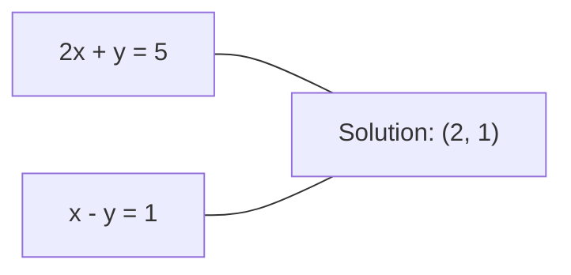
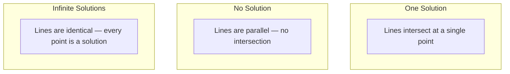

# 線形システム

> `Ax = b` を解くことは、いまもニューラルネットワークの中で動き続けている、数学で最も古い問題の一つです。

**種類:** Build
**言語:** Python
**前提:** Phase 1, Lessons 01 (Linear Algebra Intuition), 02 (Vectors & Matrices), 03 (Matrix Transformations)
**時間:** 約120分

## 学習目標

- 部分ピボット選択つきガウス消去法と後退代入で `Ax = b` を解く
- LU、QR、Cholesky 分解で行列を分解し、それぞれが適する場面を説明する
- 最小二乗法の正規方程式を導出し、線形回帰とリッジ回帰に結びつける
- 条件数で悪条件の系を診断し、正則化で数値的に安定させる

## 問題

線形回帰を学習するとき、最小二乗フィットを計算するとき、共分散行列を反転せずに Mahalanobis 距離を計算するとき、裏側では線形システムを解いています。ニューラルネットワーク層の `y = Wx + b` も、既知の変換 `W` に対する線形写像の評価です。

`A` は既知の係数行列、`b` は既知の出力ベクトル、`x` は求めたい未知ベクトルです。線形回帰では `A` がデータ行列、`b` がターゲット、`x` が重みです。つまりモデル全体は「`Ax` が `b` にできるだけ近くなる `x` を探す」問題に落ちます。

このレッスンでは、代表的な解法をゼロから作ります。速い方法と安定な方法がなぜ違うのか、正方行列だけに使える方法と過剰決定系にも使える方法は何か、そして条件数が答えの信頼性をどれほど左右するのかを理解します。

## 概念

### `Ax = b` の幾何学的意味

線形方程式の各式は超平面を表します。解は、それらすべての超平面が交わる点、または点の集合です。

```
2x + y = 5          Two lines in 2D.
x - y  = 1          They intersect at x=2, y=1.
```



解の状況は三つに分かれます。



行列で見ると、一意解は `A` が可逆であることを意味します。解なしは系が矛盾していること、無限解は `A` に零空間があることを意味します。ML の多くの問題は、未知数よりデータ点が多いため厳密解がありません。そこで最小二乗法が必要になります。

### 行の見方と列の見方

`Ax = b` には二つの読み方があります。

**行の見方。** `A` の各行は一つの方程式です。各方程式は超平面で、解はそれらの交点です。

**列の見方。** `A` の各列はベクトルです。問題は「`A` の列のどんな線形結合が `b` を作るか」になります。

```
A = | 2  1 |    b = | 5 |
    | 1 -1 |        | 1 |

Row picture: solve 2x + y = 5 and x - y = 1 simultaneously.

Column picture: find x1, x2 such that:
  x1 * [2, 1] + x2 * [1, -1] = [5, 1]
  2 * [2, 1] + 1 * [1, -1] = [4+1, 2-1] = [5, 1]   check.
```

列の見方のほうが本質的です。`b` が `A` の列空間にあれば解があります。なければ、列空間の中で `b` に最も近い点を探します。これが最小二乗解です。

### ガウス消去法と部分ピボット選択

ガウス消去法は `Ax = b` を上三角系 `Ux = c` に変換し、後退代入で解きます。

```
1. For each column k (the pivot column):
   a. Find the largest entry in column k at or below row k (partial pivoting).
   b. Swap that row with row k.
   c. For each row i below k:
      - Compute multiplier m = A[i][k] / A[k][k]
      - Subtract m times row k from row i.
2. Back substitute: solve from the last equation upward.
```

計算量は `O(n^3)` です。部分ピボット選択をしないと、ゼロや非常に小さいピボットで割ることになり、丸め誤差が増幅されます。各列で絶対値が最大のピボットを選ぶことで、乗数を小さく保ち、数値安定性を改善します。

### LU、QR、Cholesky

**LU 分解**は `A = LU` として、下三角行列 `L` と上三角行列 `U` に分けます。一度 `O(n^3)` で分解すれば、同じ `A` に対して異なる `b` を解くたびに `O(n^2)` で済みます。部分ピボット選択つきでは `PA = LU` になります。

**QR 分解**は `A = QR` と分解します。`Q` は直交行列で、`Q^T Q = I` を満たします。最小二乗問題では、正規方程式より数値的に安定です。Gram-Schmidt 法は列ベクトルから順に、既存の方向への射影を取り除いて直交基底を作ります。

**Cholesky 分解**は、`A` が対称正定値のとき `A = L L^T` と分解します。LU よりおよそ 2 倍速く、必要な記憶量も少なく済みます。共分散行列、Gaussian processes のカーネル行列、リッジ回帰の `X^T X + lambda I` などで頻出します。

### 最小二乗法と正規方程式

`A` が `m x n` で `m > n` のとき、方程式は過剰決定です。一般に厳密解はないため、二乗誤差を最小化します。

```
minimize ||Ax - b||^2

This is the sum of squared residuals:
  sum((A[i,:] @ x - b[i])^2 for i in range(m))
```

最小化条件は正規方程式です。

```
A^T A x = A^T b
```

`||Ax - b||^2` を展開して `x` で微分し、勾配をゼロに置くと得られます。線形回帰では、これは閉形式解そのものです。

```
X^T X w = X^T y
w = (X^T X)^(-1) X^T y
```

正則化を加えるとリッジ回帰になります。

```
(X^T X + lambda * I) w = X^T y
w = (X^T X + lambda * I)^(-1) X^T y
```

`lambda > 0` なら `X^T X + lambda I` は対称正定値になり、Cholesky で効率よく解けます。

### 疑似逆行列と条件数

Moore-Penrose 疑似逆行列 `A+` は、非正方行列や特異行列にも逆行列の考え方を拡張します。

```
x = A+ b

where A+ = V Sigma+ U^T    (computed via SVD)
```

疑似逆行列は最小ノルムの最小二乗解を返します。一意解があればそれを返し、解がなければ最小二乗解を返し、無限解がある場合は `||x||` が最小の解を返します。

条件数は、入力の小さな変化に対して解がどれだけ敏感かを測ります。

```
kappa(A) = ||A|| * ||A^(-1)|| = sigma_max / sigma_min
```

目安として、`kappa ~ 10^k` なら浮動小数点精度をおよそ `k` 桁失います。`float64` で `kappa ~ 10^16` に近づくと、解は実質的に信用できません。ML では特徴量がほぼ共線なときに悪条件が起きます。`lambda I` を加える正則化は条件数を改善します。

### 反復法: 共役勾配法

未知数が何百万もある疎な系では、LU や Cholesky のような直接法は高すぎます。共役勾配法 (CG) は、`A` が対称正定値のときに使える反復解法です。

```
Algorithm sketch:
  x0 = initial guess (often zero)
  r0 = b - A x0           (residual)
  p0 = r0                 (search direction)

  For k = 0, 1, 2, ...:
    alpha = (rk . rk) / (pk . A pk)
    x_{k+1} = xk + alpha * pk
    r_{k+1} = rk - alpha * A pk
    beta = (r_{k+1} . r_{k+1}) / (rk . rk)
    p_{k+1} = r_{k+1} + beta * pk
    if ||r_{k+1}|| < tolerance: stop
```

収束速度は条件数に依存します。条件がよいほど速く収束するため、ここでも正則化が効きます。

### どの方法をいつ使うか

| 方法 | 条件 | 計算量 | 用途 |
|--------|-------------|------|----------|
| ガウス消去法 | 正方で非特異な `A` | `O(n^3)` | 一回だけ解く正方系 |
| LU 分解 | 正方で非特異な `A` | `O(n^3)` 分解 + `O(n^2)` 解法 | 同じ `A` で複数の `b` を解く |
| QR 分解 | 任意の `A` (`m >= n`) | `O(mn^2)` | 最小二乗、数値安定性重視 |
| Cholesky | 対称正定値 `A` | `O(n^3/3)` | 共分散行列、Gaussian processes、リッジ回帰 |
| 正規方程式 | 過剰決定 (`m > n`) | `O(mn^2 + n^3)` | 小さな `n` の線形回帰 |
| SVD / 疑似逆 | 任意の `A` | `O(mn^2)` | ランク落ち、最小ノルム解 |
| 共役勾配 | 対称正定値で疎な `A` | `O(n * k * nnz)` | 大規模疎系 |

## 実装

### Step 1: Gaussian elimination with partial pivoting

```python
import numpy as np

def gaussian_elimination(A, b):
    n = len(b)
    Ab = np.hstack([A.astype(float), b.reshape(-1, 1).astype(float)])

    for k in range(n):
        max_row = k + np.argmax(np.abs(Ab[k:, k]))
        Ab[[k, max_row]] = Ab[[max_row, k]]

        if abs(Ab[k, k]) < 1e-12:
            raise ValueError(f"Matrix is singular or nearly singular at pivot {k}")

        for i in range(k + 1, n):
            m = Ab[i, k] / Ab[k, k]
            Ab[i, k:] -= m * Ab[k, k:]

    x = np.zeros(n)
    for i in range(n - 1, -1, -1):
        x[i] = (Ab[i, -1] - Ab[i, i+1:n] @ x[i+1:n]) / Ab[i, i]

    return x
```

### Step 2: LU decomposition

```python
def lu_decompose(A):
    n = A.shape[0]
    L = np.eye(n)
    U = A.astype(float).copy()
    P = np.eye(n)

    for k in range(n):
        max_row = k + np.argmax(np.abs(U[k:, k]))
        if max_row != k:
            U[[k, max_row]] = U[[max_row, k]]
            P[[k, max_row]] = P[[max_row, k]]
            if k > 0:
                L[[k, max_row], :k] = L[[max_row, k], :k]

        for i in range(k + 1, n):
            L[i, k] = U[i, k] / U[k, k]
            U[i, k:] -= L[i, k] * U[k, k:]

    return P, L, U
```

### Step 3: Cholesky decomposition

```python
def cholesky(A):
    n = A.shape[0]
    L = np.zeros_like(A, dtype=float)

    for i in range(n):
        for j in range(i + 1):
            s = A[i, j] - L[i, :j] @ L[j, :j]
            if i == j:
                if s <= 0:
                    raise ValueError("Matrix is not positive definite")
                L[i, j] = np.sqrt(s)
            else:
                L[i, j] = s / L[j, j]

    return L
```

### Step 4: Least squares via normal equations

```python
def least_squares_normal(A, b):
    AtA = A.T @ A
    Atb = A.T @ b
    return gaussian_elimination(AtA, Atb)
```

### Step 5: Condition number

```python
def condition_number(A):
    U, S, Vt = np.linalg.svd(A)
    return S[0] / S[-1]
```

## Use It

線形回帰やリッジ回帰では、作った解法と `numpy` / `sklearn` の結果を比較して、実装が同じ重みを返すことを確認します。実務では `np.linalg.solve`、`np.linalg.lstsq`、`scipy.linalg.cho_solve` のような堅牢な実装を使い、ここで作ったコードは仕組みの理解に使います。

## Ship It

このレッスンで作るもの:
- `code/linear_systems.py`: ガウス消去法、LU 分解、Cholesky 分解、最小二乗法、リッジ回帰のスクラッチ実装
- 正規方程式と `sklearn.linear_model.LinearRegression` が同じ重みを返すデモ

## 演習

1. `[[1,2,3],[4,5,6],[7,8,10]] x = [6, 15, 27]` を、自作のガウス消去法、自作の LU ソルバ、`np.linalg.solve` で解き、浮動小数点誤差の範囲で一致することを確認してください。
2. 50x5 のランダム行列 `X` と `y = X @ w_true + noise` を作り、正規方程式、QR、SVD、`np.linalg.lstsq` で `w` を求めて比較してください。
3. 二つの列をほぼ同一にして、ほぼ特異な行列を作ってください。条件数を計算し、正則化あり/なしで解と残差を比較してください。
4. 100x100 のランダム対称正定値行列に対して共役勾配法を実装し、`1e-8` まで収束する反復回数を数えてください。
5. サイズ 10、50、200、500 の対称正定値行列で Cholesky、LU、`np.linalg.solve` の実行時間を比較してください。

## 重要用語

| 用語 | よくある言い方 | 実際の意味 |
|------|----------------|------------|
| 線形システム | 「`x` を解く」 | 線形方程式の集合 `Ax = b`。変換 `A` のもとで出力 `b` を作る入力を探すこと。 |
| ガウス消去法 | 「行基本変形」 | 対角線の下をゼロにして上三角系を作り、後退代入で解く方法。 |
| 部分ピボット選択 | 「安定化のため行を入れ替える」 | 各列で最大絶対値の行をピボット位置へ移し、小さい数で割るのを避ける。 |
| LU 分解 | 「三角行列に分ける」 | `A = LU` と分解し、複数回の求解で分解コストを償却する。 |
| QR 分解 | 「直交分解」 | `A = QR` と分解する。最小二乗で LU より安定。 |
| Cholesky 分解 | 「行列の平方根」 | 対称正定値 `A` を `A = LL^T` と分解する。 |
| 最小二乗法 | 「厳密解がないときの最良フィット」 | `||Ax - b||^2` を最小化する。 |
| 正規方程式 | 「微分から出る近道」 | `A^T A x = A^T b`。線形回帰の閉形式解。 |
| 疑似逆行列 | 「非正方行列の逆」 | SVD で計算し、最小ノルムの最小二乗解を返す。 |
| 条件数 | 「この答えはどれだけ信用できるか」 | `sigma_max / sigma_min`。入力摂動への感度を表す。 |
| リッジ回帰 | 「正則化つき最小二乗」 | `(X^T X + lambda I) w = X^T y` を解く。 |

## 参考資料

- [MIT 18.06: Linear Algebra](https://ocw.mit.edu/courses/18-06-linear-algebra-spring-2010/) (Gilbert Strang) -- 線形システムと行列分解の定番講義
- [Numerical Linear Algebra](https://people.maths.ox.ac.uk/trefethen/text.html) (Trefethen & Bau) -- 数値安定性と条件数の標準的な参考書
- [Matrix Computations](https://www.cs.cornell.edu/cv/GolubVanLoan4/golubandvanloan.htm) (Golub & Van Loan) -- 行列アルゴリズムの百科事典的な本
- [3Blue1Brown: Inverse Matrices](https://www.3blue1brown.com/lessons/inverse-matrices) -- `Ax = b` の幾何学的直感
