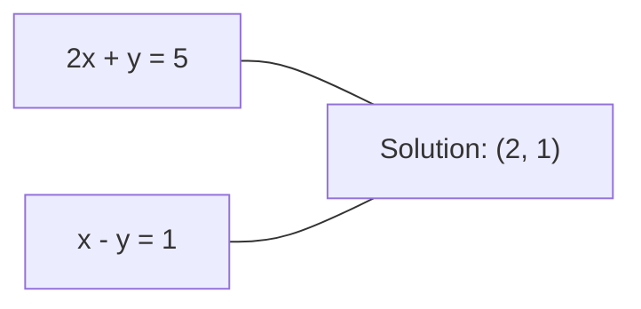
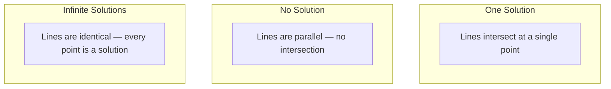

# Lineer Sistemler

> Ax = b'yi çözmek, matematikte hala neural network'nizi çalıştıran en eski problemdir.

**Tür:** Yapım
**Dil:** Python
**Önkoşullar:** Aşama 1, Dersler 01 (Doğrusal Cebir Sezgisi), 02 (Vektörler ve Matrisler), 03 (Matris Dönüşümleri)
**Süre:** ~120 dakika

## Öğrenme Hedefleri

- Kısmi döndürme ve geri ikame ile Gauss elemesini kullanarak Ax = b'yi çözün
- Matrisleri LU, QR ve Cholesky ayrıştırmalarıyla çarpanlara ayırın ve her birinin uygun olduğunu açıklayın
- En küçük kareler için normal denklemleri türetin ve bunları doğrusal ve sırt regresyonuna bağlayın
- Durum numarasını kullanarak kötü durumdaki sistemleri teşhis edin ve bunları stabilize etmek için düzenleme uygulayın

## Sorun

Doğrusal bir regresyonu her eğittiğinizde, doğrusal bir sistemi çözersiniz. En küçük kareler uyumunu her hesapladığınızda doğrusal bir sistemi çözersiniz. Bir neural network katmanı `y = Wx + b`'yi her hesapladığında, doğrusal bir sistemin bir tarafını değerlendiriyor demektir. Düzenleme eklediğinizde sistemi değiştirirsiniz. Gauss süreçlerini kullandığınızda bir matrisi çarpanlara ayırırsınız. Mahalanobis mesafesi için bir kovaryans matrisini ters çevirdiğinizde doğrusal bir sistemi çözersiniz.

Ax = b denklemi her yerde karşımıza çıkıyor. A bilinen katsayılardan oluşan bir matristir. b bilinen çıktıların bir vektörüdür. x, bulmak istediğiniz bilinmeyenlerin vektörüdür. Doğrusal regresyonda A veri matrisiniz, b hedef vektörünüz ve x ağırlık vektörünüzdür. Tüm model şuna indirgenir: Ax'in b'ye mümkün olduğu kadar yakın olacağı şekilde x'i bulun.

Bu ders, bu denklemi sıfırdan çözmeye yönelik tüm önemli yöntemleri oluşturur. Neden bazı yöntemlerin hızlı, diğerlerinin ise kararlı olduğunu, neden bazılarının yalnızca kare sistemlerde çalıştığını, diğerlerinin ise aşırı belirlenmiş yöntemleri ele aldığını ve neden matrisinizin koşul sayısının yanıtınızın herhangi bir anlam ifade edip etmediğini belirlediğini anlayacaksınız.

## Konsept

### Ax = b'nin geometrik anlamı nedir?

Doğrusal denklem sisteminin geometrik bir yorumu vardır. Her denklem bir hiperdüzlemi tanımlar. Çözüm, tüm hiperdüzlemlerin kesiştiği noktadır (veya noktalar kümesidir).

```
2x + y = 5          Two lines in 2D.
x - y  = 1          They intersect at x=2, y=1.
```



Üç şey olabilir:



Matris biçiminde "tek çözüm", A'nın tersinir olduğu anlamına gelir. "Çözüm yok" sistemin tutarsız olduğu anlamına gelir. "Sonsuz çözümler" A'nın bir sıfır uzayına sahip olduğu anlamına gelir. Çoğu makine öğrenimi problemi "kesin çözüm yok" kategorisine girer çünkü elinizde bilinmeyenlerden (parametrelerden) daha fazla denklem (veri noktası) vardır. En küçük kareler burada devreye giriyor.

### Sütun resmi ve satır resmi

Ax = b'yi okumanın iki yolu vardır.

**Satır resmi.** A'nın her satırı bir denklemi tanımlar. Her denklem bir hiperdüzlemdir. Çözüm hepsinin kesiştiği yerdedir.

**Sütun resmi.** A'nın her sütunu bir vektördür. Soru şu oluyor: A'nın sütunlarının hangi doğrusal birleşimi b'yi üretiyor?

```
A = | 2  1 |    b = | 5 |
    | 1 -1 |        | 1 |

Row picture: solve 2x + y = 5 and x - y = 1 simultaneously.

Column picture: find x1, x2 such that:
  x1 * [2, 1] + x2 * [1, -1] = [5, 1]
  2 * [2, 1] + 1 * [1, -1] = [4+1, 2-1] = [5, 1]   check.
```

Sütun resmi daha temeldir. Eğer b, A'nın sütun uzayında yer alıyorsa sistemin bir çözümü vardır. Eğer b yoksa sütun uzayında en yakın noktayı bulursunuz. Bu en yakın nokta en küçük kareler çözümüdür.

### Gauss eliminasyonu

Gauss eliminasyonu, Ax = b'yi, geri yerine koyma yoluyla çözdüğünüz bir üst üçgen sistemi olan Ux = c'ye dönüştürür. En doğrudan yöntemdir.

Algoritma:

```
1. For each column k (the pivot column):
   a. Find the largest entry in column k at or below row k (partial pivoting).
   b. Swap that row with row k.
   c. For each row i below k:
      - Compute multiplier m = A[i][k] / A[k][k]
      - Subtract m times row k from row i.
2. Back substitute: solve from the last equation upward.
```

Örnek:

```
Original:
| 2  1  1 | 8 |       R2 = R2 - (2)R1     | 2  1   1 |  8 |
| 4  3  3 |20 |  -->  R3 = R3 - (1)R1 --> | 0  1   1 |  4 |
| 2  3  1 |12 |                            | 0  2   0 |  4 |

                       R3 = R3 - (2)R2     | 2  1   1 |  8 |
                                       --> | 0  1   1 |  4 |
                                           | 0  0  -2 | -4 |

Back substitute:
  -2 * x3 = -4    -->  x3 = 2
  x2 + 2  = 4     -->  x2 = 2
  2*x1 + 2 + 2 = 8 --> x1 = 2
```

Gauss eliminasyonunun O(n^3) işlemine maliyeti vardır. 1000x1000'lik bir sistem için bu, yaklaşık bir milyar kayan nokta işlemi anlamına gelir. Hızlıdır ancak aynı A ile birden fazla sistemi çözmeniz gerekiyorsa daha iyisini yapabilirsiniz.

### Kısmi dönme: neden önemli?

Döndürme olmadan Gauss eliminasyonu başarısız olabilir veya çöp üretebilir. Bir pivot elemanı sıfırsa sıfıra bölersiniz. Küçükse yuvarlama hatalarını artırırsınız.

```
Bad pivot:                       With partial pivoting:
| 0.001  1 | 1.001 |            Swap rows first:
| 1      1 | 2     |            | 1      1 | 2     |
                                 | 0.001  1 | 1.001 |
m = 1/0.001 = 1000              m = 0.001/1 = 0.001
R2 = R2 - 1000*R1               R2 = R2 - 0.001*R1
| 0.001  1     | 1.001   |      | 1      1     | 2     |
| 0     -999   | -999.0  |      | 0      0.999 | 0.999 |

x2 = 1.000 (correct)            x2 = 1.000 (correct)
x1 = (1.001 - 1)/0.001          x1 = (2 - 1)/1 = 1.000 (correct)
   = 0.001/0.001 = 1.000        Stable because the multiplier is small.
```

Sınırlı hassasiyete sahip kayan nokta aritmetiğinde, özetlenmemiş sürüm önemli rakamları kaybedebilir. Kısmi pivotlama, hata artışını en aza indirmek için daima mevcut en büyük pivotu seçer.

### LU ayrıştırması

LU, A faktörlerini alt üçgen matris L'ye ve üst üçgen matris U'ya ayrıştırır: A = LU. L matrisi Gauss eliminasyonunun çarpanlarını saklar. U matrisi yok etmenin sonucudur.

```
A = L @ U

| 2  1  1 |   | 1  0  0 |   | 2  1   1 |
| 4  3  3 | = | 2  1  0 | @ | 0  1   1 |
| 2  3  1 |   | 1  2  1 |   | 0  0  -2 |
```

Neden sadece elemek yerine faktöre bağlı kalalım? Çünkü L ve U'yu elde ettiğinizde, herhangi bir yeni b için Ax = b'yi çözmek yalnızca O(n^2)'ye mal olur:

```
Ax = b
LUx = b
Let y = Ux:
  Ly = b    (forward substitution, O(n^2))
  Ux = y    (back substitution, O(n^2))
```

O(n^3) maliyeti çarpanlara ayırma sırasında bir kez ödenir. Sonraki her çözüm O(n^2)'dir. Aynı A fakat farklı b vektörleriyle 1000 sistemi çözmeniz gerekiyorsa, LU toplam işten 1000/3 oranında tasarruf sağlar.

Kısmi döndürme ile PA = LU elde edersiniz; burada P, satır değişimlerini kaydeden bir permütasyon matrisidir.

### QR ayrıştırması

QR faktör A'nın dik bir Q matrisine ve bir üst üçgen matris R'ye ayrıştırılması: A = QR.

Dik bir matris Q^T Q = I özelliğine sahiptir. Sütunları birimdik vektörlerdir. Q ile çarpmak uzunlukları ve açıları korur.

```
A = Q @ R

Q has orthonormal columns: Q^T Q = I
R is upper triangular

To solve Ax = b:
  QRx = b
  Rx = Q^T b    (just multiply by Q^T, no inversion needed)
  Back substitute to get x.
```

QR, en küçük kareler problemlerini çözmek için LU'dan sayısal olarak daha kararlıdır. Gram-Schmidt süreci Q sütununu sütun sütun oluşturur:

```
Given columns a1, a2, ... of A:

q1 = a1 / ||a1||

q2 = a2 - (a2 . q1) * q1        (subtract projection onto q1)
q2 = q2 / ||q2||                (normalize)

q3 = a3 - (a3 . q1) * q1 - (a3 . q2) * q2
q3 = q3 / ||q3||

R[i][j] = qi . aj    for i <= j
```

Her adım, önceki tüm q vektörleri boyunca bileşeni kaldırır ve geriye yalnızca yeni ortogonal yön kalır.

### Cholesky ayrıştırması

A simetrik (A = A^T) ve pozitif tanımlı (tüm özdeğerler pozitif) olduğunda, bunu A = L L^T olarak çarpanlarına ayırabilirsiniz; burada L alt üçgendir. Bu Cholesky ayrışımıdır.

```
A = L @ L^T

| 4  2 |   | 2  0 |   | 2  1 |
| 2  5 | = | 1  2 | @ | 0  2 |

L[i][i] = sqrt(A[i][i] - sum(L[i][k]^2 for k < i))
L[i][j] = (A[i][j] - sum(L[i][k]*L[j][k] for k < j)) / L[j][j]    for i > j
```

Cholesky, LU'dan iki kat daha hızlıdır ve yarı depolama alanı gerektirir. Yalnızca simetrik pozitif tanımlı matrisler için işe yarar, ancak bunlar sürekli olarak ortaya çıkar:

- Kovaryans matrisleri simetrik pozitif yarı tanımlıdır (düzenleme ile pozitif tanımlıdır).
- Gauss süreçlerindeki çekirdek matrisi simetrik pozitif tanımlıdır.
- Bir dışbükey fonksiyonun minimumdaki Hessian'ı simetrik pozitif tanımlıdır.
- A^T A her zaman simetrik pozitif yarı tanımlıdır.

Gauss süreçlerinde, çekirdek matrisi K'yi Cholesky ile çarpanlara ayırırsınız, ardından tahmin ortalamasını elde etmek için K alfa = y'yi çözersiniz. Cholesky faktörü aynı zamanda marjinal olasılığın log-belirleyicisini de verir: log det(K) = 2 * toplam(log(diag(L))).

### En küçük kareler: Ax = b'nin kesin çözümü olmadığında

Eğer A, m > n ile m x n ise (bilinmeyenlerden daha fazla denklem), sistem aşırı belirlenmiş durumdadır. Kesin bir çözüm yok. Bunun yerine karesel hatayı en aza indirirsiniz:

```
minimize ||Ax - b||^2

This is the sum of squared residuals:
  sum((A[i,:] @ x - b[i])^2 for i in range(m))
```

Minimize edici normal denklemleri karşılar:

```
A^T A x = A^T b
```

Türetme: genişletme ||Ax - b||^2 = (Ax - b)^T (Ax - b) = x^T A^T A x - 2 x^T A^T b + b^T b. gradient'yi x'e göre alın ve sıfıra ayarlayın: 2 A^T A x - 2 A^T b = 0.

```
Original system (overdetermined, 4 equations, 2 unknowns):
| 1  1 |         | 3 |
| 1  2 | x     = | 5 |       No exact x satisfies all 4 equations.
| 1  3 |         | 6 |
| 1  4 |         | 8 |

Normal equations:
A^T A = | 4  10 |    A^T b = | 22 |
        | 10 30 |            | 63 |

Solve: x = [1.5, 1.7]

This is linear regression. x[0] is the intercept, x[1] is the slope.
```

### Normal denklemler = doğrusal regresyon

Bağlantı kesindir. Doğrusal regresyonda, X veri matrisinizde örnek başına bir satır ve özellik başına bir sütun bulunur. Hedef vektörünüz y'nin örnek başına bir girişi vardır. Ağırlık vektörü w şunları karşılar:

```
X^T X w = X^T y
w = (X^T X)^(-1) X^T y
```

Bu doğrusal regresyonun kapalı form çözümüdür. `sklearn.linear_model.LinearRegression.fit()`'ye yapılan her çağrı bunu (veya QR veya SVD aracılığıyla eşdeğerini) hesaplar.

Matrise bir düzenleme terimi lambda * I ekleyin ve sırt regresyonu elde edin:

```
(X^T X + lambda * I) w = X^T y
w = (X^T X + lambda * I)^(-1) X^T y
```

Düzenlileştirme, matrisin daha iyi koşullandırılmasını sağlar (doğru şekilde ters çevrilmesi daha kolay) ve ağırlıkları sıfıra doğru küçülterek aşırı uyumu önler. X^T X + lambda * I matrisi lambda > 0 olduğunda her zaman simetrik pozitif tanımlıdır, dolayısıyla bunu çözmek için Cholesky'yi kullanabilirsiniz.

### Sözde Ters (Moore-Penrose)

Sözde ters A+, matris ters çevirmeyi kare olmayan ve tekil matrislere genelleştirir. Herhangi bir A matrisi için:

```
x = A+ b

where A+ = V Sigma+ U^T    (computed via SVD)
```

Sigma+, sıfırdan farklı her tekil değerin tersinin alınması ve sonucun dönüştürülmesiyle oluşturulur. Eğer A = U Sigma V^T ise A+ = V Sigma+ U^T.

```
A = U Sigma V^T        (SVD)

Sigma = | 5  0 |       Sigma+ = | 1/5  0  0 |
        | 0  2 |                | 0  1/2  0 |
        | 0  0 |

A+ = V Sigma+ U^T
```

Sözde ters minimum norm en küçük kareler çözümünü verir. Sistemde şunlar varsa:
- Tek çözüm: A+b bunu verir.
- Çözüm yok: A+ b en küçük kareler çözümünü verir.
- Sonsuz çözümler: A+ b en küçük ||x|| olanı verir.

NumPy'nin `np.linalg.lstsq` ve `np.linalg.pinv` her ikisi de SVD'yi dahili olarak kullanır.

### Durum numarası

Koşul numarası, çözümün girdideki küçük değişikliklere ne kadar duyarlı olduğunu ölçer. Bir A matrisi için durum numarası şöyledir:

```
kappa(A) = ||A|| * ||A^(-1)|| = sigma_max / sigma_min
```

burada sigma_max ve sigma_min en büyük ve en küçük tekil değerlerdir.

```
Well-conditioned (kappa ~ 1):        Ill-conditioned (kappa ~ 10^15):
Small change in b -->                Small change in b -->
small change in x                    huge change in x

| 2  0 |   kappa = 2/1 = 2          | 1   1          |   kappa ~ 10^15
| 0  1 |   safe to solve            | 1   1+10^(-15) |   solution is garbage
```

Temel kurallar:
- kappa < 100: güvenli, çözüm doğrudur.
- kappa ~ 10^k: kayan nokta aritmetiğinizden yaklaşık k basamaklı hassasiyeti kaybedersiniz.
- kappa ~ 10^16 (float64 için): çözüm anlamsızdır. Matris etkili bir şekilde tekildir.

ML'de kötü koşullandırma, özellikler neredeyse eşdoğrusal olduğunda meydana gelir. Düzenlileştirme (lambda * I eklenmesi), durum numarasını sigma_max / sigma_min'den (sigma_max + lambda) / (sigma_min + lambda)'ya iyileştirir.

### Yinelemeli yöntemler: gradient eşleniği

Çok büyük seyrek sistemler (milyonlarca bilinmeyen) için LU veya Cholesky gibi doğrudan yöntemler çok pahalıdır. Yinelemeli yöntemler, birçok yineleme üzerinden tahminleri geliştirerek çözüme yaklaşır.

gradient (CG) eşleniği, A simetrik pozitif tanımlı olduğunda Ax = b'yi çözer. Kesin çözümü en fazla n yinelemede bulur (tam aritmetik olarak), ancak A'nın özdeğerleri kümelenmişse genellikle çok daha hızlı yakınsar.

```
Algorithm sketch:
  x0 = initial guess (often zero)
  r0 = b - A x0           (residual)
  p0 = r0                 (search direction)

  For k = 0, 1, 2, ...:
    alpha = (rk . rk) / (pk . A pk)
    x_{k+1} = xk + alpha * pk
    r_{k+1} = rk - alpha * A pk
    beta = (r_{k+1} . r_{k+1}) / (rk . rk)
    p_{k+1} = r_{k+1} + beta * pk
    if ||r_{k+1}|| < tolerance: stop
```

CG'nin kullanıldığı yerler:
- Büyük ölçekli optimizasyon (Newton-CG yöntemi)
- PDE ayrıklaştırmalarını çözme
- Çekirdek matrisinin çarpanlara ayrılmayacak kadar büyük olduğu çekirdek yöntemleri
- Diğer yinelemeli çözücüler için önkoşullama

Yakınsama oranı durum numarasına bağlıdır. Daha iyi koşullandırılmış sistemler daha hızlı birleşir, bu da düzenlemenin yardımcı olmasının bir başka nedenidir.

### Resmin tamamı: hangi yöntem, ne zaman

| Yöntem | Gereksinimler | Maliyet | Kullanım örneği |
|--------|-------------|------|----------|
| Gauss eliminasyonu | Kare, tekil olmayan A | O(n^3) | Kare sistemin tek seferlik çözümü |
| LU ayrışımı | Kare, tekil olmayan A | O(n^3) çarpanı + O(n^2) çöz | Aynı A ile birden fazla çözüm |
| QR ayrıştırması | Herhangi bir A (m >= n) | O(mn^2) | En küçük kareler, sayısal olarak kararlı |
| Cholesky | Simetrik pozitif tanımlı A | O(n^3/3) | Kovaryans matrisleri, Gauss süreçleri, sırt regresyonu |
| Normal denklemler | Aşırı belirlenmiş (m > n) | O(mn^2 + n^3) | Doğrusal regresyon (küçük n) |
| SVD / sözde ters | Herhangi Bir A | O(mn^2) | Sıralaması yetersiz sistemler, minimum norm çözümleri |
| gradient Eşlenik | Simetrik pozitif tanımlı, seyrek A | O(n * k * nnz) | Büyük seyrek sistemler, k = yinelemeler |

### ML'ye bağlantı

Bu dersteki her yöntem üretim ML'sinde görünür:

**Doğrusal regresyon.** Kapalı form çözüm, X^T X w = X^T y normal denklemlerini çözer. Bu, Cholesky (n küçükse) veya QR (sayısal kararlılık önemliyse) veya SVD (matrisin sıralaması yetersizse) aracılığıyla yapılır.

**Ridge regresyonu.** X^T X'e lambda * I eklenir. Düzenlileştirilmiş sistem (X^T X + lambda * I) w = X^T y her zaman Cholesky yoluyla çözülebilir çünkü X^T X + lambda * I lambda > 0 için simetrik pozitif tanımlıdır.

**Gauss süreçleri.** Tahmine dayalı ortalama, K çekirdek matrisi olmak üzere K alfa = y çözümünü gerektirir. K'nın Cholesky çarpanlarına ayrılması standart yaklaşımdır. Log marjinal olabilirlik log det(K) = 2 toplam(log(diag(L))) kullanır.

**Neural network başlatma.** Ortogonal başlatma, sütunları ortonormal olan ağırlık matrisleri oluşturmak için QR ayrıştırmasını kullanır. Bu, derin ağlarda sinyal çökmesini önler.

**Ön koşullandırma.** Büyük ölçekli optimize ediciler, eşlenik gradient çözücüler için ön koşullayıcılar olarak eksik Cholesky veya eksik LU'yu kullanır.

**Özellik mühendisliği.** X^T X'in durum numarası size özelliklerinizin eşdoğrusal olup olmadığını söyler. Kappa büyükse özellikleri bırakın veya düzenleme ekleyin.

```figure
linear-system-conditioning
```

## İnşa Et

### Adım 1: Kısmi pivotlamayla Gauss eliminasyonu

```python
import numpy as np

def gaussian_elimination(A, b):
    n = len(b)
    Ab = np.hstack([A.astype(float), b.reshape(-1, 1).astype(float)])

    for k in range(n):
        max_row = k + np.argmax(np.abs(Ab[k:, k]))
        Ab[[k, max_row]] = Ab[[max_row, k]]

        if abs(Ab[k, k]) < 1e-12:
            raise ValueError(f"Matrix is singular or nearly singular at pivot {k}")

        for i in range(k + 1, n):
            m = Ab[i, k] / Ab[k, k]
            Ab[i, k:] -= m * Ab[k, k:]

    x = np.zeros(n)
    for i in range(n - 1, -1, -1):
        x[i] = (Ab[i, -1] - Ab[i, i+1:n] @ x[i+1:n]) / Ab[i, i]

    return x
```

### Adım 2: LU ayrıştırması

```python
def lu_decompose(A):
    n = A.shape[0]
    L = np.eye(n)
    U = A.astype(float).copy()
    P = np.eye(n)

    for k in range(n):
        max_row = k + np.argmax(np.abs(U[k:, k]))
        if max_row != k:
            U[[k, max_row]] = U[[max_row, k]]
            P[[k, max_row]] = P[[max_row, k]]
            if k > 0:
                L[[k, max_row], :k] = L[[max_row, k], :k]

        for i in range(k + 1, n):
            L[i, k] = U[i, k] / U[k, k]
            U[i, k:] -= L[i, k] * U[k, k:]

    return P, L, U

def lu_solve(P, L, U, b):
    n = len(b)
    Pb = P @ b.astype(float)

    y = np.zeros(n)
    for i in range(n):
        y[i] = Pb[i] - L[i, :i] @ y[:i]

    x = np.zeros(n)
    for i in range(n - 1, -1, -1):
        x[i] = (y[i] - U[i, i+1:] @ x[i+1:]) / U[i, i]

    return x
```

### Adım 3: Cholesky ayrıştırması

```python
def cholesky(A):
    n = A.shape[0]
    L = np.zeros_like(A, dtype=float)

    for i in range(n):
        for j in range(i + 1):
            s = A[i, j] - L[i, :j] @ L[j, :j]
            if i == j:
                if s <= 0:
                    raise ValueError("Matrix is not positive definite")
                L[i, j] = np.sqrt(s)
            else:
                L[i, j] = s / L[j, j]

    return L
```

### Adım 4: Normal denklemler aracılığıyla en küçük kareler

```python
def least_squares_normal(A, b):
    AtA = A.T @ A
    Atb = A.T @ b
    return gaussian_elimination(AtA, Atb)

def ridge_regression(A, b, lam):
    n = A.shape[1]
    AtA = A.T @ A + lam * np.eye(n)
    Atb = A.T @ b
    L = cholesky(AtA)
    y = np.zeros(n)
    for i in range(n):
        y[i] = (Atb[i] - L[i, :i] @ y[:i]) / L[i, i]
    x = np.zeros(n)
    for i in range(n - 1, -1, -1):
        x[i] = (y[i] - L.T[i, i+1:] @ x[i+1:]) / L.T[i, i]
    return x
```

### Adım 5: Durum numarası

```python
def condition_number(A):
    U, S, Vt = np.linalg.svd(A)
    return S[0] / S[-1]
```

## Kullan onu

Gerçek veriler üzerinde doğrusal regresyon ve sırt regresyonu için parçaları bir araya getirmek:

```python
np.random.seed(42)
X_raw = np.random.randn(100, 3)
w_true = np.array([2.0, -1.0, 0.5])
y = X_raw @ w_true + np.random.randn(100) * 0.1

X = np.column_stack([np.ones(100), X_raw])

w_ols = least_squares_normal(X, y)
print(f"OLS weights (ours):    {w_ols}")

w_np = np.linalg.lstsq(X, y, rcond=None)[0]
print(f"OLS weights (numpy):   {w_np}")
print(f"Max difference: {np.max(np.abs(w_ols - w_np)):.2e}")

w_ridge = ridge_regression(X, y, lam=1.0)
print(f"Ridge weights (ours):  {w_ridge}")

from sklearn.linear_model import Ridge
ridge_sk = Ridge(alpha=1.0, fit_intercept=False)
ridge_sk.fit(X, y)
print(f"Ridge weights (sklearn): {ridge_sk.coef_}")
```

## Gönderin

Bu ders şunları üretir:
- Gauss eliminasyonu, LU ayrıştırması, Cholesky ayrıştırması, en küçük kareler ve sırt regresyonunun sıfırdan uygulamalarını içeren `code/linear_systems.py`
- Normal denklemlerin ve sklearn'in LinearRegression'unun aynı ağırlıkları ürettiğine dair çalışan bir gösteri

## Egzersizler

1. `[[1,2,3],[4,5,6],[7,8,10]] x = [6, 15, 27]` sistemini Gauss eleme yönteminizi, LU çözücünüzü ve `np.linalg.solve` kullanarak çözün. Üçünün de kayan nokta toleransı dahilinde aynı yanıtı verdiğini doğrulayın.

2. 50x5'lik bir rastgele matris X oluşturun ve y = X @ w_true + gürültüyü hedefleyin. Normal denklemleri, QR (`np.linalg.qr` aracılığıyla), SVD (`np.linalg.svd` aracılığıyla) ve `np.linalg.lstsq` kullanarak w'yi çözün. Dört çözümü de karşılaştırın. X^T X'in durum numarasını ölçün ve bunun hangi yönteme güveneceğinizi nasıl etkilediğini açıklayın.

3. İki sütunu neredeyse aynı hale getirerek neredeyse tekil bir matris oluşturun (e.g., sütun 2 = sütun 1 + 1e-10 * gürültü). Durum numarasını hesaplayın. Ax = b'yi düzenlileştirmeyle ve düzenlileştirme olmadan çözün (0,01 * I ekleyin). Çözümleri ve artıkları karşılaştırın. Düzenlemenin neden yardımcı olduğunu açıklayın.

4. 100x100 rastgele simetrik pozitif tanımlı matris için eşlenik gradient algoritmasını uygulayın. Tolerans 1e-8'e yaklaşmak için kaç yineleme gerektiğini sayın. Teorik maksimum n yinelemeyle karşılaştırın.

5. Cholesky çözücünüz ile LU çözücünüz ve `np.linalg.solve`'yi 10, 50, 200, 500 boyutlu simetrik pozitif tanımlı matrisler üzerinde zamanlayın. Sonuçları çizin. Cholesky'nin LU'dan yaklaşık 2 kat daha hızlı olduğunu doğrulayın.

## Anahtar Terimler

| Dönem | İnsanlar ne diyor | Aslında ne anlama geliyor |
|------|----------------|----------------------|
| Doğrusal sistem | "x'i çöz" | Bir dizi doğrusal denklem Ax = b. X'i bulmak, A dönüşümü altında b çıkışını üreten girdiyi bulmak anlamına gelir. |
| Gauss eliminasyonu | "Satır azalt" | Satır işlemlerini kullanarak köşegenin altındaki girişleri sistematik olarak sıfırlayın ve geri ikame ile çözülebilen bir üst üçgen sistemi oluşturun. O(n^3). |
| Kısmi dönme | "Kararlılık için satırları değiştirin" | K sütununu elemeden önce, o sütundaki en büyük mutlak değere sahip satırı pivot konumuna değiştirin. Küçük sayılarla bölünmeyi önler. |
| LU ayrışımı | "Üçgenleri çarpanlarına ayırın" | L'nin alt üçgen (çarpanları saklayan) ve U'nun üst üçgen (ortadan kaldırılan matris) olduğu A = LU yazın. Birden fazla çözüm üzerinden O(n^3) maliyetini amortize eder. |
| QR ayrıştırması | "Ortogonal çarpanlara ayırma" | Q'nun ortonormal sütunlara sahip olduğu ve R'nin üst üçgen olduğu A = QR yazın. En küçük kareler için LU'dan daha kararlı. |
| Cholesky ayrışımı | "Bir matrisin karekökü" | Simetrik pozitif tanımlı A için A = LL^T yazın. LU'nun maliyetinin yarısı. Kovaryans matrisleri, çekirdek matrisleri ve sırt regresyonu için kullanılır. |
| En Küçük Kareler | "Kesinlik imkansız olduğunda en iyi uyum" | Sistem aşırı belirlendiğinde (bilinmeyenlerden daha fazla denklem) ||Ax - b||^2 kare artıklarının toplamını en aza indirin. |
| Normal denklemler | "Hesaplama kısayolu" | A^T Ax = A^T b. ||Ax - b||^2'nin gradient'sinin sıfıra ayarlanması. Bu doğrusal regresyonun kapalı form çözümüdür. |
| Sözde ters | "Kare olmayan matrisler için ters çevirme" | A+ = V Sigma+ U^T, SVD aracılığıyla. Tekil olsun veya olmasın, kare veya dikdörtgen herhangi bir matris için minimum norm en küçük kareler çözümünü verir. |
| Durum numarası | "Bu yanıt ne kadar güvenilir" | kappa = sigma_max / sigma_min. Giriş bozulmalarına karşı duyarlılığı ölçer. Yaklaşık log10(kappa) basamak hassasiyetini kaybedersiniz. |
| Sırt regresyonu | "Düzenlileştirilmiş en küçük kareler" | (X^T X + lambda I) w = X^T y'yi çözün. Lambda I eklemek kondisyonu iyileştirir ve ağırlıkları sıfıra doğru küçültür. Aşırı uyumu önler. |
| gradient Eşlenik | "Büyük matrisler için yinelemeli Ax=b" | Simetrik pozitif tanımlı sistemler için yinelemeli bir çözücü. En fazla n adımda yakınsar. Çarpanlara ayırmanın çok pahalı olduğu büyük seyrek sistemler için pratiktir. |
| Aşırı belirlenmiş sistem | "Parametrelerden çok veri" | m'ye n'lik bir sistemde m > n. Kesin bir çözüm mevcut değildir. En küçük kareler en iyi yaklaşımı bulur. Bu her regresyon problemidir. |
| Geri oyuncu değişikliği | "Aşağıdan yukarıya doğru çöz" | Bir üst üçgen sistemi verildiğinde, önce son denklemi çözün, sonra tersten yerine koyun. O(n^2). |
| İleri oyuncu değişikliği | "Yukarıdan aşağıya çöz" | Daha düşük bir üçgen sistemi verildiğinde, önce ilk denklemi çözün, ardından ileri yerine koyun. O(n^2). LU çözümlerinin L adımında kullanılır. |

## Daha Fazla Okuma

- [MIT 18.06: Doğrusal Cebir](https://ocw.mit.edu/courses/18-06-linear-algebra-spring-2010/) (Gilbert Strang) -- doğrusal sistemler ve matris çarpanlarına ayırma üzerine kesin kurs
- [Sayısal Doğrusal Cebir](https://people.maths.ox.ac.uk/trefethen/text.html) (Trefethen & Bau) -- sayısal kararlılığı, koşullandırmayı ve algoritmaların neden başarısız olduğunu anlamak için standart referans
- [Matris Hesaplamaları](https://www.cs.cornell.edu/cv/GolubVanLoan4/golubandvanloan.htm) (Golub & Van Loan) -- her matris algoritması için ansiklopedik referans
- [3Blue1Brown: Ters Matrisler](https://www.3blue1brown.com/lessons/inverse-matrices) -- Ax = b çözümünün geometrik olarak ne anlama geldiğine dair görsel sezgi
