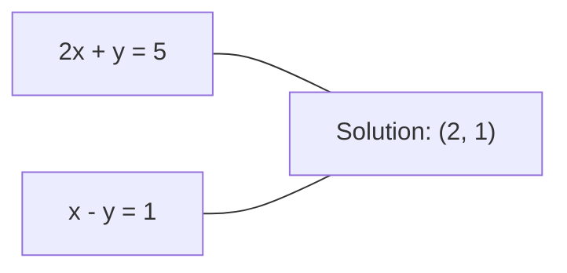
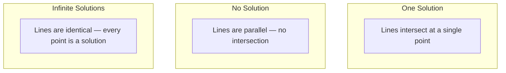

# 17 · 线性方程组

> 求解 Ax = b 是数学中最古老的问题——而它至今仍在驱动着你的神经网络。

**类型：** 构建（Build）
**语言：** Python
**前置：** 第 1 阶段，第 01 课（线性代数直觉）、第 02 课（向量与矩阵）、第 03 课（矩阵变换）
**时长：** 约 120 分钟

## 学习目标

- 使用带「部分主元选取（partial pivoting）」的「高斯消元法（Gaussian elimination）」与回代求解 Ax = b
- 用「LU 分解」、「QR 分解」和「Cholesky 分解」对矩阵进行因式分解，并解释各自适用的场景
- 推导「最小二乘（least squares）」的「正规方程（normal equations）」，并将其与线性回归和岭回归联系起来
- 用「条件数（condition number）」诊断「病态（ill-conditioned）」方程组，并通过正则化对其进行稳定化处理

## 问题

每次训练线性回归，你都在求解一个线性方程组。每次计算最小二乘拟合，你都在求解一个线性方程组。每次某个神经网络层计算 `y = Wx + b`，它都在求解线性方程组的一侧。当你加入正则化时，你修改了这个方程组。当你使用「高斯过程（Gaussian processes）」时，你对一个矩阵做了因式分解。当你为了「马氏距离（Mahalanobis distance）」而对协方差矩阵求逆时，你在求解一个线性方程组。

方程 Ax = b 无处不在。A 是已知系数构成的矩阵，b 是已知输出构成的向量，x 是你想求的未知数向量。在线性回归中，A 是你的数据矩阵，b 是你的目标向量，x 是权重向量。整个模型可归结为：找到使 Ax 尽可能接近 b 的 x。

本课从零开始构建求解该方程的每一种主要方法。你将理解为什么有些方法快、有些方法稳定，为什么有些方法只适用于方阵方程组、而另一些能处理「超定（overdetermined）」方程组，以及为什么矩阵的条件数决定了你的答案是否还有任何意义。

## 概念

### Ax = b 的几何含义

线性方程组有几何上的解释。每个方程定义一个「超平面（hyperplane）」。解就是所有超平面相交的点（或点集）。

```
2x + y = 5          二维平面上的两条直线。
x - y  = 1          它们相交于 x=2, y=1。
```



可能出现三种情况：



在矩阵形式下，「唯一解」意味着 A 可逆。「无解」意味着方程组不相容。「无穷多解」意味着 A 有「零空间（null space）」。大多数机器学习问题都属于「无精确解」这一类，因为你的方程（数据点）比未知数（参数）更多。这正是最小二乘登场的地方。

### 列视角 vs 行视角

阅读 Ax = b 有两种方式。

**行视角。** A 的每一行定义一个方程。每个方程是一个超平面。解就是它们全部相交的位置。

**列视角。** A 的每一列是一个向量。问题变成：A 的列向量做怎样的线性组合才能产生 b？

```
A = | 2  1 |    b = | 5 |
    | 1 -1 |        | 1 |

行视角：同时求解 2x + y = 5 和 x - y = 1。

列视角：找到 x1, x2 使得：
  x1 * [2, 1] + x2 * [1, -1] = [5, 1]
  2 * [2, 1] + 1 * [1, -1] = [4+1, 2-1] = [5, 1]   验证通过。
```

列视角更本质。如果 b 落在 A 的「列空间（column space）」内，方程组就有解。如果不在，你就在列空间内找最接近 b 的点。那个最接近的点就是最小二乘解。

### 高斯消元法

高斯消元法把 Ax = b 变换成一个上三角方程组 Ux = c，然后通过回代求解。它是最直接的方法。

算法：

```
1. 对每一列 k（主元列）：
   a. 在列 k 中第 k 行及其下方找到绝对值最大的元素（部分主元选取）。
   b. 将该行与第 k 行交换。
   c. 对 k 下方的每一行 i：
      - 计算乘数 m = A[i][k] / A[k][k]
      - 从第 i 行减去 m 倍的第 k 行。
2. 回代：从最后一个方程往上逐个求解。
```

示例：

```
原始矩阵:
| 2  1  1 | 8 |       R2 = R2 - (2)R1     | 2  1   1 |  8 |
| 4  3  3 |20 |  -->  R3 = R3 - (1)R1 --> | 0  1   1 |  4 |
| 2  3  1 |12 |                            | 0  2   0 |  4 |

                       R3 = R3 - (2)R2     | 2  1   1 |  8 |
                                       --> | 0  1   1 |  4 |
                                           | 0  0  -2 | -4 |

回代:
  -2 * x3 = -4    -->  x3 = 2
  x2 + 2  = 4     -->  x2 = 2
  2*x1 + 2 + 2 = 8 --> x1 = 2
```

高斯消元法的代价是 O(n^3) 次运算。对于 1000x1000 的方程组，这约为十亿次浮点运算。这很快，但如果你需要用同一个 A 求解多个方程组，还能做得更好。

### 部分主元选取：为什么它重要

不做主元选取，高斯消元法可能失败或产生垃圾结果。如果主元元素为零，你会除以零。如果它很小，你会放大舍入误差。

```
糟糕的主元:                       使用部分主元选取:
| 0.001  1 | 1.001 |            先交换行:
| 1      1 | 2     |            | 1      1 | 2     |
                                 | 0.001  1 | 1.001 |
m = 1/0.001 = 1000              m = 0.001/1 = 0.001
R2 = R2 - 1000*R1               R2 = R2 - 0.001*R1
| 0.001  1     | 1.001   |      | 1      1     | 2     |
| 0     -999   | -999.0  |      | 0      0.999 | 0.999 |

x2 = 1.000 (正确)              x2 = 1.000 (正确)
x1 = (1.001 - 1)/0.001          x1 = (2 - 1)/1 = 1.000 (正确)
   = 0.001/0.001 = 1.000        稳定，因为乘数很小。
```

在精度有限的浮点运算中，不做主元选取的版本会丢失有效数字。部分主元选取总是选择可用的最大主元，以最小化误差的放大。

### LU 分解

LU 分解把 A 分解为一个下三角矩阵 L 和一个上三角矩阵 U：A = LU。L 矩阵存储高斯消元过程中的乘数。U 矩阵是消元的结果。

```
A = L @ U

| 2  1  1 |   | 1  0  0 |   | 2  1   1 |
| 4  3  3 | = | 2  1  0 | @ | 0  1   1 |
| 2  3  1 |   | 1  2  1 |   | 0  0  -2 |
```

为什么要做分解而不是直接消元？因为一旦你有了 L 和 U，对任意新的 b 求解 Ax = b 只需 O(n^2)：

```
Ax = b
LUx = b
令 y = Ux:
  Ly = b    (前代, O(n^2))
  Ux = y    (回代, O(n^2))
```

O(n^3) 的代价在分解时只支付一次。此后每次求解都是 O(n^2)。如果你需要用同一个 A、不同的 b 向量求解 1000 个方程组，LU 分解能把总工作量节省约 1000/3 倍。

加入部分主元选取后，你得到 PA = LU，其中 P 是记录行交换的「置换矩阵（permutation matrix）」。

### QR 分解

QR 分解把 A 分解为一个正交矩阵 Q 和一个上三角矩阵 R：A = QR。

「正交矩阵（orthogonal matrix）」具有性质 Q^T Q = I。它的列是「标准正交（orthonormal）」向量。乘以 Q 会保持长度和角度不变。

```
A = Q @ R

Q 具有标准正交的列: Q^T Q = I
R 是上三角矩阵

求解 Ax = b:
  QRx = b
  Rx = Q^T b    (只需乘以 Q^T, 无需求逆)
  回代得到 x。
```

在求解最小二乘问题时，QR 在数值上比 LU 更稳定。「格拉姆-施密特（Gram-Schmidt）」过程逐列构建 Q：

```
给定 A 的各列 a1, a2, ...:

q1 = a1 / ||a1||

q2 = a2 - (a2 . q1) * q1        (减去在 q1 上的投影)
q2 = q2 / ||q2||                (归一化)

q3 = a3 - (a3 . q1) * q1 - (a3 . q2) * q2
q3 = q3 / ||q3||

R[i][j] = qi . aj    其中 i <= j
```

每一步都移除沿所有先前 q 向量的分量，只留下新的正交方向。

### Cholesky 分解

当 A 是「对称（symmetric）」（A = A^T）且「正定（positive definite）」（所有特征值为正）时，你可以把它分解为 A = L L^T，其中 L 是下三角矩阵。这就是 Cholesky 分解。

```
A = L @ L^T

| 4  2 |   | 2  0 |   | 2  1 |
| 2  5 | = | 1  2 | @ | 0  2 |

L[i][i] = sqrt(A[i][i] - sum(L[i][k]^2 for k < i))
L[i][j] = (A[i][j] - sum(L[i][k]*L[j][k] for k < j)) / L[j][j]    其中 i > j
```

Cholesky 比 LU 快一倍，且只需一半的存储。它只适用于对称正定矩阵，但这类矩阵随处可见：

- 协方差矩阵是对称「半正定（positive semi-definite）」的（加上正则化后为正定）。
- 高斯过程中的核矩阵是对称正定的。
- 凸函数在最小值处的「海森矩阵（Hessian）」是对称正定的。
- A^T A 总是对称半正定的。

在高斯过程中，你用 Cholesky 对核矩阵 K 做分解，然后求解 K alpha = y 来得到预测均值。Cholesky 因子还能给出「边际似然（marginal likelihood）」所需的对数行列式：log det(K) = 2 * sum(log(diag(L)))。

### 最小二乘：当 Ax = b 没有精确解时

如果 A 是 m x n 且 m > n（方程多于未知数），方程组就是超定的。它没有精确解。取而代之，你最小化平方误差：

```
minimize ||Ax - b||^2

这是残差平方和:
  sum((A[i,:] @ x - b[i])^2 for i in range(m))
```

最小化解满足正规方程：

```
A^T A x = A^T b
```

推导：展开 ||Ax - b||^2 = (Ax - b)^T (Ax - b) = x^T A^T A x - 2 x^T A^T b + b^T b。对 x 求梯度，令其为零：2 A^T A x - 2 A^T b = 0。

```
原始方程组 (超定, 4 个方程, 2 个未知数):
| 1  1 |         | 3 |
| 1  2 | x     = | 5 |       没有精确的 x 能满足全部 4 个方程。
| 1  3 |         | 6 |
| 1  4 |         | 8 |

正规方程:
A^T A = | 4  10 |    A^T b = | 22 |
        | 10 30 |            | 63 |

求解: x = [1.5, 1.7]

这就是线性回归。x[0] 是截距, x[1] 是斜率。
```

### 正规方程 = 线性回归

这个联系是精确的。在线性回归中，你的数据矩阵 X 每个样本占一行、每个特征占一列。你的目标向量 y 每个样本占一项。权重向量 w 满足：

```
X^T X w = X^T y
w = (X^T X)^(-1) X^T y
```

这就是线性回归的「闭式解（closed-form solution）」。每次调用 `sklearn.linear_model.LinearRegression.fit()` 都在计算它（或通过 QR、SVD 计算等价结果）。

往矩阵上加一个正则化项 lambda * I，你就得到岭回归：

```
(X^T X + lambda * I) w = X^T y
w = (X^T X + lambda * I)^(-1) X^T y
```

正则化使矩阵的条件更好（更容易精确求逆），并通过把权重收缩向零来防止过拟合。当 lambda > 0 时，矩阵 X^T X + lambda * I 总是对称正定的，因此你可以用 Cholesky 求解它。

### 伪逆（Moore-Penrose）

「伪逆（pseudoinverse）」A+ 把矩阵求逆推广到非方阵和奇异矩阵。对任意矩阵 A：

```
x = A+ b

其中 A+ = V Sigma+ U^T    (通过 SVD 计算)
```

Sigma+ 由对每个非零「奇异值（singular value）」取倒数再转置结果而得。若 A = U Sigma V^T，则 A+ = V Sigma+ U^T。

```
A = U Sigma V^T        (SVD)

Sigma = | 5  0 |       Sigma+ = | 1/5  0  0 |
        | 0  2 |                | 0  1/2  0 |
        | 0  0 |

A+ = V Sigma+ U^T
```

伪逆给出「最小范数（minimum-norm）」的最小二乘解。如果方程组：
- 有唯一解：A+ b 给出它。
- 无解：A+ b 给出最小二乘解。
- 有无穷多解：A+ b 给出 ||x|| 最小的那个。

NumPy 的 `np.linalg.lstsq` 和 `np.linalg.pinv` 内部都使用 SVD。

### 条件数

条件数衡量解对输入微小变化的敏感程度。对于矩阵 A，条件数为：

```
kappa(A) = ||A|| * ||A^(-1)|| = sigma_max / sigma_min
```

其中 sigma_max 和 sigma_min 是最大和最小的奇异值。

```
良态 (kappa ~ 1):                    病态 (kappa ~ 10^15):
b 的微小变化 -->                     b 的微小变化 -->
x 的微小变化                          x 的巨大变化

| 2  0 |   kappa = 2/1 = 2          | 1   1          |   kappa ~ 10^15
| 0  1 |   求解安全                   | 1   1+10^(-15) |   解是垃圾
```

经验法则：
- kappa < 100：安全，解是精确的。
- kappa ~ 10^k：你从浮点运算中损失约 k 位精度。
- kappa ~ 10^16（对 float64 而言）：解毫无意义。矩阵实际上是奇异的。

在机器学习中，当特征近乎「共线（collinear）」时就会出现病态。正则化（加上 lambda * I）把条件数从 sigma_max / sigma_min 改善为 (sigma_max + lambda) / (sigma_min + lambda)。

### 迭代法：共轭梯度

对于非常大的「稀疏（sparse）」方程组（数百万未知数），LU 或 Cholesky 这类「直接法（direct methods）」太昂贵了。「迭代法（iterative methods）」通过多次迭代不断改进一个猜测值来逼近解。

「共轭梯度（conjugate gradient, CG）」在 A 为对称正定时求解 Ax = b。它在至多 n 次迭代内（在精确算术下）找到精确解，但如果 A 的特征值聚集，通常收敛得快得多。

```
算法概要:
  x0 = 初始猜测 (通常为零)
  r0 = b - A x0           (残差)
  p0 = r0                 (搜索方向)

  对 k = 0, 1, 2, ...:
    alpha = (rk . rk) / (pk . A pk)
    x_{k+1} = xk + alpha * pk
    r_{k+1} = rk - alpha * A pk
    beta = (r_{k+1} . r_{k+1}) / (rk . rk)
    p_{k+1} = r_{k+1} + beta * pk
    if ||r_{k+1}|| < tolerance: stop
```

CG 用于：
- 大规模优化（Newton-CG 方法）
- 求解偏微分方程（PDE）离散化
- 核矩阵太大无法分解的核方法
- 为其他迭代求解器做预条件

收敛速度取决于条件数。条件更好的方程组收敛更快，这是正则化有帮助的又一个原因。

### 全局图景：何时用哪种方法

| 方法 | 要求 | 代价 | 适用场景 |
|--------|-------------|------|----------|
| 高斯消元法 | 方阵, 非奇异 A | O(n^3) | 一次性求解方阵方程组 |
| LU 分解 | 方阵, 非奇异 A | O(n^3) 分解 + O(n^2) 求解 | 用同一个 A 多次求解 |
| QR 分解 | 任意 A (m >= n) | O(mn^2) | 最小二乘, 数值稳定 |
| Cholesky | 对称正定 A | O(n^3/3) | 协方差矩阵, 高斯过程, 岭回归 |
| 正规方程 | 超定 (m > n) | O(mn^2 + n^3) | 线性回归 (n 较小) |
| SVD / 伪逆 | 任意 A | O(mn^2) | 秩亏方程组, 最小范数解 |
| 共轭梯度 | 对称正定, 稀疏 A | O(n * k * nnz) | 大型稀疏方程组, k = 迭代次数 |

### 与机器学习的联系

本课中的每一种方法都出现在生产环境的机器学习中：

**线性回归。** 闭式解求解正规方程 X^T X w = X^T y。这通过 Cholesky（若 n 较小）、QR（若需要数值稳定性）或 SVD（若矩阵可能秩亏）来完成。

**岭回归。** 往 X^T X 上加 lambda * I。正则化后的方程组 (X^T X + lambda * I) w = X^T y 总能通过 Cholesky 求解，因为当 lambda > 0 时 X^T X + lambda * I 是对称正定的。

**高斯过程。** 预测均值需要求解 K alpha = y，其中 K 是核矩阵。对 K 做 Cholesky 分解是标准做法。对数边际似然使用 log det(K) = 2 sum(log(diag(L)))。

**神经网络初始化。** 「正交初始化（orthogonal initialization）」使用 QR 分解来创建列为标准正交的权重矩阵。这能防止深层网络中的信号坍缩。

**预条件。** 大规模优化器使用「不完全 Cholesky（incomplete Cholesky）」或「不完全 LU（incomplete LU）」作为共轭梯度求解器的「预条件子（preconditioner）」。

**特征工程。** X^T X 的条件数告诉你特征是否共线。如果 kappa 很大，就删除特征或加入正则化。

## 动手构建

### 第 1 步：带部分主元选取的高斯消元法

```python
import numpy as np

def gaussian_elimination(A, b):
    n = len(b)
    Ab = np.hstack([A.astype(float), b.reshape(-1, 1).astype(float)])

    for k in range(n):
        max_row = k + np.argmax(np.abs(Ab[k:, k]))
        Ab[[k, max_row]] = Ab[[max_row, k]]

        if abs(Ab[k, k]) < 1e-12:
            raise ValueError(f"Matrix is singular or nearly singular at pivot {k}")

        for i in range(k + 1, n):
            m = Ab[i, k] / Ab[k, k]
            Ab[i, k:] -= m * Ab[k, k:]

    x = np.zeros(n)
    for i in range(n - 1, -1, -1):
        x[i] = (Ab[i, -1] - Ab[i, i+1:n] @ x[i+1:n]) / Ab[i, i]

    return x
```

### 第 2 步：LU 分解

```python
def lu_decompose(A):
    n = A.shape[0]
    L = np.eye(n)
    U = A.astype(float).copy()
    P = np.eye(n)

    for k in range(n):
        max_row = k + np.argmax(np.abs(U[k:, k]))
        if max_row != k:
            U[[k, max_row]] = U[[max_row, k]]
            P[[k, max_row]] = P[[max_row, k]]
            if k > 0:
                L[[k, max_row], :k] = L[[max_row, k], :k]

        for i in range(k + 1, n):
            L[i, k] = U[i, k] / U[k, k]
            U[i, k:] -= L[i, k] * U[k, k:]

    return P, L, U

def lu_solve(P, L, U, b):
    n = len(b)
    Pb = P @ b.astype(float)

    y = np.zeros(n)
    for i in range(n):
        y[i] = Pb[i] - L[i, :i] @ y[:i]

    x = np.zeros(n)
    for i in range(n - 1, -1, -1):
        x[i] = (y[i] - U[i, i+1:] @ x[i+1:]) / U[i, i]

    return x
```

### 第 3 步：Cholesky 分解

```python
def cholesky(A):
    n = A.shape[0]
    L = np.zeros_like(A, dtype=float)

    for i in range(n):
        for j in range(i + 1):
            s = A[i, j] - L[i, :j] @ L[j, :j]
            if i == j:
                if s <= 0:
                    raise ValueError("Matrix is not positive definite")
                L[i, j] = np.sqrt(s)
            else:
                L[i, j] = s / L[j, j]

    return L
```

### 第 4 步：通过正规方程做最小二乘

```python
def least_squares_normal(A, b):
    AtA = A.T @ A
    Atb = A.T @ b
    return gaussian_elimination(AtA, Atb)

def ridge_regression(A, b, lam):
    n = A.shape[1]
    AtA = A.T @ A + lam * np.eye(n)
    Atb = A.T @ b
    L = cholesky(AtA)
    y = np.zeros(n)
    for i in range(n):
        y[i] = (Atb[i] - L[i, :i] @ y[:i]) / L[i, i]
    x = np.zeros(n)
    for i in range(n - 1, -1, -1):
        x[i] = (y[i] - L.T[i, i+1:] @ x[i+1:]) / L.T[i, i]
    return x
```

### 第 5 步：条件数

```python
def condition_number(A):
    U, S, Vt = np.linalg.svd(A)
    return S[0] / S[-1]
```

## 实战运用

把各部分组合起来，在真实数据上做线性回归和岭回归：

```python
np.random.seed(42)
X_raw = np.random.randn(100, 3)
w_true = np.array([2.0, -1.0, 0.5])
y = X_raw @ w_true + np.random.randn(100) * 0.1

X = np.column_stack([np.ones(100), X_raw])

w_ols = least_squares_normal(X, y)
print(f"OLS weights (ours):    {w_ols}")

w_np = np.linalg.lstsq(X, y, rcond=None)[0]
print(f"OLS weights (numpy):   {w_np}")
print(f"Max difference: {np.max(np.abs(w_ols - w_np)):.2e}")

w_ridge = ridge_regression(X, y, lam=1.0)
print(f"Ridge weights (ours):  {w_ridge}")

from sklearn.linear_model import Ridge
ridge_sk = Ridge(alpha=1.0, fit_intercept=False)
ridge_sk.fit(X, y)
print(f"Ridge weights (sklearn): {ridge_sk.coef_}")
```

## 交付成果

本课产出：
- `code/linear_systems.py`，包含从零实现的高斯消元法、LU 分解、Cholesky 分解、最小二乘和岭回归
- 一个可运行的演示，证明正规方程与 sklearn 的 LinearRegression 产生相同的权重

## 练习

1. 使用你自己的高斯消元法、你的 LU 求解器以及 `np.linalg.solve` 求解方程组 `[[1,2,3],[4,5,6],[7,8,10]] x = [6, 15, 27]`。验证三者给出的答案在浮点容差内一致。

2. 生成一个 50x5 的随机矩阵 X 和目标 y = X @ w_true + noise。分别用正规方程、QR（通过 `np.linalg.qr`）、SVD（通过 `np.linalg.svd`）和 `np.linalg.lstsq` 求解 w。比较全部四个解。测量 X^T X 的条件数，并解释它如何影响你信任哪种方法。

3. 通过让两列几乎相同（例如 column 2 = column 1 + 1e-10 * noise）来构造一个近乎奇异的矩阵。计算它的条件数。在加和不加正则化（加 0.01 * I）的情况下分别求解 Ax = b。比较两者的解和残差。解释为什么正则化有帮助。

4. 为一个 100x100 的随机对称正定矩阵实现共轭梯度算法。统计它收敛到容差 1e-8 需要多少次迭代。与理论最大值 n 次迭代作比较。

5. 在大小为 10、50、200、500 的对称正定矩阵上，对你的 Cholesky 求解器、你的 LU 求解器以及 `np.linalg.solve` 计时。绘制结果图。验证 Cholesky 大约比 LU 快 2 倍。

## 关键术语

| 术语 | 人们怎么说 | 它实际指什么 |
|------|----------------|----------------------|
| 线性方程组（Linear system） | "解出 x" | 一组线性方程 Ax = b。求 x 意味着找到在变换 A 下能产生输出 b 的输入。 |
| 高斯消元法（Gaussian elimination） | "行约简" | 用行变换系统性地把对角线下方的元素清零，得到一个可通过回代求解的上三角方程组。O(n^3)。 |
| 部分主元选取（Partial pivoting） | "为稳定性交换行" | 在对列 k 消元前，把该列中绝对值最大的行交换到主元位置。防止除以小数。 |
| LU 分解（LU decomposition） | "分解成三角形" | 写成 A = LU，其中 L 是下三角（存储乘数）、U 是上三角（消元后的矩阵）。把 O(n^3) 的代价摊销到多次求解上。 |
| QR 分解（QR decomposition） | "正交因式分解" | 写成 A = QR，其中 Q 的列标准正交、R 是上三角。在最小二乘问题上比 LU 更稳定。 |
| Cholesky 分解（Cholesky decomposition） | "矩阵的平方根" | 对对称正定的 A，写成 A = LL^T。代价是 LU 的一半。用于协方差矩阵、核矩阵和岭回归。 |
| 最小二乘（Least squares） | "当无法精确时的最佳拟合" | 当方程组超定（方程多于未知数）时，最小化残差平方和 ||Ax - b||^2。 |
| 正规方程（Normal equations） | "微积分捷径" | A^T A x = A^T b。令 ||Ax - b||^2 的梯度为零。它就是线性回归的闭式解。 |
| 伪逆（Pseudoinverse） | "非方阵的求逆" | 通过 SVD 得 A+ = V Sigma+ U^T。为任意矩阵（方阵或矩形、奇异与否）给出最小范数最小二乘解。 |
| 条件数（Condition number） | "这个答案有多可信" | kappa = sigma_max / sigma_min。衡量对输入扰动的敏感度。约损失 log10(kappa) 位精度。 |
| 岭回归（Ridge regression） | "正则化的最小二乘" | 求解 (X^T X + lambda I) w = X^T y。加 lambda I 改善条件并把权重收缩向零。防止过拟合。 |
| 共轭梯度（Conjugate gradient） | "大矩阵的迭代 Ax=b" | 针对对称正定方程组的迭代求解器。在至多 n 步内收敛。适用于分解过于昂贵的大型稀疏方程组。 |
| 超定方程组（Overdetermined system） | "数据多于参数" | m x n 方程组中 m > n。不存在精确解。最小二乘找出最佳近似。这正是每一个回归问题。 |
| 回代（Back substitution） | "自下而上求解" | 给定上三角方程组，先解最后一个方程，再向后逐个代入。O(n^2)。 |
| 前代（Forward substitution） | "自上而下求解" | 给定下三角方程组，先解第一个方程，再向前逐个代入。O(n^2)。用于 LU 求解的 L 步。 |

## 延伸阅读

- [MIT 18.06：线性代数](https://ocw.mit.edu/courses/18-06-linear-algebra-spring-2010/)（Gilbert Strang）—— 关于线性方程组与矩阵分解的权威课程
- [Numerical Linear Algebra](https://people.maths.ox.ac.uk/trefethen/text.html)（Trefethen & Bau）—— 理解数值稳定性、条件性以及算法为何失败的标准参考书
- [Matrix Computations](https://www.cs.cornell.edu/cv/GolubVanLoan4/golubandvanloan.htm)（Golub & Van Loan）—— 涵盖每一种矩阵算法的百科全书式参考书
- [3Blue1Brown：逆矩阵](https://www.3blue1brown.com/lessons/inverse-matrices)—— 关于求解 Ax = b 的几何含义的可视化直觉
