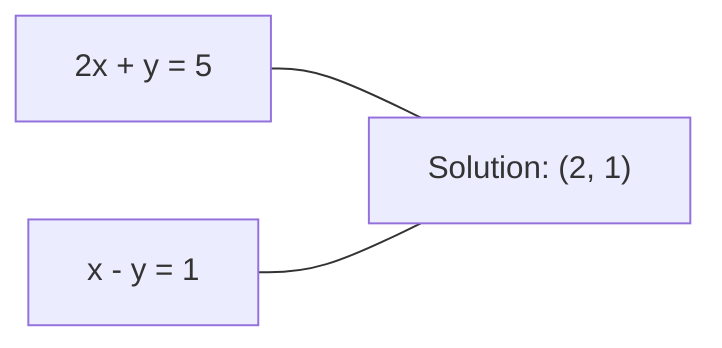
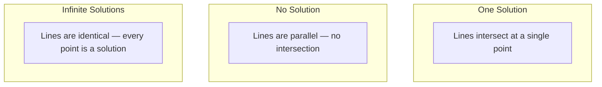

# 线性系统

> 求解Ax = b是数学中仍然运行神经网络的最古老的问题。

** 类型：** 构建
** 语言：** Python
** 先决条件：** 第1阶段，第01课（线性代数直觉）、02课（载体与矩阵）、03课（矩阵变换）
** 时间：** ~120分钟

## 学习目标

- 使用部分旋转和回替换的高斯消除来求解Ax = b
- 具有LU、QR和Cholesky分解的因子矩阵，并解释每个矩阵何时合适
- 推导出最小平方的正规方程并将它们连接到线性和岭回归
- 使用条件数诊断病态系统并应用正规化来稳定它们

## 问题

每次训练线性回归时，你都会解决一个线性系统。每次计算最小平方匹配时，您就求解了一个线性系统。每次神经网络层计算“y = Wx + b”时，它都在评估线性系统的一侧。当您添加规则化时，您会修改系统。当您使用高斯过程时，您需要对矩阵进行分解。当您逆取Mahalanobis距离的协方差矩阵时，您就可以求解一个线性系统。

方程Ax = b随处可见。A是已知系数的矩阵。b是已知输出的载体。x是您想要找到的未知数的载体。在线性回归中，A是您的数据矩阵，b是您的目标载体，x是权重载体。整个模型简化为：找到x，使Ax尽可能接近b。

本课建立了从头开始求解该方程的所有主要方法。您将理解为什么有些方法很快而另一些方法稳定，为什么有些方法仅适用于平方系统而另一些方法处理超定的方法，以及为什么您的矩阵的条件数决定您的答案是否有任何意义。

## 概念

### Ax = b的几何含义

线性方程组具有几何解释。每个方程定义了一个超平面。解是所有超平面相交的点（或一组点）。

```
2x + y = 5          Two lines in 2D.
x - y  = 1          They intersect at x=2, y=1.
```



可能会发生三件事：



在矩阵形式中，“一个解”意味着A是可逆的。“无解”意味着系统不一致。“无限解”意味着A有零空间。大多数ML问题都属于“无精确解”类别，因为方程（数据点）多于未知数（参数）。这就是最小平方的用武之地。

### 列图vs行图

有两种方法可以读取Ax = b。

** 行图片。** A的每一行定义一个方程。每个方程都是一个超平面。解决方案是它们的交叉点。

** 专栏图片。** A的每一列都是一个载体。问题变成了：A列的哪个线性组合会产生b？

```
A = | 2  1 |    b = | 5 |
    | 1 -1 |        | 1 |

Row picture: solve 2x + y = 5 and x - y = 1 simultaneously.

Column picture: find x1, x2 such that:
  x1 * [2, 1] + x2 * [1, -1] = [5, 1]
  2 * [2, 1] + 1 * [1, -1] = [4+1, 2-1] = [5, 1]   check.
```

专栏图片更基本。如果b位于A的列空间中，则系统有解。如果b不这样做，则会找到列空间中最近的点。最接近的点是最小平方解。

### 高斯消去

高斯消除将Ax = b转换为上三角系Ux = c，您可以通过反替换来求解该系统。这是最直接的方法。

算法：

```
1. For each column k (the pivot column):
   a. Find the largest entry in column k at or below row k (partial pivoting).
   b. Swap that row with row k.
   c. For each row i below k:
      - Compute multiplier m = A[i][k] / A[k][k]
      - Subtract m times row k from row i.
2. Back substitute: solve from the last equation upward.
```

示例：

```
Original:
| 2  1  1 | 8 |       R2 = R2 - (2)R1     | 2  1   1 |  8 |
| 4  3  3 |20 |  -->  R3 = R3 - (1)R1 --> | 0  1   1 |  4 |
| 2  3  1 |12 |                            | 0  2   0 |  4 |

                       R3 = R3 - (2)R2     | 2  1   1 |  8 |
                                       --> | 0  1   1 |  4 |
                                           | 0  0  -2 | -4 |

Back substitute:
  -2 * x3 = -4    -->  x3 = 2
  x2 + 2  = 4     -->  x2 = 2
  2*x1 + 2 + 2 = 8 --> x1 = 2
```

高斯消除的运算成本为O（n^3）。对于1000 x1000系统来说，这大约是十亿次浮点操作。速度很快，但如果需要用相同的A解决多个系统，则可以做得更好。

### 部分旋转：为什么重要

如果没有旋转，高斯消除可能会失败或产生垃圾。如果枢轴元素为零，则除以零。如果它很小，则会放大舍入误差。

```
Bad pivot:                       With partial pivoting:
| 0.001  1 | 1.001 |            Swap rows first:
| 1      1 | 2     |            | 1      1 | 2     |
                                 | 0.001  1 | 1.001 |
m = 1/0.001 = 1000              m = 0.001/1 = 0.001
R2 = R2 - 1000*R1               R2 = R2 - 0.001*R1
| 0.001  1     | 1.001   |      | 1      1     | 2     |
| 0     -999   | -999.0  |      | 0      0.999 | 0.999 |

x2 = 1.000 (correct)            x2 = 1.000 (correct)
x1 = (1.001 - 1)/0.001          x1 = (2 - 1)/1 = 1.000 (correct)
   = 0.001/0.001 = 1.000        Stable because the multiplier is small.
```

在精度有限的浮点算术中，非旋转版本可能会丢失有效数字。部分旋转总是选择最大的可用旋转轴以最大限度地减少误差放大。

### LU分解

LU分解将A因子分解为下三角矩阵L和上三角矩阵U：A = LU。L矩阵存储高斯消除法的乘数。U矩阵是消除的结果。

```
A = L @ U

| 2  1  1 |   | 1  0  0 |   | 2  1   1 |
| 4  3  3 | = | 2  1  0 | @ | 0  1   1 |
| 2  3  1 |   | 1  2  1 |   | 0  0  -2 |
```

为什么要考虑因素而不是仅仅消除？因为一旦你有了L和U，求解Ax = b以获得任何新的b只需O（n2）：

```
Ax = b
LUx = b
Let y = Ux:
  Ly = b    (forward substitution, O(n^2))
  Ux = y    (back substitution, O(n^2))
```

因子分解期间支付一次O（n#3）成本。每个后续解都是O（n#2）。如果您需要解决1000个具有相同A但不同b载体的系统，LU可以节省1000/3的总工作量。

使用部分旋转，您会得到PA = LU，其中P是记录行交换的排列矩阵。

### QR分解

QR将因子A分解为垂直矩阵Q和上三角矩阵R：A = QR。

正交矩阵具有性质Q ' T Q = I。它的列是垂直垂直的。乘以Q可以保留长度和角度。

```
A = Q @ R

Q has orthonormal columns: Q^T Q = I
R is upper triangular

To solve Ax = b:
  QRx = b
  Rx = Q^T b    (just multiply by Q^T, no inversion needed)
  Back substitute to get x.
```

对于解决最小平方问题，QR在数值上比LU更稳定。Gram-Schmidt流程逐列构建Q：

```
Given columns a1, a2, ... of A:

q1 = a1 / ||a1||

q2 = a2 - (a2 . q1) * q1        (subtract projection onto q1)
q2 = q2 / ||q2||                (normalize)

q3 = a3 - (a3 . q1) * q1 - (a3 . q2) * q2
q3 = q3 / ||q3||

R[i][j] = qi . aj    for i <= j
```

每一步都会删除所有先前q向的分量，只留下新的垂直方向。

### Cholesky分解

当A是对称的（A = A & T）且正值（所有特征值均为正值）时，您可以将其分解为A = L & T，其中L是下三角形。这是乔莱斯基的分解。

```
A = L @ L^T

| 4  2 |   | 2  0 |   | 2  1 |
| 2  5 | = | 1  2 | @ | 0  2 |

L[i][i] = sqrt(A[i][i] - sum(L[i][k]^2 for k < i))
L[i][j] = (A[i][j] - sum(L[i][k]*L[j][k] for k < j)) / L[j][j]    for i > j
```

Cholesky的速度是LU的两倍，并且需要一半的存储空间。它仅适用于对称正定矩阵，但这些矩阵不断出现：

- 协方差矩阵是对称半定的（带正规化的正值）。
- 高斯过程中的核矩阵是对称正定的。
- 凸函数在最小值处的Hessian是对称正定的。
- A^T A总是对称半正定的。

在高斯过程中，使用Cholesky对核矩阵K进行因子分解，然后求解K Alpha = y以获得预测平均值。Cholesky因子还为您提供了边际可能性的log决定因子：log det（K）= 2 * sum（log（diag（L）。

### 最小平方：当Ax = b时没有精确解

如果A为m x n，m > n（方程多于未知数），则系统超定。没有确切的解决方案。相反，您可以最小化平方误差：

```
minimize ||Ax - b||^2

This is the sum of squared residuals:
  sum((A[i,:] @ x - b[i])^2 for i in range(m))
```

最小化器满足正规方程：

```
A^T A x = A^T b
```

派生：扩展||Ax-b|| ' 2 =（Ax-b）' T（Ax-b）= x ' TA ' T ' T ' b '; T ' b + b '。取相对于x的梯度，将其设置为零：2 A & T & x - 2 A & T & b = 0。

```
Original system (overdetermined, 4 equations, 2 unknowns):
| 1  1 |         | 3 |
| 1  2 | x     = | 5 |       No exact x satisfies all 4 equations.
| 1  3 |         | 6 |
| 1  4 |         | 8 |

Normal equations:
A^T A = | 4  10 |    A^T b = | 22 |
        | 10 30 |            | 63 |

Solve: x = [1.5, 1.7]

This is linear regression. x[0] is the intercept, x[1] is the slope.
```

### 正态方程=线性回归

联系是准确的。在线性回归中，您的数据矩阵X每个样本有一行，每个特征有一列。您的目标载体y每个样本有一个条目。权重载体w满足：

```
X^T X w = X^T y
w = (X^T X)^(-1) X^T y
```

这是线性回归的封闭形式解。每次调用' sklearn.linear_model.LinearRegression.fit（）'都会计算此值（或通过QR或DID计算等效值）。

在矩阵中添加一个正则化项lambda * I，你会得到岭回归：

```
(X^T X + lambda * I) w = X^T y
w = (X^T X + lambda * I)^(-1) X^T y
```

正规化使矩阵得到更好的条件化（更容易准确地倒置），并通过将权重缩小到零来防止过度匹配。当拉姆达> 0时，矩阵X & T X +拉姆达 * I始终对称正定，因此您可以使用Cholesky来求解它。

### 伪逆（Moore-Penrose）

伪逆A+将矩阵求逆推广到非平方和奇异矩阵。对于任何矩阵A：

```
x = A+ b

where A+ = V Sigma+ U^T    (computed via SVD)
```

Sigma+是通过取每个非零奇异值的倒数并调换结果而形成的。如果A = U Sigma V ' T，那么A+ = V Sigma+ U ' T。

```
A = U Sigma V^T        (SVD)

Sigma = | 5  0 |       Sigma+ = | 1/5  0  0 |
        | 0  2 |                | 0  1/2  0 |
        | 0  0 |

A+ = V Sigma+ U^T
```

伪逆给出最小范最小平方解。如果系统具有：
- 一个解决方案：A+ b给出它。
- 无解：A+ b给出最小平方解。
- 无限解：A+ b给出最小解||X||.

NumPy的' mp.linalg.lstsq '和' pp.linalg.pinv '都在内部使用了MVD。

### 条件数

条件数衡量解决方案对输入的微小变化的敏感性。对于矩阵A，条件数是：

```
kappa(A) = ||A|| * ||A^(-1)|| = sigma_max / sigma_min
```

其中西格玛_max和西格玛_min是最大和最小奇异值。

```
Well-conditioned (kappa ~ 1):        Ill-conditioned (kappa ~ 10^15):
Small change in b -->                Small change in b -->
small change in x                    huge change in x

| 2  0 |   kappa = 2/1 = 2          | 1   1          |   kappa ~ 10^15
| 0  1 |   safe to solve            | 1   1+10^(-15) |   solution is garbage
```

经验法则：
- Kappa < 100：安全，溶液准确。
- kappa ~ 10#k：您的浮点算术会损失大约k位数的精度。
- kappa ~ 10#16（对于float 64）：解决方案毫无意义。该矩阵实际上是奇异的。

在ML中，当特征几乎共线时，就会发生病态。正规化（添加拉姆达 * I）将条件数从西格玛_max /西格玛_min提高到（西格玛_max +拉姆）/（西格玛_min +拉姆）。

### 迭代方法：共轭梯度法

对于非常大的稀疏系统（数百万个未知数），LU或Cholesky等直接方法太昂贵。迭代方法通过在多次迭代中改进猜测来逼近解决方案。

当A是对称正值时，当A是对称正值时，卷积梯度（CG）求解Ax = b。它最多只需n次迭代（以精确算术方式）即可找到精确解，但如果A的特征值被聚集，通常收敛得更快。

```
Algorithm sketch:
  x0 = initial guess (often zero)
  r0 = b - A x0           (residual)
  p0 = r0                 (search direction)

  For k = 0, 1, 2, ...:
    alpha = (rk . rk) / (pk . A pk)
    x_{k+1} = xk + alpha * pk
    r_{k+1} = rk - alpha * A pk
    beta = (r_{k+1} . r_{k+1}) / (rk . rk)
    p_{k+1} = r_{k+1} + beta * pk
    if ||r_{k+1}|| < tolerance: stop
```

CG用于：
- 大规模优化（Newton-CG方法）
- 解决PDL离散化
- 核矩阵太大而无法考虑的核方法
- 其他迭代求解器的预处理

收敛速度取决于条件数。更好的条件系统收敛得更快，这是正规化有所帮助的另一个原因。

### 全貌：采用哪种方法时

| 方法 | 要求 | 成本 | 用例 |
|--------|-------------|------|----------|
| 高斯消去 | 方形，非奇异A | O（n#39;） | 平方系统的一次性求解 |
| LU分解 | 方形，非奇异A | O（n#3）因子+ O（n#2）解 | 具有相同A的多个求解 |
| QR分解 | 任何A（m >= n） | O（mn^2） | 最小平方，数字稳定 |
| Cholesky | 对称正定A | O（n#3/3） | 协方差矩阵、高斯过程、岭回归 |
| 正规方程 | 过度确定（m > n） | 时间复杂度O（mn^2 + n^3） | 线性回归（小n） |
| 奇异值/伪逆 | 任何A | O（mn^2） | 排名不足的系统，最小规范解决方案 |
| 共轭梯度 | 对称正定，稀疏A | 时间复杂度O（n * k * nnz） | 大型稀疏系统，k =迭代 |

### 连接到ML

本课中的每个方法都出现在产品ML中：

** 线性回归。**封闭形式的解求解正规方程X & T X w = X & Ti。这是通过Cholesky（如果n很小）或QR（如果数字稳定性很重要）或奇异值分解（如果矩阵可能是有级的）来完成的。

** 岭回归。**将Lambda * I添加到X ' T X。正规化系统（X & T X + ambda * I）w = X & T y始终可通过Cholesky求解，因为X & T X + ambda * I对于ambda & 0是对称正定的。

** 高斯过程。**预测平均值需要求解K Alpha = y，其中K是核矩阵。K的Cholesky因式分解是标准方法。log边际似然度使用log det（K）= 2 sum（log（diag（L）。

** 神经网络初始化。**正向初始化使用QR分解来创建其列为正向的权重矩阵。这可以防止深度网络中的信号崩溃。

** 预处理。**大规模优化器使用不完全Cholesky或不完全LU作为共乘梯度求解器的预条件。

** 功能工程。** X & T X的条件号告诉您您的特征是否共线。如果kappa很大，请删除功能或添加规则化。

## 建设党

### 第1步：部分旋转高斯消除

```python
import numpy as np

def gaussian_elimination(A, b):
    n = len(b)
    Ab = np.hstack([A.astype(float), b.reshape(-1, 1).astype(float)])

    for k in range(n):
        max_row = k + np.argmax(np.abs(Ab[k:, k]))
        Ab[[k, max_row]] = Ab[[max_row, k]]

        if abs(Ab[k, k]) < 1e-12:
            raise ValueError(f"Matrix is singular or nearly singular at pivot {k}")

        for i in range(k + 1, n):
            m = Ab[i, k] / Ab[k, k]
            Ab[i, k:] -= m * Ab[k, k:]

    x = np.zeros(n)
    for i in range(n - 1, -1, -1):
        x[i] = (Ab[i, -1] - Ab[i, i+1:n] @ x[i+1:n]) / Ab[i, i]

    return x
```

### 第2步：LU分解

```python
def lu_decompose(A):
    n = A.shape[0]
    L = np.eye(n)
    U = A.astype(float).copy()
    P = np.eye(n)

    for k in range(n):
        max_row = k + np.argmax(np.abs(U[k:, k]))
        if max_row != k:
            U[[k, max_row]] = U[[max_row, k]]
            P[[k, max_row]] = P[[max_row, k]]
            if k > 0:
                L[[k, max_row], :k] = L[[max_row, k], :k]

        for i in range(k + 1, n):
            L[i, k] = U[i, k] / U[k, k]
            U[i, k:] -= L[i, k] * U[k, k:]

    return P, L, U

def lu_solve(P, L, U, b):
    n = len(b)
    Pb = P @ b.astype(float)

    y = np.zeros(n)
    for i in range(n):
        y[i] = Pb[i] - L[i, :i] @ y[:i]

    x = np.zeros(n)
    for i in range(n - 1, -1, -1):
        x[i] = (y[i] - U[i, i+1:] @ x[i+1:]) / U[i, i]

    return x
```

### 第3步：胆固醇分解

```python
def cholesky(A):
    n = A.shape[0]
    L = np.zeros_like(A, dtype=float)

    for i in range(n):
        for j in range(i + 1):
            s = A[i, j] - L[i, :j] @ L[j, :j]
            if i == j:
                if s <= 0:
                    raise ValueError("Matrix is not positive definite")
                L[i, j] = np.sqrt(s)
            else:
                L[i, j] = s / L[j, j]

    return L
```

### 第4步：通过正规方程进行最小平方

```python
def least_squares_normal(A, b):
    AtA = A.T @ A
    Atb = A.T @ b
    return gaussian_elimination(AtA, Atb)

def ridge_regression(A, b, lam):
    n = A.shape[1]
    AtA = A.T @ A + lam * np.eye(n)
    Atb = A.T @ b
    L = cholesky(AtA)
    y = np.zeros(n)
    for i in range(n):
        y[i] = (Atb[i] - L[i, :i] @ y[:i]) / L[i, i]
    x = np.zeros(n)
    for i in range(n - 1, -1, -1):
        x[i] = (y[i] - L.T[i, i+1:] @ x[i+1:]) / L.T[i, i]
    return x
```

### 第5步：条件号

```python
def condition_number(A):
    U, S, Vt = np.linalg.svd(A)
    return S[0] / S[-1]
```

## 使用它

将实际数据的线性回归和岭回归放在一起：

```python
np.random.seed(42)
X_raw = np.random.randn(100, 3)
w_true = np.array([2.0, -1.0, 0.5])
y = X_raw @ w_true + np.random.randn(100) * 0.1

X = np.column_stack([np.ones(100), X_raw])

w_ols = least_squares_normal(X, y)
print(f"OLS weights (ours):    {w_ols}")

w_np = np.linalg.lstsq(X, y, rcond=None)[0]
print(f"OLS weights (numpy):   {w_np}")
print(f"Max difference: {np.max(np.abs(w_ols - w_np)):.2e}")

w_ridge = ridge_regression(X, y, lam=1.0)
print(f"Ridge weights (ours):  {w_ridge}")

from sklearn.linear_model import Ridge
ridge_sk = Ridge(alpha=1.0, fit_intercept=False)
ridge_sk.fit(X, y)
print(f"Ridge weights (sklearn): {ridge_sk.coef_}")
```

## 把它运

本课产生：
- ' code/linear_Systems.py '包含高斯消除、LU分解、Cholesky分解、最小平方和岭回归的从头开始实现
- 正常方程和sklearn的线性回归产生相同权重的工作演示

## 演习

1. 使用高斯消除法、LU解算器和' p.linalg.solve '来求解系统'[1，2，3]，[4，5，6]，[7，8，10]] x = [6，15，27]'。验证三者在浮点容差内给出相同的答案。

2. 生成50 x5随机矩阵X，目标y = X @ w_true + noise。使用正规方程、QR（通过' mp.linalg.qr '）、DID（通过'）和'求解w。比较所有四种解决方案。测量X ' T ' X的条件数并解释它如何影响您信任的方法。

3. 通过使两列几乎相同来创建近似奇异矩阵（例如，第2列=第1列+1 e-10 * 噪声）。计算其条件数。在正则化和不正则化的情况下求解Ax = b（加上0.01 * I）。比较溶液和剩余值。解释为什么正规化有帮助。

4. 对100 x100随机对称正定矩阵实现共乘梯度算法。计算收敛到容差1 e-8需要多少次迭代。与n次迭代的理论最大值进行比较。

5. 在大小为10、50、200、500的对称正值矩阵上对Cholesky求解器与LU求解器与'进行计时。绘制结果。验证Cholesky大约比LU快2倍。

## 关键术语

| Term | 别人怎么说 | 它实际上意味着什么 |
|------|----------------|----------------------|
| 线性系统 | “求x” | 一组线性方程Ax = b。找到x意味着找到在转换A下产生输出b的输入。 |
| 高斯消去 | “行减少” | 使用行操作系统地将对角线以下的条目归零，产生可通过反替换来求解的上三角系统。O（n ' 3）。 |
| 部分旋转 | “换行换稳定” | 在k列中消除之前，将该列中绝对值最大的行交换到轴位置。防止被小数量分裂。 |
| LU分解 | “考虑到三角形” | 写入A = LU，其中L是下三角形（存储乘数），U是上三角形（消除矩阵）。将O（n#3）成本分摊到多个解决方案上。 |
| QR分解 | “正交分解” | 写出A = QR，其中Q有标准垂直柱，R是上三角形。对于最小平方来说，比LU更稳定。 |
| Cholesky分解 | “矩阵的平方根” | 对于对称正定A，请写出A = LL ' T。LU成本的一半。用于协方差矩阵、核矩阵和岭回归。 |
| 最小二乘 | “当不可能精确时，最适合” | 最小化剩余平方和 |  | Ax-b |  | 当系统超定（方程多于未知数）时。 |
| 正规方程 | “微积分捷径” | A ' T A x = A ' T b。设置的梯度 |  | Ax-b |  | 2到零。这是线性回归的封闭形式解。 |
| 伪逆 | “非平方矩阵的倒置” | A+ = V Sigma+ U ' T，通过奇异值分解。为任何矩阵（方形或矩形、奇异或非奇异）给出最小范最小平方解。 |
| 条件数 | “这个答案有多可信” | kappa = sigma_max / sigma_min。测量对输入扰动的敏感性。失去约log 10（kappa）位精度。 |
| 岭回归 | “正规化最小平方” | 求解（X & T X + Lambda I）w = X & T y。添加Lambda I改善了条件反射并将权重缩小到零。防止过度贴合。 |
| 共轭梯度 | “大矩阵的迭代Ax=b” | 对称正定系统的迭代求解器。最多收敛n步。对于因式分解成本太高的大型稀疏系统来说很实用。 |
| 超定系统 | “数据多于参数” | m乘n系统中m > n。不存在确切的解决方案。最小平方找到最佳逼近。这是每个回归问题。 |
| 回代 | “自下而上解决” | 给定一个上三角系，首先求解最后一个方程，然后向后替换。O（n2）。 |
| 前向代入 | “自上而下解决” | 给定一个下三角系，先解第一个方程，然后向前替换。O（n2）。用于LU求解的L步骤。 |

## 进一步阅读

- [MIT 18.06：线性代数]（https：//ocw.mit.edu/courses/18-06-linear-algebra-spring-2010/）（Gilbert Strang）--线性系统和矩阵分解的权威课程
- [数值线性代数]（https：//people.maths.ox.ac.uk/Trefethen/text.html）（Trefethen & Bau）--理解数值稳定性、条件反射以及算法失败原因的标准参考
- [Matrix Computations]（https：//www.cs.cornell.edu/cv/GolubVanLoan4/golubandvanloan.htm）（Golub & Van Loan）--每种矩阵算法的百科参考
- [3Blue 1Brown：逆矩阵]（https：//www.3blue1brown.com/lessons/inverse-matrix）--求解Ax = b几何意义的视觉直觉
