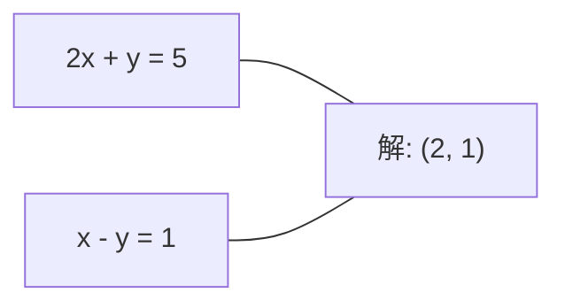
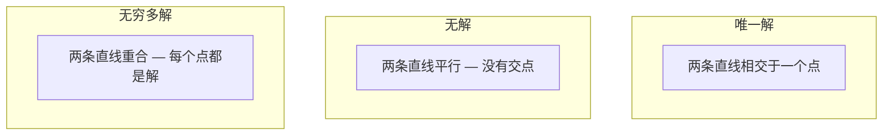

# 线性方程组（Linear Systems）

> 译注：本文译自同目录 [`en.md`](./en.md)。术语遵循仓根 [TRANSLATION_GUIDE.md](../../../../TRANSLATION_GUIDE.md)。

> 求解 Ax = b 是数学里最古老的问题之一，可它今天仍然在你那台神经网络背后默默运转。

**Type:** Build
**Language:** Python
**Prerequisites:** Phase 1, Lessons 01 (Linear Algebra Intuition), 02 (Vectors & Matrices), 03 (Matrix Transformations)
**Time:** ~120 minutes

## 学习目标（Learning Objectives）

- 用带 partial pivoting（部分主元）的高斯消元法和回代解 Ax = b
- 会做 LU、QR、Cholesky 分解，并解释每种分解适合什么场景
- 推导最小二乘的法方程（normal equations），并把它和线性回归、ridge 回归对应起来
- 用条件数（condition number）诊断病态系统，并用正则化让它稳定下来

## 问题（The Problem）

每次训练线性回归，你都在解一个线性方程组。每次做最小二乘拟合，你都在解一个线性方程组。每当神经网络某一层计算 `y = Wx + b`，它就是在求一个线性方程组的一边。当你加上正则化，你修改了这个方程组。当你用高斯过程，你在分解一个矩阵。当你为了 Mahalanobis 距离去求协方差矩阵的逆，你又在解一个线性方程组。

Ax = b 这个等式无处不在。A 是已知系数构成的矩阵，b 是已知输出构成的向量，x 是你想求的未知量向量。在线性回归里，A 是数据矩阵，b 是目标向量，x 是权重向量。整个模型可以归结为一句话：找一个 x，让 Ax 尽可能接近 b。

本节会从零搭建求解这个等式的所有主流方法。你会理解为什么有些方法快、有些方法稳，为什么有些方法只对方阵有效、另一些却能处理超定（overdetermined）方程组，以及为什么矩阵的条件数从根本上决定了你算出来的答案到底有没有意义。

## 概念（The Concept）

### 从几何上看 Ax = b 是什么意思（What Ax = b means geometrically）

线性方程组有几何解释。每个方程定义一张超平面。解就是所有超平面的交点（或交集）。

```
2x + y = 5          Two lines in 2D.
x - y  = 1          They intersect at x=2, y=1.
```



可能出现三种情况：



写成矩阵形式：「唯一解」意味着 A 可逆；「无解」意味着方程组不相容；「无穷多解」意味着 A 有非平凡的零空间。大多数 ML 问题落在「无精确解」这一类——你的方程数（数据点）远多于未知数（参数）。这正是最小二乘登场的地方。

### 列视角 vs 行视角（Column picture vs row picture）

读 Ax = b 有两种方式。

**行视角（Row picture）。** A 的每一行定义一条方程，每条方程是一张超平面。解就是它们交在一起的那个点。

**列视角（Column picture）。** A 的每一列是一个向量。问题变成：A 的列向量做怎样的线性组合能得到 b？

```
A = | 2  1 |    b = | 5 |
    | 1 -1 |        | 1 |

Row picture: solve 2x + y = 5 and x - y = 1 simultaneously.

Column picture: find x1, x2 such that:
  x1 * [2, 1] + x2 * [1, -1] = [5, 1]
  2 * [2, 1] + 1 * [1, -1] = [4+1, 2-1] = [5, 1]   check.
```

列视角更本质。如果 b 落在 A 的列空间里，方程组有解；如果 b 不在列空间里，你就去找列空间里离 b 最近的那个点——那个最近点就是最小二乘解。

### 高斯消元（Gaussian elimination）

高斯消元把 Ax = b 变换成上三角方程组 Ux = c，再用回代解出来。这是最直接的方法。

算法：

```
1. For each column k (the pivot column):
   a. Find the largest entry in column k at or below row k (partial pivoting).
   b. Swap that row with row k.
   c. For each row i below k:
      - Compute multiplier m = A[i][k] / A[k][k]
      - Subtract m times row k from row i.
2. Back substitute: solve from the last equation upward.
```

举个例子：

```
Original:
| 2  1  1 | 8 |       R2 = R2 - (2)R1     | 2  1   1 |  8 |
| 4  3  3 |20 |  -->  R3 = R3 - (1)R1 --> | 0  1   1 |  4 |
| 2  3  1 |12 |                            | 0  2   0 |  4 |

                       R3 = R3 - (2)R2     | 2  1   1 |  8 |
                                       --> | 0  1   1 |  4 |
                                           | 0  0  -2 | -4 |

Back substitute:
  -2 * x3 = -4    -->  x3 = 2
  x2 + 2  = 4     -->  x2 = 2
  2*x1 + 2 + 2 = 8 --> x1 = 2
```

高斯消元的代价是 O(n^3) 次运算。对一个 1000x1000 的方程组来说，大约 10 亿次浮点运算。已经够快了，但如果你需要对同一个 A 反复求解多次，还有更好的办法。

### 部分主元（Partial pivoting: why it matters）

不做主元选取的高斯消元会失败，或者吐出垃圾结果。如果某个主元为零，你就除以零；如果它非常小，你就把舍入误差放大。

```
Bad pivot:                       With partial pivoting:
| 0.001  1 | 1.001 |            Swap rows first:
| 1      1 | 2     |            | 1      1 | 2     |
                                 | 0.001  1 | 1.001 |
m = 1/0.001 = 1000              m = 0.001/1 = 0.001
R2 = R2 - 1000*R1               R2 = R2 - 0.001*R1
| 0.001  1     | 1.001   |      | 1      1     | 2     |
| 0     -999   | -999.0  |      | 0      0.999 | 0.999 |

x2 = 1.000 (correct)            x2 = 1.000 (correct)
x1 = (1.001 - 1)/0.001          x1 = (2 - 1)/1 = 1.000 (correct)
   = 0.001/0.001 = 1.000        Stable because the multiplier is small.
```

在精度有限的浮点运算里，没做主元选取的版本会丢失大量有效数字。partial pivoting 总是把当前列里绝对值最大的元素提为主元，把误差放大降到最低。

### LU 分解（LU decomposition）

LU 分解把 A 分解成下三角矩阵 L 和上三角矩阵 U：A = LU。L 矩阵记录高斯消元用到的乘子，U 矩阵则是消元后的结果。

```
A = L @ U

| 2  1  1 |   | 1  0  0 |   | 2  1   1 |
| 4  3  3 | = | 2  1  0 | @ | 0  1   1 |
| 2  3  1 |   | 1  2  1 |   | 0  0  -2 |
```

为什么要分解，而不是消元解一次完事？因为一旦你拿到 L 和 U，对任意新的 b 求解 Ax = b 只要 O(n^2)：

```
Ax = b
LUx = b
Let y = Ux:
  Ly = b    (forward substitution, O(n^2))
  Ux = y    (back substitution, O(n^2))
```

O(n^3) 的代价只在分解阶段付一次。后续每次求解只要 O(n^2)。如果你要对同一个 A、不同的 b 解 1000 次，LU 把总工作量节省了大约 1000/3 倍。

带 partial pivoting 时，得到的是 PA = LU，其中 P 是记录行交换的置换矩阵。

### QR 分解（QR decomposition）

QR 分解把 A 分解成正交矩阵 Q 和上三角矩阵 R：A = QR。

正交矩阵满足 Q^T Q = I，它的列是一组单位正交向量。乘以 Q 不改变长度也不改变夹角。

```
A = Q @ R

Q has orthonormal columns: Q^T Q = I
R is upper triangular

To solve Ax = b:
  QRx = b
  Rx = Q^T b    (just multiply by Q^T, no inversion needed)
  Back substitute to get x.
```

在解最小二乘问题时，QR 比 LU 数值上更稳定。Gram-Schmidt 过程逐列构造 Q：

```
Given columns a1, a2, ... of A:

q1 = a1 / ||a1||

q2 = a2 - (a2 . q1) * q1        (subtract projection onto q1)
q2 = q2 / ||q2||                (normalize)

q3 = a3 - (a3 . q1) * q1 - (a3 . q2) * q2
q3 = q3 / ||q3||

R[i][j] = qi . aj    for i <= j
```

每一步都把当前向量在所有已有 q 向量方向上的分量减掉，留下来的就是新的正交方向。

### Cholesky 分解（Cholesky decomposition）

当 A 是对称的（A = A^T）且正定（所有特征值都为正）时，可以把它分解成 A = L L^T，其中 L 是下三角矩阵。这就是 Cholesky 分解。

```
A = L @ L^T

| 4  2 |   | 2  0 |   | 2  1 |
| 2  5 | = | 1  2 | @ | 0  2 |

L[i][i] = sqrt(A[i][i] - sum(L[i][k]^2 for k < i))
L[i][j] = (A[i][j] - sum(L[i][k]*L[j][k] for k < j)) / L[j][j]    for i > j
```

Cholesky 比 LU 快一倍，存储只需一半。它只对对称正定矩阵适用，但这种矩阵在 ML 里到处都是：

- 协方差矩阵是对称半正定的（加上正则化后变成正定）。
- 高斯过程里的核矩阵是对称正定的。
- 凸函数在极小点处的 Hessian（海森）是对称正定的。
- A^T A 一定是对称半正定的。

在高斯过程里，先用 Cholesky 分解核矩阵 K，再解 K alpha = y 得到预测均值。Cholesky 因子还能直接给出边际似然要用的对数行列式：log det(K) = 2 * sum(log(diag(L)))。

### 最小二乘：Ax = b 没有精确解时（Least squares: when Ax = b has no exact solution）

如果 A 是 m x n 矩阵且 m > n（方程数多于未知数），方程组就是超定的，没有精确解。这时你转而最小化平方误差：

```
minimize ||Ax - b||^2

This is the sum of squared residuals:
  sum((A[i,:] @ x - b[i])^2 for i in range(m))
```

最小化点满足法方程（normal equations）：

```
A^T A x = A^T b
```

推导：展开 ||Ax - b||^2 = (Ax - b)^T (Ax - b) = x^T A^T A x - 2 x^T A^T b + b^T b。对 x 求梯度并令其为零：2 A^T A x - 2 A^T b = 0。

```
Original system (overdetermined, 4 equations, 2 unknowns):
| 1  1 |         | 3 |
| 1  2 | x     = | 5 |       No exact x satisfies all 4 equations.
| 1  3 |         | 6 |
| 1  4 |         | 8 |

Normal equations:
A^T A = | 4  10 |    A^T b = | 22 |
        | 10 30 |            | 63 |

Solve: x = [1.5, 1.7]

This is linear regression. x[0] is the intercept, x[1] is the slope.
```

### 法方程 = 线性回归（Normal equations = linear regression）

这是一一对应的关系。在线性回归里，数据矩阵 X 一行一个样本、一列一个特征；目标向量 y 一行一个样本。权重向量 w 满足：

```
X^T X w = X^T y
w = (X^T X)^(-1) X^T y
```

这就是线性回归的闭式解。每次调用 `sklearn.linear_model.LinearRegression.fit()`，背后都在算这个（或者通过 QR、SVD 算等价的版本）。

把正则项 lambda * I 加到矩阵里，就得到了 ridge 回归：

```
(X^T X + lambda * I) w = X^T y
w = (X^T X + lambda * I)^(-1) X^T y
```

这一项让矩阵的条件更好（更容易精确求逆），同时通过把权重往零方向收缩来防止过拟合。当 lambda > 0 时，矩阵 X^T X + lambda * I 必为对称正定，所以可以用 Cholesky 来解。

### 伪逆（Pseudoinverse, Moore-Penrose）

伪逆 A+ 把矩阵求逆推广到非方阵和奇异矩阵的情形。对任意矩阵 A：

```
x = A+ b

where A+ = V Sigma+ U^T    (computed via SVD)
```

Sigma+ 的构造方法是：把每个非零奇异值取倒数，再做转置。如果 A = U Sigma V^T，那么 A+ = V Sigma+ U^T。

```
A = U Sigma V^T        (SVD)

Sigma = | 5  0 |       Sigma+ = | 1/5  0  0 |
        | 0  2 |                | 0  1/2  0 |
        | 0  0 |

A+ = V Sigma+ U^T
```

伪逆给出最小范数最小二乘解。具体地：
- 若方程组有唯一解：A+ b 就是这个解。
- 若方程组无解：A+ b 给出最小二乘解。
- 若方程组有无穷多解：A+ b 给出 ||x|| 最小的那个。

NumPy 的 `np.linalg.lstsq` 和 `np.linalg.pinv` 内部都用了 SVD。

### 条件数（Condition number）

条件数衡量解对输入微小变化的敏感程度。对矩阵 A 来说：

```
kappa(A) = ||A|| * ||A^(-1)|| = sigma_max / sigma_min
```

其中 sigma_max 和 sigma_min 是最大、最小奇异值。

```
Well-conditioned (kappa ~ 1):        Ill-conditioned (kappa ~ 10^15):
Small change in b -->                Small change in b -->
small change in x                    huge change in x

| 2  0 |   kappa = 2/1 = 2          | 1   1          |   kappa ~ 10^15
| 0  1 |   safe to solve            | 1   1+10^(-15) |   solution is garbage
```

经验法则：
- kappa < 100：安全，解的精度有保证。
- kappa ~ 10^k：浮点运算大约会丢掉 k 位精度。
- kappa ~ 10^16（对 float64 而言）：解毫无意义，矩阵实际上等同奇异。

在 ML 里，病态通常发生在特征近乎共线的时候。正则化（加 lambda * I）会把条件数从 sigma_max / sigma_min 改善到 (sigma_max + lambda) / (sigma_min + lambda)。

### 迭代法：共轭梯度（Iterative methods: conjugate gradient）

对于非常大的稀疏方程组（百万级未知数），LU、Cholesky 这种直接法太贵了。迭代法通过反复改进一个初猜来逼近解。

共轭梯度（CG）解 Ax = b，要求 A 对称正定。在精确算术下它最多 n 步就给出精确解；如果 A 的特征值聚集得好，实际收敛会快得多。

```
Algorithm sketch:
  x0 = initial guess (often zero)
  r0 = b - A x0           (residual)
  p0 = r0                 (search direction)

  For k = 0, 1, 2, ...:
    alpha = (rk . rk) / (pk . A pk)
    x_{k+1} = xk + alpha * pk
    r_{k+1} = rk - alpha * A pk
    beta = (r_{k+1} . r_{k+1}) / (rk . rk)
    p_{k+1} = r_{k+1} + beta * pk
    if ||r_{k+1}|| < tolerance: stop
```

CG 用在：
- 大规模优化（Newton-CG 方法）
- PDE 离散后的线性系统求解
- 核矩阵太大、做不了分解的核方法
- 给其他迭代求解器做预处理

收敛速度依赖条件数。条件数越好，收敛越快——这是正则化又一个有用的副作用。

### 全景图：什么时候用哪种方法（The full picture: which method when）

| Method | Requirements | Cost | Use case |
|--------|-------------|------|----------|
| Gaussian elimination | Square, nonsingular A | O(n^3) | One-off solve of a square system |
| LU decomposition | Square, nonsingular A | O(n^3) factor + O(n^2) solve | Multiple solves with the same A |
| QR decomposition | Any A (m >= n) | O(mn^2) | Least squares, numerically stable |
| Cholesky | Symmetric positive definite A | O(n^3/3) | Covariance matrices, Gaussian processes, ridge regression |
| Normal equations | Overdetermined (m > n) | O(mn^2 + n^3) | Linear regression (small n) |
| SVD / pseudoinverse | Any A | O(mn^2) | Rank-deficient systems, minimum-norm solutions |
| Conjugate gradient | Symmetric positive definite, sparse A | O(n * k * nnz) | Large sparse systems, k = iterations |

### 跟 ML 的联系（Connection to ML）

本节里的每一种方法都活跃在生产 ML 中：

**线性回归（Linear regression）。** 闭式解就是法方程 X^T X w = X^T y。具体可以用 Cholesky（n 不大时）、QR（在意数值稳定性时）或 SVD（矩阵可能秩亏时）来解。

**Ridge 回归（Ridge regression）。** 在 X^T X 上加 lambda * I。当 lambda > 0 时，正则化后的方程组 (X^T X + lambda * I) w = X^T y 必然可以用 Cholesky 求解，因为 X^T X + lambda * I 一定是对称正定的。

**高斯过程（Gaussian processes）。** 预测均值需要解 K alpha = y，K 是核矩阵。标准做法是对 K 做 Cholesky 分解。对数边际似然里的 log det(K) = 2 sum(log(diag(L))) 也直接来自 Cholesky 因子。

**神经网络初始化（Neural network initialization）。** 正交初始化用 QR 分解构造列正交的权重矩阵，这能避免深网络中信号坍缩。

**预处理（Preconditioning）。** 大规模优化器常用不完全 Cholesky 或不完全 LU 作为共轭梯度求解器的预处理子。

**特征工程（Feature engineering）。** X^T X 的条件数能告诉你特征是不是共线。如果 kappa 很大，要么删特征，要么加正则化。

## 动手实现（Build It）

### Step 1：带 partial pivoting 的高斯消元（Gaussian elimination with partial pivoting）

```python
import numpy as np

def gaussian_elimination(A, b):
    n = len(b)
    Ab = np.hstack([A.astype(float), b.reshape(-1, 1).astype(float)])

    for k in range(n):
        max_row = k + np.argmax(np.abs(Ab[k:, k]))
        Ab[[k, max_row]] = Ab[[max_row, k]]

        if abs(Ab[k, k]) < 1e-12:
            raise ValueError(f"Matrix is singular or nearly singular at pivot {k}")

        for i in range(k + 1, n):
            m = Ab[i, k] / Ab[k, k]
            Ab[i, k:] -= m * Ab[k, k:]

    x = np.zeros(n)
    for i in range(n - 1, -1, -1):
        x[i] = (Ab[i, -1] - Ab[i, i+1:n] @ x[i+1:n]) / Ab[i, i]

    return x
```

### Step 2：LU 分解（LU decomposition）

```python
def lu_decompose(A):
    n = A.shape[0]
    L = np.eye(n)
    U = A.astype(float).copy()
    P = np.eye(n)

    for k in range(n):
        max_row = k + np.argmax(np.abs(U[k:, k]))
        if max_row != k:
            U[[k, max_row]] = U[[max_row, k]]
            P[[k, max_row]] = P[[max_row, k]]
            if k > 0:
                L[[k, max_row], :k] = L[[max_row, k], :k]

        for i in range(k + 1, n):
            L[i, k] = U[i, k] / U[k, k]
            U[i, k:] -= L[i, k] * U[k, k:]

    return P, L, U

def lu_solve(P, L, U, b):
    n = len(b)
    Pb = P @ b.astype(float)

    y = np.zeros(n)
    for i in range(n):
        y[i] = Pb[i] - L[i, :i] @ y[:i]

    x = np.zeros(n)
    for i in range(n - 1, -1, -1):
        x[i] = (y[i] - U[i, i+1:] @ x[i+1:]) / U[i, i]

    return x
```

### Step 3：Cholesky 分解（Cholesky decomposition）

```python
def cholesky(A):
    n = A.shape[0]
    L = np.zeros_like(A, dtype=float)

    for i in range(n):
        for j in range(i + 1):
            s = A[i, j] - L[i, :j] @ L[j, :j]
            if i == j:
                if s <= 0:
                    raise ValueError("Matrix is not positive definite")
                L[i, j] = np.sqrt(s)
            else:
                L[i, j] = s / L[j, j]

    return L
```

### Step 4：用法方程做最小二乘（Least squares via normal equations）

```python
def least_squares_normal(A, b):
    AtA = A.T @ A
    Atb = A.T @ b
    return gaussian_elimination(AtA, Atb)

def ridge_regression(A, b, lam):
    n = A.shape[1]
    AtA = A.T @ A + lam * np.eye(n)
    Atb = A.T @ b
    L = cholesky(AtA)
    y = np.zeros(n)
    for i in range(n):
        y[i] = (Atb[i] - L[i, :i] @ y[:i]) / L[i, i]
    x = np.zeros(n)
    for i in range(n - 1, -1, -1):
        x[i] = (y[i] - L.T[i, i+1:] @ x[i+1:]) / L.T[i, i]
    return x
```

### Step 5：条件数（Condition number）

```python
def condition_number(A):
    U, S, Vt = np.linalg.svd(A)
    return S[0] / S[-1]
```

## 用起来（Use It）

把这些零件拼起来，跑一下真实数据上的线性回归与 ridge 回归：

```python
np.random.seed(42)
X_raw = np.random.randn(100, 3)
w_true = np.array([2.0, -1.0, 0.5])
y = X_raw @ w_true + np.random.randn(100) * 0.1

X = np.column_stack([np.ones(100), X_raw])

w_ols = least_squares_normal(X, y)
print(f"OLS weights (ours):    {w_ols}")

w_np = np.linalg.lstsq(X, y, rcond=None)[0]
print(f"OLS weights (numpy):   {w_np}")
print(f"Max difference: {np.max(np.abs(w_ols - w_np)):.2e}")

w_ridge = ridge_regression(X, y, lam=1.0)
print(f"Ridge weights (ours):  {w_ridge}")

from sklearn.linear_model import Ridge
ridge_sk = Ridge(alpha=1.0, fit_intercept=False)
ridge_sk.fit(X, y)
print(f"Ridge weights (sklearn): {ridge_sk.coef_}")
```

## 上线部署（Ship It）

本节产出：
- `code/linear_systems.py`，包含从零实现的高斯消元、LU 分解、Cholesky 分解、最小二乘和 ridge 回归
- 一个跑通的演示，验证法方程解出的权重与 sklearn 的 LinearRegression 完全一致

## 练习（Exercises）

1. 用你的高斯消元、你的 LU solver 和 `np.linalg.solve` 三种方法解 `[[1,2,3],[4,5,6],[7,8,10]] x = [6, 15, 27]`。在浮点精度容差范围内验证三种结果一致。

2. 生成 50x5 的随机矩阵 X 和 y = X @ w_true + noise。分别用法方程、QR（`np.linalg.qr`）、SVD（`np.linalg.svd`）和 `np.linalg.lstsq` 求 w。对比这四个解。算一下 X^T X 的条件数，说明它如何影响你对各方法的信任度。

3. 构造一个近奇异矩阵：让两列几乎一致（比如第 2 列 = 第 1 列 + 1e-10 * noise）。算它的条件数。分别在加正则化（加 0.01 * I）和不加正则化的情况下解 Ax = b。对比解和残差，解释为什么正则化有帮助。

4. 对一个 100x100 的随机对称正定矩阵实现共轭梯度算法。统计要多少次迭代才能收敛到 1e-8 容差。和理论上限 n 次迭代做对比。

5. 把你的 Cholesky solver、LU solver 和 `np.linalg.solve` 在 10、50、200、500 大小的对称正定矩阵上做计时。把结果画出来，验证 Cholesky 比 LU 大约快 2 倍。

## 关键术语（Key Terms）

| Term | What people say | What it actually means |
|------|----------------|----------------------|
| Linear system | "Solve for x" | 一组线性方程 Ax = b。求 x 就是在变换 A 下找到能输出 b 的那个输入。 |
| Gaussian elimination | "Row reduce" | 用行变换系统性地把对角线下方元素清零，得到上三角方程组，再用回代解出来。O(n^3)。 |
| Partial pivoting | "Swap rows for stability" | 在第 k 列消元前，把该列里绝对值最大的那一行换到主元位置，避免除以小数。 |
| LU decomposition | "Factor into triangles" | 写 A = LU，L 是下三角（存乘子）、U 是上三角（消元结果）。把 O(n^3) 的代价摊到多次求解上。 |
| QR decomposition | "Orthogonal factorization" | 写 A = QR，Q 列正交、R 上三角。在最小二乘里比 LU 更稳定。 |
| Cholesky decomposition | "Square root of a matrix" | 对称正定 A 写成 A = LL^T。代价是 LU 的一半。用于协方差矩阵、核矩阵和 ridge 回归。 |
| Least squares | "Best fit when exact is impossible" | 在超定方程组（方程多于未知数）下最小化残差平方和 ||Ax - b||^2。 |
| Normal equations | "The calculus shortcut" | A^T A x = A^T b。把 ||Ax - b||^2 的梯度置零得到的方程，**就是**线性回归的闭式解。 |
| Pseudoinverse | "Inversion for non-square matrices" | A+ = V Sigma+ U^T，由 SVD 给出。对任意矩阵（方阵或矩形、奇异或非奇异）给出最小范数最小二乘解。 |
| Condition number | "How trustworthy is this answer" | kappa = sigma_max / sigma_min。衡量解对输入扰动的敏感度。约丢掉 log10(kappa) 位精度。 |
| Ridge regression | "Regularized least squares" | 解 (X^T X + lambda I) w = X^T y。加 lambda I 改善条件数并把权重往零收缩，防止过拟合。 |
| Conjugate gradient | "Iterative Ax=b for big matrices" | 对称正定方程组的迭代求解器。最多 n 步收敛。在大规模稀疏问题（分解太贵）下实用。 |
| Overdetermined system | "More data than parameters" | m x n 方程组里 m > n。不存在精确解。最小二乘给出最佳近似。每个回归问题都是这种。 |
| Back substitution | "Solve from the bottom up" | 给定上三角方程组，先解最后一条方程，再往上代回。O(n^2)。 |
| Forward substitution | "Solve from the top down" | 给定下三角方程组，先解第一条方程，再往下代。O(n^2)。LU 求解的 L 步用到。 |

## 延伸阅读（Further Reading）

- [MIT 18.06: Linear Algebra](https://ocw.mit.edu/courses/18-06-linear-algebra-spring-2010/)（Gilbert Strang）—— 线性方程组与矩阵分解的权威课程
- [Numerical Linear Algebra](https://people.maths.ox.ac.uk/trefethen/text.html)（Trefethen & Bau）—— 理解数值稳定性、条件性和算法为何失败的标准参考
- [Matrix Computations](https://www.cs.cornell.edu/cv/GolubVanLoan4/golubandvanloan.htm)（Golub & Van Loan）—— 各种矩阵算法的百科全书式参考
- [3Blue1Brown: Inverse Matrices](https://www.3blue1brown.com/lessons/inverse-matrices) —— 直观可视化解 Ax = b 在几何上意味着什么
