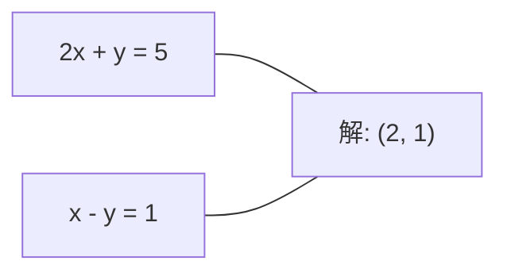
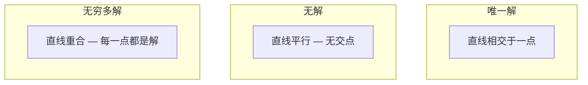

# 线性系统 (Linear Systems)

> 求解 Ax = b 是数学中最古老的问题，至今仍在驱动你的神经网络。

**类型：** 构建
**语言：** Python
**先修知识：** 阶段 1，课程 01（线性代数直觉），02（向量与矩阵），03（矩阵变换）
**时长：** 约 120 分钟

## 学习目标

- 使用带部分主元的高斯消元法和回代法求解 Ax = b
- 通过 LU、QR 和 Cholesky 分解对矩阵进行分解，并解释每种分解的适用场景
- 推导最小二乘的正规方程，并将其与线性回归和岭回归联系起来
- 使用条件数诊断病态系统，并应用正则化来稳定它们

## 问题

每次训练线性回归时，你都在求解一个线性系统。每次计算最小二乘拟合时，你都在求解一个线性系统。每次神经网络层计算 `y = Wx + b` 时，它都在评估一个线性系统的一侧。当你添加正则化时，你修改了这个系统。当你使用高斯过程时，你对矩阵进行分解。当你为马氏距离 (Mahalanobis distance) 求协方差矩阵的逆时，你也在求解一个线性系统。

方程 Ax = b 无处不在。A 是已知系数的矩阵。b 是已知输出的向量。x 是你要找的未知向量。在线性回归中，A 是你的数据矩阵，b 是你的目标向量，x 是权重向量。整个模型归结为：找到 x 使得 Ax 尽可能接近 b。

本节课从头构建求解该方程的每一种主要方法。你将理解为什么有些方法快而另一些稳定，为什么有些只适用于方阵系统而另一些处理过定系统，以及为什么矩阵的条件数决定了你的答案是否有意义。

## 概念

### Ax = b 的几何意义

线性方程组有几何解释。每个方程定义一个超平面。解是所有超平面相交的点（或点集）。

```
2x + y = 5          二维中的两条直线。
x - y  = 1          它们在 x=2, y=1 处相交。
```



可能发生三种情况：



在矩阵形式中，“唯一解”意味着 A 可逆。“无解”意味着系统不一致。“无穷多解”意味着 A 有零空间。大多数机器学习问题属于“无精确解”类别，因为你的方程（数据点）多于未知数（参数）。这就是最小二乘的用武之地。

### 列图像 vs 行图像

有两种方式理解 Ax = b。

**行图像。** A 的每一行定义一个方程。每个方程是一个超平面。解是它们相交的地方。

**列图像。** A 的每一列是一个向量。问题变成：A 的列的什么线性组合产生 b？

```
A = | 2  1 |    b = | 5 |
    | 1 -1 |        | 1 |

行图像：同时求解 2x + y = 5 和 x - y = 1。

列图像：找到 x1, x2 使得：
  x1 * [2, 1] + x2 * [1, -1] = [5, 1]
  2 * [2, 1] + 1 * [1, -1] = [4+1, 2-1] = [5, 1]   验证。
```

列图像更基础。如果 b 位于 A 的列空间中，系统有解。如果 b 不在，则找到列空间中最接近的点。那个最接近的点就是最小二乘解。

### 高斯消元法 (Gaussian elimination)

高斯消元法将 Ax = b 转化为上三角系统 Ux = c，然后通过回代求解。这是最直接的方法。

算法：

```
1. 对于每一列 k（主元列）：
   a. 在列 k 中，找出从行 k 开始的最大元素（部分主元）。
   b. 将该行与行 k 交换。
   c. 对于行 k 下方的每一行 i：
      - 计算乘子 m = A[i][k] / A[k][k]
      - 从行 i 中减去 m 乘以行 k。
2. 回代：从最后一个方程向上求解。
```

示例：

```
原始：
| 2  1  1 | 8 |       R2 = R2 - (2)R1     | 2  1   1 |  8 |
| 4  3  3 |20 |  -->  R3 = R3 - (1)R1 --> | 0  1   1 |  4 |
| 2  3  1 |12 |                            | 0  2   0 |  4 |

                       R3 = R3 - (2)R2     | 2  1   1 |  8 |
                                       --> | 0  1   1 |  4 |
                                           | 0  0  -2 | -4 |

回代：
  -2 * x3 = -4    -->  x3 = 2
  x2 + 2  = 4     -->  x2 = 2
  2*x1 + 2 + 2 = 8 --> x1 = 2
```

高斯消元法的时间复杂度为 O(n^3)。对于一个 1000x1000 的系统，大约是十亿次浮点运算。很快，但如果你需要用同一个 A 求解多个系统，你可以做得更好。

### 部分主元法 (Partial pivoting)：为何重要

没有主元法，高斯消元可能失败或产生垃圾结果。如果主元为零，你除以零。如果主元很小，你会放大舍入误差。

```
不好的主元：                      带部分主元：
| 0.001  1 | 1.001 |            先交换行：
| 1      1 | 2     |            | 1      1 | 2     |
                                 | 0.001  1 | 1.001 |
m = 1/0.001 = 1000              m = 0.001/1 = 0.001
R2 = R2 - 1000*R1               R2 = R2 - 0.001*R1
| 0.001  1     | 1.001   |      | 1      1     | 2     |
| 0     -999   | -999.0  |      | 0      0.999 | 0.999 |

x2 = 1.000 (正确)               x2 = 1.000 (正确)
x1 = (1.001 - 1)/0.001          x1 = (2 - 1)/1 = 1.000 (正确)
   = 0.001/0.001 = 1.000        稳定，因为乘子很小。
```

在精度有限的浮点运算中，无主元版本可能丢失有效数字。部分主元总是选择最大的可用主元，以最小化误差放大。

### LU 分解 (LU decomposition)

LU 分解将 A 分解为下三角矩阵 L 和上三角矩阵 U：A = LU。L 矩阵存储高斯消元中的乘子。U 矩阵是消元的结果。

```
A = L @ U

| 2  1  1 |   | 1  0  0 |   | 2  1   1 |
| 4  3  3 | = | 2  1  0 | @ | 0  1   1 |
| 2  3  1 |   | 1  2  1 |   | 0  0  -2 |
```

为什么不直接消元而要分解？因为一旦你有了 L 和 U，任意新 b 求解 Ax = b 仅需 O(n^2)：

```
Ax = b
LUx = b
令 y = Ux：
  Ly = b    (前代，O(n^2))
  Ux = y    (回代，O(n^2))
```

O(n^3) 的代价在分解时只支付一次。随后的每次求解都是 O(n^2)。如果你需要求解 1000 个具有相同 A 但不同 b 向量的系统，LU 节省了约 1000/3 倍的总工作量。

结合部分主元，你得到 PA = LU，其中 P 是记录行交换的置换矩阵。

### QR 分解 (QR decomposition)

QR 分解将 A 分解为正交矩阵 Q 和上三角矩阵 R：A = QR。

正交矩阵具有性质 Q^T Q = I。它的列是标准正交向量。乘以 Q 会保持长度和角度。

```
A = Q @ R

Q 有标准正交列：Q^T Q = I
R 是上三角矩阵

求解 Ax = b：
  QRx = b
  Rx = Q^T b    (只需乘以 Q^T，无需求逆)
  回代得到 x。
```

对于求解最小二乘问题，QR 在数值上比 LU 更稳定。Gram-Schmidt 过程逐列构建 Q：

```
给定 A 的列 a1, a2, ...：

q1 = a1 / ||a1||

q2 = a2 - (a2 . q1) * q1        (减去在 q1 上的投影)
q2 = q2 / ||q2||                (归一化)

q3 = a3 - (a3 . q1) * q1 - (a3 . q2) * q2
q3 = q3 / ||q3||

R[i][j] = qi . aj    for i <= j
```

每一步移除沿所有先前 q 向量的分量，只留下新的正交方向。

### Cholesky 分解 (Cholesky decomposition)

当 A 对称（A = A^T）且正定（所有特征值为正）时，你可以将其分解为 A = L L^T，其中 L 是下三角矩阵。这就是 Cholesky 分解。

```
A = L @ L^T

| 4  2 |   | 2  0 |   | 2  1 |
| 2  5 | = | 1  2 | @ | 0  2 |

L[i][i] = sqrt(A[i][i] - sum(L[i][k]^2 for k < i))
L[i][j] = (A[i][j] - sum(L[i][k]*L[j][k] for k < j)) / L[j][j]    for i > j
```

Cholesky 速度是 LU 的两倍，且只需要一半的存储空间。它只适用于对称正定矩阵，但这些矩阵随处可见：

- 协方差矩阵是对称半正定的（加上正则化后正定）。
- 高斯过程中的核矩阵是对称正定的。
- 凸函数在最小值处的黑塞矩阵 (Hessian) 是对称正定的。
- A^T A 总是对称半正定的。

在高斯过程中，你用 Cholesky 分解核矩阵 K，然后求解 K alpha = y 得到预测均值。Cholesky 因子还给出了边际似然的对数行列式：log det(K) = 2 * sum(log(diag(L)))。

### 最小二乘法 (Least squares)：当 Ax = b 没有精确解时

如果 A 是 m x n 且 m > n（方程多于未知数），则系统是过定的。没有精确解。相反，你最小化平方误差：

```
最小化 ||Ax - b||^2

这是残差平方和：
  sum((A[i,:] @ x - b[i])^2 for i in range(m))
```

极小值满足正规方程 (normal equations)：

```
A^T A x = A^T b
```

推导：展开 ||Ax - b||^2 = (Ax - b)^T (Ax - b) = x^T A^T A x - 2 x^T A^T b + b^T b。对 x 求梯度，设为零：2 A^T A x - 2 A^T b = 0。

```
原始系统（过定，4 个方程，2 个未知数）：
| 1  1 |         | 3 |
| 1  2 | x     = | 5 |       没有精确的 x 能满足所有 4 个方程。
| 1  3 |         | 6 |
| 1  4 |         | 8 |

正规方程：
A^T A = | 4  10 |    A^T b = | 22 |
        | 10 30 |            | 63 |

求解：x = [1.5, 1.7]

这就是线性回归。x[0] 是截距，x[1] 是斜率。
```

### 正规方程 (Normal equations) = 线性回归

联系是精确的。在线性回归中，你的数据矩阵 X 每行一个样本，每列一个特征。你的目标向量 y 每个样本一个条目。权重向量 w 满足：

```
X^T X w = X^T y
w = (X^T X)^(-1) X^T y
```

这就是线性回归的闭式解。每次调用 `sklearn.linear_model.LinearRegression.fit()` 都会计算这个（或者通过 QR 或 SVD 的等价形式）。

在矩阵中添加正则化项 lambda * I，就得到岭回归 (ridge regression)：

```
(X^T X + lambda * I) w = X^T y
w = (X^T X + lambda * I)^(-1) X^T y
```

正则化使矩阵更良态（更容易精确求逆），并通过将权重向零收缩来防止过拟合。当 lambda > 0 时，矩阵 X^T X + lambda * I 总是对称正定的，因此你可以使用 Cholesky 求解。

### 伪逆 (Pseudoinverse) (Moore-Penrose)

伪逆 A+ 将矩阵求逆推广到非方阵和奇异矩阵。对于任意矩阵 A：

```
x = A+ b

其中 A+ = V Sigma+ U^T    (通过 SVD 计算)
```

Sigma+ 是通过取每个非零奇异值的倒数并转置结果形成的。如果 A = U Sigma V^T，则 A+ = V Sigma+ U^T。

```
A = U Sigma V^T        (SVD)

Sigma = | 5  0 |       Sigma+ = | 1/5  0  0 |
        | 0  2 |                | 0  1/2  0 |
        | 0  0 |

A+ = V Sigma+ U^T
```

伪逆给出最小范数的最小二乘解。如果系统有：
- 唯一解：A+ b 给出它。
- 无解：A+ b 给出最小二乘解。
- 无穷多解：A+ b 给出具有最小 ||x|| 的解。

NumPy 的 `np.linalg.lstsq` 和 `np.linalg.pinv` 内部都使用 SVD。

### 条件数 (Condition number)

条件数衡量解对输入微小变化的敏感程度。对于矩阵 A，条件数为：

```
kappa(A) = ||A|| * ||A^(-1)|| = sigma_max / sigma_min
```

其中 sigma_max 和 sigma_min 是最大和最小奇异值。

```
良态 (kappa ~ 1)：              病态 (kappa ~ 10^15)：
b 的小变化 -->                   b 的小变化 -->
x 的小变化                       x 的巨大变化

| 2  0 |   kappa = 2/1 = 2      | 1   1          |   kappa ~ 10^15
| 0  1 |   求解安全              | 1   1+10^(-15) |   解是垃圾
```

经验法则：
- kappa < 100：安全，解是准确的。
- kappa ~ 10^k：你会从浮点算术中损失大约 k 位精度。
- kappa ~ 10^16（对于 float64）：解毫无意义。矩阵实际上奇异。

在机器学习中，当特征几乎共线时会发生病态。正则化（添加 lambda * I）将条件数从 sigma_max / sigma_min 改善为 (sigma_max + lambda) / (sigma_min + lambda)。

### 迭代方法：共轭梯度法 (Conjugate gradient)

对于非常大的稀疏系统（数百万个未知数），直接方法如 LU 或 Cholesky 太昂贵。迭代方法通过多次迭代改进猜测来近似解。

共轭梯度法 (CG) 求解 Ax = b，其中 A 对称正定。它在最多 n 次迭代中找到精确解（精确算术中），但通常如果 A 的特征值聚集在一起，收敛会快得多。

```
算法草图：
  x0 = 初始猜测（通常为零）
  r0 = b - A x0           (残差)
  p0 = r0                 (搜索方向)

  For k = 0, 1, 2, ...:
    alpha = (rk . rk